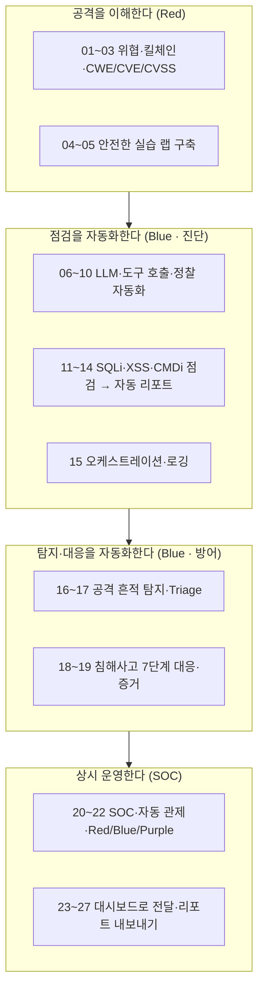

# 비주얼 리포트 내보내기 — 그리고 우리가 만든 것

23강부터 우리는 터미널에서 돌던 점검·관제 결과를 **브라우저 화면**으로 옮겨 왔습니다. 발견 항목이 표로 정리되고, 심각도가 차트로 보이고, 탐지 이벤트가 한눈에 들어옵니다. 이제 마지막 한 조각이 남았습니다. **그 결과를 화면 밖으로 꺼내는 일**입니다.

> **🎯 우리가 지금 왜 이걸 하나요?**  
> 아무리 정확한 점검·관제 결과라도 **전달되지 않으면 절반의 가치**입니다. 00강에서 우리가 잡았던 도착점을 떠올려 봅니다. "스스로 점검하고, 탐지하고, 대응하고, 그 결과를 사람에게 전달하는 자동화"였습니다. 그런데 경영진·규제기관·기술조직은 **화면을 들여다보지 않습니다.** 그들은 회의 자료로, 감사 증빙으로, 이메일 첨부로 받을 수 있는 **문서**를 원합니다. 화면은 만든 사람만 보고, 문서는 받은 사람이 봅니다. 14강(자동 리포트)·19강(사고 보고서)에서 배운 그 보고서를, 이제 대시보드에서 **버튼 한 번**으로 내보냅니다.
{: .prompt-info }

이 글에서 다루는 것:

1. 리포트에 무엇을 담을 것인가
2. 결과를 Markdown 문서로 렌더링하기
3. `st.download_button`으로 .md 내려받기
4. HTML로도 내보내기
5. PDF는 어떻게 할까 — HTML + 브라우저 인쇄(Ctrl+P) 권장
6. 보안 주의 — 리포트는 그 자체가 민감정보
7. 시리즈를 마치며 — 우리가 만든 것

---

## 1. 리포트에 무엇을 담을 것인가

리포트는 "있는 데이터를 다 쏟아내는 것"이 아닙니다. **받는 사람이 결정을 내릴 수 있도록** 정리하는 것입니다. 19강에서 사고 보고서의 뼈대를 "무슨 일이 / 왜 / 얼마나 / 무엇을 바꿀까"로 잡았습니다. 점검·관제 리포트도 같은 뼈대를 따릅니다.

| 섹션 | 담을 내용 | 어디서 왔나 |
|---|---|---|
| **점검 요약** | 발견 수, 심각도 분포(상/중/하) | 11~12강 스캔, 24~25강 표·차트 |
| **발견 상세** | 항목별 CWE / CVE / CVSS / 위치 | 03강 분류 체계, 14강 리포트 |
| **관제 요약** | 탐지된 경보·인시던트·대응 결과 | 16~21강 탐지/관제 루프 |
| **권고 사항** | 무엇을 먼저 고쳐야 하는가 | 14강 우선순위 |

> 순서가 중요합니다. **요약이 맨 앞**에 옵니다. 바쁜 의사결정자는 첫 화면(또는 첫 페이지)만 보고 "심각한 게 몇 건이고, 뭘 먼저 해야 하나"를 알 수 있어야 합니다. 상세 내역은 그 뒤에 붙입니다.
{: .prompt-tip }

---

## 2. 결과를 Markdown 문서로 렌더링하기

화면에 이미 쌓아 둔 결과는 어디에 있을까요? 23강에서 강조했듯 Streamlit은 매번 전체를 다시 실행하기 때문에, 결과는 `st.session_state`에 보관해 두었습니다. 점검 결과는 `st.session_state["findings"]`(24강 스키마), 관제 경보는 `st.session_state["alerts"]`(26강 스키마)에 들어 있습니다. 리포트 함수는 이 두 리스트를 그대로 받아 문서로 바꿉니다.

이 데이터를 **Markdown 문자열**로 바꾸는 함수를 만듭니다. Markdown을 고르는 이유는 단순합니다. 사람이 그냥 읽어도 되고, HTML·PDF로 바꾸기도 쉽고, GitHub·노션·메신저에 붙여 넣어도 모양이 유지되기 때문입니다.

```python
# report.py
from datetime import datetime

# 심각도 순서 — 8부 전체 공용 (24강 SEVERITY_ORDER와 동일)
SEVERITY_ORDER = ["Critical", "High", "Medium", "Low"]


def severity_counts(findings):
    """발견 항목을 심각도별로 센다 (Critical/High/Medium/Low)."""
    counts = {sev: 0 for sev in SEVERITY_ORDER}
    for f in findings:
        sev = f.get("severity", "Low")
        counts[sev] = counts.get(sev, 0) + 1
    return counts


def render_markdown(target, findings, alerts):
    """세션에 쌓인 결과(findings + alerts)를 하나의 Markdown 문서로 만든다."""
    now = datetime.now().strftime("%Y-%m-%d %H:%M")
    counts = severity_counts(findings)

    lines = []
    # ── 머리말 ───────────────────────────────
    lines.append(f"# 보안 점검·관제 리포트")
    lines.append("")
    lines.append(f"- **대상**: {target}")
    lines.append(f"- **생성 시각**: {now}")
    lines.append("")

    # ── 1) 점검 요약 ─────────────────────────
    lines.append("## 1. 점검 요약")
    lines.append("")
    lines.append(f"- 총 발견: **{len(findings)}건**")
    lines.append(
        f"- 심각도 분포 — Critical {counts['Critical']} / High {counts['High']} / "
        f"Medium {counts['Medium']} / Low {counts['Low']}"
    )
    lines.append("")

    # ── 2) 발견 상세 (표) ────────────────────
    lines.append("## 2. 발견 상세")
    lines.append("")
    lines.append("| 심각도 | 항목 | CWE | CVE | CVSS | 위치 |")
    lines.append("|---|---|---|---|---|---|")
    for f in findings:
        lines.append(
            f"| {f.get('severity','-')} "
            f"| {f.get('name','-')} "
            f"| {f.get('cwe','-')} "
            f"| {f.get('cve','-')} "
            f"| {f.get('cvss','-')} "
            f"| {f.get('url','-')} |"
        )
    lines.append("")

    # ── 3) 관제 요약 ─────────────────────────
    lines.append("## 3. 관제 요약")
    lines.append("")
    if alerts:
        for a in alerts:
            lines.append(
                f"- **{a.get('time','-')}** "
                f"[{a.get('verdict','-')}] "
                f"`{a.get('src_ip','-')}` — {a.get('reason','-')} "
                f"→ 권장 대응: {a.get('recommended','검토 대기')}"
            )
    else:
        lines.append("- 기록된 경보가 없습니다.")
    lines.append("")

    # ── 4) 권고 사항 ─────────────────────────
    lines.append("## 4. 권고 사항")
    lines.append("")
    urgent = counts["Critical"] + counts["High"]
    if urgent > 0:
        lines.append(
            f"1. **Critical {counts['Critical']}건·High {counts['High']}건을 "
            f"최우선으로 조치**합니다."
        )
    lines.append("2. 발견 상세의 CWE/CVE를 근거로 패치·설정 변경을 진행합니다.")
    lines.append("3. CVSS 점수는 AI 추정값이므로 담당자가 재검토합니다.")
    lines.append("")

    return "\n".join(lines)
```

함수가 하는 일은 단순합니다. 리스트를 돌면서 **글자(텍스트)를 한 줄씩 쌓는 것**입니다. `lines`라는 리스트에 문자열을 차곡차곡 넣고, 마지막에 `"\n".join(...)`으로 줄바꿈을 끼워 하나의 긴 문서로 합칩니다. 어려운 템플릿 엔진 없이, 파이썬 문자열만으로 보고서가 완성됩니다.

> 표를 만드는 부분(`| ... |`)이 Markdown 표 문법입니다. 첫 줄이 제목, 둘째 줄(`|---|`)이 구분선, 그 아래가 데이터 행입니다. 화면의 표(24강)와 **같은 데이터**를 글자로 다시 그리는 셈입니다.
{: .prompt-tip }

---

## 3. `st.download_button`으로 .md 내려받기

이제 이 문서를 사용자가 내려받게 만듭니다. Streamlit에는 **다운로드 버튼**이 함수 하나로 들어 있습니다. `app.py`에 다음을 더합니다.

```python
# app.py 의 리포트 영역
import streamlit as st
from datetime import datetime
from report import render_markdown

st.header("📄 리포트 내보내기")

# 세션에 쌓아 둔 결과를 꺼낸다 (없으면 빈 값)
target = st.session_state.get("target", "대상 미지정")
findings = st.session_state.get("findings", [])   # 24강 스키마
alerts = st.session_state.get("alerts", [])       # 26강 스키마

# 결과를 Markdown 문서 문자열로 만든다
md_text = render_markdown(target, findings, alerts)

# 미리 보기 (화면에서 바로 확인)
with st.expander("리포트 미리 보기"):
    st.markdown(md_text)

# 파일 이름에 날짜를 붙여 둔다
stamp = datetime.now().strftime("%Y%m%d_%H%M")

# ── 다운로드 버튼 (.md) ──────────────────────
st.download_button(
    label="⬇️ Markdown(.md) 내려받기",
    data=md_text,                       # 내려줄 내용
    file_name=f"report_{stamp}.md",     # 저장될 파일 이름
    mime="text/markdown",               # 파일 종류
)
```

`st.download_button`의 핵심 인자는 세 가지입니다. `data`(내려줄 내용), `file_name`(저장될 이름), `mime`(파일 종류)입니다. 그게 전부입니다.

화면에는 이렇게 보입니다.

- "📄 리포트 내보내기" 제목 아래에
- **"리포트 미리 보기"**를 펼치면 완성된 보고서가 그 자리에서 보이고
- 그 아래 **[⬇️ Markdown(.md) 내려받기]** 버튼이 있습니다.
- 버튼을 누르면 브라우저가 `report_20260611_2300.md` 같은 파일을 곧바로 내려받습니다.

> 다운로드 버튼은 일반 버튼과 달리 **누른다고 스크립트가 재실행되지 않습니다.** 파일만 내려주고 화면은 그대로입니다. 그래서 결과를 잃을 걱정 없이 마음껏 눌러도 됩니다.
{: .prompt-info }

---

## 4. HTML로도 내보내기

Markdown은 편하지만, 받는 사람이 그대로 더블클릭하면 글자가 깨져 보입니다(`#`이나 `|`가 그대로 노출됩니다). 그래서 **브라우저에서 바로 보기 좋은 HTML**로도 내보냅니다. 방법은 두 가지입니다.

### 방법 A — `markdown` 라이브러리로 변환

이미 만든 Markdown 문자열을 그대로 HTML로 바꿉니다. 가장 간단합니다.

```bash
pip install markdown
```


```python
# report.py 에 추가
import markdown as md_lib

HTML_TEMPLATE = """<!DOCTYPE html>
<html lang="ko">
<head>
<meta charset="utf-8">
<title>보안 점검·관제 리포트</title>
<style>
  body {{ font-family: sans-serif; max-width: 820px;
         margin: 40px auto; padding: 0 16px; line-height: 1.6; }}
  table {{ border-collapse: collapse; width: 100%; }}
  th, td {{ border: 1px solid #ccc; padding: 6px 10px; text-align: left; }}
  th {{ background: #f2f2f2; }}
  h1 {{ border-bottom: 3px solid #333; padding-bottom: 8px; }}
</style>
</head>
<body>
{body}
</body>
</html>"""


def render_html(target, findings, alerts):
    """Markdown 문서를 HTML 문서로 변환한다."""
    md_text = render_markdown(target, findings, alerts)
    # 표 문법을 살리려면 'tables' 확장을 켠다
    body = md_lib.markdown(md_text, extensions=["tables"])
    return HTML_TEMPLATE.format(body=body)
```


`extensions=["tables"]`를 켜야 Markdown 표가 실제 HTML 표(`<table>`)로 바뀝니다. 위쪽 `<style>` 블록이 표 테두리와 글꼴을 입혀, 받은 사람이 **그냥 더블클릭만 해도 깔끔한 보고서**가 브라우저에 뜨게 합니다.

> `HTML_TEMPLATE` 안의 중괄호가 `{{`, `}}`로 두 번씩 적힌 이유는, `.format()`이 중괄호를 자리표시자로 해석하기 때문입니다. CSS의 진짜 중괄호는 두 번 적어 "이건 글자다"라고 알려 줍니다. `{body}`만 하나여서, 거기에 변환된 내용이 끼워집니다.
{: .prompt-tip }

### app.py — HTML 다운로드 버튼

```python
# app.py 의 리포트 영역에 이어서
from report import render_html

html_text = render_html(target, findings, alerts)

st.download_button(
    label="⬇️ HTML(.html) 내려받기",
    data=html_text,
    file_name=f"report_{stamp}.html",
    mime="text/html",
)
```

이제 화면에 다운로드 버튼이 **나란히 두 개**(.md / .html) 보입니다. 받는 사람의 환경에 맞춰 고르면 됩니다. 기술조직에는 .md, 비기술 직군에는 .html이 편합니다.

---

## 5. PDF는 어떻게 할까 — HTML + 브라우저 인쇄(Ctrl+P)를 권장

"보고서면 PDF 아닌가요?"라고 생각할 수 있습니다. 맞습니다. 공식 제출물은 보통 PDF입니다. 그래서 우리는 PDF를 만들되, **파이썬 PDF 라이브러리를 쓰지 않고** 이미 만든 `.html`을 **브라우저로 인쇄**해서 만듭니다. 이것이 8부의 **공식 권장 방법**입니다.

> **PDF가 필요하면: 내려받은 `.html`을 브라우저에서 열고 `Ctrl+P`(인쇄) → "PDF로 저장"을 고릅니다.**
> 추가 설치가 전혀 없고, 한글 폰트도 OS의 기본 글꼴을 그대로 쓰므로 깨지지 않으며, 4절에서 입힌 `<style>` 덕분에 인쇄 모양도 단정합니다.
>
> **단계별로:**
> 1. 화면에서 **[⬇️ HTML(.html) 내려받기]** 버튼을 눌러 `report_….html`을 저장합니다.
> 2. 내려받은 `.html` 파일을 **더블클릭**해 브라우저(크롬·엣지·파이어폭스 등)에서 엽니다.
> 3. **`Ctrl+P`**(맥은 `⌘+P`)를 눌러 인쇄 창을 엽니다.
> 4. 프린터(대상) 목록에서 **"PDF로 저장"**(또는 "Microsoft Print to PDF")을 고릅니다.
> 5. (선택) 여백·배율을 조정하고 **저장**을 누르면 `report.pdf`가 만들어집니다.
{: .prompt-tip }

도구를 늘리는 것보다, **이미 가진 도구(브라우저)로 목적을 달성**하는 편이 운영에는 더 튼튼합니다. 우리가 23강에서 Streamlit을 고른 이유("파이썬만으로, 가볍게")와도 같은 방향입니다.

### (선택) 파이썬으로 PDF를 자동 생성하고 싶다면

정말로 **사람 손 없이 PDF가 자동으로 만들어져야 하는** 경우(예: 매일 정해진 시각에 PDF를 메일로 발송)에는 라이브러리를 도입할 수 있습니다. 다만 아래 두 가지는 모두 **파이썬 바깥의 무거운 OS 의존성**을 요구해 설치 실패가 잦으므로, **꼭 필요할 때만** 선택지로 고려합니다.

| 라이브러리 | 방식 | 부담(설치가 까다로운 이유) |
|---|---|---|
| `weasyprint` | HTML/CSS → PDF | 시스템 폰트·그래픽 라이브러리 등 **OS 패키지를 추가 설치**해야 하고, 환경마다 한글 폰트가 깨지기 쉽습니다 |
| `pdfkit` | HTML → PDF | 별도 프로그램 **`wkhtmltopdf`**를 따로 깔아야 합니다 |

> **권장은 어디까지나 "HTML 다운로드 → Ctrl+P → PDF로 저장"입니다.** 위 라이브러리는 자동화가 반드시 필요한 단계에 이르렀을 때 도입해도 늦지 않습니다. 처음부터 무거운 의존성을 끌어안을 이유가 없습니다.
{: .prompt-warning }

---

## 6. 보안 주의 — 리포트는 그 자체가 민감정보

마지막으로 가장 중요한 당부입니다.

> **리포트는 "공격자가 가장 갖고 싶어 하는 문서"입니다.** 그 안에는 어떤 취약점이, 어디에(내부 IP·경로), 얼마나 심각하게 있는지가 정리돼 있습니다. 즉 **공격 지도**나 다름없습니다. 이 파일을 아무 채팅방에나 올리거나, 외부 메일로 무심코 보내거나, 공용 PC에 받아 두면 안 됩니다. 접근 권한이 있는 사람에게만, 안전한 경로로 전달하고, 보관 기간이 지나면 폐기합니다.
{: .prompt-warning }

> **14강에서 매긴 CVSS·심각도는 AI의 추정값입니다.** 사람이 한 번 더 검토해야 합니다. AI가 "낮음"이라 본 항목이 실제 환경에서는 치명적일 수 있고, 그 반대도 있습니다. **리포트는 의사결정의 출발점이지 최종 판결문이 아닙니다.** 내보내기 전에 담당자의 눈으로 한 번 더 확인하는 절차를 반드시 둡니다.
{: .prompt-warning }

---

## 참고 자료

- Streamlit `st.download_button` — <https://docs.streamlit.io/develop/api-reference/widgets/st.download_button>
- Python `markdown` 라이브러리 — <https://pypi.org/project/Markdown/>
- NIST SP 800-61 Rev.2 (사고 대응·보고) — <https://csrc.nist.gov/pubs/sp/800/61/r2/final>
- MITRE ATT&CK — <https://attack.mitre.org/>

---

## 시리즈를 마치며 — 우리가 만든 것

여기까지 왔습니다. 00강에서 우리는 "AI로 보안을 자동화한다"는 한 문장을 도착점으로 잡았고, 27강에 걸쳐 그 문장을 **실제로 도는 시스템**으로 바꿔 냈습니다. 지나온 길을 한 장의 그림으로 정리합니다.



이 흐름에는 일관된 줄거리가 하나 있습니다.

> **공격(Red)을 알았기에 방어(Blue)를 자동화할 수 있었고, 그 방어를 한 번이 아니라 상시로 돌리는 것이 바로 보안관제(SOC)입니다.**

- **점검 자동화**: 정찰부터 스캔·검증·리포트까지 스스로 해내는 에이전트를 만들었습니다(2~4부).
- **공격 흔적 탐지**: 로그에서 이상을 찾아내고 분류하는 눈을 붙였습니다(5부).
- **침해사고 대응**: 탐지에서 멈추지 않고, 봉쇄·조사·증거 보존까지 잇는 절차를 세웠습니다(6부).
- **자동화된 보안관제**: 이 모든 것을 사람이 매번 손으로 돌리지 않도록 하나의 루프로 묶었습니다(7부).
- **화면으로 전달**: 그리고 마지막으로, 그 결과를 누구나 보고 문서로 받을 수 있게 만들었습니다(8부).

처음엔 까만 터미널에 명령어 한 줄을 치는 것으로 시작했는데, 끝에는 **브라우저에서 버튼을 누르면 점검·탐지·관제 결과가 정리되어 문서로 나오는 도구**가 손에 남았습니다.

### 다시 한 번, 윤리와 책임

> **이 시리즈에서 배운 모든 기술은 "본인이 소유했거나 명시적 동의를 받은 대상"에만 사용합니다.** 동의 없는 점검·스캔은 그 자체로 정보통신망법 위반이며, 결과가 아무리 좋아도 정당화되지 않습니다. 우리가 04~05강에서 일부러 **격리된 실습 랩**을 만든 이유가 여기에 있습니다. 자동화는 위력을 키우는 만큼, **선을 넘기도 그만큼 쉬워집니다.** 강력한 도구일수록 더 분명한 경계가 필요합니다.
{: .prompt-warning }

### 더 나아가고 싶다면

이 시리즈는 끝이 아니라 출발점입니다. 다음 방향을 짧게 제안합니다.

- **실제 SIEM 연동** — 우리가 만든 탐지 루프를 Splunk·Elastic·Wazuh 같은 실무 SIEM에 연결해, 진짜 로그 파이프라인 위에서 돌려 봅니다.
- **클라우드 환경** — 온프레미스 랩을 넘어 AWS·Azure의 보안 로그(CloudTrail 등)와 클라우드 자산 점검으로 범위를 넓힙니다.
- **MITRE ATT&CK 매핑 심화** — 탐지 이벤트를 ATT&CK 기법(Technique)에 정밀하게 매핑해, "공격자가 어느 단계까지 왔는가"를 표준 언어로 말할 수 있게 합니다.

여기까지 함께해 주셔서 감사합니다. 작은 것부터, 하나씩 쌓아 온 27개의 조각이 이제 하나의 시스템이 되었습니다. 이 도구를 **책임 있게, 그리고 끊임없이 더 낫게** 다듬어 가시길 바랍니다.
