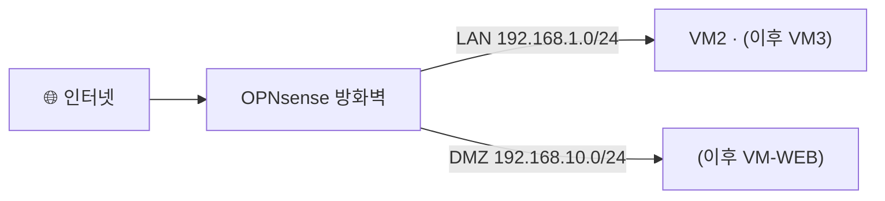

# 보안관제 실습 — 가상 방화벽으로 나만의 안전구역 만들기

---

## 0. 이번 강의 한눈에

- **지난 강의 도달 상태**: VM2(Ubuntu Desktop)를 설치하고 인터넷(NAT) 확인 완료
- **오늘의 목표**: 방화벽 **VM1(OPNsense)**을 직접 설치하고, 두 개의 격리망(**LAN/DMZ**)을 만들어 VM2를 **안전한 LAN**으로 이전
- **오늘 켜는 VM**: VM1(OPNsense) + VM2
- **오늘 완성되는 연결**: `인터넷 — [OPNsense] — VM2(192.168.1.20)`

> 28강 2.3 네트워크 표를 옆에 띄워두고 따라오세요. IP는 전부 그 표를 그대로 씁니다.
{: .prompt-info }

---

## 1. 오늘의 이론: 방화벽(Firewall)과 망 분리

집에는 외부인을 막는 **현관문**이 있습니다. 네트워크에도 똑같은 역할을 하는 장비가 **방화벽(Firewall)**입니다. 방화벽은 미리 정한 **규칙(Rule)**에 따라 드나드는 트래픽을 검사합니다.

- **허용(Allow)**: 안전한 통신(예: 내부 PC가 인터넷을 보는 것)은 통과
- **차단(Block)**: 위험한 통신(예: 외부에서 내부 중요 서버로 침투)은 차단

이번 실습의 핵심은 **망 분리**입니다. 우리는 컴퓨터 한 대 안을 방화벽으로 두 구역으로 나눕니다.

- **DMZ 구역(`intnet_dmz`, 192.168.10.0/24)**: 홈페이지처럼 **외부에 노출되어 공격받기 쉬운** 서버(=VM-WEB)를 두는 곳
- **LAN 구역(`intnet_lan`, 192.168.1.0/24)**: 관제 서버·관리자 PC 등 **소중한 자산**을 두는 안전한 곳

> **왜 나눌까?** 노출된 웹서버가 해킹당하더라도, DMZ와 LAN이 방화벽으로 분리되어 있으면 해커가 LAN의 중요 자산까지 넘어오지 못하게 막을 수 있습니다.
{: .prompt-tip }



---

## 2. 따라하기 실습 ① : OPNsense 가상머신(VM1) 만들기

### [단계 1] OPNsense 설치 이미지(ISO) 내려받기

1. 호스트 PC 브라우저에서 [OPNsense 다운로드 페이지](https://opnsense.org/download/)에 접속합니다.
2. 옵션을 고릅니다: **Architecture: amd64**, **Image type: dvd**, 가까운 미러 선택 → **[Download]**. *(2026년 기준 최신은 26.x 버전이며, 설치/로그인 절차는 동일합니다.)*
3. 받은 파일은 `.img.bz2` 또는 `.iso.bz2` 형태로 압축되어 있습니다. **[7-Zip](https://www.7-zip.org/)** 같은 무료 압축 프로그램으로 풀어 **`.iso`** 파일을 꺼냅니다.

### [단계 2] VM1 생성 및 네트워크 카드 3개 연결

1. VirtualBox에서 **[새로 만들기]** → 이름 `OPNsense-FW`, **종류: BSD**, **버전: FreeBSD (64-bit)**.
2. 메모리 **`1024` MB**, CPU **1**.
3. 가상 하드디스크 **`20` GB** 생성.
4. 생성 후 `OPNsense-FW`를 우클릭 → **[설정] → [네트워크]**. 방화벽은 대문이라 카드가 **3개** 필요합니다.
   - **[어댑터 1]** (WAN, 외부 인터넷): '네트워크 어댑터 사용하기' 체크 → **다음에 연결: `NAT`**
   - **[어댑터 2]** (LAN, 안전망): 체크 → **다음에 연결: `내부 네트워크`** → 이름 **`intnet_lan`** 직접 입력
   - **[어댑터 3]** (DMZ, 노출망): 체크 → **다음에 연결: `내부 네트워크`** → 이름 **`intnet_dmz`** 직접 입력
5. **[저장소]** → 비어있는 광학 드라이브에 [단계 1]의 `.iso`를 넣고 **[확인]**.

> **카드 순서가 곧 인터페이스 이름**입니다. 어댑터1→`em0`(WAN), 어댑터2→`em1`(LAN), 어댑터3→`em2`(DMZ). 순서를 꼭 위와 같이 맞추세요.
{: .prompt-warning }

---

## 3. 따라하기 실습 ② : OPNsense 설치 및 인터페이스 배정

### [단계 3] 라이브 부팅 후 디스크에 설치

1. `OPNsense-FW`를 **[시작]**합니다. 부팅 메뉴가 지나가면 자동으로 로그인됩니다.
2. 로그인 프롬프트가 보이면:
   - login: **`installer`**
   - password: **`opnsense`**
3. 설치 마법사가 시작됩니다.
   - 키맵: 기본값으로 **[Continue with ...]**
   - 설치 방식: **`Install (UFS)`** 선택
   - 디스크 선택: `da0` (20GB) 선택 → 진행
   - 설치가 끝나면 **root 비밀번호 변경** 화면에서 **`opnsense123`** 으로 설정합니다. *(28강 2.4 표와 동일)*
   - **[Complete Install]** → **[Reboot]**.
4. 재부팅 시 **광학 드라이브(ISO)를 제거**합니다: VM 메뉴 **[장치] → [광학 드라이브] → 디스크 제거**.

### [단계 4] 인터페이스(WAN/LAN/DMZ) 배정 확인

재부팅 후 콘솔에 텍스트 메뉴가 나타납니다. 인터페이스가 아래처럼 배정되어 있어야 합니다.

```text
 WAN (em0)  -> v4/DHCP4: 10.0.2.15/24     (외부 인터넷, NAT가 자동 할당)
 LAN (em1)  -> v4: 192.168.1.1/24         (내부 안전망, 기본값)
```

DMZ(em2)는 아직 배정 전입니다. 콘솔 메뉴에서 **`1) Assign interfaces`**를 눌러 추가합니다.

1. `1` 입력 → "Configure VLANs?" → **n**
2. WAN 인터페이스로 사용할 카드: **`em0`** 입력
3. LAN 인터페이스로 사용할 카드: **`em1`** 입력
4. "Optional interface 1" 로 사용할 카드: **`em2`** 입력 (이게 DMZ가 됩니다)
5. 더 묻지 않으면 **`Enter`** → "save?" → **`y`**

이제 콘솔에 `WAN(em0)`, `LAN(em1)`, `OPT1(em2)` 세 개가 보입니다. OPT1(=DMZ)의 IP는 곧 웹 화면에서 설정합니다.

> 📷 **스크린샷 자리**: 인터페이스 배정이 끝난 OPNsense 콘솔 화면(WAN/LAN/OPT1 목록). 캡처해 `/assets/img/soc/2-interfaces.png` 로 저장 후 아래 주석 해제.
> <!--  -->
{: .prompt-tip }

> OPNsense는 **LAN(192.168.1.1)에서 들어오는 관리 접속을 기본 허용(anti-lockout)**합니다. 그래서 곧 VM2(LAN)의 브라우저로 방화벽 설정 화면에 접속할 수 있습니다.
{: .prompt-tip }

---

## 4. 따라하기 실습 ③ : VM2를 LAN에 연결하고 방화벽 웹 설정

### [단계 5] VM2의 네트워크를 내부망(LAN)으로 변경

1. VirtualBox에서 **VM2(`Ubuntu-Workstation`) 전원을 끕니다**.
2. VM2 **[설정] → [네트워크] → [어댑터 1]**:
   - 다음에 연결: **`내부 네트워크`** → 이름 **`intnet_lan`**
3. **[확인]** 후 VM2를 켭니다.

### [단계 6] VM2에 고정 IP(192.168.1.20) 설정

1. VM2(Ubuntu) 우측 상단 → **[설정] → [네트워크] → 유선 톱니바퀴 아이콘**.
2. **[IPv4]** 탭 → 방식 **'수동(Manual)'** 선택 후 입력:
   - 주소(Address): **`192.168.1.20`**
   - 넷마스크(Netmask): **`255.255.255.0`**
   - 게이트웨이(Gateway): **`192.168.1.1`**
   - DNS: **`192.168.1.1`**
3. **[적용]** → 유선 스위치를 껐다 켜서 적용합니다.
4. **[터미널]**을 열어(`Ctrl+Alt+T`) 아래 세 명령으로 단계별로 확인합니다.
   ```bash
   ip addr show
   ```
   ```bash
   ping -c 3 192.168.1.1
   ```
   ```bash
   ping -c 3 8.8.8.8
   ```

   **명령어 상세 설명**
   - `ip addr show` : 이 PC에 붙은 모든 네트워크 카드와 **현재 할당된 IP 주소**를 보여줍니다. 출력 중 유선 카드(`enp0s3` 등) 항목에 `inet 192.168.1.20/24` 가 보이면, 앞 단계에서 준 고정 IP가 정상 적용된 것입니다. (`addr`=address(주소), `show`=보여줘)
   - `ping -c 3 192.168.1.1` : 방화벽(게이트웨이)에게 **"살아 있니?"** 하고 신호를 3번 보냅니다. (`ping`=네트워크 응답 확인 도구, `-c 3`=count(횟수) 3번만 보내고 멈춤) `3 received, 0% packet loss` 가 나오면 VM2 ↔ 방화벽 통신이 정상입니다. 즉 **같은 내부망(`intnet_lan`)에 올바로 묶였다**는 뜻입니다.
   - `ping -c 3 8.8.8.8` : `8.8.8.8`은 구글의 공개 DNS 서버로, **인터넷이 살아 있는지 확인하는 대표 주소**입니다. 여기에 응답이 오면 패킷이 `VM2 → 방화벽(LAN) → NAT(WAN) → 인터넷`까지 제대로 나간다는 뜻입니다. 즉 방화벽이 내부망과 외부 인터넷을 **중계(라우팅·NAT)** 하고 있음을 증명합니다.

   > 세 명령이 모두 성공해야 다음 단계(브라우저로 방화벽 접속)가 동작합니다. 하나라도 실패하면 아래 **"자주 나는 오류"**를 먼저 확인하세요.
   {: .prompt-tip }

### [단계 7] 방화벽 웹 관리화면 접속 & DMZ 인터페이스 설정

1. VM2의 Firefox 주소창에 **`https://192.168.1.1`** 입력.
2. "안전하지 않음" 경고 → **[고급] → [위험을 감수하고 계속]**.
3. 로그인: **`root`** / **`opnsense123`**. (최초 마법사가 뜨면 [Next]로 기본값 진행, 비밀번호 변경 단계는 건너뜀)
4. 상단 메뉴 **[Interfaces] → [Assignments]** 로 가면 `OPT1`이 보입니다. **[OPT1]** 클릭 후:
   - **Enable**: 체크
   - **Description**: `DMZ` 로 변경
   - **IPv4 Configuration Type**: `Static IPv4`
   - **IPv4 address**: **`192.168.10.1`** / `24`
   - 하단 **[Save] → [Apply changes]**

### [단계 8] DMZ DHCP는 건너뜀 (VM-WEB은 고정 IP 사용)

이번 실습에서는 DMZ 서버에 **고정 IP(192.168.10.10)**를 직접 줄 것이므로 DHCP는 필수가 아닙니다. (참고: LAN은 기본 DHCP가 켜져 있지만, 우리는 VM2/VM3에 고정 IP를 직접 부여합니다.)

### [단계 9] 방화벽 규칙 만들기 (정합성의 핵심!)

앞으로의 강의가 동작하려면 아래 규칙이 필요합니다. **[Firewall] → [Rules]** 에서 설정합니다.

- **LAN 탭**: 기본 규칙 `Default allow LAN to any` 가 이미 있습니다. → VM2가 인터넷·DMZ·LAN 어디든 접근 가능 (공격 실습 및 관제 접속용). 그대로 둡니다.
- **DMZ 탭**: 기본은 모두 차단입니다. 아래 두 규칙을 **[+ Add]** 로 추가합니다.
  1. **DMZ → 인터넷 허용** (웹서버가 Docker·패키지를 받도록)
     - Action: `Pass`, Interface: `DMZ`, Source: `DMZ net`, Destination: `! (not) LAN net` *(또는 `any`)*, Protocol: `any`
  2. **DMZ → 관제서버(Wazuh)만 허용** (웹서버 센서가 로그를 보내도록)
     - Action: `Pass`, Source: `DMZ net`, Destination: **`192.168.1.100`** (Single host), Destination port: `any`
  - 그 외 **DMZ → LAN 은 차단**된 상태를 유지합니다. (이게 망 분리의 핵심: 웹서버가 뚫려도 LAN으로 못 넘어옴. 단, 관제 전송은 예외 허용)
- 각 변경 후 **[Apply changes]** 를 꼭 누릅니다.

> 지금은 VM-WEB·VM3가 아직 없어서 규칙을 "미리" 만들어 두는 것입니다. 3·31강에서 해당 서버를 만들면 이 규칙들이 그대로 작동합니다.
{: .prompt-info }

---

## 5. 자주 나는 오류

- **`https://192.168.1.1` 접속 안 됨**: VM2 어댑터가 `intnet_lan`인지, VM2 IP가 192.168.1.20인지 확인. OPNsense·VM2 둘 다 `intnet_lan`으로 이름이 **정확히 같아야** 통신됩니다.
- **인터넷(ping 8.8.8.8)이 안 됨**: OPNsense 어댑터1이 `NAT`인지, WAN(em0)이 DHCP로 10.0.2.15를 받았는지 확인.
- **인터페이스 순서가 뒤바뀜**: [단계 4]에서 `em0=WAN, em1=LAN, em2=OPT1`로 다시 배정하세요.

---

## 6. 핵심 요약

- **OPNsense**는 무료 오픈소스 방화벽으로, VirtualBox의 **내부 네트워크(intnet_lan / intnet_dmz)**를 이용해 PC 안에 격리망을 만듭니다.
- 방화벽의 **같은 내부 네트워크 이름**으로 묶인 VM끼리만 통신합니다.
- **DMZ→LAN 차단(+관제서버 예외)** 규칙이 "망 분리"의 핵심이며, 뒤 강의 전체가 이 설계 위에서 동작합니다.

## 💾 안전망: 스냅샷 찍기 (꼭!)

`OPNsense-FW`와 `Ubuntu-Workstation` 두 VM을 **전원 끄고** 각각 우클릭 → **[스냅샷] → [찍기]** 로 저장하세요. 방화벽 설정은 되돌리기 어려우니, 막히면 강사가 제공한 **"정답 스냅샷"**을 복원해 다음 강의로 진행할 수 있습니다.

---

## 7. 다음 강의 예고

30강에서는 **DMZ에 취약 웹서버 VM-WEB(192.168.10.10)**을 직접 만들어 **DVWA(Damn Vulnerable Web Application)**를 띄우고, VM2에서 첫 해킹(SQL Injection)을 시도해 봅니다.
