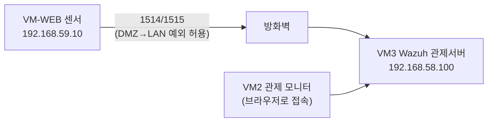

# 보안관제 실습 — 중앙 관제실(SIEM) 문 열고 센서 연결하기

---

## 0. 이번 강의 한눈에

- **지난 강의 도달 상태**: DMZ에 취약 웹서버(VM-WEB, 192.168.59.10) 구축, Nginx 접근 로그 생성 확인
- **오늘의 목표**: LAN에 **관제 서버 VM3(192.168.58.100)** 를 만들고 **Wazuh(SIEM)** 직접 설치 → VM-WEB에 **센서(에이전트)**를 붙여 웹 로그를 관제실로 전송
- **오늘 켜는 VM**: VM1 + VM2 + VM-WEB + **VM3(신규)**
- **오늘 완성되는 연결**: `VM-WEB(센서) → [방화벽: DMZ→192.168.58.100 허용] → VM3 Wazuh 관제실`



---

## 1. 오늘의 이론: SIEM과 에이전트(Agent)

빌딩의 **보안 안내실**에는 각 층 CCTV 화면이 모입니다. 컴퓨터 보안도 똑같이 구현합니다.

- **SIEM (보안 정보·이벤트 관리)** = 보안 안내실. 여러 장비의 로그를 한곳에 모아 분석·경보하는 서버. 우리는 오픈소스 **Wazuh**를 씁니다.
- **에이전트(Agent)** = CCTV 센서. 감시할 컴퓨터에 설치되어 로그를 SIEM으로 실시간 전송합니다.

> **센서는 어디에 달까?** 우리가 감시하려는 대상은 **공격받는 웹서버(VM-WEB)**입니다. 그래서 에이전트는 **VM-WEB**에 설치합니다. 그러면 30강에서 만든 Nginx 접근 로그(공격 흔적)가 관제실로 올라갑니다.
{: .prompt-tip }

---

## 2. 따라하기 실습 ① : 관제 서버 VM3 만들기

### [단계 1] VM3 생성 (LAN)

1. VirtualBox **[새로 만들기]**: 이름 `SOC-Server`, ISO = **Ubuntu Server 22.04**(30강에서 받은 것 재사용), **[Skip Unattended] 체크**.
2. 메모리 **`6144` MB**, CPU **2**, 디스크 **`50` GB**.
3. **[설정] → [네트워크] → [어댑터 1]**: **`내부 네트워크`** → 이름 **`intnet_lan`** *(관제는 LAN에!)*.

### [단계 2] Ubuntu Server 설치 & 고정 IP 192.168.58.100

1. 30강 [단계 2]와 동일하게 설치합니다. 단 **server's name: `soc-server`**, 계정은 `student`/`student1234`, **OpenSSH server 설치 체크**.
설치 후 로그인하여 **아래 한 덩어리를 그대로 복사해 붙여넣어** 고정 IP를 설정합니다. (직접 편집 불필요)

```bash
IFACE=$(ls /sys/class/net | grep -v lo | head -n1)
sudo rm -f /etc/netplan/00-installer-config.yaml /etc/netplan/50-cloud-init.yaml
sudo tee /etc/netplan/99-soc.yaml > /dev/null <<EOF
network:
  version: 2
  ethernets:
    $IFACE:
      dhcp4: false
      addresses: [192.168.58.100/24]
      routes:
        - to: default
          via: 192.168.58.1
      nameservers:
        addresses: [192.168.58.1, 8.8.8.8]
EOF
sudo chmod 600 /etc/netplan/99-soc.yaml
sudo netplan apply
ip addr | grep 192.168.58.100
ping -c 3 8.8.8.8
```

**명령어 상세 설명** — 30강 [단계 3]에서 한 고정 IP 설정과 **똑같은 방식**이며, 값만 LAN용으로 바뀌었습니다.
- `IFACE=$(...)` : 네트워크 카드 이름을 자동 탐지해 변수에 저장(30강과 동일).
- `sudo rm -f ...` : 설치 시 자동 생성된 기존 네트워크 설정 파일 제거(충돌 방지).
- `sudo tee .../99-soc.yaml <<EOF ... EOF` : 새 설정을 저장합니다. **이번엔 LAN망**이라 고정 IP `192.168.58.100/24`, 게이트웨이·DNS는 방화벽 `192.168.58.1`을 씁니다(30강 웹서버는 DMZ의 `192.168.59.x`였던 것과 대비).
- `sudo chmod 600` / `sudo netplan apply` : 권한을 좁히고 설정을 즉시 반영. 이 순간 VM3의 IP가 `192.168.58.100`으로 고정됩니다.
- `ip addr | grep 192.168.58.100` : 고정 IP가 적용됐는지 한 줄로 확인.
- `ping -c 3 8.8.8.8` : 인터넷이 되는지 확인합니다. **Wazuh 설치 파일을 인터넷에서 받아야 하므로** 이 단계가 반드시 성공해야 합니다.

---

## 3. 따라하기 실습 ② : Wazuh 관제 서버 설치

### [단계 3] Wazuh 올인원(all-in-one) 자동 설치

Wazuh는 설치가 복잡하지만, 공식 **올인원 설치 스크립트**가 관제실(인덱서+서버+대시보드)을 한 번에 깔아줍니다.

```bash
curl -sO https://packages.wazuh.com/4.14/wazuh-install.sh
sudo bash ./wazuh-install.sh -a
```

**명령어 상세 설명**
- `curl -sO https://.../wazuh-install.sh` : 인터넷에서 **공식 설치 스크립트 파일을 내려받습니다**. (`curl`=URL로 파일 받기, `-O`=서버의 원래 파일명 그대로 저장, `-s`=진행률 표시 없이 조용히)
- `sudo bash ./wazuh-install.sh -a` : 받은 스크립트를 **관리자 권한으로 실행**합니다. (`bash 파일`=그 스크립트를 실행) `-a`는 **all-in-one(올인원)** 옵션으로, 관제실의 세 부품(검색엔진 역할 **인덱서** + 분석 **서버** + 화면 **대시보드**)을 **한 번에 자동 설치**합니다.
- `4.14`는 2026년 기준 최신 버전입니다. (최신값은 [Wazuh 설치 가이드](https://documentation.wazuh.com/current/installation-guide/index.html)에서 확인)
- 10~20분 소요됩니다. (인터넷 속도/사양에 따라 다름)
- 설치가 끝나면 화면 맨 아래에 **관리자 계정 정보**가 출력됩니다. **반드시 메모하세요.**
  ```text
  INFO: --- Summary ---
  INFO: You can access the web interface https://192.168.58.100
      User: admin
      Password: <무작위로 생성된 긴 문자열>
  ```

> 비밀번호를 놓쳤다면 아래로 다시 확인할 수 있습니다.
> ```bash
> sudo tar -O -xvf wazuh-install-files.tar wazuh-install-files/wazuh-passwords.txt | grep -A1 "username: 'admin'"
> ```
> 설치 스크립트가 비밀번호를 모아 둔 압축파일(`wazuh-install-files.tar`)에서 비밀번호 목록만 꺼내(`tar -O -xvf`=압축을 풀어 화면으로 출력) `admin` 계정 줄과 그 다음 줄(`-A1`)만 걸러 보여줍니다.
{: .prompt-info }

### [단계 4] 관제 대시보드 접속 (VM2에서)

1. **VM2** Firefox 주소창에 **`https://192.168.58.100`** 입력.
2. 인증서 경고 → **[고급] → [위험을 감수하고 계속]**.
3. 로그인: **`admin`** / (방금 메모한 비밀번호).
4. 파란색 **Wazuh 대시보드**가 열리면 관제실 가동 성공입니다.

---

## 4. 따라하기 실습 ③ : VM-WEB에 센서(에이전트) 달기

### [단계 5] 대시보드에서 설치 명령 만들기

1. Wazuh 대시보드 첫 화면에서 **[Add agent]** (또는 메뉴 → Agents → Deploy new agent) 클릭.
2. 옵션을 고릅니다.
   - **Package**: `DEB amd64` (Ubuntu/Debian)
   - **Server address**: **`192.168.58.100`** ← 관제 서버 IP
   - **Agent name**: `web-dmz`
3. 화면 아래에 **설치 명령**이 자동 생성됩니다. 이 명령을 복사해 둡니다. (아래 [단계 6]에 동일한 형태를 적어두었습니다.)

### [단계 6] VM-WEB에서 센서 설치 & 실행

**VM-WEB** 터미널에서 실행합니다. 버전 변화에 영향받지 않도록 **공식 apt 저장소 방식**으로 설치합니다. (대시보드가 만들어 주는 명령과 동일한 결과)

```bash
# 1) Wazuh 공식 저장소 등록
curl -s https://packages.wazuh.com/key/GPG-KEY-WAZUH | sudo gpg --no-default-keyring --keyring gnupg-ring:/usr/share/keyrings/wazuh.gpg --import
sudo chmod 644 /usr/share/keyrings/wazuh.gpg
echo "deb [signed-by=/usr/share/keyrings/wazuh.gpg] https://packages.wazuh.com/4.x/apt/ stable main" | sudo tee /etc/apt/sources.list.d/wazuh.list
sudo apt update

# 2) 관제서버(192.168.58.100)를 가리키며 에이전트 설치
sudo WAZUH_MANAGER='192.168.58.100' WAZUH_AGENT_NAME='web-dmz' apt install -y wazuh-agent
```

**명령어 상세 설명** — 센서를 우분투 공식 방식(apt)으로 설치하고, 처음부터 **관제서버를 바라보게** 만듭니다.
- `curl -s https://.../GPG-KEY-WAZUH | sudo gpg ... --import` : Wazuh가 배포하는 **전자 서명 열쇠(GPG 키)**를 내려받아 시스템에 등록합니다. 이 열쇠가 있어야 "이 프로그램이 진짜 Wazuh가 만든 것"임을 검증할 수 있어, 변조된 가짜 패키지 설치를 막습니다. (`|`=앞 명령의 출력을 뒤 명령에 전달)
- `sudo chmod 644 /usr/share/keyrings/wazuh.gpg` : 방금 저장한 열쇠 파일을 **모두가 읽을 수 있게(644)** 해, apt가 검증에 사용할 수 있도록 합니다.
- `echo "deb [signed-by=...] https://packages.wazuh.com/4.x/apt/ stable main" | sudo tee /etc/apt/sources.list.d/wazuh.list` : 우분투에게 **"Wazuh 프로그램은 이 저장소 주소에서 받아라"**라고 알려주는 목록 파일을 추가합니다. `4.x`라는 버전 무관 주소를 써서, 세부 버전이 올라가도 명령이 그대로 동작합니다.
- `sudo apt update` : 방금 추가한 Wazuh 저장소를 포함해 **프로그램 목록을 다시 갱신**합니다.
- `sudo WAZUH_MANAGER='192.168.58.100' WAZUH_AGENT_NAME='web-dmz' apt install -y wazuh-agent` : 센서(`wazuh-agent`)를 설치합니다. 앞에 붙인 두 값이 핵심입니다.
  - `WAZUH_MANAGER='192.168.58.100'` : 이 센서가 로그를 보낼 **관제서버(VM3)의 주소**. 잘못 넣으면 센서가 관제실에 연결되지 않습니다.
  - `WAZUH_AGENT_NAME='web-dmz'` : 관제 화면에 표시될 **이 센서의 이름**. 어느 자산인지 구분하기 위함입니다.

### [단계 7] 센서가 Nginx 웹 로그를 감시하도록 설정

기본 설치만으로는 시스템 로그만 봅니다. **30강에서 만든 웹 접근 로그**도 감시하도록 설정에 추가합니다. **아래 한 줄을 그대로 복사해 붙여넣으면** 설정 파일을 직접 열지 않고 자동으로 추가됩니다. (들여쓰기 실수 방지)

```bash
sudo sed -i 's#</ossec_config>#  <localfile>\n    <log_format>apache</log_format>\n    <location>/var/log/nginx/access.log</location>\n  </localfile>\n</ossec_config>#' /var/ossec/etc/ossec.conf
```

**명령어 상세 설명**
- `sed -i 's#찾을것#바꿀것#' 파일` : 파일 안의 글자를 **찾아서 자동으로 바꿔치기**하는 명령입니다. (`sed`=텍스트 자동 편집기, `-i`=파일을 직접 수정) 여기서는 설정 파일의 맨 끝 닫는 태그 `</ossec_config>`를 찾아, 그 **앞에 `<localfile>` 블록을 끼워 넣은 뒤 다시 닫는** 방식으로 한 덩어리를 추가합니다.
- 추가되는 `<localfile>` 블록의 의미: **"Nginx 접근 로그(`/var/log/nginx/access.log`)를 apache 형식으로 읽어 관제실로 보내라"**. 이 한 줄 덕분에 30강에서 만든 웹 공격 기록이 비로소 관제실로 올라갑니다. (직접 편집하면 들여쓰기 실수가 잦아 `sed`로 안전하게 자동 추가)

> 잘 들어갔는지 확인: `grep -A2 nginx /var/ossec/etc/ossec.conf` → 파일에서 `nginx` 글자가 든 줄과 다음 2줄(`-A2`)을 보여주는데, `<localfile>` 블록이 보이면 정상입니다.
{: .prompt-tip }

이제 센서를 시작합니다.
```bash
sudo systemctl daemon-reload
sudo systemctl enable wazuh-agent
sudo systemctl start wazuh-agent
sudo systemctl status wazuh-agent
```

**명령어 상세 설명** (`systemctl`=서비스를 켜고 끄고 상태를 보는 관리 명령)
- `daemon-reload` : 설정이 바뀌었음을 시스템에 **다시 읽어들이라**고 알립니다.
- `enable wazuh-agent` : 센서가 **부팅할 때마다 자동으로 켜지도록** 등록합니다.
- `start wazuh-agent` : 센서를 **지금 즉시 가동**합니다(관제서버로 연결 시작).
- `status wazuh-agent` : 센서의 **현재 상태를 확인**합니다. **`active (running)`** 이라고 초록색으로 뜨면 정상 작동 중입니다. (빠져나올 때는 `q` 키)

### [단계 8] 연결 확인

1. VM2의 Wazuh 대시보드로 돌아가 메뉴 → **[Agents]**.
2. `web-dmz` 에이전트가 **Active(초록색)** 상태로 1대 보이면 센서 연결 성공입니다!

   > 📷 **스크린샷 자리**: [Agents] 화면에서 `web-dmz`가 Active(초록)로 뜬 모습. `/assets/img/soc/4-agent-active.png` 로 저장 후 아래 주석 해제.
   > <!--  -->
   {: .prompt-tip }
3. (확인) VM2 브라우저에서 **DVWA에 로그인된 상태(보안레벨 Low)**로 `http://192.168.59.10/vulnerabilities/sqli/?id=1' UNION SELECT user,password FROM users-- -&Submit=Submit` 를 한 번 더 보낸 뒤, 잠시 후 대시보드에 이벤트가 쌓이는지 봅니다. (자세한 분석은 32강)

---

## 5. 자주 나는 오류

- **에이전트가 `Active`가 안 되고 `Never connected`**: ① VM-WEB에서 `ping 192.168.58.100` 되는지 확인(29강 **DMZ→192.168.58.100 허용 규칙** 필수), ② `WAZUH_MANAGER` IP를 192.168.58.100으로 정확히 넣었는지 확인.
- **대시보드 접속이 안 됨**: 설치 직후 서비스 기동에 1~2분 걸립니다. `sudo systemctl status wazuh-dashboard` 확인.
- **메모리 부족으로 VM3가 느림**: 다른 VM/호스트 앱을 닫으세요. Wazuh는 메모리를 많이 씁니다(16GB 최적화 안내 참고).

---

## 6. 핵심 요약

- **Wazuh(SIEM)**를 관제 서버 VM3에 올인원으로 직접 설치해 중앙 관제실을 열었습니다.
- 감시 대상인 **웹서버(VM-WEB)**에 **에이전트(센서)**를 설치하고, **Nginx 접근 로그**까지 감시하도록 설정했습니다.
- 센서→관제실 통신은 29강에서 만든 **DMZ→192.168.58.100 예외 허용** 규칙 덕분에 망 분리를 유지한 채 작동합니다.

## 💾 안전망: 스냅샷 찍기 (꼭!)

`SOC-Server`와 `Web-DMZ` VM을 **전원 끄고** 각각 **[스냅샷] → [찍기]**. Wazuh 설치는 시간이 오래 걸리므로, 이 스냅샷(또는 강사 제공 `.ova`)이 있으면 이후 강의에서 문제가 생겨도 재설치 없이 복원할 수 있습니다.

---

## 7. 다음 강의 예고

32강에서는 VM2에서 웹 공격을 날리고, 그 흔적이 **Wazuh 관제 화면에 경보로 어떻게 뜨는지** 직접 탐지·분석(공격자 IP·공격 구문 추적)합니다.
