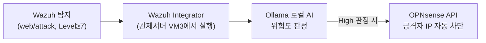

# 보안관제 실습 — 로컬 AI 비서와 SOAR로 자동 차단 로봇 만들기

---

## 0. 이번 강의 한눈에

- **지난 강의 도달 상태**: Wazuh 탐지·분석, AI(머신러닝) 개념 체험 완료
- **오늘의 목표**: 공격 탐지 시 **로컬 AI(Ollama)**가 위협을 판정하고, 위험하면 **방화벽(OPNsense)에 자동 차단**을 지시하는 자동화 로봇(SOAR) 구축
- **오늘 켜는 VM**: VM1 + VM2 + VM3 + VM-WEB (16GB는 호스트의 다른 앱을 닫고 진행)
- **자동화 흐름**:



> **이번 강의의 구현 방식 안내**: 현장에서는 **Shuffle** 같은 본격 SOAR 도구를 쓰지만, 그 도구는 자체 데이터베이스까지 띄워 메모리를 많이 차지합니다(16GB PC엔 부담). 그래서 우리는 **Wazuh에 내장된 Integrator(연동) 기능** + 작은 파이썬 스크립트로 **같은 자동화 개념을 더 가볍고 확실하게** 구현합니다. 이 스크립트는 **관제서버(VM3)에서 실행**되므로 로컬 AI(Ollama, localhost)와 방화벽 API(192.168.1.1)에 모두 접근할 수 있습니다. *(만약 에이전트 측 active-response로 만들면 DMZ→방화벽 차단 규칙 때문에 API 호출이 실패합니다 — 그래서 관제서버에서 도는 Integrator가 정답입니다.)* (32GB 이상이면 Shuffle로 확장 가능)
{: .prompt-info }

---

## 1. 오늘의 이론: SOAR와 로컬 LLM

사람이 알람을 보고 로그를 분석해 방화벽에 IP를 직접 차단하려면 보통 10~30분이 걸립니다. 해커는 수초 만에 정보를 훔쳐 달아나죠. 그래서 자동화가 필요합니다.

- **SOAR (보안 오케스트레이션·자동화·대응)**: 정해진 행동지침(플레이북)에 따라 공격에 **자동으로 대응**하는 보안 자동화. (오늘은 관제서버에서 도는 **Wazuh Integrator**가 그 역할)
- **로컬 LLM**: ChatGPT 같은 AI를 외부 클라우드가 아닌 **우리 관제 서버 내부(Ollama)**에서 돌립니다. 로그를 외부로 유출하지 않고 즉시 한글 분석 리포트를 받을 수 있습니다.

---

## 2. 따라하기 실습 ① : 로컬 AI(Ollama) 설치 (VM3)

### [단계 1] Ollama 설치 & 외부 접속 허용

VM3 터미널에서:
```bash
curl -fsSL https://ollama.com/install.sh | sh
```

**명령어 상세 설명**
- `curl -fsSL https://ollama.com/install.sh | sh` : Ollama 공식 **설치 스크립트를 내려받아 곧바로 실행**합니다. (`curl ... | sh`=받은 스크립트를 셸 `sh`에 바로 전달해 실행) `-fsSL`은 조용히(`s`)·오류 시 멈춤(`f`)·리다이렉트 따라가기(`L`) 옵션 묶음입니다. Ollama는 ChatGPT 같은 AI를 **외부 클라우드 없이 내 서버 안에서** 돌리는 도구입니다.

이어서 Ollama가 같은 서버의 다른 프로그램(우리 자동대응 스크립트)에서도 호출되도록 접속 주소를 열어 줍니다.
```bash
sudo mkdir -p /etc/systemd/system/ollama.service.d
sudo tee /etc/systemd/system/ollama.service.d/override.conf > /dev/null <<'EOF'
[Service]
Environment="OLLAMA_HOST=0.0.0.0"
EOF
sudo systemctl daemon-reload
sudo systemctl restart ollama
```

**명령어 상세 설명**
- `sudo mkdir -p /etc/systemd/system/ollama.service.d` : Ollama 서비스의 **추가 설정을 담을 폴더**를 만듭니다.
- `sudo tee .../override.conf <<'EOF' ... EOF` : 그 폴더에 설정 파일을 만들어 **`OLLAMA_HOST=0.0.0.0`** 값을 넣습니다. 이는 "이 서버의 모든 주소에서 들어오는 요청을 받아라"는 뜻으로, 자동대응 스크립트가 Ollama에 접속할 수 있게 합니다.
- `sudo systemctl daemon-reload` : 바뀐 서비스 설정을 시스템이 **다시 읽도록** 합니다.
- `sudo systemctl restart ollama` : Ollama를 **재시작**해 새 설정을 적용합니다.

### [단계 2] 경량 모델 내려받기 (16GB 최적화: 1B 모델)

```bash
ollama pull llama3.2:1b
```

**명령어 상세 설명**
- `ollama pull llama3.2:1b` : AI 모델을 내려받습니다(`pull`=가져오기). **`llama3.2:1b`**는 매개변수 10억(1B) 규모의 **가장 가벼운 모델**로, 16GB PC에서도 무리 없이 돕니다. (성능보다 "구조가 도는지" 검증이 목적 — 나중에 더 큰 모델로 교체 가능)

### [단계 3] AI가 작동하는지 테스트

```bash
curl -s http://localhost:11434/api/generate -d '{
  "model": "llama3.2:1b",
  "prompt": "너는 보안관제 AI다. 한 줄로 인사해줘.",
  "stream": false
}' | python3 -c "import sys,json;print(json.load(sys.stdin)['response'])"
```

**명령어 상세 설명** — 우리 자동대응 스크립트가 AI를 부르는 방식과 **똑같은 방법**을 손으로 한번 해 보는 것입니다.
- `curl -s http://localhost:11434/api/generate -d '{...}'` : 같은 서버에서 돌고 있는 Ollama의 **답변 생성 주소(11434 포트)**로 질문을 보냅니다. (`-d '{...}'`=보낼 데이터를 JSON으로 첨부) JSON 안의 `model`은 쓸 모델, `prompt`는 질문, `"stream": false`는 **답을 토막내지 말고 한 번에** 달라는 뜻입니다.
- `| python3 -c "import sys,json;print(json.load(sys.stdin)['response'])"` : Ollama가 돌려준 **JSON 답변에서 실제 글자(`response`)만 꺼내** 화면에 보기 좋게 출력합니다. (`|`=앞 명령의 출력을 파이썬에 넘김)

→ AI가 한 줄 답변을 출력하면 로컬 AI 가동 성공입니다.

---

## 3. 따라하기 실습 ② : 방화벽 자동 차단 준비 (OPNsense)

자동 로봇이 차단할 **차단 명단(Alias)**과 **차단 규칙**, 그리고 명령을 받을 **API 열쇠**를 만듭니다. (VM2 브라우저에서 `https://192.168.1.1` 접속)

### [단계 4] 차단 명단(Alias) 만들기

1. **[Firewall] → [Aliases] → [+ Add]**
   - **Name**: `Blocked_Attackers`
   - **Type**: `Host(s)`
   - (내용은 비워둠 — 로봇이 자동으로 채웁니다)
2. **[Save] → [Apply]**

### [단계 5] 차단 규칙 만들기 (명단에 오르면 통신 차단)

1. **[Firewall] → [Rules] → [LAN] → [+ Add]**
   - **Action**: `Block`
   - **Source**: `Blocked_Attackers` (Single host or alias 선택 후 입력)
   - **Destination**: `any`
2. **[Save]** 후, 이 규칙을 **목록 맨 위로 드래그**합니다. (위에 있어야 먼저 적용됨) → **[Apply]**

> 공격자(VM2, 192.168.1.20)는 LAN에 있고, 웹서버 공격은 LAN→DMZ로 방화벽을 통과합니다. 따라서 이 IP가 명단에 오르면 방화벽이 곧바로 막아 웹서버에 닿지 못합니다.
{: .prompt-tip }

### [단계 6] API 열쇠 발급

1. **[System] → [Access] → [Users]** → `root` 편집(연필).
2. **API keys** 항목에서 **[+]** 클릭 → `apikey.txt` 파일이 다운로드됩니다.
3. 파일을 열면 **key** 와 **secret** 두 줄이 있습니다. 이 값을 다음 단계 스크립트에 넣습니다.

> 📷 **스크린샷 자리**: [System] → [Access] → [Users] → root 의 "API keys" 추가 화면. `/assets/img/soc/7-apikey.png` 로 저장 후 아래 주석 해제.
> <!--  -->
{: .prompt-tip }

---

## 4. 따라하기 실습 ③ : 자동 대응 스크립트 연결 (VM3)

이제 "탐지 → AI 판정 → 자동 차단"을 잇는 작은 로봇(스크립트)을 관제 서버에 둡니다.

### [단계 7] 자동 대응 스크립트 작성 (관제서버 VM3)

Wazuh의 **Integrator**는 경보가 조건에 맞으면 **관제서버에서** 지정한 스크립트를 호출하고, 경보 JSON을 임시파일로 저장해 그 **경로를 첫 번째 인자(`argv[1]`)**로 넘겨줍니다. 스크립트 이름은 반드시 `custom-` 으로 시작해야 합니다.

**(1) 아래 한 덩어리를 그대로 복사해 붙여넣어** 스크립트 파일을 만듭니다. (직접 타이핑·편집 불필요)

```bash
sudo tee /var/ossec/integrations/custom-ai-block > /dev/null <<'PYEOF'
#!/usr/bin/env python3
import sys, json, subprocess, datetime

OPN    = "https://192.168.1.1"
KEY    = "여기에_API_KEY"
SECRET = "여기에_API_SECRET"
LOG    = "/var/ossec/logs/ai-soc.log"

def log(msg):
    with open(LOG, "a") as f:
        f.write(f"{datetime.datetime.now()} {msg}\n")

def curl(args):
    return subprocess.run(["curl","-s","-k","-u",f"{KEY}:{SECRET}"]+args,
                          capture_output=True, text=True).stdout

def main():
    # integratord가 넘겨준 경보 JSON 파일 경로 = argv[1]
    with open(sys.argv[1]) as f:
        alert = json.load(f)

    srcip = alert.get("data", {}).get("srcip")
    desc  = alert.get("rule", {}).get("description", "")
    url   = alert.get("data", {}).get("url", "")
    if not srcip:
        return

    # 1) 로컬 AI(Ollama)에게 위험도 판정 요청
    prompt = (f"너는 보안관제 AI 분석관이다. 아래 웹 로그를 분석하라.\n"
              f"[규칙] 응답의 '첫 줄'에는 위험도를 High, Medium, Low 중 하나의 단어로만 적어라. "
              f"SQL Injection, UNION SELECT, OR 1=1 등 웹 공격 징후가 보이면 반드시 첫 줄을 'High'로 시작하라. "
              f"둘째 줄부터 그 이유를 한글 3줄로 요약하라.\n"
              f"탐지명: {desc}\n공격구문: {url}\n공격자IP: {srcip}")
    body = json.dumps({"model":"llama3.2:1b","prompt":prompt,"stream":False})
    out = subprocess.run(["curl","-s","http://localhost:11434/api/generate","-d",body],
                         capture_output=True, text=True).stdout
    verdict = json.loads(out).get("response","") if out else ""
    first_line = verdict.strip().splitlines()[0] if verdict.strip() else ""
    log(f"AI verdict for {srcip}: {verdict.strip()[:200]}")

    # 2) '첫 줄' 판정이 High면 OPNsense 방화벽에 자동 차단
    if "High" in first_line:
        curl(["-X","POST",f"{OPN}/api/firewall/alias_util/add/Blocked_Attackers",
              "-H","Content-Type: application/json","-d",json.dumps({"address":srcip})])
        curl(["-X","POST",f"{OPN}/api/firewall/alias/reconfigure"])
        log(f"BLOCKED {srcip} via OPNsense")
    else:
        log(f"No block for {srcip} (verdict not High)")

if __name__ == "__main__":
    main()
PYEOF
sudo chmod 750 /var/ossec/integrations/custom-ai-block
sudo chown root:wazuh /var/ossec/integrations/custom-ai-block
```

**명령어 상세 설명** — 위 한 덩어리는 `custom-ai-block`이라는 **자동대응 로봇(파이썬 스크립트)**을 만들고 권한을 맞춥니다.
- `sudo tee /var/ossec/integrations/custom-ai-block <<'PYEOF' ... PYEOF` : `PYEOF` 사이의 파이썬 코드를 그대로 파일로 저장합니다. 이 스크립트가 하는 일은 세 가지입니다. ① Wazuh가 넘겨준 **경보 JSON 파일(`argv[1]`)을 열어** 공격자 IP·탐지명·공격구문을 꺼내고, ② 그 내용을 **로컬 AI(Ollama)에게 보내 위험도(High/Medium/Low)를 판정**받고, ③ 판정이 **High면 OPNsense API를 호출해 그 IP를 차단 명단에 추가**합니다. (모든 처리 과정은 `/var/ossec/logs/ai-soc.log`에 기록)
- `sudo chmod 750 ...` : 스크립트에 **실행 권한**을 줍니다(`750`=소유자는 읽기·쓰기·실행, 그룹은 읽기·실행, 그 외는 접근 불가). Wazuh가 이 파일을 실행하려면 실행 권한이 반드시 필요합니다.
- `sudo chown root:wazuh ...` : 파일의 **소유자를 `root`, 그룹을 `wazuh`**로 지정합니다. Wazuh 서비스(`wazuh` 그룹)가 이 스크립트를 호출할 수 있게 하는 표준 설정입니다.

**(2) [단계 6]에서 받은 OPNsense 키/시크릿을 넣습니다.** 아래 명령의 `붙여넣기_KEY`·`붙여넣기_SECRET` 자리에 실제 값을 붙여넣고 실행하세요. (파일을 직접 열지 않고 안전하게 치환)

```bash
sudo sed -i "s|여기에_API_KEY|붙여넣기_KEY|; s|여기에_API_SECRET|붙여넣기_SECRET|" /var/ossec/integrations/custom-ai-block
```

**명령어 상세 설명**
- `sudo sed -i "s|찾을것|바꿀것|; s|...|...|" 파일` : 스크립트 안의 자리표시자 글자 **`여기에_API_KEY`·`여기에_API_SECRET`를 실제 키 값으로 바꿔치기**합니다. (`sed -i`=파일 직접 수정, `;`로 두 치환을 한 번에) 구분자로 `/` 대신 `|`를 쓴 이유는 API 값에 `/`가 들어가도 안전하게 처리하기 위함입니다. 파일을 편집기로 직접 열지 않아 오타·들여쓰기 사고를 막습니다.

### [단계 8] Wazuh가 공격 탐지 시 스크립트를 부르도록 등록

**아래 한 덩어리를 그대로 붙여넣으면** integration 블록이 자동 추가되고 관제 서버가 재시작됩니다. (이름은 스크립트 파일명과 동일한 `custom-ai-block`)

```bash
sudo sed -i 's#</ossec_config>#  <integration>\n    <name>custom-ai-block</name>\n    <level>7</level>\n    <group>web,attack</group>\n    <alert_format>json</alert_format>\n  </integration>\n</ossec_config>#' /var/ossec/etc/ossec.conf
sudo systemctl restart wazuh-manager
```

**명령어 상세 설명** — 31강에서 로그 감시를 추가할 때 쓴 `sed` 방식과 똑같이, 관제서버 설정에 **연동(integration) 블록**을 끼워 넣습니다.
- `sudo sed -i 's#</ossec_config>#...<integration>...#' ossec.conf` : 설정 파일 끝의 `</ossec_config>` 앞에 `<integration>` 블록을 추가합니다. 그 의미는 **"`web` 또는 `attack` 그룹의 경보가 위험도(`level`) 7 이상으로 뜨면, `custom-ai-block` 스크립트를 JSON 형식으로 호출하라"**입니다. 즉 SQL Injection 같은 웹 공격 경보가 뜰 때만 우리 로봇이 작동하도록 **방아쇠**를 거는 것입니다.
- `sudo systemctl restart wazuh-manager` : 관제서버(매니저)를 **재시작**해 방금 추가한 연동 설정을 적용합니다. 이때부터 자동대응이 살아납니다.

### [단계 9] 동작 시뮬레이션

1. **VM2** 브라우저에서 **DVWA에 로그인(보안레벨 Low)**된 상태로 아래 웹 공격을 한 번 보냅니다. (브라우저가 로그인 쿠키를 자동으로 함께 보냅니다.)
   ```text
   http://192.168.10.10/vulnerabilities/sqli/?id=1' UNION SELECT user,password FROM users-- -&Submit=Submit
   ```
2. 몇 초 뒤 **VM3**에서 로봇의 처리 기록을 확인합니다.
   ```bash
   sudo tail -f /var/ossec/logs/ai-soc.log
   ```
   - `tail -f 파일` : 로그 파일의 끝을 **실시간으로 따라가며**(`-f`=follow) 보여줍니다. 공격을 보낸 뒤 이 화면을 켜 두면, 로봇이 처리하는 기록이 **즉시 한 줄씩 추가되는** 것을 볼 수 있습니다. (빠져나올 때는 `Ctrl + C`)
   - 출력 예시:
     ```text
     AI verdict for 192.168.1.20: High ...
     BLOCKED 192.168.1.20 via OPNsense
     ```
     첫 줄은 **AI가 High로 판정**했다는 기록, 둘째 줄은 **방화벽에 차단을 지시**했다는 기록입니다.
3. **VM2** 브라우저로 다시 `http://192.168.10.10` 접속을 시도하면 — 이제 **연결되지 않습니다(차단됨)!** 사람이 손대지 않았는데 AI가 판단해 방화벽이 막은 것입니다.

> 실습을 계속하려면 차단을 풀어야 합니다: OPNsense **[Firewall] → [Aliases] → Blocked_Attackers** 편집에서 `192.168.1.20`을 지우고 **[Apply]**.
{: .prompt-warning }

---

## 5. 자주 나는 오류

- **`ai-soc.log`가 안 생김**: ① `<integration>` 블록 오타/들여쓰기 확인, ② 스크립트가 `/var/ossec/integrations/custom-ai-block` 경로에 **실행권한(750)·소유자(root:wazuh)**로 있는지 확인 후 `sudo systemctl restart wazuh-manager`. ③ 디버그: `echo "integrator.debug=2" | sudo tee -a /var/ossec/etc/local_internal_options.conf` 후 재시작하고 `/var/ossec/logs/integrations.log` 를 확인.
- **AI 판정은 되는데 차단이 안 됨**: API key/secret 오타, 또는 OPNsense Alias 이름이 정확히 `Blocked_Attackers`인지 확인. `curl -k -u KEY:SECRET https://192.168.1.1/api/firewall/alias/get` 로 인증 테스트.
- **Ollama 응답이 느림/타임아웃**: 1B 모델이라도 첫 호출은 모델 로딩에 시간이 걸립니다. 한 번 워밍업(단계3) 후 진행하세요.

---

## 6. 핵심 요약

- **SOAR**(여기선 Wazuh Integrator)는 탐지 후 사람 개입 없이 정해진 대응을 관제서버에서 자동 실행합니다.
- **로컬 LLM(Ollama)**은 로그를 외부 유출 없이 분석해 위험도(High/Medium/Low)를 판정합니다.
- AI가 **High**로 판정하면 **OPNsense API**로 공격자 IP를 자동 차단 — "탐지→분석→차단"이 수초 안에 무인으로 완결됩니다.

## 💾 안전망: 스냅샷 찍기 (꼭!)

자동화 설정까지 끝난 지금이 가장 중요한 시점입니다. `SOC-Server`와 `OPNsense-FW`를 **전원 끄고** 각각 **[스냅샷] → [찍기]**. 35강 검증 중 무언가 꼬여도 이 스냅샷(또는 강사 제공 `.ova`)으로 "완성 직전" 상태로 즉시 복원할 수 있습니다.

---

## 7. 다음 강의 예고

35강에서는 **모의 공격 시나리오를 한 번에 발사(Red Team)**하고, 우리가 만든 전체 파이프라인(Wazuh→AI→OPNsense)이 실시간으로 막아내는지 **최종 검증(Blue Team)**합니다.
