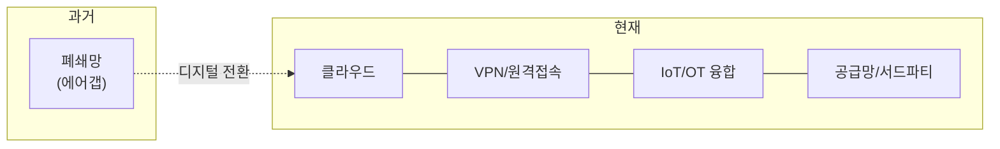

# 위협 환경과 침해사고 — 우리는 무엇에 맞서는가

도구를 만들기 전에, **왜 만드는지**를 먼저 이해해야 합니다. 적이 누구이고 어떻게 움직이는지 모른 채 만든 도구는, 화려해 보여도 정작 필요한 곳을 지키지 못합니다. 그래서 이번 강의에서는 코드를 한 줄도 쓰지 않습니다. 대신 **우리가 맞서야 할 위협 환경**을 분명히 그려 둡니다.

> **🎯 우리가 지금 왜 이걸 하나요?**  
> 보안은 "기술"이기 전에 "맥락"입니다. 같은 `nmap` 명령도, 그것이 *어떤 위협을 막기 위한 것인지* 알고 쓰는 사람과 모르고 쓰는 사람은 전혀 다른 결과를 만듭니다. 이번 강의에서 위협의 큰 그림을 잡아 두면, 앞으로 만드는 모든 도구가 "그래서 이게 어떤 공격을 잡는 거지?"라는 질문에 스스로 답할 수 있게 됩니다.
{: .prompt-info }

다루는 내용:

1. 우리가 지키려는 것 — 정보통신 기반시설과 보안의 3계층
2. 공격 표면은 왜 계속 넓어지는가
3. 침해사고란 무엇인가 (법적 정의)
4. 2026년의 위협 — 생성형 AI를 악용한 공격
5. 실제 사례로 보는 피해
6. 침해가 가져오는 손실 — 기술을 넘어서

---

## 1. 우리가 지키려는 것 — 정보통신 기반시설과 보안의 3계층

먼저 **무엇을 지키는가**부터 정의합니다. 법은 **정보통신 기반시설**을 이렇게 정의합니다.

> "국가안전보장, 행정, 국방, 금융, 통신, 운송, 에너지 등 국가 및 사회의 중요 기능을 수행하는 데 필요한 전자적 제어·관리시스템과 정보통신망" — 「정보통신기반 보호법」 제2조

전력·금융·교통처럼 멈추면 사회가 흔들리는 시스템들입니다. 이런 시스템을 지키는 보안은 보통 **세 개의 계층**으로 나눕니다. 이 분류는 앞으로 계속 등장하므로 기억해 두면 좋습니다.

| 계층 | 무엇을 다루는가 | 예시 |
|---|---|---|
| **관리적 보안** | 정책·조직·사람·절차 | 정보보호 정책 수립, 교육·훈련, 자산 분류 |
| **물리적 보안** | 공간·설비 | 출입 통제, 감시(CCTV), 전력 보호 |
| **기술적 보안** | 시스템·데이터 | 계정·권한·패치·로그 관리, 접근통제 |

> 우리가 이 시리즈에서 만드는 자동화 도구는 대부분 **기술적 보안**(특히 *패치·로그·점검*) 영역에 속합니다. 하지만 6~7부에서 침해사고 대응과 보안관제를 다룰 때는 **관리적 보안**(조직·절차·신고)까지 함께 봅니다. 좋은 방어는 한 계층만으로 완성되지 않기 때문입니다.
{: .prompt-tip }

---

## 2. 공격 표면은 왜 계속 넓어지는가

예전에는 "중요한 시스템은 인터넷과 끊어 두면 안전하다"는 생각이 통했습니다. 이를 **에어갭(Air Gap)**, 즉 물리적 분리라고 합니다. 그런데 지금은 이 전제가 무너지고 있습니다. 그 이유를 세 가지로 정리합니다.

**① 디지털 전환의 가속**  
클라우드·5G/6G·IoT가 확산되면서, 과거 폐쇄망에 있던 전력망·금융망·교통망이 네트워크에 편입됩니다. 연결되는 시스템이 많아질수록 공격자가 노릴 **접점(Attack Surface)**도 많아지고, 한 곳이 뚫리면 옆으로 번지는 **연쇄 공격** 위험이 커집니다.

**② 융합과 에어갭의 붕괴**  
예를 들어 발전소의 제어 시스템(SCADA)이 관제센터·클라우드와 연동되면, "물리적으로 분리된 폐쇄망"이라는 전제가 깨집니다. 그 빈틈으로 **원격 접속(VPN)·공급망·서드파티 관리시스템**이 새로운 침투로가 됩니다.

**③ 방어와 공격의 속도 격차**  
많은 기관이 오래된 시스템(OT 레거시), 부족한 보안 인력, 복잡한 규제 탓에 패치·모니터링이 늦어집니다. 그 틈을 **APT(Advanced Persistent Threat: 지능형 지속 위협) 그룹**이나 **랜섬웨어 집단**이 반복적으로 노립니다.

> **APT란?** Advanced Persistent Threat. "고도화되고(Advanced) 지속적인(Persistent) 위협". 단발성 공격이 아니라, 특정 표적에 **오래 잠복하며** 천천히 목표를 달성하는 공격 방식입니다. 02강의 사이버 킬체인이 바로 이런 단계적 공격을 설명합니다.
{: .prompt-info }

---

## 3. 침해사고란 무엇인가

"해킹당했다"는 말은 일상에서 흔히 쓰지만, 법은 **침해사고**를 명확히 정의합니다.

> "해킹, 컴퓨터바이러스, 논리폭탄, 메일폭탄, 서비스 거부 또는 고출력 전자기파 등의 방법으로 정보통신망의 정상적인 보호·인증 절차를 우회하여 정보통신망에 접근할 수 있도록 하는 프로그램이나 기술적 장치 등을 정보통신망 또는 정보시스템에 설치하는 방법으로 정보통신망 또는 정보시스템을 공격하는 행위로 인하여 발생한 사태." — 「정보통신망법」 제2조

이 정의가 중요한 이유는, 침해사고로 **인정되는 순간 법적 의무(신고 등)가 발생**하기 때문입니다. 단순히 "이상하다"가 아니라 "사고(incident)로 격상할지"를 판단하는 과정은 매우 중요한데, 이는 17강(이상징후 탐지·Triage)과 18강(침해사고 대응)에서 자세히 다룹니다.

---

## 4. 2026년의 위협 — 생성형 AI를 악용한 공격

00강에서도 강조했듯, 가장 큰 변화는 **공격자가 AI를 쓰기 시작했다**는 점입니다. 구체적으로 세 가지 양상입니다.

- **공격 준비 단계의 자동화**: 생성형 AI가 취약점 스캔용 코드, 악성 매크로·랜섬웨어 샘플, 인프라 구축 스크립트를 만들어 줍니다. 과거에 개발 역량이 필요하던 작업을 **비전문가도 빠르게** 수행하게 됩니다.
- **반자동 공격 시나리오**: 공개 모델과 프롬프트만으로 취약 서비스·포트 스캔 전략, 권한 상승 아이디어, 우회 기법을 조합합니다.
- **적응형 공격**: AI 봇이 탐지 이벤트·로그를 분석해 "어떤 보안 장비·규칙에서 차단됐는지"를 파악하고, 우회 경로나 다른 페이로드를 스스로 제안합니다.

> 바로 이 지점이 이 시리즈의 존재 이유입니다. **공격자가 AI로 자동화한다면, 방어자도 AI 자동화를 이해하고 활용해야 합니다.** 우리는 이 시리즈에서 공격 자동화를 직접 만들어 보고(2~3부), 그것이 남기는 흔적을 AI로 탐지하는 방어 자동화(5~7부)까지 완성합니다.
{: .prompt-warning }

---

## 5. 실제 사례로 보는 피해

추상적인 위협이 아니라, 실제로 일어난 사고들을 봅니다. 각 사례가 던지는 교훈에 주목해 주세요.

### 5.1 Volt Typhoon — 기반시설에 잠복한 APT

중국 정부가 지원하는 것으로 분석된 APT 그룹으로, 2021년부터 미국의 통신·에너지·항만·상하수도 등 핵심 기반시설에 **조용히 침투**해 왔습니다. 취약한 라우터·VPN·방화벽 같은 **엣지 장비**를 악용해 봇넷을 만들고, 침투 후에는 PowerShell 같은 **정상 시스템 도구만 사용하는 'Living off the Land(LotL)'** 전술로 장기간 탐지를 회피했습니다.

> **교훈**: 공격은 요란하지 않습니다. 정상 도구를 쓰며 숨어 있기 때문에, **"무엇이 정상인지(Baseline)"를 알아야 비정상을 잡을 수 있습니다.** 이 개념이 17강 탐지의 핵심입니다.

### 5.2 호주 DP World 항만 마비 — 가용성의 붕괴

2023년 11월, 호주 물동량의 40%를 담당하는 DP World가 공격 징후를 포착하고 **데이터 보호를 위해 전산망을 선제적으로 차단**했습니다. 그 결과 화물 시스템(IT)과 현장 설비(OT)의 연결이 끊겨 주요 항만 4곳이 3일간 멈췄습니다.

> **교훈**: 데이터 유출만 피해가 아닙니다. **가용성(서비스가 멈추지 않는 것)**도 핵심 자산입니다. 무조건적 셧다운보다, 핵심 기능을 유지하는 **업무 연속성 계획(BCP)**이 필요합니다.

### 5.3 Suncor / Petro-Canada — 에너지 기업 랜섬웨어

2023년 캐나다 Suncor Energy가 랜섬웨어 공격을 받아 자회사 주유소의 결제·세차 시스템이 마비되고 신용카드 결제가 불가능해졌습니다. IT망 침해가 곧바로 **대국민 서비스 중단**으로 이어진 사례입니다.

> **교훈**: 24시간 멈출 수 없는 시스템일수록 공격자에게 **몸값을 받아내기 좋은 표적**이 됩니다. 에너지·금융처럼 가용성이 생명인 분야가 특히 위험합니다.

---

## 6. 침해가 가져오는 손실 — 기술을 넘어서

마지막으로, 침해사고가 단순한 "기술 문제"가 아니라는 점을 강조합니다. 피해는 세 방향으로 번집니다.

| 손실 유형 | 내용 |
|---|---|
| **① 재무적 손실** | 몸값보다 **시스템 다운타임으로 인한 기회비용**이 훨씬 큽니다. 오염된 인프라 재구축·장비 교체 비용도 막대합니다. |
| **② 법적 책임** | 제어 시스템 오작동이 인명 피해로 이어지면 **경영책임자 형사 처벌**(중대재해처벌법)까지 가능합니다. 개인정보 유출 시 매출의 일정 비율을 **과징금**으로 부과받을 수 있습니다. |
| **③ 사회적 신뢰** | "기반시설이 뚫렸다"는 인식은 기관의 존재 가치를 흔듭니다. 기술 복구는 며칠이면 되지만, **떠나간 신뢰를 복구하는 데는 수년**이 걸립니다. |

> **점검·관제 인사이트**: 그래서 보안 투자는 "비용"이 아니라 "보험"입니다. 우리가 만들 자동화 점검·관제 도구의 진짜 가치는, *사고가 나기 전에 약점을 찾고, 사고가 나면 빨리 탐지·대응해 위 세 가지 손실을 줄이는 것*입니다. 이 큰 그림을 잊지 않는 것이 이 시리즈를 끝까지 관통하는 관점입니다.
{: .prompt-tip }

---

## 7. 다음 강의 예고

위협의 큰 그림을 그렸으니, 다음 **02강**에서는 공격자가 **구체적으로 어떤 단계를 밟아 들어오는지**를 봅니다. 록히드 마틴의 **사이버 킬체인(Cyber Kill Chain)** 7단계를 따라가며, 각 단계가 우리 시리즈의 어느 부분(정찰 자동화·취약점 점검·탐지)과 연결되는지 짚겠습니다.

---

## 참고 자료

- 「정보통신기반 보호법」 제2조 (정보통신 기반시설 정의)
- 「정보통신망 이용촉진 및 정보보호 등에 관한 법률」 제2조 (침해사고 정의)
- SK쉴더스, *보안 트렌드 — 생성형 AI 악용 공격* — [https://www.skshieldus.com/blog-security/security-trend-idx-13](https://www.skshieldus.com/blog-security/security-trend-idx-13)
- CISA, *Volt Typhoon Advisory* — [https://www.cisa.gov/news-events/cybersecurity-advisories](https://www.cisa.gov/news-events/cybersecurity-advisories)
- 데일리시큐, *Volt Typhoon 분석* — [https://www.dailysecu.com/news/articleView.html?idxno=153472](https://www.dailysecu.com/news/articleView.html?idxno=153472)
- 연합뉴스, *호주 DP World 항만 사이버공격* — [https://www.yna.co.kr/view/AKR20231112032000104](https://www.yna.co.kr/view/AKR20231112032000104)
- CBC, *Suncor/Petro-Canada cybersecurity incident* — [https://www.cbc.ca/news/business/petro-canada-suncor-cybersecurity-1.6888723](https://www.cbc.ca/news/business/petro-canada-suncor-cybersecurity-1.6888723)
- MITRE ATT&CK, *Living off the Land* 기법 — [https://attack.mitre.org/](https://attack.mitre.org/)
