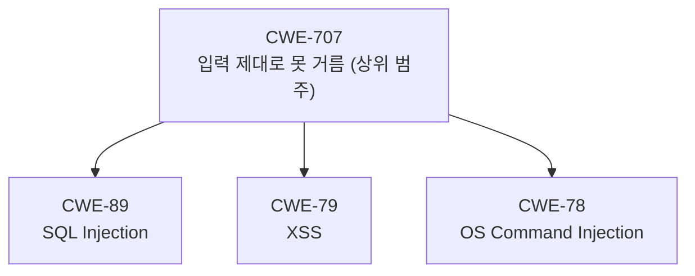
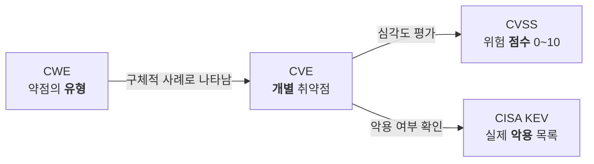
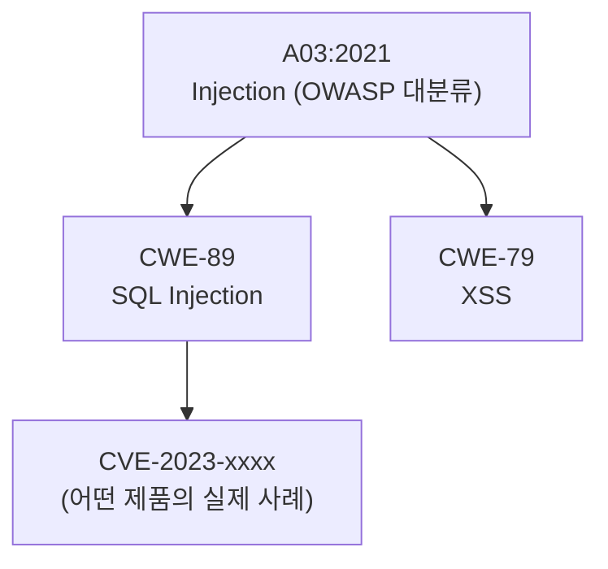

# 취약점의 공통 언어 — CWE·CVE·CVSS·KEV

앞선 강의에서 우리는 AI 에이전트의 두뇌를 PC 안에 들여놓았습니다. 이제는 그 두뇌가 무언가를 발견했을 때, 그 발견을 **어떤 말로 부를지**를 정해야 합니다.

같은 취약점을 두고 어떤 사람은 "SQL 주입"이라 하고, 어떤 사람은 "DB 인젝션", 또 어떤 사람은 "쿼리 조작 버그"라고 부른다면 어떻게 될까요? 점검 결과를 모아도 분류가 안 되고, 둘 중 무엇이 더 급한지 우선순위를 매길 수도 없으며, 다른 팀에 공유해도 서로 못 알아듣습니다. **사람마다 다른 말을 쓰면, 소통도 자동화도 불가능합니다.**

그래서 전 세계가 합의한 "공통 언어"가 존재합니다. 이번 강의에서 배울 **CWE·CVE·CVSS·KEV**가 바로 그 언어입니다. 우리가 앞으로 만들 AI 점검 도구도, 무언가를 발견하면 반드시 이 공통 언어로 분류해야 비로소 쓸모가 생깁니다.

> **🎯 우리가 지금 왜 이걸 하나요?**  
> AI가 "여기 뭔가 이상해요"라고만 말하면 아무 쓸모가 없어요. "이건 **CWE-89(SQL 인젝션)** 유형이고, **CVSS 9.8점(Critical)**짜리이며, **CISA(미국 사이버보안 및 기간시설 안보국) KEV 목록에 올라 실제 악용 중**입니다"라고 말해야 우리가 행동할 수 있죠. 즉 발견을 **분류하고 · 우선순위를 매기고 · 남과 공유**하려면, 모두가 똑같이 알아듣는 표준 용어가 필요해요. 이번 강의는 그 표준 네 가지를 손에 익히는 단계예요. 뒤에서 만들 도구가 이 단어들을 그대로 출력하게 될 거예요.
{: .prompt-info }

이 포스트에서 다룰 내용:

1. CWE — 어떤 **종류**의 약점인가
2. CVE — 어떤 제품에 알려진 **개별** 구멍이 있는가
3. CVSS — 얼마나 **위험**한가
4. KEV — 실제로 **악용**되고 있는가
5. 네 개념의 관계 한눈에 보기
6. OWASP Top 10과의 관계
7. 우리 시리즈에서 이걸 어떻게 쓰는가

---

## 1. CWE — "어떤 종류의 약점인가"

**CWE(Common Weakness Enumeration: 공통 약점 목록)** 는 **약점의 유형(종류)을 분류해 둔 사전**입니다. 미국의 비영리 연구기관 **MITRE**가 관리합니다.

여기서 핵심은 "특정 제품의 버그"가 아니라 **"약점의 종류"** 라는 점입니다. 예를 들어 "사용자 입력을 그대로 SQL 쿼리에 끼워 넣는 실수"는 어느 제품에서 발생하든 **같은 종류의 약점**이며, 여기에 `CWE-89`라는 번호가 붙어 있습니다.

자주 만나는 CWE 몇 가지를 보겠습니다.

| CWE 번호 | 이름 | 한마디로 |
| --- | --- | --- |
| CWE-89 | SQL Injection | 입력을 SQL 쿼리에 그대로 끼워 넣어 DB를 조작당함 |
| CWE-79 | Cross-site Scripting (XSS) | 입력을 웹 화면에 그대로 출력해 스크립트가 실행됨 |
| CWE-78 | OS Command Injection | 입력을 운영체제 명령에 그대로 넣어 명령이 실행됨 |
| CWE-22 | Path Traversal | `../` 같은 경로로 허용되지 않은 파일에 접근함 |

CWE는 **계층 구조(트리)** 를 가집니다. 큰 범주 아래에 더 구체적인 약점이 가지처럼 달려 있습니다. 예를 들어 "입력값을 제대로 걸러내지 못해 생기는 약점"이라는 큰 묶음(CWE-707, Improper Neutralization) 아래에 SQL 인젝션·XSS·명령어 인젝션이 더 구체적인 가지로 들어갑니다.



> **CWE가 답하는 질문:** "이건 **어떤 종류**의 약점인가요?"
{: .prompt-tip }

---

## 2. CVE — "이 제품 이 버전에 알려진 구멍이 있는가"

**CVE(Common Vulnerabilities and Exposures: 공통 취약점 및 노출)** 는 **특정 제품에 실제로 발견된 개별 취약점에 붙이는 고유 식별자**입니다.

CWE가 "SQL 인젝션이라는 **종류**"를 가리킨다면, CVE는 "**A 회사의 B 제품 2.3 버전에 있는 바로 그 구멍**"을 가리키는 일련번호입니다. 형식은 다음과 같습니다.

```
CVE-연도-번호
예) CVE-2023-4966
```

`CVE-2023-4966`은 **CitrixBleed**라는 별명으로 알려진 실제 취약점으로, 02강에서도 언급했던 사례입니다. Citrix NetScaler 장비의 특정 버전에서 인증을 우회해 세션을 탈취당할 수 있는 구멍이었고, 전 세계적으로 크게 악용되었습니다.

CVE는 미국 국립표준기술연구소(NIST)가 운영하는 **NVD(National Vulnerability Database: 미국 국립 취약점 데이터베이스)** 에서 관리되고, 상세 정보와 점수가 부여됩니다. NVD에서 CVE 하나를 찾아보면 "이 CVE는 어떤 **CWE 유형**에 속하는가"와 "**CVSS 점수**는 몇 점인가"가 함께 적혀 있습니다. 즉 CVE는 CWE·CVSS와 자연스럽게 연결됩니다.

> **CVE가 답하는 질문:** "이 제품 이 버전에 **이미 알려진 구멍**이 있나요?"
{: .prompt-tip }

---

## 3. CVSS — "얼마나 위험한가"

**CVSS(Common Vulnerability Scoring System: 공통 취약점 평가 시스템)** 는 취약점의 **심각도를 0.0 ~ 10.0 점수로 매기는 표준**입니다. 국제 침해사고대응 협의체인 **FIRST**가 표준을 정합니다.

점수는 세 그룹의 지표로 계산됩니다.

| 그룹 | 무엇을 보는가 |
| --- | --- |
| **Base** | 취약점 자체의 고유한 특성(공격 난이도, 영향 범위 등). 시간이 지나도 잘 안 변함 |
| **Temporal** | 시간에 따라 변하는 요소(악용 코드 공개 여부, 패치 존재 여부 등) |
| **Environmental** | 우리 조직 환경에 맞춘 보정(그 자산이 우리에게 얼마나 중요한가 등) |

보통 뉴스나 데이터베이스에서 보는 한 줄짜리 점수는 **Base 점수**입니다. 점수에 따라 등급이 나뉩니다.

| 점수 범위 | 등급 |
| --- | --- |
| 9.0 ~ 10.0 | **Critical(긴급)** |
| 7.0 ~ 8.9 | **High(높음)** |
| 4.0 ~ 6.9 | **Medium(보통)** |
| 0.1 ~ 3.9 | **Low(낮음)** |

예를 들어 앞의 CitrixBleed(`CVE-2023-4966`)는 CVSS 점수가 매우 높아 Critical로 분류되었습니다. 점수가 높을수록 "이론적으로 더 위험하다"는 뜻입니다.

> **CVSS가 답하는 질문:** "이 취약점은 **얼마나 위험**한가요?"
{: .prompt-tip }

---

## 4. KEV — "실제로 악용되고 있는가"

여기서 한 가지 함정이 있습니다. **CVSS 점수가 높다고 해서 항상 가장 먼저 막아야 하는 것은 아닙니다.** 점수가 9점이어도 현실에서 아무도 공격에 쓰지 않는 취약점이 있고, 점수가 7점이어도 지금 이 순간 전 세계에서 활발히 악용되는 취약점이 있습니다.

그래서 미국의 사이버보안 기관 **CISA(Cybersecurity and Infrastructure Security Agency: 사이버보안 및 기간시설 안보국)**는 **KEV(Known Exploited Vulnerabilities: 알려진 악용 취약점) 카탈로그**를 운영합니다. 이것은 **"실제 공격에 악용되고 있다고 확인된 취약점 목록"** 입니다.

판단 기준은 단순합니다.

- CVSS 점수가 높지만 **실제 악용 사례가 없는** 취약점
- CVSS 점수는 그보다 낮지만 **KEV 목록에 올라 지금 악용 중인** 취약점

→ 둘 중 **KEV에 오른 것을 먼저 막아야** 합니다. "이론상 위험"보다 "지금 실제로 당하고 있음"이 더 급하기 때문입니다.

참고로 **EPSS(Exploit Prediction Scoring System: 악용 예측 평가 시스템)** 라는 지표도 있는데, 이것은 "앞으로 이 취약점이 악용될 **확률**"을 0~1 사이 점수로 예측합니다. KEV가 "이미 악용 중인 확정 목록"이라면, EPSS는 "앞으로 악용될 가능성"을 가늠하는 보조 도구입니다.

> **KEV가 답하는 질문:** "이 취약점이 **실제로 악용**되고 있나요?" → 우선순위 판단의 결정적 근거
{: .prompt-tip }

---

## 5. 네 개념의 관계 한눈에 보기

지금까지의 네 개념은 따로 노는 것이 아니라 **하나의 흐름**으로 이어집니다.



같은 내용을 "질문 ↔ 개념"으로 정리하면 더 외우기 쉽습니다.

| 던지는 질문 | 답을 주는 개념 |
| --- | --- |
| 이건 **어떤 종류**의 약점인가? | **CWE** |
| **알려진 구멍**이 있는가? | **CVE** |
| **얼마나 위험**한가? | **CVSS** |
| **실제로 악용**되고 있는가? | **KEV** |

이 표 한 장이 이번 강의의 핵심입니다. 네 단어를 각각의 질문과 묶어서 기억해 두면 됩니다.

---

## 6. OWASP Top 10과의 관계

웹 보안을 공부하다 보면 **OWASP Top 10**이라는 말도 자주 듣게 됩니다. 이것은 CWE·CVE와 경쟁하는 다른 체계가 아니라, **웹 취약점을 큰 카테고리로 묶어 둔 "대분류 목록"** 입니다.

OWASP Top 10의 각 항목은 그 안에 **여러 개의 CWE를 포함**합니다. 즉 CWE보다 한 단계 위에서 묶는 큰 우산입니다.

| OWASP Top 10 항목 | 포함하는 CWE 예시 |
| --- | --- |
| A03:2021 - Injection | CWE-89(SQL Injection), CWE-79(XSS) |
| A01:2021 - Broken Access Control | CWE-22(Path Traversal) 등 |



정리하면 **OWASP Top 10(대분류) ⊃ CWE(약점 유형) → CVE(개별 사례)** 의 순서로 점점 구체적이 됩니다.

---

## 7. 우리 시리즈에서 이걸 어떻게 쓰나요

> **🛠️ 앞으로의 활용 예고**  
> 우리 시리즈에서 **10~12강**은 AI 점검 도구가 발견한 취약점을 **CWE로 자동 분류**하게 만들고, **14강**은 거기에 **CVE/CVSS 정보를 덧붙여 보강**합니다. 특히 중요한 점은, AI(LLM)는 그럴듯한 거짓말을 잘 지어낸다는 것이에요. 존재하지도 않는 "CWE-9999" 같은 번호를 자신 있게 내놓을 수 있죠. 그래서 우리는 **"유효한 CWE 목록 안에서만 고르도록"** 강제하는 검증 단계를 둘 겁니다. 이 검증이 도구의 신뢰성을 좌우하는 핵심이에요.
{: .prompt-tip }

다시 말해, 이번 강의에서 배운 공통 언어는 단순한 용어 암기가 아니라 **우리 도구의 출력 형식 그 자체**가 됩니다. 도구가 "CWE-89 / CVSS 9.8(Critical) / KEV 등재"처럼 표준 용어로 결과를 내놓아야, 사람과 다른 시스템이 그 결과를 곧바로 받아 쓸 수 있습니다.

---

## 정리

- **CWE** = 약점의 **유형**(MITRE, 계층 구조) → "어떤 종류?"
- **CVE** = 제품의 **개별** 취약점 식별자(NVD 관리, `CVE-연도-번호`) → "알려진 구멍?"
- **CVSS** = 0~10 **심각도 점수**(FIRST, Base/Temporal/Environmental) → "얼마나 위험?"
- **KEV** = CISA의 **실제 악용** 목록 → "지금 당하고 있나?" → 우선순위의 결정 근거
- **OWASP Top 10**은 CWE들을 묶는 **대분류 우산**
- AI 도구는 발견을 반드시 이 공통 언어로 분류해야 쓸모가 있고, LLM이 **유효한 값만 고르도록 검증**하는 것이 핵심입니다.

---

## 참고 자료

- MITRE CWE: <https://cwe.mitre.org/>
- NVD (CVE): <https://nvd.nist.gov/>
- FIRST CVSS: <https://www.first.org/cvss/>
- CISA KEV Catalog: <https://www.cisa.gov/known-exploited-vulnerabilities-catalog>
- OWASP Top 10: <https://owasp.org/Top10/>

---

## 다음 강의 예고

다음 **04강**에서는 **격리 랩 설계 원칙**을 다룹니다. 취약한 시스템을 마음껏 공격하고 실험하려면, 바깥 세상과 안전하게 분리된 "연습장"이 필요합니다. 어떤 원칙으로 격리된 실험 환경을 설계해야 하는지, 그리고 우리 실습 랩을 어떻게 구성할지 함께 만들어 보겠습니다.
