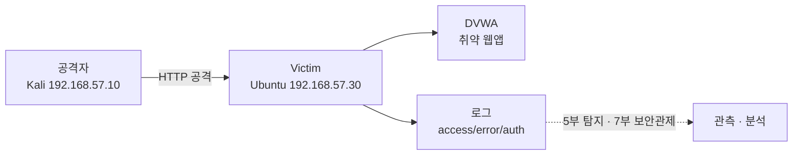

# Victim 구축 — 취약 웹 서버와 로그 발생원 만들기

04강에서는 공격자(Kali)와 표적(Ubuntu)이 외부 인터넷과 분리된 채 서로만 통신하는 **격리 랩**을 설계했습니다.
이제 그 랩 안에 진짜 표적, 즉 **Victim**을 세울 차례입니다.

> **🎯 우리가 지금 왜 이걸 하나요?**
> 공격을 연습하려면 "마음껏 공격해도 되는 대상"이 필요합니다. 남의 서버를 건드리면 범죄지만, 우리가 직접 세운 **의도적으로 취약한 서버**는 얼마든지 두드려 볼 수 있습니다. 게다가 우리는 이 서버를 단순한 과녁이 아니라 **"흔적을 남기는 관측 대상"**으로 만들 거예요. 공격이 일어나면 로그가 쌓이고, 그 로그가 나중에 AI 탐지와 보안관제의 재료가 되기 때문입니다.
{: .prompt-info }

## 왜 DVWA인가요?

실제 서비스 서버를 공격 대상으로 삼는 것은 불법입니다. 그래서 우리는 **DVWA(Damn Vulnerable Web Application)**를 사용합니다.
DVWA는 "일부러 보안 구멍을 잔뜩 뚫어 둔" 웹 애플리케이션입니다. SQL 인젝션, XSS, 명령어 주입 등 교과서에 나오는 취약점을 **합법적으로, 안전하게** 실습할 수 있도록 만들어진 학습용 표적입니다.

그런데 이 강의가 보통의 DVWA 설치 가이드와 다른 점이 하나 있습니다.
우리는 Victim을 세우면서 동시에 **관측 지점(observation point)**을 함께 설계합니다.
공격은 반드시 로그를 남기고, 그 로그를 우리가 읽을 수 있어야 합니다. 그래야 공격과 탐지를 한 화면에서 이어 볼 수 있습니다.



전체 작업 순서는 다음과 같습니다.

| 단계 | 위치 | 하는 일 |
| --- | --- | --- |
| 1 | Victim(Ubuntu) | LAMP(Linux, Apache, MariaDB, PHP) 스택 설치 |
| 2 | Victim(Ubuntu) | DVWA 설치 및 DB 연결 |
| 3 | Victim(브라우저) | DVWA 초기화 · 보안레벨 설정 |
| 4 | 공격자(Kali) | 표적과 통신 확인 |
| 5 | 공격자(Kali) | 파이썬 작업 환경 준비 |
| 6 | Victim(Ubuntu) | 관측 지점(로그) 설계 |
| 7 | VM 관리자 | 스냅샷 저장 |

---

## 1. 대상 서버에 LAMP(Linux, Apache, MariaDB, PHP) 설치하기

> **시작 전 — 인터넷을 켜 두세요.** 이번 강의의 설치 명령(`apt install`, `git clone`)은 인터넷이 필요합니다. 04강에서 안내한 대로 **어댑터 2(NAT)를 켠 상태**로 설치를 진행하고, 설치가 끝나 공격 자동화를 시작하는 08강부터는 NAT를 꺼서 랩을 격리하세요.
{: .prompt-warning }

DVWA는 PHP로 작성된 웹앱이며, 데이터를 데이터베이스에 저장합니다.
따라서 표적 서버(Ubuntu 24.04, `192.168.57.30`)에는 **L**inux + **A**pache + **M**ariaDB + **P**HP, 즉 LAMP 스택이 필요합니다.

먼저 패키지 목록을 최신화합니다.

```bash
sudo apt update
```

예상 출력:

```text
Hit:1 http://archive.ubuntu.com/ubuntu noble InRelease
...
Reading package lists... Done
Building dependency tree... Done
```

이제 웹 서버, 데이터베이스, PHP와 연동 모듈을 한 번에 설치합니다.

```bash
sudo apt install -y apache2 mariadb-server php php-mysqli php-gd libapache2-mod-php git
```

예상 출력(끝부분):

```text
...
Setting up apache2 (2.4.58-...) ...
Setting up mariadb-server (1:10.11...) ...
Processing triggers for ...
```

설치가 끝나면 웹 서버와 DB가 실제로 켜져 있는지 확인합니다.

```bash
systemctl is-active apache2 mariadb
```

예상 출력:

```text
active
active
```

> 두 줄 모두 `active`가 나와야 정상입니다. `inactive`나 `failed`가 보이면 `sudo systemctl start apache2 mariadb`로 다시 시작합니다.
{: .prompt-tip }

---

## 2. DVWA 설치하고 DB 연결하기

DVWA 소스를 웹 루트(`/var/www/html`) 아래로 내려받습니다.

```bash
sudo git clone https://github.com/digininja/DVWA.git /var/www/html/DVWA
```

예상 출력:

```text
Cloning into '/var/www/html/DVWA'...
remote: Enumerating objects: ...
Receiving objects: 100% ...
Resolving deltas: 100% ...
```

DVWA는 설정 파일의 **샘플 버전**을 제공합니다. 이를 실제 설정 파일로 복사합니다.

```bash
cd /var/www/html/DVWA/config
sudo cp config.inc.php.dist config.inc.php
```

이제 설정 파일을 열어 DB 접속 정보를 확인하고 필요하면 맞춥니다.

```bash
sudo nano config.inc.php
```

다음 네 줄이 핵심입니다. 기본값을 그대로 사용하겠습니다.

```php
$_DVWA[ 'db_server' ]   = '127.0.0.1';
$_DVWA[ 'db_database' ] = 'dvwa';
$_DVWA[ 'db_user' ]     = 'dvwa';
$_DVWA[ 'db_password' ] = 'p@ssw0rd';
```

설정 파일에 적은 그대로, MariaDB에 **dvwa 데이터베이스**와 **dvwa 계정**을 만들어 줍니다.

```bash
sudo mysql -e "CREATE DATABASE IF NOT EXISTS dvwa;"
sudo mysql -e "CREATE USER IF NOT EXISTS 'dvwa'@'127.0.0.1' IDENTIFIED BY 'p@ssw0rd';"
sudo mysql -e "GRANT ALL PRIVILEGES ON dvwa.* TO 'dvwa'@'127.0.0.1';"
sudo mysql -e "FLUSH PRIVILEGES;"
```

각 명령은 성공하면 아무 메시지 없이 프롬프트로 돌아옵니다. 계정이 잘 만들어졌는지 확인해 봅니다.

```bash
sudo mysql -e "SELECT User, Host FROM mysql.user WHERE User='dvwa';"
```

예상 출력:

```text
+------+-----------+
| User | Host      |
+------+-----------+
| dvwa | 127.0.0.1 |
+------+-----------+
```

마지막으로 웹 서버가 DVWA 폴더를 읽고 쓸 수 있도록 소유권을 정리한 뒤 Apache를 재시작합니다.

```bash
sudo chown -R www-data:www-data /var/www/html/DVWA
sudo systemctl restart apache2
```

> DVWA는 설치 과정에서 일부 파일을 직접 생성합니다. 그래서 웹 서버 계정(`www-data`)에게 폴더 소유권을 넘기는 단계가 꼭 필요합니다.
{: .prompt-tip }

> **DB 연결 실패(흔한 오류)**: `setup.php`에서 데이터베이스 연결 오류가 뜨면, `config.inc.php`의 DB 계정·비밀번호·서버 주소(`127.0.0.1`)가 위에서 만든 MariaDB 계정과 **정확히 일치**하는지 먼저 확인하세요. 그래도 안 되면 DVWA 폴더의 디렉터리 권한(`www-data` 소유 여부)을 다시 점검합니다.
{: .prompt-warning }

---

## 3. 브라우저로 DVWA 초기화하기

이제 사람이 직접 한 번 손을 댑니다. **Victim 안의 브라우저** 또는 같은 랩 네트워크의 브라우저에서 다음 주소로 접속합니다.

```text
http://192.168.57.30/DVWA/setup.php
```

화면 아래쪽의 **`Create / Reset Database`** 버튼을 누릅니다. 그러면 DVWA가 필요한 테이블을 자동으로 만들고 로그인 페이지로 넘어갑니다.

로그인 화면에서 기본 계정으로 들어갑니다.

| 항목 | 값 |
| --- | --- |
| Username | `admin` |
| Password | `password` |

로그인 후 왼쪽 메뉴의 **`DVWA Security`**로 들어가 보안 수준을 **`Low`**로 설정하고 `Submit`을 누릅니다.

> 보안 수준을 `Low`로 두는 이유는, 취약점이 가장 잘 드러나는 상태에서 공격과 로그 발생을 먼저 익히기 위해서입니다. 익숙해지면 나중에 `Medium`, `High`로 올려 가며 난이도를 높이게 됩니다.
{: .prompt-info }

---

## 4. 공격자(Kali)에서 통신 확인하기

### 4-0. 고정 IP를 영구로 박아 두기 (netplan)

본격적으로 통신을 확인하기 전에, 두 VM의 IP가 **재부팅 후에도 그대로 유지되는지** 먼저 짚고 넘어가겠습니다.

> 만약 `ip addr add 192.168.57.30/24 dev enp0s3` 같은 명령으로 IP를 직접 붙였다면, 그 설정은 **임시**입니다. 재부팅하면 사라져서 표적이 다른 IP로 떠 버리고, 그러면 공격 스크립트가 전부 표적을 못 찾게 됩니다.
{: .prompt-warning }

Ubuntu 24.04에서 고정 IP를 **영구**로 박아 두려면 `/etc/netplan/` 아래에 YAML 설정을 둡니다. 먼저 인터페이스 이름을 확인합니다.

```bash
ip a
```

출력에서 `lo`(루프백)가 아닌 이더넷 장치 이름(예: `enp0s3`, `ens33` 등)을 찾습니다. 그 이름을 아래 YAML에 그대로 넣습니다.

```yaml
# /etc/netplan/01-victim.yaml
network:
  version: 2
  ethernets:
    enp0s3:                 # 실제 인터페이스명은 `ip a`로 확인
      dhcp4: no
      addresses: [192.168.57.30/24]
```

저장한 뒤 설정을 적용합니다.

```bash
sudo netplan apply
```

> 공격자(Kali)도 같은 내부망 대역의 고정 IP(`192.168.57.10`)를 쓰도록 맞춰 둡니다. Kali는 보통 **NetworkManager** GUI에서 수동(Manual) 주소를 지정하거나, `/etc/network/interfaces` 또는 netplan으로 동일하게 고정합니다.
{: .prompt-tip }

> **재부팅 후 재확인**: 두 VM을 각각 재부팅한 뒤, Kali에서 `ping -c 3 192.168.57.30`이 여전히 응답하는지 확인하세요. 재부팅 후에도 같은 대역에서 통신되면 고정 IP가 제대로 박힌 것입니다.
{: .prompt-tip }

### 4-1. 표적에 닿는지 확인하기

표적이 준비됐으니, 공격자 자리(Kali, `192.168.57.10`)에서 표적에 닿는지 확인합니다.
가장 먼저 네트워크 연결 자체를 점검합니다.

```bash
ping -c 3 192.168.57.30
```

예상 출력:

```text
PING 192.168.57.30 (192.168.57.30) 56(84) bytes of data.
64 bytes from 192.168.57.30: icmp_seq=1 ttl=64 time=0.412 ms
64 bytes from 192.168.57.30: icmp_seq=2 ttl=64 time=0.387 ms
64 bytes from 192.168.57.30: icmp_seq=3 ttl=64 time=0.401 ms

--- 192.168.57.30 ping statistics ---
3 packets transmitted, 3 received, 0% packet loss, time 2003ms
```

`0% packet loss`가 보이면 두 VM이 서로 통신하고 있다는 뜻입니다.

다음으로 웹 서버가 실제로 응답하는지, HTTP 헤더만 가볍게 받아 봅니다.

```bash
curl -I http://192.168.57.30/DVWA/login.php
```

예상 출력:

```text
HTTP/1.1 200 OK
Date: Wed, 10 Jun 2026 04:00:00 GMT
Server: Apache/2.4.58 (Ubuntu)
Set-Cookie: PHPSESSID=...; path=/
Set-Cookie: security=low
Content-Type: text/html; charset=UTF-8
```

`HTTP/1.1 200 OK`와 `Server: Apache`가 보이면 표적 웹앱이 살아 있고 우리 공격을 받을 준비가 됐다는 신호입니다.

---

## 5. Kali 파이썬 작업 환경 준비하기

앞으로 우리가 작성할 코드는 모두 공격자(Kali)에 둡니다. 작업 폴더를 하나 정해 두면 흩어지지 않습니다.

```bash
mkdir -p ~/ai-pentest
cd ~/ai-pentest
```

파이썬은 프로젝트마다 **가상환경(virtual environment)**을 따로 쓰는 것이 좋습니다.
시스템 전체를 건드리지 않고, 이 폴더 안에서만 필요한 라이브러리를 깔끔하게 관리할 수 있기 때문입니다.

```bash
python3 -m venv .venv
source .venv/bin/activate
```

> 명령을 실행한 뒤 프롬프트 맨 앞에 `(.venv)`가 보여야 합니다. 안 보이면 `source .venv/bin/activate`를 다시 실행합니다.
{: .prompt-tip }

웹 요청을 보낼 때 가장 널리 쓰이는 `requests` 라이브러리를 설치합니다.

```bash
pip install requests
```

예상 출력(끝부분):

```text
Successfully installed certifi-... charset-normalizer-... idna-... requests-... urllib3-...
```

이제 코드로 표적에 첫 요청을 보내 봅니다. 아래 내용을 `check_target.py`로 저장합니다.

```python
# check_target.py
import requests

# 표적 DVWA 로그인 페이지 주소
url = "http://192.168.57.30/DVWA/login.php"

# GET 요청을 보내고 응답을 받습니다.
response = requests.get(url)

# 응답 상태 코드와 본문 길이를 출력합니다.
print("상태 코드:", response.status_code)
print("응답 길이:", len(response.text), "바이트")
```

실행합니다.

```bash
python3 check_target.py
```

예상 출력:

```text
상태 코드: 200
응답 길이: 1523 바이트
```

`상태 코드: 200`이 나오면, 사람이 브라우저로 한 일을 **이제 코드가 대신** 할 수 있게 된 것입니다. 이 작은 요청이 앞으로 만들 모든 자동화의 출발점입니다.

---

## 6. 관측 지점 설계하기 — Victim이 흔적을 남기게 하기

여기서부터가 이 강의의 핵심입니다.
공격을 가하는 것만으로는 절반입니다. **그 공격이 어디에 어떤 흔적으로 남는지** 우리가 직접 눈으로 확인할 수 있어야 합니다.

다시 **표적 서버(Ubuntu)**로 돌아갑니다.

### 6-1. Apache 접근/에러 로그

Apache는 들어온 모든 요청을 `access.log`에, 문제가 생긴 요청을 `error.log`에 기록합니다.

```bash
ls -l /var/log/apache2/
```

예상 출력:

```text
-rw-r----- 1 root adm  10240 Jun 10 13:00 access.log
-rw-r----- 1 root adm   2048 Jun 10 13:00 error.log
```

접근 로그를 **실시간**으로 들여다보려면 `tail -f`를 씁니다.

```bash
sudo tail -f /var/log/apache2/access.log
```

이 상태에서 공격자(Kali)가 4단계의 `curl`을 다시 실행하면, 표적 화면에 그 요청이 실시간으로 한 줄씩 찍힙니다.

```text
192.168.57.10 - - [10/Jun/2026:13:05:11 +0900] "HEAD /DVWA/login.php HTTP/1.1" 200 - "-" "curl/8.5.0"
```

> 맨 앞의 `192.168.57.10`이 바로 **공격자의 IP**입니다. 누가, 언제, 무엇을 요청했는지가 한 줄에 모두 담깁니다. `tail -f`를 멈추려면 `Ctrl + C`를 누릅니다.
{: .prompt-tip }

### 6-2. 인증 로그

로그인 시도, sudo 사용 같은 **인증 관련 사건**은 `/var/log/auth.log`에 쌓입니다.

```bash
sudo tail -n 5 /var/log/auth.log
```

예상 출력:

```text
Jun 10 13:01:02 victim sudo:   user : COMMAND=/usr/bin/systemctl restart apache2
Jun 10 13:02:44 victim sshd[1422]: Accepted password for user from 192.168.57.10 port 51234 ssh2
...
```

### 6-3. 시각 동기화(NTP) 확인

공격 시각과 로그 시각을 맞대 보려면, 두 VM의 **시계가 같아야** 합니다.
시계가 어긋나 있으면 "공격은 13시 05분에 했는데 로그는 12시 47분에 찍혔다"는 식의 혼란이 생깁니다.

```bash
timedatectl
```

예상 출력:

```text
               Local time: Wed 2026-06-10 13:05:30 KST
           Universal time: Wed 2026-06-10 04:05:30 UTC
                 RTC time: Wed 2026-06-10 04:05:30
                Time zone: Asia/Seoul (KST, +0900)
System clock synchronized: yes
              NTP service: active
```

`System clock synchronized: yes`와 `NTP service: active`를 확인합니다. 만약 `NTP service: inactive`라면 다음으로 켭니다.

```bash
sudo timedatectl set-ntp true
```

> 이 로그들이 **5부(16~17강)의 AI 탐지**와 **7부의 보안관제** 실습에서 그대로 재료로 쓰입니다. 지금 "공격 → 로그" 한 줄을 눈으로 확인해 두면, 나중에 "AI가 이 로그에서 공격을 골라낸다"는 흐름이 훨씬 자연스럽게 이해됩니다.
{: .prompt-tip }

---

## 7. VM 스냅샷 저장하기

여기까지 오면 Victim과 공격자 환경이 모두 준비된 상태입니다.
실습을 하다 보면 설정을 망가뜨리거나 DB가 꼬이는 일이 생깁니다. 그때마다 처음부터 다시 설치하면 너무 번거롭습니다.

그래서 지금 이 **깨끗한 상태**를 가상머신 스냅샷으로 저장해 둡니다.

- VirtualBox: 대상 VM 선택 → 상단 메뉴 `스냅샷` → `찍기` → 이름을 `05-victim-ready`처럼 지정
- VMware: `VM` 메뉴 → `Snapshot` → `Take Snapshot`

> 공격 실습 중 환경이 망가지면, 이 스냅샷으로 **단 몇 초 만에 깨끗한 상태로 되돌릴 수** 있습니다. 공격자(Kali)와 표적(Ubuntu) 두 VM 모두 스냅샷을 찍어 두는 것을 권장합니다.
{: .prompt-tip }

---

## 정리

이번 강의에서는 격리 랩 안에 **공격해도 되는 표적**과 **흔적을 남기는 관측 대상**을 동시에 세웠습니다.

- DVWA를 LAMP 위에 설치하고 보안레벨을 `Low`로 초기화했습니다.
- 공격자(Kali)에서 `ping`과 `curl`로 통신을 확인했습니다.
- 앞으로 코드를 둘 파이썬 작업 환경(`~/ai-pentest`)을 만들고 첫 요청을 보냈습니다.
- Apache·인증 로그와 NTP를 점검해 **공격을 기록으로 남기는 관측 지점**을 마련했습니다.

이제 표적은 준비됐습니다. 다음은 이 표적을 자동으로 다룰 **두뇌**를 만들 차례입니다.

---

## 참고 자료

- DVWA (Damn Vulnerable Web Application) — GitHub: <https://github.com/digininja/DVWA>
- OWASP — DVWA 프로젝트 소개: <https://owasp.org/www-project-dvwa/>
- Apache HTTP Server 로깅 문서: <https://httpd.apache.org/docs/2.4/logs.html>

---

## 다음 강의 예고

다음 06강에서는 드디어 **2부 「AI 에이전트 기초」**를 시작합니다.
**Ollama**를 설치해 인터넷 연결 없이도 내 PC 안에서 도는 **로컬 LLM**을 실행하고, 이 두뇌가 우리가 만든 표적을 어떻게 이해하기 시작하는지 첫걸음을 떼겠습니다.
