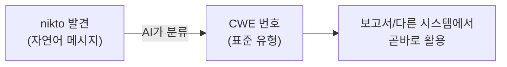

# 웹 취약점 스캔 — nikto 통합과 CWE 매핑

09강에서 정찰로 "공격 표면"의 지도를 그렸습니다. 이번 강의에서는 **웹 취약점 스캐너 `nikto`**를 에이전트에 붙입니다.  
하지만 스캐너의 진짜 문제는 **결과가 너무 많고, 그중 상당수가 오탐(false positive)**이라는 점입니다.  
여기서 AI의 진가가 나옵니다 — **결과를 읽고 우선순위를 매기며, 03강에서 배운 CWE로 분류하는 것**입니다.

> **🎯 우리가 지금 왜 이걸 하나요?**  
> 취약점 스캐너는 결과를 **수백, 수천 줄** 쏟아냅니다. 그대로 보면 무엇이 진짜 위험한지 도무지 알 수가 없습니다. 그래서 이번 강의에서는 스캐너를 돌리는 데서 그치지 않고, **AI가 그 많은 결과 중 "진짜 중요한 것"을 골라 주고, 각 항목을 03강에서 배운 공통 언어(CWE)로 분류**하게 만듭니다. 사람 분석가가 하던 1차 분류를 AI에게 맡기는 것입니다. 여기서부터 AI가 "단순 실행기"가 아니라 "판단하는 조수"가 됩니다.
{: .prompt-info }

다룰 내용:

1. nikto란 무엇인가
2. nikto를 에이전트에 통합
3. 스캔 결과를 AI가 "위험도순"으로 선별
4. 발견을 CWE로 매핑하기 (03강 연계)
5. 오탐 판단을 AI에게 시키기
6. 점검 인사이트 — 스캐너의 한계와 사람(AI)의 역할

---

## 1. nikto란?

**nikto**는 웹 서버를 대상으로 **알려진 위험 파일, 잘못된 설정, 오래된 소프트웨어, 위험한 HTTP 메서드** 등을 빠르게 점검하는 오픈소스 스캐너입니다.  
수천 개 항목을 자동으로 검사하지만, **맥락을 모른 채** 검사하기 때문에 오탐이 잦습니다.

```bash
# 보통 Kali에 기본 설치되어 있습니다. 없으면 다음과 같이 설치합니다.
sudo apt install -y nikto
which nikto
```

수동으로 한번 돌려서 감을 잡아 보겠습니다(시간이 좀 걸립니다).

```bash
nikto -h http://192.168.57.30/DVWA/ -maxtime 120s
```

**예상 결과** (요지):

```text
+ Server: Apache/2.4.58 (Ubuntu)
+ /DVWA/: Cookie PHPSESSID created without the httponly flag
+ The X-XSS-Protection header is not defined.
+ The X-Content-Type-Options header is not set.
+ /DVWA/config/: Directory indexing found.
+ /DVWA/login.php: Admin login page/section found.
+ Allowed HTTP Methods: GET, POST, OPTIONS, HEAD
```

---

## 2. nikto를 에이전트에 통합

09강의 `recon_agent.py` 구조를 그대로 재사용합니다. `scan_agent.py`에 nikto 함수와 도구를 추가합니다.

```python
# scan_agent.py — nikto 도구 (앞 강의의 _guard, DISPATCH 구조 재사용)
import subprocess

ALLOWED_TARGETS = {"192.168.57.30"}
def _guard(t): return any(x in t for x in ALLOWED_TARGETS)

def run_nikto(url: str) -> str:
    """웹 서버의 알려진 취약점/오설정을 스캔한다."""
    if not _guard(url):
        return f"거부됨: {url} 은 허용 대상이 아님."
    r = subprocess.run(
        ["nikto", "-h", url, "-maxtime", "120s"],
        capture_output=True, text=True, timeout=180)
    return r.stdout

NIKTO_TOOL = {"type": "function", "function": {
    "name": "run_nikto",
    "description": "웹 URL의 알려진 취약점과 잘못된 설정을 스캔한다.",
    "parameters": {"type": "object",
        "properties": {"url": {"type": "string", "description": "대상 URL"}},
        "required": ["url"]}}}
```

---

## 3. AI에게 결과를 "위험도순"으로 선별시키기

스캔 원본 결과를 그대로 보고서에 넣으면 쓸모가 없습니다. AI에게 **분류·우선순위**를 시킵니다.

```python
# scan_agent.py — 스캔 결과를 위험도순으로 분류
import ollama

MODEL = "qwen2.5:7b"

TRIAGE_PROMPT = """너는 웹 보안 분석가다. 아래는 nikto 스캔 원본 결과다.
각 항목을 다음 JSON 배열로 정리하라. 설명 문장은 쓰지 마라.
[
  {"finding": "발견 내용", "severity": "High|Medium|Low|Info",
   "false_positive_risk": "High|Medium|Low", "reason": "한 줄 근거"}
]
- 보안 헤더 누락은 보통 Low~Medium.
- 디렉터리 인덱싱/설정 파일 노출은 Medium~High.
- 단순 정보(버전, 로그인 페이지 존재)는 Info."""

def triage(nikto_output: str) -> str:
    resp = ollama.chat(model=MODEL, format="json", messages=[
        {"role": "system", "content": TRIAGE_PROMPT},
        {"role": "user", "content": nikto_output},
    ])
    return resp["message"]["content"]

if __name__ == "__main__":
    raw = run_nikto("http://192.168.57.30/DVWA/")
    print("[*] AI 우선순위 선별 결과:\n" + triage(raw))
```

실행합니다.

```bash
python3 scan_agent.py
```

**예상 결과:**

```json
[
  {"finding": "config 디렉터리 인덱싱 노출", "severity": "High",
   "false_positive_risk": "Low", "reason": "설정 파일이 그대로 노출될 수 있음"},
  {"finding": "PHPSESSID 쿠키에 HttpOnly 플래그 없음", "severity": "Medium",
   "false_positive_risk": "Low", "reason": "XSS 시 세션 탈취 위험 증가"},
  {"finding": "X-Content-Type-Options 헤더 미설정", "severity": "Low",
   "false_positive_risk": "Low", "reason": "MIME 스니핑 방어 부재"},
  {"finding": "admin 로그인 페이지 존재", "severity": "Info",
   "false_positive_risk": "Medium", "reason": "DVWA 특성상 정상 페이지"}
]
```

> **이것이 이번 강의의 핵심입니다.** nikto는 모든 것을 똑같이 나열하지만, AI는 **"config 인덱싱은 High, 로그인 페이지 존재는 단순 Info"**처럼 맥락에 따라 가중치를 매깁니다. 사람 분석가가 하던 1차 분류를 자동화한 것입니다.
{: .prompt-info }

---

## 4. 발견을 CWE로 매핑하기 (03강 연계)

위험도를 매겼다면 한 걸음 더 나아갑니다. 03강에서 배웠듯이, 발견은 반드시 **공통 언어(CWE)**로 분류해야 비로소 사람과 다른 시스템이 곧바로 받아 쓸 수 있습니다. "보안 헤더가 없다"는 자연어 설명보다 "CWE-693(Protection Mechanism Failure)"라는 표준 분류가 훨씬 쓸모가 큽니다.

nikto가 흔히 찾는 항목을 대표적인 CWE로 묶으면 다음과 같습니다.

| nikto 발견 (예) | 대응 CWE | 한마디로 |
| --- | --- | --- |
| 보안 헤더 누락(`X-Content-Type-Options`, `X-Frame-Options` 등) | **CWE-693** Protection Mechanism Failure | 보호 장치가 빠져 있음 |
| 디렉터리 인덱싱 노출(`config/` 등) | **CWE-548** Exposure of Information Through Directory Listing | 파일 목록이 그대로 노출됨 |
| `HttpOnly` 없는 세션 쿠키 | **CWE-1004** Sensitive Cookie Without 'HttpOnly' Flag | 스크립트가 쿠키를 읽을 수 있음 |
| 위험한 HTTP 메서드(PUT/DELETE 등) 허용 | **CWE-650** Trusting HTTP Permission Methods | 불필요한 메서드가 열려 있음 |



이 매핑을 AI에게 시킬 때 가장 조심할 점은, 03강에서 강조했듯이 **LLM이 존재하지 않는 CWE 번호를 그럴듯하게 지어낸다**는 것입니다. "CWE-9999" 같은 가짜 번호를 자신 있게 내놓을 수 있습니다. 그래서 **유효한 CWE 목록 안에서만 고르도록** 강제하고, 목록에 없으면 비워 두게 합니다.

```python
# scan_agent.py — 발견을 "유효한 CWE만" 고르게 강제 매핑
# 03강에서 배운 공통 언어로 분류하되, 목록 밖 값은 버린다.
VALID_CWE = {
    "CWE-693": "Protection Mechanism Failure (보안 헤더 누락 등)",
    "CWE-548": "Directory Listing (디렉터리 인덱싱)",
    "CWE-1004": "Sensitive Cookie Without HttpOnly",
    "CWE-650": "Trusting HTTP Permission Methods (위험한 메서드)",
}

CWE_PROMPT = (
    "너는 웹 보안 분석가다. 각 발견을 아래 '허용 CWE 목록'에서만 골라 매핑하라.\n"
    "목록에 맞는 것이 없으면 cwe를 빈 문자열 \"\"로 둔다. 절대 새 번호를 지어내지 마라.\n"
    "허용 CWE 목록:\n"
    + "\n".join(f"- {k}: {v}" for k, v in VALID_CWE.items()) +
    "\n출력은 [{\"finding\":..., \"cwe\":...}] JSON 배열만."
)

def map_to_cwe(triage_json: str) -> list:
    resp = ollama.chat(model=MODEL, format="json", messages=[
        {"role": "system", "content": CWE_PROMPT},
        {"role": "user", "content": triage_json},
    ])
    import json
    items = json.loads(resp["message"]["content"])
    # 검증: 허용 목록에 없는 CWE는 강제로 비운다 (LLM 환각 차단)
    for it in items:
        if it.get("cwe") not in VALID_CWE:
            it["cwe"] = ""
    return items
```

> **왜 검증 단계가 핵심인가요?** AI가 매긴 CWE를 그대로 믿으면, 보고서에 존재하지도 않는 번호가 섞여 신뢰를 잃습니다. 코드로 **"우리가 정의한 유효 목록 안에 드는지"**를 한 번 더 거르는 이 단계가, 03강에서 말한 "AI 출력의 신뢰성"을 실제로 보장하는 장치입니다.
{: .prompt-tip }

---

## 5. 오탐(False Positive) 다루기

스캐너는 종종 **존재하지 않거나 위험하지 않은 것**을 위험으로 보고합니다. 3절 JSON의 `false_positive_risk` 필드가 그 단서입니다.  
DVWA의 "admin 로그인 페이지 존재"는 의도된 정상 페이지이므로 오탐 위험이 중간입니다.

> **점검 인사이트 — 스캐너 결과를 믿지 말고 검증하세요**  
> 자동 스캐너의 출력은 **"의심 목록"**이지 "취약점 확정"이 아닙니다. 실무에서 신뢰를 잃는 가장 큰 이유가 검증 없이 오탐을 보고하는 것입니다. 그래서 다음 강의들(11강 이후)에서는 AI가 의심 항목을 **실제로 시도해서 참/거짓을 확정**합니다. 스캔(10강) → 검증(11강 이후)의 2단계가 신뢰의 핵심입니다.
{: .prompt-warning }

---

## 6. 점검 인사이트 — 스캐너의 한계와 AI의 역할

> **점검 인사이트 — 왜 스캐너만으로는 부족한가**  
> nikto 같은 시그니처 기반 스캐너는 **"알려진 것"**만 찾습니다. 그리고 **맥락**을 모릅니다.  
> 예를 들어 "HttpOnly 없음"이라는 같은 항목도, 그 사이트에 XSS가 있으면 **세션 탈취로 이어지는 High**가 되고, XSS가 전혀 없으면 **Low**에 그칩니다. 이 **연결 판단**은 단순 스캐너가 하지 못합니다.  
>
> AI 에이전트는 정찰(09강) 결과 + 스캔(10강) 결과를 **함께 보고** "이 조합이면 이게 위험하다"는 판단을 합니다. 이것이 우리가 단순 스크립트가 아니라 **에이전트**를 만드는 이유입니다.
{: .prompt-info }

---

## 7. 왜 지금도 이 점검이 필요한가

웹 취약점 스캔은 가장 오래된 점검 중 하나지만, 오히려 **더** 중요해졌습니다.

- **자동 스캐너가 상시 돌아다닙니다.** 인터넷에 노출된 서버는 노출 즉시 봇의 스캐닝을 받습니다. 즉 *내가* 스캔하지 않아도, *공격자*는 이미 스캔하고 있습니다. 방어자가 먼저 자신을 스캔해 약점을 메우는 것이 유일한 대응입니다.
- **설정 실수가 침해의 주된 원인입니다.** 보안 헤더 누락, 디렉터리 인덱싱, 관리/설치 페이지 노출 같은 "단순 오설정"이 실제 사고로 이어집니다. nikto가 찾는 것이 바로 이런 항목입니다.
- **배포가 잦아 약점이 계속 새로 생깁니다.** 한 번 안전했다고 끝이 아닙니다. 그래서 스캔은 **반복 자동화** 대상입니다.

---

## 8. 방어자의 사전 조건 (Blue Team)

이 점검을 방어자 관점에서 의미 있게 만들려면, 대상 서버에 다음이 갖춰져 있어야 합니다.

| 사전 조건 | 목적 |
|---|---|
| Apache **접근/에러 로그** 활성화 | nikto의 대량 요청이 로그에 남는지 확인 (16~17강에서 관찰) |
| **보안 헤더** 기준선 정의 (`X-Content-Type-Options`, `X-Frame-Options`, CSP(Content Security Policy: 콘텐츠 보안 정책) 등) | 스캔이 지적할 항목(CWE-693)을 사전에 차단 |
| 디렉터리 인덱싱 **비활성화** (`Options -Indexes`) | `config/` 등 노출(CWE-548) 방지 |
| 설치/관리 페이지(`setup.php` 등) **접근 제한** | 운영 환경 노출 차단 |

> **방어자의 사고법**: 스캔 결과를 받으면 "공격자가 이미 이걸 봤다고 가정"하고, **노출 면을 줄이는 것**(헤더 추가, 인덱싱 차단, 불필요 페이지 제거)부터 합니다. 스캐너가 조용해질 때까지 줄이는 것이 1차 목표입니다.
{: .prompt-tip }

---

## 참고 자료

- Nikto (소스/문서): <https://github.com/sullo/nikto>
- OWASP Web Security Testing Guide (WSTG): <https://owasp.org/www-project-web-security-testing-guide/>
- MITRE CWE-693 (Protection Mechanism Failure): <https://cwe.mitre.org/data/definitions/693.html>
- MITRE CWE-548 (Exposure of Information Through Directory Listing): <https://cwe.mitre.org/data/definitions/548.html>
- MITRE CWE-1004 (Sensitive Cookie Without 'HttpOnly' Flag): <https://cwe.mitre.org/data/definitions/1004.html>
- OWASP Secure Headers Project: <https://owasp.org/www-project-secure-headers/>

---

## 다음 강의 예고

다음 **11강**에서는 DVWA의 SQL Injection 페이지에 **`sqlmap`**을 붙여, AI가 취약 파라미터 식별과 DB 추출을 자동화합니다. 이때 발견은 03강의 공통 언어로 **CWE-89(SQL Injection)**에 매핑됩니다 — 이번 10강에서 익힌 "발견 → CWE 분류" 흐름이 그대로 이어집니다.
