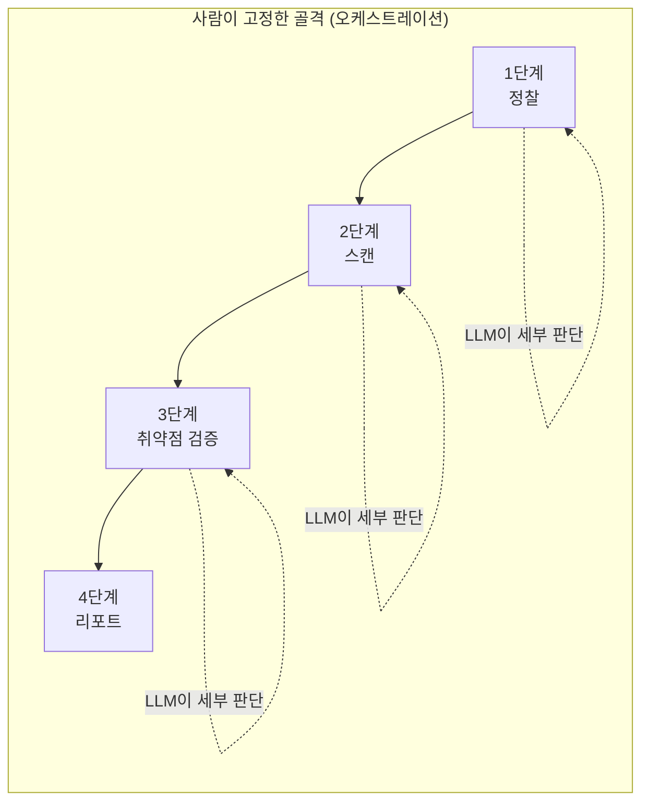

# 오케스트레이션과 실행 로그

13강에서 자율 에이전트와 가드레일을, 14강에서 리포트 생성을 만들었습니다. 도구는 모두 갖춰졌습니다.  
이번 강의의 주제는 그 도구들을 **어떤 순서로, 어떻게 지휘(orchestration)할 것인가**, 그리고 **무엇을 했는지 빠짐없이 기록(logging)할 것인가**입니다.

> **오케스트레이션이란?**  
> 오케스트라에서 지휘자가 각 악기의 등장 순서와 강약을 통제하듯, **여러 도구·단계를 정해진 순서와 규칙으로 묶어 하나의 흐름으로 실행하는 것**을 오케스트레이션이라고 합니다.  
> 13강의 자율 루프는 LLM이 순서를 즉흥적으로 정했습니다. 오케스트레이션은 그 위에 **사람이 설계한 골격**을 씌워, 결과를 **반복 가능하고 예측 가능하게** 만듭니다.
{: .prompt-info }

> **🎯 우리가 지금 왜 이걸 하나요?**  
> 좋은 점검은 **"언제 다시 해도 똑같이 나오고, 무엇을 했는지 전부 기록되는"** 점검입니다. 지금까지 만든 도구들을 정해진 순서로 **지휘**하고 모든 실행을 **로그로 남기면**, 그 점검 결과를 비로소 믿을 수 있게 됩니다. 화려한 자동화보다 이 "반복 가능함 + 기록"이 실무에서는 훨씬 더 중요합니다. 규제 대응이나 사고 조사에서도 결국 로그가 증거가 되기 때문입니다. 그리고 오늘 만드는 **구조화된 실행 로그(JSONL)**는 이 시리즈 후반부의 핵심 재료가 됩니다 — 5부 탐지(16~17강)에서는 "방어자가 무엇을 봐야 하는가"를 가늠하는 **증적**으로, 7부 보안관제(20~21강)에서는 SIEM에 흘려보낼 **관제 데이터**로 다시 등장합니다.
{: .prompt-info }

다룰 내용:

1. 왜 "자율 루프"만으로는 부족한가
2. 점검 파이프라인 설계 (단계와 순서)
3. 단계별 오케스트레이터 코드
4. 구조화된 실행 로그 남기기
5. 점검 인사이트 — 재현성과 증적

---

## 1. 왜 "자율 루프"만으로는 부족한가

13강의 자율 에이전트는 LLM이 그때그때 다음 도구를 골랐습니다. 이는 유연하지만 **두 가지 약점**이 있습니다.

- **재현성이 없습니다.** 같은 명령을 두 번 돌려도 LLM이 매번 다른 순서로 움직일 수 있습니다. 보안 점검은 **언제 돌려도 같은 절차**여야 신뢰할 수 있습니다.
- **누락이 생깁니다.** LLM이 "이번엔 nikto를 건너뛰자"고 판단해 버리면, 점검 항목이 빠집니다.

그래서 실무에서는 **큰 골격(단계 순서)은 사람이 코드로 고정**하고, **각 단계 안의 세부 판단만 LLM에게 맡깁니다.** 이것이 오케스트레이션의 핵심 절충입니다.



---

## 2. 점검 파이프라인 설계

우리가 만든 도구들을 4단계로 배치합니다. 각 단계의 **출력이 다음 단계의 입력**이 됩니다.

| 단계 | 하는 일 | 사용 도구 (이전 강의) |
|---|---|---|
| 1. 정찰 | 포트·웹기술·경로 파악 | nmap, whatweb, gobuster |
| 2. 스캔 | 알려진 취약점 식별 | nikto |
| 3. 검증 | SQLi·XSS·명령삽입 실제 확인 | sqlmap, 직접 요청 |
| 4. 리포트 | 결과 종합·문서화 | LLM 리포트 생성 (14강) |

---

## 3. 단계별 오케스트레이터 코드

13강의 `auto_pentest.py`(도구 함수들)와 14강의 리포트 함수가 이미 있다고 보고, 이들을 **순서대로 호출하는 지휘자**를 만듭니다. `orchestrator.py`를 작성합니다.

```python
# orchestrator.py — 점검 단계를 순서대로 지휘한다
import json
import time

# 이전 강의에서 만든 함수들을 가져온다고 가정
# (실제로는 같은 폴더의 파일에서 import 하거나 한 파일에 모은다)
from auto_pentest import run_nmap, run_nikto, run_sqlmap
from report_gen import generate_report

TARGET_IP = "192.168.57.30"
TARGET_URL = "http://192.168.57.30/DVWA/"
SQLI_URL = "http://192.168.57.30/DVWA/vulnerabilities/sqli/?id=1&Submit=Submit"
# 세션 쿠키는 run_sqlmap 내부(auto_pentest.py의 DVWA_COOKIE)가 자동 주입한다

LOG_FILE = "pentest_run.jsonl"   # 실행 로그 파일

def log_step(stage, tool, status, summary):
    """한 단계의 실행을 구조화된 한 줄(JSON)로 기록한다."""
    record = {
        "time": time.strftime("%Y-%m-%d %H:%M:%S"),
        "stage": stage,
        "tool": tool,
        "status": status,
        "summary": summary[:300],   # 너무 길면 자른다
    }
    line = json.dumps(record, ensure_ascii=False)
    print("  [LOG] " + line)
    with open(LOG_FILE, "a") as f:
        f.write(line + "\n")

def main():
    results = {}

    # ── 1단계: 정찰 ───────────────────────────────
    print("[1단계] 정찰")
    out = run_nmap(TARGET_IP)
    results["recon"] = out
    log_step(1, "nmap", "done", out)

    # ── 2단계: 스캔 ───────────────────────────────
    print("[2단계] 스캔")
    out = run_nikto(TARGET_URL)
    results["scan"] = out
    log_step(2, "nikto", "done", out)

    # ── 3단계: 취약점 검증 ────────────────────────
    print("[3단계] SQL Injection 검증")
    out = run_sqlmap(SQLI_URL)
    results["sqli"] = out
    status = "vulnerable" if "vulnerable" in out.lower() else "not_found"
    log_step(3, "sqlmap", status, out)

    # ── 4단계: 리포트 ─────────────────────────────
    print("[4단계] 리포트 생성")
    findings = "\n\n".join(f"[{k}]\n{v[:1000]}" for k, v in results.items())
    report = generate_report(findings)
    with open("report.md", "w") as f:
        f.write(report)
    log_step(4, "report_gen", "done", "report.md 생성")

    print("\n[완료] report.md 와 pentest_run.jsonl 을 확인하세요.")

if __name__ == "__main__":
    main()
```

실행합니다.

```bash
python3 orchestrator.py
```

**예상 결과** (요지):

```text
[1단계] 정찰
  [LOG] {"time": "2026-06-11 11:01:10", "stage": 1, "tool": "nmap", "status": "done", ...}
[2단계] 스캔
  [LOG] {"time": "2026-06-11 11:02:40", "stage": 2, "tool": "nikto", "status": "done", ...}
[3단계] SQL Injection 검증
  [LOG] {"time": "2026-06-11 11:04:05", "stage": 3, "tool": "sqlmap", "status": "vulnerable", ...}
[4단계] 리포트 생성
  [LOG] {"time": "2026-06-11 11:05:22", "stage": 4, "tool": "report_gen", "status": "done", ...}

[완료] report.md 와 pentest_run.jsonl 을 확인하세요.
```

### 핵심만 짚기

- **`from auto_pentest import ...`** : 다른 파일에 만들어 둔 함수를 가져다 씁니다. 그래서 13·14강을 모듈처럼 재사용합니다.
- **단계가 코드로 고정**되어 있습니다. nmap → nikto → sqlmap → report 순서는 LLM이 바꾸지 못합니다. **재현성 확보입니다.**
- **`results` 딕셔너리**에 각 단계 출력을 모아, 마지막에 한꺼번에 리포트로 넘깁니다. 단계 간 데이터 전달의 표준 패턴입니다.

---

## 4. 구조화된 실행 로그 — 왜 JSON 한 줄씩(JSONL)인가

`log_step` 함수가 만드는 `pentest_run.jsonl`이 이번 강의의 또 다른 핵심입니다.

> **JSONL(JSON Lines)** = 한 줄에 JSON 하나씩 쌓는 형식입니다.  
> 사람이 읽기도 좋고, 나중에 프로그램이 **한 줄씩 불러 분석**하기도 좋습니다. 보안 로그 수집기(SIEM: Security Information and Event Management, 보안 정보 및 이벤트 관리)들이 즐겨 쓰는 형식입니다.
{: .prompt-info }

각 줄은 `time`(언제) · `stage`(몇 단계) · `tool`(어떤 도구) · `status`(결과) · `summary`(요약) 다섯 개의 필드로 구성됩니다. 이 다섯 필드만으로도 "언제, 어떤 단계에서, 무슨 도구를, 어떤 결과로" 돌렸는지가 한눈에 잡힙니다.

```text
{"time": "2026-06-11 11:01:10", "stage": 1, "tool": "nmap", "status": "done", "summary": "..."}
{"time": "2026-06-11 11:04:05", "stage": 3, "tool": "sqlmap", "status": "vulnerable", "summary": "..."}
```

이 로그가 있으면 다음이 가능해집니다.

- **무엇을, 언제, 어떤 결과로** 실행했는지 추적 (감사 증적)
- 실패한 단계만 골라 **재실행**
- 여러 번의 점검을 **시간순으로 비교**(어제는 안전했는데 오늘 취약?)

> 13강의 `audit.log`가 "안전을 위한 감사 기록"이었다면, 여기 `pentest_run.jsonl`은 "결과 분석을 위한 구조화 로그"입니다. **공격자(우리) 측 로그**입니다. 다음 16강에서는 시점을 바꿔 **방어자(서버) 측 로그**를 봅니다.
{: .prompt-tip }

> **이 로그가 나중에 어디서 다시 쓰이나요?**  
> 오늘 만든 `pentest_run.jsonl`은 단순한 실행 기록을 넘어, 이 시리즈 후반부의 두 부에서 핵심 재료가 됩니다.  
> **5부 탐지(16~17강)** — "공격자가 이런 흔적을 남긴다"는 것을 알아야 방어자가 무엇을 탐지할지 정할 수 있습니다. 우리 측 구조화 로그는 그 흔적을 정리한 **증적**으로 활용됩니다.  
> **7부 보안관제(20~21강)** — 동일한 JSONL 형식의 로그는 SIEM이 그대로 받아들일 수 있는 **관제 데이터**입니다. 오늘의 `time/stage/tool/status/summary` 구조가 그래서 중요합니다.  
> 19강(증거 보존)에서도 "무엇을 했는지 변조 없이 남겼는가"가 곧 증거능력으로 이어집니다.
{: .prompt-info }

---

## 5. 점검 인사이트 — 재현성과 증적

> **점검 인사이트 — 좋은 점검은 "다시 할 수 있는" 점검입니다**  
> 보안 점검의 신뢰는 두 가지에서 나옵니다.  
> **① 재현성**: 같은 절차를 누가·언제 돌려도 같은 결과가 나와야 합니다. 그래서 단계 골격을 코드로 고정합니다.  
> **② 증적(audit trail)**: "무엇을 했고 무엇을 발견했는가"가 로그로 남아야 합니다. 규제 대응에서도, 사고 조사에서도 로그가 곧 증거입니다.  
>
> 화려한 자동화보다 **"언제 돌려도 같고, 모든 걸 기록한다"**가 실무에서 더 중요합니다. 오케스트레이션과 로깅은 그 두 가지를 동시에 보장하는 장치입니다.
{: .prompt-info }

---

## 다음 강의 예고

다음 **16강**부터 5부(탐지)가 시작됩니다. 시점을 **방어자**로 옮겨, 우리가 돌린 자동 점검이 **Ubuntu 서버 로그에 남기는 흔적**을 직접 확인하고 탐지합니다. 오늘 만든 공격자 측 구조화 로그가, 방어자가 무엇을 봐야 하는지를 비추는 거울이 됩니다.

**다음 강의: 16. 자동 공격의 흔적 — 보안 로그와 방어자 탐지**

---

## 참고 자료

- [NIST SP 800-92, Guide to Computer Security Log Management](https://csrc.nist.gov/pubs/sp/800/92/final) — 로그 관리(생성·보존·분석)의 기준 문서
- [NIST SP 800-115, Technical Guide to Information Security Testing and Assessment](https://csrc.nist.gov/pubs/sp/800/115/final) — 보안 점검 절차와 단계 설계
- [JSON Lines (jsonlines.org)](https://jsonlines.org/) — JSONL 형식 명세
