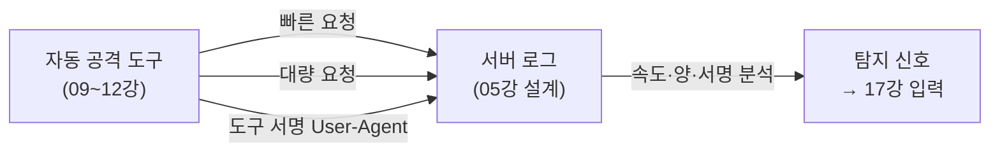

# 자동 공격의 흔적 — 보안 로그와 방어자 탐지

지금까지의 강의는 대부분 **공격자(점검자)의 시점**이었습니다. 이제 시점을 **방어자**로 옮깁니다.
우리가 Kali(192.168.57.10)에서 돌린 자동 점검은, 대상 서버(192.168.57.30)의 입장에서 보면 **수상한 트래픽의 폭격**이었습니다.
**"자동 공격하면 이렇게 된다"** — 그 흔적을 서버 로그에서 직접 확인하고, 그것으로 공격을 탐지하는 법을 배웁니다.

> 이 강의는 **Kali가 아니라 Ubuntu 서버(192.168.57.30)**에서 진행합니다. 방어자의 자리에 앉는 것입니다.
{: .prompt-tip }

> **🎯 우리가 지금 왜 이걸 하나요?**
> 이번 16강은 시리즈의 **5부(탐지)**를 여는 강의입니다. 지금까지는 줄곧 공격(점검)하는 사람의 자리에 있었지만, 이제 자리를 바꿔 **방어자의 눈**으로 봅니다.
> 우리가 2~3부에서 만든 자동 공격 도구(09~12강)가, 1부에서 설계한 로그(05강 — access.log / error.log / auth.log)에 **어떤 흔적**을 남기는지 직접 봅니다. *"아, 공격은 결국 흔적을 남기는구나"* 하고 깨닫는 순간이 방어의 출발점입니다.
> 그리고 이 흔적이 곧 다음 강의(17강)의 **이상징후 탐지·Triage의 입력**이 됩니다. 즉 이번 강의는 **"공격 → 로그"** 를 잇고, 다음 강의가 **"로그 → 탐지"** 를 잇습니다. **공격을 아는 사람이 가장 잘 막습니다.**
{: .prompt-info }

다룰 내용:

1. 보안 로그는 어디에 있는가
2. 각 도구가 남기는 흔적 (nikto·gobuster·sqlmap·XSS·명령삽입)
3. 자동 공격의 3대 특징 — 속도·양·서명
4. 로그로 공격 탐지하기
5. 방어자도 AI를 쓴다 — 로그를 LLM에게 분석시키기
6. 점검 인사이트 — 모든 행동은 흔적을 남긴다

---

## 1. 보안 로그는 어디에 있는가

Ubuntu + Apache 환경의 주요 로그 위치입니다. (Ubuntu 서버에서 실행) 이 로그들은 05강에서 설계한 그대로입니다.

```bash
# 웹 접근 로그 — 모든 HTTP 요청이 한 줄씩 기록됩니다
sudo tail -f /var/log/apache2/access.log

# 웹 에러 로그 — 비정상 요청·서버 오류
sudo tail -f /var/log/apache2/error.log

# 인증/시스템 로그
sudo tail -f /var/log/auth.log
```

> **`tail -f`** 는 로그 파일의 끝을 **실시간으로 따라가며** 보여 줍니다. 이 상태로 두고, Kali에서 점검을 돌리면 흔적이 **실시간으로 쌓이는** 것을 볼 수 있습니다. 공격과 로그를 나란히 놓고 보는 것이 이 강의의 핵심 실습입니다.
{: .prompt-info }

Apache 접근 로그(Common/Combined Log Format) 한 줄의 구조는 이렇습니다.

```text
192.168.57.10 - - [08/Jun/2026:21:03:11 +0900] "GET /DVWA/login.php HTTP/1.1" 200 1523 "-" "Mozilla/5.0"
└─ 출발지 IP ─┘             └─ 시각 ─────┘  └─ 요청 ───────────┘ └상태┘└크기┘ └리퍼러┘└─ User-Agent ─┘
```

기억할 핵심 필드: **출발지 IP / 시각 / 요청 내용 / 상태 코드 / User-Agent(클라이언트 종류)**. 공격 탐지의 단서가 모두 여기 있습니다.

---

## 2. 각 도구가 남기는 흔적

Kali에서 우리가 09~12강에서 돌린 도구들이 access.log에 어떻게 보이는지, 도구별로 정리합니다.

### nikto (웹 취약점 스캐너)

```text
192.168.57.10 - - [...] "GET /DVWA/admin.php HTTP/1.1" 404 ...  "... Nikto/2.5.0"
192.168.57.10 - - [...] "GET /DVWA/test.php HTTP/1.1" 404 ...   "... Nikto/2.5.0"
192.168.57.10 - - [...] "GET /DVWA/backup.sql HTTP/1.1" 404 ... "... Nikto/2.5.0"
... (수천 줄) ...
```

- **User-Agent에 `Nikto`** 가 그대로 박힙니다. 도구가 자기 이름을 광고하는 셈입니다.
- 존재하지 않는 경로를 **수천 개** 두드려 **404가 폭증**합니다.

### gobuster (디렉터리/파일 브루트포스)

```text
192.168.57.10 - - [...] "GET /DVWA/admin HTTP/1.1" 404 ...  "gobuster/3.6"
192.168.57.10 - - [...] "GET /DVWA/config HTTP/1.1" 301 ...  "gobuster/3.6"
... 초당 수십~수백 줄 ...
```

- 역시 **User-Agent에 `gobuster`** 가 남습니다. 짧은 시간에 **엄청난 요청 수**가 들어옵니다.

### sqlmap (SQL 주입 자동화)

```text
192.168.57.10 - - [...] "GET /DVWA/vulnerabilities/sqli/?id=1%27%20AND%201%3D1 ..." 200 ...
192.168.57.10 - - [...] "GET /DVWA/vulnerabilities/sqli/?id=1%20UNION%20SELECT ..." 200 ...
192.168.57.10 - - [...] "... id=1%27%20OR%20%271%27%3D%271 ..." 500 ...   "sqlmap/1.8"
```

- URL에 `%27`(작은따옴표), `UNION SELECT`, `OR 1=1` 같은 **주입 패턴**이 URL 인코딩되어 남습니다.
- **상태 코드 500(서버 오류)**이 섞여 나타납니다 — 주입 문자열이 쿼리를 깨뜨린 흔적입니다.

### XSS / 명령 삽입

```text
"GET /DVWA/vulnerabilities/xss_r/?name=<script>alert(1)</script> ..." 200 ...
"POST /DVWA/vulnerabilities/exec/  ... ip=127.0.0.1;id ..." 200 ...
```

- 요청 파라미터에 `<script>`, `onerror=`, `;id`, `&&` 같은 **특수문자 패턴**이 그대로 보입니다.
- 단, **POST 본문**에 들어간 페이로드는 기본 access.log에는 남지 않을 수 있습니다(요청 라인만 기록). 본문까지 보려면 별도 로깅(예: mod_security)이 필요합니다.

> **핵심**: 자동화 도구는 대부분 **자기 이름을 User-Agent에 남기고**, **사람이 불가능한 속도와 양**으로 요청합니다. 이 두 가지가 곧 탐지의 출발점입니다.
{: .prompt-info }

---

## 3. 자동 공격의 3대 특징 — 속도·양·서명

사람이 브라우저로 둘러보는 것과, 자동 도구가 점검하는 것은 로그에서 확연히 다릅니다.

| 특징 | 사람(정상 사용자) | 자동 공격 도구 |
|---|---|---|
| **속도** | 클릭 사이 수 초 | 초당 수십~수백 요청 |
| **양** | 수십 건 | 수천~수만 건 |
| **서명** | 브라우저 User-Agent | `Nikto`, `sqlmap`, `gobuster` 등 |
| **패턴** | 정상 경로 | 404 폭증, 주입 문자열, 비정상 메서드 |

> **"자동 공격하면 이렇게 된다"의 핵심**: **빠르고, 많고, 티가 납니다.** 속도와 양 자체가 자동화의 증거입니다. 그래서 공격자는 일부러 느리게(저속 스캔), User-Agent를 위장해 흔적을 줄이려 합니다 — 이는 곧 방어자가 **속도·양·서명**을 핵심 탐지 지표로 삼아야 한다는 뜻입니다.
{: .prompt-warning }

이 세 가지 특징을 도식으로 정리하면 다음과 같습니다.



---

## 4. 로그로 공격 탐지하기

이제 방어자로서, 로그를 분석해 공격 흔적을 찾아봅니다. (Ubuntu 서버에서 실행)

**① 도구 서명(User-Agent)으로 찾기**

```bash
# 알려진 공격 도구 이름이 User-Agent에 있는 요청 찾기
grep -Ei "nikto|sqlmap|gobuster|nmap" /var/log/apache2/access.log
```

**② 요청을 많이 보낸 IP 순위 (속도·양)**

```bash
# 출발지 IP별 요청 수를 세어 많은 순으로 정렬
awk '{print $1}' /var/log/apache2/access.log | sort | uniq -c | sort -rn | head
```

**예상 결과:**

```text
  8412 192.168.57.10      ← 우리 Kali. 압도적으로 많다 = 자동 공격 의심
    23 192.168.57.50
```

**③ 404 폭증 찾기 (디렉터리 탐색 흔적)**

```bash
# 상태 코드가 404인 요청 수를 IP별로 집계
grep '" 404 ' /var/log/apache2/access.log | awk '{print $1}' | sort | uniq -c | sort -rn | head
```

**④ 주입 패턴 찾기 (SQLi/XSS)**

```bash
# URL에 주입 흔적이 있는 요청 찾기
grep -Ei "union|select|%27|<script|onerror|;id" /var/log/apache2/access.log
```

> 단 한 IP가 **수천 건의 404와 주입 패턴**을 짧은 시간에 남겼다면, 그것은 **자동 점검(또는 공격)**이 일어났다는 명백한 신호입니다. 방어자는 이 IP를 차단하고 경보를 발령합니다. 바로 이 "수상한 IP·패턴"이 17강에서 다룰 **이상징후 탐지·Triage의 입력**이 됩니다.
{: .prompt-tip }

---

## 5. 방어자도 AI를 쓴다 — 로그를 LLM에게 분석시키기

흥미로운 대칭이 있습니다. 공격을 자동화했듯, **방어자도 로그 분석을 LLM으로 자동화**할 수 있습니다.
앞선 강의에서 배운 "수집 → 해석" 패턴을 그대로, 이번엔 **방어 목적**으로 씁니다. (Ubuntu 또는 Kali에서, ollama가 있는 곳에서 실행)

```python
# log_triage.py — 보안 로그를 LLM에게 분석시키기 (방어자 관점)
import ollama

# 의심스러운 로그 일부를 읽어 온다
with open("/var/log/apache2/access.log") as f:
    lines = f.readlines()
sample = "".join(lines[-200:])   # 최근 200줄

SYSTEM = """너는 침해사고 분석가(Blue Team)다. 아래 웹 접근 로그를 보고
(1) 자동화 공격 도구의 흔적이 있는가, (2) 어떤 공격 유형으로 보이는가,
(3) 출발지 IP와 차단 권고를 한국어로 요약하라."""

resp = ollama.chat(model="qwen2.5:7b", messages=[
    {"role": "system", "content": SYSTEM},
    {"role": "user", "content": sample},
])
print(resp["message"]["content"])
```

**예상 결과** (요지):

```text
- 자동화 흔적: User-Agent에 'sqlmap', 'Nikto'가 확인됨. 자동 도구 사용 확실.
- 공격 유형: 디렉터리 탐색(404 다수) + SQL Injection 시도(UNION SELECT, %27).
- 출발지: 192.168.57.10 단일 IP가 단시간에 수천 건. 즉시 차단 권고.
```

> **공격과 방어는 같은 기술을 씁니다.** 우리가 공격 자동화에서 만든 "수집→LLM 해석" 구조는, 입력만 바꾸면 그대로 **방어용 로그 분석기**가 됩니다. 이 LLM 1차 요약이 17강의 **자동 Triage**, 18강의 **침해사고 대응** 흐름으로 이어집니다.
{: .prompt-info }

---

## 6. 점검 인사이트 — 모든 행동은 흔적을 남긴다

> **점검 인사이트 — 공격자는 보이지 않으려 하고, 방어자는 보려 한다**
> 이 강의의 교훈은 단순합니다. **자동화된 모든 행동은 로그라는 흔적을 남깁니다.**
> - **공격자 관점**: 우리가 09~12강에서 만든 도구는 빠르고 시끄럽습니다. 실제 공격자는 이를 알기에 **속도를 낮추고, User-Agent를 위장하고, 여러 IP에 분산**해 흔적을 지웁니다.
> - **방어자 관점**: 그래서 방어자는 **로그를 반드시 켜고, 보존하고, 분석**해야 합니다. 로그가 없으면 침해를 당하고도 알 수 없습니다. **로그는 사고 후 유일한 진실**입니다.
>
> 점검을 자동화할 줄 아는 사람이라야, 그 점검이 **어떤 흔적을 남기는지** 알고, **방어 로그를 어떻게 설계할지** 압니다. 공격을 이해하는 것이 최고의 방어 설계입니다.
{: .prompt-info }

---

## 다음 강의 예고

다음 **17강**에서는 이번 강의에서 모은 "수상한 IP·패턴"을 한 단계 더 끌어올립니다. **이상징후 탐지(Anomaly Detection)** 의 기본 — 평소 트래픽을 기준선(**Baseline**)으로 잡고, 거기서 벗어나는 신호를 가려내는 **Triage**, 그리고 위협을 식별하는 지표(**IoC, Indicator of Compromise**) 를 다룹니다. 이번 16강이 만든 "공격 → 로그"가, 17강에서 "로그 → 탐지 판단"으로 이어집니다.

---

## 참고 자료

- **MITRE ATT&CK** — 공격 전술·기법 지식 베이스 (T1595 Active Scanning, T1190 Exploit Public-Facing Application 등): <https://attack.mitre.org/>
- **NIST SP 800-92** — Guide to Computer Security Log Management: <https://csrc.nist.gov/pubs/sp/800/92/final>
- **OWASP Logging Cheat Sheet** — 보안 로깅 설계 지침: <https://cheatsheetseries.owasp.org/cheatsheets/Logging_Cheat_Sheet.html>
- **OWASP Top 10 (A09:2021) — Security Logging and Monitoring Failures**: <https://owasp.org/Top10/A09_2021-Security_Logging_and_Monitoring_Failures/>
- **Apache HTTP Server — Log Files**: <https://httpd.apache.org/docs/current/logs.html>
