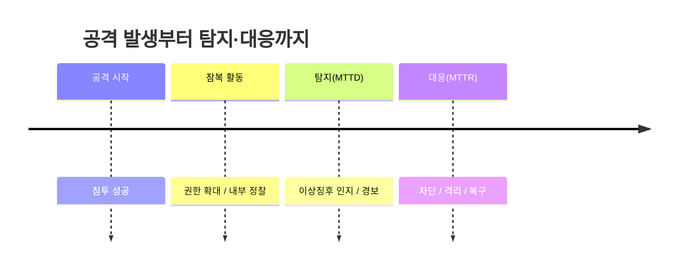
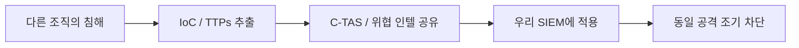
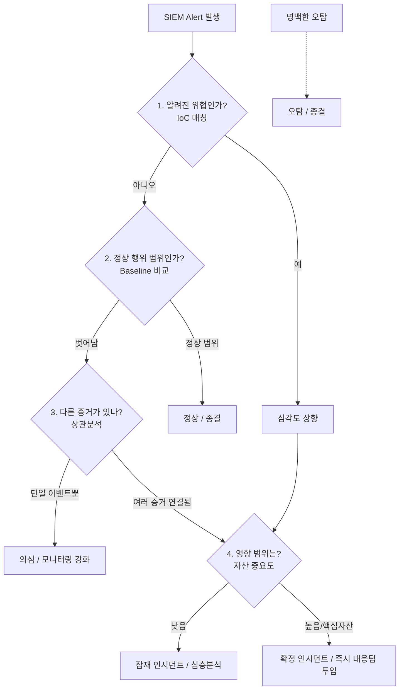
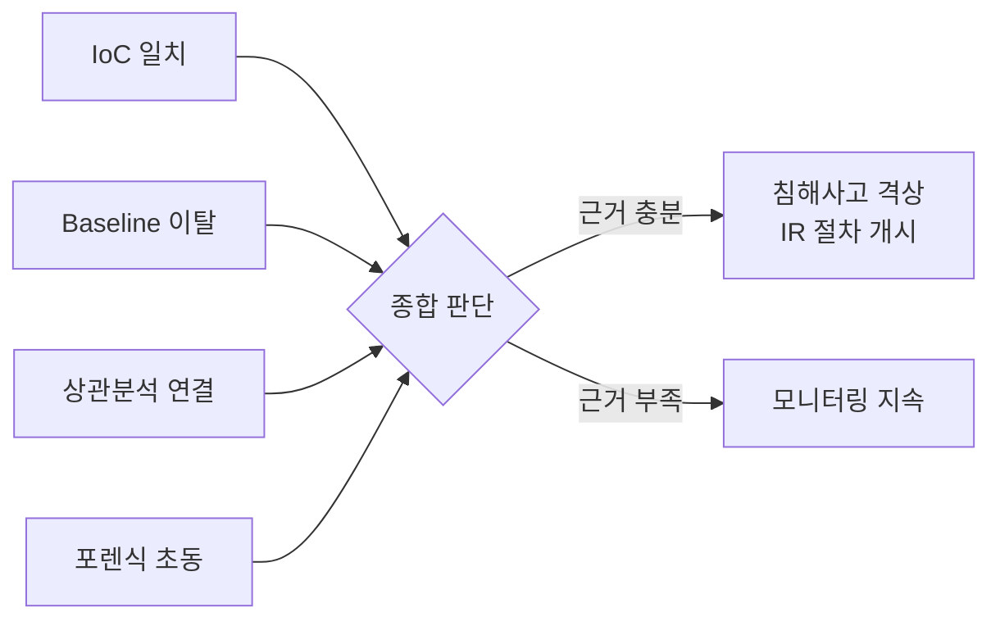

# 이상징후 탐지 — Baseline·Triage·IoC

16강에서는 공격이 반드시 로그에 흔적을 남긴다는 것을 확인했습니다. 그런데 로그가 많다고 해서 자동으로 탐지가 되는 것은 아닙니다. 하루에 수백만 줄씩 쌓이는 로그 속에서 "이건 평소와 다르다"라고 말하려면, 먼저 **무엇이 정상인지(Baseline)**를 알아야 합니다. 그리고 정상에서 벗어난 수많은 경보 중에서 진짜 위협을 가려내는 **선별(Triage)** 과정이 필요합니다.

> **🎯 우리가 지금 왜 이걸 하나요?**  
> 16강에서 "공격은 로그에 흔적을 남긴다"는 것을 봤어요. 하지만 흔적이 남아 있는 것과, 그 흔적을 우리가 **알아채는 것**은 완전히 다른 문제예요. 평소가 어떤 모습인지 모르면 무엇이 이상한지도 알 수 없고, 경보가 하루에 수천 개씩 울리면 진짜 위협은 그 속에 묻혀 버립니다. 이번 강의에서는 "정상의 기준을 세우고(Baseline), 침해의 증거인 **IoC(Indicator of Compromise: 침해 지표)**를 알아보고, 경보를 똑똑하게 분류(Triage)하는" 탐지의 핵심 사고방식을 배웁니다. 이것이 보안관제(SOC)의 심장입니다.
> {: .prompt-info }

다룰 내용은 다음과 같습니다.

1. 보안 모니터링과 이상징후 감지는 어떻게 다른가
2. Baseline — "정상"을 정의하기
3. IoC와 위협 인텔리전스
4. Triage — 경보를 선별하는 의사결정
5. 정탐과 오탐의 균형, 그리고 예외처리
6. 실습: LLM으로 로그를 1차 선별하기
7. 침해사고로 격상할지 판단하기

---

## 1. 보안 모니터링 vs 이상징후 감지

많은 사람이 "로그를 모으면 탐지가 된다"라고 생각하지만, 수집과 탐지는 전혀 다른 활동입니다. CCTV를 떠올리면 쉽습니다. 카메라를 설치하고 화면을 녹화하는 것은 **모니터링**이고, 그 화면 속에서 도둑을 알아보고 사이렌을 울리는 것은 **감지**입니다. 녹화만 잘 되어도 도둑을 못 잡으면 의미가 없습니다.

| 구분 | 보안 모니터링 (Monitoring) | 이상징후 감지 (Detection) |
|---|---|---|
| 목적 | 데이터 수집·가시화 (Observation) | 위협 식별·경보 (Identification) |
| 비유 | CCTV 녹화 / 관제 화면 | CCTV 속 도둑을 알아보고 사이렌 |
| 핵심 활동 | 로그 수집, 대시보드, 베이스라인 설정 | 패턴 매칭, 임계치, 상관분석 |
| 성공 지표 | 사각지대 없는 데이터 확보 | 정확한 경보 (높은 정탐, 낮은 오탐) |
| 산출물 | 로그·메트릭·대시보드 | Alert(경보), 인시던트 후보 |

두 활동을 모두 잘 해야 비로소 탐지가 완성됩니다. 모니터링이 부실하면 볼 수 있는 데이터 자체가 없고, 감지 로직이 부실하면 데이터가 있어도 위협을 놓칩니다.

### 왜 시간이 중요한가 — MTTD

탐지에서 가장 중요한 지표 중 하나는 **MTTD(Mean Time To Detect, 평균 탐지 시간)**입니다. 공격이 시작된 시점부터 우리가 그것을 알아챈 시점까지의 시간을 뜻합니다. 이 시간이 길어질수록 공격자가 내부를 돌아다니며 권한을 확대하고 데이터를 빼낼 시간이 늘어나기 때문에, 피해 규모는 MTTD에 거의 비례해 커집니다. 며칠이면 막을 수 있었던 사고가 몇 달간 방치되면 회복 불가능한 피해가 되는 이유가 바로 여기에 있습니다.



MTTD를 줄이는 것이 탐지 단계의 목표이고, 그 출발점이 바로 다음에 볼 Baseline입니다.

---

## 2. Baseline — "정상"을 정의하기

이상징후(anomaly)는 글자 그대로 "평소와 다른 것"입니다. 그러므로 **평소가 어떤 모습인지** 모르면 무엇이 이상인지 정의할 수 없습니다. 이 "평소의 정상 상태"를 측정해 둔 기준이 **Baseline(기준선)**입니다.

Baseline으로 잡아 두어야 하는 것들의 예시는 다음과 같습니다.

| 대상 | 정상 기준선의 예 | 이상 신호의 예 |
|---|---|---|
| 트래픽 양 | 시간대별 평균 요청 수 | 새벽 3시에 평소의 50배 요청 |
| 로그인 | 한국 IP, 업무시간 위주 | 해외 IP에서 새벽에 다량 로그인 시도 |
| 데이터 전송 | 일 평균 수백 MB 외부 전송 | 갑자기 수십 GB 외부 업로드 |
| 프로세스 | 평소 실행되는 프로그램 목록 | 본 적 없는 실행 파일 / 인코딩된 명령 |
| 계정 권한 | 일반 사용자 권한으로 작업 | 평범한 계정이 갑자기 관리자 작업 |

### Baseline이 없으면 못 잡는 공격 — Volt Typhoon

01강에서 살펴본 Volt Typhoon 사례가 Baseline의 중요성을 잘 보여 줍니다. 이 공격 그룹은 별도의 악성코드를 거의 심지 않고, 시스템에 원래 들어 있는 정상 도구(예: `netsh`, `wmic`, PowerShell 등)만으로 활동하는 **LotL(Living off the Land, 토착 도구 악용)** 기법을 사용했습니다.

악성 파일 해시 같은 명백한 흔적이 없으니, 시그니처 기반 탐지로는 거의 보이지 않습니다. 그렇다면 이런 공격은 어떻게 잡을까요? 답은 Baseline입니다. "이 서버의 이 계정이 평소에 이런 명령을 이 시간에 쓰던가?"라는 **행위 기준선과의 비교**만이 정상 도구를 악용하는 공격을 드러낼 수 있습니다. Baseline이 없으면 이런 공격은 영원히 정상으로 보입니다.

---

## 3. IoC와 위협 인텔리전스

Baseline이 "정상에서 벗어났는가"를 본다면, 또 다른 축은 "이미 알려진 나쁜 것과 일치하는가"를 보는 것입니다. 이때 쓰이는 것이 **IoC(Indicator of Compromise: 침해 지표)**입니다. IoC는 침해가 일어났음을 알려 주는 구체적인 표식(증거)을 말합니다.

| IoC 유형 | 예시 | 의미 |
|---|---|---|
| 파일 해시 | `MD5/SHA-256` 값 | 알려진 악성코드와 동일한 파일 |
| C2 IP/도메인 | `203.0.113.10`, `evil-c2.example` | 공격자 명령제어(C2) 서버와 통신 |
| 피싱 URL | `http://login-bank.example.kr` | 자격증명 탈취용 가짜 사이트 |
| 이메일/제목 | 특정 발신자, 악성 첨부 파일명 | 스피어피싱 캠페인 흔적 |
| 레지스트리 키 | 악성 자동실행 키 | 지속성(persistence) 확보 흔적 |

### IoC보다 한 단계 위 — TTPs

IoC는 IP나 해시처럼 쉽게 바뀌는(공격자가 금방 갈아치우는) 정보입니다. 그래서 더 오래 유효한 정보로 **TTPs(Tactics, Techniques, Procedures: 전술, 기법, 절차)**가 함께 공유됩니다. "어떤 IP를 썼는가"보다 "어떤 방식으로 침투하고 권한을 확대하는가"가 더 본질적이기 때문입니다. 이 TTPs를 체계적으로 정리한 대표적인 지식 베이스가 **MITRE ATT&CK**입니다.

### 위협 인텔리전스 공유 — KISA C-TAS

이런 IoC와 TTPs는 한 조직이 혼자 모으기 어렵기 때문에, 여러 기관이 모여 서로 공유합니다. 이것이 **위협 인텔리전스(Threat Intelligence)**이고, 한국에서는 **KISA(Korea Internet & Security Agency: 한국인터넷진흥원)**가 운영하는 **C-TAS(Cyber Threat Analysis & Sharing: 사이버 위협분석 공유 시스템, <https://ctas.krcert.or.kr>)**가 대표적입니다. 다른 조직이 먼저 당한 공격의 IoC를 받아 우리 로그와 대조하면, 같은 공격을 미리 차단할 수 있습니다.



---

## 4. Triage — 경보를 선별하는 의사결정

Baseline과 IoC를 적용하면 SIEM에서 경보(Alert)가 쏟아집니다. 문제는 그 경보의 대부분이 진짜 위협이 아니라는 점입니다. 그래서 **Triage(선별·분류)**가 필요합니다.

Triage는 원래 의료 용어입니다. 응급실에 환자가 한꺼번에 몰리면, 도착 순서가 아니라 **중증도**에 따라 누구를 먼저 볼지 정합니다. 보안관제도 똑같습니다. 모든 경보를 같은 무게로 다룰 수 없으니, "이 경보가 얼마나 위험하고 진짜일 가능성이 높은가"를 기준으로 우선순위를 매깁니다.

### Triage 의사결정 흐름

분석가는 보통 다음과 같은 질문을 순서대로 던지며 경보를 분류합니다.



### 분류 결과와 처리

| 분류 | 의미 | 처리 |
|---|---|---|
| 오탐 (False Positive) | 위협이 아닌데 울린 경보 | 종결, 규칙 튜닝 |
| 정상 | 기준선 안의 정당한 활동 | 종결 |
| 의심 (Suspicious) | 판단 보류, 정황만 있음 | 모니터링 강화, 추가 관찰 |
| 잠재 인시던트 | 사고 가능성 있음 | 심층 분석으로 격상 |
| 확정 인시던트 | 실제 침해 정황 확실 | 즉시 대응팀(IR) 투입 |

여기서 핵심은, **하나의 질문만으로 결론을 내리지 않는다**는 점입니다. IoC가 맞아도 자산 중요도를 보고, Baseline을 벗어나도 다른 증거(상관분석)를 확인합니다. 여러 신호를 겹쳐 볼수록 판단의 정확도가 올라갑니다.

---

## 5. 정탐·오탐의 균형과 예외처리

탐지 규칙을 만들 때 항상 부딪히는 딜레마가 있습니다.

| 용어 | 의미 | 나쁜 점 |
|---|---|---|
| 정탐 (True Positive) | 진짜 위협을 정확히 잡음 | (좋음) |
| 오탐 (False Positive) | 정상인데 위협이라고 울림 | 분석가 피로, 진짜 경보가 묻힘 |
| 미탐 (False Negative) | 위협인데 못 잡음 | 공격을 통째로 놓침 — 가장 위험 |

규칙을 너무 민감하게 만들면 오탐이 폭증해 분석가가 지치고, 결국 진짜 경보까지 무시하게 됩니다(이를 "경보 피로, alert fatigue"라고 합니다). 반대로 너무 느슨하게 만들면 미탐이 생겨 공격을 놓칩니다. 그래서 탐지는 한 번 만들고 끝나는 것이 아니라, **오탐을 줄이되 미탐은 늘지 않도록** 끊임없이 조정하는 작업입니다.

이 조정 과정에서 자주 쓰는 것이 **예외처리(화이트리스트)**입니다. 예를 들어 매일 새벽에 대량 트래픽을 만드는 정상적인 백업 서버가 있다면, 그 서버의 그 행위는 예외로 등록해 경보에서 제외합니다. 다만 예외를 남발하면 그 틈으로 공격이 숨을 수 있으므로, 예외 목록은 신중히 관리해야 합니다.

이런 튜닝은 보통 **일·주·월 단위로 반복**합니다. 매일은 어제 경보를 복기하고, 매주는 규칙별 오탐률을 점검하며, 매월은 Baseline 자체가 실제 환경 변화에 맞는지 다시 측정합니다.

---

## 6. 실습 — LLM으로 로그를 1차 선별하기

이제 지금까지 배운 Triage 기준을 코드로 옮겨 봅니다. 15강에서 만든 구조화 로그(JSONL)나 16강의 `access.log`를 입력으로 받아, LLM에게 "이 로그를 Triage 기준(IoC / Baseline / 상관분석 / 자산 중요도)으로 분류해 줘"라고 시켜 **1차 선별**을 자동화하는 개념 코드입니다.

> **⚠️ LLM은 1차 분류 보조일 뿐입니다**  
> LLM은 로그를 빠르게 훑어 "이건 의심스럽다"라고 후보를 추려 주는 데 강점이 있어요. 하지만 LLM은 사실이 아닌 IoC나 존재하지 않는 IP를 **그럴듯하게 지어내는 환각(hallucination)**을 일으킬 수 있습니다. 그래서 LLM의 출력은 **최종 판단이 아니라 검토 대상 목록**으로만 다뤄야 합니다. 격상·종결의 최종 결정은 반드시 사람(분석가)이 합니다.
> {: .prompt-warning }

### Step 1. 입력 로그 준비

먼저 분류할 로그를 한 줄씩 읽습니다. 여기서는 16강의 웹 접근 로그를 예로 듭니다.

```python
# triage_assist.py — 로그를 Triage 기준으로 1차 분류
from pathlib import Path

# 16강에서 만든 access.log (한 줄에 한 요청)
log_lines = Path("access.log").read_text(encoding="utf-8").splitlines()

# 너무 길면 비용/환각이 늘어나므로 한 번에 다루는 양을 제한합니다.
batch = log_lines[:50]
log_text = "\n".join(batch)
```

### Step 2. Triage 기준을 프롬프트로 명시

핵심은, 4장에서 본 의사결정 흐름을 **그대로 프롬프트의 분류 기준**으로 적어 주는 것입니다. 기준이 명확할수록 출력이 안정됩니다.

```python
import ollama

system_prompt = """너는 SOC의 1차 Triage 보조 도구다.
아래 로그를 다음 기준으로만 분류한다. 추측으로 IoC를 지어내지 마라.

분류 기준:
1) IoC 매칭: 알려진 공격 패턴(SQLi, XSS, 경로탐색, 웹셸 업로드 등)이 보이는가
2) Baseline 이탈: 한 IP가 짧은 시간에 비정상적으로 많은 요청을 했는가
3) 상관분석: 같은 IP/세션에서 의심 행위가 여러 번 이어지는가
4) 자산 중요도: 로그인/관리자/결제 등 민감 경로를 노렸는가

각 항목을 아래 JSON 배열로만 출력한다.
[{"line": 원문, "verdict": "정상|의심|잠재인시던트", "reason": "근거", "matched": "기준 번호"}]
근거가 로그에 실제로 없으면 "정상"으로 둔다.
"""

resp = ollama.chat(
    model="llama3.1",
    messages=[
        {"role": "system", "content": system_prompt},
        {"role": "user", "content": log_text},
    ],
)
print(resp["message"]["content"])
```

### Step 3. 사람이 검토할 수 있게 정리

LLM 출력(JSON)을 파싱해, 사람이 우선 봐야 할 "의심·잠재인시던트"만 위로 모아 보여 줍니다. 이것이 분석가의 검토 대기열(queue)이 됩니다.

```python
import json

try:
    items = json.loads(resp["message"]["content"])
except json.JSONDecodeError:
    items = []   # 환각/형식오류 시 빈 결과로 안전하게 처리

priority = {"잠재인시던트": 0, "의심": 1, "정상": 2}
items.sort(key=lambda x: priority.get(x.get("verdict"), 9))

print("=== 분석가 검토 대기열 (상단이 우선) ===")
for it in items:
    if it.get("verdict") != "정상":
        print(f"[{it['verdict']}] 기준{it.get('matched')} | {it.get('reason')}")
        print(f"   원문: {it.get('line')}\n")
```

이 코드의 목적은 "자동으로 사고를 판정하는 것"이 아니라, **분석가가 수천 줄을 직접 읽는 대신 LLM이 추린 수십 줄부터 보게 만드는 것**입니다. MTTD를 줄이는 현실적인 자동화는 바로 이 1차 선별의 가속에서 나옵니다.

---

## 7. 침해사고로 격상할지 판단하기

마지막으로, Triage의 끝에서 가장 중요한 결정을 다룹니다. 바로 **이것을 "사건(incident)"으로 격상할 것인가**입니다.

단 하나의 이벤트만으로 침해사고를 선언하는 경우는 거의 없습니다. 위협 인텔리전스(IoC 일치), Baseline 이탈, 상관분석(여러 증거의 연결), 그리고 필요하면 포렌식 초동 확인까지 **여러 근거를 종합**해서, 비로소 "이건 단순 경보가 아니라 실제 사고다"라고 격상합니다.



이렇게 "사고로 격상한다"는 결정이 내려지면, 이제부터는 탐지가 아니라 **대응(Incident Response)**의 영역으로 넘어갑니다. 누가, 무엇을, 어떤 순서로 차단하고 복구하느냐가 다음 단계의 핵심입니다. 그 표준 절차를 18강에서 단계별로 살펴보겠습니다.

---

## 참고 자료

- KISA C-TAS (사이버 위협정보 공유): <https://ctas.krcert.or.kr>
- KISA 보호나라 (보안 공지·신고): <https://www.boho.or.kr>
- MITRE ATT&CK (공격 전술·기법 지식베이스): <https://attack.mitre.org/>
- NIST SP 800-61 r2, Computer Security Incident Handling Guide: <https://csrc.nist.gov/pubs/sp/800/61/r2/final>
- SANS, "Indicators of Compromise" 관련 자료

---

## 다음 강의 예고

18강에서는 **침해사고 대응 7단계(KISA)**를 다룹니다. 이번 강의에서 "사고로 격상"하기로 결정한 그 순간 이후, 사고 인지부터 분석·차단·복구·재발 방지까지 어떤 순서로 움직여야 하는지를 KISA의 표준 절차를 따라 단계별로 정리하겠습니다.
