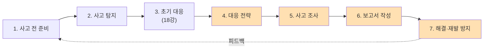
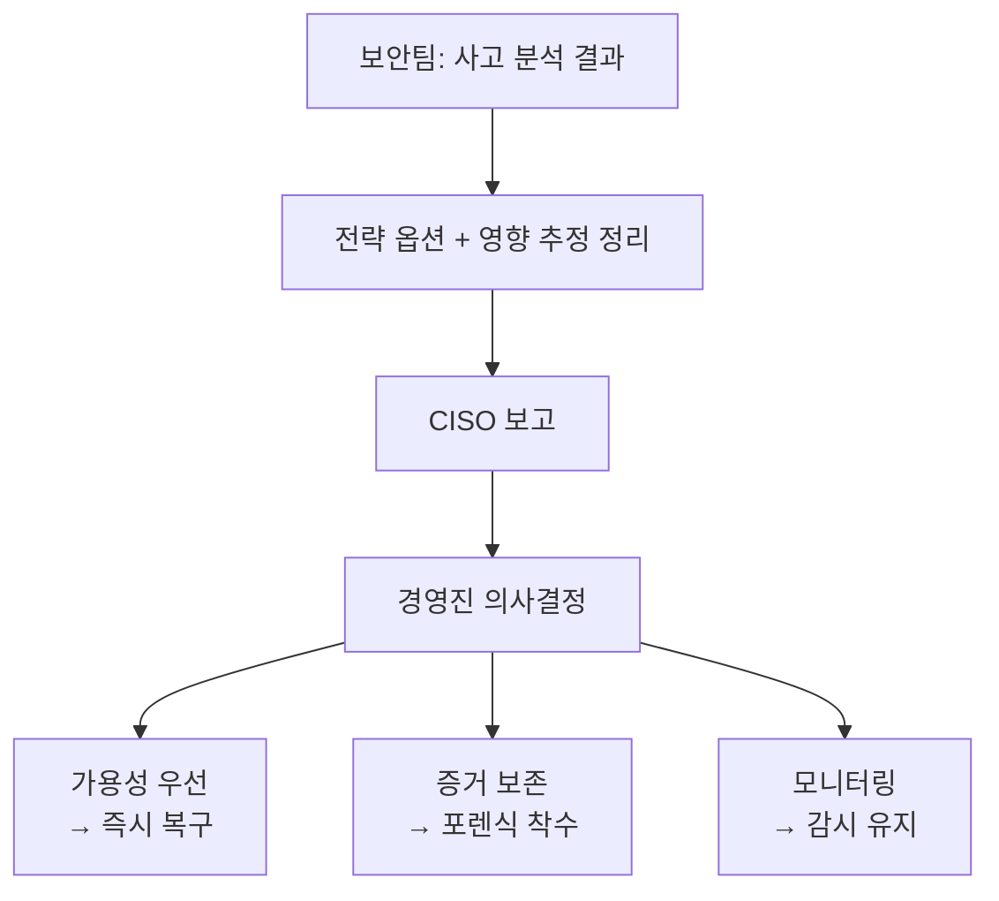
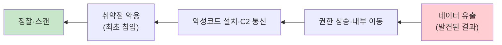
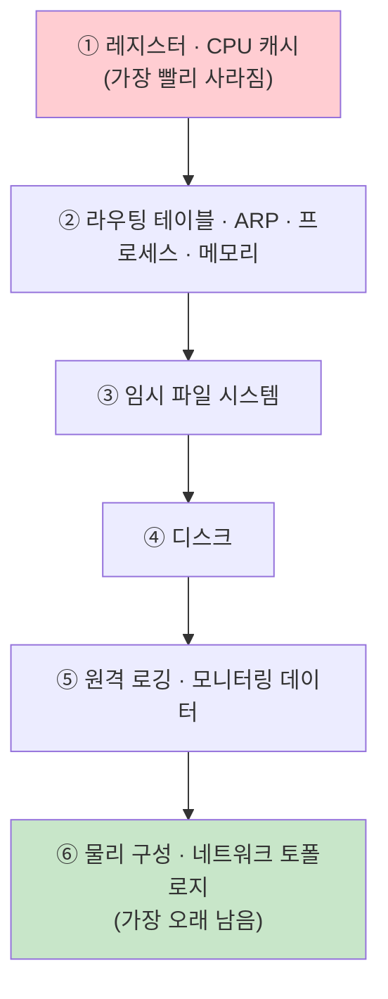
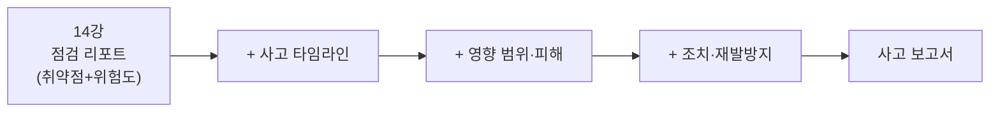
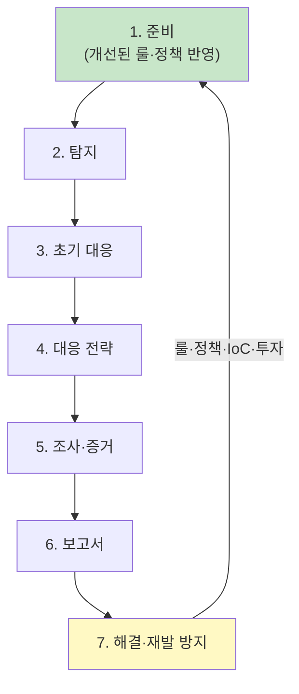

# 사고 조사와 증거 보존 — 대응 전략에서 재발 방지까지

18강에서 우리는 침해사고의 **초기 대응**까지 마쳤습니다. 사고를 인지하고, 분석하고, 피해 확산을 막기 위한 응급 처치를 끝낸 상태입니다.  
그런데 불을 끄고 나면 더 어려운 질문이 기다립니다. **"이 시스템을 지금 당장 다시 켤 것인가, 범인을 잡기 위해 증거를 모을 것인가, 아니면 멈춰 둔 채 끝까지 지켜볼 것인가?"**  
이번 강의에서는 KISA 7단계 대응 절차의 후반부, 즉 **4단계 대응 전략 → 5단계 사고 조사 → 6단계 보고서 작성 → 7단계 해결(재발 방지)**을 다룹니다.

> **🎯 우리가 지금 왜 이걸 하나요?**  
> 사고가 터지면 우리는 동시에 **세 가지를 원합니다.** 서비스를 빨리 살리고 싶고, 누가 왜 들어왔는지 알고 싶고, 다시는 안 당하고 싶습니다. 그런데 이 셋은 서로 **충돌**합니다. 서버를 급하게 재부팅하면 메모리 속 증거가 날아가고, 증거를 보존하려고 멈춰 두면 서비스가 죽습니다. 그래서 "치료할 것인가, 범인을 잡을 것인가, 서비스를 살릴 것인가"를 **먼저 결정**해야 합니다. 이 결정이 곧 **대응 전략**이고, 그 위에서 무슨 일이 있었는지 완벽히 재구성하고(조사), 기록하고(보고서), 다시 당하지 않도록 개선하는(해결) 것 — 그것이 사고 대응의 진짜 마무리입니다.
{: .prompt-info }

다룰 내용:

1. 4단계 — 대응 전략 체계화
2. 5단계 — 사고 조사와 증거 수집(RFC 3227 / 한국 표준)
3. 6단계 — 사고 보고서 작성
4. 7단계 — 해결과 재발 방지(피드백 순환)

먼저 이번 강의가 7단계 절차의 어디에 위치하는지 봅니다.

색칠된 4~7단계가 이번 강의의 범위입니다.

---

## 1. 4단계 — 대응 전략 체계화 (Strategy Formulation)

### 왜 전략부터 정하나요?

초기 대응으로 급한 불은 껐지만, 그다음 행동은 **목표가 무엇이냐에 따라 정반대**가 됩니다.  
빨리 복구하려면 백업을 덮어쓰며 재부팅해야 하는데, 그 순간 공격자의 흔적(메모리, 임시 파일, 로그인 세션)이 사라집니다. 반대로 증거를 지키려면 시스템을 그대로 멈춰 둬야 하고, 그만큼 서비스 중단이 길어집니다.  
**둘 다 가질 수는 없습니다.** 그래서 "무엇을 가장 중요하게 볼 것인가"를 조직 차원에서 결정하는 것이 4단계입니다.

### 세 가지 대응 전략

| 전략 | 핵심 행동 | 장점 | 대가(트레이드오프) | 적합한 상황 |
|---|---|---|---|---|
| **서비스 가용성 우선** (Business Continuity) | 증거 일부 훼손을 감수하고 **백업으로 즉시 복구·재개** | 서비스 중단 최소화, 매출·신뢰 손실 방지 | 휘발성 증거 소실, 원인 규명 어려움 | 매출 직결 서비스, 피해 경미, 원인이 이미 명확 |
| **증거 보존·원인 규명 우선** (Forensic Focus) | **네트워크만 격리**하고 전원은 유지한 채 메모리 덤프·디스크 이미징 | 완전한 사고 재구성, 법적 대응 가능 | 서비스 중단이 길어짐, 인력·시간 소요 큼 | 법적 신고·소송 가능성, 대규모 정보유출, 재침해 우려 |
| **함정 수사·모니터링** (Honeypot / Monitoring) | 차단하지 않고 **공격자를 계속 감시**하며 행동·목표 수집 | 공격자 전모 파악, APT·내부자 추적 | 리스크 매우 큼(추가 피해 가능), 고도 인력 필요 | APT·국가배후·내부자 의심, 충분한 통제 능력 보유 시 |

> 함정 수사 전략은 영화처럼 멋져 보이지만, 공격자를 켜 둔 채로 두는 것이라 **추가 피해의 책임**을 조직이 떠안습니다. 그래서 일반 기업에서는 매우 드물고, 대부분 **서비스 가용성** 또는 **증거 보존** 중에서 고릅니다.
{: .prompt-warning }

### 관리자 승인은 필수입니다

이 전략 결정은 보안팀 단독으로 내릴 수 없습니다. 어떤 선택이든 **사업·법무·평판에 직접 영향**을 주기 때문에, CISO를 통해 경영진의 승인을 받아야 합니다.

경영진에게 보고할 때 반드시 포함해야 할 것은 다음과 같습니다.

- **추정 규모**: 영향받은 시스템·계정·데이터의 범위
- **예상 피해액**: 복구 비용 + 매출 손실 + 배상·과태료 가능성
- **법적 신고 의무**: 개인정보 유출 시 신고 시한, 규제기관 통보 요건

경영진이 가장 민감하게 반응하는 두 가지는 보통 **"언론 보도"**와 **"과태료"**입니다. 또한 수사기관에 수사를 의뢰하면 **서버가 압수**되어 정상화가 더 늦어질 수 있다는 점도 미리 인지시켜야 합니다. 이 부분을 설명하지 않으면, 나중에 "왜 서비스가 며칠씩 멈췄느냐"는 책임 추궁으로 돌아옵니다.

---

## 2. 5단계 — 사고 조사 (Investigation)

### 목표: 완벽한 사고 재구성

5단계의 목표는 한 문장으로 **"무슨 일이 있었는지 빈틈없이 다시 그려 내는 것"**입니다. 다음 여섯 가지 질문에 모두 답할 수 있어야 합니다.

| 질문 | 조사 항목 |
|---|---|
| **언제** | 공격이 시작된 시점, 진행 타임라인 |
| **누가** | 공격자 식별(IP, 계정, 도구, 그룹 특징) |
| **어떻게(침투)** | 최초 침입 경로와 내부 확산 경로 |
| **무엇이(피해)** | 영향받은 자산·데이터·계정의 범위 |
| **왜(성공)** | 악용된 취약점, 통제가 뚫린 지점 |
| **무엇으로(흔적)** | 남은 로그·파일·아티팩트(증거) |

조사의 관점은 02강에서 배운 **사이버 킬체인**을 거꾸로 따라가는 것입니다. 우리가 발견한 마지막 흔적(예: 데이터 유출)에서 출발해, "이게 가능하려면 그 전에 무엇이 있었나"를 한 단계씩 역추적하면 결국 최초 침입 지점까지 도달합니다.

### ★ 증거 수집의 핵심 원칙 — RFC 3227

증거를 모을 때 가장 먼저 지켜야 하는 규칙은 **"휘발성이 높은 것부터 수집한다(Order of Volatility)"**입니다. 메모리에 있는 정보는 전원을 끄거나 시간이 지나면 사라지지만, 디스크에 기록된 파일은 비교적 오래 남기 때문입니다. RFC 3227은 그 수집 순서를 다음과 같이 권고합니다.

여기서 핵심은 **순서**입니다. 디스크를 먼저 이미징하느라 시간을 끌면, 그사이 메모리에 있던 암호화 키·접속 세션·악성 프로세스 정보가 모두 날아갑니다. 그래서 "휘발성 높은 것 먼저, 안정적인 것 나중"이 철칙입니다.

### RFC 3227(글로벌) vs 한국 가이드라인

RFC 3227이 수집의 **기술적 순서**를 정의한다면, 한국의 가이드라인(KISA·TTA)은 그 위에 **법적 증거 능력**을 위한 절차적 요건을 더합니다.

| 구분 | RFC 3227 (글로벌 기술 표준) | 한국 가이드라인 (KISA / TTA) |
|---|---|---|
| 초점 | 휘발성 순서에 따른 **기술적 수집** | 법정에서 인정받는 **증거 능력 확보** |
| 핵심 원칙 | Order of Volatility | **무결성·동일성**(원본과 사본이 같음을 증명) |
| 수집 범위 | 가능한 한 폭넓게 | **선별 압수**(혐의 관련 정보만) |
| 절차 기록 | 행위·시각 기록 권고 | **Chain of Custody(연계보관성) 문서화 필수** |
| 법적 근거 | 권고 수준 | **형사소송법상 절차적 엄격성** 적용 |

한국 환경에서 특히 중요한 두 가지는 다음과 같습니다.

- **무결성·동일성**: 수집한 사본이 원본과 한 비트도 다르지 않음을 **해시값(예: SHA-256)**으로 증명합니다. 수집 직후 해시를 기록하고, 분석·법정 제출 시점마다 같은 해시가 나오는지 확인합니다.
- **Chain of Custody(연계보관성)**: 증거를 누가·언제·어디서·어떻게 수집·보관·이관했는지 **끊김 없이 문서화**합니다. 한 사람이라도 손을 댄 기록이 비면, 그 증거는 법정에서 통째로 부정될 수 있습니다.

### 한국 표준: TTAK.KO-12.0058

국내 디지털 증거 수집·보존의 기준 문서는 **TTAK.KO-12.0058 「디지털 증거 수집 및 보존 가이드라인」**입니다. 핵심은 **선별 압수 원칙** — 사고와 무관한 정보까지 무차별로 가져오는 것이 아니라, **혐의(사고)와 관련된 정보만** 선별해 수집해야 한다는 것입니다. 무관한 개인정보를 함께 수집하면 그 자체가 또 다른 법적 문제가 됩니다.

### 무엇을, 어떻게 이미징하나요?

실제 증거 확보는 세 가지 축으로 진행합니다.

| 대상 | 수집 방식 | 비고 |
|---|---|---|
| **디스크** | 비트스트림(bit-stream) 이미징 — 물리 디스크 전체 복제 | 삭제된 영역·슬랙 공간까지 보존 |
| **메모리** | 메모리 덤프(RAM 캡처) | 실행 중 프로세스·키·세션 등 휘발성 증거 |
| **네트워크** | PCAP 패킷 캡처 + 방화벽·프록시·서버 로그 | C2 통신, 유출 트래픽 추적 |

> **OT 장비 주의**: PLC·RTU·HMI 같은 운영기술(OT) 장비는 함부로 멈출 수 없습니다. 멈추는 순간 생산 라인이나 설비가 정지해 물리적 사고로 이어질 수 있기 때문입니다. 이런 장비는 전원을 끄고 디스크를 떼어 이미징하는 대신, **가동 중인 상태에서 얻을 수 있는 라이브 증거(메모리·통신 로그·실행 상태)를 우선** 확보합니다.
{: .prompt-warning }

---

## 3. 6단계 — 사고 보고서 작성

### 왜 보고서가 별도 단계인가요?

조사로 알아낸 사실은 **공유되고 기록되지 않으면 사라집니다.** 보고서는 단순한 형식적 서류가 아니라, **무슨 일이, 왜 일어났고, 얼마나 영향을 미쳤으며, 앞으로 무엇을 바꿀 것인가**를 경영진·규제기관·기술조직이 한 문서에서 공유하기 위한 **공식 기록**입니다.

읽는 대상마다 보고서가 강조하는 부분이 다릅니다.

| 독자 | 가장 알고 싶은 것 |
|---|---|
| **경영진** | 피해 규모, 비용, 법적 리스크, 재발 방지 투자 필요성 |
| **규제기관** | 유출 정보 종류·규모, 신고 시한 준수 여부, 조치 내역 |
| **기술조직** | 공격 경로, 악용 취약점, 적용한 패치·룰, 재현 방법 |

### 14강 자동 리포트와의 연결

14강에서 우리는 점검 결과를 자동으로 정리하는 **점검 리포트** 생성기를 만들었습니다. 같은 구조를 **사고 리포트**로 확장할 수 있습니다. 점검 리포트가 "발견된 취약점 목록 + 위험도"였다면, 사고 리포트는 거기에 **타임라인 + 영향 범위 + 조치 내역 + 재발 방지 계획**을 더한 것입니다. 즉 점검 자동화에서 쌓은 리포트 틀을 그대로 재활용해, 사람이 채워야 할 항목만 추가하면 됩니다.

---

## 4. 7단계 — 해결과 재발 방지

### 핵심 명제: "똑같은 공격에 두 번 당하지 않는다"

마지막 7단계의 목표는 단순히 시스템을 원래대로 되돌리는 것이 아닙니다. **같은 공격이 다시 들어왔을 때 이번엔 막아 내도록 조직을 바꾸는 것**입니다. 이를 위해 다섯 가지를 점검합니다.

| 항목 | 무엇을 묻는가 | 산출물 |
|---|---|---|
| **1. 탐지 룰 한계 식별** | 왜 이번 공격을 더 일찍 탐지하지 못했나? | 신규·보완 탐지 룰 |
| **2. 대응 프로세스 효율 평가** | R&R은 명확했나? 골든타임 안에 움직였나? | 절차 개선안, 책임자 재지정 |
| **3. 보안 정책 현실화** | 정책이 실제 위협을 반영하고 있나? | 정책 개정(신규 위협 반영) |
| **4. IoC 자산화** | 이번에 얻은 흔적을 어떻게 재사용하나? | 블랙리스트 갱신, 탐지 시나리오 |
| **5. 경영진 설득·투자 근거** | 무엇에 더 투자해야 하나? | 예산·인력 요청서 |

여기서 **IoC 자산화(4번)**가 특히 중요합니다. 이번 사고에서 확인한 악성 IP·도메인·해시·공격 패턴(=IoC, 침해지표)을 17강에서 다룬 방식대로 **블랙리스트에 추가**하고, 그 공격 흐름을 **탐지 시나리오**로 만들어 두면, 같은 공격자가 다시 와도 자동으로 걸러집니다. 한 번의 사고가 **다음 방어의 재료**가 되는 것입니다.

### 피드백은 다시 1단계로 순환합니다

7단계의 결과물(개선된 룰·정책·시나리오·투자)은 끝이 아니라, **다시 1단계 "사고 전 준비"로 들어갑니다.** 이렇게 사고 대응은 직선이 아니라 **순환**합니다.

> 이 순환이 바로 보안 조직이 **시간이 갈수록 강해지는 이유**입니다. 사고를 한 번 겪을 때마다 탐지 룰이 늘고, 프로세스가 다듬어지고, IoC가 쌓입니다. 17강의 IoC 활용과 20~21강에서 다룰 보안관제(SOC)는 모두 이 7단계 피드백이 만들어 낸 자산 위에서 돌아갑니다.
{: .prompt-info }

---

## 5. 정리

- **4단계(전략)**: "치료·검거·복구" 중 무엇을 우선할지 결정합니다. 가용성 우선 / 증거 보존 우선 / 모니터링 중에서 고르며, 반드시 **경영진 승인**을 받습니다.
- **5단계(조사)**: 킬체인을 역추적해 6하원칙으로 사고를 재구성하고, **RFC 3227의 휘발성 순서**로 증거를 모읍니다. 한국에서는 **무결성·Chain of Custody·선별 압수**(TTAK.KO-12.0058)가 추가됩니다.
- **6단계(보고서)**: 무슨 일이·왜·얼마나·앞으로 무엇을 바꿀지를 담은 공식 기록을 만듭니다. 14강 점검 리포트를 확장합니다.
- **7단계(해결)**: "두 번 당하지 않는다." 탐지·프로세스·정책·IoC·투자를 개선하고, 그 결과를 **다시 1단계로 순환**시킵니다.

자동화로 빠르게 점검하고(앞선 강의들), 사고가 나면 절차에 따라 차분히 조사·보존·개선하는 것 — 이 둘이 합쳐질 때 비로소 조직은 공격보다 **빨리, 그리고 영리하게** 진화합니다.

---

## 참고 자료

- RFC 3227 — Guidelines for Evidence Collection and Archiving: <https://www.rfc-editor.org/rfc/rfc3227>
- TTAK.KO-12.0058 — 디지털 증거 수집·보존 가이드라인 (TTA)
- NIST SP 800-86 — Guide to Integrating Forensic Techniques into Incident Response: <https://csrc.nist.gov/pubs/sp/800/86/final>
- KISA 보호나라: <https://www.boho.or.kr>

---

## 다음 강의 예고

다음 **20강**에서는 시야를 한 단계 넓혀, **보안관제(SOC)란 무엇인가**를 다룹니다. 지금까지 쌓은 점검 자동화·탐지 룰·IoC·사고 대응 절차가 실제 현장에서 어떻게 **24시간 돌아가는 관제 체계**로 묶이는지를 살펴봅니다.
