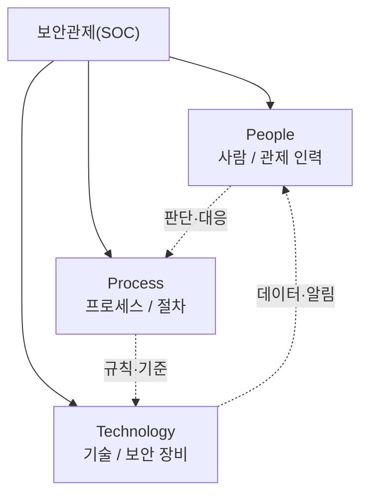
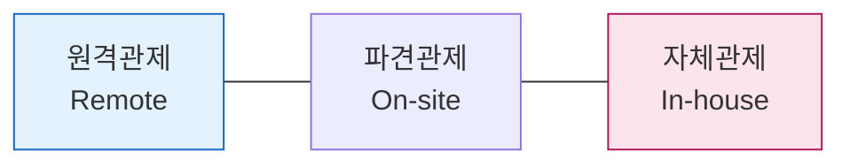
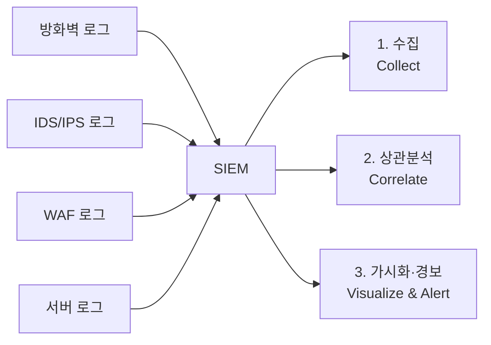
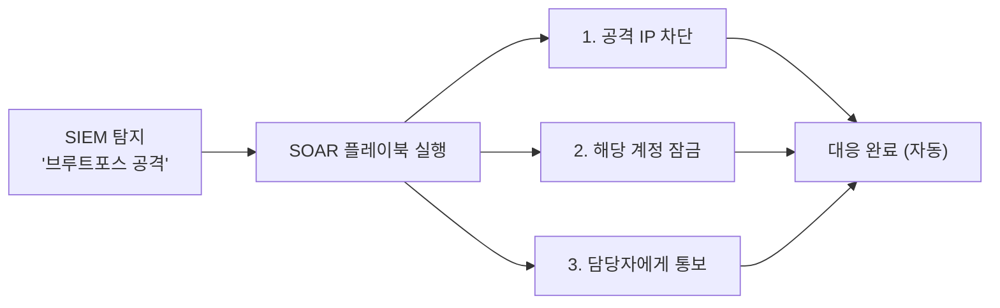
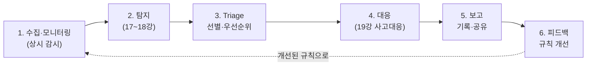
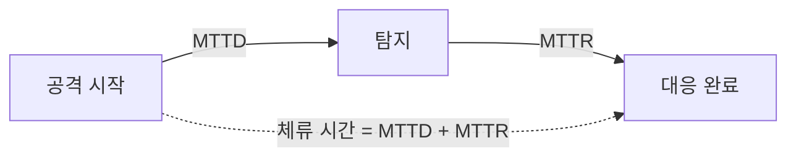

# 보안관제(SOC)란 무엇인가 — 24시간 지키는 사람들

지금까지 우리는 시스템을 **점검(공격)** 하고, 이상 징후를 **탐지** 하고, 일이 터졌을 때 **침해사고에 대응** 하는 방법을 따로따로 배웠습니다. 그런데 이 활동들에는 공통점이 하나 있습니다. 바로 **누군가 계속 지켜보고 있어야 한다**는 것입니다.

공격자는 우리가 퇴근하는 오후 6시에 맞춰 쉬지 않습니다. 오히려 사람이 가장 적은 새벽 시간, 연휴 첫날, 명절 연휴에 공격이 몰립니다. 그래서 보안은 "업무 시간에만 하는 일"이 될 수 없습니다. 이 모든 활동을 **24시간 쉬지 않고 상시 운영하는 체계**가 바로 보안관제센터인 SOC(Security Operations Center)입니다.

> **🎯 우리가 지금 왜 이걸 하나요?**  
> 17~19강에서 우리는 탐지와 사고 대응을 배웠습니다. 그런데 탐지 규칙을 만들어 놓아도, 새벽 3시에 알림이 울릴 때 아무도 보지 않으면 소용이 없겠죠. 사고는 업무 시간에만 일어나지 않으니까요. 보안관제(SOC)는 바로 이 "항상 지켜보는" 문제를 사람·프로세스·기술로 풀어내는 체계입니다. 이번 강의에서 SOC의 전체 그림을 이해하면, 다음 21강에서 우리가 직접 **미니 SOAR(자동화된 관제)** 를 만들 때 "이걸 왜 자동화하는지"가 또렷하게 보일 거예요.
{: .prompt-info }

이번 강의에서 다룰 내용은 다음과 같습니다.

1. 보안관제란 무엇인가
2. 관제의 3대 요소 (People · Process · Technology)
3. 관제 유형 3가지 (원격 · 파견 · 자체)
4. 관제 대상이 되는 장비와 데이터
5. SIEM — 로그를 한곳에 모아 분석하기
6. SOAR — 대응까지 자동화하기
7. 관제 프로세스 한눈에 보기
8. 관제의 핵심 지표 (MTTD · MTTR)

---

## 1. 보안관제란 무엇인가

**보안관제**란 조직의 정보보안을 위해 시스템과 네트워크를 **지속적으로 모니터링**하고, 발견된 위협에 **대응**하는 일련의 활동을 말합니다.

핵심 단어는 두 가지입니다.

- **지속적으로(continuously)**: 한 번 점검하고 끝나는 것이 아니라, 24시간 365일 멈추지 않습니다.
- **모니터링과 대응(monitoring & response)**: 그냥 지켜보기만 하는 것이 아니라, 위협을 발견하면 실제로 막고 처리합니다.

여기서 중요한 점은, 보안관제가 **어떤 한 가지 장비나 소프트웨어를 가리키는 말이 아니라는 것**입니다. 보안관제는 **사람, 프로세스, 기술이 결합된 운영 체계** 전체를 의미합니다. 아무리 비싼 보안 장비를 사다 놓아도, 그것을 지켜보고 판단하고 대응할 사람과 절차가 없으면 관제라고 부를 수 없습니다.

비유하자면, 보안 장비는 건물의 **CCTV 카메라**이고, 보안관제는 **그 영상을 24시간 보면서 이상이 생기면 경비원을 출동시키는 관제실 전체**입니다. 카메라만 있고 보는 사람이 없으면, 사고가 나도 한참 뒤에야 녹화 영상을 돌려보게 될 뿐입니다.

---

## 2. 관제의 3대 요소 (People · Process · Technology)

보안관제를 떠받치는 세 개의 기둥이 있습니다. 흔히 **PPT(People, Process, Technology)** 라고 부릅니다.

| 요소 | 의미 | 구체적인 예 | 빠지면 생기는 문제 |
|---|---|---|---|
| **People (사람)** | 알림을 분석하고 판단·대응하는 관제 요원, 분석가, 사고대응팀 | 24시간 교대 근무자, 침해사고 분석가 | 장비가 울려도 아무도 판단하지 못함 |
| **Process (프로세스)** | 무엇을, 어떤 순서로, 누가 할지 정해 둔 절차 | 알림 등급 분류 기준, 에스컬레이션 규칙, 대응 매뉴얼 | 사람마다 대응이 제각각이고 누락이 생김 |
| **Technology (기술)** | 데이터를 수집·분석·차단하는 보안 장비와 소프트웨어 | 방화벽, IDS/IPS, WAF, SIEM, SOAR | 사람이 모든 로그를 손으로 볼 수 없음 |

세 요소는 어느 하나만 강해서는 동작하지 않습니다. **좋은 장비(기술)** 가 데이터를 모아 주면, **잘 만든 절차(프로세스)** 에 따라, **숙련된 사람(인력)** 이 판단하고 대응합니다. 이 셋이 톱니바퀴처럼 맞물려 돌아갈 때 비로소 "관제가 된다"고 말할 수 있습니다.

---

## 3. 관제 유형 3가지 (원격 · 파견 · 자체)

보안관제는 "누가, 어디서, 누구의 시스템으로" 운영하느냐에 따라 크게 세 가지 유형으로 나뉩니다. 이 분류는 실제 보안 업계에서 서비스를 고를 때 가장 먼저 따지는 기준이기도 합니다.

왼쪽으로 갈수록 **외부 의존도가 높고 비용 부담이 낮으며**, 오른쪽으로 갈수록 **직접 통제하지만 투자 부담이 큽니다.**

| 구분 | 원격관제 (Remote) | 파견관제 (On-site) | 자체관제 (In-house) |
|---|---|---|---|
| **정의** | 관제 전문업체가 **자사 관제센터**에서 대상기관의 보안장비 이벤트를 원격으로 상시 모니터링하고, 침해사고 시 긴급 출동·대응 | 대상기관이 **자체 관제시스템**을 구축하고, 전문업체로부터 **인력을 파견**받아 그 시스템을 운영 | 관제시스템과 전문인력을 **조직이 직접** 구축·보유·운영 |
| **운영 주체** | 외부 전문업체 | 외부 업체의 파견 인력 (시스템은 자사) | 조직 내부 인력 |
| **데이터 위치** | 외부 업체 관제센터로 이벤트 전송 | 조직 내부에 머무름 | 조직 내부에 머무름 |
| **장점** | 비용이 낮고, 전문업체의 위협 인텔리전스를 공유받음. 도입이 빠름 | 데이터 외부 유출이 없어 보안성이 높음. 전문 인력의 도움을 받으면서 시스템은 통제 | 통제·유연성이 가장 높고, 조직 맞춤 대응이 가능. 노하우가 내부에 축적됨 |
| **단점** | 우리 데이터가 외부로 나감. 조직 특화 대응이 어려움 | 시스템 구축 비용 부담. 파견 인력 관리 필요 | 시스템·인력 투자와 전문성 확보 부담이 가장 큼 |
| **주로 쓰는 곳** | 중소기업, 빠른 도입이 필요한 조직 | **공공기관·금융권** 등 데이터 외부 유출이 금지된 곳 | 대기업, 자체 보안 역량을 갖춘 대형 조직 |

특히 **공공기관과 금융권**에서 파견관제가 많은 이유를 기억해 두면 좋습니다. 이 분야는 법·규제상 **민감 데이터(개인정보, 금융정보)가 조직 밖으로 나가는 것이 금지**되어 있는 경우가 많습니다. 그래서 시스템은 우리 안에 두되(데이터 유출 방지), 운영은 전문 인력에게 맡기는(전문성 확보) 절충안을 택하는 것입니다.

---

## 4. 관제 대상이 되는 장비와 데이터

관제 요원은 도대체 "무엇을" 지켜볼까요? 조직 안에는 보안과 관련된 데이터를 쏟아내는 장비가 아주 많습니다.

| 장비 / 데이터 | 무엇을 알려주나 |
|---|---|
| **방화벽 (Firewall)** | 허용/차단된 네트워크 연결 기록 |
| **IDS / IPS** | 알려진 공격 패턴 탐지·차단 로그 |
| **WAF (웹 방화벽)** | SQL Injection, XSS 등 웹 공격 시도 |
| **안티바이러스 / EDR** | 악성코드 탐지, 단말(PC·서버)의 이상 행위 |
| **서버 / 시스템 로그** | 로그인 성공·실패, 권한 변경, 프로세스 실행 |
| **네트워크 로그** | 트래픽 흐름, 비정상적인 외부 통신 |
| **애플리케이션 로그** | 우리가 직접 만든 서비스의 동작 기록 |

문제는 이 데이터들이 **제각기 다른 장비에, 다른 형식으로 흩어져 있다**는 점입니다. 방화벽 로그 따로, 웹 서버 로그 따로 보면, "외부 IP가 방화벽을 통과해서 → 웹 서버에 공격을 시도하고 → 서버에서 의심스러운 프로세스를 실행했다"는 **하나의 공격 시나리오를 연결해서 볼 수 없습니다.**

그래서 등장하는 것이 다음 장의 주인공, **SIEM**입니다. 흩어진 로그를 **한곳에 모아** 분석하는 시스템입니다.

---

## 5. SIEM — 로그를 한곳에 모아 분석하기

**SIEM(Security Information and Event Management: 보안 정보 및 이벤트 관리)** 은 여러 장비에서 발생하는 **로그와 이벤트를 한곳에 수집**하고, 서로 **상관분석(correlation)** 해서 위협을 **탐지하고 가시화**하는 시스템입니다.

SIEM이 하는 일을 세 단계로 정리하면 다음과 같습니다.

1. **수집(Collect)**: 흩어진 모든 장비의 로그를 한 저장소로 모읍니다.
2. **상관분석(Correlate)**: 서로 다른 로그를 엮어 의미를 찾습니다. 예를 들어 "같은 IP에서 5분 안에 로그인 100번 실패 → 이후 1번 성공"이라면, 따로 보면 평범하지만 **엮으면 무차별 대입 공격 성공**이라는 신호가 됩니다.
3. **가시화·경보(Visualize & Alert)**: 분석 결과를 대시보드로 보여주고, 위험한 패턴이 보이면 관제 요원에게 **알림**을 보냅니다.

> 💡 **우리가 만든 것과 연결해 보면** — 15강에서 우리는 점검 결과를 **JSONL 로그**로 차곡차곡 쌓았습니다. 사실 그 JSONL 로그가 바로 **미니 SIEM의 입력 데이터** 역할을 합니다. 여러 도구의 출력을 한 줄씩 표준 형식(JSONL)으로 모아 두면, 나중에 한꺼번에 읽어 들여 "어떤 공격이 언제 어디서 일어났는지"를 분석할 수 있죠. 규모만 다를 뿐, 원리는 상용 SIEM과 똑같습니다.

---

## 6. SOAR — 대응까지 자동화하기

SIEM이 위협을 **찾아주는 눈**이라면, **SOAR(Security Orchestration, Automation and Response: 보안 오케스트레이션, 자동화 및 대응)** 는 찾은 위협에 **직접 대응하는 손과 발**입니다.

SIEM의 한계는 분명합니다. SIEM은 "이건 공격으로 보입니다"라고 **알려줄 뿐**, 실제로 IP를 차단하거나 계정을 잠그는 일은 결국 **사람이 손으로** 해야 했습니다. 그런데 하루에 수천 건씩 알림이 쏟아지면, 사람은 금세 지치고 중요한 알림을 놓치게 됩니다(이른바 **알림 피로, alert fatigue**).

SOAR는 이 대응 과정을 **자동화**합니다. 핵심은 **플레이북(Playbook)** 이라는 개념입니다.

- **플레이북**: 위협 유형별로 "이런 공격이 들어오면 → 이렇게 대응한다"는 **최적의 대응 절차를 미리 매뉴얼로 정해 둔 것**입니다. 마치 스포츠 팀의 작전집과 같습니다.

예를 들어 "무차별 대입 공격" 플레이북이 있다면, SIEM이 그 공격을 탐지하는 순간 SOAR가 **사람의 개입 없이** 공격 IP를 차단하고, 계정을 잠그고, 담당자에게 알림을 보내는 일을 **몇 초 안에** 끝낼 수 있습니다. 사람이 했다면 수십 분이 걸렸을 일입니다.

| | SIEM | SOAR |
|---|---|---|
| 역할 | 위협을 **탐지·가시화** | 위협에 **대응·자동화** |
| 비유 | 지켜보는 **눈** | 처리하는 **손발** |
| 핵심 개념 | 로그 수집·상관분석 | 플레이북 기반 자동 대응 |
| 결과물 | "이건 공격입니다" (알림) | "공격을 막았습니다" (조치) |

> 💡 **다음 강의 예고와 연결** — 21강에서 우리는 바로 이 SOAR를 **직접 작게 만들어 봅니다.** AI 에이전트가 로그(미니 SIEM)를 읽고, 공격을 판단(Triage)하고, 플레이북에 따라 대응까지 자동으로 수행하는 **미니 SOAR**입니다. 지금 이 개념을 이해해 두면 다음 강의가 훨씬 쉬워집니다.

---

## 7. 관제 프로세스 한눈에 보기

지금까지 배운 조각들이 실제 관제에서는 **하나의 끊임없이 도는 루프**로 엮입니다. 17~19강에서 배운 탐지·대응 단계들이 어디에 들어가는지 함께 표시했습니다.

| 단계 | 하는 일 | 핵심 질문 |
|---|---|---|
| **1. 수집·모니터링** | 모든 장비의 로그를 모아 상시 감시 | "지금 무슨 일이 일어나고 있나?" |
| **2. 탐지** | 규칙·패턴으로 이상 징후 포착 | "이거 평소와 다른가?" |
| **3. Triage(선별)** | 진짜 위협인지 가려내고 우선순위 부여 | "급한가? 진짜인가, 오탐인가?" |
| **4. 대응** | 차단·격리·복구 등 실제 조치 | "어떻게 막을 것인가?" |
| **5. 보고** | 무슨 일이 있었는지 기록하고 공유 | "무엇이 왜 일어났나?" |
| **6. 피드백** | 이번 사고를 교훈 삼아 규칙 개선 | "다음엔 어떻게 더 빨리 잡을까?" |

여기서 가장 자주 간과되는 단계가 **3. Triage(선별)** 입니다. 탐지된 알림이 모두 진짜 공격은 아닙니다. 대부분은 **오탐(false positive)** 이거나 사소한 잡음입니다. 한정된 인력으로 진짜 위협에 집중하려면, **무엇이 급하고 무엇이 진짜인지 빠르게 선별**하는 일이 관제의 성패를 가릅니다. (그리고 바로 이 Triage가, 다음 강의에서 AI에게 맡길 핵심 작업입니다.)

마지막 **6. 피드백**이 다시 1단계로 이어지는 점도 중요합니다. 관제는 한 바퀴 돌고 끝나는 직선이 아니라, **계속 돌면서 점점 똑똑해지는 원**입니다.

---

## 8. 관제의 핵심 지표 (MTTD · MTTR)

관제를 "잘하고 있는지"는 어떻게 측정할까요? 가장 널리 쓰이는 두 가지 지표가 있습니다.

| 지표 | 풀이 | 의미 | 좋은 방향 |
|---|---|---|---|
| **MTTD** | Mean Time To Detect | 공격이 시작된 뒤 **탐지하기까지** 걸린 평균 시간 | **짧을수록** 좋음 |
| **MTTR** | Mean Time To Respond (평균 대응 시간) | 탐지한 뒤 **대응을 완료하기까지** 걸린 평균 시간 | **짧을수록** 좋음 |

이 두 지표가 왜 중요한지는 공격자의 입장에서 생각해 보면 분명합니다. 공격자가 시스템에 침투한 뒤, **들키지 않고 머무는 시간이 길수록** 더 많은 데이터를 빼내고 더 깊이 침투할 수 있습니다. 이 "머무는 시간"을 보안 업계에서는 **체류 시간(dwell time)** 이라고 부릅니다.

- **MTTD를 줄인다** = 공격을 더 빨리 알아챈다 → SIEM과 좋은 탐지 규칙의 몫
- **MTTR을 줄인다** = 알아챈 뒤 더 빨리 막는다 → SOAR와 자동화의 몫

결국 우리가 SIEM과 SOAR, 그리고 자동화를 도입하는 **궁극적인 목표**는 이 두 시간을 줄여서, 공격자가 우리 안에 머무는 시간을 최소화하는 것입니다. 사람이 손으로 하던 일을 자동화하면 MTTR이 극적으로 줄어듭니다. 바로 이것이 다음 강의에서 우리가 미니 SOAR를 만드는 이유입니다.

---

## 정리

이번 강의의 핵심을 한 줄씩 정리합니다.

- **보안관제(SOC)** 는 시스템을 24시간 상시 모니터링하고 위협에 대응하는, **사람·프로세스·기술이 결합된 운영 체계**입니다.
- 관제 유형은 **원격 / 파견 / 자체** 세 가지이며, 데이터 유출이 금지된 **공공·금융권에서는 파견관제**가 많습니다.
- 흩어진 로그를 한곳에 모아 분석하는 것이 **SIEM**, 찾은 위협에 플레이북으로 자동 대응하는 것이 **SOAR**입니다.
- 관제는 **수집→탐지→Triage→대응→보고→피드백**의 끊임없는 루프이며, 그 성과는 **MTTD·MTTR**로 측정합니다.

우리가 앞선 강의에서 만든 JSONL 로그(미니 SIEM)와, 다음 강의에서 만들 자동 대응(미니 SOAR)이 어떻게 하나의 관제 루프로 합쳐지는지를 머릿속에 그려 두면 좋겠습니다.

---

## 참고 자료

- 이글루코퍼레이션, 「보안 101: 보안관제란 무엇인가요?」 — <https://www.igloo.co.kr/security-information/%EB%B3%B4%EC%95%88-101-%EB%B3%B4%EC%95%88%EA%B4%80%EC%A0%9C%EB%9E%80-%EB%AC%B4%EC%97%87%EC%9D%B8%EA%B0%80%EC%9A%94/>
- SK쉴더스, 보안관제 서비스 소개 — <https://www.skshieldus.com/security-services/monitoring>
- Gartner, SIEM(Security Information and Event Management) 정의
- Gartner, SOAR(Security Orchestration, Automation and Response) 정의
- KISA 보호나라 — <https://www.boho.or.kr>

---

## 다음 강의 예고

**21강 — 자동화된 보안관제 만들기**

이번 강의에서 SOC의 전체 그림(SIEM·SOAR·관제 프로세스)을 이해했으니, 다음 강의에서는 이를 **직접 작게 구현**합니다. AI 에이전트가 로그를 읽어 위협을 **탐지**하고, 진짜 위협인지 **Triage(선별)** 하고, 플레이북에 따라 **대응**까지 자동으로 수행하는 **미니 SOAR**를 만들어 봅니다. 우리가 만든 도구들이 마침내 "24시간 지키는 관제 루프"로 합쳐지는 순간입니다.
