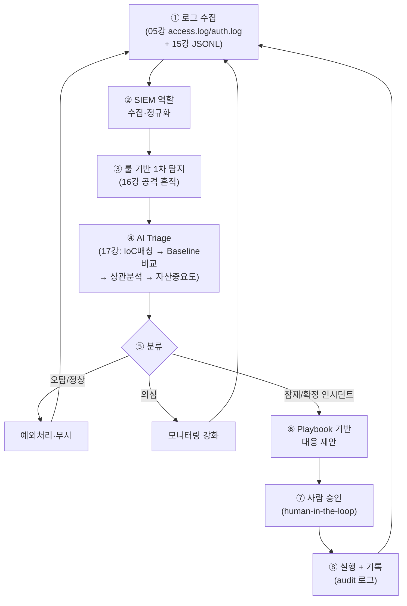
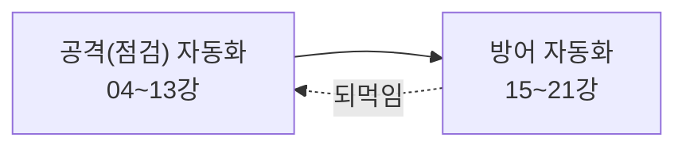

# 자동화된 보안관제 — AI로 탐지·선별·대응을 잇다

20강에서 우리는 SOC(보안관제센터)·SIEM(로그 통합 분석)·SOAR(대응 자동화)를 **개념**으로 배웠습니다.
이번 강의는 이 시리즈의 **도착점**입니다.

지금까지 우리는 부품을 하나씩 만들어 왔습니다. 로그를 구조화했고, 로그 속 공격 흔적을 읽었고, 이상징후를 선별하는 기준을 세웠고, 침해사고에 대응하는 절차를 익혔습니다. 하지만 이 부품들은 아직 **따로 놀고** 있습니다. 사람이 일일이 로그를 열어 보고, 의심스러운 줄을 골라내고, 무엇을 할지 판단해야 했습니다.

이제 이 부품들을 하나의 **루프(loop)** 로 엮습니다. AI 에이전트가 스스로 **탐지(Detect) → 선별(Triage) → 대응 제안(Respond)** 을 수행하는 **자동화된 보안관제의 축소판(미니 SOAR)** 을 만듭니다.

> **🎯 우리가 지금 왜 이걸 하나요?**
> 공격은 **24시간** 들어오는데 사람은 잠을 자야 합니다. 그리고 진짜 사고가 터졌을 때 가장 중요한 건 **얼마나 빨리 알아채고(MTTD), 얼마나 빨리 막느냐(MTTR)** 입니다. 사람이 수천 줄의 로그를 손으로 넘기는 동안 공격자는 이미 안쪽 깊숙이 들어갑니다. 그래서 우리는 **반복되는 1차 판단을 AI에게 맡겨** 사람이 정말 중요한 결정에 집중하게 만듭니다. 이번 강의에서 우리가 만든 모든 조각이 비로소 "살아 움직이는 관제 시스템"으로 합쳐집니다.
{: .prompt-info }

다룰 내용:

1. 지금까지 만든 부품 회수 — 무엇을 엮을 것인가
2. 자동화된 보안관제의 전체 아키텍처
3. Step-by-Step 개념 코드로 미니 SOAR 만들기
4. 가드레일과 사람의 자리(human-in-the-loop)
5. 도착점에서 돌아보기

---

## 1. 지금까지 만든 부품을 회수합니다

우리는 빈손에서 시작하지 않습니다. 시리즈 내내 만든 도구들이 그대로 **관제 시스템의 부품**이 됩니다. 새 시스템을 짓는 게 아니라, **있던 것을 연결**하는 것입니다.

| 강의 | 만든 것 | 관제 시스템에서의 역할 |
|------|---------|------------------------|
| 13강 | 자율 에이전트 + 가드레일 | 위험 동작은 사람 승인 후 실행 / audit 로그 |
| 15강 | 구조화 로그(JSONL) | **미니 SIEM의 입력 데이터** |
| 16강 | 로그 속 공격 흔적 읽기 | **룰 기반 1차 탐지**의 근거 |
| 17강 | Baseline·Triage·IoC | **AI 선별(Triage)의 판단 기준** |
| 18~19강 | 침해사고 대응 절차 | **Playbook(대응 매뉴얼)** 의 내용 |

"왜" 이 표가 중요할까요? 자동화의 핵심은 **새로운 마법이 아니라 연결**이기 때문입니다. 좋은 SOAR는 화려한 신기술이 아니라, **이미 가진 데이터·기준·절차를 끊김 없이 잇는 파이프라인**입니다. 우리는 그 부품을 이미 다 가지고 있습니다.

---

## 2. 전체 아키텍처 — 하나의 순환 루프

부품들이 어떻게 한 줄기로 흐르는지 먼저 그림으로 봅니다. 이 루프가 이번 강의 코드의 설계도입니다.



이 루프의 핵심은 **닫혀 있다(순환한다)** 는 것입니다. 한 바퀴 돌고 끝나는 게 아니라, 대응한 결과를 다시 로그로 남기고 그 로그가 다음 탐지의 입력이 됩니다. 관제는 **한 번의 검사**가 아니라 **멈추지 않는 감시**이기 때문입니다.

각 단계가 어떤 질문에 답하는지 정리하면 이렇습니다.

| 단계 | 한 줄 질문 | 담당 |
|------|-----------|------|
| 수집·정규화 | "무슨 일이 있었나?" | SIEM(15강) |
| 1차 탐지 | "이거 수상한데?" | 룰(16강) |
| 선별(Triage) | "진짜 위험한가, 얼마나?" | AI(17강) |
| 대응 제안 | "그럼 뭘 해야 하나?" | Playbook(18~19강) |
| 승인·실행 | "정말 해도 되나?" | 사람(13강 가드레일) |

---

## 3. Step-by-Step — 미니 SOAR 개념 코드

이제 위 설계도를 파이썬으로 옮깁니다. **실제 동작 구조를 그대로 보여주되, 안전하게** 만듭니다. 실제 차단·삭제 같은 위험 동작은 **제안만** 하고 실행은 사람 승인 뒤에 둡니다.

> 아래 코드는 한 파일 `mini_soar.py`로 이어진다고 생각하면 됩니다. 각 단계를 따로 보여주지만, 함께 합치면 그대로 돌아가는 구조입니다.

### Step 1. 로그 읽기 — 흩어진 로그를 이벤트 리스트로

가장 먼저 할 일은 **여러 형태의 로그를 하나의 형식**으로 모으는 것입니다. 이것이 SIEM의 "정규화(normalize)"입니다. 종류가 다른 로그를 같은 모양으로 맞춰야 그 다음 단계가 한 가지 방식으로 처리할 수 있기 때문입니다.

```python
# mini_soar.py (1/6) — 로그 수집 + 정규화
import json, re
from datetime import datetime

def load_jsonl(path: str) -> list[dict]:
    """15강에서 만든 구조화 로그(JSONL)를 읽어 이벤트 리스트로."""
    events = []
    with open(path, encoding="utf-8") as f:
        for line in f:
            line = line.strip()
            if not line:
                continue
            events.append(json.loads(line))
    return events

# access.log 한 줄 예: 192.168.57.50 - - [11/Jun/2026:10:01:11 +0900] "GET /admin HTTP/1.1" 404 ...
ACCESS_RE = re.compile(
    r'(?P<ip>\d+\.\d+\.\d+\.\d+).+?\[(?P<time>[^\]]+)\]\s+'
    r'"(?P<method>\w+)\s+(?P<url>\S+)[^"]*"\s+(?P<status>\d+)'
)

def load_access_log(path: str) -> list[dict]:
    """05강의 웹 접근 로그(access.log)를 같은 이벤트 형식으로 정규화."""
    events = []
    with open(path, encoding="utf-8") as f:
        for line in f:
            m = ACCESS_RE.search(line)
            if not m:
                continue
            events.append({
                "source": "access_log",
                "src_ip": m.group("ip"),
                "method": m.group("method"),
                "url": m.group("url"),
                "status": int(m.group("status")),
                "raw": line.strip(),
            })
    return events
```

서로 다른 로그를 읽었지만, 결과는 모두 `{"src_ip": ..., "url": ..., ...}` 같은 **공통 딕셔너리**입니다. 이렇게 모양을 맞춰 두면 다음 단계 코드가 단순해집니다.

### Step 2. 룰 기반 1차 탐지 — "수상한 것"만 골라내기

수천 개 이벤트를 전부 AI에게 보내면 느리고 비싸집니다. 그래서 먼저 **값싼 룰**로 명백히 수상한 것만 후보로 추립니다. 16강에서 배운 공격 흔적이 그대로 룰이 됩니다.

```python
# mini_soar.py (2/6) — 룰 기반 1차 탐지 (16강 공격 흔적)
from collections import Counter

# 16강에서 본 침입 도구·주입 패턴
SCANNER_UA = ("sqlmap", "nikto", "nmap", "dirbuster", "gobuster")
INJECTION_SIGNS = ("' or '1'='1", "union select", "<script", "../", "; cat", "|whoami")

def detect_candidates(events: list[dict]) -> list[dict]:
    """후보 경보(alert) 리스트를 만든다. 각 경보는 '왜 걸렸는지' 근거를 담는다."""
    alerts = []

    # 룰 ① 짧은 시간 내 404 폭증 (디렉터리 탐색 정황)
    err_by_ip = Counter(e["src_ip"] for e in events
                        if e.get("source") == "access_log" and e.get("status") == 404)
    for ip, n in err_by_ip.items():
        if n >= 20:
            alerts.append({"rule": "404_flood", "src_ip": ip,
                           "evidence": f"{n}회의 404 응답", "samples": []})

    # 룰 ② 스캐너 User-Agent / 주입 패턴
    for e in events:
        text = e.get("raw", "").lower()
        if any(ua in text for ua in SCANNER_UA):
            alerts.append({"rule": "scanner_ua", "src_ip": e.get("src_ip"),
                           "evidence": "스캐너 User-Agent 탐지", "samples": [e.get("raw")]})
        if any(sig in (e.get("url", "") + text) for sig in INJECTION_SIGNS):
            alerts.append({"rule": "injection_pattern", "src_ip": e.get("src_ip"),
                           "evidence": "주입 의심 특수문자/구문", "samples": [e.get("raw")]})

    return alerts
```

이 단계의 목적은 **정확한 판단이 아니라 빠른 추림**입니다. 여기서 걸린 것은 "수상하다"일 뿐, "위험하다"가 아닙니다. 진짜 판단은 다음 단계의 몫입니다.

### Step 3. AI Triage — 후보를 등급으로 분류

이제 추려진 후보를 **AI에게 보내** 17강의 Triage 기준으로 판단하게 합니다. 핵심은 두 가지입니다. 첫째, 판단 **기준(IoC 매칭 / Baseline 비교 / 상관분석 / 자산 중요도)** 을 프롬프트에 명확히 줍니다. 둘째, 출력을 **정해진 형식(JSON)과 정해진 값(enum)** 으로 강제해 AI가 엉뚱한 분류를 지어내지(환각하지) 못하게 막습니다.


```python
# mini_soar.py (3/6) — AI Triage (17강 기준 + enum 강제)
import ollama  # 06~07강에서 쓴 로컬 LLM

# 유효 분류값을 enum으로 못박는다 → 환각 차단의 핵심
VALID_VERDICTS = {"오탐", "정상", "의심", "잠재인시던트", "확정인시던트"}

TRIAGE_PROMPT = """당신은 SOC 분석가입니다. 아래 경보를 다음 4가지 기준으로 선별(Triage)하세요.
1) IoC 매칭: 알려진 공격 지표와 일치하는가
2) Baseline 비교: 평소 패턴에서 얼마나 벗어났는가
3) 상관분석: 같은 출처의 다른 경보와 연결되는가
4) 자산 중요도: 노려진 자산이 얼마나 중요한가

[경보]
{alert}

[평소 기준(baseline) 요약]
{baseline}

반드시 아래 JSON만 출력하세요. verdict는 다음 중 하나여야 합니다:
"오탐","정상","의심","잠재인시던트","확정인시던트"
{{"verdict": "...", "confidence": 0~100, "reason": "한 문장 근거",
  "recommended": "권장 대응 한 줄"}}
"""

def ai_triage(alert: dict, baseline: dict) -> dict:
    prompt = TRIAGE_PROMPT.format(alert=json.dumps(alert, ensure_ascii=False),
                                  baseline=json.dumps(baseline, ensure_ascii=False))
    resp = ollama.chat(model="llama3", messages=[{"role": "user", "content": prompt}],
                       format="json")  # JSON 강제 출력
    try:
        result = json.loads(resp["message"]["content"])
    except json.JSONDecodeError:
        result = {}

    # 가드레일: enum에 없는 값이면 가장 안전한 쪽으로 보정(사람이 보게)
    if result.get("verdict") not in VALID_VERDICTS:
        result = {"verdict": "의심", "confidence": 0,
                  "reason": "AI 출력이 유효하지 않아 보수적으로 분류", "recommended": "사람 검토"}
    result["src_ip"] = alert.get("src_ip")
    result["rule"] = alert.get("rule")
    return result
```


`format="json"` 과 `VALID_VERDICTS` 검증, 이 둘이 AI를 **믿을 수 있는 부품**으로 만듭니다. AI가 자유롭게 말하게 두면 관제에 쓸 수 없습니다. **출력의 모양과 값의 범위를 가두는 것**이 자동화의 안전장치입니다.

### Step 4. Playbook — 분류별 대응 매뉴얼

분류가 끝났으면 "그래서 뭘 할까?"에 답해야 합니다. 사람이 그때그때 고민하면 느리고 들쭉날쭉해집니다. 그래서 **분류마다 정해진 대응 절차(Playbook)** 를 미리 정의합니다. 18~19강의 침해사고 대응 절차가 그대로 들어갑니다.

```python
# mini_soar.py (4/6) — Playbook (18~19강 대응 절차)
PLAYBOOK = {
    "오탐":         ["경보 종료", "탐지 룰에 예외(화이트리스트) 등록 제안"],
    "정상":         ["기록만 남기고 종료"],
    "의심":         ["모니터링 강화", "해당 IP 행위 30분 집중 관찰", "추가 경보 시 자동 격상"],
    "잠재인시던트": ["대응팀 알림", "관련 로그 자동 수집·보존", "해당 IP 차단 '제안'(미실행)"],
    "확정인시던트": ["해당 IP 차단 '제안'(미실행)",         # 위험 동작 → 사람 승인 필요
                    "대응팀 소집 (18강)",
                    "증거 보존 시작 (19강)",
                    "영향 범위 산정 → 보고서 초안 생성 (14강 리포트)"],
}

def build_response(verdict: str) -> list[str]:
    """분류 등급에 맞는 대응 단계 목록을 돌려준다."""
    return PLAYBOOK.get(verdict, ["사람 검토"])
```

Playbook은 **조직의 지식을 코드로 굳힌 것**입니다. 베테랑 분석가가 머릿속으로 하던 "이럴 땐 이렇게"를 글로 적어 두면, 새벽 3시에도 신입이 와도 **같은 품질의 대응**이 나갑니다.

### Step 5. 가드레일 — 위험 동작은 반드시 사람 승인

여기가 가장 중요합니다. Playbook에는 "IP 차단" 같은 **위험 동작**이 있습니다. AI가 틀린 판단으로 정상 사용자를 막아 버리면 그 자체가 사고입니다. 그래서 13강의 가드레일을 그대로 적용합니다. **위험 동작은 절대 자동 실행하지 않고, 사람의 승인을 받습니다. 그리고 모든 단계를 audit 로그로 남깁니다.**

```python
# mini_soar.py (5/6) — 가드레일 + audit 로그 (13강)
DANGEROUS = ("차단", "삭제", "격리", "차단 '제안'")  # 사람 승인이 필요한 키워드

def audit(stage: str, detail: dict):
    """모든 의사결정·실행을 변경 불가하게 기록한다."""
    line = {"ts": datetime.now().isoformat(), "stage": stage, "detail": detail}
    with open("audit.jsonl", "a", encoding="utf-8") as f:
        f.write(json.dumps(line, ensure_ascii=False) + "\n")

def execute_with_approval(action: str, ctx: dict):
    """위험 동작이면 사람 승인을 거친 뒤에만 실행한다."""
    is_dangerous = any(k in action for k in DANGEROUS)
    audit("response_proposed", {"action": action, **ctx})

    if is_dangerous:
        # human-in-the-loop: 실제 시스템에선 승인 큐/슬랙 버튼 등으로 구현
        ans = input(f"[승인요청] '{action}' 실행할까요? (y/N) ")
        if ans.strip().lower() != "y":
            audit("response_rejected", {"action": action})
            return "거부됨: 사람이 승인하지 않음"
        audit("response_approved", {"action": action})

    # (개념 코드) 실제 차단 API 호출 자리 — 여기서는 기록만
    audit("response_executed", {"action": action})
    return f"실행 완료(개념): {action}"
```

"왜" 사람을 꼭 끼울까요? 자동화의 속도와 사람의 책임은 **서로 다른 영역**이기 때문입니다. 빠른 1차 판단은 AI가, 돌이킬 수 없는 결정은 사람이 — 이렇게 역할을 나눠야 빠르면서도 안전합니다.

> **⚠️ 방화벽 차단 실습 시 UFW vs iptables 충돌 주의**
> 관제 대응으로 IP 차단을 **실제로 적용해 볼 때**, Ubuntu에서 **UFW가 켜져 있으면** 여러분이 직접 추가한 커스텀 `iptables` 규칙이 무시되거나 충돌할 수 있습니다. UFW도 내부적으로 iptables를 다루기 때문입니다.
>
> 차단 실습 시에는 정책을 **한쪽으로 통일**하세요.
>
> ```bash
> sudo ufw deny from 192.168.57.50              # 방법 A: UFW로 차단
> # 또는
> sudo iptables -A INPUT -s 192.168.57.50 -j DROP   # 방법 B: iptables 직접 차단
> ```
>
> 실습이 끝나면 **반드시 리셋**하여 랩 환경을 원복합니다.
>
> ```bash
> sudo iptables -F            # iptables 규칙 초기화
> sudo ufw reset             # UFW 규칙 초기화 (또는 sudo ufw disable)
> ```
>
> 다시 강조하지만, 실제 차단은 13강 가드레일 원칙에 따라 **사람 승인 후에만** 적용합니다.
{: .prompt-warning }

### Step 6. 메인 관제 루프 — 부품을 잇기

마지막으로 모든 단계를 하나의 루프로 엮습니다. 이 루프가 **주기적으로 도는 구조**가 곧 관제 시스템입니다.

```python
# mini_soar.py (6/6) — 메인 관제 루프
import time

BASELINE = {"avg_404_per_ip": 3, "known_bad_ips": ["203.0.113.7"],
            "critical_assets": ["/admin", "/db"]}

def soc_cycle(log_paths: dict):
    # ① 수집·정규화
    events = load_jsonl(log_paths["jsonl"]) + load_access_log(log_paths["access"])
    audit("collect", {"event_count": len(events)})

    # ② 룰 기반 1차 탐지
    candidates = detect_candidates(events)
    audit("detect", {"candidate_count": len(candidates)})

    # ③ AI Triage → ④ 분류
    for alert in candidates:
        verdict = ai_triage(alert, BASELINE)
        audit("triage", verdict)

        # 오탐/정상은 흘려보내고, 위험한 것만 대응 단계로
        if verdict["verdict"] in ("오탐", "정상"):
            continue

        # ⑤ Playbook → ⑥ 승인·실행
        for action in build_response(verdict["verdict"]):
            ctx = {"src_ip": verdict["src_ip"], "verdict": verdict["verdict"]}
            print(execute_with_approval(action, ctx))

def main():
    while True:                       # 멈추지 않는 감시 = 관제
        soc_cycle({"jsonl": "events.jsonl", "access": "access.log"})
        time.sleep(60)                # 1분마다 새 로그를 다시 본다

if __name__ == "__main__":
    main()
```

이 루프가 곧 우리가 20강에서 개념으로만 봤던 **SOAR의 축소판**입니다. 수집(SIEM) → 탐지·선별(AI) → 대응(Playbook) → 승인·기록(가드레일)이 끊김 없이 돌고, 끝나면 다시 처음으로 돌아갑니다.

---

## 4. 가드레일과 사람의 자리

> **자동화는 사람을 대체하지 않습니다.**
> AI는 1차 **탐지·선별·대응 제안**을 빠르게 해서, 사람이 더 **넓게, 더 빨리** 판단하도록 돕는 도구입니다. AI가 "확정 인시던트"라고 말해도, 실제로 IP를 차단할지 결정하고 그 결과에 책임지는 것은 **사람**입니다. 최종 결정과 책임은 언제나 사람에게 있습니다. 이 경계를 코드(승인 게이트)와 기록(audit 로그)으로 못박는 것이 안전한 자동화의 전부입니다.
{: .prompt-warning }

이 구조가 실제로 무엇을 바꾸는지 숫자로 보면 분명해집니다.

| 지표 | 사람이 손으로 할 때 | 미니 SOAR 적용 후 |
|------|---------------------|-------------------|
| MTTD(탐지까지 걸린 시간) | 수 시간 ~ 며칠(로그를 봐야 알아챔) | 분 단위(루프가 1분마다 검사) |
| 선별(Triage) 부하 | 모든 경보를 사람이 1차 검토 | AI가 오탐·정상을 미리 걸러냄 |
| 대응 일관성 | 분석가마다 들쭉날쭉 | Playbook으로 동일 품질 |
| MTTR(대응까지 걸린 시간) | 절차를 사람이 떠올려야 함 | 제안이 즉시 준비됨(승인만) |

자동화가 줄여 주는 것은 **반복되는 단순 판단**입니다. 사람이 아껴진 시간으로 **정말 어려운 판단**(이게 새로운 공격 기법인가? 이 차단이 비즈니스에 영향을 주나?)에 집중하게 만드는 것, 그것이 목표입니다.

---

## 5. 도착점에서 돌아보기

우리는 1강에서 **"취약점 점검 도구"** 를 만드는 것에서 출발했습니다. nmap을 부르고, SQL 주입을 시험하고, XSS를 찾는 **공격(점검)의 자동화**였습니다.

그리고 지금, 우리는 **"자동화된 보안관제"** 에 도착했습니다. 로그를 모으고, 흔적을 탐지하고, 위험을 선별하고, 대응을 제안하는 **방어의 자동화**입니다.



이 둘은 동전의 양면입니다. **공격이 남기는 흔적을 알기 때문에** 우리는 그 흔적을 탐지하는 룰을 짤 수 있었습니다. **공격이 어떻게 진행되는지 알기 때문에** 어떤 경보가 진짜 위험한지 선별할 수 있었습니다. 공격을 이해한 사람만이 제대로 방어를 자동화할 수 있습니다. 이것이 이 시리즈가 공격에서 방어로 흘러온 이유입니다.

여기까지 따라온 여러분은 이제 흩어진 도구가 아니라 **하나의 살아 움직이는 관제 루프**를 손에 쥐었습니다. 이것이 우리 여정의 도착점입니다.

---

## 참고 자료

- 이글루코퍼레이션 — 보안관제(SOC)·SOAR란 무엇인가: <https://www.igloo.co.kr/security-information/%EB%B3%B4%EC%95%88-101-%EB%B3%B4%EC%95%88%EA%B4%80%EC%A0%9C%EB%9E%80-%EB%AC%B4%EC%97%87%EC%9D%B8%EA%B0%80%EC%9A%94/>
- NIST SP 800-61 — Computer Security Incident Handling Guide: <https://csrc.nist.gov/pubs/sp/800/61/r2/final>
- MITRE ATT&CK — 공격 기법 탐지·대응 매핑: <https://attack.mitre.org/>
- OWASP Top 10 for LLM Applications — AI 활용 시 보안 위험: <https://owasp.org/www-project-top-10-for-large-language-model-applications/>

---

## 다음 강의 예고

**22강 — Red·Blue·Purple 팀과 책임(RoE·윤리·법)**
강력한 자동화 도구를 손에 쥐었다면, 마지막으로 남는 질문은 **"어디까지 해도 되는가"** 입니다. 공격팀(Red)·방어팀(Blue)·둘을 잇는 보라팀(Purple)의 역할을 정리하고, 점검의 범위를 정하는 **교전 규칙(RoE)**, 그리고 우리가 만든 도구를 쓸 때 반드시 지켜야 할 **윤리와 법적 책임**을 다룹니다. 능력에는 책임이 따른다는 이야기로 시리즈를 마무리합니다.
