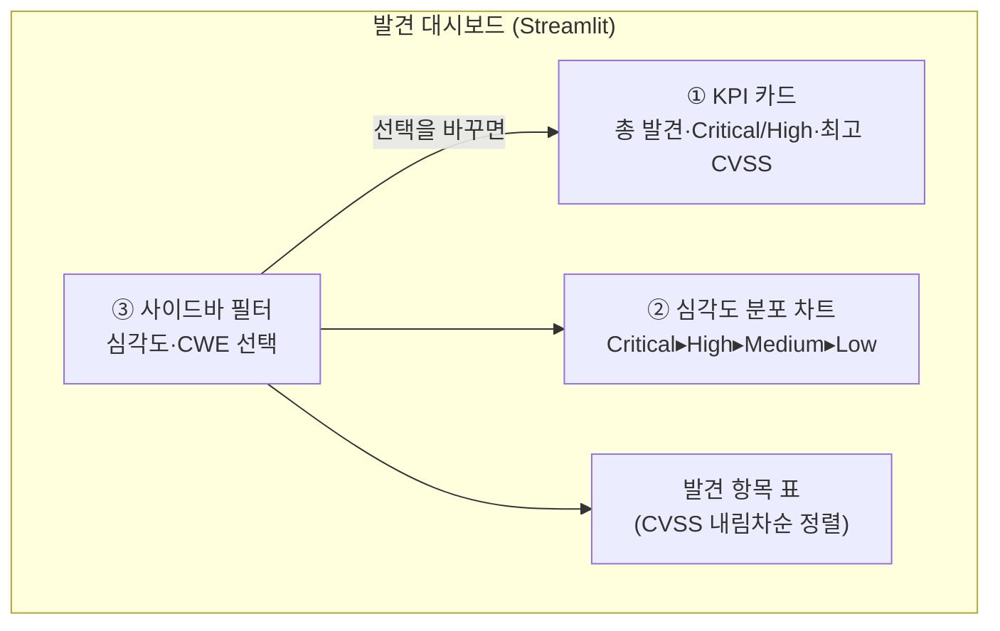

# 심각도 차트와 필터 — 무엇을 먼저 고칠 것인가

24강에서 우리는 스캔 결과를 **표(table)**로 정리했습니다. 발견 항목 한 줄이 표의 한 행이 되고, 거기에 심각도·CWE·CVE·CVSS 컬럼이 붙었습니다. 글자로 쏟아지던 결과가 비로소 "정리된 자료"가 되었습니다.

그런데 표 하나만으로는 부족한 순간이 옵니다. 점검을 한 번 제대로 돌리면 발견 항목이 5개, 10개, 때로는 수십 개가 나옵니다. 이때 표를 위에서 아래로 읽는다고 해서 다음 두 질문에 바로 답할 수 있을까요?

- **"이 사이트, 전체적으로 얼마나 위험한가?"** — Critical이 몇 개고 Low가 몇 개인지, 한눈에 들어오나요?
- **"그래서 무엇부터 손대야 하나?"** — 수십 줄 중 가장 급한 것이 맨 위에 있나요?

표는 "무엇이 있는지"는 보여 주지만, "전체 그림"과 "우선순위"는 잘 보여 주지 못합니다. 이번 강의에서는 표 위에 **차트·필터·정렬**을 얹어, 이 두 질문에 화면이 스스로 답하게 만듭니다.

> **🎯 우리가 지금 왜 이걸 하나요?**  
> 점검의 목적은 "약점을 나열하는 것"이 아니라 **"무엇부터 고칠지 결정하는 것"**입니다. 03강에서 CVSS 점수와 KEV(실제 악용 중인 취약점) 개념을 배운 이유가 바로 이것이었죠. 위험도가 높고 실제로 악용되는 것부터 막아야 합니다. 그런데 그 우선순위가 수십 줄짜리 표 속에 묻혀 있으면 결국 사람이 눈으로 훑으며 골라야 합니다. 차트는 위험 분포를 한눈에 보여 주고, 필터는 "지금 볼 것"만 추려 주며, 정렬은 "가장 위험한 것"을 맨 위로 올려 줍니다. 즉 이번 강의는 **데이터를 "보고용"이자 "의사결정용"으로 바꾸는** 단계입니다.
{: .prompt-info }

이 글에서 다루는 것:

1. 이번에 더할 화면 (전체 그림)
2. 출발점 — 24강의 발견 데이터
3. KPI 요약 카드 (`st.metric`)
4. 심각도 분포 차트 (`st.bar_chart`)
5. 필터 UI — 사이드바에서 추리기
6. 정렬 — 가장 위험한 것을 맨 위로
7. 완성된 `app.py`
8. 점검 인사이트 — 차트·필터는 의사결정 도구

---

## 1. 이번에 더할 화면

24강의 표 위에 세 가지가 더해집니다. 모두 같은 `app.py` 한 파일에 이어 붙입니다.



핵심은 **사이드바 필터가 위쪽 화면 전체(KPI·차트·표)를 동시에 갱신**한다는 점입니다. 23강에서 배운 rerun(재실행)이 여기서 빛을 발합니다. 사이드바에서 위젯을 건드리면 `app.py` 전체가 다시 실행되고, 그 흐름 속에서 필터가 적용된 결과로 화면이 다시 그려집니다.

> **새 점검 로직은 하나도 만들지 않습니다.** 24강에서 만든 발견 데이터(`st.session_state["findings"]`)를 그대로 두고, 그 위에 "보여 주는 방식"만 더합니다. 차트도 필터도 결국 같은 데이터를 다르게 보여 주는 것뿐입니다.
{: .prompt-tip }

---

## 2. 출발점 — 24강의 발견 데이터

24강에서 발견 항목은 **딕셔너리의 리스트** 형태로 `st.session_state["findings"]`에 담겨 있었습니다. 이번 강의를 독립적으로 따라올 수 있도록, 그 구조를 다시 확인합니다. 발견 한 건이 이런 모양입니다.

```python
{
    "name": "SQL Injection (로그인 폼)",
    "severity": "Critical",   # Critical / High / Medium / Low
    "cwe": "CWE-89",
    "cve": "CVE-2021-1234",   # 해당 없으면 "-"
    "cvss": 9.8,              # 0.0 ~ 10.0
    "url": "/login",          # 발견 위치
    "desc": "로그인 폼 id 파라미터에 SQL 구문이 그대로 전달됩니다",  # 한 줄 설명
}
```

24강에서 정한 7개 키(`name`·`severity`·`cwe`·`cve`·`cvss`·`url`·`desc`)를 그대로 씁니다. 이번 강의의 차트·필터는 그중 `severity`·`cwe`·`cvss` 세 키만 더 활용합니다.

화면을 만들기 전에, 손에 잡히는 **예시 데이터**를 먼저 채워 둡니다. (실제로는 14강의 리포트 단계에서 에이전트가 이 리스트를 채웁니다. 지금은 화면을 확인하기 위한 샘플입니다.) `app.py` 위쪽, 24강에서 `findings`를 만들던 자리에 아래처럼 둡니다.

```python
# app.py (윗부분) — 24강에서 만든 발견 데이터
import streamlit as st

# 점검 결과가 아직 없다면 예시 데이터로 채웁니다 (24강과 같은 7개 키)
if "findings" not in st.session_state:
    st.session_state["findings"] = [
        {"name": "SQL Injection (로그인 폼)", "severity": "Critical",
         "cwe": "CWE-89", "cve": "CVE-2021-1234", "cvss": 9.8,
         "url": "/login", "desc": "id 파라미터에 SQL 구문이 그대로 전달됩니다"},
        {"name": "OS Command Injection (ping 기능)", "severity": "Critical",
         "cwe": "CWE-78", "cve": "-", "cvss": 9.1,
         "url": "/diag/ping", "desc": "입력값이 셸 명령에 그대로 이어 붙습니다"},
        {"name": "Reflected XSS (검색창)", "severity": "High",
         "cwe": "CWE-79", "cve": "-", "cvss": 7.4,
         "url": "/search", "desc": "검색어가 이스케이프 없이 출력됩니다"},
        {"name": "Path Traversal (파일 다운로드)", "severity": "High",
         "cwe": "CWE-22", "cve": "CVE-2020-5678", "cvss": 7.1,
         "url": "/download", "desc": "파일 경로에 ../ 가 그대로 허용됩니다"},
        {"name": "디렉터리 목록 노출", "severity": "Medium",
         "cwe": "CWE-548", "cve": "-", "cvss": 5.3,
         "url": "/config/", "desc": "디렉터리 목록이 외부에 노출됩니다"},
        {"name": "보안 헤더 누락 (X-Frame-Options)", "severity": "Low",
         "cwe": "CWE-693", "cve": "-", "cvss": 3.1,
         "url": "/", "desc": "클릭재킹 방어 헤더가 없습니다"},
    ]

findings = st.session_state["findings"]
```

이제 이 `findings` 리스트를 재료로, 위에서부터 차근차근 화면을 만듭니다.

---

## 3. KPI 요약 카드 — 한 줄로 보는 위험 요약

가장 먼저, 화면 맨 위에 **요약 숫자 몇 개**를 큼직하게 보여 줍니다. 표를 읽기 전에 "전체 규모"부터 잡아 주는 것이죠. Streamlit은 이런 요약 숫자를 위해 `st.metric`이라는 카드 모양 함수를 제공합니다.

보여 줄 숫자는 네 가지로 정합니다.

- **총 발견 수** — 이번 점검에서 몇 건이 나왔나
- **Critical 개수** — 가장 급한 것이 몇 개인가
- **High 개수** — 그다음으로 급한 것이 몇 개인가
- **최고 CVSS** — 가장 위험한 한 건의 점수는 얼마인가

`app.py`에 아래를 추가합니다.

```python
st.title("🛡️ 발견 항목 대시보드")  # ← 제목 (이미 있으면 그대로)

# ── KPI 요약 카드 ────────────────────────────  ← 새로 추가
total = len(findings)
critical = sum(1 for f in findings if f["severity"] == "Critical")
high = sum(1 for f in findings if f["severity"] == "High")
max_cvss = max((f["cvss"] for f in findings), default=0.0)

c1, c2, c3, c4 = st.columns(4)          # 카드 4개를 가로로 나란히
c1.metric("총 발견 수", total)
c2.metric("Critical", critical)
c3.metric("High", high)
c4.metric("최고 CVSS", f"{max_cvss:.1f}")
# ─────────────────────────────────────────────
```

여기서 두 가지를 짚습니다.

- `sum(1 for f in findings if 조건)`은 **조건에 맞는 항목의 개수를 세는** 파이썬 관용구입니다. "Critical인 것마다 1을 더한다" = "Critical의 개수"입니다.
- `st.columns(4)`는 화면을 **세로 칸 4개**로 나눕니다. 각 칸(`c1`~`c4`)에 카드를 하나씩 넣으면 가로로 나란히 놓입니다.

저장하면 화면 맨 위에 카드 네 개가 가로로 뜹니다.

```text
┌──────────┬──────────┬──────────┬──────────┐
│ 총 발견 수 │ Critical │   High   │ 최고 CVSS │
│    6     │    2     │    2     │   9.8    │
└──────────┴──────────┴──────────┴──────────┘
```

표를 읽기도 전에 "총 6건, 그중 Critical이 2건, 가장 위험한 건 9.8점"이라는 그림이 한눈에 들어옵니다.

---

## 4. 심각도 분포 차트 — 위험을 그림으로

다음은 **심각도별로 몇 건인지**를 막대 차트로 그립니다. 숫자 카드는 "Critical 2개"처럼 낱개를 알려 주지만, 차트는 **분포의 모양**을 보여 줍니다. "Critical에 쏠려 있는가, Low가 대부분인가"가 그림 한 장으로 드러납니다.

여기서 한 가지 주의할 점이 있습니다. 심각도는 글자(`Critical`, `High`…)라서 그냥 세면 **가나다순(알파벳순)**으로 뒤섞입니다. 우리가 원하는 건 **위험한 순서(Critical ▸ High ▸ Medium ▸ Low)**입니다. 그래서 순서를 직접 지정해 줍니다.

`app.py`에 이어서 추가합니다.

```python
st.subheader("심각도 분포")          # ← 새로 추가

# 우리가 원하는 표시 순서를 명시 (위험한 것부터) — 24강의 공용 상수와 동일
SEVERITY_ORDER = ["Critical", "High", "Medium", "Low"]   # ← 새로 추가

# 심각도별 개수를 순서대로 집계
counts = {sev: 0 for sev in SEVERITY_ORDER}        # ← 새로 추가
for f in findings:                                  # ← 새로 추가
    if f["severity"] in counts:                     # ← 새로 추가
        counts[f["severity"]] += 1                  # ← 새로 추가

st.bar_chart(counts, horizontal=True)               # ← 새로 추가
```

`st.bar_chart`는 딕셔너리(`{"Critical": 2, "High": 2, ...}`)를 받아 막대 차트로 그려 줍니다. `horizontal=True`를 주면 막대가 가로로 누워, 라벨(심각도 이름)이 읽기 편합니다.

저장하면 이런 가로 막대가 나타납니다.

```text
심각도 분포
Critical ████████          2
High     ████████          2
Medium   ████              1
Low      ████              1
```

> **색으로 위험을 강조하고 싶다면?**  
> `st.bar_chart`는 `color` 옵션으로 막대 색을 지정할 수 있습니다. 다만 심각도별로 **서로 다른 색(Critical=빨강, High=주황…)**을 칠하려면 데이터를 표 형태(DataFrame)로 바꿔 색 컬럼을 따로 줘야 해서 코드가 길어집니다. 지금은 **순서(위험한 것이 맨 위)**만으로도 충분히 우선순위가 전달됩니다. 색상 강조는 보고서를 꾸밀 때(27강 리포트 단계) 다듬으면 됩니다. 관례적으로 Critical은 빨강, High는 주황, Medium은 노랑, Low는 초록으로 표현한다는 점만 기억해 둡니다.
{: .prompt-tip }

---

## 5. 필터 UI — 사이드바에서 추리기

발견이 수십 개가 되면 "지금은 Critical/High만 보고 싶다", "SQL 인젝션 계열(CWE-89)만 보고 싶다" 같은 요구가 생깁니다. 이때 필요한 것이 **필터**입니다.

Streamlit은 화면 왼쪽에 **사이드바(`st.sidebar`)**라는 별도 공간을 줍니다. 본문이 어수선해지지 않도록, 필터 위젯은 모두 사이드바에 모읍니다.

```python
st.sidebar.header("🔎 필터")          # ← 새로 추가

# 1) 심각도 다중 선택 (기본값: 전부 선택)
sel_sev = st.sidebar.multiselect(      # ← 새로 추가
    "심각도",
    options=SEVERITY_ORDER,
    default=SEVERITY_ORDER,            # 처음엔 모두 보이게
)

# 2) CWE 단일 선택 (있는 CWE만 골라서 목록으로)
cwe_options = ["(전체)"] + sorted({f["cwe"] for f in findings})  # ← 새로 추가
sel_cwe = st.sidebar.selectbox("CWE", options=cwe_options)        # ← 새로 추가

# 3) 알려진 CVE가 있는 것만 보기 체크박스
only_cve = st.sidebar.checkbox("알려진 CVE만 보기")               # ← 새로 추가
```

세 가지 위젯을 썼습니다.

- `st.sidebar.multiselect(...)` — **여러 개를 동시에** 고르는 위젯. 심각도처럼 "여러 등급을 같이 보고 싶은" 경우에 맞습니다.
- `st.sidebar.selectbox(...)` — **하나만** 고르는 드롭다운. CWE는 "한 종류만 집중해서 볼 때"가 많아 단일 선택으로 둡니다. 맨 앞에 `(전체)`를 넣어 "고르지 않은 상태"를 표현합니다.
- `st.sidebar.checkbox(...)` — 켜고/끄는 스위치. `cve` 값이 `"-"`가 아닌(=알려진 CVE가 붙은) 발견만 추려 보는 데 씁니다. CVE가 있는 항목은 이미 공개된 취약점이라 공격 코드가 돌아다닐 가능성이 큽니다.

`{f["cwe"] for f in findings}`는 **집합 컴프리헨션**으로, 발견에 등장한 CWE를 중복 없이 모읍니다. 즉 메뉴에는 **실제로 나온 CWE만** 나타납니다.

### 선택을 실제 데이터에 적용하기

위젯은 "사용자가 무엇을 골랐는가"만 알려 줍니다. 이제 그 선택대로 `findings`를 **걸러내야** 합니다. 필터링은 파이썬 **리스트 컴프리헨션** 한 덩어리로 처리합니다.

```python
# 선택된 조건으로 발견 목록을 걸러냅니다  ← 새로 추가
filtered = [
    f for f in findings
    if f["severity"] in sel_sev                       # 심각도 조건
    and (sel_cwe == "(전체)" or f["cwe"] == sel_cwe)   # CWE 조건
    and (not only_cve or f["cve"] != "-")             # 알려진 CVE 조건
]
```

세 조건을 `and`로 묶었습니다. 사이드바에서 무엇을 바꾸든, 23강에서 배운 **rerun** 덕분에 `app.py`가 처음부터 다시 실행되고, 이 컴프리헨션이 **다시 계산**되어 화면이 즉시 갱신됩니다. "필터를 바꾸면 곧바로 반영"되는 것은 바로 이 재실행 흐름 덕분입니다.

> **필터 결과를 KPI·차트에도 반영하려면?**  
> 3·4절에서 KPI와 차트가 `findings`를 쓰던 부분을 `filtered`로 바꾸면, 카드와 차트까지 **필터에 맞춰 함께 움직입니다.** "Critical/High만"으로 좁히면 차트도 그 두 막대만 남습니다. 7절의 완성본은 이렇게 `filtered`를 기준으로 통일해 두었습니다.
{: .prompt-tip }

---

## 6. 정렬 — 가장 위험한 것을 맨 위로

마지막으로, 걸러낸 결과를 **CVSS 점수 내림차순**으로 정렬합니다. 표를 위에서부터 읽으면 자연스럽게 "가장 위험한 것 → 덜 위험한 것" 순서가 되도록 만드는 것입니다.

```python
# CVSS 높은 순으로 정렬 (가장 위험한 것이 맨 위)  ← 새로 추가
filtered_sorted = sorted(filtered, key=lambda f: f["cvss"], reverse=True)

# 표로 보여 주기 (24강에서 만든 표)
if filtered_sorted:
    st.dataframe(filtered_sorted, use_container_width=True)
else:
    st.info("선택한 조건에 맞는 발견이 없습니다. 필터를 넓혀 보세요.")
```

`sorted(..., key=lambda f: f["cvss"], reverse=True)`는 "각 항목의 `cvss` 값을 기준으로, 큰 것이 먼저 오도록(`reverse=True`) 정렬"하라는 뜻입니다. 이렇게 하면 9.8점짜리 SQL 인젝션이 항상 표의 맨 위에 옵니다.

필터를 너무 좁혀 결과가 **0건**이 되는 경우도 챙겼습니다. 빈 표 대신 "조건에 맞는 발견이 없습니다"라고 안내해, 화면이 텅 빈 채로 멈춘 것처럼 보이지 않게 합니다.

---

## 7. 완성된 `app.py`

지금까지 더한 조각을 한 파일로 모으면 다음과 같습니다. (24강의 발견 데이터 위에, 이번 강의의 KPI·차트·필터·정렬을 얹은 형태입니다.)

```python
# app.py — 발견 항목 대시보드 (24강 표 + 25강 차트·필터·정렬)
import streamlit as st

# ── 0) 발견 데이터 (24강과 같은 7개 키) ────────
if "findings" not in st.session_state:
    st.session_state["findings"] = [
        {"name": "SQL Injection (로그인 폼)", "severity": "Critical",
         "cwe": "CWE-89", "cve": "CVE-2021-1234", "cvss": 9.8,
         "url": "/login", "desc": "id 파라미터에 SQL 구문이 그대로 전달됩니다"},
        {"name": "OS Command Injection (ping 기능)", "severity": "Critical",
         "cwe": "CWE-78", "cve": "-", "cvss": 9.1,
         "url": "/diag/ping", "desc": "입력값이 셸 명령에 그대로 이어 붙습니다"},
        {"name": "Reflected XSS (검색창)", "severity": "High",
         "cwe": "CWE-79", "cve": "-", "cvss": 7.4,
         "url": "/search", "desc": "검색어가 이스케이프 없이 출력됩니다"},
        {"name": "Path Traversal (파일 다운로드)", "severity": "High",
         "cwe": "CWE-22", "cve": "CVE-2020-5678", "cvss": 7.1,
         "url": "/download", "desc": "파일 경로에 ../ 가 그대로 허용됩니다"},
        {"name": "디렉터리 목록 노출", "severity": "Medium",
         "cwe": "CWE-548", "cve": "-", "cvss": 5.3,
         "url": "/config/", "desc": "디렉터리 목록이 외부에 노출됩니다"},
        {"name": "보안 헤더 누락 (X-Frame-Options)", "severity": "Low",
         "cwe": "CWE-693", "cve": "-", "cvss": 3.1,
         "url": "/", "desc": "클릭재킹 방어 헤더가 없습니다"},
    ]
findings = st.session_state["findings"]

SEVERITY_ORDER = ["Critical", "High", "Medium", "Low"]

st.title("🛡️ 발견 항목 대시보드")

# ── 1) 사이드바 필터 ──────────────────────────
st.sidebar.header("🔎 필터")
sel_sev = st.sidebar.multiselect("심각도", options=SEVERITY_ORDER, default=SEVERITY_ORDER)
cwe_options = ["(전체)"] + sorted({f["cwe"] for f in findings})
sel_cwe = st.sidebar.selectbox("CWE", options=cwe_options)
only_cve = st.sidebar.checkbox("알려진 CVE만 보기")

# ── 2) 필터 적용 (리스트 컴프리헨션) ───────────
filtered = [
    f for f in findings
    if f["severity"] in sel_sev
    and (sel_cwe == "(전체)" or f["cwe"] == sel_cwe)
    and (not only_cve or f["cve"] != "-")
]

# ── 3) KPI 요약 카드 (필터 결과 기준) ──────────
total = len(filtered)
critical = sum(1 for f in filtered if f["severity"] == "Critical")
high = sum(1 for f in filtered if f["severity"] == "High")
max_cvss = max((f["cvss"] for f in filtered), default=0.0)

c1, c2, c3, c4 = st.columns(4)
c1.metric("총 발견 수", total)
c2.metric("Critical", critical)
c3.metric("High", high)
c4.metric("최고 CVSS", f"{max_cvss:.1f}")

# ── 4) 심각도 분포 차트 (필터 결과 기준) ───────
st.subheader("심각도 분포")
counts = {sev: 0 for sev in SEVERITY_ORDER}
for f in filtered:
    if f["severity"] in counts:
        counts[f["severity"]] += 1
st.bar_chart(counts, horizontal=True)

# ── 5) 정렬 + 표 (CVSS 내림차순) ───────────────
st.subheader("발견 항목")
filtered_sorted = sorted(filtered, key=lambda f: f["cvss"], reverse=True)
if filtered_sorted:
    st.dataframe(filtered_sorted, use_container_width=True)
else:
    st.info("선택한 조건에 맞는 발견이 없습니다. 필터를 넓혀 보세요.")
```

실행은 늘 하던 대로입니다.

```bash
streamlit run app.py
```

브라우저에서 직접 해 보면 흐름이 한눈에 들어옵니다.

1. 처음엔 6건이 모두 보이고, KPI 카드와 차트가 전체 분포를 보여 줍니다.
2. 왼쪽 사이드바에서 심각도를 **Critical, High만** 남기면 → 카드·차트·표가 동시에 4건으로 줄어듭니다.
3. **"알려진 CVE만 보기"**를 켜면 → CVE 번호가 붙은 2건(SQL 인젝션 9.8, Path Traversal 7.1)만 남습니다.
4. 표는 항상 CVSS 높은 순이라, **가장 먼저 고쳐야 할 것이 늘 맨 위**에 있습니다.

---

## 8. 점검 인사이트 — 차트·필터는 의사결정 도구

이번에 만든 것을 "화면을 예쁘게 꾸민 것"으로만 보면 핵심을 놓칩니다. 차트와 필터의 진짜 역할은 두 가지입니다.

**첫째, 보고용입니다.** 점검 결과를 받는 사람(개발자·관리자·경영진)은 표 수십 줄을 읽을 시간이 없습니다. "Critical 2건, 최고 9.8점"이라는 KPI 카드 한 줄과 막대 차트 하나면 "이 사이트가 지금 얼마나 위험한지"가 즉시 전달됩니다.

**둘째, 의사결정용입니다.** 여기서 03강에서 배운 원칙이 다시 등장합니다.

> **모든 약점을 동시에 고칠 수는 없습니다. 우선순위는 명확합니다.**  
> ① **알려진 CVE(공개된 취약점)**부터 — 공격 코드가 이미 돌아다닐 수 있는 구멍입니다. (03강의 KEV, 즉 "실제 악용 중" 목록과도 직결됩니다.)  
> ② 그다음 **CVSS가 높은 것**부터 — 뚫렸을 때 피해가 큰 구멍입니다.  
> 우리가 만든 필터("알려진 CVE만 보기")와 정렬("CVSS 내림차순")은 이 원칙을 **화면 조작 한 번으로** 실행하게 해 줍니다.
{: .prompt-warning }

즉 "알려진 CVE만 보기"를 켜고 CVSS 순으로 정렬된 맨 윗줄을 보는 것이, 곧 **"제일 먼저 막아야 할 한 건"을 찾는 행동**입니다. 03강에서 개념으로 배운 우선순위가, 이제 클릭 한 번으로 작동하는 화면이 된 것입니다.

> 표는 "무엇이 있는가"를, 차트는 "전체가 어떤가"를, 필터·정렬은 "무엇부터 할 것인가"를 답합니다. 같은 데이터라도 **어떻게 보여 주느냐**가 결정의 질을 바꿉니다.
{: .prompt-info }

---

## 다음 강의 예고

다음 **26강**에서는 점검(발견) 대시보드를 넘어, **관제 대시보드**를 만듭니다. 5~7부에서 만든 탐지/관제 루프의 결과 — 탐지 이벤트, Triage(분류) 결과, 대응 이력 — 를 화면에 올립니다. 이번 강의에서 익힌 KPI·차트·필터 기법을 그대로 가져와, **공격 탐지 → 분류 → 대응**의 흐름을 한 화면에서 보는 것이 목표입니다.

발견을 "정리"했고(24강), "우선순위"를 화면으로 드러냈습니다(이번 강의). 다음은 "실시간으로 들어오는 공격을 화면으로 지켜보는" 단계입니다.

---

## 참고 자료

- Streamlit 차트(`st.bar_chart`) — <https://docs.streamlit.io/develop/api-reference/charts>
- Streamlit `st.metric` — <https://docs.streamlit.io/develop/api-reference/data/st.metric>
- Streamlit `st.sidebar` — <https://docs.streamlit.io/develop/api-reference/layout/st.sidebar>
- FIRST — CVSS — <https://www.first.org/cvss/>
- CISA — Known Exploited Vulnerabilities Catalog (KEV) — <https://www.cisa.gov/known-exploited-vulnerabilities-catalog>
