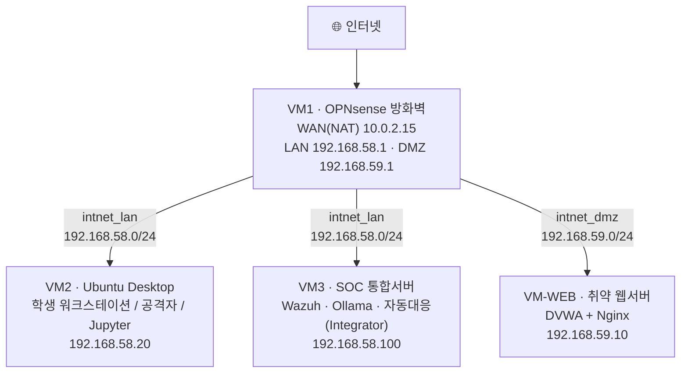

# 보안관제 실습 — 가상머신 첫걸음 및 실습용 PC 준비

> **이 강의 시리즈는 컴퓨터 비전공자**가 **아무것도 없는 상태(zero)에서** 직접 손으로 따라 하며
> "공격 → 탐지 → AI 분석 → 자동 차단"이 작동하는 **나만의 작은 보안관제센터(SOC)**를 완성하는 것을 목표로 합니다.
> 모든 프로그램은 **무료 오픈소스**이며, 강사가 미리 만들어 둔 파일에 의존하지 않고 **여러분이 처음부터 직접 설치**합니다.
{: .prompt-info }

---

## 0. 이번 강의 한눈에

- **지난 강의 도달 상태**: (첫 강의)
- **오늘의 목표**: 가상화 개념 이해 → VirtualBox 설치 → 첫 번째 가상머신(**VM2 · Ubuntu Desktop**) 직접 설치
- **오늘 켜는 VM**: VM2 (1대만)
- **사용 IP**: 아직 네트워크 미구성(29강에서 연결). 오늘은 인터넷(NAT)만 사용

---

## 1. 오늘의 이론: 가상머신(VM)이란 무엇일까요?

우리가 쓰는 노트북에는 보통 **윈도우(Windows)** 하나의 운영체제(OS)만 깔려 있습니다. 그런데 보안관제 실습을 하려면 **방화벽, 공격자 PC, 웹 서버, 관제 서버**처럼 여러 대의 컴퓨터가 동시에 필요합니다. 이걸 다 사려면 비용이 엄청나겠죠.

이 문제를 해결하는 기술이 **가상화(Virtualization)** 입니다.

- **가상머신(Virtual Machine, VM)**: 내 컴퓨터의 CPU·메모리(RAM)·디스크 자원을 조금씩 떼어내 만든 **'소프트웨어로 된 가짜 컴퓨터'**. 한 대의 노트북 안에 여러 대의 컴퓨터를 만들 수 있습니다.
- **하이퍼바이저(Hypervisor)**: 가상머신을 만들고 실행해 주는 관리 프로그램. 이 실습에서는 무료 오픈소스인 **Oracle VM VirtualBox**를 사용합니다.

> **비유**: 노트북 = 큰 건물, 가상머신 = 그 안에 칸막이로 나눈 여러 개의 방. 각 방은 서로 독립적으로 동작합니다.
{: .prompt-tip }

---

## 2. 우리가 8주 동안 만들 전체 실습 환경 (★ 모든 강의의 기준표 ★)

아래 표와 그림은 **이 시리즈 전체에서 변하지 않는 약속**입니다. 앞으로 모든 강의에서 IP·계정·역할은 이 표를 그대로 따릅니다. **헷갈릴 때마다 이 페이지로 돌아오세요.**

### 2.1 전체 구성도

### 2.2 VM 역할 / 사양 (16GB 호스트 기준)

| VM | 이름 | 역할 | OS | RAM | 디스크 |
|---|---|---|---|---|---|
| **VM1** | `OPNsense-FW` | 방화벽 / 게이트웨이 (망 분리) | OPNsense | 1024 MB | 20 GB |
| **VM2** | `Ubuntu-Workstation` | 학생이 직접 조작하는 PC + 공격자 + Jupyter | Ubuntu **Desktop** 22.04 | 4096 MB | 40 GB |
| **VM3** | `SOC-Server` | 관제 서버 (Wazuh + Ollama + 자동대응 Integrator) | Ubuntu **Server** 22.04 | 6144 MB | 50 GB |
| **VM-WEB** | `Web-DMZ` | 외부에 노출되는 취약 웹서버 | Ubuntu **Server** 22.04 | 1536 MB | 20 GB |

> **16GB 메모리 최적화 안내**: 4대를 항상 동시에 켤 필요는 없습니다. 강의마다 "오늘 켜는 VM"만 켜세요. 가장 부담이 큰 7~35강에서는 다른 프로그램(웹 브라우저 외)·다른 VM을 모두 끄고 진행합니다.
{: .prompt-warning }

### 2.3 네트워크 / IP 약속

| 구역 | VirtualBox 설정 | 대역 | 게이트웨이 |
|---|---|---|---|
| WAN (외부 인터넷) | `NAT` | 10.0.2.0/24 | 10.0.2.2 (VBox 제공) |
| LAN (내부 안전망) | 내부 네트워크 `intnet_lan` | 192.168.58.0/24 | 192.168.58.1 (OPNsense) |
| DMZ (노출 구역) | 내부 네트워크 `intnet_dmz` | 192.168.59.0/24 | 192.168.59.1 (OPNsense) |

| 장비 | 고정 IP |
|---|---|
| OPNsense LAN | 192.168.58.1 |
| OPNsense DMZ | 192.168.59.1 |
| VM2 워크스테이션 | 192.168.58.20 |
| VM3 SOC 서버 | 192.168.58.100 |
| VM-WEB 웹서버 | 192.168.59.10 |

> **대역 배정 규칙 — 다른 과정·집 네트워크와 겹치지 않게**
> 6부는 세그먼트를 두 개(LAN·DMZ) 쓰므로 대역도 두 개가 필요합니다. 아래와 같이 과정별로 나누어 두었습니다.
>
> | 대역 | 용도 |
> |---|---|
> | `192.168.56.0/24` | 리눅스 기초 · 애플리케이션 보안 · 웹 보안 |
> | `192.168.57.0/24` | 이 과정 **1~5부** 랩(`aiweblab`) |
> | **`192.168.58.0/24`** | **6부 LAN(내부 안전망)** |
> | **`192.168.59.0/24`** | **6부 DMZ(노출 구역)** |
> | `192.168.60.0/24` | 네트워크 보안 |
> | `192.168.61.0/24` | 보안시스템 |
> | `192.168.62.0/24` | DevSecOps |
>
> 가정용 공유기가 흔히 쓰는 `192.168.0.x`·`192.168.1.x`를 피했습니다. 특히 OPNsense의 LAN 게이트웨이가 집 공유기와 같은 `192.168.1.1`이면, 관리 화면에 접속했을 때 **어느 장비에 들어간 것인지 혼동**하기 쉽습니다.
{: .prompt-info }

### 2.4 계정(자격증명) 약속

| 시스템 | 주소 | 아이디 | 비밀번호 |
|---|---|---|---|
| Ubuntu (VM2/VM3/VM-WEB 공통) | — | `student` | `student1234` |
| OPNsense 웹관리 | https://192.168.58.1 | `root` | `opnsense123` (설치 중 설정) |
| Wazuh 대시보드 | https://192.168.58.100 | `admin` | (설치 시 자동 생성, 31강에서 메모) |
| OPNsense API (자동차단용) | 192.168.58.1 (key/secret) | — | (34강에서 발급) |

> 위 비밀번호는 **실습 전용**입니다. 실제 운영 환경에서는 절대 이런 단순 비밀번호를 쓰지 않습니다.
{: .prompt-danger }

---

## 3. 따라하기 실습: 호스트 준비 → VirtualBox 설치 → VM2(Ubuntu Desktop) 설치

오늘은 위 그림에서 **VM2 한 대**만 만듭니다. 나머지는 다음 강의에서 한 대씩 늘려갑니다.

### [단계 0] 내 컴퓨터(호스트)가 가상화를 지원하는지 확인하기

1. 키보드에서 `Ctrl + Shift + Esc`를 눌러 **작업 관리자**를 엽니다.
2. **[성능]** 탭 → **[CPU]**를 클릭합니다.
3. 오른쪽 아래 **"가상화: 사용"** 이라고 적혀 있으면 OK입니다.
4. 만약 **"사용 안 함"**이면, PC를 재부팅하면서 BIOS(보통 `F2`/`Del` 키)에 들어가 **`Intel VT-x`** 또는 **`AMD-SVM`** 항목을 **Enabled**로 바꿔야 합니다.

> 📷 **스크린샷 자리**: 작업 관리자 → [성능] → [CPU] 의 "가상화: 사용" 부분. 캡처해 `/assets/img/soc/1-virtualization.png` 로 저장한 뒤 아래 주석을 해제하면 본문에 표시됩니다.
> <!--  -->
{: .prompt-tip }

### [단계 1] VirtualBox 설치하기

1. 웹 브라우저에서 [VirtualBox 공식 홈페이지](https://www.virtualbox.org/)에 접속합니다.
2. **[Download VirtualBox]** → **[Windows hosts]**를 클릭해 설치 파일(`.exe`)을 받습니다.
3. 받은 파일을 실행하고 모든 화면에서 **[Next]**를 눌러 기본값으로 설치합니다. (중간에 네트워크가 잠깐 끊긴다는 경고가 나오면 **[Yes]**)
4. 설치가 끝나면 **Oracle VirtualBox 관리자** 창이 열립니다.

### [단계 2] Ubuntu Desktop 설치 이미지(ISO) 내려받기

1. [Ubuntu 데스크톱 다운로드 페이지](https://ubuntu.com/download/desktop)에 접속합니다.
2. **Ubuntu 22.04 LTS** 의 **[Download]** 버튼을 눌러 `ubuntu-22.04.x-desktop-amd64.iso` 파일을 받습니다. (약 4~5GB, 시간이 걸립니다.) *(최신 LTS인 24.04에서도 동일하게 동작합니다. 본 교재는 검증이 풍부한 22.04 기준으로 설명합니다.)*

> **ISO 파일이란?** 설치 CD/DVD를 하나의 파일로 만든 것입니다. 실제 CD 없이 이 파일만으로 OS를 설치할 수 있습니다.
{: .prompt-tip }

### [단계 3] 가상머신(VM2) 새로 만들기

1. VirtualBox 관리자에서 **[새로 만들기(New)]**를 클릭합니다.
2. 정보를 입력합니다.
   - **이름(Name)**: `Ubuntu-Workstation`
   - **ISO 이미지(ISO Image)**: 방금 받은 `ubuntu-22.04...iso` 선택
   - **[Skip Unattended Installation]** 항목에 **체크**합니다. (자동설치를 끄고 우리가 직접 클릭하며 설치하기 위함)
3. **[다음]** → 하드웨어 설정:
   - **메모리(RAM)**: `4096` MB
   - **프로세서(CPU)**: `2`
4. **[다음]** → 가상 하드디스크:
   - **'지금 새 가상 하드 디스크 만들기'**, 크기 **`40` GB**
5. **[다음] → [완료]**를 눌러 생성합니다.

### [단계 4] Ubuntu 설치 진행하기

1. 목록에서 `Ubuntu-Workstation`을 선택하고 **[시작(Start)]**을 누릅니다.
2. 검은 화면이 지나고 설치 마법사가 뜨면:
   - 언어: **한국어** → **[Ubuntu 설치]**
   - 키보드: 기본값 → **[계속하기]**
   - 업데이트/소프트웨어: **'최소 설치'** 선택, '설치 중 업데이트 다운로드' **체크 해제**(빠른 설치) → **[계속하기]**
   - 설치 형식: **'디스크를 지우고 Ubuntu 설치'** → **[지금 설치]** → **[계속하기]**
     - *(이건 가짜 가상 디스크를 지우는 것이라 내 진짜 노트북 자료는 안전합니다.)*
   - 위치: **Seoul** → **[계속하기]**
3. **사용자 정보 입력 (★ 반드시 아래대로 ★)**:
   - 이름: `student`
   - 컴퓨터 이름: `workstation`
   - 사용자 이름: `student`
   - 암호 / 확인: `student1234`
   - **'로그인할 때 암호 입력'** 선택
4. 설치가 진행됩니다(약 10~20분). 완료되면 **[지금 다시 시작]**을 누릅니다.
5. "설치 미디어를 제거하고 Enter를 누르라"는 메시지가 나오면 그냥 **`Enter`** 를 누릅니다.

### [단계 5] 첫 부팅 및 확인

1. 재부팅 후 로그인 화면에서 `student` 계정에 비밀번호 `student1234`로 로그인합니다.
2. 좌측 메뉴(점 9개 아이콘)에서 **Firefox**를 열고, 아무 웹사이트나 접속해 **인터넷이 되는지** 확인합니다. (지금은 NAT라 인터넷이 됩니다. 29강에서 내부망으로 바꿉니다.)
3. 잘 되면 28강 성공입니다!

---

## 4. 자주 나는 오류 (트러블슈팅)

- **VM이 안 켜지고 "VT-x is not available" 오류**: [단계 0]의 BIOS 가상화 설정을 켜야 합니다.
- **화면이 너무 작음**: 상단 메뉴 **[보기] → [게스트 화면 자동 크기 조정]** 을 켜세요. (Guest Additions가 필요할 수 있습니다.)
- **마우스가 VM에 갇힘**: 오른쪽 `Ctrl` 키를 누르면 마우스가 빠져나옵니다.

---

## 🧰 부록: 리눅스 터미널 30초 기초 (29강부터 사용)

비전공자를 위해 꼭 필요한 것만 정리했습니다. 29강부터 명령을 넣을 때 참고하세요.

- **터미널 열기**: `Ctrl + Alt + T`
- **명령 실행**: 한 줄 입력 후 `Enter`. 여러 줄짜리 블록은 **통째로 복사 → 터미널에 붙여넣기(`Ctrl+Shift+V`) → Enter**.
- **`sudo`**: "관리자 권한으로 실행"이라는 뜻. 비밀번호(`student1234`)를 물으면 **타이핑해도 화면에 글자가 안 보이는 게 정상**입니다. 그대로 치고 Enter.
- **멈춘 것 같을 때**: 설치/다운로드 중일 수 있으니 기다리세요. 프롬프트(`student@...$`)가 다시 나타나면 완료된 것입니다.
- **이 교재의 모든 명령은 "복사해서 붙여넣기"용**입니다. 직접 타이핑하지 말고 복붙하세요(오타 방지).

---

## 5. 핵심 요약

- **가상머신(VM)**은 내 컴퓨터 안에 만든 독립된 가짜 컴퓨터이고, **VirtualBox**는 이를 관리하는 무료 도구입니다.
- 우리는 8주에 걸쳐 **VM1(방화벽)·VM2(워크스테이션)·VM3(관제서버)·VM-WEB(웹서버)** 4대를 직접 만들어 작은 SOC를 완성합니다.
- **2.2~2.4의 IP·계정 표가 전 강의의 기준**이므로 반드시 기억하세요.

## 💾 안전망: 스냅샷 찍기 (꼭!)

이 강의를 마쳤으면 VirtualBox에서 해당 VM을 **전원 끄고** 우클릭 → **[스냅샷] → [찍기]** 로 현재 상태를 저장하세요. 다음 강의에서 실수하거나 막히면 **[복원]**으로 지금으로 되돌릴 수 있습니다. 강사가 제공하는 **"정답 스냅샷" 또는 `.ova` 파일**을 가져오면, 이 강의 결과부터 **바로 다음 강의로** 이어서 진행할 수 있습니다. (한 번의 실패가 전체 실습을 막지 않습니다.)

---

## 6. 다음 강의 예고

29강에서는 **OPNsense 방화벽(VM1)**을 직접 설치하고, 오늘 만든 VM2를 **안전한 내부망(LAN, 192.168.58.0/24)**으로 옮겨 연결합니다.
