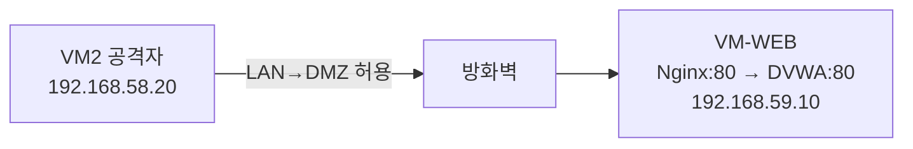

# 보안관제 실습 — 나만의 웹 서비스 띄우고 해커 공격 맛보기

---

## 0. 이번 강의 한눈에

- **지난 강의 도달 상태**: 방화벽(VM1) 구축, VM2가 LAN(192.168.58.20)에서 인터넷·방화벽 접속 가능
- **오늘의 목표**: **DMZ에 취약 웹서버 VM-WEB(192.168.59.10)**을 직접 만들고, **DVWA**를 띄운 뒤 VM2에서 첫 **SQL Injection** 공격 체험
- **오늘 켜는 VM**: VM1 + VM2 + **VM-WEB(신규)**
- **오늘 완성되는 연결**: `VM2(192.168.58.20) — [방화벽] — VM-WEB(192.168.59.10) 웹서비스`



---

## 1. 오늘의 이론: SQL Injection(SQL 삽입) 공격이란?

로그인할 때 우리가 넣은 아이디·비밀번호는 **데이터베이스(DB)**라는 창고에서 **SQL**이라는 언어로 조회됩니다. 예:

```sql
SELECT * FROM users WHERE email = '입력한이메일' AND password = '입력한비번';
```

"이메일·비번이 둘 다 맞는 회원을 찾아줘"라는 뜻입니다. 그런데 해커가 이메일 칸에 **특수한 SQL 기호**를 끼워 넣으면, 이 문장의 의미가 통째로 바뀝니다. 이것이 **SQL Injection**입니다. 비밀번호를 몰라도 로그인하거나, 회원 정보를 통째로 빼낼 수 있습니다.

> **왜 DMZ에 두나?** 웹서버는 외부 공격에 가장 많이 노출됩니다. 그래서 29강에서 만든 **DMZ(노출 구역)**에 둡니다. 뚫려도 LAN의 관제서버로는 못 넘어가도록 방화벽이 막아줍니다.
{: .prompt-tip }

---

## 2. 따라하기 실습 ① : 취약 웹서버 VM-WEB 만들기

### [단계 1] Ubuntu Server ISO 받기 & VM 생성

1. 호스트 브라우저에서 [Ubuntu Server 다운로드](https://ubuntu.com/download/server)로 가서 **Ubuntu Server 22.04 LTS** ISO를 받습니다. (데스크톱과 달리 화면이 없는 가벼운 서버용 OS입니다.)
2. VirtualBox **[새로 만들기]**:
   - 이름 `Web-DMZ`, ISO = 방금 받은 server iso, **[Skip Unattended Installation] 체크**
   - 메모리 **`1536` MB**, CPU **1**, 디스크 **`20` GB**
3. 생성 후 **[설정] → [네트워크] → [어댑터 1]**:
   - 다음에 연결: **`내부 네트워크`** → 이름 **`intnet_dmz`** *(DMZ에 두는 게 핵심!)*

### [단계 2] Ubuntu Server 설치

1. `Web-DMZ` 시작 → 텍스트 기반 설치 마법사가 뜹니다. (`Tab`/방향키/`Enter`로 이동, 마우스 안 됨)
   - Language: English → Installer update: **Continue without updating**
   - Keyboard: 기본 → Done
   - Network: 아직 자동(DHCP)으로 두고 → **Done** *(고정 IP는 설치 후 설정)*
   - Proxy/Mirror: 비워두고 Done
   - Storage: **Use an entire disk** → Done → **Continue** (확인창)
2. Profile setup (★ 28강 2.4 표대로 ★):
   - Your name: `student` / server's name: **`web-dmz`** / username: `student` / password: `student1234`
3. **[X] Install OpenSSH server** 에 **Space로 체크** → Done *(나중에 원격 접속 편의)*
4. Featured snaps: 아무것도 고르지 말고 Done
5. 설치 완료 후 **Reboot Now**. ISO 제거 후 Enter. 로그인 프롬프트가 뜨면 `student`/`student1234`로 로그인.

### [단계 3] VM-WEB에 고정 IP(192.168.59.10) 부여

서버는 화면 메뉴가 없으니 설정 파일로 IP를 고정합니다. (Netplan)

**아래 한 덩어리를 그대로 복사해 붙여넣으세요.** 카드 이름·설정 파일명을 자동으로 찾아 IP를 고정합니다. (직접 타이핑·들여쓰기 편집이 전혀 필요 없습니다.)

```bash
IFACE=$(ls /sys/class/net | grep -v lo | head -n1)
sudo rm -f /etc/netplan/00-installer-config.yaml /etc/netplan/50-cloud-init.yaml
sudo tee /etc/netplan/99-soc.yaml > /dev/null <<EOF
network:
  version: 2
  ethernets:
    $IFACE:
      dhcp4: false
      addresses: [192.168.59.10/24]
      routes:
        - to: default
          via: 192.168.59.1
      nameservers:
        addresses: [192.168.59.1, 8.8.8.8]
EOF
sudo chmod 600 /etc/netplan/99-soc.yaml
sudo netplan apply
```

**명령어 상세 설명** (위 한 덩어리가 하는 일을 한 줄씩)
- `IFACE=$(ls /sys/class/net | grep -v lo | head -n1)` : 네트워크 카드 이름을 **자동으로 알아내** `IFACE` 변수에 저장합니다. `ls /sys/class/net`은 카드 목록을 나열하고, `grep -v lo`는 그중 가상 루프백(`lo`)을 제외하며, `head -n1`은 맨 첫 번째(우리 유선 카드)만 고릅니다. → 카드 이름이 PC마다 달라도(`enp0s3` 등) 그대로 동작하게 만드는 장치입니다.
- `sudo rm -f /etc/netplan/00-installer-config.yaml /etc/netplan/50-cloud-init.yaml` : 설치 과정에서 자동 생성된 **기존 네트워크 설정 파일을 지웁니다**(`rm`=remove, `-f`=없어도 오류 안 냄). 우리가 만들 새 설정과 충돌하지 않도록 청소하는 단계입니다.
- `sudo tee /etc/netplan/99-soc.yaml > /dev/null <<EOF ... EOF` : `<<EOF`부터 `EOF`까지의 **여러 줄 내용을 그대로 파일로 저장**합니다. `tee 파일명`은 입력을 파일에 쓰는 명령이고, `> /dev/null`은 화면에 중복 출력되는 것만 버린다는 뜻입니다. 저장되는 내용은 "이 카드(`$IFACE`)에 DHCP를 끄고(`dhcp4: false`) 고정 IP `192.168.59.10/24`를 주며, 기본 통로(게이트웨이)는 방화벽 `192.168.59.1`, 이름풀이(DNS)는 `192.168.59.1`과 구글 `8.8.8.8`을 쓴다"는 설정표입니다.
- `sudo chmod 600 /etc/netplan/99-soc.yaml` : 설정 파일의 **권한을 소유자만 읽기·쓰기(600)**로 좁힙니다. Netplan은 이 파일이 너무 개방돼 있으면 경고를 내므로 미리 잠그는 것입니다.
- `sudo netplan apply` : 위에서 만든 설정을 **실제 네트워크에 즉시 반영**합니다. 이 순간부터 VM-WEB의 IP가 `192.168.59.10`으로 고정됩니다.

적용이 잘 됐는지 아래 세 명령으로 확인합니다.

```bash
ip addr | grep 192.168.59.10
```
```bash
ping -c 3 192.168.59.1
```
```bash
ping -c 3 8.8.8.8
```

**명령어 상세 설명**
- `ip addr | grep 192.168.59.10` : 전체 네트워크 정보(`ip addr`) 중 우리가 준 IP가 들어간 줄만 **걸러서(`grep`)** 보여줍니다. 한 줄이라도 출력되면 고정 IP가 정상 적용된 것입니다.
- `ping -c 3 192.168.59.1` : DMZ 게이트웨이인 **방화벽까지 신호가 닿는지** 3번 확인합니다. 응답이 오면 VM-WEB이 `intnet_dmz`망에 올바로 연결된 것입니다.
- `ping -c 3 8.8.8.8` : 방화벽을 거쳐 **인터넷까지 나가는지** 확인합니다. 성공하면 29강에서 만든 **'DMZ→인터넷 허용' 규칙**이 작동하는 것이고, 다음 단계(Docker 이미지 다운로드)가 가능해집니다.

> 인터넷이 안 되면 29강 [단계 9]의 **DMZ→인터넷 허용 규칙**이 적용됐는지 확인하세요.
{: .prompt-warning }

---

## 3. 따라하기 실습 ② : Docker + DVWA + Nginx 띄우기

### [단계 4] Docker 설치

```bash
sudo apt update
sudo apt install -y docker.io
sudo systemctl enable --now docker
sudo usermod -aG docker student
```

**명령어 상세 설명**
- `sudo apt update` : 우분투의 **설치 가능한 프로그램 목록을 최신으로 갱신**합니다. (`apt`=우분투 프로그램 관리자) 새 프로그램을 깔기 전에 항상 먼저 실행하는 준비 단계입니다.
- `sudo apt install -y docker.io` : **Docker(도커)**를 설치합니다. Docker는 프로그램을 '컨테이너'라는 상자에 통째로 담아 실행하는 도구로, 복잡한 웹앱을 명령 한 줄로 띄울 수 있게 해 줍니다. `-y`는 설치 도중 "계속할까요?" 물음에 **자동으로 yes** 답하는 옵션입니다.
- `sudo systemctl enable --now docker` : Docker 서비스를 **지금 즉시 켜고(`--now`)**, **부팅할 때도 자동으로 켜지도록(`enable`)** 등록합니다. (`systemctl`=서비스 켜고 끄는 관리 명령)
- `sudo usermod -aG docker student` : `student` 계정을 **`docker` 그룹에 추가(`-aG`)**합니다. 이렇게 하면 앞으로 docker 명령을 쓸 때마다 `sudo`를 붙이지 않아도 됩니다. (단, 그룹 변경은 **재로그인해야** 적용됩니다 — 그래서 바로 아래에서 로그아웃합니다.)

변경한 그룹 권한을 적용하기 위해 한 번 로그아웃 후 다시 로그인합니다.
```bash
exit
```
다시 `student` / `student1234` 로 로그인한 뒤, 설치가 됐는지 확인합니다.
```bash
docker --version
```
- `exit` : 현재 로그인 세션을 **끝냅니다**(로그아웃). 다시 로그인하면 방금 추가한 docker 그룹 권한이 살아납니다.
- `docker --version` : 설치된 Docker의 **버전 번호를 출력**합니다. 버전이 보이면 설치 성공이고, `sudo` 없이 실행됐다면 그룹 권한도 정상 적용된 것입니다.

### [단계 5] 취약 웹앱 DVWA 실행

```bash
docker run -d --restart=always --name dvwa -p 127.0.0.1:8080:80 vulnerables/web-dvwa
```

**명령어 상세 설명** — 이 한 줄이 인터넷에서 취약 웹앱 이미지를 받아 즉시 실행합니다.
- `docker run` : 컨테이너(상자에 담긴 프로그램)를 **내려받아 실행**하는 명령입니다.
- `-d` : **백그라운드(detached) 실행**. 터미널을 점유하지 않고 뒤에서 조용히 돌게 합니다. (이게 없으면 터미널이 컨테이너 로그에 묶여 멈춘 것처럼 보입니다.)
- `--restart=always` : 컨테이너가 꺼지거나 **VM을 재부팅해도 자동으로 다시 시작**하도록 합니다. 실습 중 매번 손으로 켜지 않아도 됩니다.
- `--name dvwa` : 이 컨테이너에 **`dvwa`라는 이름표**를 붙입니다. 나중에 `docker ps`, `docker logs dvwa`처럼 이름으로 다루기 위함입니다.
- `-p 127.0.0.1:8080:80` : **포트 연결**입니다. `호스트:8080 → 컨테이너:80`으로 이어 주되, 앞에 `127.0.0.1`을 붙여 **이 PC 내부(localhost)에서만** 접근되게 막습니다. DVWA는 컨테이너 안에서 80번 포트(Apache)로 동작하는데, 이를 호스트의 8080번에 묶고, 외부에는 곧 세울 **Nginx를 거쳐서만** 노출합니다(로그를 남기기 위한 구조).
- `vulnerables/web-dvwa` : 실행할 **이미지 이름**입니다. **DVWA(Damn Vulnerable Web Application)**는 SQL Injection·XSS·명령삽입 등을 실습하도록 의도적으로 취약하게 만든 대표적 학습용 웹앱으로, Apache·PHP·MySQL이 한 컨테이너에 모두 들어 있습니다. 처음 실행 시 인터넷에서 자동으로 내려받습니다.

> **왜 DVWA인가?** 이 시리즈의 다른 과정(웹 보안·AI 자동화 실습)도 모두 DVWA를 대상으로 합니다. 같은 앱을 쓰면 한 번 익힌 공격 기법을 그대로 재사용할 수 있습니다.
{: .prompt-tip }

### [단계 6] Nginx 리버스 프록시 설치 (★ 접근 로그가 4·32강 탐지의 재료 ★)

웹 공격을 관제(Wazuh)가 탐지하려면 **누가 어떤 URL로 들어왔는지 기록(접근 로그)**이 필요합니다. DVWA 앞에 **Nginx**를 세워 80번 포트로 받고, 모든 요청을 로그로 남깁니다.

```bash
sudo apt install -y nginx
sudo tee /etc/nginx/sites-available/dvwa > /dev/null <<'EOF'
server {
    listen 80;
    server_name _;
    access_log /var/log/nginx/access.log;
    location / {
        proxy_pass http://127.0.0.1:8080;
        proxy_set_header Host $host;
        proxy_set_header X-Real-IP $remote_addr;
    }
}
EOF
sudo ln -sf /etc/nginx/sites-available/dvwa /etc/nginx/sites-enabled/dvwa
sudo rm -f /etc/nginx/sites-enabled/default
sudo nginx -t && sudo systemctl restart nginx
```

**명령어 상세 설명** — DVWA 앞에 '문지기' Nginx를 세워 80번 포트로 받고 모든 요청을 로그로 남깁니다.
- `sudo apt install -y nginx` : 웹 서버이자 **리버스 프록시(요청 중계기)**인 Nginx를 설치합니다. 여기서 Nginx의 역할은 외부의 80번 포트 요청을 받아 내부 DVWA(8080번)로 **넘겨주면서 접근 기록을 남기는 것**입니다.
- `sudo tee /etc/nginx/sites-available/dvwa <<'EOF' ... EOF` : `<<'EOF'`부터 `EOF`까지의 **사이트 설정 파일을 생성**합니다. 내용의 의미는 다음과 같습니다.
  - `listen 80;` : 외부에서 들어오는 **80번 포트(웹 기본 포트)**를 받습니다.
  - `access_log /var/log/nginx/access.log;` : **모든 접속 요청을 이 로그 파일에 기록**합니다. ← 4·32강에서 Wazuh가 감시할 **공격 탐지의 재료**가 바로 이 파일입니다.
  - `proxy_pass http://127.0.0.1:8080;` : 받은 요청을 내부의 **DVWA(앞 단계에서 묶은 8080번)로 전달**합니다.
  - `proxy_set_header X-Real-IP $remote_addr;` : 전달할 때 **진짜 공격자 IP(`192.168.58.20`)를 헤더에 실어** 함께 넘깁니다. 이게 있어야 로그·경보에 실제 출발지 IP가 남습니다.
- `sudo ln -sf .../sites-available/dvwa .../sites-enabled/dvwa` : 방금 만든 설정을 **'활성화' 폴더에 연결(`ln -s`=바로가기 생성)**합니다. Nginx는 `sites-enabled`에 있는 설정만 실제로 적용합니다.
- `sudo rm -f /etc/nginx/sites-enabled/default` : 기본으로 깔려 있는 **샘플 사이트 설정을 제거**합니다. 그래야 80번 포트가 우리 DVWA 설정과 충돌하지 않습니다.
- `sudo nginx -t && sudo systemctl restart nginx` : `nginx -t`로 **설정 문법에 오류가 없는지 먼저 검사**하고, 통과하면(`&&`) Nginx를 **재시작**해 변경을 적용합니다. (`&&`는 "앞 명령이 성공할 때만 뒤 명령 실행")

이제 웹서버 준비 완료입니다. (이 로그 파일 `/var/log/nginx/access.log`을 31강에서 Wazuh 센서가 감시하게 됩니다.)

---

## 4. 따라하기 실습 ③ : VM2에서 첫 해킹 시도

### [단계 7] DVWA 초기 설정 (DB 생성 → 로그인 → 보안레벨 Low)

DVWA는 처음 한 번 **데이터베이스를 만들고 로그인**해야 취약점 페이지를 쓸 수 있습니다.

1. **VM2(Ubuntu Desktop)**에서 Firefox를 열고 주소창에 **`http://192.168.59.10/setup.php`** 입력. *(LAN→DMZ가 허용돼 있으니 접속됩니다.)*
2. 페이지 맨 아래 **[Create / Reset Database]** 버튼 클릭 → DB가 생성되고 잠시 후 **로그인 화면**으로 넘어갑니다.
3. 로그인합니다 — 아이디 **`admin`** / 비밀번호 **`password`** (DVWA 기본 계정).
4. 좌측 메뉴 맨 아래 **[DVWA Security]** 클릭 → 보안 수준을 **`Low`** 로 선택 → **[Submit]**.
   - 이렇게 하면 브라우저에 **`security=low` 쿠키**가 저장되어, 가장 단순한(필터 없는) 취약 상태로 실습할 수 있습니다.

> 📷 **스크린샷 자리**: DVWA 로그인 후 좌측 메뉴와 "DVWA Security = Low" 설정 화면. `/assets/img/soc/3-dvwa-login.png` 로 저장 후 아래 주석 해제.
> <!--  -->
{: .prompt-tip }

### [단계 8] 공격 A — SQL Injection으로 회원 정보 빼내기

1. 좌측 메뉴 **[SQL Injection]** 클릭. (주소: `http://192.168.59.10/vulnerabilities/sqli/`)
2. **User ID** 입력칸에 아래를 **정확히** 입력(따옴표 주의) → **[Submit]**:
   ```text
   1' OR '1'='1
   ```
3. 원래는 ID 하나만 조회되어야 하는데, **모든 회원(admin, gordonb, 1337, pablo, smithy …)**이 한꺼번에 출력됩니다. 비밀번호를 몰라도 DB 내용을 통째로 본 것입니다.

#### 왜 뚫릴까?
입력값이 SQL 문장에 그대로 끼어들어 의미가 바뀝니다.
```sql
SELECT first_name, last_name FROM users WHERE user_id = '1' OR '1'='1';
```
- `OR '1'='1'` → 항상 **참**이라 `user_id` 조건이 무력화되어 **모든 행**이 반환됩니다.
→ "데이터"여야 할 입력이 "명령"의 일부로 해석된 것이 SQL Injection의 본질입니다.

### [단계 9] 공격 B — UNION으로 비밀번호 탈취 (4·32강 탐지 실습용)

DVWA의 SQLi 페이지는 **GET 방식**이라, 공격 구문이 **주소(URL)에 그대로 실려** Nginx 로그에 또렷이 남습니다. 32강에서 이 흔적을 관제로 탐지할 것입니다.

1. User ID 입력칸에 아래를 입력하고 **[Submit]** (또는 주소창에 직접 입력해도 됩니다):
   ```text
   1' UNION SELECT user, password FROM users-- -
   ```
2. 화면에 **사용자명과 비밀번호 해시(MD5)**가 줄줄이 출력됩니다. `UNION SELECT`로 다른 테이블(`users`)의 비밀번호 컬럼을 끌어온 것입니다.
3. 이때 VM-WEB의 로그에는 다음과 같은 줄이 남습니다(서버에서 확인 가능):
   ```bash
   sudo tail -n 5 /var/log/nginx/access.log
   ```
   - `tail` : 파일의 **맨 끝부분만** 보여주는 명령입니다. (`-n 5`=마지막 5줄) 로그는 계속 쌓이므로, 방금 보낸 공격이 들어간 **최신 줄**을 빠르게 확인할 때 씁니다.
   - 출력 예시: `192.168.58.20 ... "GET /vulnerabilities/sqli/?id=1' UNION SELECT user, password FROM users-- -&Submit=Submit HTTP/1.1" ...` *(브라우저가 보내면 `'`는 `%27`, 공백은 `+`처럼 인코딩되어 기록됩니다.)*

   → 공격자 IP가 **VM2의 192.168.58.20**으로, 공격 구문(`UNION SELECT … FROM users`)이 **URL에 그대로** 또렷이 기록됩니다. 이 흔적이 다음 강의 탐지의 재료입니다.

---

## 5. 자주 나는 오류

- **VM2에서 `192.168.59.10` 접속 안 됨**: VM-WEB 어댑터가 `intnet_dmz`인지, 29강의 **LAN→DMZ 허용(기본 LAN 규칙)**이 있는지 확인.
- **`docker: permission denied`**: [단계 4]의 `usermod -aG docker` 후 **재로그인**을 안 한 경우. 다시 로그인하세요.
- **Nginx `502 Bad Gateway`**: DVWA 컨테이너가 아직 부팅 중(10~20초)이거나 꺼진 경우. `docker ps`로 `dvwa`가 Up인지 확인.
- **취약점 페이지가 `login.php`로 튕김**: 로그인이 풀린 경우입니다. [단계 7]대로 다시 로그인하고 보안레벨을 `Low`로 맞추세요.
- **`setup.php`에서 DB 오류**: [Create / Reset Database]를 한 번 더 누르세요. 그래도 안 되면 `docker restart dvwa` 후 재시도.

---

## 6. 핵심 요약

- 취약 웹서버를 **DMZ(192.168.59.10)**에 직접 구축하고, **Docker(DVWA) + Nginx(접근 로그)** 구조로 띄웠습니다.
- **SQL Injection**은 입력창에 SQL 기호를 주입해 데이터를 탈취/우회하는 공격이며, DVWA의 GET 방식 SQLi는 공격 구문이 **URL에 그대로 남습니다**.
- Nginx 접근 로그에 남은 공격 흔적(공격자 IP=192.168.58.20)이 **다음 강의 탐지 실습의 재료**입니다.

## 💾 안전망: 스냅샷 찍기 (꼭!)

`Web-DMZ` VM을 **전원 끄고** 우클릭 → **[스냅샷] → [찍기]**. Docker·Nginx까지 설치된 상태를 저장해 두면, 다음 강의에서 문제가 생겨도 강사 제공 **"정답 스냅샷"**으로 이 시점부터 이어갈 수 있습니다.

---

## 7. 다음 강의 예고

31강에서는 **관제 서버 VM3(192.168.58.100)**에 **Wazuh(SIEM)**를 직접 설치하고, VM-WEB에 **센서(에이전트)**를 붙여 웹서버 로그를 관제실로 실시간 전송합니다.
