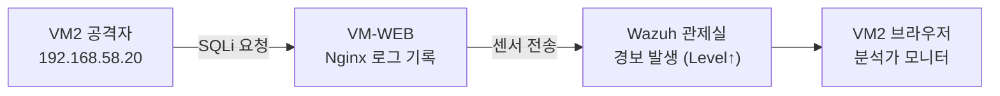

# 보안관제 실습 — 해커의 공격 실시간으로 탐지하고 분석하기

---

## 0. 이번 강의 한눈에

- **지난 강의 도달 상태**: Wazuh 관제실(VM3) 가동, VM-WEB 센서가 Nginx 로그를 관제실로 전송 중
- **오늘의 목표**: VM2에서 웹 공격을 날리고, **관제 화면에 뜬 경보를 분석**해 공격자 IP·공격 구문·위험도를 추적(Alert Triage)
- **오늘 켜는 VM**: VM1 + VM2 + VM-WEB + VM3
- **데이터 흐름**: `VM2 공격(192.168.58.20) → VM-WEB Nginx로그 → 센서 → Wazuh 경보`



---

## 1. 오늘의 이론: 탐지(Detection)와 분류(Triage)

관제실(SIEM)에 로그가 쌓이면, 그 속에서 **"진짜 공격"**을 골라내야 합니다.

- **경보 탐지(Alert Detection)**: 센서가 보낸 로그를 Wazuh가 **탐지 규칙(Rule)**과 대조해, 위반 시 경보등(Alert)을 켜고 **위험도(Level)**를 매깁니다.
- **경보 분석(Triage)**: 분석가가 경보를 보고 **누가(공격자 IP)·무엇을(공격 구문)·어디를(피해 자산)** 했는지 파악해 심각도를 판정합니다.

오늘은 30강에서 본 **검색창 SQL Injection(GET)** 공격을 사용합니다. 이 공격은 URL에 코드가 실려 Nginx 로그에 남고, Wazuh의 **웹 공격 규칙**에 걸려 경보가 뜹니다.

---

## 2. 따라하기 실습 ① : 공격 발사 (VM2)

### [단계 1] 공격 트래픽 만들기

1. **VM2**에서 Firefox를 엽니다.
2. 먼저 **DVWA에 로그인(보안레벨 Low)**되어 있어야 합니다(30강 [단계 7]). 그 상태로 아래 URL들을 주소창에 하나씩 입력하며 여러 번(5~10회) 보냅니다. (경보를 충분히 쌓기 위함)
   ```text
   http://192.168.59.10/vulnerabilities/sqli/?id=1' OR '1'='1&Submit=Submit
   http://192.168.59.10/vulnerabilities/sqli/?id=1' UNION SELECT user,password FROM users-- -&Submit=Submit
   http://192.168.59.10/vulnerabilities/sqli/?id=1' AND 1=2 UNION SELECT null,@@version-- -&Submit=Submit
   ```
   > *UNION 기법은 데이터베이스의 다른 테이블 정보를 훔쳐보려는 전형적 SQL Injection 패턴입니다.*
   > *(브라우저가 자동으로 로그인 쿠키 `PHPSESSID`와 `security=low`를 함께 보내므로, 별도 설정 없이 공격이 전달됩니다.)*

---

## 3. 따라하기 실습 ② : 관제 화면에서 탐지 (VM2 다른 탭)

### [단계 2] 보안 이벤트 화면 열기

1. Firefox **새 탭**에서 Wazuh 대시보드 **`https://192.168.58.100`** 접속(로그인: `admin`).
2. 좌측 **메뉴(☰) → [Threat Hunting]** 또는 **[Security events]** 클릭.
3. 우측 상단 시간 범위를 **`Last 15 minutes`** 로 맞춥니다.
4. 잠시 후 방금 보낸 공격들로 인해 아래 이벤트 목록에 **경보 줄**이 채워집니다.

### [단계 3] 웹 공격만 필터링

1. 상단 검색창(Search bar)을 클릭해 아래를 입력하고 Enter:
   ```text
   rule.groups:web OR rule.groups:attack
   ```
   *(일반 시스템 로그를 숨기고 웹 공격 경보만 골라냅니다.)*
2. SQL Injection 관련 경보들만 깔끔히 걸러집니다.

### [단계 4] 경보 상세 분석 (Alert Triage)

1. 위험도가 높은 경보 줄의 **펼침 화살표(>)**를 눌러 상세 JSON을 엽니다.

   > 📷 **스크린샷 자리**: 경보 상세 JSON에서 `data.srcip`·`rule.description`이 보이는 화면. `/assets/img/soc/5-alert-detail.png` 로 저장 후 아래 주석 해제.
   > <!--  -->
   {: .prompt-tip }

2. 보안 분석가가 챙겨야 할 **핵심 침해지표(IOC)**를 눈으로 찾습니다.

   | 필드 | 의미 | 이번 실습에서의 값(예시) |
   |---|---|---|
   | `rule.description` | 탐지된 공격 이름 | `SQL injection attempt` 류 |
   | `rule.level` | 위험도 지수(높을수록 위험) | `7`~`12` |
   | `rule.id` | 규칙 번호 | `31103`(SQLi) 등 |
   | `data.srcip` | **공격자 IP** | **`192.168.58.20`** (VM2!) |
   | `data.url` | 주입된 공격 구문 | `/vulnerabilities/sqli/?id=1' UNION SELECT user,password...` |
   | `agent.name` | 피해 자산(센서) | `web-dmz` |

3. 정리: **`192.168.58.20`(VM2)** 이(가) **`web-dmz`(VM-WEB)** 에 **SQL Injection**을 시도했고 위험도는 **Level 7~12** 라는 사실을, 사람이 웹서버에 직접 들어가지 않고도 **관제실 한 화면에서** 파악했습니다.

> **연결 확인 포인트**: `data.srcip`가 `192.168.58.20`으로 찍힌다는 것은, 방화벽이 LAN→DMZ 트래픽을 **출발지 IP를 보존한 채** 전달한다는 뜻입니다. 이 IP가 35강에서 **자동 차단 대상**이 됩니다.
{: .prompt-tip }

---

## 4. 자주 나는 오류

- **경보가 안 뜸**: ① VM-WEB 센서가 Active인지(31강), ② `ossec.conf`에 nginx access.log localfile이 있는지, ③ 공격을 **검색창(GET)** 형태로 보냈는지(로그인 폼은 POST라 URL에 안 남음) 확인.
- **`srcip`가 192.168.58.20이 아님**: nginx 설정의 `proxy_set_header X-Real-IP $remote_addr;`(30강)와 LAN↔DMZ 라우팅을 확인.
- **시간이 안 맞아 경보가 안 보임**: 시간 범위를 `Today`로 넓혀 보세요. (VM 시간 동기화 필요할 수 있음)

---

## 5. 핵심 요약

- Wazuh는 **시그니처(규칙) 매칭**으로 공격 패턴을 탐지하고 **위험도(Level)**를 부여합니다.
- 분석가는 **검색·필터 → 상세 로그**로 **공격자 IP(`srcip`)·공격 구문(`url`)·피해 자산(`agent`)**을 추출합니다.
- 이 세 가지가 **침해 보고서 작성과 후속 차단 대응의 출발점**입니다.

## 💾 안전망

32강은 **설정을 바꾸지 않는 분석 실습**이라 새 스냅샷은 필요 없습니다. (1~31강에서 찍어 둔 스냅샷을 그대로 유지하세요.) 막히면 31강 스냅샷으로 복원 후 다시 시도하면 됩니다.

---

## 6. 다음 강의 예고

33강에서는 규칙만으로는 놓치는 변종 공격을 잡기 위해, **AI(머신러닝)**에게 정상/공격 트래픽을 학습시키는 실습을 VM2의 **Jupyter Notebook**으로 진행합니다.
