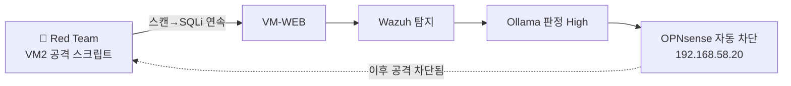
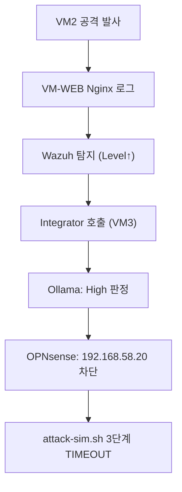

# 보안관제 실습 — 실전 공방 시나리오 테스트 및 나의 관제소 검증

---

## 0. 이번 강의 한눈에

- **지난 강의 도달 상태**: Wazuh→Ollama(AI)→OPNsense 자동 차단 파이프라인 완성
- **오늘의 목표**: **모의 공격(Red Team)**을 발사하고, 우리가 만든 **SOC 파이프라인(Blue Team)**이 탐지→AI판정→자동차단까지 실제로 막아내는지 **최종 검증**
- **오늘 켜는 VM**: VM1 + VM2 + VM3 + VM-WEB (전부)
- **공격자**: VM2 (`192.168.58.20`) / **표적**: VM-WEB (`192.168.59.10`)



---

## 1. 오늘의 이론: MITRE ATT&CK과 공방 검증

방어 체계를 다 만들었다면, 마지막은 **"진짜 막히는가?"**를 직접 공격해 확인하는 일입니다.

- **MITRE ATT&CK**: 전 세계 해커의 공격 기법을 **정찰·침투·수평이동·탈취** 등 단계로 정리한 표준 사전. 모의 공격 시나리오의 뼈대가 됩니다.
- **Red Team(공격)**: 취약점을 찾아 뚫는 모의 해커. 오늘은 VM2의 공격 스크립트.
- **Blue Team(방어)**: SIEM·AI·자동차단으로 막는 방어자. 오늘은 우리가 만든 파이프라인.

> 시작 전, 34강 [단계 9]에서 차단했던 IP가 남아 있다면 OPNsense **Blocked_Attackers** Alias를 **비워** 깨끗한 상태로 시작하세요.
{: .prompt-warning }

---

## 2. 따라하기 실습 ① : 모의 침투(Red Team) 스크립트 작성·발사

복잡한 도구 없이, 실제 공격 단계를 흉내 내는 작은 스크립트를 VM2에서 직접 만듭니다.

### [단계 1] 공격 스크립트 작성 (VM2)

```bash
nano ~/attack-sim.sh
```
```bash
#!/usr/bin/env bash
TARGET="http://192.168.59.10"
JAR=$(mktemp)   # 로그인 쿠키(세션)를 저장할 임시 파일

echo "[*] 0. 로그인: DVWA 세션 획득 (admin/password)"
# (1) 로그인 페이지에서 CSRF 토큰과 세션 쿠키를 받는다
TOKEN=$(curl -s -c "$JAR" "$TARGET/login.php" | grep -oP "user_token' value='\K[0-9a-f]+")
# (2) 토큰을 실어 로그인 POST → 세션이 '인증됨' 상태가 된다
curl -s -b "$JAR" -c "$JAR" -o /dev/null \
  --data "username=admin&password=password&Login=Login&user_token=$TOKEN" \
  "$TARGET/login.php"

echo "[*] 1. 정찰: 서비스/경로 스캔"
for p in / /login.php /setup.php /vulnerabilities/sqli/; do
  curl -s -b "$JAR" -b "security=low" -o /dev/null -w "  $p -> %{http_code}\n" "$TARGET$p"
done

echo "[*] 2. 침투: SQL Injection 연속 시도"
for q in "1' OR '1'='1" "1' UNION SELECT user,password FROM users-- -" "1' AND 1=2 UNION SELECT null,@@version-- -"; do
  code=$(curl -s -b "$JAR" -b "security=low" -o /dev/null -w "%{http_code}" \
    --get --data-urlencode "id=$q" --data-urlencode "Submit=Submit" \
    "$TARGET/vulnerabilities/sqli/")
  echo "  inject id=$q -> $code"
  sleep 1
done

echo "[*] 3. 차단 여부 확인 (자동 방어가 작동하면 여기서 막힘)"
for i in 1 2 3 4 5; do
  code=$(curl -s -o /dev/null -m 3 -w "%{http_code}" "$TARGET/" || echo "TIMEOUT")
  echo "  try #$i -> $code"
  sleep 3
done

rm -f "$JAR"   # 임시 쿠키 파일 정리
```

**스크립트 상세 설명** — 실제 해커의 공격 순서(로그인 → 정찰 → 침투 → 결과 확인)를 흉내 내는 자동 공격기입니다. DVWA 취약점 페이지는 **로그인이 필요**하므로, 맨 앞에서 세션을 먼저 얻는 것이 핵심입니다.
- `nano ~/attack-sim.sh` : 텍스트 편집기 **nano**로 새 스크립트 파일을 엽니다. 위 내용을 붙여넣고 `Ctrl+O`(저장) → `Enter` → `Ctrl+X`(닫기).
- `#!/usr/bin/env bash` : 이 파일을 **bash 셸로 실행**하라는 표시(맨 첫 줄 약속).
- `TARGET="http://192.168.59.10"` : 공격 대상(웹서버) 주소를 변수에 저장해 아래에서 재사용합니다.
- `JAR=$(mktemp)` : **로그인 쿠키(세션)를 보관할 임시 파일**을 하나 만들어 그 경로를 `JAR`에 저장합니다. curl이 이 파일에 쿠키를 쓰고(`-c`) 읽습니다(`-b`).
- **0단계 로그인** — DVWA는 로그인 폼에 **CSRF 토큰(`user_token`)**을 요구하므로 두 번에 나눠 처리합니다.
  - `TOKEN=$(curl -s -c "$JAR" "$TARGET/login.php" | grep -oP "user_token' value='\K[0-9a-f]+")` : 로그인 페이지를 받아(`-c "$JAR"`로 세션 쿠키 저장) HTML 속 숨은 토큰 값만 **뽑아냅니다**. (`grep -oP ... \K`=일치한 부분 중 토큰 값만 출력)
  - 이어지는 `curl ... --data "username=admin&password=password&Login=Login&user_token=$TOKEN" "$TARGET/login.php"` : 받은 토큰과 함께 **로그인 정보를 전송(POST)**합니다. 성공하면 `JAR`의 세션이 **'인증됨' 상태**가 됩니다.
- **1단계 정찰** `for p in / /login.php /setup.php /vulnerabilities/sqli/; do curl ...; done` : DVWA의 주요 경로를 **하나씩 돌며**(`for` 반복문) 접속해 응답 코드(200=있음 등)를 확인합니다. 매 요청에 `-b "$JAR" -b "security=low"`를 붙여 **로그인 세션 + 보안레벨 Low 쿠키**를 함께 보냅니다.
- **2단계 침투** `for q in "1' OR '1'='1" "1' UNION SELECT user,password FROM users-- -" ...; do ...; done` : 여러 SQL Injection 구문을 **차례로** SQLi 페이지에 실어 보냅니다.
  - `--get --data-urlencode "id=$q" --data-urlencode "Submit=Submit"` : 공격 구문을 **안전하게 URL 인코딩(`%27` 등)**해서 `GET /vulnerabilities/sqli/?id=...&Submit=Submit` 형태로 보냅니다. (`--get`=인코딩한 데이터를 GET 쿼리로 붙임) → 공격 구문이 URL에 남아 **Wazuh 경보 → AI 판정 → 차단**을 유발합니다.
  - `sleep 1` : 한 번 보낼 때마다 1초 쉬어 경보가 또렷이 쌓이게 합니다.
- **3단계 차단 확인** `for i in 1 2 3 4 5; do curl ... -m 3 ... || echo "TIMEOUT"; sleep 3; done` : 같은 주소에 5번 접속을 시도합니다. `-m 3`은 **3초 안에 응답이 없으면 포기**하라는 시간제한이고, 실패하면(`||`) `TIMEOUT`을 출력합니다. 자동 방어가 우리 IP를 차단한 순간부터 여기서 **응답이 끊깁니다(`000`/`TIMEOUT`)**.
- `rm -f "$JAR"` : 다 쓴 **임시 쿠키 파일을 지웁니다**(뒷정리).

### [단계 2] 공격 발사

```bash
chmod +x ~/attack-sim.sh
./attack-sim.sh
```

**명령어 상세 설명**
- `chmod +x ~/attack-sim.sh` : 방금 만든 스크립트 파일에 **실행 권한(`+x`=execute)**을 줍니다. 이게 있어야 파일을 프로그램처럼 돌릴 수 있습니다.
- `./attack-sim.sh` : **현재 폴더(`./`)의 스크립트를 실행**합니다.

결과 읽는 법:
- 1·2단계에서는 응답 코드(200/500 등)가 돌아옵니다.
- 3단계 도중 어느 순간부터 응답이 **`TIMEOUT`** 또는 `000`으로 바뀌면 — 자동 방어가 작동해 우리 공격이 **차단**된 것입니다!

---

## 3. 따라하기 실습 ② : 관제실에서 막는 과정 관찰 (Blue Team)

### [단계 3] Wazuh 탐지 확인 (VM2 다른 탭)

1. `https://192.168.58.100` 대시보드 → **[Security events]**, 시간 `Last 15 minutes`.
2. 검색창에 `rule.groups:web OR rule.groups:attack` 입력.
3. 빨간/주황 경보가 연쇄적으로 올라옵니다. 가장 높은 경보를 펼쳐 **`data.srcip = 192.168.58.20`** 을 확인합니다. (공격자 = VM2)

### [단계 4] AI 자동 분석 & 차단 로그 확인 (VM3)

```bash
sudo tail -n 20 /var/ossec/logs/ai-soc.log
```
- `tail -n 20 파일` : 로그 파일의 **마지막 20줄**을 보여줍니다(`-n 20`). 방금 발사한 공격에 대한 로봇의 최근 처리 기록을 한눈에 확인할 때 씁니다.

다음과 같은 기록이 보입니다.
```text
AI verdict for 192.168.58.20: High - SQL Injection 공격으로 판단, 즉시 차단 권고 ...
BLOCKED 192.168.58.20 via OPNsense
```

### [단계 5] 방화벽 자동 차단 결과 확인 (VM2 브라우저)

1. OPNsense `https://192.168.58.1` → **[Firewall] → [Aliases] → Blocked_Attackers** 편집.
2. 사람이 타이핑하지 않았는데도 공격자 IP **`192.168.58.20`** 이 **자동 등재**되어 있습니다.
3. (선택) **[Firewall] → [Log Files] → [Live View]** 에서 해당 IP가 Block 규칙에 막히는 로그를 확인합니다.

### [단계 6] 종합 — 전체 파이프라인이 동작했는가?


공격 발사 → 탐지 → AI 분석 → 자동 차단 → 공격 무력화까지 **사람의 개입 없이** 이어졌다면, 여러분의 작은 보안관제센터는 완성입니다. 🎉

---

## 4. 관제 결과를 대시보드로 한눈에 보기 (시각화)

지금까지는 경보를 **로그·텍스트**로 확인했습니다. 이제 같은 데이터를 **Wazuh 대시보드의 차트**로 한눈에 봅니다. (추가 설치 없이 31강에서 띄운 대시보드를 그대로 씁니다.)

### [단계 7] 보안 이벤트 대시보드 열기

1. **VM2** Firefox → `https://192.168.58.100` 로그인(`admin`).
2. 좌측 메뉴(☰) → **[Security events]**. 우측 상단 시간 범위를 **`Today`** 로 맞춥니다.
3. 화면 상단에 **차트들이 자동으로** 그려져 있습니다. 방금 공격을 발사했으므로:
   - **Alerts over time(시간별 경보 막대그래프)**: 공격한 시각에 막대가 **솟아오른** 것을 봅니다.
   - **Top 5 agents**: 경보가 어느 자산(`web-dmz`)에서 왔는지.
   - **Top rule groups / Rule level distribution**: 어떤 공격 유형이·어느 위험도가 많은지 비중으로 표시됩니다.

> 차트는 **클릭하면 그 조건으로 필터**됩니다. 예: 막대 하나를 클릭하면 그 시간대 경보만, 위험도 조각을 클릭하면 그 레벨만 골라 봅니다.
{: .prompt-tip }

### [단계 8] 공격자·공격유형 집계로 보기

1. 상단 검색창에 `rule.groups:attack` 입력 → 웹 공격 경보만 필터링.
2. 하단 **Top rule descriptions** 와 **Top srcip** 패널에서, 공격자 **`192.168.58.20`** 이 압도적으로 많은 것을 **시각적으로** 확인합니다. (텍스트 로그를 일일이 읽지 않아도 한눈에 파악)

### [단계 9] MITRE ATT&CK 매트릭스로 보기

1. 좌측 메뉴(☰) → **[MITRE ATT&CK]**.
2. 탐지된 공격이 어느 **전술(Tactic)·기술(Technique)**에 해당하는지 매트릭스/차트로 표시됩니다. 우리가 보낸 SQL Injection이 어떤 공격 단계에 매핑되는지 시각적으로 확인할 수 있습니다.

### [단계 10] 나만의 관제 대시보드 만들기

원하는 차트만 모아 **나만의 관제 화면**을 만들어 저장합니다.

1. 좌측 메뉴(☰) → **[Visualize]** → **[Create visualization]**.
2. 종류 **Pie(원형)** 선택 → 데이터 소스 **`wazuh-alerts-*`** 선택.
3. **Buckets → Add → Split slices → Aggregation: `Terms` → Field: `data.srcip`** → 우측 위 **[Update]** → "공격자 IP Top" 파이가 그려집니다 → **[Save]** (이름: `공격자IP`).
4. 같은 방식으로 몇 개 더 만듭니다.
   - **Vertical Bar(막대)**: X-axis → `Date Histogram`(`timestamp`) → "시간별 경보 추이"
   - **Pie**: Terms `rule.description` → "공격 유형 비중"
   - **Metric(숫자)**: `Count` → "총 경보 수"
5. 좌측 메뉴(☰) → **[Dashboard]** → **[Create]** → **[Add]** 로 방금 저장한 시각화들을 올리고 배치 → **[Save]** 이름 **`나의 SOC`**.

이제 `나의 SOC` 대시보드 하나로 **언제·누가·어떤 공격을 얼마나 했는지**를 차트로 즉시 파악할 수 있습니다.

> 📷 **스크린샷 자리**: 직접 만든 "나의 SOC" 대시보드(공격자 IP 파이 + 시간별 추이). `/assets/img/soc/8-my-dashboard.png` 로 저장 후 아래 주석 해제.
> <!--  -->
{: .prompt-tip }

> **참고**: AI 판정·자동차단 결과(`ai-soc.log`)는 기본적으로 대시보드가 아니라 **텍스트 로그로만** 남습니다(34강·35강 [단계 4]에서 `tail`로 확인). 이 결과까지 같은 대시보드에 띄우려면 그 로그를 Wazuh로 다시 읽어들이는 커스텀 룰이 필요합니다(심화 주제).
{: .prompt-info }

---

## 5. 자주 나는 오류

- **차단이 안 일어남(3단계가 계속 200)**: 34강 [단계 8] `<integration>` 등록과 `wazuh-manager` 재시작, `ai-soc.log` 생성 여부를 먼저 확인.
- **경보는 뜨는데 AI가 High를 안 줌**: 1B 모델이 가끔 보수적입니다. 프롬프트의 "High/Medium/Low" 표기를 확인하거나 공격을 더 강하게(UNION SELECT) 반복하세요.
- **실습 후 인터넷/접속이 막힘**: 본인 IP가 차단 명단에 남아 있을 수 있습니다. `Blocked_Attackers`를 비우고 [Apply].

---

## 6. 핵심 요약

- **MITRE ATT&CK**은 공격 시나리오의 표준 뼈대이며, 모의 공격으로 방어망을 입체 검증합니다.
- 공격 순간 **Wazuh(탐지) → Integrator(VM3) → Ollama(AI 분석) → OPNsense(자동 차단)**가 무인으로 연결되어 공격을 봉쇄합니다.
- 비전공자도 8주 만에 **"모의 공격 → 실시간 탐지 → AI 분석 → 방화벽 자동 차단"**의 자동 관제소를 **처음부터 직접** 구축해냈습니다.

## 💾 안전망: 완성본 스냅샷 보관

모든 검증이 끝났다면 4대 VM을 각각 **[스냅샷] → [찍기]** 로 "완성본"을 보관하세요. 이후 다른 공격을 실험하다 환경이 망가져도 언제든 완성 상태로 복원할 수 있습니다. (강사는 이 완성본을 `.ova`로 내보내 다음 기수 학생에게 안전망으로 배포할 수 있습니다.)

> 실습 직후 본인 IP(192.168.58.20)가 차단 명단에 남아 인터넷·웹 접속이 안 될 수 있습니다. OPNsense **[Firewall] → [Aliases] → Blocked_Attackers**를 비우고 [Apply] 하세요.
{: .prompt-warning }

---

## 7. 더 나아가기 (심화)

- 32GB 이상 PC라면 34강의 경량 자동화를 **Shuffle SOAR**로 교체해 시각적 플레이북을 구성할 수 있습니다.
- VM-WEB 외에 VM2·VM3에도 에이전트를 추가해 **자산 전체**를 관제해 보세요.
- **AI 판정·자동차단 결과까지 대시보드로**: `ai-soc.log`를 Wazuh `localfile`로 다시 읽어들이고 커스텀 룰(`High 판정`→level 10, `BLOCKED`→level 12)을 추가하면, **탐지→AI판정→차단** 전 과정이 `나의 SOC` 대시보드 한 타임라인에 함께 뜹니다.
