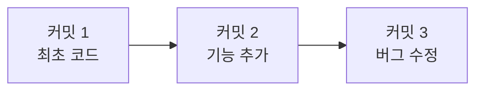
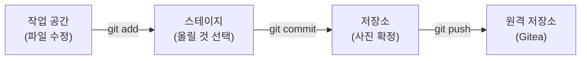
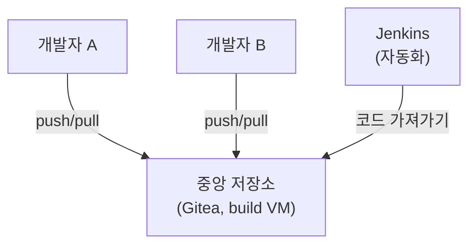
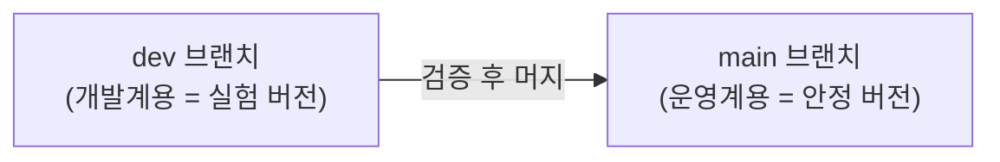

> 이번 글은 **순수 이론**입니다. 다음 글(02-2, 02-3)에서 Gitea를 설치하고 직접 커밋하기 전에, **버전관리가 왜 필요하고 Git이 어떻게 동작하는지** 를 이해합니다.
{: .prompt-info }

## 1. 버전관리란 무엇인가

**버전관리(Version Control)** 는 **파일이 바뀐 이력을 모두 저장해 두는 것** 입니다.

자동화의 출발점은 항상 "코드"입니다. 그런데 코드는 계속 바뀝니다. 이때 흔히 이런 방식을 씁니다.

```
report_final.py
report_final_v2.py
report_final_진짜최종.py
report_final_진짜최종_수정.py
```

이 방식의 문제:

- **어느 게 최신인지** 헷갈립니다.
- **무엇을 왜 바꿨는지** 기록이 없습니다.
- **여럿이 함께** 고치면 서로 덮어써서 파일이 사라집니다.
- **이전으로 되돌리기** 가 어렵습니다.

> 버전관리는 이 모든 문제를 해결합니다. **"누가, 언제, 무엇을, 왜 바꿨는지"** 를 전부 기록하고, 언제든 과거로 되돌릴 수 있게 합니다.
{: .prompt-tip }

---

## 2. Git이란 무엇인가

**Git** 은 세상에서 가장 많이 쓰는 **버전관리 도구** 입니다. (무료·오픈소스)

핵심 아이디어는 **"스냅샷(사진)"** 입니다. 코드를 저장(커밋)할 때마다, Git은 그 순간의 **전체 상태를 사진처럼 찍어** 둡니다.



이 사진들이 시간 순으로 쌓이면서 **타임라인**이 됩니다. 우리는 언제든 과거 사진(커밋)으로 돌아갈 수 있습니다.

### 2.1 꼭 알아야 할 용어

| 용어 | 뜻 | 비유 |
|---|---|---|
| **저장소(Repository, repo)** | 코드와 이력 전체를 담는 공간 | 프로젝트 **서랍장** |
| **커밋(Commit)** | 한 시점의 스냅샷 + 변경 설명 | **사진 한 장** + 메모 |
| **브랜치(Branch)** | 갈라져 나온 평행 작업 줄기 | 나뭇가지 |
| **머지(Merge)** | 갈라진 줄기를 다시 합침 | 가지를 본줄기에 접붙이기 |
| **클론(Clone)** | 원격 저장소를 내 컴퓨터로 복제 | 서랍장 통째로 복사 |
| **푸시(Push)/풀(Pull)** | 내 변경을 올리기 / 남의 변경 받기 | 업로드 / 다운로드 |

---

## 3. Git의 3단계 — 작업 흐름

Git으로 코드를 저장할 때는 **3단계**를 거칩니다. 처음엔 이게 헷갈리지만 자동화의 기본이라 꼭 잡고 갑니다.



| 단계 | 명령 | 비유 |
|---|---|---|
| 1. 작업 공간 | (파일 편집) | 사진 찍을 물건들을 배치 |
| 2. 스테이지에 올리기 | `git add` | 사진에 담을 것만 골라 세움 |
| 3. 커밋 | `git commit` | **찰칵** (사진 확정 + 메모) |
| 4. 푸시 | `git push` | 사진을 공용 앨범(Gitea)에 올림 |

---

## 4. 중앙 저장소 — 왜 Gitea를 쓰나

Git은 내 컴퓨터에서만 써도 되지만, **여럿이 협업**하고 **자동화와 연결**하려면 **모두가 접속하는 중앙 저장소**가 필요합니다.



- **GitHub** 같은 외부 서비스를 쓸 수도 있지만, 우리는 **인터넷 없이 VM 안에서 완결**되도록 **Gitea**(셀프호스팅)를 **build VM**에 직접 설치합니다.
- **Gitea** 는 GitHub과 비슷한 화면을 제공하는 **가볍고 무료인** Git 서버입니다.
- 4회차에서 이 Gitea가 **Jenkins(자동화)** 와 연결되어, "코드를 올리면 자동 빌드"의 출발점이 됩니다.

> 핵심: Gitea는 단순한 코드 보관소가 아니라, **자동화 파이프라인의 입구**입니다. 개발자가 여기에 push하는 순간 모든 자동화가 시작됩니다.
{: .prompt-warning }

---

## 5. 브랜치 전략 — main과 dev

이 과정의 **개발계/운영계** 구분은 Git에서 **브랜치**로 표현됩니다.



| 브랜치 | 의미 | 대응 |
|---|---|---|
| **`dev`** | 실험·개발 중인 코드 | **개발계** 에 자동 배포 |
| **`main`** | 검증 끝난 안정 코드 | **운영계** 에 승인 후 배포 |

작업 흐름은 이렇습니다.

1. `dev` 브랜치에서 자유롭게 개발하고 push → **개발계에 자동 배포**되어 실험
2. 충분히 검증되면 `dev`를 `main`으로 **머지(Pull Request)**
3. `main`이 바뀌면 → **운영계에 승인 후 배포**

> 이 "dev에서 실험 → main으로 승격" 흐름이 10주 내내 자동화의 뼈대가 됩니다. 지금은 개념만 잡고, 02-3 실습에서 직접 브랜치를 만들어 머지해 봅니다.
{: .prompt-tip }

---

## 6. 핵심 정리

| 개념 | 한 줄 요약 |
|---|---|
| 버전관리 | 누가·언제·무엇을·왜 바꿨는지 모두 기록 |
| 커밋 | 한 시점의 스냅샷(사진) + 변경 메모 |
| add → commit → push | 고르고 → 사진 찍고 → 중앙에 올리기 |
| Gitea | VM 안에 두는 무료 중앙 Git 서버 = 자동화 입구 |
| 브랜치 | dev(개발계 실험) / main(운영계 안정) |

다음 글 **02-2** 에서 build VM에 Gitea를 설치하고, 첫 저장소를 만들어 커밋·푸시해 봅니다.
