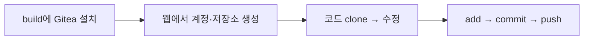

> 이번 글은 **직접 따라 하는 실습**입니다. **build VM**에 Gitea(중앙 Git 서버)를 설치하고, 첫 저장소를 만들어 코드를 커밋·푸시합니다.
{: .prompt-info }

## 0. 이번 실습의 목표



대상 VM: **build (192.168.62.10)**. 01-3에서 켜 둔 상태로 진행합니다.

---

## 1. Git 사용자 정보 설정 (build VM)

먼저 커밋에 기록될 내 이름·이메일을 등록합니다.

```bash
git config --global user.name "devops"
git config --global user.email "devops@lab.local"
```

> 이 정보는 "이 사진(커밋)을 누가 찍었는지" 서명으로 남습니다.
{: .prompt-tip }

---

## 2. Gitea 설치 (build VM)

Gitea는 **실행 파일 하나** 로 동작하는 가벼운 Git 서버입니다. 전용 사용자와 폴더를 만들고 설치합니다.

### 2.1 Git과 전용 사용자 준비

```bash
sudo apt update && sudo apt -y install git
# Gitea 전용 시스템 계정 생성
sudo adduser --system --shell /bin/bash --group --disabled-password --home /home/git git
```

### 2.2 Gitea 실행 파일 내려받기

```bash
# 최신 1.x 안정판 (예: 1.22.3) — 숫자는 공식 사이트 기준으로 바꿔도 됨
GITEA_VERSION=1.22.3
sudo wget -O /usr/local/bin/gitea \
  https://dl.gitea.com/gitea/${GITEA_VERSION}/gitea-${GITEA_VERSION}-linux-amd64
sudo chmod +x /usr/local/bin/gitea
gitea --version
```

`Gitea version 1.22.3 ...` 가 출력되면 성공입니다.

### 2.3 폴더와 권한 준비

```bash
sudo mkdir -p /var/lib/gitea/{custom,data,log}
sudo chown -R git:git /var/lib/gitea/
sudo chmod -R 750 /var/lib/gitea/
sudo mkdir /etc/gitea
sudo chown root:git /etc/gitea
sudo chmod 770 /etc/gitea
```

### 2.4 systemd 서비스로 등록 (자동 시작)

```bash
sudo nano /etc/systemd/system/gitea.service
```

아래 내용을 붙여넣고 저장합니다.

```ini
[Unit]
Description=Gitea
After=network.target

[Service]
RestartSec=2s
Type=simple
User=git
Group=git
WorkingDirectory=/var/lib/gitea/
ExecStart=/usr/local/bin/gitea web --config /etc/gitea/app.ini
Restart=always
Environment=USER=git HOME=/home/git GITEA_WORK_DIR=/var/lib/gitea

[Install]
WantedBy=multi-user.target
```

서비스를 시작합니다.

```bash
sudo systemctl daemon-reload
sudo systemctl enable --now gitea
sudo systemctl status gitea --no-pager
```

`active (running)` 이 보이면 Gitea가 떴습니다. 기본 포트는 **3000** 입니다.

> `systemd`로 등록하면 VM을 재부팅해도 Gitea가 **자동으로 다시 켜집니다.** 이 개념은 05회차 배포에서 다시 씁니다.
{: .prompt-tip }

---

## 3. 웹 브라우저로 초기 설정

호스트(윈도우) 브라우저에서 **build의 주소:3000** 으로 접속합니다.

```
http://192.168.62.10:3000
```

> 접속이 안 되면: build VM의 방화벽을 확인하세요. `sudo ufw status` 가 active면 `sudo ufw allow 3000/tcp` 로 포트를 엽니다.
{: .prompt-warning }

첫 화면에서 **초기 설정(Initial Configuration)** 을 진행합니다. 대부분 기본값을 쓰되 아래만 확인합니다.

| 항목 | 값 |
|---|---|
| 데이터베이스 | **SQLite3** (가장 간단, 실습용) |
| 서버 도메인 | `192.168.62.10` |
| Gitea 기본 URL | `http://192.168.62.10:3000/` |
| SSH 서버 도메인 | `192.168.62.10` |

맨 아래 **"관리자 계정 설정"** 을 펼쳐 첫 관리자를 만듭니다.

| 항목 | 값 |
|---|---|
| 관리자 사용자명 | `devops` |
| 비밀번호 | `devops123` |
| 이메일 | `devops@lab.local` |

**"Gitea 설치하기"** 를 누르면 잠시 뒤 로그인 화면이 나옵니다. `devops`/`devops123` 로 로그인합니다.

---

## 4. 첫 저장소 만들기

1. 우측 상단 **+ → 새 저장소(New Repository)**
2. 저장소 이름: **`myapp`**
3. 가시성: 비공개(Private) 체크 해제(공개로 둬도 실습엔 무방)
4. **"저장소 초기화"** 체크 (README 자동 생성) → **저장소 만들기**

이제 `http://192.168.62.10:3000/devops/myapp` 저장소가 생겼습니다.

---

## 5. 저장소 복제(clone)와 첫 커밋

다시 **build VM 터미널** 로 돌아옵니다. 방금 만든 저장소를 내 작업 폴더로 복제합니다.

```bash
cd ~
git clone http://192.168.62.10:3000/devops/myapp.git
cd myapp
```

> 사용자명·비밀번호를 물으면 `devops` / `devops123` 을 입력합니다.
{: .prompt-tip }

파일을 하나 만들어 봅니다.

```bash
echo "print('Hello DevOps')" > hello.py
```

이제 **3단계**(add → commit → push)를 직접 해 봅니다.

```bash
git status                      # 무엇이 바뀌었는지 확인
git add hello.py                # 1) 스테이지에 올리기
git commit -m "hello.py 추가"   # 2) 사진 찍기(커밋)
git push origin main            # 3) 중앙(Gitea)에 올리기
```

푸시할 때 `devops`/`devops123` 을 입력합니다.

---

## 6. 결과 확인

브라우저에서 저장소를 새로고침하면 **`hello.py`** 파일과 방금 적은 커밋 메시지가 보입니다.


이력 보기:

```bash
git log --oneline
```

방금 만든 커밋이 한 줄로 보이면 성공입니다.

---

## 7. 체크포인트

| 항목 | 확인 | 기대 결과 |
|---|---|---|
| Gitea 동작 | `systemctl is-active gitea` | active |
| 웹 접속 | 브라우저 `:3000` | 로그인 화면 |
| 저장소 | Gitea 웹에 `myapp` | 존재 |
| 커밋 | `git log --oneline` | 커밋 1개 이상 |
| 푸시 반영 | 웹에 `hello.py` | 보임 |

---

## 8. 스냅샷

Gitea 설치가 끝난 깨끗한 상태를 스냅샷으로 저장해 둡니다. build VM에 대해 VirtualBox에서 스냅샷 **`02-gitea`** 를 찍습니다.

다음 글 **02-3** 에서 브랜치를 만들고 `dev`→`main` 머지(Pull Request)를 직접 해 봅니다.
