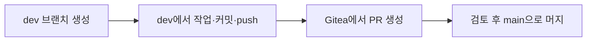
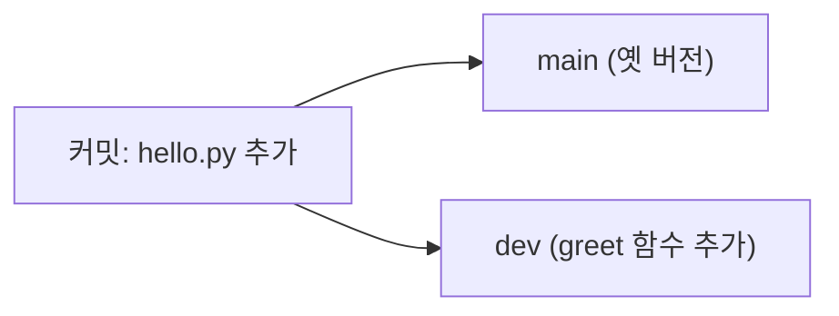
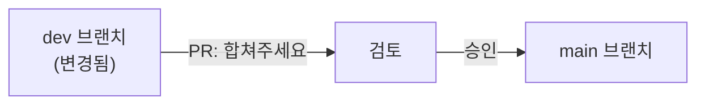
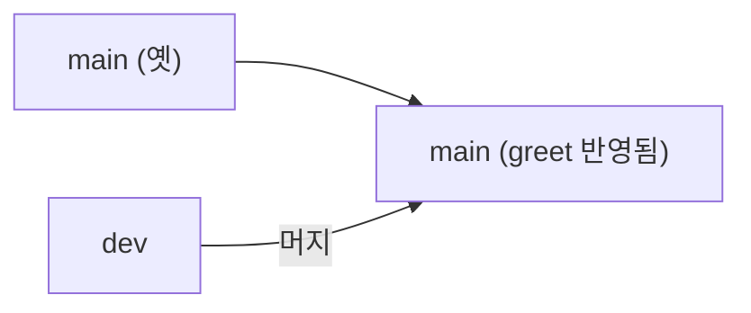

> 이번 글은 **직접 따라 하는 실습**입니다. `dev` 브랜치에서 작업하고 `main`으로 **Pull Request(PR)** 를 통해 머지하는, 실무의 기본 흐름을 익힙니다.
{: .prompt-info }

## 0. 이번 실습의 목표



이 흐름이 곧 **"개발계(dev)에서 실험 → 운영계(main)로 승격"** 의 기초입니다. 대상: **build VM**, 저장소: `myapp`(02-2에서 생성).

---

## 1. 현재 브랜치 확인

build VM에서 `myapp` 폴더로 이동해 현재 상태를 봅니다.

```bash
cd ~/myapp
git branch          # 현재 브랜치 목록 (지금은 main 하나)
git log --oneline   # 지금까지의 커밋
```

`* main` 만 보입니다. 여기서 갈라져 나갈 것입니다.

---

## 2. dev 브랜치 만들기

```bash
git switch -c dev     # dev 브랜치를 만들고 그쪽으로 이동
git branch            # 이제 dev, main 두 개. * dev 가 현재 위치
```

> `switch -c` 는 "브랜치를 새로 만들고(create) 그리로 이동"하는 명령입니다. 나뭇가지를 하나 새로 틔워 그 위에 올라선 셈입니다.
{: .prompt-tip }

---

## 3. dev에서 작업하고 커밋·푸시

`hello.py`를 조금 고쳐 봅니다.

```bash
cat > hello.py <<'EOF'
def greet(name):
    return f"Hello, {name}!"

if __name__ == "__main__":
    print(greet("DevOps"))
EOF
```

3단계로 커밋하고, **dev 브랜치로** 푸시합니다.

```bash
git add hello.py
git commit -m "greet 함수 추가 (dev에서 작업)"
git push origin dev
```

> 처음 `dev`를 push하면 Gitea에 `dev` 브랜치가 새로 생깁니다. `main`은 아직 옛 버전 그대로입니다 — 두 가지(평행 줄기)가 갈라진 상태입니다.
{: .prompt-info }

---

## 4. 두 브랜치가 갈라진 모습



브라우저에서 저장소 → **브랜치(Branches)** 메뉴를 보면 `main`과 `dev` 두 개가 있고, 각자 다른 최신 커밋을 가리킵니다.

---

## 5. Pull Request(PR) 만들기

**Pull Request** 는 "내 dev 작업을 main에 합쳐 달라"는 **공식 요청** 입니다. 합치기 전에 **검토(리뷰)** 하는 단계가 핵심입니다.

1. 브라우저에서 `myapp` 저장소 → 상단 **풀 리퀘스트(Pull Requests)** → **새 풀 리퀘스트**
2. 비교 방향 확인: **`main` ← `dev`** (dev의 변경을 main으로)
3. 변경 내용(diff)에서 `greet` 함수가 추가된 것을 확인
4. 제목: "greet 함수 추가" → **풀 리퀘스트 생성**



> 실무에서는 이 단계에서 **동료가 코드를 리뷰**하고, 자동화(CI)가 **테스트를 돌립니다.** 4회차에서 바로 이 PR에 Jenkins 자동 테스트를 연결할 것입니다.
{: .prompt-warning }

---

## 6. 머지(Merge)

검토가 끝났다고 보고, PR 화면에서 **"풀 리퀘스트 병합(Merge)"** 버튼을 누릅니다. 이제 `dev`의 변경이 `main`에 합쳐졌습니다.

build VM 터미널에서 최신 main을 받아 확인합니다.

```bash
git switch main         # main으로 이동
git pull origin main    # 합쳐진 최신 내용 받기
cat hello.py            # greet 함수가 main에도 반영됐는지 확인
```

`greet` 함수가 보이면 머지 성공입니다.



---

## 7. 실행해 보기

```bash
python3 hello.py
```

```
Hello, DevOps!
```

코드가 정상 동작합니다. 지금까지 한 일은 **"dev에서 실험 → 검토 → main으로 승격"** — 운영계 배포의 축소판입니다.

---

## 8. 체크포인트

| 항목 | 확인 | 기대 결과 |
|---|---|---|
| 브랜치 생성 | `git branch` | main, dev 존재 |
| dev 푸시 | Gitea 브랜치 메뉴 | dev 보임 |
| PR | Gitea 풀 리퀘스트 | 병합 완료 |
| main 반영 | `cat hello.py` | greet 함수 있음 |
| 실행 | `python3 hello.py` | Hello, DevOps! |

---

## 9. 2주차 정리

| 개념 | 한 일 |
|---|---|
| Gitea | build VM에 중앙 Git 서버 구축 |
| 커밋·푸시 | 코드 변경을 기록하고 중앙에 올림 |
| 브랜치 | dev(실험) / main(안정) 분리 |
| PR·머지 | 검토 후 dev→main 승격 |

이제 **자동화의 입구(Gitea)** 와 **승격 흐름(dev→main)** 이 준비됐습니다. 다음 **03회차** 에서는 실제로 배포할 **파이썬 앱**을 만들고, **pytest 테스트**를 붙여 "빌드"의 기초를 닦습니다.
