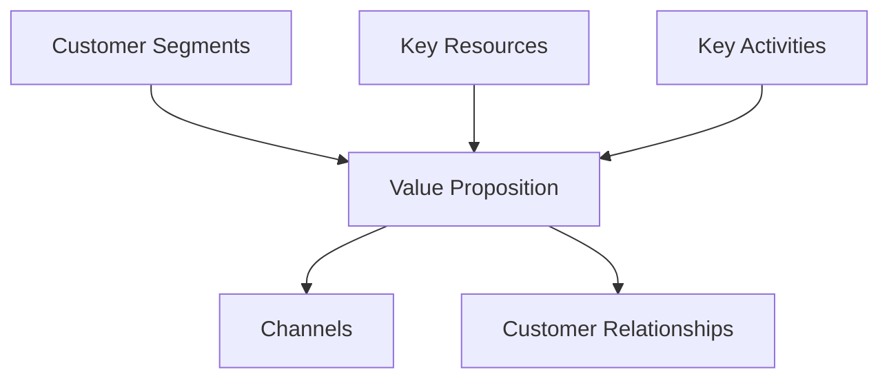
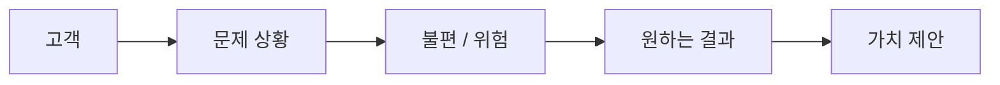

# 10부. Value Proposition - 왜 이 프로젝트가 필요한가
---
## 1. Value Proposition이란?

Value Proposition은 고객이 "왜 이걸 써야 하지?"에 대한 답임.

여기서 중요한 점은, Value Proposition은 기능 목록이 아니라 **고객이 얻는 가치**를 말한다는 것임.

예를 들어 아래 둘은 다름.

| 표현 | 성격 |
| --- | --- |
| 피싱 메일 예시를 보여준다 | 기능 |
| 학생이 위험한 메일을 더 잘 구분하도록 돕는다 | 가치 |

학생 프로젝트는 기능으로 시작하기 쉽기 때문에, 이 차이를 의식하는 것이 매우 중요함.

---

## 2. 왜 Value Proposition이 중심인가?

BMC에서 Value Proposition은 중심에 가까운 칸으로 이해할 수 있음. 그 이유는 대부분의 다른 칸이 가치 제안과 연결되기 때문임.

- 고객은 누구인가 -> 누구에게 이 가치를 줄 것인가
- 채널은 무엇인가 -> 이 가치를 어디서 전달할 것인가
- 관계는 무엇인가 -> 이 가치를 한 번 줄 것인가, 반복해서 줄 것인가
- 자원과 활동은 무엇인가 -> 이 가치를 만들기 위해 무엇이 필요한가



즉, Value Proposition이 불분명하면 다른 칸도 함께 흔들릴 가능성이 큼.

---

## 3. 기능과 가치의 차이

학생들이 가장 많이 실수하는 부분은 기능을 가치로 착각하는 것임.

### 기능 중심 표현

- AI 분석 기능 제공
- 퀴즈 기능 제공
- 채팅 기능 제공
- 알림 기능 제공

### 가치 중심 표현

- 사용자가 더 빠르게 위험 신호를 인식하도록 돕는다
- 학습자가 실수를 줄이도록 돕는다
- 팀원이 마감일을 놓치지 않게 돕는다
- 정보 접근 시간을 줄여 준다

> ⚠️ **주의**  
> 기능은 "무엇을 하느냐"이고, 가치는 "왜 그게 중요한가"임.
{: .prompt-warning }

---

## 4. 고객 문제에서 가치 제안으로 가는 흐름

가치 제안은 보통 아래 흐름으로 생각하면 쉬움.



예:

- 고객: 이메일을 자주 쓰는 대학생
- 문제 상황: 학교 메일인지 피싱 메일인지 헷갈림
- 불편 / 위험: 잘못 클릭할 수 있음
- 원하는 결과: 위험 신호를 빨리 알아차리고 싶음
- 가치 제안: 학생이 위험한 메일을 더 잘 구분하도록 돕는 학습 서비스

---

## 5. Value Proposition Canvas 관점

Strategyzer의 Value Proposition Canvas는 가치 제안을 좀 더 세분화해서 생각하게 함. 핵심은 아래 세 가지임.

| 질문 | 의미 |
| --- | --- |
| 고객이 하려는 일은 무엇인가? | Jobs |
| 무엇이 불편한가? | Pains |
| 어떤 결과를 원하나? | Gains |

이 틀을 학생식으로 바꾸면 다음과 같음.

- 고객이 무엇을 하려고 하는가?
- 어디서 자주 막히는가?
- 어떤 도움을 받으면 좋아하는가?

예:

| 항목 | 예시 |
| --- | --- |
| Jobs | 학교 메일을 안전하게 확인하고 싶다 |
| Pains | 진짜 공지와 피싱 메일을 구분하기 어렵다 |
| Gains | 위험 신호를 빠르게 알아차리고 싶다 |

---

## 6. 쉽게 쓰는 공식

가치 제안은 아래 공식으로 시작하면 좋음.

```text
[고객]이 [문제 상황]에서 [원하는 결과]를 얻도록 돕는 [서비스/활동]
```

예:

```text
학교 메일을 자주 사용하는 대학생이 피싱 메일의 위험 신호를 더 잘 구분하도록 돕는 학습 서비스
```

이 문장은 화려하지 않아도 되지만, 최소한 다음 세 가지는 보여야 함.

- 고객
- 상황 또는 문제
- 원하는 결과

---

## 7. 좋은 가치 제안과 약한 가치 제안

나쁜 예:

```text
AI 기반 차세대 보안 플랫폼
```

문제점:

- 고객이 안 보임
- 문제 상황이 안 보임
- 가치보다 기술 수식어가 앞섬

좋은 예:

```text
보안 경험이 적은 대학생이 학교 메일의 위험 신호를 쉽게 구분하도록 돕는 학습 서비스
```

장점:

- 고객이 보임
- 문제 상황이 보임
- 가치가 보임

---

## 8. 인용으로 다시 보기

Strategyzer는 비즈니스 모델을 가치 창출, 전달, 획득의 논리라고 설명함.

> “creates, delivers, and captures value”
> 출처: [Strategyzer, Business Model Canvas](https://www.strategyzer.com/library/the-business-model-canvas)

이 표현에서 핵심은 value가 가장 먼저 등장한다는 점임. 학생 프로젝트에서도 가치가 보이지 않으면, 이후 기능과 구현은 설득력을 잃기 쉬움.

---

## 9. 짧은 활동

아래 기능 설명을 가치 제안 문장으로 바꿔 보자.

원래 문장:

```text
사용자가 퀴즈를 풀 수 있는 웹 서비스를 만든다.
```

질문:

1. 누가 쓰는가?
2. 어떤 문제를 해결하는가?
3. 어떤 결과를 주는가?

개선 예시:

```text
보안 지식이 적은 대학생이 피싱 메일의 위험 신호를 반복 학습으로 익히도록 돕는 웹 학습 서비스
```

---

## 10. 마무리

Value Proposition은 프로젝트를 "멋있어 보이게" 만드는 문장이 아니라, **왜 이 프로젝트가 필요한지 설명하는 핵심 문장**임.

다음 장에서는 이 가치를 실제로 어디서 어떻게 전달할지, 즉 Channels와 Customer Relationships를 살펴봄.

