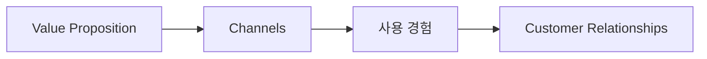

# 11부. Channels와 Customer Relationships
---
## 1. 왜 두 칸을 함께 보는가?

Channels는 "어디서, 어떤 경로로 고객에게 가치를 전달할 것인가"를 묻고, Customer Relationships는 "고객과 어떤 관계를 맺을 것인가"를 묻는 칸임.

이 둘은 함께 생각하는 편이 자연스러움.

- 채널이 정해지면 관계 방식이 달라짐
- 관계 방식이 정해지면 적절한 채널이 달라짐

예를 들어,

- LMS에서 제공하는 학습 서비스는 반복 학습과 피드백 관계를 만들기 쉬움
- 일회성 행사 안내 페이지는 반복 관계보다 정보 전달에 가깝다

---

## 2. Channels란?

Channels는 단순히 "앱이냐 웹이냐"만을 뜻하지 않음.

더 넓게 보면 아래를 포함함.

- 어디서 처음 알게 되는가
- 어디서 실제로 사용하게 되는가
- 어디서 가치를 경험하는가
- 어디서 도움을 받는가

예:

- 웹사이트
- 모바일 앱
- 학교 LMS
- 학교 포털
- 이메일 공지
- 오프라인 안내

---

## 3. Customer Relationships란?

Customer Relationships는 고객과의 관계 방식임.

예:

- 한 번 사용하고 끝나는가
- 반복적으로 사용하는가
- 스스로 학습하는가
- 피드백이나 지원이 필요한가

학생 프로젝트에서 자주 나오는 관계 유형은 아래와 같음.

| 유형 | 예시 |
| --- | --- |
| 일회성 사용 | 특정 정보 조회 |
| 반복 사용 | 일정 관리, 학습 서비스 |
| 피드백 기반 | 퀴즈, 추천, 개인화 학습 |
| 지원 기반 | 상담, 멘토링, 관리자 응답 |

---

## 4. 가치와 연결해서 보기

Value Proposition이 "왜 필요한가"라면, Channels는 "어디서 전달하는가", Relationships는 "어떤 방식으로 계속 연결되는가"를 묻는 것임.



예:

- 가치: 피싱 메일을 더 잘 구분하도록 돕는다
- 채널: 웹 학습 페이지, LMS, 학교 포털
- 관계: 반복 퀴즈, 결과 피드백, 주기적 학습

---

## 5. 채널을 고를 때 질문

아래 질문이 도움이 됨.

1. 고객이 가장 자주 접근하는 곳은 어디인가?
2. 처음 접했을 때 진입 장벽이 낮은가?
3. 우리 팀이 실제로 구현 가능한 방식인가?
4. 사용 후 다시 돌아오게 만들 수 있는가?

예를 들어 보안 학습 서비스를 만든다면,

- 웹은 접근이 쉬움
- LMS는 수업 연결성이 좋음
- 앱은 푸시 알림과 반복 방문에는 좋지만 개발 부담이 클 수 있음

즉, 채널 선택은 기술 선호가 아니라 고객 접근성과 현실성을 같이 봐야 함.

---

## 6. 학생 프로젝트에서 자주 나오는 패턴

| 프로젝트 유형 | 채널 예시 | 관계 예시 |
| --- | --- | --- |
| 학습 서비스 | 웹 페이지, LMS | 반복 학습, 피드백 |
| 일정 관리 서비스 | 모바일 앱, 웹 | 자주 방문, 알림 기반 |
| 보안 교육 서비스 | 학교 포털, 메일, 웹 | 정기 교육, 퀴즈 참여 |
| 자료 공유 서비스 | 웹, 드라이브 연계 | 반복 사용, 공동 작업 |

---

## 7. 흔한 실수

### 실수 1. "앱"이라고만 적기

앱은 채널 형태일 뿐이며, 왜 앱이 적절한지 설명이 필요함.

### 실수 2. 전달 경로와 사용 경험을 분리하지 않기

예:

- 메일로 알게 되고
- LMS에서 실제 학습하고
- 결과는 웹에서 확인할 수도 있음

이처럼 채널은 하나만 있는 것이 아닐 수 있음.

### 실수 3. 반복 관계를 고려하지 않기

학습 서비스인데 한 번 사용 후 다시 돌아올 이유가 없으면 Customer Relationships가 약한 것임.

---

## 8. 예시로 보기

주제: `대학생을 위한 피싱 메일 판별 학습 서비스`

| 항목 | 예시 |
| --- | --- |
| Channels | 웹 학습 페이지, 학교 LMS, 학교 포털 |
| Customer Relationships | 퀴즈 결과 피드백, 반복 학습, 학기별 보안 교육 연계 |

왜 이런 구성이 적절한가?

- 대학생은 웹과 LMS 접근성이 높음
- 수업과 연계하면 반복 사용이 자연스러움
- 보안은 한 번 듣고 끝나는 내용보다 반복 확인이 중요함

---

## 9. 짧은 활동

자신의 프로젝트를 떠올리며 아래를 적어보자.

```text
고객이 처음 이 서비스를 알게 되는 경로:
고객이 실제로 사용하는 경로:
고객이 다시 돌아오게 되는 이유:
```

이 세 줄만 적어도 Channels와 Customer Relationships가 훨씬 선명해짐.

---

## 10. 마무리

좋은 가치 제안도 잘못된 채널을 고르면 사용되지 않고, 적절한 채널을 골라도 관계가 약하면 금방 잊힐 수 있음.

다음 장에서는 이 프로젝트를 무엇으로 유지할 수 있는지, Revenue Streams와 Cost Structure를 다룸.

