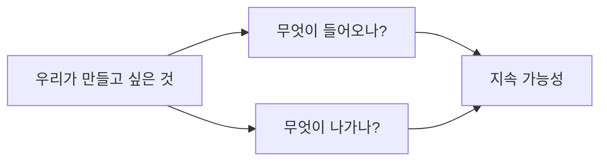

# 12부. Revenue Streams와 Cost Structure
---
## 1. 왜 이 두 칸이 필요한가?

학생들은 종종 "만들 수 있는가?"에는 집중하지만, "유지할 수 있는가?"는 놓치는 경우가 많음.

Revenue Streams와 Cost Structure는 바로 그 지점을 보게 해 줌.

- 무엇으로 유지할 것인가
- 무엇이 부담이 되는가
- 이 프로젝트는 지속 가능한가

즉, 이 두 칸은 프로젝트의 현실성을 보는 부분임.

---

## 2. Revenue Streams를 학생 프로젝트에서 어떻게 볼까?

Revenue Streams는 보통 수익 구조를 뜻함. 하지만 학생 프로젝트에서는 꼭 직접적인 판매 수익만 의미하지 않아도 됨.

학생 프로젝트에서는 아래처럼 더 넓게 볼 수 있음.

- 수업 과제로 운영
- 학교 프로그램과 연계
- 캡스톤 지원
- 학과 지원금
- 공모전 / 산학 프로젝트
- 무료 운영 + 교육 목적 유지

> 💡 **핵심 해석**  
> 학생 프로젝트에서는 Revenue Streams를 "무엇으로 이 활동을 지속할 것인가"라는 관점으로 넓게 해석해도 좋음.
{: .prompt-tip }

---

## 3. Cost Structure란?

Cost Structure는 프로젝트를 만들고 유지하는 데 드는 비용과 부담을 뜻함.

여기서 비용은 단순히 돈만이 아님.

- 개발 시간
- 서버 및 호스팅 비용
- 데이터 수집 비용
- 콘텐츠 제작 부담
- 운영 및 유지보수 시간
- 팀원의 학습 부담

학생 프로젝트에서는 오히려 "시간 비용"과 "운영 부담"이 더 큰 문제인 경우가 많음.

---

## 4. 두 칸을 함께 봐야 하는 이유



Revenue만 보고 Cost를 안 보면 지나치게 낙관적이 되고, Cost만 보고 Revenue나 유지 자원을 안 보면 실행 의지가 약해질 수 있음.

둘을 같이 볼 때 비로소 "이 프로젝트가 현실적인가?"가 보임.

---

## 5. 학생 프로젝트 예시로 보기

주제: `대학생을 위한 피싱 메일 판별 학습 서비스`

| 항목 | 예시 |
| --- | --- |
| Revenue / 유지 자원 | 학교 보안 교육 자료, LMS 연계, 교수자 운영, 수업 과제 활용 |
| Cost | 사례 업데이트 시간, 웹 운영 부담, 콘텐츠 제작 노동 |

이 예시가 좋은 이유는 아래와 같음.

- 직접 유료 판매를 하지 않아도 유지 자원이 설명됨
- 무엇이 실제 부담인지 드러남
- "좋은 아이디어"와 "운영 가능한 아이디어"를 구분할 수 있음

---

## 6. 학생이 자주 하는 실수

### 실수 1. Revenue를 비워 두기

"학생 프로젝트니까 수익은 필요 없음"이라고 넘기면 지속 가능성에 대한 설명이 사라짐.

### 실수 2. Cost를 너무 가볍게 보기

예:

- 서버는 그냥 쓰면 되지
- 데이터는 금방 구할 수 있을 듯
- 운영은 나중에 보면 됨

이런 표현은 프로젝트 후반에 문제로 돌아오기 쉬움.

### 실수 3. 수익만 상상하고 운영 구조는 안 보기

예:

- 광고를 붙이면 되지
- 구독형으로 하면 되지

이런 답은 학생 프로젝트에서는 지나치게 단순할 수 있음. 실제로 누가 쓰고, 얼마나 반복 사용하고, 어떤 비용이 드는지를 먼저 봐야 함.

---

## 7. 현실적인 질문

아래 질문으로 Revenue와 Cost를 더 잘 볼 수 있음.

1. 이 프로젝트는 무엇으로 유지할 수 있는가?
2. 누가 시간과 자원을 계속 투입할 것인가?
3. 가장 큰 부담은 무엇인가?
4. 지금 팀 규모에서 감당 가능한가?

---

## 8. 인용과 연결

Strategyzer는 비즈니스 모델을 가치 창출과 전달뿐 아니라 가치 획득까지 포함하는 구조로 설명함. 학생 프로젝트에서는 이 "capture"를 꼭 돈으로만 보지 않고, **지속 가능하게 유지되는 구조**로 재해석할 수 있음.

즉,

- 무엇을 얻어야 이 프로젝트가 계속될 수 있는가
- 무엇이 너무 큰 부담이 되면 중단되는가

를 보는 것이 중요함.

---

## 9. 짧은 활동

자신의 프로젝트를 떠올리며 아래를 적어보자.

```text
이 프로젝트를 유지하게 해 주는 자원:
이 프로젝트에서 가장 부담이 큰 비용:
지금 팀이 감당 가능한 수준인지:
```

세 줄만 적어도 현실성이 훨씬 잘 보임.

---

## 10. 마무리

Revenue Streams와 Cost Structure는 프로젝트가 "좋아 보이는가"가 아니라, **실제로 지속 가능한가**를 보게 해 주는 칸임.

다음 장에서는 프로젝트를 실제로 굴리기 위한 내부 요소인 Key Resources, Key Activities, Key Partners를 살펴봄.

