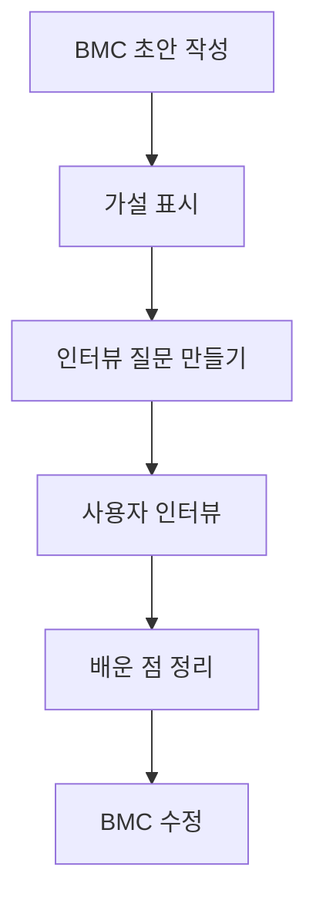

# 16부. BMC 검증과 고객 인터뷰
---
## 1. 왜 검증이 필요한가?

BMC를 적었다고 해서 그 내용이 사실이 되는 것은 아님.

많은 칸은 여전히 가설일 가능성이 큼.

- 우리가 정한 고객이 맞는가?
- 우리가 생각한 가치가 실제로 중요한가?
- 우리가 고른 채널이 편한가?
- 유지 방식이 현실적인가?

Steve Blank는 고객 발견 과정에서 아래 문장을 자주 강조함.

> “There are no facts inside the building.”
> 참고: [Steve Blank](https://steveblank.com/category/customer-development/)

학생식으로 바꾸면,

> 팀 회의만으로는 고객이 맞는지 알 수 없고, 실제 사람을 통해 확인해야 한다는 뜻임.

---

## 2. 무엇을 검증해야 하는가?

| BMC 칸 | 검증 질문 예시 |
| --- | --- |
| Customer Segments | 우리가 생각한 고객이 정말 이 문제를 겪는가? |
| Value Proposition | 이 가치가 고객에게 실제로 의미 있는가? |
| Channels | 이 경로가 실제로 접근하기 편한가? |
| Relationships | 고객이 반복해서 돌아올 이유가 있는가? |
| Revenue / Cost | 이 구조가 지속 가능한가? |

즉, 검증은 단순 만족도 조사가 아니라, **우리가 적은 BMC가 맞는지 확인하는 과정**임.

---

## 3. 인터뷰 질문은 어떻게 만들어야 하는가?

좋은 인터뷰 질문은 실제 경험을 묻는 질문에 가까움.

좋은 예:

- 최근에 이런 문제를 겪은 적이 있는가?
- 그때 어떻게 해결했는가?
- 무엇이 가장 불편했는가?
- 지금 방식에서 가장 아쉬운 점은 무엇인가?

나쁜 예:

- 이 서비스 좋지 않나요?
- 이런 기능 있으면 쓰실 거죠?

> ⚠️ **주의**  
> 유도 질문은 사용자가 "좋게 말해 주는" 방향으로 답하게 만들 수 있음.
{: .prompt-warning }

---

## 4. 인터뷰의 목적

인터뷰는 아이디어를 자랑하는 시간이 아니라, 가설을 깨뜨리거나 보완하는 시간임.

즉, 아래를 알아내는 것이 중요함.

- 고객이 실제로 이 문제를 겪는가
- 문제의 강도는 어느 정도인가
- 기존 해결 방식은 무엇인가
- 우리가 생각한 가치가 과연 중요한가

---

## 5. 검증 흐름



이 흐름을 보면 BMC는 한 번 쓰고 끝나는 문서가 아니라, 계속 수정되는 작업 도구라는 점이 보임.

---

## 6. 예시

주제: `대학생을 위한 피싱 메일 판별 학습 서비스`

검증하고 싶은 가설:

- 대학생은 피싱 메일 구분에 실제로 어려움을 느낀다
- 퀴즈형 학습이 긴 설명보다 더 도움이 된다
- LMS나 웹 방식이 접근성이 좋다

인터뷰 질문 예시:

1. 최근에 메일이나 메시지를 보고 의심스러웠던 경험이 있는가?
2. 그때 어떤 기준으로 판단했는가?
3. 보안 교육을 받았다면 어떤 방식이 가장 기억에 남았는가?
4. 긴 설명과 퀴즈형 학습 중 어느 쪽이 더 도움이 될 것 같은가?

---

## 7. 학생이 자주 하는 실수

### 실수 1. 친구에게 설명하고 "좋다"는 말만 듣기

이건 피드백일 수는 있지만 검증이라고 보기는 어려움.

### 실수 2. 문제 경험보다 솔루션 반응만 묻기

"이 서비스 어때?"보다 "이 문제를 최근에 겪은 적 있나?"가 더 중요함.

### 실수 3. 인터뷰 결과를 BMC에 반영하지 않기

검증은 기록보다 수정이 중요함.

---

## 8. 짧은 활동

자신의 프로젝트에 대해 아래 질문 3개를 써 보자.

```text
1. 고객이 실제 경험을 말하게 하는 질문
2. 문제 강도를 확인하는 질문
3. 현재 해결 방식을 묻는 질문
```

이 3개만 잘 써도 인터뷰의 질이 크게 올라감.

---

## 9. 마무리

검증은 BMC를 비판하는 과정이 아니라, **더 현실적인 모델로 다듬는 과정**임.

다음 장에서는 이제 정리된 BMC를 실제 프로젝트 요구사항으로 연결함.

