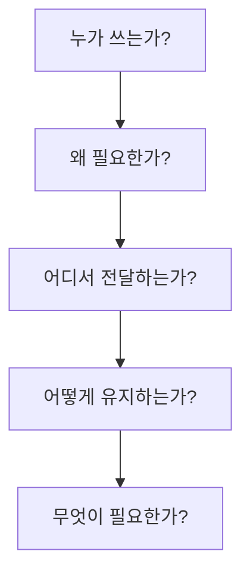

# 8부. Business Model Canvas 개요
---
## 1. Business Model Canvas란?

> 💡 **이번 장의 핵심 메시지**  
> Business Model Canvas는 사업계획서를 대신하는 종이가 아니라,  
> **아이디어를 고객, 가치, 전달, 운영, 비용의 관점으로 구조화하는 사고 도구**임.
{: .prompt-tip }

Business Model Canvas(BMC)는 Alexander Osterwalder 계열의 비즈니스 모델 설계 프레임워크로 널리 알려져 있음. 학생 입장에서는 복잡한 창업 문서로 느껴질 수 있지만, 실제로는 아래 질문을 한 장에 정리하는 틀이라고 보면 됨.

- 누구를 위한 프로젝트인가
- 어떤 문제를 해결하는가
- 왜 그 문제를 해결할 가치가 있는가
- 어떤 경로로 사용자에게 전달할 것인가
- 무엇이 필요하고, 무엇이 부담이 되는가

Strategyzer에서는 비즈니스 모델을 아래처럼 설명함.

> “A business model describes the rationale of how an organization creates, delivers, and captures value.”
> 출처: [Strategyzer, Business Model Canvas](https://www.strategyzer.com/library/the-business-model-canvas)

이 문장을 학생식으로 바꾸면 다음과 같음.

> 비즈니스 모델은 "우리가 누구에게 어떤 가치를 어떻게 전달하고, 그 활동을 어떻게 유지할 것인지"를 설명하는 구조임.

---

## 2. 왜 학생 프로젝트에서 BMC가 필요한가?

학생 프로젝트는 종종 아래처럼 출발함.

- 앱을 하나 만들고 싶다
- AI를 넣으면 멋질 것 같다
- 보안 관련 서비스를 해보고 싶다
- 요즘 많이 쓰는 서비스와 비슷한 것을 만들어보고 싶다

이런 출발은 자연스럽지만, 여기에는 중요한 빈칸이 있음.

- 누가 정말 쓸 것인가?
- 그 사람은 어떤 상황에서 문제를 겪는가?
- 우리가 주는 가치가 실제로 의미가 있는가?
- 프로젝트를 어떻게 유지할 것인가?

즉, 기능 아이디어만으로는 프로젝트의 방향이 충분히 보이지 않음.

> ⚠️ **중요한 경고**  
> "AI를 붙인다", "채팅 기능을 넣는다", "앱으로 만든다"는 말은 구현 방식일 뿐, 아직 비즈니스 모델은 아님.
{: .prompt-warning }

학생 프로젝트에서 BMC가 필요한 이유는 아래와 같음.

1. 팀이 같은 방향을 보게 해 줌  
   아이디어가 막연할 때 팀원마다 떠올리는 그림이 다름. BMC는 그 그림을 맞추는 도구임.

2. 기능보다 가치 중심으로 생각하게 함  
   "무엇을 만들까?"보다 "왜 필요한가?"를 먼저 묻게 함.

3. 요구사항 도출 전에 방향을 잡게 함  
   코드를 짜기 전에 고객, 가치, 전달 경로를 먼저 정리할 수 있음.

4. 프로젝트 설명 능력을 높임  
   발표나 문서에서 "우리 프로젝트는 누구를 위해, 왜 필요한가"를 더 잘 설명할 수 있음.

---

## 3. BMC의 9개 블록

Business Model Canvas는 아래 9개 블록으로 구성됨.

| 블록 | 질문 | 학생식 표현 |
| --- | --- | --- |
| **Customer Segments** | 누구를 위한가? | 누가 쓸까? |
| **Value Proposition** | 왜 필요한가? | 왜 써야 하지? |
| **Channels** | 어떻게 전달하는가? | 어디서 만나지? |
| **Customer Relationships** | 어떤 관계를 맺는가? | 한 번 쓰나, 계속 쓰나? |
| **Revenue Streams** | 무엇으로 유지되는가? | 돈이나 자원은 어디서 오지? |
| **Key Resources** | 무엇이 필요한가? | 뭐가 있어야 하지? |
| **Key Activities** | 무엇을 해야 하는가? | 뭘 해야 돌아가지? |
| **Key Partners** | 누구와 협력해야 하는가? | 누구 도움이 필요하지? |
| **Cost Structure** | 무엇이 부담이 되는가? | 뭐가 비용이 되지? |

왼쪽 인프라(Infrastructure) 영역에서 핵심 파트너가 핵심 활동과 핵심 자원을 지원하고, 이 활동과 자원이 중앙의 가치 제안(Value Propositions)을 만들어내는 흐름임. 가치 제안은 캔버스의 중심축으로, 오른쪽 고객(Customer) 영역의 고객 관계, 채널, 고객 세그먼트로 전달됨. 채널은 고객에게 도달하는 경로이고, 고객 관계는 고객을 유지/확보하는 방식임.

하단에서는 왼쪽 인프라 활동이 비용 구조(Cost Structure)를 발생시키고, 오른쪽 고객이 수익원(Revenue Streams)에 지불하며, 수익이 비용보다 클 때 이익이 생기는 구조임.

특정 사업 아이템을 대입해서 각 블록을 채우고 관계를 구체화해볼 수 있음. 어떤 비즈니스를 대상으로 해볼지 알려주면 됨.

---

## 4. 학생 프로젝트에서는 어디부터 봐야 하는가?

처음부터 9개 블록을 모두 완벽하게 채우는 것은 부담이 큼. 따라서 학생 프로젝트에서는 아래 순서가 비교적 자연스러움.

1. Customer Segments
2. Value Proposition
3. Channels
4. Revenue Streams / Cost Structure
5. Key Resources / Key Activities / Key Partners

이 순서가 좋은 이유는 아래와 같음.

- 고객이 안 보이면 가치가 흐림
- 가치가 안 보이면 전달 방식이 애매함
- 전달 방식이 안 보이면 실제 사용 상황이 안 보임
- 유지 구조가 안 보이면 프로젝트 지속성이 약함
- 내부 자원과 활동은 그다음에 현실적으로 계산할 수 있음

---

## 5. BMC는 사업계획서와 어떻게 다른가?

학생들이 자주 헷갈리는 부분 중 하나는 "BMC를 쓰면 사업계획서를 쓰는 것과 같은가?"라는 질문임.

둘은 비슷해 보일 수 있지만 역할이 다름.

| 구분 | Business Model Canvas | 사업계획서 |
| --- | --- | --- |
| 목적 | 생각을 구조화 | 외부 설득 / 상세 계획 |
| 형태 | 한 장 요약 | 긴 문서 |
| 사용 시점 | 초기 기획 | 후속 정리 |
| 장점 | 빠르게 수정 가능 | 상세 설명 가능 |

즉, BMC는 먼저 쓰고 자주 바꾸는 도구에 가깝고, 사업계획서는 그다음 단계의 문서에 가까움.

---

## 6. 스타트업 관점에서 왜 중요한가?

Steve Blank는 스타트업을 이미 정해진 모델을 실행하는 조직이 아니라, 모델을 찾아가는 과정에 있는 조직으로 설명해 왔음. 이 관점은 학생 프로젝트에도 꽤 잘 맞음.

왜냐하면 학생 프로젝트도 처음부터 답을 알고 시작하는 경우가 거의 없기 때문임.

- 누가 진짜 고객인지 확실하지 않을 수 있음
- 우리가 생각한 가치가 실제로 통할지 모를 수 있음
- 전달 방식이 잘 맞지 않을 수도 있음

이때 BMC는 "우리가 현재 무엇을 가정하고 있는가?"를 드러내는 도구가 됨.

Eric Ries 역시 스타트업의 핵심 활동을 아이디어를 제품으로 만들고, 고객 반응을 측정하고, 그 결과로 배우는 과정으로 설명함.

> “The fundamental activity of a startup is to turn ideas into products, measure how customers respond, and then learn whether to pivot or persevere.”
> 출처: [The Lean Startup](https://theleanstartup.com/)

학생식으로 바꾸면 다음과 같음.

> 처음 생각한 아이디어가 정답일 가능성은 낮으므로, 구조화하고, 확인하고, 수정해야 함.

---

## 7. 예시로 간단히 보면

주제: `대학생을 위한 피싱 메일 판별 학습 서비스`

이 프로젝트를 BMC 관점으로 아주 거칠게 보면 아래처럼 됨.

| 블록 | 예시 |
| --- | --- |
| Customer Segments | 이메일과 메시지를 자주 쓰는 대학생 |
| Value Proposition | 피싱 메일의 위험 신호를 더 잘 구분하도록 돕는다 |
| Channels | 웹 학습 페이지, LMS, 학교 포털 |
| Customer Relationships | 반복 퀴즈와 피드백 학습 |
| Revenue Streams | 수업 연계 운영, 학교 보안 교육 프로그램 |
| Key Resources | 사례 데이터, 콘텐츠, 웹 구현 역량 |
| Key Activities | 사례 수집, 콘텐츠 제작, 퀴즈 구현 |
| Key Partners | 교수자, 학교 전산팀 |
| Cost Structure | 운영 시간, 사례 업데이트 부담 |

이 예시에서 중요한 점은 완벽함이 아니라, 각 칸이 "비어 있지 않게" 연결되기 시작한다는 것임.

---

## 8. 학생이 흔히 하는 실수

### 실수 1. 기능을 BMC라고 착각하기

예:

- AI 기능 추가
- 로그인 기능 구현
- 채팅 기능 넣기

이것은 대부분 요구사항 후보이지, BMC 자체는 아님.

### 실수 2. 고객을 너무 넓게 잡기

예:

- 모든 대학생
- 모든 사용자
- 전 국민

이렇게 쓰면 프로젝트가 실제로 누구를 위한 것인지 모호해짐.

### 실수 3. 가치 대신 멋있는 이름만 적기

예:

- 스마트 보안 플랫폼
- 차세대 AI 서비스

이런 표현은 있어 보일 수는 있지만, 고객과 문제를 설명하지 못함.

---

## 9. 짧은 활동

아래 문장을 읽고, 어떤 BMC 칸과 관련이 있는지 적어보자.

1. "이 서비스는 팀 프로젝트 일정 조율이 어려운 대학생을 위한 것이다."
2. "사용자는 모바일에서 바로 마감일을 확인할 수 있다."
3. "교수자가 LMS를 통해 학생들에게 서비스를 안내할 수 있다."
4. "서버 운영과 알림 전송이 비용 부담이 될 수 있다."

예상 답:

1. Customer Segments
2. Value Proposition / Channels
3. Channels / Key Partners
4. Cost Structure

---

## 10. 마무리

Business Model Canvas는 정답을 적는 종이가 아니라, **현재 우리의 생각을 구조화하고 드러내는 틀**임.

이번 장에서는 전체 지도를 보았고, 다음 장부터는 각 블록을 학생 눈높이에서 더 자세히 다룰 것임.

