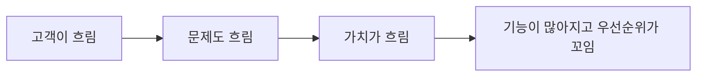
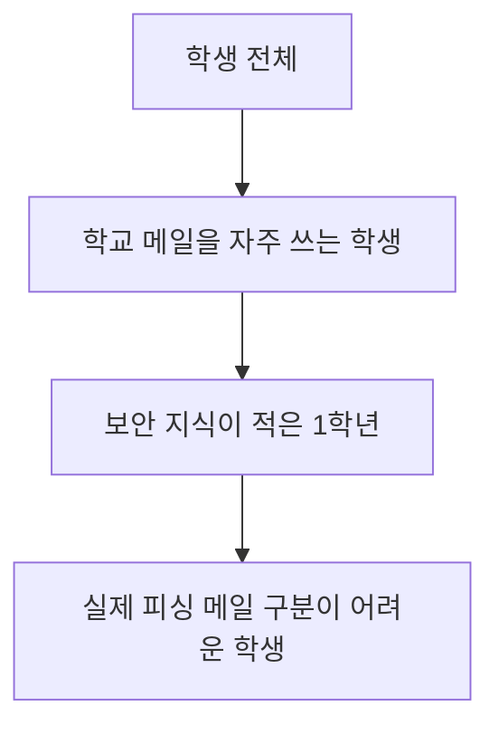

# 9부. Customer Segments - 누구를 위한 프로젝트인가
---
## 1. Customer Segments란?

Customer Segments는 "누가 이 프로젝트의 주요 고객 또는 사용자이며, 누구를 위해 이 가치를 설계하는가?"를 적는 칸임.

학생들은 보통 기능 아이디어를 먼저 떠올리기 때문에, 고객을 뒤늦게 맞추려는 경향이 있음. 하지만 실제로는 고객 정의가 먼저 와야 이후 블록들이 자연스럽게 따라옴.

예:

- 고객이 불분명하면 가치 제안이 흐려짐
- 고객이 넓으면 요구사항이 너무 많아짐
- 고객을 잘못 잡으면 채널도 잘못 고르게 됨

---

## 2. 왜 고객 정의가 그렇게 중요한가?

고객을 정한다는 것은 단순히 "누가 쓸 것 같다"를 적는 일이 아님.

고객을 정하면 아래가 함께 정리되기 시작함.

- 문제의 맥락
- 사용 시점
- 불편의 강도
- 필요한 기능의 우선순위
- 전달 방식



즉, Customer Segments는 프로젝트 범위를 정하는 기준점이기도 함.

---

## 3. 학생이 흔히 하는 고객 정의

아래 표현은 자주 보이지만 대체로 너무 넓거나 모호함.

- 학생들을 위한 서비스
- 대학생 전체를 위한 앱
- 누구나 쉽게 쓸 수 있는 보안 서비스
- 인터넷 사용자라면 다 쓸 수 있음

이 문장들의 문제는 실제 사람의 모습이 떠오르지 않는다는 점임.

좋은 고객 정의는 최소한 아래 중 일부라도 보여야 함.

- 어떤 사람인가
- 언제 이 문제를 겪는가
- 왜 이 문제가 중요한가
- 얼마나 자주 겪는가

---

## 4. 고객을 좁히는 방법

### 4-1. 상황으로 좁히기

- 모든 대학생
- 공강 시간이 많은 대학생
- 팀 프로젝트를 자주 하는 대학생
- 학교 메일을 자주 확인하는 신입생

### 4-2. 문제 강도로 좁히기

- 피싱 메일이 무서운 사람
- 실제로 링크 클릭 경험이 있었던 학생
- 보안 교육 경험이 거의 없는 학생

### 4-3. 사용 빈도로 좁히기

- 자주 반복해서 문제를 겪는가
- 꼭 필요한 순간이 있는가



> 💡 **핵심 원리**  
> 고객을 좁힌다는 것은 사람을 배제하는 것이 아니라,  
> **처음에 누구를 가장 잘 도와줄지 정하는 것**임.
{: .prompt-tip }

---

## 5. 고객과 사용자, 고객과 의사결정자를 구분하기

학생 프로젝트에서는 종종 "쓰는 사람"과 "도입을 결정하는 사람"이 다름.

예를 들어 보안 학습 서비스라면,

- 사용하는 사람: 학생
- 도입이나 운영을 결정하는 사람: 교수자, 학교

이 차이를 구분하지 않으면 발표할 때 설명이 꼬일 수 있음.

| 구분 | 예시 |
| --- | --- |
| 사용자 | 실제로 서비스를 사용하는 학생 |
| 고객 / 도입 주체 | 수업에 활용하는 교수자, 학교 조직 |
| 영향 주체 | 학교 전산팀, 보안 담당자 |

이런 구분은 나중에 `Key Partners`, `Channels`, `Revenue Streams`와도 연결됨.

---

## 6. 페르소나처럼 간단히 적는 방법

복잡한 UX 문서를 만들 필요는 없지만, 최소한 한 명의 구체적인 사람처럼 적어보면 큰 도움이 됨.

```text
이름(가상):
학년/역할:
주로 겪는 문제:
문제가 생기는 상황:
왜 이 문제가 중요한가:
```

예:

```text
이름: 민수
학년/역할: 1학년 대학생
주로 겪는 문제: 학교 메일과 외부 메일을 구분하지 못하고 링크를 쉽게 누른다
문제가 생기는 상황: 과제 공지, 장학금 공지, 학교 행사 안내 메일을 볼 때
왜 이 문제가 중요한가: 실수로 피싱 링크를 누를 수 있고, 보안 사고로 이어질 수 있다
```

이 정도만 적어도 "누구를 위한 프로젝트인가?"가 훨씬 구체적으로 보이기 시작함.

---

## 7. 좋은 Customer Segment의 조건

좋은 고객 정의는 아래 특징을 가짐.

- 실제 사람이 떠오름
- 문제 상황이 떠오름
- 너무 넓지 않음
- 팀이 공감할 수 있음
- 이후 가치 제안과 자연스럽게 연결됨

나쁜 예:

```text
모든 대학생
```

좋은 예:

```text
학교 메일을 자주 사용하지만 피싱 메일 구분 경험이 적은 1~2학년 대학생
```

---

## 8. 인용으로 다시 보기

Steve Blank는 고객 검증과 고객 발견의 중요성을 지속적으로 강조해 왔음. 특히 아래 문장은 Customer Segments를 적을 때 매우 중요한 힌트가 됨.

> “There are no facts inside the building.”
> 참고: [Steve Blank](https://steveblank.com/category/customer-development/)

학생식으로 바꾸면,

> 우리가 정한 고객이 맞는지는 회의실 안에서 결론 낼 수 없고, 실제 사람을 확인해야 함.

즉, Customer Segments는 상상으로 시작할 수는 있지만, 검증 없이 확정할 수는 없음.

---

## 9. 짧은 활동

아래 문장을 더 좋은 Customer Segment 문장으로 바꿔 보자.

원래 문장:

```text
대학생을 위한 보안 서비스
```

개선 질문:

1. 어떤 대학생인가?
2. 언제 이 문제가 생기는가?
3. 왜 중요한가?

개선 예시:

```text
학교 메일을 자주 확인하지만 피싱 메일 구분 경험이 적은 신입생을 위한 보안 학습 서비스
```

---

## 10. 마무리

Customer Segments는 단순한 대상 나열이 아니라, 프로젝트 전체 방향을 정하는 출발점임.

다음 장에서는 이 고객에게 **왜 필요한가**를 설명하는 Value Proposition을 자세히 살펴봄.

