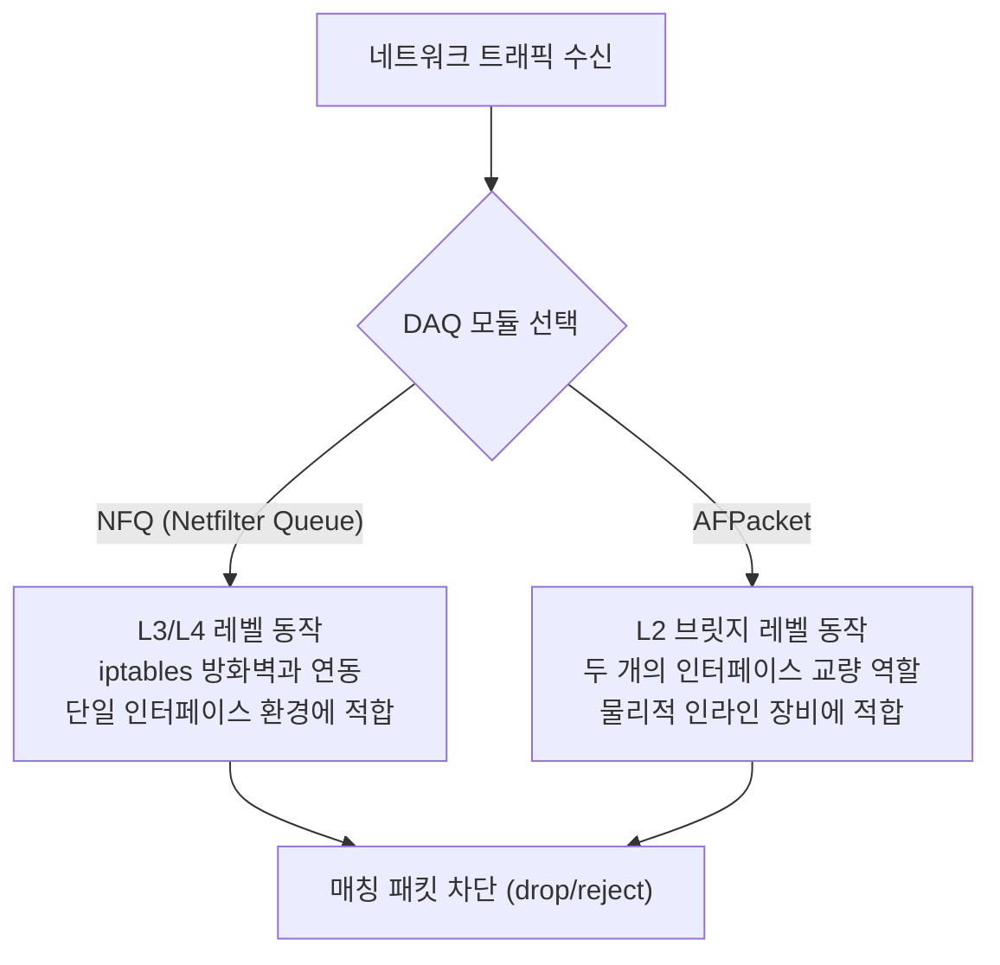

# 침입 차단 시스템 — Snort IPS

---

## 실습 환경

| 역할 | OS | IP / 인터페이스 |
|------|----|----|
| 공격자 | Kali Linux | `192.168.61.10` |
| 차단 서버 (IPS) | Ubuntu | `192.168.61.30` (기본 인터페이스: `ens33` / 실습에 따라 추가 인터페이스 `ens34` 사용) |

---

## Part 1. IDS vs IPS 동작 차이와 IPS 룰 액션

이전 실습에서 사용한 **IDS(침입 탐지 시스템)**는 트래픽의 복사본을 분석하므로 공격을 감지하고 경보(Alert)를 울릴 뿐 패킷의 흐름을 직접 제어할 수 없습니다. 

반면 **IPS(침입 차단) 모드**는 트래픽이 지나가는 경로 상(Inline)에 직접 위치하며, 패킷을 실시간으로 검사해 차단 정책에 매칭될 경우 해당 패킷을 폐기하고 연결을 강제 종료합니다.

### 1.1 IPS 모드 전용 룰 액션 (Action)

IPS로 구동되는 Snort에서는 `alert` 외에 다음과 같은 차단용 액션을 사용할 수 있습니다:

| 액션 | 동작 설명 |
|------|-----------|
| `drop` | 매칭된 패킷을 즉시 폐기하고 경보를 기록합니다. (공격자는 응답 없이 타임아웃 대기 상태가 됨) |
| `reject` | 매칭된 패킷을 폐기하고, 경보를 기록함과 동시에 송신자 측에 거부 패킷을 보냅니다.<br>- TCP 트래픽인 경우: **TCP Reset(RST)** 패킷 송신<br>- UDP/ICMP 트래픽인 경우: **ICMP Port/Host Unreachable** 패킷 송신 |
| `sdrop` | 매칭된 패킷을 폐기하지만, 경보(Alert) 로그를 남기지 않습니다. (침묵형 차단) |

---

## Part 2. DAQ (Data Acquisition) 모듈의 이해-1

Snort가 패킷을 하드웨어 네트워크 카드로부터 가져와 처리할 때 **DAQ(Data Acquisition)** 라이브러리를 사용합니다. IPS 모드(인라인 모드)를 구현하기 위해 주로 사용하는 DAQ 모듈은 두 가지가 있습니다:



1. **NFQ (Netfilter Queue) 모듈:**
   - 리눅스 커널의 방화벽 기능인 `iptables`와 연동하여 동작합니다.
   - `iptables` 규칙으로 특정 패킷을 큐(Queue)로 전달하면, Snort가 해당 큐를 감시하며 분석 후 통과/차단 결정을 내립니다.
   - **단일 인터페이스** 환경에서도 쉽게 IPS 차단 실습을 구성할 수 있어 교육 및 개인 실습용으로 널리 쓰입니다.

2. **AFPacket 모듈:**
   - 가상 브릿지(Bridge) 방식으로 동작합니다.
   - 두 개의 인터페이스(예: 외부용 `ens33`와 내부용 `ens34`)를 가상 교량으로 이어주고, 브릿지를 통과하는 모든 패킷을 물리적 인터페이스 레벨에서 실시간 차단합니다.
   - 실제 네트워크 관문에 설치되는 **물리적 IPS 장비**와 동일한 구조입니다.

---

## Part 3. [실습 1] NFQ 기반 IPS 실습 (단일 인터페이스)

가장 직관적이고 인터페이스 추가 없이 실습 가능한 **Netfilter Queue(NFQ)** 연동 방식의 IPS 실습입니다. Kali Linux의 Ping(ICMP) 공격을 실시간으로 차단해 봅니다.

### 3.1 Step 1. iptables 규칙 추가 (큐로 트래픽 유도)
Ubuntu 서버에서 들어오는 ICMP 트래픽을 커널 방화벽이 바로 처리하지 않고, 1번 큐(`--queue-num 1`)로 보내 Snort가 검사하게 합니다.

```bash
# Ubuntu에서 실행
# INPUT 체인의 1순위로 ICMP 프로토콜 트래픽을 NFQUEUE 1번으로 전달
sudo iptables -I INPUT -p icmp -j NFQUEUE --queue-num 1
```

*규칙이 잘 들어갔는지 방화벽 리스트를 확인합니다:*
```bash
sudo iptables -L INPUT -n --line-numbers
```

### 3.2 Step 2. 로컬 룰에 drop 규칙 작성
`/etc/snort/rules/local.rules` 파일을 열어 맨 밑에 ICMP 패킷을 차단하는 `drop` 규칙을 작성합니다.

```bash
sudo nano /etc/snort/rules/local.rules
```

*아래 룰을 추가합니다:*
```bash
# 192.168.61.10(Kali)에서 오는 모든 ICMP Ping 요청(itype:8)을 강제로 드롭(drop)함
#   - drop : 차단 및 경보 기록 액션
#   - itype:8 : ICMP Echo Request 패킷 필터링
#   - sid:1000008 : 커스텀 룰 고유 번호 설정
drop icmp 192.168.61.10 any -> 192.168.61.30 any (msg:"[IPS DROP] ICMP Ping Blocked"; itype:8; sid:1000008; rev:1;)
```

### 3.3 Step 3. Snort IPS 모드로 실행
`-Q` 옵션을 붙이고 DAQ 타입을 `nfq`로 설정하여 Snort를 실행합니다.

```bash
#   -Q : Inline(IPS) 모드 활성화
#   --daq nfq : Netfilter Queue DAQ 드라이버 지정
#   --daq-var queue=1 : iptables에서 지정한 1번 큐 매칭
sudo snort -Q --daq nfq --daq-var queue=1 -c /etc/snort/snort.conf -A console
```

### 3.4 Step 4. 차단 테스트 및 로그 확인

**공격자(Kali Linux) 터미널:**
Ubuntu 서버(`192.168.61.30`)로 Ping을 날려봅니다.
```bash
ping -c 5 192.168.61.30
```
* **결과:** 패킷 송신은 되나 Ubuntu 측으로부터 어떠한 응답(Reply)도 오지 않고 전부 **100% 패킷 손실(Packet Loss)** 처리됩니다.

**차단 서버(Ubuntu Snort) 터미널:**
실시간 콘솔 화면에 아래와 같이 패킷 드롭 경보가 출력됩니다.
```text
03/26-14:15:22.123456  [**] [1:1000008:1] [IPS DROP] ICMP Ping Blocked [**]
[Priority: 0]
ICMP 192.168.61.10 -> 192.168.61.30
```

### 3.5 Step 5. 실습 종료 후 방화벽 초기화
> **중요:** IPS 테스트가 끝난 후 `iptables` 설정을 초기화하지 않으면 Snort가 꺼져 있을 때 Ubuntu로 향하는 모든 Ping(ICMP) 트래픽이 큐에 갇혀 통신 불가능 상태가 됩니다. 반드시 규칙을 지워주어야 합니다.
{: .prompt-danger }

```bash
# iptables 규칙 전체 삭제 (초기화)
sudo iptables -F
```

---


## Part 4. IPS 실습 시 주의 사항 및 정리

1. **네트워크 단절 현상 방지:**
   - `NFQ` 실습 시 `iptables` 규칙을 등록한 후 Snort를 실행하지 않거나 비정상 종료되면 해당 큐에 들어간 트래픽은 처리가 멈춰 네트워크가 먹통이 됩니다.
   - 따라서 실습 진행 중 Snort를 끈 상태에서는 신속하게 **`sudo iptables -F`** 명령어를 입력해 방화벽 정책을 클리어해 주는 습관이 필요합니다.

2. **룰 순서 설정:**
   - Snort는 성능 효율화를 위해 `pass` -> `drop` -> `reject` -> `alert` -> `log` 순서로 룰을 우선 평가합니다.
   - 만약 차단해야 할 트래픽에 대해 상단에 허용(`pass`) 룰이 정의되어 있다면 차단 룰(`drop`)이 동작하지 않을 수 있으므로 룰 배치에 주의해야 합니다.
