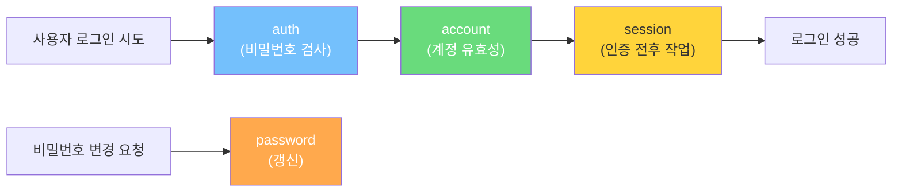
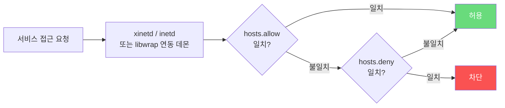
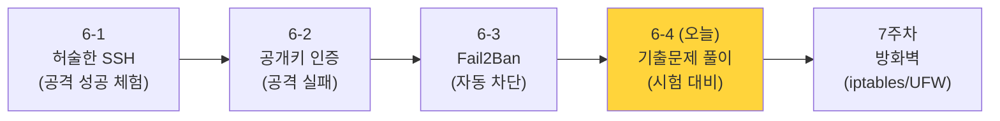

## 보안기사 관련 문제


> **출제 트렌드 (정보보안기사 실기 기출문제집 기준):**
>
> - **2025년 7월 (기출 01회)**: PAM 모듈 4가지 타입 (auth/account/password/session) 단답형
> - **2025년 4월 (기출 02회)**: telnet 위험 + SSH로 대체 권고 + iptables/TCP Wrapper 작업형
> - **2024년 11월 (기출 03회)**: who/history/lastlog 로그 명령어 단답형
> - **2024년 7월 (기출 04회)**: 패스워드 최소 길이 설정 (`PASS_MIN_LEN` in `/etc/login.defs`) 단답형
> - 단답형 5회 13번: **SSH 정의** 직접 출제
>
> 시험에서 SSH/계정/로그/PAM이 거의 매 회차 나옵니다.
{: .prompt-info }

---

## Part 1. SSH의 정의와 동작 원리

### 문제 1-1. SSH가 뭔가?

**📋 문제 시나리오** *(연습문제 05회 13번 응용)*

> telnet, rlogin, rsh 등을 이용한 원격지 서버로의 접속 및 데이터 전송 시 암호화되지 않은 통신으로 인한 불법 도청(Sniffing) 취약점을 방지하기 위하여, 통신 내용의 암호화된 데이터 전송 및 사용자 인증을 제공하는 보안 기술이다.

**✅ 정답**

```
SSH (Secure Shell)
```

**🔍 풀이 핵심**

SSH가 telnet/rlogin/rsh를 대체한 이유:

| 항목 | telnet/rlogin/rsh | SSH |
|------|-------------------|-----|
| 전송 방식 | 평문 | **암호화** |
| 인증 | 비밀번호만 | 비밀번호 + **공개키** |
| 포트 | 23 / 513 / 514 | 22 |
| 사용 키 방식 | 없음 | **공개키 암호** + 대칭키 |
| 무결성 | 없음 | MAC으로 보장 |

> **6-1에서 본 그대로:** 6-1에서 우리는 SSH 비밀번호 인증만으로는 무차별 대입 공격이 가능함을 봤고, 6-2에서 공개키 인증으로 전환했습니다. SSH의 가치는 "공개키 인증을 쓸 수 있다" 는 점에 있습니다.
{: .prompt-tip }

---

### 문제 1-2. PKI와 공개키 — SSH 키 인증의 이론적 배경

**📋 문제 시나리오** *(연습문제 02회 03번)*

> 공개키 암호 기술에 기반을 둔 인증서를 생성·관리·저장·분배·말소·검색·인증을 수행하는 H/W·S/W·인력·정책 등의 집합체 기반 구조이다.

**✅ 정답:** `PKI (Public Key Infrastructure)`

**🔍 6-2와의 연결**

6-2에서 `ssh-keygen`으로 만든 개인키·공개키 쌍이 바로 PKI의 가장 단순한 형태입니다:

| PKI 일반 | SSH 키 인증에서 |
|----------|----------------|
| 인증기관(CA) | 사용자 자신 (자가 서명) |
| 개인키 | `~/.ssh/id_rsa` |
| 공개키 | `~/.ssh/id_rsa.pub` |
| 인증서 배포 | `authorized_keys` 등록 |

> **시험에서 자주 묻는 부분:** PKI의 5대 목적 — **기밀성, 무결성, 부인봉쇄, 접근 제어, 키 관리**.
{: .prompt-tip }

---

## Part 2. 사용자 계정과 비밀번호 저장

SSH 보안의 출발점은 **비밀번호가 어디에 어떻게 저장되어 있는가** 입니다. 6-1에서 만들었던 일반 사용자 계정의 비밀번호가 결국 어디에 있는지 시험에서 물어봅니다.

### 문제 2-1. /etc/passwd의 구조

**📋 문제 시나리오** *(연습문제 02회 01번)*

> 다음과 같은 형식의 파일은 무엇인가?
> ```
> root : x : 0 : 0 : root : /root : /bin/bash
> ```

**✅ 정답:** `/etc/passwd`

**📋 7개 필드 구조**

| # | 필드 | 의미 | 예시 |
|---|------|------|------|
| ① | Login Name | 사용자 계정명 | `root` |
| ② | Password | `x` 표시 (실제 해시는 `/etc/shadow`로 분리됨) | `x` |
| ③ | UID | 사용자 ID | `0` (root) |
| ④ | GID | 그룹 ID | `0` |
| ⑤ | Comment | 코멘트 정보 | `root` |
| ⑥ | Home Directory | 홈 디렉터리 | `/root` |
| ⑦ | Shell | 기본 셸 | `/bin/bash` |

---

### 문제 2-2. /etc/shadow의 구조

**📋 문제 시나리오** *(기출 01회 06번 + 연습문제 04회 13번)*

> 다음 형식의 파일은? 전체 경로로 적으시오.
> ```
> root : $1$Fz4q1GjE$G/ : 14806 : 0 : 99999 : 7 : : :
> ```

**✅ 정답:** `/etc/shadow`

**📋 9개 필드 구조 (시험 단골)**

| # | 필드 | 의미 |
|---|------|------|
| ① | Login Name | 사용자 계정 |
| ② | Encrypted | **암호화된 비밀번호 해시** (`$1$` MD5, `$5$` SHA-256, `$6$` SHA-512) |
| ③ | Last Changed | 1970-01-01부터 비밀번호가 마지막 변경된 날까지의 일 수 |
| ④ | Minimum | 비밀번호 변경 전 **최소** 사용 일 수 |
| ⑤ | Maximum | 비밀번호 변경 전 **최대** 사용 일 수 |
| ⑥ | Warn | 만료 며칠 전 경고 |
| ⑦ | Inactive | 만료 후 로그인 차단까지의 일 수 |
| ⑧ | Expire | 계정 자체가 만료되는 날(일/월/연도) |
| ⑨ | Reserved | 미사용 |

> **🔍 시험 빈출 포인트:**
> - `/etc/shadow` 의 **읽기 권한은 root만** (`-rw-r-----` 또는 `-rw-------`)
> - 실제 해시 알고리즘은 `$6$...` 형태 → **SHA-512** 가 현재 리눅스 표준
> - 6-1에서 비밀번호 무차별 대입이 가능했던 이유는 **약한 비밀번호** 때문이지 알고리즘이 약해서가 아닙니다.
{: .prompt-warning }

---

### 문제 2-3. 비밀번호 최소 길이 설정 — `/etc/login.defs`

**📋 문제 시나리오** *(기출 04회 01번)*

> 리눅스에서 패스워드의 최소 길이를 8자 이상으로 설정하기 위한 파일명과 변수는?

**✅ 정답**

| 파일명 | 변수 |
|--------|------|
| `/etc/login.defs` | `PASS_MIN_LEN` |

**🔍 풀이 — `/etc/login.defs` 의 주요 항목**

| 변수 | 의미 |
|------|------|
| `PASS_MAX_DAYS` | 비밀번호 사용 가능 최대 일 수 |
| `PASS_MIN_DAYS` | 비밀번호 변경 가능 최소 기간 |
| **`PASS_MIN_LEN`** | **비밀번호 최소 길이** ← 시험 정답 |
| `PASS_WARN_AGE` | 만료 전 경고 일 수 |

> 6-1에서 우리가 일부러 약한 비밀번호(`abc123`)로 테스트한 이유 — 이런 정책이 없으면 짧은 비밀번호도 통과합니다. 운영에서는 반드시 `PASS_MIN_LEN ≥ 8`.
{: .prompt-info }

---

## Part 3. PAM — 인증 모듈 (작업형 단골)

### 문제 3-1. PAM 모듈의 4가지 타입

**📋 문제 시나리오** *(기출 01회 01번 — 2025년 7월)*

> PAM(Pluggable Authentication Modules)에는 4가지 타입이 있다. 각 설명에 맞는 타입을 쓰시오.
> - ( ) : 다른 인증 모듈과 연동해 사용자 신원 확인
> - ( ) : 사용자에게 인증을 요청하고 입력한 정보가 맞는지 검사
> - ( ) : 사용자가 패스워드를 변경할 수 있도록 갱신 관장
> - ( ) : 사용자가 인증을 받기 전후에 수행해야 할 일을 정의

**✅ 정답 (순서대로)**

| 설명 | 타입 |
|------|------|
| 다른 인증 모듈 연동 신원확인 | **`account`** |
| 비밀번호 검사 | **`auth`** |
| 비밀번호 변경 관장 | **`password`** |
| 인증 전후 작업 정의 | **`session`** |

**🔍 외우는 요령**



| 타입 | 한 줄 핵심 |
|------|-----------|
| **auth** | "당신이 진짜 그 사람 맞나요?" — **비밀번호 확인** |
| **account** | "지금 로그인해도 되는 시간/조건인가요?" — **계정 정책** |
| **password** | "비밀번호 바꿔드릴게요" — **갱신** |
| **session** | "로그인 전후로 무슨 일이 일어나야 하죠?" — **세션 처리** |

---

### 문제 3-2. PAM으로 패스워드 복잡도 강제 (작업형 응용)

**📋 시나리오** *(연습문제 + 04회 01번 종합)*

> PAM 모듈을 사용해 비밀번호를 다음 정책으로 설정하시오.
> - 최소 길이 8자 이상
> - 영문 소문자·대문자·숫자·특수문자 모두 사용
> - 기존 비밀번호와 50% 이상 달라야 함

**✅ 정답 (`/etc/pam.d/system-auth` 또는 `/etc/pam.d/common-password`)**

```
password requisite pam_cracklib.so retry=3 minlen=8 lcredit=-1 ucredit=-1 dcredit=-1 ocredit=-1 difok=5
```

| 옵션 | 의미 |
|------|------|
| `retry=3` | 비밀번호 입력 3회까지 재시도 |
| `minlen=8` | 최소 8자 |
| `lcredit=-1` | **소문자(lowercase) 최소 1자** |
| `ucredit=-1` | **대문자(uppercase) 최소 1자** |
| `dcredit=-1` | **숫자(digit) 최소 1자** |
| `ocredit=-1` | **특수문자(other) 최소 1자** |
| `difok=5` | 기존 비밀번호와 5자 이상 달라야 함 |

> **🔍 음수가 의미하는 것:** `-1` 은 "**최소 1자 필수**" 를 의미합니다. 양수 `+1`은 "있으면 점수 +1" (보너스)이고, 음수는 "필수". 시험에서 이 부분을 자주 묻습니다.
{: .prompt-warning }

> **6-1과의 연결:** 6-1에서 일부러 단순 비밀번호로 만든 이유 — 이런 PAM 정책이 없거나 풀려 있을 때 무차별 대입이 통하기 때문입니다. 6-1의 취약 상태 → PAM 강화로 1차 보완 → 6-2 공개키 인증으로 근본 해결의 흐름입니다.
{: .prompt-info }

---

## Part 4. 로그 분석 — "공격이 있었는가?"

6-1에서 공격 성공/실패 로그를 봤고, 6-3에서 Fail2Ban이 차단한 흔적을 확인했습니다. 시험에서도 로그 명령어가 자주 나옵니다.

### 문제 4-1. 로그인 사용자 정보 확인

**📋 문제 시나리오** *(기출 03회 09번 응용)*

> 다음 설명에 맞는 명령어를 쓰시오.
> - ( ㄱ ) : 현재 로그인된 사용자 정보를 보여준다 (utmp 파일을 읽음)
> - ( ㄴ ) : 사용자가 입력한 명령어를 보여주며, `.bash_history` 에 저장된다
> - ( ㄷ ) : 가장 최근 로그인 정보를 저장하며, `/var/log/lastlog` 에 기록된다

**✅ 정답**

| 기호 | 명령어 | 관련 파일 |
|------|-------|-----------|
| ㄱ | **`who`** | `/var/run/utmp` |
| ㄴ | **`history`** | `~/.bash_history` |
| ㄷ | **`lastlog`** | `/var/log/lastlog` |

---

### 문제 4-2. 로그 파일 4종 매핑 (시험 단골)

| 로그 파일 | 무엇이 기록되나 | 보는 명령어 |
|----------|---------------|-----------|
| `/var/run/utmp` | **현재** 로그인 중인 사용자 | `who`, `w`, `users`, `finger` |
| `/var/log/wtmp` | 로그인/로그아웃 **이력**, 부팅 시간 | `last` |
| `/var/log/btmp` | **로그인 실패** 이력 | `lastb` |
| `/var/log/lastlog` | 사용자별 **마지막 로그인** | `lastlog` |
| `/var/log/auth.log` | SSH·sudo 인증 관련 메시지 | `tail`, `grep` |

> **6-1·6-3 강의와의 연결:**
> - 6-1 § Part 6: `/var/log/auth.log` 로 공격 흔적 확인 → 시험에서도 이 파일이 가장 자주 나옴
> - 6-3: Fail2Ban이 `/var/log/auth.log` 를 모니터링하여 **반복 실패 = `btmp` 에 기록** 되는 패턴을 잡음
{: .prompt-info }

---

### 문제 4-3. 로그인 실패 확인 — `lastb`

**📋 문제 시나리오** *(기출 02회 06번)*

> 리눅스 로그인 시에 패스워드가 틀린 경우 `btmp`에 로그를 기록한다. `btmp`는 바이너리 형태로 저장되기 때문에 ( ) 명령어를 사용해서 확인해야 한다.

**✅ 정답:** `lastb`

**🔍 6-1·6-3과의 연결**

6-1 마지막에서 Kali가 비밀번호를 틀린 시도가 모두 `/var/log/btmp` 에 쌓여 있습니다. 운영자가 가장 먼저 보는 명령:

```bash
sudo lastb | head -20
```

- 한 IP가 1초에 수십 번 시도 → **brute force 공격 진행 중** 의 증거
- 이걸 자동화한 게 6-3의 Fail2Ban

---

### 문제 4-4. 시스템 로그인 실시간 정보 — `utmp`

**📋 문제 시나리오** *(연습문제 03회 03번)*

> 시스템에 현재 로그인한 사용자들에 대한 상태·정보를 수집한다. 상태정보는 사용자 이름, 터미널 장치 이름, 원격 로그인 시 원격 호스트 이름, 사용자가 로그인한 시간 등을 기록한다. `who`, `w`, `whodo`, `users`, `finger` 등의 명령어를 사용한다.

**✅ 정답:** `utmp` (`/var/run/utmp`)

---

### 문제 4-5. 마지막 명령어 확인 — `lastcomm`

**📋 문제 시나리오** *(기출 01회 12번)*

> 리눅스에서 `/var/adm/pact` 파일에서 마지막으로 실행된 명령어를 확인할 수 있는 명령어를 고르시오. (보기: `listcomm, sulog, lastcomm, acctcomm, last, lastb`)

**✅ 정답:** `lastcomm`

**🔍 활용 예**

```bash
sudo lastcomm --user root           # root 가 실행한 명령어 이력
sudo lastcomm --command netstat     # netstat 실행 기록
sudo lastcomm --tty tty1            # tty1 에서 실행된 명령
```

> **포렌식 시 핵심:** 침해 사고 후 "공격자가 무엇을 했는가" 를 추적할 때 `lastcomm` + `bash_history` 조합이 가장 자주 사용됩니다.
{: .prompt-tip }

---

## Part 5. TCP Wrapper 

6-3 Fail2Ban이 동적 차단이라면, **TCP Wrapper**는 정적 화이트/블랙리스트입니다. 시험에서 함께 묻는 경우가 많습니다.

### 문제 5-1. TCP Wrapper의 정의

**📋 문제 시나리오** *(연습문제 03회 16번)*

> 네트워크 서비스에 대한 접근 통제, 로그 생성 등을 통해 네트워크의 통제를 가능하게 해주는 도구이다.

**✅ 정답:** `TCP Wrapper`

**🔍 동작 원리**



**설정 파일 두 개**

| 파일 | 역할 | 우선순위 |
|------|------|---------|
| `/etc/hosts.allow` | 허용 규칙 | **먼저** 읽힘 |
| `/etc/hosts.deny` | 차단 규칙 | 나중에 읽힘 |

**일반적 운영 패턴 (강력한 화이트리스트)**

```
# /etc/hosts.allow
sshd : 192.168.61.1 192.168.61.0/24

# /etc/hosts.deny
ALL : ALL
```

→ "관리자 IP 외 모든 SSH 접근 차단" 의 정적 버전.

> **TCP Wrapper vs Fail2Ban:**
>
> | 항목 | TCP Wrapper | Fail2Ban (6-3) |
> |------|-------------|----------------|
> | 차단 방식 | 정적 (관리자가 미리 정의) | 동적 (실패 횟수에 따라 자동) |
> | 대상 | 알려진 IP | 공격 패턴을 보이는 IP |
> | 시간 | 영구 | 일정 시간 후 해제 |
> | 도구 | libwrap | iptables 동적 추가/삭제 |
{: .prompt-tip }

---

## Part 6. 작업형 — telnet 차단 + SSH 강화 ⭐⭐⭐

### 문제 6-1. 종합 보안 조치 (실제 기출 응용)

**📋 문제 시나리오** *(2025년 4월 기출 02회 18번)*

운영 중인 리눅스 서버에 다음 위험이 확인되었습니다.

```
(가) telnet 190.10.10.10  → Debian Linux 10 응답
(나) telnet 190.10.10.10 21 → vsftpd 3.0.5 응답
```

다음을 답하시오:
1. (가)와 (나)에서 확인된 위험은?
2. (가)에 대한 조치방안 — telnet 제거 + 방화벽 + TCP Wrapper 활용
3. (나)에 대한 조치방안

---

**🔍 위험 분석 (1번)**

- **버전 정보 노출** — 응답 헤더에서 OS·서비스 버전을 그대로 보여 줌
- 공격자는 이 버전으로 **알려진 CVE 검색** → 정확한 익스플로잇 사용 가능
- 특히 EOS(End Of Service) 버전이면 패치 불가 → 더 위험
- telnet은 **평문 전송** → 스니핑으로 비밀번호도 탈취 가능

---

**🛡️ 조치방안 (2번) — telnet의 경우**

**(a) 서비스 자체 중지**

```bash
# 23번 포트 사용 여부
sudo ss -tlnp | grep :23

# 서비스 중지·비활성화
sudo systemctl stop telnet.socket
sudo systemctl disable telnet.socket

# 또는 패키지 제거
sudo apt purge telnetd inetutils-telnetd
```

**(b) SSH로 대체** (6-1·6-2의 핵심)

```bash
# SSH 설치 (6-1에서 한 작업)
sudo apt install -y openssh-server

# 공개키 인증으로 강화 (6-2에서 한 작업)
# /etc/ssh/sshd_config 에서:
#   PasswordAuthentication no
#   PubkeyAuthentication yes
sudo systemctl restart sshd
```

**(c) 방화벽 화이트리스트 (7-1과 연계)**

```bash
sudo iptables -P INPUT DROP
sudo iptables -A INPUT -s 10.10.10.10 -j ACCEPT
```

**(d) ⭐ TCP Wrapper 활용 (6-4 핵심)**

```bash
# /etc/hosts.allow
echo "sshd : 10.10.10.10" | sudo tee -a /etc/hosts.allow

# /etc/hosts.deny
echo "ALL : ALL" | sudo tee -a /etc/hosts.deny
```

→ 방화벽이 뚫려도 TCP Wrapper가 한 번 더 막음 (Defense in Depth).

---

**🛡️ 조치방안 (3번) — vsftp의 경우**

```bash
# 익명 FTP 비활성화 — /etc/vsftpd.conf
anonymous_enable=NO

# 방화벽으로 특정 IP만 허용
sudo iptables -A INPUT -s 10.10.10.10 -p tcp --dport 21 -j ACCEPT
```

추가로 Brute Force 탐지 (Snort 또는 **Fail2Ban** — 6-3 응용):

```ini
# /etc/fail2ban/jail.local
[vsftpd]
enabled = true
port = ftp
logpath = /var/log/vsftpd.log
maxretry = 5
```

→ 6-3에서 SSH에 적용한 Fail2Ban을 FTP에도 똑같이 적용.

---

### 📚 6주차 강의와의 매핑 정리

| 시험 답안 | 6-1·6-2·6-3 의 어느 부분 |
|-----------|-------------------------|
| 평문 전송 위험 → SSH 사용 | 6-1 Part 7 "왜 위험한가?" |
| 공개키 인증 (`PubkeyAuthentication yes`) | 6-2 Part 2 SSH 설정 강화 |
| 비밀번호 인증 끄기 (`PasswordAuthentication no`) | 6-2 Part 4 |
| TCP Wrapper로 IP 화이트리스트 | 6-3과 같은 사고방식 (정적 버전) |
| Fail2Ban 자동 차단 | 6-3 전체 |
| 방화벽 IP 허용 | 7-1 § 4.4 (다음 주차) |

> **시험 답안 작성 팁:** 조치방안 문제는 **(a) 서비스 끄기 (b) 인증 강화 (c) 방화벽 (d) TCP Wrapper** 4단계로 답하면 만점. 한 가지만 쓰면 부분점수.
{: .prompt-warning }

---

## Part 7. 단답형 보너스 — 자주 출제되는 5문항

### 문제 7-1. 권한 관련 (기출 03회 09번 + 보안 진단 가이드)

| 문제 | 정답 | 비고 |
|------|------|------|
| 그룹 권한이 `s`로 표시 → 사용된 퍼미션 | **SetGID** | 연습문제 02회 09번 |
| 공동 디렉터리에서 본인 파일만 삭제 가능하게 하는 퍼미션 | **Sticky Bit** (`chmod 1755 ...`) | 연습문제 05회 18번 |
| 모두 권한 없음 (root만 가능) | `chmod 000 ...` | 연습문제 04회 12번 |

### 문제 7-2. 비밀번호 공격 기법

| 문제 | 정답 |
|------|------|
| 다양한 패스워드 형식 점검 도구이지만 공격자가 패스워드 크래커로 사용 | **John the Ripper** |
| 사전 단어로 비밀번호 추측 | Dictionary Attack |
| 모든 가능한 조합 시도 | Brute Force |
| 미리 계산해둔 해시 테이블로 역추적 | Rainbow Table |

### 문제 7-3. SSH·인증 인접

| 문제 | 정답 |
|------|------|
| 티켓 발급 서버(TGS) 사용, TTP 방식, 대칭키 인증 | **Kerberos** |
| MITM 공격 불가능, 단점은 단일 오류 지점 | Kerberos |
| 다수 서비스를 한 번 로그인으로 접근 | **SSO (Single Sign On)** |
| 평생 불변 특성을 자동 등록 후 사용 시 비교 인증 | 생체 인증 (Biometric) |

---

## Part 8. 셀프체크 (실전 연습)

### Q1. (단답형) 다음 명령어로 출력되는 정보의 출처 파일은?

```bash
sudo lastb | head
```

→ 정답: `/var/log/btmp`

→ 의미: **로그인 실패** 이력. 6-1의 Kali 무차별 시도 흔적이 여기에 쌓임.

---

### Q2. (단답형) 다음 PAM 설정에서 `lcredit=-1` 의 의미는?

```
password requisite pam_cracklib.so minlen=8 lcredit=-1
```

→ 정답: **비밀번호에 영문 소문자가 최소 1자 이상 포함되어야 한다.** (음수는 필수, 양수는 점수 가산)

---

### Q3. (서술형) `/etc/hosts.allow` 와 `/etc/hosts.deny` 가 모두 다음과 같다면 SSH 접근이 가능한 IP는?

```
# /etc/hosts.allow
sshd : 192.168.61.0/24

# /etc/hosts.deny
ALL : ALL
```

→ 정답: **`192.168.61.0/24` 대역의 IP만 SSH 가능, 그 외 모든 IP는 차단.** TCP Wrapper는 `hosts.allow` 를 먼저 평가하고, 거기서 일치하면 통과시킨 뒤 `hosts.deny` 는 검사하지 않음.

---

### Q4. (작성형) 6-3 Fail2Ban 설정에서 SSH 5회 실패 시 30분 차단하는 jail 설정을 작성하시오.

→ 정답:

```ini
# /etc/fail2ban/jail.local
[sshd]
enabled = true
port = ssh
filter = sshd
logpath = /var/log/auth.log
maxretry = 5
bantime = 1800
findtime = 600
```

| 설정 | 의미 |
|------|------|
| `maxretry = 5` | 5회 실패 시 |
| `bantime = 1800` | 1800초(30분) 동안 차단 |
| `findtime = 600` | 600초(10분) 안에 발생한 실패만 셈 |

---

### Q5. (구조형) 다음 SSH 보안 강화 항목을 약 → 강 순으로 나열하시오.

`Fail2Ban`, `포트 변경`, `비밀번호 인증 끄기`, `공개키 인증 도입`, `MFA(2단계 인증)`

→ 정답 순서:

```
포트 변경 < 공개키 인증 도입 < 비밀번호 인증 끄기 < Fail2Ban < MFA
```

해설:
- 포트 변경은 단순 위장(security through obscurity)
- 공개키 도입만으로는 비밀번호도 살아 있어 부족
- 비밀번호 차단 + Fail2Ban → 6-3 마지막 상태
- MFA 까지 가야 가장 강함

---

## Part 9. 시험 직전 체크리스트

### 🎯 외워야 할 명령어·파일·옵션

```bash
# (1) 사용자/비밀번호 정보
cat /etc/passwd          # 7개 필드: 계정/x/UID/GID/Comment/Home/Shell
sudo cat /etc/shadow     # 9개 필드: 계정/해시/Last/Min/Max/Warn/Inactive/Expire/Reserved

# (2) 로그 명령어 4종
who                      # 현재 로그인 — utmp
last                     # 로그인 이력 — wtmp
sudo lastb               # 로그인 실패 — btmp
lastlog                  # 마지막 로그인 — /var/log/lastlog

# (3) PAM 4가지 타입 (로그인 시 호출 순서)
auth → account → session
password (변경 시만)

# (4) PAM 패스워드 정책 (한 줄로)
password requisite pam_cracklib.so retry=3 minlen=8 \
  lcredit=-1 ucredit=-1 dcredit=-1 ocredit=-1 difok=5

# (5) TCP Wrapper
/etc/hosts.allow         # 허용 (먼저 평가)
/etc/hosts.deny          # 차단

# (6) SSH 설정 (sshd_config)
Port 2222                       # 포트 변경
PermitRootLogin no              # root 직접 로그인 금지
PasswordAuthentication no       # 비밀번호 차단
PubkeyAuthentication yes        # 공개키 허용

# (7) Fail2Ban
sudo systemctl status fail2ban
sudo fail2ban-client status sshd
sudo fail2ban-client set sshd unbanip 192.168.61.10   # 차단 해제
```

### 🎯 자주 나오는 키워드 매칭

| 키워드 | 답 |
|--------|----|
| 비밀번호 해시 저장 파일 | `/etc/shadow` |
| 비밀번호 정책 파일 | `/etc/login.defs` |
| 비밀번호 복잡도 강제 모듈 | `pam_cracklib.so` |
| 현재 로그인 사용자 | `who` (`utmp`) |
| 로그인 실패 기록 | `lastb` (`btmp`) |
| TCP 서비스 접근 통제 도구 | TCP Wrapper |
| 동적 자동 차단 | Fail2Ban |
| 평문 전송 원격 접속 (위험) | telnet, rlogin, rsh |
| 공개키 기반 원격 접속 | SSH |
| TTP 방식 인증 | Kerberos |
| 패스워드 크래킹 도구 | John the Ripper |

---

## 정리



**오늘 배운 핵심**

1. **SSH의 정의** 는 단답형 단골 — "telnet/rlogin의 평문 전송 취약점을 보완하는 공개키 기반 원격 접속"
2. **`/etc/passwd`(7필드) vs `/etc/shadow`(9필드)** 구분은 시험 필수
3. **PAM 4타입** (auth/account/password/session) 순서와 역할 외우기
4. **PAM `pam_cracklib`** 옵션 (`minlen`, `lcredit/ucredit/dcredit/ocredit`, `difok`) 음수 의미
5. **로그 파일 4종** (utmp/wtmp/btmp/lastlog) + 명령어 매핑
6. **TCP Wrapper** (정적) ↔ **Fail2Ban** (동적) 비교
7. **telnet 위험 → SSH 대체 + 화이트리스트** 작업형은 거의 매년 출제

**다음 시간 예고:** 7주차에서는 호스트 방화벽(iptables, UFW)을 직접 다루며, 7-3에서 또 한 번 시험 대비 풀이를 합니다. 6주차에서 배운 SSH 강화 + 7주차 방화벽이 결합되어야 비로소 외부 접근에 대한 완전한 방어선이 됩니다.

---

> **출처 안내:** 본 문제 풀이는 시중의 정보보안기사 실기 기출문제집(영진닷컴)에 수록된 기출 문제를 바탕으로 시나리오를 재구성하고, 6-1·6-2·6-3 강의 내용과 연계하여 풀이한 학습 자료입니다. 정확한 원문은 해당 문제집을 참고하세요.
{: .prompt-info }
