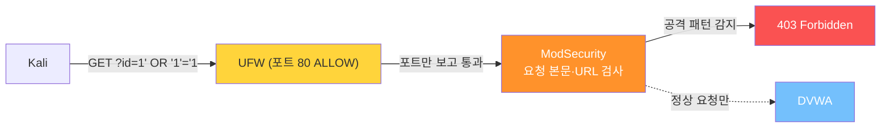
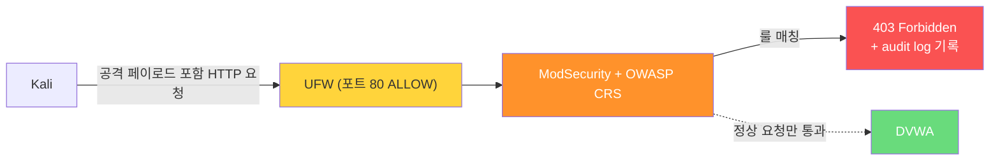
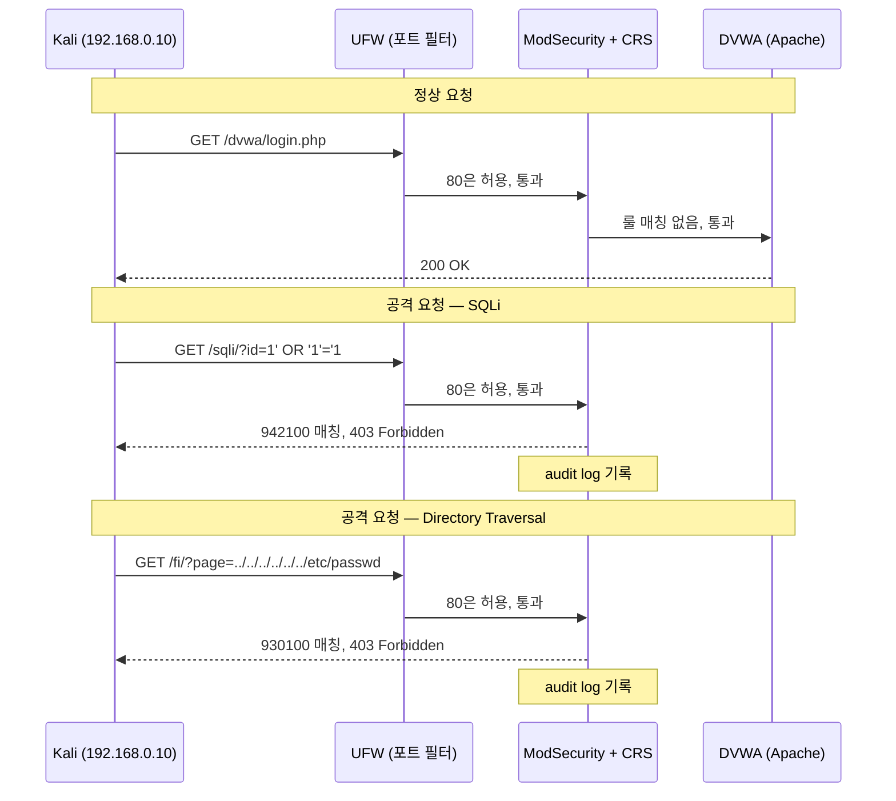
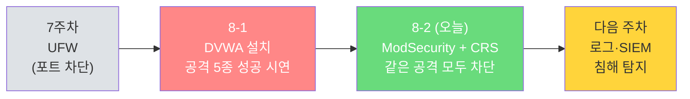

## 실습 환경

| 구분 | 운영체제 | IP 주소 | 역할 |
|------|----------|---------|------|
| 공격자 PC | Kali Linux | 192.168.0.10 | 8-1과 동일한 웹 공격 재시도 |
| 서버 | Ubuntu | 192.168.0.30 | Apache + DVWA + **ModSecurity (오늘 추가)** |

8-1에서 우리는 다섯 가지 웹 공격이 모두 성공하는 모습을 봤습니다. 7주차 방화벽으로는 막을 수 없는 영역이었죠. 8-2에서는 그 공격들을 **WAF(Web Application Firewall)** 로 막아냅니다.

> **오늘의 학습 목표:**
> 1. Apache 위에 **ModSecurity + OWASP Core Rule Set** 을 올린다.
> 2. 8-1에서 통했던 5가지 공격을 그대로 다시 시도해서 **403 Forbidden** 으로 차단되는 걸 본다.
> 3. WAF 로그(`modsec_audit.log`)에서 "어떤 룰이 어떤 공격을 잡았는가" 를 추적한다.
> 4. 거짓 양성(False Positive) 처리 — 실무에서 가장 손이 많이 가는 영역을 맛본다.
{: .prompt-info }

---

## 왜 ModSecurity·OWASP CRS인가?

### 1. WAF가 방화벽이 못 본 곳을 본다



| 검사 단위 | 도구 | 막는 것 |
|----------|------|--------|
| 패킷의 **포트·IP** | UFW (7주차) | 닫혀야 할 포트로 들어오는 연결 |
| HTTP 요청의 **URL·헤더·본문** | **ModSecurity (오늘)** | 공격 페이로드 (SQLi, XSS, ...) |
| 애플리케이션 코드 자체 | (개발자) | 코드 안에서의 입력 검증·이스케이프 |

다층 방어(Defense in Depth)의 두 번째 층입니다.

### 2. ModSecurity와 OWASP CRS는 사실상 표준

| 도구 | 특징 |
|------|------|
| **ModSecurity** | 가장 널리 쓰이는 오픈소스 WAF 엔진. Apache·Nginx·IIS에 모듈로 붙음. |
| **OWASP Core Rule Set (CRS)** | ModSecurity가 사용하는 **공격 탐지 규칙 모음집**. 전 세계 보안 전문가들이 함께 유지보수. |

ModSecurity는 "검사하는 엔진" 이고, OWASP CRS는 "무엇을 검사할지 적은 규칙집" 입니다. 둘은 짝으로 사용됩니다.

### 3. 클라우드 시대의 WAF — 같은 사고방식

| 위치 | 이름 | 본질 |
|------|------|------|
| 직접 운영 (오늘 배움) | ModSecurity + OWASP CRS | Apache 모듈로 동작 |
| AWS | AWS WAF | 관리형 WAF, 같은 종류 룰셋 사용 |
| Cloudflare | Cloudflare WAF | CDN 단에서 차단 |
| Google Cloud | Cloud Armor | 동일 개념 |

이름은 달라도 모두 **"HTTP 요청 본문에서 공격 패턴 검출 → 차단"** 이라는 같은 원리입니다. 오늘 배우는 사고방식이 그대로 통합니다.

---

## Part 0. 시작 전 확인 — 8-1 상태 점검

8-1에서 만든 DVWA가 그대로 살아 있어야 합니다.

```bash
# Ubuntu에서 실행
sudo systemctl is-active apache2 mysql
# 두 줄 모두 active 가 나와야 함
```

```bash
# Kali에서 — DVWA 로그인 페이지 보이는지
curl -I http://192.168.0.30/dvwa/login.php
# HTTP/1.1 200 OK 또는 302 가 나오면 정상
```

```bash
# (선택) Kali 브라우저에서 DVWA 접속해서 보안 레벨이 Low인지 확인
# http://192.168.0.30/dvwa/security.php
```

확인 끝났으면 8-1에서 통한 공격을 한 번만 다시 보고 갑니다 — **WAF 적용 후와 비교** 하기 위해서.

```bash
# Kali 브라우저에서
# http://192.168.0.30/dvwa/vulnerabilities/sqli/?id=1' OR '1'='1&Submit=Submit
# → 모든 사용자 데이터가 보여야 정상 (= 8-1 공격 그대로 통함)
```

---

## Part 1. ModSecurity 설치

Ubuntu에는 ModSecurity v2 패키지가 이미 들어 있습니다(공식 저장소). 한 줄 설치입니다.

### 1.1 설치

```bash
# Ubuntu에서 실행
sudo apt update

sudo apt install -y libapache2-mod-security2
# libapache2-mod-security2 : Apache용 ModSecurity v2 모듈
# 설치하면서 자동으로 Apache 모듈로 활성화됩니다.
```

```bash
# 모듈 활성화 확인
sudo apachectl -M | grep -i security
# security2_module (shared) 같은 줄이 보이면 정상
```

### 1.2 ModSecurity의 두 가지 모드

ModSecurity는 두 가지 모드로 동작합니다.

| 모드 | 동작 | 언제 |
|------|------|------|
| **DetectionOnly** | 공격을 감지만 하고 **로그만 남김**. 실제 차단은 안 함 | 처음 도입할 때 — 거짓 양성 파악용 |
| **On (활성)** | 감지 + **403으로 차단** | 안정화된 후 |

> **실무에서는 거의 항상 DetectionOnly로 시작합니다.** 처음부터 차단 모드로 켜면 정상 사용자 요청까지 막혀서 사이트가 깨집니다(False Positive). 며칠~몇 주 모니터링해서 "이건 정상인데 룰이 잘못 잡았다" 항목들을 예외 처리한 후, 비로소 On으로 전환하는 게 정석입니다.
{: .prompt-info }

오늘은 학습 목적이라 처음부터 **On** 으로 켜고 차단 모습을 봅니다.

### 1.3 ModSecurity 설정 파일 만들기

설치 직후에는 `recommended` 라는 샘플 설정 파일만 있고, 실제 사용 파일은 없습니다. 복사해서 씁니다.

```bash
# Ubuntu에서 실행
sudo cp /etc/modsecurity/modsecurity.conf-recommended \
        /etc/modsecurity/modsecurity.conf
# .conf-recommended : 배포 샘플
# .conf             : 실제 사용 파일 — Apache가 이 이름으로 읽음
```

```bash
# 모드를 On으로 변경
sudo sed -i 's/^SecRuleEngine DetectionOnly/SecRuleEngine On/' \
        /etc/modsecurity/modsecurity.conf
# sed -i : 파일을 직접 편집
# DetectionOnly → On 으로 한 줄 치환

# 변경 확인
grep "^SecRuleEngine" /etc/modsecurity/modsecurity.conf
# 출력: SecRuleEngine On
```

> **`SecRuleEngine On` 의 의미:**
> 매칭된 룰의 액션을 실제로 수행한다 → 룰이 `deny` 면 진짜로 차단.
> `DetectionOnly` 면 같은 매칭이 일어나도 감지·로깅만 하고 통과시킵니다.
{: .prompt-tip }

---

## Part 2. OWASP Core Rule Set 설치

ModSecurity는 엔진이고, **무엇이 공격인지** 를 알려주는 룰셋이 따로 필요합니다. Ubuntu 저장소에도 `modsecurity-crs` 패키지가 있지만 **버전·경로가 배포판마다 달라서** 학습 환경에서는 GitHub에서 직접 받는 게 가장 예측 가능합니다.

### 2.1 OWASP CRS 받기 (GitHub clone)

```bash
# Ubuntu에서 실행
sudo apt install -y git    # 7주차에서 깔았다면 건너뛰어도 됨

# /etc/modsecurity/ 아래 crs 폴더로 받기
sudo git clone https://github.com/coreruleset/coreruleset.git /etc/modsecurity/crs
# coreruleset : OWASP CRS 공식 저장소
# /etc/modsecurity/crs : 우리가 정한 위치 (이 경로를 Apache에 알려줄 것)
```

```bash
# 룰 파일 확인
ls /etc/modsecurity/crs/rules/ | head
# REQUEST-901-INITIALIZATION.conf
# REQUEST-905-COMMON-EXCEPTIONS.conf
# REQUEST-911-METHOD-ENFORCEMENT.conf
# REQUEST-913-SCANNER-DETECTION.conf
# REQUEST-920-PROTOCOL-ENFORCEMENT.conf
# REQUEST-921-PROTOCOL-ATTACK.conf
# REQUEST-930-APPLICATION-ATTACK-LFI.conf       ← Directory Traversal 룰
# REQUEST-931-APPLICATION-ATTACK-RFI.conf
# REQUEST-932-APPLICATION-ATTACK-RCE.conf       ← Command Injection 룰
# REQUEST-933-APPLICATION-ATTACK-PHP.conf
# REQUEST-941-APPLICATION-ATTACK-XSS.conf       ← XSS 룰
# REQUEST-942-APPLICATION-ATTACK-SQLI.conf      ← SQL Injection 룰
# ...
```

각 파일의 번호와 이름이 의미 있습니다 — 어떤 종류의 공격을 잡는지 한눈에 보입니다.

### 2.2 CRS 설정 파일 준비

CRS 저장소에는 `crs-setup.conf.example` 라는 템플릿이 들어 있습니다. 복사해서 실제 사용 파일로 만듭니다.

```bash
# Ubuntu에서 실행
sudo cp /etc/modsecurity/crs/crs-setup.conf.example \
        /etc/modsecurity/crs/crs-setup.conf
# .example (배포 템플릿) → 실사용 파일
# 기본 설정 그대로 써도 동작합니다. 차단 점수·익명 모드 등을 조정하려면 이 파일을 편집.
```

### 2.3 Apache가 ModSecurity + CRS를 읽게 만들기

`/etc/apache2/mods-enabled/security2.conf` 파일이 ModSecurity 모듈 설정의 진입점입니다. 여기에 CRS 룰을 포함시킵니다.

```bash
# Ubuntu에서 현재 내용 확인
sudo cat /etc/apache2/mods-enabled/security2.conf
```

기본 출력에 다음과 비슷한 줄이 있을 겁니다:

```apache
<IfModule security2_module>
    SecDataDir /var/cache/modsecurity
    IncludeOptional /etc/modsecurity/*.conf
</IfModule>
```

> **여기서 주의:** `IncludeOptional /etc/modsecurity/*.conf` 가 이미 있으면, 그 한 줄이 `/etc/modsecurity/modsecurity.conf` 만 자동으로 끌어옵니다 (확장자가 `.conf` 인 파일만). CRS 룰은 별도로 명시해야 합니다. 그리고 **CRS의 `crs-setup.conf` 가 룰보다 먼저 로드**되어야 변수가 정의되니 순서가 중요합니다.
{: .prompt-warning }

```bash
# 백업 먼저
sudo cp /etc/apache2/mods-enabled/security2.conf \
        /etc/apache2/mods-enabled/security2.conf.bak

# 편집
sudo nano /etc/apache2/mods-enabled/security2.conf
```

`</IfModule>` 줄 **바로 위** 에 다음 두 줄을 추가합니다:

```apache
    IncludeOptional /etc/modsecurity/crs/crs-setup.conf
    IncludeOptional /etc/modsecurity/crs/rules/*.conf
```

최종 모습 (예시):

```apache
<IfModule security2_module>
    SecDataDir /var/cache/modsecurity
    IncludeOptional /etc/modsecurity/*.conf
    IncludeOptional /etc/modsecurity/crs/crs-setup.conf
    IncludeOptional /etc/modsecurity/crs/rules/*.conf
</IfModule>
```

저장 (Ctrl+O, Enter, Ctrl+X).

> **포함 순서가 중요합니다.**
> 1. `modsecurity.conf` (엔진 설정, On 모드)
> 2. `crs-setup.conf` (룰셋 전체 설정 — 차단 점수, 익명 모드 등)
> 3. `rules/*.conf` (실제 공격 탐지 룰 수백 개)
>
> 순서가 뒤바뀌면 변수가 정의되지 않은 채 룰이 로드되어 에러가 납니다.
{: .prompt-warning }

### 2.4 Apache 설정 검사 + 재시작

```bash
# Ubuntu에서 실행
sudo apachectl configtest
# 출력에 "Syntax OK" 가 보여야 정상
# 만약 에러가 나면 메시지의 줄 번호를 보고 수정
```

```bash
sudo systemctl restart apache2
sudo systemctl status apache2
# active (running) 확인
```

### 2.5 ModSecurity가 동작하는지 살아있는 검증

가장 빠른 검증은 **명백한 공격 패턴**을 URL에 실어 보내는 것입니다.

```bash
# Kali에서 실행 — UNION SELECT 패턴 (SQLi 룰 942.x 가 잡음)
curl -s -o /dev/null -w "HTTP %{http_code}\n" \
     "http://192.168.0.30/?id=1+UNION+SELECT+1,2,3"
# -s          : 진행 표시 끄기
# -o /dev/null : 응답 본문 버리기
# -w          : 응답 코드만 출력
# +           : URL 인코딩된 공백
# 예상 출력: HTTP 403
```

```bash
# 한 가지 더 — XSS 패턴
curl -s -o /dev/null -w "HTTP %{http_code}\n" \
     "http://192.168.0.30/?x=%3Cscript%3Ealert(1)%3C/script%3E"
# %3C : URL 인코딩된 <
# %3E : URL 인코딩된 >
# 예상 출력: HTTP 403
```

두 시도 모두 `HTTP 403` 이 나오면 WAF가 살아 있는 것입니다. `200` 이 나오면 설정 문제이므로 §7 트러블슈팅으로.

---

## Part 3. 공격 ↔ 방어 검증 — 8-1과 같은 공격 다시 시도

이제 본 무대입니다. 8-1에서 통했던 공격을 그대로 다시 시도합니다.

> **공통 안내:** 아래 시도는 DVWA에 로그인된 상태여야 의미가 있습니다. 브라우저로 먼저 `http://192.168.0.30/dvwa/login.php` 에 admin/password로 로그인 후, 같은 브라우저에서 아래 URL을 주소창에 입력하세요. 빠른 검증을 원하면 8-1 §4.6의 curl 자동화를 응용해도 됩니다(403이면 차단 성공).
{: .prompt-tip }

### 3.1 공격 ① SQL Injection 재시도

**Kali 브라우저 주소창에 입력:**

```
http://192.168.0.30/dvwa/vulnerabilities/sqli/?id=1' OR '1'='1&Submit=Submit
```

브라우저가 자동으로 URL 인코딩하므로 실제로는 `?id=1%27+OR+%271%27%3D%271` 형태로 전송됩니다.

**예상 결과:**

```
403 Forbidden

You don't have permission to access this resource.
```

8-1에서 모든 사용자 정보가 줄줄이 나왔던 자리에서, 이번엔 페이지가 통째로 막혔습니다.

```bash
# Kali에서 curl로도 검증 (로그인 쿠키가 /tmp/cookie.txt 에 있다고 가정)
curl -b /tmp/cookie.txt -s -o /dev/null -w "HTTP %{http_code}\n" \
  "http://192.168.0.30/dvwa/vulnerabilities/sqli/?id=1%27+OR+%271%27%3D%271&Submit=Submit"
# 결과: HTTP 403
```

> **무엇이 잡았는가:** OWASP CRS의 SQL Injection 룰셋(번호 942.x). `' OR '1'='1` 같은 패턴이 해당 룰에 매칭되어 차단됩니다.
{: .prompt-info }

### 3.2 공격 ② UNION SELECT 시도

브라우저 주소창에:

```
http://192.168.0.30/dvwa/vulnerabilities/sqli/?id=1' UNION SELECT user,password FROM users-- &Submit=Submit
```

→ **403 Forbidden**. `UNION SELECT` 패턴 자체가 룰에 잡힙니다(942.x).

### 3.3 공격 ③ XSS 재시도

브라우저 주소창에:

```
http://192.168.0.30/dvwa/vulnerabilities/xss_r/?name=<script>alert('XSS!')</script>
```

→ **403 Forbidden**. OWASP CRS의 XSS 룰셋(번호 941.x)이 잡습니다.

### 3.4 공격 ④ Command Injection 재시도

DVWA의 Command Injection 페이지(`/dvwa/vulnerabilities/exec/`)에 들어가서 입력란에:

```
127.0.0.1; whoami
```

입력하고 Submit → 페이지가 **403 Forbidden** 으로 바뀌거나 비정상 응답을 받습니다(룰셋 932.x). 8-1에서 `www-data` 가 출력되던 자리가 막혔습니다.

> Command Injection은 POST 요청이라 브라우저에서 직접 `Submit` 을 눌러야 합니다. URL 입력만으로는 시연이 안 됩니다.
{: .prompt-tip }

### 3.5 공격 ⑤ Directory Traversal 재시도

브라우저 주소창에 (8-1에서 본 두 가지 형태 모두 시도):

```
http://192.168.0.30/dvwa/vulnerabilities/fi/?page=../../../../../../etc/passwd
http://192.168.0.30/dvwa/vulnerabilities/fi/?page=/etc/passwd
```

→ 둘 다 **403 Forbidden**. OWASP CRS의 LFI 룰셋(번호 930.x)이 `../` 패턴과 `/etc/passwd` 같은 의심 경로를 둘 다 잡습니다.

```bash
# curl로 검증
curl -b /tmp/cookie.txt -s -o /dev/null -w "HTTP %{http_code}\n" \
  "http://192.168.0.30/dvwa/vulnerabilities/fi/?page=../../../../../../etc/passwd"
# 결과: HTTP 403
```

### 3.6 결과 종합 — 공격 ↔ 방어 매핑

| 공격 | 8-1 결과 (WAF 없음) | 8-2 결과 (WAF 적용) | 잡은 룰셋 |
|------|---------------------|---------------------|-----------|
| SQL Injection (`' OR '1'='1`) | 모든 사용자 노출 | **403 Forbidden** | REQUEST-942 (SQLI) |
| UNION SELECT 비밀번호 해시 추출 | 해시 노출 | **403 Forbidden** | REQUEST-942 (SQLI) |
| XSS (`<script>alert()</script>`) | alert 실행 | **403 Forbidden** | REQUEST-941 (XSS) |
| Command Injection (`; whoami`) | `www-data` 노출 | **403 Forbidden** | REQUEST-932 (RCE) |
| Directory Traversal (`../../../../../../etc/passwd` 또는 `/etc/passwd`) | passwd 노출 | **403 Forbidden** | REQUEST-930 (LFI) |



> **인사이트:** 우리는 DVWA의 PHP 코드를 **한 줄도 고치지 않았습니다.** 그런데도 공격이 막힙니다. 이게 WAF의 가치입니다. 취약한 코드가 있어도, 코드를 못 고치는 상황(레거시·서드파티 등)에서도 외곽에서 막아 줍니다.
{: .prompt-info }

---

## Part 4. WAF 로그 분석 — 누가 무엇으로 잡혔나

WAF가 막았다는 건 결과만 보이는 것이고, 진짜 가치는 **로그**에 있습니다. 어떤 룰이, 어떤 패턴을, 어떤 IP에서, 언제 잡았는지가 기록됩니다.

### 4.1 ModSecurity의 두 가지 로그

| 로그 파일 | 내용 |
|----------|------|
| `/var/log/apache2/error.log` | 차단 시 한 줄 요약 |
| `/var/log/apache2/modsec_audit.log` | 매우 자세한 감사 로그 (전체 요청·응답·매칭 룰) |

### 4.2 빠른 확인 — error.log

```bash
# Ubuntu에서 실행
sudo tail -20 /var/log/apache2/error.log | grep ModSecurity
```

출력 예 (한 줄을 줄바꿈해서 보기 쉽게):

```
[Mon Mar 26 ... ] [security2:error] [pid 1234]
  [client 192.168.0.10] ModSecurity: Access denied with code 403
  (phase 2). Matched "Operator `Rx' with parameter
  `(?i:(\bunion\b\s+\bselect\b))' against variable `ARGS:id'"
  [file "/usr/share/modsecurity-crs/rules/REQUEST-942-APPLICATION-ATTACK-SQLI.conf"]
  [line "47"] [id "942100"] [msg "SQL Injection Attack Detected"]
  ...
  [hostname "192.168.0.30"] [uri "/dvwa/vulnerabilities/sqli/"]
```

읽는 법:

| 항목 | 의미 |
|------|------|
| `client 192.168.0.10` | 공격 출발지 (Kali) |
| `Matched "Operator..."` | 어떤 정규식과 매칭되었는가 |
| `against variable ARGS:id` | URL 파라미터 `id` 값에서 매칭됨 |
| `file ".../REQUEST-942-...SQLI.conf"` | 어떤 룰 파일에서 잡혔는지 |
| `id "942100"` | 룰 ID — 디버깅·예외 처리할 때 키 |
| `msg "SQL Injection Attack Detected"` | 사람이 읽기 쉬운 설명 |

### 4.3 자세한 감사 로그 — modsec_audit.log

```bash
sudo tail -100 /var/log/apache2/modsec_audit.log
```

이 로그는 매우 깁니다. 한 차단 사건마다 트랜잭션 ID(예: `abc123def`)가 붙은 섹션 마커들로 묶여서 기록됩니다:

| 섹션 마커 | 내용 |
|----------|------|
| `--<id>-A--` | 헤더 (시간, IP, 트랜잭션 ID) |
| `--<id>-B--` | 요청 헤더 |
| `--<id>-C--` | 요청 본문 |
| `--<id>-F--` | 응답 헤더 |
| `--<id>-H--` | 매칭된 룰 정보 ← 가장 자주 보는 부분 |
| `--<id>-Z--` | 끝 |

`<id>` 자리에 같은 트랜잭션 ID가 들어가서 한 사건의 섹션들을 묶어 줍니다.

```bash
# 특정 룰 ID로만 필터
sudo grep -B2 -A20 "id \"942100\"" /var/log/apache2/modsec_audit.log | tail -30
```

> **인사이트:** 이 로그가 **사고 분석(forensics)** 의 출발점입니다. 침해사고가 발생하면 가장 먼저 보는 게 WAF·웹 서버 로그입니다. "공격자가 어떤 페이로드로 들어왔는가" 의 1차 단서가 여기 있습니다.
{: .prompt-info }

### 4.4 차단 카운트 보기 — 한눈에

```bash
# 최근 차단된 룰 ID 빈도 순으로 보기
sudo grep "ModSecurity: Access denied" /var/log/apache2/error.log \
  | grep -oP 'id "\K[0-9]+' \
  | sort | uniq -c | sort -rn
```

출력 예:

```
     12 942100   ← SQL Injection 12번
      8 941100   ← XSS 8번
      5 932100   ← RCE 5번
      3 930100   ← LFI 3번
```

이 한 줄이 "**우리 서버가 어떤 종류의 공격을 가장 많이 받고 있는가**" 를 알려줍니다.

---

## Part 5. False Positive (거짓 양성) 다루기

WAF의 가장 큰 운영 어려움입니다. **정상 사용자 요청을 공격으로 오인** 하는 경우가 적지 않습니다.

### 5.1 거짓 양성이란

| 상황 | 예시 |
|------|------|
| 게시판에 코드 설명 글 작성 | `SELECT * FROM users` 같은 문구 → SQLi 룰 매칭 |
| HTML 강의 자료 업로드 | `<script>` 태그 → XSS 룰 매칭 |
| 파일명에 한자·특수문자 | 인코딩 룰 매칭 |
| 보안 회사가 운영하는 사이트의 정상 콘텐츠 자체 | 위 모든 것 |

> WAF 도입 후 운영팀이 가장 많이 듣는 컴플레인이 "갑자기 페이지가 403 떠요" 입니다. 거의 다 거짓 양성이 원인입니다.
{: .prompt-warning }

### 5.2 거짓 양성 해결의 두 가지 길

**길 1. 특정 룰을 끄기 (가장 간단)**

```bash
# 예: 룰 942100 (SQLi 기본 룰) 을 게시판 페이지에서만 끄기
# 파일 위치는 CRS 룰 폴더 안 — 알파벳 순으로 룰보다 뒤에 로드됨
sudo nano /etc/modsecurity/crs/rules/zzz-local-exclusions.conf
```

내용:

```apache
<LocationMatch "^/board/write">
    SecRuleRemoveById 942100
</LocationMatch>
```

> **파일 이름이 `zzz-` 로 시작하는 이유:** Apache가 `IncludeOptional ... /rules/*.conf` 로 룰 파일들을 알파벳 순으로 읽기 때문에, 예외 처리 파일이 다른 룰들(`REQUEST-...`, `RESPONSE-...`) 보다 **뒤에 로드**되어야 `SecRuleRemoveById` 가 제대로 동작합니다. 그래서 이름을 `zzz-` 로 시작해 마지막에 오게 합니다.
{: .prompt-tip }

**길 2. 특정 매개변수만 검사 제외**

같은 파일에 추가하거나 별도 파일에 작성:

```apache
SecRuleUpdateTargetById 942100 "!ARGS:content"
# 룰 942100 에서 ARGS:content 만 검사 안 함
```

저장 후:

```bash
sudo apachectl configtest
sudo systemctl reload apache2
```

### 5.3 운영 팁 — 학습용 vs 운영용

| 단계 | 권장 모드 |
|------|----------|
| 처음 도입 | `DetectionOnly` 로 1~2주 모니터링 |
| 거짓 양성 분석 | error.log·audit_log 보면서 예외 룰 작성 |
| 안정화 후 | `On` 으로 전환 |
| 새 기능 배포 시 | 다시 DetectionOnly 권장 |

> **인사이트:** WAF는 "켜면 끝" 도구가 아닙니다. **꾸준히 손이 가는 도구**입니다. 거짓 양성을 다루는 비용 vs 실제 공격을 막아주는 가치 — 이 균형이 운영의 핵심입니다.
{: .prompt-info }

---

## Part 6. WAF 동작 한눈에 보기

지금까지 만든 구조의 패킷 흐름을 정리합니다.



---

## Part 7. 자주 만나는 문제 (트러블슈팅)

### 문제 1. `apachectl configtest` 가 에러를 낸다

```
AH00526: Syntax error on line ...
```

원인 대부분: 룰 파일 경로가 환경과 다름. `find /usr/share /etc -name "*.conf" -path "*modsecurity*"` 로 실제 경로 확인 후 `security2.conf` 경로 수정.

### 문제 2. `403 Forbidden` 이 안 떠요 (공격이 그대로 통함)

체크 순서:

```bash
# 1) ModSecurity 모듈이 로드돼 있나?
sudo apachectl -M | grep security
# security2_module 보여야 함

# 2) SecRuleEngine 이 On 인가?
grep "^SecRuleEngine" /etc/modsecurity/modsecurity.conf
# On 이어야 함

# 3) CRS 룰이 로드되고 있나?
sudo grep "Include" /etc/apache2/mods-enabled/security2.conf
# crs-setup.conf 와 rules/*.conf 가 있어야 함

# 4) Apache 재시작했나?
sudo systemctl restart apache2
```

### 문제 3. 정상 페이지까지 다 막혀요

거짓 양성입니다. 임시로 DetectionOnly로 돌려서 정상 사용 가능하게 한 후, 로그 분석:

```bash
sudo sed -i 's/^SecRuleEngine On/SecRuleEngine DetectionOnly/' \
        /etc/modsecurity/modsecurity.conf
sudo systemctl reload apache2
```

이후 로그를 분석해 §5의 예외 처리 적용 → 다시 On.

### 문제 4. 차단됐는데 로그에 없음

ModSecurity의 audit log 동작 모드를 확인:

```bash
grep "^SecAuditEngine" /etc/modsecurity/modsecurity.conf
# RelevantOnly 가 기본 — "관심 있는 트랜잭션만"
# 모든 요청을 다 보고 싶으면 잠시 On 으로:
#   SecAuditEngine On
```

---

## Part 8. 실무 인사이트

### 8.1 자체 운영 WAF vs 관리형 WAF

| 옵션 | 특징 | 비용 |
|------|------|------|
| 자체 운영 (오늘 배운 것) | 모든 룰 직접 관리, 완전 제어 | 인건비·운영 시간 큼 |
| AWS WAF / Cloudflare WAF | 관리형, 룰셋 자동 업데이트 | 트래픽당 과금 |
| Akamai / F5 등 상용 | 엔터프라이즈급, 24시간 지원 | 매우 비쌈 |

> **선택 기준:** 트래픽이 크지 않고 학습·소규모 서비스라면 ModSecurity. 글로벌 서비스라면 Cloudflare 같은 CDN+WAF. 큰 기업이라면 다층(자체 + 상용) 조합.
{: .prompt-tip }

### 8.2 WAF가 못 막는 영역 — 그 다음 단계

WAF도 만능이 아닙니다.

| 공격 종류 | WAF로 막힘? | 진짜 막아주는 것 |
|-----------|------------|-----------------|
| SQLi, XSS, RCE 같은 페이로드 공격 | ✅ | WAF (오늘) |
| 브루트포스 로그인 (정상 로그인 흉내) | △ (rate limit으로 부분적) | Fail2Ban, MFA |
| 비즈니스 로직 결함 (가격 0원으로 결제) | ❌ | 코드 검증 + 보안 테스트 |
| 인증된 사용자가 정상 권한으로 데이터 접근 (내부자) | ❌ | 권한 분리, 감사 로그 |
| 대규모 DDoS | △ (CDN 함께 필요) | DDoS 방어 서비스 |

> **다층 방어의 진짜 모습:** UFW(7주차) + WAF(8주차) + 인증·세션 관리 + 코드 보안 + 모니터링·로그. 어느 한 층만으로는 부족합니다. 매주 한 층씩 쌓아 올리는 게 이 강의의 큰 그림입니다.
{: .prompt-info }

### 8.3 WAF 운영 체크리스트 (현장에서 자주 쓰는)

| 체크 | 빈도 |
|------|------|
| `error.log` 에서 차단 빈도 변화 확인 | 매일 |
| 룰셋(OWASP CRS) 업데이트 적용 | 분기 1회 |
| False Positive 컴플레인 처리 | 발생 즉시 |
| DetectionOnly로 새 룰 테스트 후 On 전환 | 룰 추가 시마다 |
| audit log 디스크 사용량 점검 | 주 1회 |

---

## Part 9. 셀프체크

### 객관식 (각 1점)

**Q1.** ModSecurity의 두 가지 동작 모드 중 "감지만 하고 차단은 하지 않는" 모드는?

① On
② Active
③ DetectionOnly
④ LogOnly

---

**Q2.** OWASP CRS의 룰 파일 이름 `REQUEST-942-APPLICATION-ATTACK-SQLI.conf` 에서 942가 의미하는 것은?

① 룰의 우선순위
② 차단 코드(403, 404 등)
③ SQL Injection을 다루는 룰셋 그룹 번호
④ ModSecurity 버전

---

**Q3.** 7주차 UFW 방화벽이 막을 수 없고, 8주차 WAF가 막을 수 있는 공격은?

① 외부에서 MySQL(3306) 직접 접근
② 닫힌 RDP(3389) 정찰
③ 80번 포트로 들어오는 SQL Injection
④ ICMP 호스트 발견

---

**Q4.** WAF 로그에서 가장 먼저 확인해야 할 정보가 아닌 것은?

① 출발지 IP
② 매칭된 룰 ID
③ 요청한 URL
④ 서버의 디스크 사용량

---

**Q5.** WAF 운영에서 "거짓 양성(False Positive)" 이란?

① 공격을 놓친 경우
② 정상 요청을 공격으로 오인한 경우
③ 로그가 너무 많이 쌓이는 경우
④ 룰 업데이트 실패

---

### 단답형 (각 2점)

**Q6.** ModSecurity의 모드를 차단(On)에서 감지만(DetectionOnly)으로 바꾸는 이유를 1~2문장으로 쓰시오.

---

**Q7.** 8-1에서 통한 Directory Traversal 공격(`?page=../../../../../../etc/passwd` 또는 `?page=/etc/passwd`)이 8-2에서 막힌 이유를, "룰셋 번호"와 "검사 위치(URL/본문/헤더)" 를 모두 포함해서 설명하시오.

---

**Q8.** 다음 OWASP CRS 룰셋 번호와 막아주는 공격 종류를 짝지으시오.

```
( ) 930   - (a) Command Injection (RCE)
( ) 932   - (b) XSS
( ) 941   - (c) Local File Inclusion / Directory Traversal
( ) 942   - (d) SQL Injection
```

---

**Q9.** "WAF만 잘 설치하면 웹 서버는 안전하다" 는 주장이 왜 틀린지, **다층 방어** 관점에서 막을 수 없는 공격 예시 한 가지를 들어 설명하시오.

---

### 정답

| 번호 | 정답 | 해설 |
|------|------|------|
| Q1 | ③ | DetectionOnly = 감지·로그만, 차단 안 함 |
| Q2 | ③ | 942번대는 SQLi 룰셋 그룹 |
| Q3 | ③ | 80은 허용된 포트 → 본문 페이로드는 방화벽이 못 봄 → WAF 영역 |
| Q4 | ④ | 디스크 사용량은 시스템 모니터링 영역, WAF 분석에서는 후순위 |
| Q5 | ② | 정상 요청 오인 — 운영의 가장 큰 골칫거리 |
| Q6 | 처음 도입 시 거짓 양성 파악을 위해. 차단 모드에서 정상 요청까지 막혀 사이트가 깨지는 걸 막기 위해 |
| Q7 | 룰셋 930(LFI/Directory Traversal). URL 파라미터(ARGS:page) 본문에서 `../` 패턴이 검출돼 차단됨 |
| Q8 | 930→c, 932→a, 941→b, 942→d |
| Q9 | 비즈니스 로직 결함(예: 결제 가격 변조), 정상 인증 후 권한 남용, 대규모 DDoS 등은 WAF가 못 막음. 코드 보안·권한 분리·DDoS 대응 등 다른 계층의 방어가 함께 필요 |

---

## 8주차 정리



**오늘 배운 핵심**

1. **WAF는 방화벽이 못 본 곳을 본다.** 패킷의 IP/포트가 아니라 HTTP 본문·URL을 검사한다.
2. **OWASP CRS는 사실상 표준 룰셋.** 942=SQLi, 941=XSS, 932=RCE, 930=LFI/Directory Traversal.
3. **DetectionOnly로 시작해 On으로 전환** 하는 게 운영 정석. 거짓 양성을 먼저 잡고.
4. **WAF도 다층 방어의 한 층.** 코드를 못 고치는 상황에서 외곽 보호. 단, 비즈니스 로직 결함은 못 막음.
5. **로그가 가치를 만든다.** WAF는 막아주는 도구이자 동시에 **침해사고 분석의 1차 단서** 다.

**다음 주차 예고:** 방어 도구(UFW·WAF)를 두 층 쌓았으니, 이제 그 도구들이 남기는 **로그를 모아 사고를 탐지** 하는 단계로 넘어갑니다. WAF 로그·SSH 로그·시스템 로그가 어떻게 모여서 "공격이 진행되고 있다" 는 신호로 변하는지 — 그게 SIEM의 출발점입니다.

---

## ⚠️ 실습 종료 후 정리

DVWA는 그대로 두면 위험합니다. 다음 중 하나를 권장:

```bash
# (가벼운) Apache만 끄기
sudo systemctl stop apache2

# (권장) DVWA 폴더만 제거
sudo rm -rf /var/www/html/dvwa

# (가장 안전) VM 스냅샷 복원
```

ModSecurity 설정·룰셋은 그대로 두면 됩니다 — 다른 정상 웹 서비스를 보호하는 데 그대로 쓸 수 있는 자산입니다.
