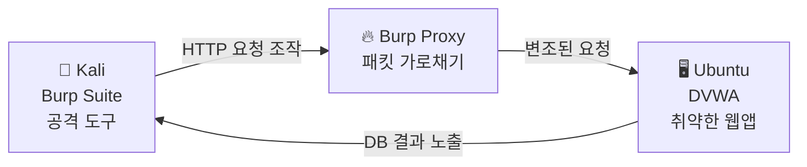
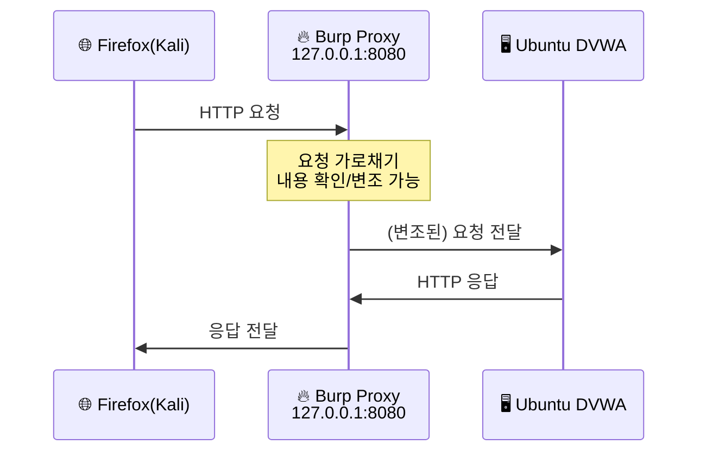
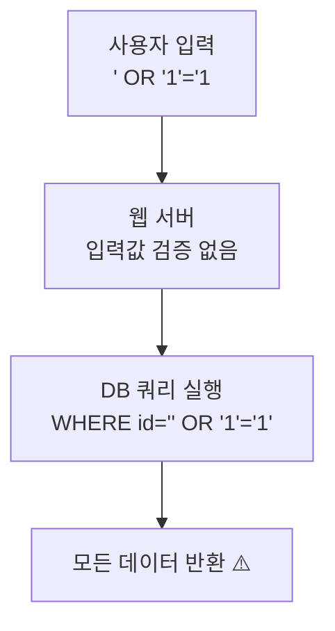
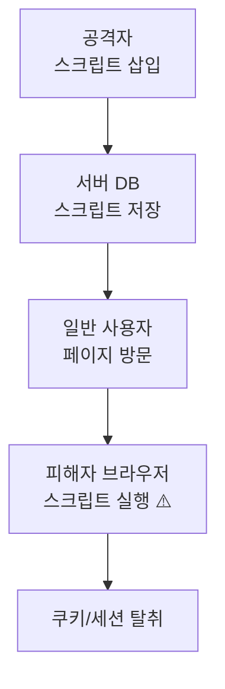
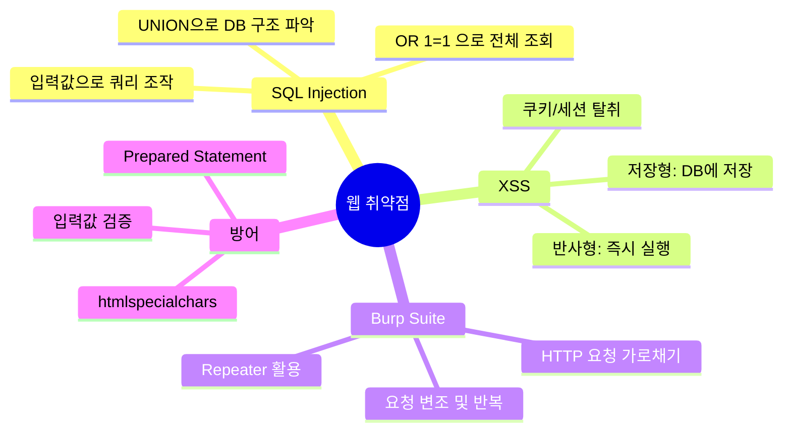

# 웹 취약점 실습 — DVWA & Burp Suite

---

## 실습 환경

| 역할 | OS | IP |
|------|----|----|
| 공격자 | Kali Linux | `192.168.0.10` |
| 웹 서버 | Ubuntu | `192.168.0.30` |

> **주의:** DVWA는 의도적으로 취약하게 만들어진 실습용 웹 애플리케이션입니다. 외부 인터넷에 절대 노출하지 마세요.
{: .prompt-danger }

---

## Part 1. 웹 취약점이란?

### 1.1 OWASP Top 10

**OWASP(Open Worldwide Application Security Project)**는 매년 가장 위험한 웹 취약점 10가지를 발표한다.

| 순위 | 취약점 | 설명 |
|------|--------|------|
| A01 | Broken Access Control | 접근 권한 우회 |
| A02 | Cryptographic Failures | 암호화 실패 |
| **A03** | **Injection** | **SQL Injection, 명령어 주입** |
| A04 | Insecure Design | 안전하지 않은 설계 |
| **A07** | **XSS** | **크로스 사이트 스크립팅** |

이번 실습에서는 **Injection(SQL Injection)**과 **XSS**를 직접 실습한다.

### 1.2 전체 흐름



---

## Part 2. DVWA 설치 (Ubuntu)

### 2.1 사전 조건 확인

8주차에서 Apache와 MySQL을 이미 설치했다. 설치 여부를 확인한다.

```bash
# Apache 상태 확인
sudo systemctl status apache2

# MySQL 상태 확인
sudo systemctl status mysql
```

설치되지 않은 경우 먼저 설치:

```bash
sudo apt update
sudo apt install apache2 mysql-server php php-mysqli php-gd libapache2-mod-php -y
```

### 2.2 PHP 설치 확인

DVWA는 PHP 기반이므로 PHP가 필요하다.

```bash
php -v
```

```
PHP 8.1.2 (cli) ...
```

### 2.3 DVWA 다운로드 및 설치

```bash
# 웹 루트 디렉토리로 이동
cd /var/www/html

# DVWA 다운로드
sudo git clone https://github.com/digininja/DVWA.git dvwa

# 설정 파일 복사
cd /var/www/html/dvwa/config
sudo cp config.inc.php.dist config.inc.php
```

### 2.4 DVWA 설정

```bash
sudo nano /var/www/html/dvwa/config/config.inc.php
```

아래 항목을 확인/수정:

```php
$_DVWA[ 'db_server' ]   = '127.0.0.1';
$_DVWA[ 'db_database' ] = 'dvwa';
$_DVWA[ 'db_user' ]     = 'dvwa';
$_DVWA[ 'db_password' ] = 'p@ssw0rd';
```

### 2.5 MySQL 데이터베이스 준비

```bash
sudo mysql -u root
```

```sql
CREATE DATABASE dvwa;
CREATE USER 'dvwa'@'127.0.0.1' IDENTIFIED BY 'p@ssw0rd';
GRANT ALL PRIVILEGES ON dvwa.* TO 'dvwa'@'127.0.0.1';
FLUSH PRIVILEGES;
EXIT;
```

### 2.6 권한 설정 및 Apache 재시작

```bash
sudo chown -R www-data:www-data /var/www/html/dvwa
sudo chmod -R 755 /var/www/html/dvwa
sudo systemctl restart apache2
```

### 2.7 DVWA 초기화

Kali의 브라우저에서 접속:

```
http://192.168.0.30/dvwa/setup.php
```

페이지 하단의 **"Create / Reset Database"** 버튼 클릭 → 초기화 완료.

로그인 페이지로 이동 후 기본 자격증명으로 로그인:

- ID: `admin`
- PW: `password`

> **보안 레벨 설정:** DVWA Security → **Low** 로 설정하고 실습 시작.
{: .prompt-info }

---

## Part 3. Burp Suite 설정 (Kali)

Burp Suite는 웹 프록시 도구로, 브라우저와 서버 사이의 HTTP 트래픽을 가로채 분석·변조할 수 있다.

### 3.1 Burp Suite 실행

Kali에서 Burp Suite 실행:

```bash
burpsuite &
```

또는 메뉴 → Web Application Analysis → burpsuite

### 3.2 Proxy 설정

1. Burp Suite → **Proxy** 탭 → **Options** → Proxy Listener: `127.0.0.1:8080` 확인
2. Firefox 브라우저 → 설정 → 네트워크 → 프록시 수동 설정:
   - HTTP 프록시: `127.0.0.1`, 포트: `8080`

### 3.3 Intercept 활성화

Proxy → Intercept → **"Intercept is on"** 상태 확인.



---

## Part 4. 실습 1 — SQL Injection

### 4.1 SQL Injection 원리

SQL Injection은 입력값에 SQL 구문을 삽입해 데이터베이스를 조작하는 공격이다.

**정상적인 쿼리:**
```sql
SELECT * FROM users WHERE id = '1';
```

**공격 입력값 `' OR '1'='1`을 넣으면:**
```sql
SELECT * FROM users WHERE id = '' OR '1'='1';
-- '1'='1'은 항상 참 → 모든 사용자 정보 반환
```

### 4.2 DVWA에서 SQL Injection 실습

1. DVWA 메뉴 → **SQL Injection** 클릭
2. User ID 입력란에 아래를 입력:

**입력 1: 정상 조회**
```
1
```
결과: `ID: 1 / First name: admin / Surname: admin`

**입력 2: 모든 사용자 조회**
```
' OR '1'='1
```
결과: 모든 사용자 정보가 출력됨 → DB 내용 노출!

**입력 3: DB 버전 확인**
```
' UNION SELECT null, version() --
```
결과: MySQL 버전 정보 노출.

**입력 4: 테이블 목록 확인**
```
' UNION SELECT null, table_name FROM information_schema.tables --
```

### 4.3 Burp Suite로 SQL Injection 요청 분석

Burp Suite Intercept를 켜고 DVWA에서 ID를 입력하면 HTTP 요청을 가로챌 수 있다.

```
GET /dvwa/vulnerabilities/sqli/?id=1&Submit=Submit HTTP/1.1
Host: 192.168.0.30
...
```

Burp Repeater에서 `id=1` 부분을 `id=' OR '1'='1` 으로 변경해 반복 테스트 가능.



---

## Part 5. 실습 2 — XSS (Cross-Site Scripting)

### 5.1 XSS 원리

XSS는 웹 페이지에 악성 스크립트를 삽입해 다른 사용자의 브라우저에서 실행시키는 공격이다.

**반사형 XSS (Reflected XSS):** 입력값이 즉시 응답에 반영되는 경우.

### 5.2 DVWA에서 XSS 실습

1. DVWA 메뉴 → **XSS (Reflected)** 클릭
2. 이름 입력란에 아래를 입력:

**입력 1: 기본 팝업 테스트**
```html
<script>alert('XSS 공격 성공!')</script>
```
결과: 브라우저에 팝업 창이 뜸 → 스크립트 실행 확인.

**입력 2: 쿠키 탈취 시뮬레이션**
```html
<script>alert(document.cookie)</script>
```
결과: 현재 세션 쿠키 값이 팝업으로 표시됨.

> **실제 공격에서는:** 쿠키를 공격자 서버로 전송하는 스크립트를 삽입해 세션을 탈취한다. 이 실습에서는 팝업으로만 확인한다.
{: .prompt-warning }

### 5.3 저장형 XSS (Stored XSS)

1. DVWA 메뉴 → **XSS (Stored)** 클릭
2. 방명록 Name/Message에 스크립트 삽입:

```html
<script>alert('저장형 XSS!')</script>
```

결과: 방명록 페이지를 방문할 때마다 스크립트가 실행됨 → 모든 방문자에게 영향.



---

## Part 6. 보안 레벨별 방어 확인

DVWA Security 레벨을 변경하며 방어 코드를 직접 비교한다.

### 6.1 Low vs Medium vs High 비교

DVWA → Security → 레벨 변경 후 동일한 공격 시도.

| 보안 레벨 | SQL Injection 결과 | XSS 결과 | 방어 방식 |
|-----------|-------------------|----------|-----------|
| **Low** | 성공 (무방어) | 성공 | 없음 |
| **Medium** | 일부 차단 | 일부 차단 | 키워드 필터링 (우회 가능) |
| **High** | 차단 | 차단 | Prepared Statement, htmlspecialchars |

### 6.2 소스 코드 비교

DVWA 각 페이지 우측 하단 **"View Source"** 버튼으로 PHP 코드 확인 가능.

**Low 레벨 (취약한 코드):**
```php
$query = "SELECT * FROM users WHERE user_id = '$id';";
```

**High 레벨 (안전한 코드 — Prepared Statement):**
```php
$stmt = $db->prepare("SELECT * FROM users WHERE user_id = ?");
$stmt->bind_param('i', $id);
$stmt->execute();
```

---

## 정리



| 공격 | 원리 | 방어 |
|------|------|------|
| SQL Injection | 쿼리에 SQL 구문 삽입 | Prepared Statement |
| XSS | 페이지에 스크립트 삽입 | htmlspecialchars, CSP |

다음 시간에는 **9-2 과제**에서 보안 레벨별 차이를 분석하고, 방어 코드를 직접 작성해봅니다.
