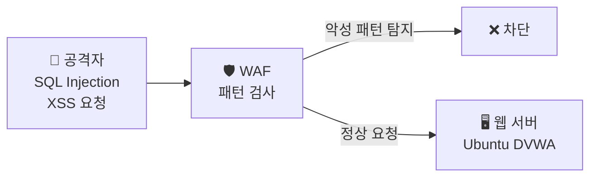
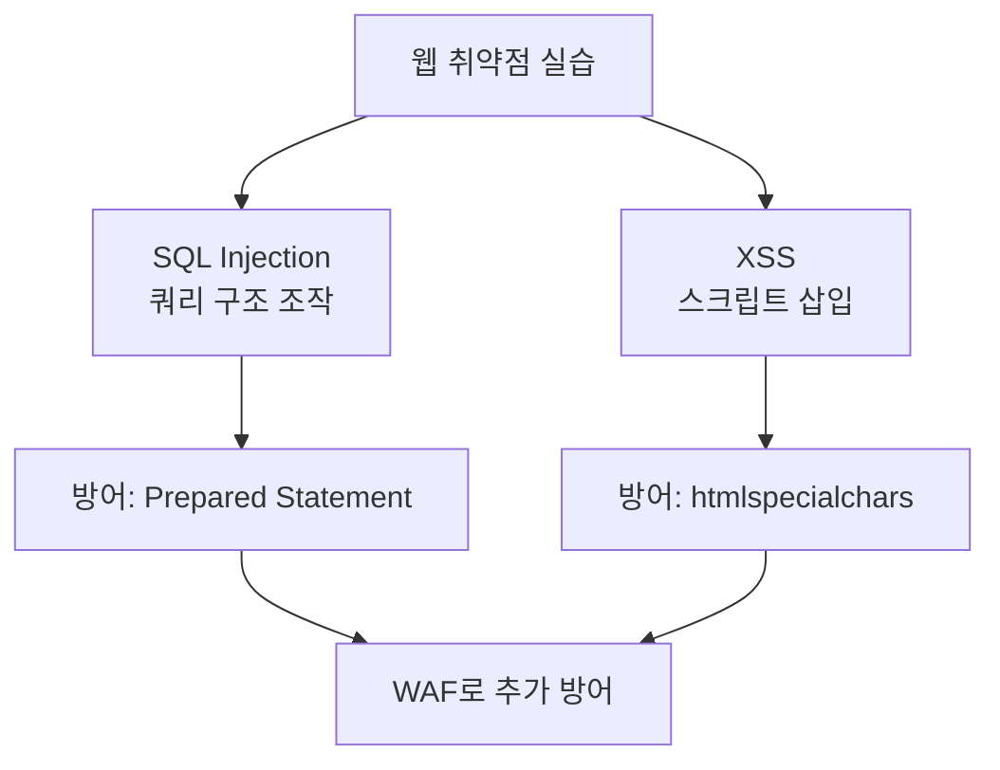

# 웹 취약점 — 과제 & 방어 정리

---

## 실습 환경

| 역할 | OS | IP |
|------|----|----|
| 공격자 | Kali Linux | `192.168.0.10` |
| 웹 서버 | Ubuntu | `192.168.0.30` |

---

## Part 1. 과제 — 보안 레벨 차이 분석

### 과제 1-1. SQL Injection 레벨별 결과 기록

DVWA Security 레벨을 Low → Medium → High 순서로 변경하며 동일한 입력값으로 공격을 시도하고 결과를 기록하라.

**테스트 입력값:** `' OR '1'='1`

| 보안 레벨 | 공격 결과 | 오류 메시지 또는 응답 내용 | 이유 |
|-----------|-----------|--------------------------|------|
| Low | | | |
| Medium | | | |
| High | | | |

**힌트:** 각 레벨에서 DVWA → SQL Injection → View Source 를 통해 PHP 코드를 확인하라.

---

### 과제 1-2. XSS 레벨별 결과 기록

**테스트 입력값:** `<script>alert('test')</script>`

| 보안 레벨 | 팝업 실행 여부 | 소스 코드에서 사용한 방어 함수 |
|-----------|--------------|-------------------------------|
| Low | | |
| Medium | | |
| High | | |

---

### 과제 1-3. Burp Suite Repeater 활용

Burp Suite의 **Repeater** 기능을 사용해 SQL Injection 요청을 반복 테스트하라.

**절차:**
1. DVWA SQL Injection 페이지에서 `id=1` 요청을 Burp Proxy로 가로챈다.
2. 가로챈 요청을 우클릭 → **"Send to Repeater"**
3. Repeater 탭에서 `id=` 값을 아래 순서로 변경하며 응답 확인:

```
id=1
id=2
id=99
id=' OR '1'='1
id=' UNION SELECT null,version()--
```

**기록할 내용:**
- 각 입력값에 대한 HTTP 응답 상태 코드
- 응답 본문에서 확인된 정보

---

## Part 2. 방어 코드 작성

### 2.1 SQL Injection 방어 — Prepared Statement

취약한 PHP 코드를 안전하게 수정하라.

**취약한 코드 (Low 레벨):**
```php
$id = $_GET['id'];
$query = "SELECT first_name, last_name FROM users WHERE user_id = '$id';";
$result = mysqli_query($GLOBALS["___mysqli_ston"], $query);
```

**안전한 코드 (빈칸 채우기):**
```php
$id = $_GET['id'];

// Prepared Statement 사용
$stmt = $GLOBALS["___mysqli_ston"]->prepare(
    "SELECT first_name, last_name FROM users WHERE user_id = ?"
);
$stmt->________('s', $id);   // 바인딩
$stmt->________();            // 실행
$result = $stmt->get_result();
```

**정답:**
```php
$stmt->bind_param('s', $id);
$stmt->execute();
```

### 2.2 XSS 방어 — htmlspecialchars

취약한 PHP 코드를 안전하게 수정하라.

**취약한 코드 (Low 레벨):**
```php
$name = $_GET['name'];
echo "<pre>Hello " . $name . "</pre>";
```

**안전한 코드 (빈칸 채우기):**
```php
$name = $_GET['name'];
echo "<pre>Hello " . ________($name, ENT_QUOTES, 'UTF-8') . "</pre>";
```

**정답:** `htmlspecialchars`

**htmlspecialchars 변환 규칙:**

| 원래 문자 | 변환 결과 |
|-----------|-----------|
| `<` | `&lt;` |
| `>` | `&gt;` |
| `"` | `&quot;` |
| `'` | `&#039;` |
| `&` | `&amp;` |

---

## Part 3. WAF(Web Application Firewall) 개념

### 3.1 WAF란?

WAF는 웹 애플리케이션 앞에 위치해 HTTP 요청을 검사하고 악성 패턴을 차단하는 방화벽이다.



### 3.2 WAF vs 일반 방화벽 비교

| 항목 | 일반 방화벽 (iptables/ufw) | WAF |
|------|--------------------------|-----|
| 검사 수준 | IP/포트 기반 | HTTP 요청 내용 기반 |
| 차단 가능 공격 | 포트 스캔, 무차별 대입 | SQL Injection, XSS, CSRF |
| 계층 | OSI 3~4계층 | OSI 7계층 (애플리케이션) |
| 예시 | iptables, ufw | ModSecurity, Cloudflare WAF |

### 3.3 ModSecurity 간단 소개

ModSecurity는 Apache에 설치할 수 있는 오픈소스 WAF다.

```bash
# Ubuntu에 ModSecurity 설치
sudo apt install libapache2-mod-security2 -y
sudo a2enmod security2
sudo systemctl restart apache2

# 설정 파일 확인
cat /etc/modsecurity/modsecurity.conf | grep SecRuleEngine
```

```
SecRuleEngine DetectionOnly   # 탐지만 (차단 X)
# SecRuleEngine On            # 차단 활성화
```

---

## Part 4. 셀프체크

### 객관식

**Q1.** SQL Injection에서 `' OR '1'='1` 이 항상 참이 되는 이유는?

- ① 특수문자를 사용했기 때문에
- ② `'1'='1'`은 문자열 비교에서 항상 `TRUE`이기 때문에
- **③ `OR` 연산자 때문에 조건 중 하나만 참이면 전체가 참이 되기 때문에**
- ④ MySQL이 오류를 무시하기 때문에

**Q2.** XSS 공격을 방어하는 PHP 함수로 가장 적절한 것은?

- ① `mysqli_real_escape_string()`
- ② `md5()`
- **③ `htmlspecialchars()`**
- ④ `base64_encode()`

**Q3.** Prepared Statement가 SQL Injection을 방어할 수 있는 이유는?

- ① 입력값을 암호화하기 때문에
- **② 쿼리 구조와 데이터를 분리해 처리하기 때문에**
- ③ 입력값에서 특수문자를 모두 삭제하기 때문에
- ④ 데이터베이스에 로그를 남기기 때문에

**Q4.** WAF(Web Application Firewall)가 일반 방화벽과 다른 점은?

- ① 더 빠른 속도
- **② HTTP 요청 내용(페이로드)까지 검사한다**
- ③ IP 주소 기반으로만 차단한다
- ④ 오직 HTTPS만 지원한다

---

### 단답형

**Q5.** DVWA에서 보안 레벨을 변경하는 메뉴 경로를 쓰시오.
→ `______`

**Q6.** Burp Suite에서 가로챈 HTTP 요청을 반복 테스트하는 기능의 이름은?
→ `______`

**Q7.** XSS에서 악성 스크립트가 DB에 저장되어 모든 방문자에게 영향을 주는 유형은?
→ `______`

---

### 정답

| 문제 | 정답 |
|------|------|
| Q1 | ③ |
| Q2 | ③ |
| Q3 | ② |
| Q4 | ② |
| Q5 | DVWA Security → Security Level 변경 |
| Q6 | Repeater |
| Q7 | 저장형 XSS (Stored XSS) |

---

## 9주차 정리



**핵심 교훈:**
1. 사용자 입력은 항상 **신뢰하지 말고 검증**해야 한다.
2. SQL은 반드시 **Prepared Statement**로 처리한다.
3. HTML 출력 시 반드시 **이스케이프 처리(htmlspecialchars)** 한다.
4. 코드 방어 + WAF = 다중 방어(Defense in Depth).

**다음 주 예고:** 10주차에서는 Ubuntu에 **Snort IDS**를 설치하고, Kali의 공격 트래픽을 실시간으로 탐지해본다.
