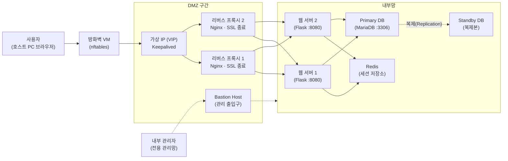

> 이 글은 **첫 시간(오리엔테이션)** 용입니다. 직접 실습하는 내용은 없고, 우리가 **무엇을, 왜, 어떤 순서로** 만드는지 안내합니다.
{: .prompt-info }

## 1. 이 과정은 무엇인가

여러분이 매일 쓰는 네이버, 유튜브, 학교 홈페이지 같은 서비스는 **컴퓨터 한 대**로 돌아가지 않습니다. 방화벽, 로드밸런서, 웹 서버 여러 대, 데이터베이스 이중화… 수많은 장비가 **역할을 나눠** 협력합니다.

이 과정의 목표는 한 문장으로 이렇습니다.

> **내 노트북의 VirtualBox 안에**, 서버 한 대짜리 "미니 홈페이지"에서 시작해 → 문제가 생길 때마다 서버를 한 대씩 추가하며 → **실제 기업 서비스와 같은 구조의 인프라를 완성**한다. 전부 **무료 오픈소스**로.
{: .prompt-tip }

- **대상**: 서버·네트워크를 처음 접하는 **1학년 / 비전공자**
- **방식**: 모든 실습은 **복사-붙여넣기 가능한 명령어**로 제공하고, 매 강의 끝에 **트러블슈팅(문제 해결)** 섹션이 있습니다.
- **핵심 철학**: 처음부터 완성형을 주지 않습니다. **"문제를 겪고 → 원인을 이해하고 → 서버를 추가해 해결"** 하는 빌드업(Build-up) 방식입니다. 실제 회사 인프라도 이렇게 성장해 왔습니다.

---

## 2. 최종 목표 — 우리가 만들 인프라

이 그림이 이 과정의 **최종 결과물**입니다. 지금은 낯설게 느껴지는 것이 당연합니다. 과정을 마칠 때에는 이 그림의 **모든 구성 요소를 여러분이 직접 구축하고, 그 존재 이유를 설명할 수 있게** 됩니다.

각 상자(역할)를 한 줄씩 미리 소개합니다. 지금은 "이런 게 있구나" 정도면 충분합니다.

| 구성 요소 | 역할 | 비유 |
|---|---|---|
| **방화벽** (Firewall) | 허락된 통신만 통과시키는 관문 | 건물 정문의 보안 게이트 |
| **DMZ** | 외부에 노출되는 서버만 모아두는 완충 지대 | 은행의 **객장** (금고와 분리된 공간) |
| **로드밸런서 / VIP** | 요청을 여러 서버에 나눠주는 교통정리 | 은행 창구 **번호표 기계** |
| **리버스 프록시** (Nginx) | 사용자 대신 내부 서버에 전달·응답, HTTPS 암호화 처리 | 회사의 **안내 데스크** |
| **웹 서버** (Flask) | 실제 홈페이지 로직 실행 | 실무 담당 직원 |
| **DB** (MariaDB) | 회원 정보 등 데이터 영구 저장 | **금고** |
| **Standby DB** | DB 장애 시에도 데이터를 보존하는 복제본 | 금고의 **백업 금고** |
| **Redis** | 로그인 세션을 저장하는 초고속 메모리 저장소 | 창구 직원들이 공유하는 **메모판** |
| **Bastion Host** | 관리자가 내부로 들어가는 유일한 출입구 | 직원 전용 **출입 게이트** |
| **내부망** | 외부에서 절대 직접 접근 못 하는 구역 | 금고실·사무 구역 |

> 클라우드(AWS)를 써 본 사람을 위한 대응표: 우리가 만드는 **MariaDB = AWS RDS의 실체(관계형 DB)**, **Redis = AWS ElastiCache**, **Bastion = AWS의 Bastion/점프 서버**, **로드밸런서 = AWS ELB**에 해당합니다. 클라우드는 이걸 "빌려주는" 것이고, 우리는 **직접 만들어서 원리를 이해**합니다.
{: .prompt-info }

---

## 3. 왜 단일 서버 구성으로는 부족한가

1단계에서 우리는 서버 한 대에 모든 기능을 통합해 시작합니다. 그리고 곧 세 가지 한계에 부딪힙니다.

1. **한 대의 장애가 전체 서비스 중단으로 이어진다** — 이를 **단일 장애점(SPOF, Single Point of Failure)** 이라 부릅니다. 서버 재부팅 한 번에 서비스 전체가 중단됩니다.
2. **자원을 두고 경합한다** — 웹 애플리케이션과 DB가 한 컴퓨터의 CPU·메모리를 서로 차지하려 다툽니다(자원 경합, Resource Contention).
3. **모든 구성 요소가 노출된다** — 인터넷에서 서버에 직접 도달할 수 있으면, 웹뿐 아니라 **DB(금고)까지 공격 표면(Attack Surface)** 이 됩니다.

이 과정 전체가 이 세 문제를 하나씩 해결해 가는 여정입니다.

---

## 4. 빌드업 로드맵 — 12편 구성

| 편 | 단계 | 이번에 추가하는 것 | 해결하는 문제 (겪어보고 해결) |
|---|---|---|---|
| 00 | — | 오리엔테이션 | — |
| 01 | 준비 | VirtualBox·네트워크·원본 VM | 실습 환경 |
| 02 | 1단계 | **올인원 서버 1대** (웹+DB) | 동작하는 최소 구성 만들기 |
| 03 | 2단계 | **DB 분리** + 회원가입/로그인 | 자원 경쟁, 역할 분리 |
| 04 | 3단계 | **리버스 프록시** + HTTPS | 웹 서버 직접 노출, 암호화 없음 |
| 05 | 4단계 | **웹 서버 증설 + 부하 분산** | 웹 서버 1대의 성능·장애 → **세션 불일치 문제 발생!** |
| 06 | 5단계 | **Redis 세션 저장소** | 5단계의 세션 불일치 문제 해결 |
| 07 | 6단계 | **프록시 이중화** (Keepalived VIP) | 프록시 자체가 SPOF |
| 08 | 7단계 | **DB 복제** (Primary/Standby) | DB가 SPOF |
| 09 | 8단계 | **방화벽 VM + DMZ/내부망 분리** | 경계 보안 — **DMZ 집중 해부** |
| 10 | 9단계 | **Bastion Host + Open API 연계** | 관리 통로 일원화, 외부 시스템 연동 |
| 11 | 10단계 | **CDN·캐시 + 종합 장애 훈련** | 마무리 점검 |

> 순서가 중요합니다. 각 편은 앞 편의 결과물 위에 쌓아 올리므로 **건너뛰지 마세요**. 매 편 끝에 스냅샷을 찍어 두면, 실습 환경이 손상되어도 그 지점부터 다시 시작할 수 있습니다.
{: .prompt-warning }

> **★ 용어 학습 팁**: 이 과정의 모든 전문 용어는 처음 나올 때 **한글 용어(영문 원어)** 형태로 병기합니다. 실무 문서·오류 메시지·채용 공고는 대부분 영문 용어를 쓰므로, **영문 원어까지 함께 기억하는 습관**을 들이세요. 각 편의 끝에는 "핵심 용어 정리" 표를 두었으니 복습에 활용하기 바랍니다.
{: .prompt-tip }

---

## 5. 최종 VM 목록과 내 컴퓨터 사양

최종적으로 만드는 VM은 아래와 같습니다. **전부 동시에 켤 필요는 없습니다.** 각 강의 시작에 "이번에 켤 VM"을 알려 드립니다.

| VM 이름 | 역할 | 메모리 | 등장 편 |
|---|---|---|---|
| `web1` | 웹 서버 1 | 1024 MB | 02 |
| `db1` | Primary DB | 1024 MB | 03 |
| `proxy1` | 리버스 프록시 1 | 768 MB | 04 |
| `web2` | 웹 서버 2 | 1024 MB | 05 |
| `redis1` | 세션 저장소 | 768 MB | 06 |
| `proxy2` | 리버스 프록시 2 | 768 MB | 07 |
| `db2` | Standby DB | 1024 MB | 08 |
| `fw` | 방화벽/라우터 | 768 MB | 09 |
| `bastion` | 관리 출입구 | 768 MB | 10 |

- **호스트 PC 권장 사양**: RAM **16 GB** (8 GB면 "이번에 켤 VM"만 켜서 진행 가능), 디스크 여유 **80 GB**
- 모든 VM은 화면 없는 **Ubuntu Server**(서버판)라 생각보다 가볍습니다.

---

## 6. 사용하는 소프트웨어 — 전부 무료·오픈소스

| 소프트웨어 | 용도 | 라이선스 |
|---|---|---|
| VirtualBox | 가상머신 | GPLv3 (기본 설치판) |
| Ubuntu Server 24.04 LTS | 모든 VM의 OS | 무료 (오픈소스) |
| Nginx | 리버스 프록시·로드밸런서 | BSD |
| MariaDB | 관계형 DB (RDBMS) | GPLv2 |
| Redis (Ubuntu 저장소판 7.x) | 세션 저장소 | BSD |
| Python 3 + Flask | 웹 애플리케이션 | PSF / BSD |
| Keepalived | 프록시 이중화(VIP) | GPL |
| UFW / nftables | 방화벽 | GPL |
| Fail2ban | SSH 공격 차단 | GPL |

> VirtualBox **Extension Pack은 설치하지 않습니다.** 개인 용도 외에는 유료인 별도 라이선스(PUEL)라서, "전부 무료·오픈소스" 원칙에 맞게 기본 설치판만 사용합니다. 이 과정에는 확장팩 기능이 전혀 필요 없습니다.
{: .prompt-warning }

---

## 7. 이 과정의 약속

1. **계정 통일** — 모든 VM의 계정은 `infra` / 비밀번호 `infra123` 입니다. (실습 편의용 약속입니다. 실제 서버라면 절대 이런 비밀번호를 쓰면 안 됩니다.)
2. **모든 VM에 방화벽** — VM을 만들 때마다 UFW(소프트웨어 방화벽)를 켜고, **"필요한 포트만, 필요한 상대에게만"** 여는 것을 원칙으로 합니다. 보안은 마지막에 붙이는 옵션이 아니라 **처음부터 함께** 갑니다.
3. **이름으로 부른다** — 서버끼리는 IP 대신 `db1`, `redis1` 같은 **이름**으로 통신하게 설정합니다. 나중에 네트워크를 재배치(9편)할 때 이 습관이 우리를 구해 줍니다.
4. **매 편 끝 스냅샷** — 각 편의 마지막에 VM 스냅샷을 찍습니다. 실패는 부끄러운 게 아니라 **트러블슈팅 연습 기회**입니다.

다음 편에서 VirtualBox를 설치하고, 모든 VM의 원본이 될 **base VM**을 만듭니다.
