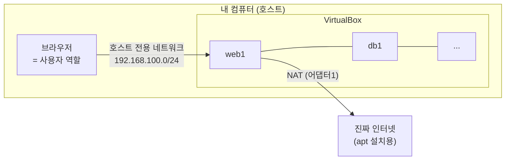

> 이번 글은 **직접 따라 하는 실습**입니다. VirtualBox를 설치하고, 실습용 네트워크를 만들고, 앞으로 모든 VM의 원본이 될 **base VM 한 대**를 만듭니다. 이 한 대를 잘 만들어 두면 이후에는 **복제만으로 새 서버를 신속하게 생성**할 수 있습니다.
{: .prompt-info }

## 0. 이번 실습의 목표

1. VirtualBox 설치 (무료 기본판)
2. 실습용 **호스트 전용 네트워크** 생성 — 우리 인프라의 "인터넷 구간" 역할
3. Ubuntu Server 24.04 **base VM** 1대 설치
4. base VM에 **공통 보안 설정(UFW 방화벽 포함)** 적용 후 스냅샷

---

## 1. 네트워크 설계 먼저 이해하기

VirtualBox의 VM은 어댑터(가상 랜카드)를 여러 개 가질 수 있습니다. 우리는 VM마다 2개를 씁니다.

| 어댑터 | 종류 | 역할 |
|---|---|---|
| 어댑터 1 | **NAT** | 진짜 인터넷 연결 (패키지 설치용). 외부에서 들어올 수는 없음 |
| 어댑터 2 | **호스트 전용(Host-Only)** | 실습 인프라 네트워크. **호스트 PC = 사용자/인터넷 역할** |



**IP 전체 계획표** — 이후 모든 편에서 참조하므로 따로 기록해 두기를 권장합니다. (9편에서 망 분리를 하기 전까지는 모두 이 네트워크 하나를 사용합니다.)

| 이름 | IP | 역할 |
|---|---|---|
| (호스트 PC) | 192.168.100.1 | 사용자·관리자 |
| `web1` | 192.168.100.11 | 웹 서버 1 |
| `web2` | 192.168.100.12 | 웹 서버 2 |
| `db1` | 192.168.100.21 | Primary DB |
| `db2` | 192.168.100.22 | Standby DB |
| `redis1` | 192.168.100.25 | 세션 저장소 |
| (VIP) | 192.168.100.30 | 프록시 가상 IP (7편) |
| `proxy1` | 192.168.100.31 | 리버스 프록시 1 |
| `proxy2` | 192.168.100.32 | 리버스 프록시 2 |
| `bastion` | 192.168.100.40 | 관리 출입구 (10편) |
| `fw` | 192.168.100.254 | 방화벽 (9편) |

---

## 2. VirtualBox 설치

1. 브라우저에서 **virtualbox.org → Downloads** 이동
2. **Windows hosts**(윈도우 사용자 기준) 설치 파일을 받아 실행 → 기본값으로 Next → 설치 완료
3. **Extension Pack은 받지 않습니다** (00편에서 설명한 라이선스 원칙)

> 설치 중 "네트워크가 잠시 끊길 수 있다"는 경고는 그대로 진행해도 됩니다.
{: .prompt-tip }

> **★ 꼭 알아 두어야 할 개념 — 가상화와 하이퍼바이저**: VM(가상머신)을 생성·실행하는 소프트웨어를 **하이퍼바이저(Hypervisor)** 라 합니다. VirtualBox처럼 일반 OS 위에서 동작하면 **Type-2**, 서버 하드웨어 위에서 직접 동작하면 **Type-1**(VMware ESXi, KVM 등)으로 분류합니다. 기업 데이터센터와 클라우드(AWS 등)는 Type-1 위에서 운영됩니다 — 즉 이 과정에서 익히는 "VM으로 인프라 구축"은 **클라우드 인프라의 축소판**을 직접 다루는 것과 같습니다.
{: .prompt-tip }

---

## 3. 호스트 전용 네트워크 만들기

1. VirtualBox 메인 화면 → **도구(Tools) → 네트워크(Network)**
2. **호스트 전용 네트워크(Host-only Networks)** 탭 → **만들기(Create)**
3. 만들어진 어댑터를 선택 → **속성(Properties)** 에서:
   - IPv4 주소: `192.168.100.1`
   - 넷마스크: `255.255.255.0`
   - **DHCP 서버 탭: 사용 안 함(체크 해제)** — IP는 우리가 직접 지정합니다

> 여기서 만든 네트워크 이름(예: `VirtualBox Host-Only Ethernet Adapter` 또는 `vboxnet0`)을 기억하세요. 모든 VM의 어댑터 2를 여기에 연결합니다.
{: .prompt-warning }

---

## 4. Ubuntu Server ISO 내려받기

1. **ubuntu.com → Download → Ubuntu Server** 이동
2. **Ubuntu Server 24.04 LTS** ISO를 내려받습니다 (LTS = 장기 지원판, 무료)

---

## 5. base VM 만들기

### 5.1 VM 생성

1. VirtualBox → **새로 만들기(New)**
2. 이름: `base` / 종류: Linux / 버전: Ubuntu (64-bit)
3. ISO: 방금 받은 파일 지정 (무인 설치 옵션이 뜨면 **"무인 설치 건너뛰기(Skip Unattended Installation)" 체크**)
4. 메모리 **2048 MB**, CPU **2개**
5. 디스크 **15 GB** (동적 할당)

### 5.2 어댑터 2개 설정 (부팅 전에!)

`base` 선택 → **설정 → 네트워크**

| 어댑터 | 설정 |
|---|---|
| 어댑터 1 | 다음에 연결됨 = **NAT** |
| 어댑터 2 | "어댑터 2 사용하기" 체크 → **호스트 전용 어댑터** → 3장에서 만든 네트워크 선택 |

### 5.3 Ubuntu 설치

VM **시작** 후 화살표·엔터 키로 진행합니다.

1. 언어: English (한글 깨짐 방지, 메뉴는 그대로 따라가면 됩니다)
2. 키보드: 기본값
3. 네트워크: 어댑터 2개가 보임 → 그대로 Done (IP는 나중에 설정)
4. 저장소: 디스크 전체 사용(기본값) → Done → Continue
5. **Profile setup** — 모든 VM 공통 계정이므로 정확히 입력:
   - Your name: `infra`
   - Server name: `base`
   - Username: **`infra`**
   - Password: **`infra123`**
6. **"Install OpenSSH server" 반드시 체크** ← 원격 관리의 핵심
7. Featured snaps: 아무것도 선택하지 않고 Done
8. 설치 완료 후 **Reboot Now** → 로그인 화면이 나오면 성공

---

## 6. base VM 공통 설정 — 보안 기본기 포함

`infra` / `infra123` 으로 로그인한 뒤, 아래를 순서대로 실행합니다.

### 6.1 최신 상태로 업데이트

```bash
sudo apt update && sudo apt upgrade -y
```

### 6.2 소프트웨어 방화벽(UFW) — 모든 VM의 기본값

**UFW(Uncomplicated Firewall)** 는 우분투의 소프트웨어 방화벽입니다. 우리 원칙은 **"기본은 전부 차단, 필요한 것만 허용"** 입니다.

```bash
sudo apt install -y ufw
sudo ufw default deny incoming    # 들어오는 통신: 기본 차단
sudo ufw default allow outgoing   # 나가는 통신: 허용
sudo ufw allow 22/tcp             # SSH(원격 관리)만 우선 허용
sudo ufw enable                   # 방화벽 켜기 (경고가 나오면 y)
sudo ufw status verbose           # 확인
```

`Status: active` 와 `22/tcp ALLOW IN` 이 보이면 성공입니다. 앞으로 **서버를 만들 때마다 그 서버에 필요한 포트만 추가로 엽니다.** (예: 웹 서버는 8080, DB는 3306 — 그것도 "누구에게서 오는지"까지 제한합니다.)

> 왜 처음부터 방화벽인가? 실무 사고의 상당수는 "테스트하느라 잠깐 열어둔 포트"에서 시작됩니다. **막힌 상태가 기본**이면 실수해도 안전한 쪽으로 실수하게 됩니다.
{: .prompt-warning }

### 6.3 서버 이름 사전(hosts 파일) 등록

서버끼리 IP 대신 **이름**으로 부르도록, 1장의 IP 계획표를 통째로 등록합니다.

```bash
sudo tee -a /etc/hosts > /dev/null <<'EOF'

# === 웹 인프라 실습 IP 계획 ===
192.168.100.11  web1
192.168.100.12  web2
192.168.100.21  db1
192.168.100.22  db2
192.168.100.25  redis1
192.168.100.30  vip
192.168.100.31  proxy1
192.168.100.32  proxy2
192.168.100.40  bastion
192.168.100.254 fw
EOF
```

base에 등록해 두면 **복제되는 모든 VM이 이 사전을 물려받습니다.** 이후 설정 파일에 IP 대신 이름을 쓰면, 9편에서 네트워크를 재배치할 때 이 파일만 고치면 됩니다.

### 6.4 종료 후 스냅샷

```bash
sudo poweroff
```

VirtualBox에서 `base` 선택 → **스냅샷(Snapshots)** → **찍기(Take)** → 이름: `clean-base`

---

## 7. ★ VM 복제 표준 절차 (앞으로 계속 사용)

이후 모든 강의에서 "**표준 절차로 `이름`, `IP` VM을 만드세요**"라고 하면 아래를 수행하는 것입니다. 여기서는 연습 삼아 **`web1` (192.168.100.11)** 을 만들어 봅니다.

### 7.1 복제

1. `base` 우클릭 → **복제(Clone)**
2. 이름: `web1`
3. **MAC 주소 정책: "모든 네트워크 어댑터의 새 MAC 주소 생성"** ← 안 하면 IP 충돌!
4. **완전한 복제(Full Clone)** → 완료
5. (필요시) 설정 → 시스템에서 메모리 조정 (00편 표 참조)

### 7.2 호스트 이름 변경

VM을 시작해 `infra`/`infra123` 로그인 후:

```bash
sudo hostnamectl set-hostname web1
```

### 7.3 고정 IP 설정 (netplan)

어댑터 이름을 먼저 확인합니다.

```bash
ip a
```

보통 `enp0s3`(NAT용)과 `enp0s8`(호스트 전용)이 보입니다. **`enp0s8`에 고정 IP**를 줍니다.

```bash
sudo nano /etc/netplan/50-cloud-init.yaml
```

아래 내용으로 **통째로 교체**합니다. (`addresses`의 IP만 VM마다 다릅니다.)

```yaml
network:
  version: 2
  ethernets:
    enp0s3:
      dhcp4: true
    enp0s8:
      dhcp4: false
      addresses:
        - 192.168.100.11/24
```

저장(Ctrl+O, Enter) 후 종료(Ctrl+X)하고 적용합니다.

```bash
sudo netplan apply
ip a   # enp0s8에 192.168.100.11이 붙었는지 확인
```

### 7.4 확인 + 재부팅

```bash
hostname          # web1 이 나와야 함
ping -c2 192.168.100.1   # 호스트 PC와 통신 확인
sudo reboot
```

### 7.5 호스트 PC에서 SSH 접속 (앞으로의 기본 작업 방식)

호스트 PC(윈도우)의 **PowerShell**에서:

```bash
ssh infra@192.168.100.11
```

처음 접속 시 "신뢰하겠냐"는 질문에 `yes`, 비밀번호 `infra123`. 프롬프트가 `infra@web1:~$` 로 바뀌면 성공입니다. **앞으로 모든 VM 작업은 VirtualBox 화면 대신 SSH로 합니다.** (복사-붙여넣기가 되기 때문입니다.)

> **복사-붙여넣기 방법**: 이 강의의 명령을 복사한 뒤 PowerShell 창에서 마우스 **우클릭**하면 붙여넣기가 됩니다.
{: .prompt-tip }

### 7.6 표준 절차 요약 체크리스트 (이 5단계가 전부입니다)

이후 강의에서 "**1편 7장의 표준 절차로 VM을 만드세요**"라고 하면, 아래 5단계를 지정된 이름·IP로 수행하는 것입니다.

| 단계 | 작업 | 명령/위치 |
|---|---|---|
| ① 복제 | `base` 우클릭 → 복제 → **MAC 주소 새로 생성** + **완전한 복제** | VirtualBox |
| ② 이름 | 호스트 이름 변경 | `sudo hostnamectl set-hostname <이름>` |
| ③ 주소 | netplan에서 enp0s8에 고정 IP 지정 후 적용 | `sudo nano /etc/netplan/50-cloud-init.yaml` → `sudo netplan apply` |
| ④ 확인 | 이름·통신 확인 후 재부팅 | `hostname`, `ping -c2 192.168.100.1`, `sudo reboot` |
| ⑤ 접속 | 호스트 PC에서 SSH 접속해 작업 시작 | `ssh infra@<IP>` |

> 이 페이지를 책갈피해 두세요. 이 과정에서 새 서버가 필요할 때마다(총 8번) 돌아오게 됩니다.
{: .prompt-tip }

---

## 8. 트러블슈팅 — 안 될 때 여기부터

| 증상 | 원인 | 해결 |
|---|---|---|
| VM이 부팅 안 되고 까만 화면 | 가상화 기능 꺼짐 | PC 바이오스(BIOS)에서 **VT-x / AMD-V 활성화** |
| `ping 192.168.100.1` 실패 | 어댑터 2 미연결 또는 다른 네트워크 | VM 설정 → 네트워크 → 어댑터 2가 **3장에서 만든 호스트 전용 네트워크**인지 확인 |
| `netplan apply` 후 에러 | YAML 들여쓰기 틀림 | 들여쓰기는 **스페이스 2칸**. 탭 금지. 위 예시와 글자 단위로 비교 |
| SSH `Connection refused` | OpenSSH 미설치 | VM 안에서 `sudo apt install -y openssh-server` |
| SSH `Connection timed out` | UFW 또는 IP 오류 | VM 안에서 `sudo ufw status`로 22/tcp 허용 확인, `ip a`로 IP 확인 |
| 복제한 VM 2대가 같은 IP | 복제 시 MAC 재생성 안 함 | VM 설정 → 네트워크 → 고급 → MAC 주소 옆 🔄 클릭 후 재부팅 |
| 호스트 전용 네트워크가 목록에 없음 | 어댑터 미생성 | 도구 → 네트워크에서 다시 만들기. 윈도우 방화벽 경고는 허용 |

---

## 9. 핵심 용어 정리

| 용어 | 영문 | 정의 |
|---|---|---|
| 하이퍼바이저 | Hypervisor | 가상머신을 생성·실행하는 소프트웨어 (VirtualBox는 Type-2) |
| NAT | Network Address Translation | VM이 호스트의 IP를 빌려 외부 인터넷에 나가는 방식 — 외부에서 VM으로 먼저 들어올 수는 없음 |
| 호스트 전용 네트워크 | Host-Only Network | 호스트 PC와 VM들만 연결되는 격리된 가상 네트워크 |
| 기본 차단 정책 | Default Deny | 명시적으로 허용한 통신 외에는 모두 거부하는 방화벽 운영 원칙 |
| 고정 IP | Static IP | DHCP 자동 할당 대신 관리자가 직접 지정하는 IP 주소 — 서버는 주소가 바뀌면 안 되므로 고정 IP를 사용 |
| 스냅샷 | Snapshot | VM의 특정 시점 상태를 통째로 보존해 두었다가 복원할 수 있는 기능 |
| SSH | Secure Shell | 암호화된 원격 접속 프로토콜 (TCP 22번 포트) — 서버 관리의 표준 수단 |

---

## 10. 마무리 — 오늘 만든 것

- VirtualBox + 호스트 전용 네트워크(192.168.100.0/24)
- **방화벽이 기본 탑재된** base VM (스냅샷 `clean-base`)
- 표준 절차로 만든 첫 서버 `web1` (192.168.100.11)

`web1`은 다음 편에서 바로 사용합니다. 종료해 둡시다:

```bash
sudo poweroff
```

다음 편에서는 `web1` 한 대에 웹 애플리케이션과 DB를 전부 설치해 **"돌아가는 홈페이지"** 를 만들고, 그 구조의 문제점을 직접 확인합니다.
