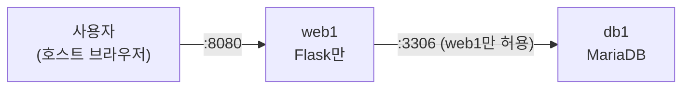

> 이번 글은 **직접 따라 하는 실습**입니다. DB를 전용 서버 `db1`로 분리해 "서버 두 대가 네트워크로 협력"하는 구조를 만들고, 홈페이지에 **회원가입·로그인**을 추가합니다. 방화벽 규칙은 **"web1에서 오는 3306만 허용"** 으로 제한합니다.
{: .prompt-info }

**이번에 켤 VM**: `web1`, `db1`(새로 만듦)

## 0. 이번 단계의 그림



| 오늘 배우는 것 | 설명 |
|---|---|
| DB 원격 접속 | bind-address, 원격 전용 계정(`'app'@'192.168.100.%'`) |
| 데이터 이전(Migration) | `mysqldump`로 백업 → 복원 |
| 비밀번호 해시 | 비밀번호를 **원문 그대로 저장하면 안 되는** 이유와 해결책 |
| 세션(Session) | "로그인 상태"를 서버가 기억하는 방법 — 오늘은 일부러 **불완전하게** 만듭니다 |

---

## 1. db1 서버 만들기

**1편 7장의 표준 절차**(복제 → 호스트명 → 고정 IP → 확인 → SSH)로 새 VM을 만듭니다. 절차가 기억나지 않으면 1편 7.6의 체크리스트를 다시 펴 놓고 진행하세요.

- 이름: `db1` / IP: `192.168.100.21` / 메모리 1024 MB

완료 확인:

```bash
ssh infra@192.168.100.21
hostname        # db1
ping -c2 web1   # 이름으로 통신 확인
```

### 1.1 MariaDB 설치 + 보안 마법사

`db1`에서:

```bash
sudo apt update
sudo apt install -y mariadb-server
sudo mysql_secure_installation
```

보안 마법사 답변은 2편과 동일합니다 (root 원격 금지 `Y` 포함).

### 1.2 원격 접속 열기 (bind-address)

MariaDB는 기본적으로 **자기 자신(127.0.0.1)의 접속만** 받습니다. `web1`이 접속할 수 있도록 수신 주소를 바꿉니다.

```bash
sudo nano /etc/mysql/mariadb.conf.d/50-server.cnf
```

`bind-address = 127.0.0.1` 줄을 찾아 아래로 수정:

```ini
bind-address = 0.0.0.0
```

```bash
sudo systemctl restart mariadb
```

> `0.0.0.0`(모든 주소에서 수신)으로 열지만 무섭지 않습니다. 바로 아래에서 **방화벽이 web1만 통과**시키고, DB 계정도 **우리 네트워크 대역만 허용**하도록 이중으로 잠급니다. 이렇게 **여러 겹으로 막는 것**을 심층 방어(Defense in Depth)라고 합니다.
{: .prompt-tip }

### 1.3 방화벽 — "web1에서 오는 3306만"

```bash
sudo ufw allow from 192.168.100.11 to any port 3306 proto tcp
sudo ufw status
```

`3306/tcp ALLOW IN 192.168.100.11` — 웹 서버 말고는 **아무도 DB 문을 두드릴 수 없습니다.**

### 1.4 DB·원격 계정·테이블 만들기

`db1`에서:

```bash
sudo mysql
```

```sql
CREATE DATABASE appdb;
CREATE USER 'app'@'192.168.100.%' IDENTIFIED BY 'App123!';
GRANT ALL PRIVILEGES ON appdb.* TO 'app'@'192.168.100.%';

USE appdb;
CREATE TABLE visits (
  id INT PRIMARY KEY,
  count INT NOT NULL
);
INSERT INTO visits VALUES (1, 0);

CREATE TABLE users (
  id INT AUTO_INCREMENT PRIMARY KEY,
  username VARCHAR(50) UNIQUE NOT NULL,
  password_hash VARCHAR(255) NOT NULL,
  created_at TIMESTAMP DEFAULT CURRENT_TIMESTAMP
);

FLUSH PRIVILEGES;
EXIT;
```

- 계정 호스트가 `'192.168.100.%'` — **우리 실습망에서 온 접속만** 인정한다는 뜻입니다.
- `users` 테이블의 `password_hash` : 비밀번호 **원문이 아니라 해시**를 저장할 자리입니다.

> (선택) 2편에서 방문자 수가 쌓였다면 `web1`에서 `mysqldump appdb | ssh infra@db1 ...` 로 이사할 수 있지만, 실습에서는 그냥 0부터 다시 세도 충분합니다. `mysqldump`는 8편(DB 복제)에서 제대로 씁니다.
{: .prompt-info }

---

## 2. web1 정리 — 이제 웹만 담당

`web1`에 접속해서:

```bash
ssh infra@192.168.100.11
```

### 2.1 web1에서 원격 DB 접속 테스트

애플리케이션을 고치기 **전에**, 길이 뚫렸는지 먼저 확인하는 것이 실무 순서입니다.

```bash
sudo apt install -y mariadb-client
mariadb -h db1 -u app -p'App123!' appdb -e "SELECT * FROM visits;"
```

`count` 값이 표로 나오면 **네트워크·방화벽·계정** 3박자가 모두 정상입니다.

### 2.2 web1의 로컬 MariaDB 제거

"서버 한 대에 하나의 역할"이라는 **역할 분리(Separation of Roles)** 원칙에 따라, 이제 web1에 DB는 필요하지 않습니다.

```bash
sudo systemctl disable --now mariadb
sudo apt purge -y mariadb-server
sudo apt autoremove -y
```

---

## 3. 애플리케이션 업그레이드 — 회원가입·로그인

`web1`에서 코드를 **통째로 교체**합니다.

```bash
nano ~/app/app.py
```

기존 내용을 모두 지우고(Ctrl+K 연타) 아래를 붙여넣습니다.

```python
from flask import Flask, request, redirect, make_response
from werkzeug.security import generate_password_hash, check_password_hash
import pymysql, socket, secrets

app = Flask(__name__)

DB = dict(host="db1", user="app", password="App123!", database="appdb")

# 세션 저장소: "로그인 상태"를 기억하는 곳.
# 지금은 이 서버의 메모리(딕셔너리)에 저장한다 — 이 결정의 한계를 5편에서 확인하게 된다
SESSIONS = {}

def db_conn():
    return pymysql.connect(**DB)

def current_user():
    token = request.cookies.get("session")
    return SESSIONS.get(token)

def page(body):
    return f"""<h1>미니 홈페이지</h1>
    <p>응답한 서버: <b>{socket.gethostname()}</b></p>
    {body}
    <hr><a href='/'>홈</a>"""

@app.route("/")
def home():
    conn = db_conn()
    with conn.cursor() as cur:
        cur.execute("UPDATE visits SET count = count + 1 WHERE id = 1")
        conn.commit()
        cur.execute("SELECT count FROM visits WHERE id = 1")
        count = cur.fetchone()[0]
    conn.close()
    user = current_user()
    if user:
        menu = f"<p><b>{user}</b>님 환영합니다! <a href='/logout'>로그아웃</a></p>"
    else:
        menu = "<p><a href='/signup'>회원가입</a> | <a href='/login'>로그인</a></p>"
    return page(f"<p>당신은 <b>{count}</b>번째 방문자입니다.</p>{menu}")

FORM = """<form method="post">
  아이디: <input name="username" required><br>
  비밀번호: <input name="password" type="password" required><br>
  <button>{label}</button></form>"""

@app.route("/signup", methods=["GET", "POST"])
def signup():
    if request.method == "GET":
        return page("<h2>회원가입</h2>" + FORM.format(label="가입하기"))
    username = request.form["username"]
    pw_hash = generate_password_hash(request.form["password"])
    conn = db_conn()
    try:
        with conn.cursor() as cur:
            cur.execute("INSERT INTO users (username, password_hash) VALUES (%s, %s)",
                        (username, pw_hash))
            conn.commit()
    except pymysql.err.IntegrityError:
        return page("<p>이미 있는 아이디입니다. <a href='/signup'>다시</a></p>")
    finally:
        conn.close()
    return page(f"<p>가입 완료! <a href='/login'>로그인 하러 가기</a></p>")

@app.route("/login", methods=["GET", "POST"])
def login():
    if request.method == "GET":
        return page("<h2>로그인</h2>" + FORM.format(label="로그인"))
    username = request.form["username"]
    conn = db_conn()
    with conn.cursor() as cur:
        cur.execute("SELECT password_hash FROM users WHERE username=%s", (username,))
        row = cur.fetchone()
    conn.close()
    if row and check_password_hash(row[0], request.form["password"]):
        token = secrets.token_hex(16)          # 무작위 세션 토큰 발급
        SESSIONS[token] = username             # 서버 메모리에 "누구인지" 기록
        resp = make_response(redirect("/"))
        resp.set_cookie("session", token, httponly=True)
        return resp
    return page("<p>아이디 또는 비밀번호가 틀렸습니다. <a href='/login'>다시</a></p>")

@app.route("/logout")
def logout():
    token = request.cookies.get("session")
    SESSIONS.pop(token, None)
    resp = make_response(redirect("/"))
    resp.delete_cookie("session")
    return resp

if __name__ == "__main__":
    app.run(host="0.0.0.0", port=8080)
```

```bash
sudo systemctl restart webapp
systemctl status webapp --no-pager
```

### 이 코드에서 꼭 이해할 두 가지

**① 비밀번호는 해시로 저장한다.** `generate_password_hash`는 비밀번호를 복원 불가능한 문자열로 바꿉니다. DB가 통째로 유출되어도 원래 비밀번호는 알 수 없습니다. 로그인할 때는 "입력한 비밀번호를 같은 방법으로 바꿔서 **비교만**" 합니다(`check_password_hash`).

**② 로그인 상태 = 세션 토큰.** 로그인에 성공하면 서버가 무작위 토큰을 생성해 ① 브라우저 쿠키에 전달하고 ② 서버 메모리(`SESSIONS`)에 "이 토큰 = 이 사용자"라고 기록합니다. 이후 요청마다 쿠키의 토큰으로 사용자를 식별합니다. — **이 기록이 "이 서버의 메모리"에만 존재한다는 사실**을 기억해 두세요. 5편에서 심각한 문제의 원인이 됩니다.

> **★ 꼭 알아 두어야 할 보안 상식 — SQL 인젝션 예방**: 위 코드에서 SQL 안에 사용자 입력을 직접 이어 붙이지 않고 `%s` 자리표시자와 별도 인자로 전달한 것에 주목하세요. 이를 **매개변수 바인딩(Parameter Binding)** 이라 하며, 사용자 입력이 SQL 명령으로 해석되어 DB를 탈취당하는 **SQL 인젝션(SQL Injection)** — 웹 공격의 대표 유형 — 을 차단하는 표준 기법입니다. "사용자 입력을 문자열 결합으로 SQL에 넣지 않는다"는 원칙은 어떤 언어에서든 동일합니다.
{: .prompt-tip }

---

## 4. 동작 확인

브라우저에서 `http://192.168.100.11:8080`

1. **회원가입** → 아이디/비밀번호 입력 (예: `hong` / `test1234`)
2. **로그인** → "hong님 환영합니다!" 확인
3. `db1`에서 실제 저장된 모습 확인:

```bash
ssh infra@192.168.100.21
sudo mysql -e "SELECT username, LEFT(password_hash, 40) AS hash_preview FROM appdb.users;"
```

비밀번호가 **원문이 아니라 해시**로 저장된 것을 눈으로 확인하세요. 이것이 "홈페이지 인증"의 표준 구조입니다.

### 세션이 "메모리에만" 있다는 증거 실험

로그인된 상태에서 `web1`의 앱만 재시작해 봅니다.

```bash
ssh infra@192.168.100.11 "sudo systemctl restart webapp"
```

브라우저 새로고침 → **로그아웃되어 있습니다!** 프로세스 재시작으로 서버 메모리가 초기화되며 `SESSIONS`가 사라졌기 때문입니다. 회원 정보(DB)는 보존되었지만 **로그인 상태는 소실**되었습니다. 이 문제는 6편에서 Redis로 해결합니다.

---

## 5. 트러블슈팅

| 증상 | 진단 | 해결 |
|---|---|---|
| `mariadb -h db1 ...` 이 `Connection refused` | `db1`에서 `sudo ss -lntp \| grep 3306` | `0.0.0.0:3306`이 아니면 bind-address 수정 누락 → 1.2 |
| `mariadb -h db1 ...` 이 무한 대기 후 timeout | `db1`에서 `sudo ufw status` | 방화벽 규칙 누락/오타 → 1.3 (출발지 IP가 `.11`인지) |
| `ERROR 1045 Access denied` | — | 계정 비밀번호 오타, 또는 계정 호스트가 `'localhost'`로 생성됨 → 1.4의 `'app'@'192.168.100.%'` 다시 |
| `ERROR 1130 Host ... not allowed` | — | 위와 동일 (원격 계정 없음) |
| 웹은 뜨는데 500 에러 | `journalctl -u webapp -n 30` | `users` 테이블 누락, 또는 `host="db1"`인데 hosts 파일에 db1 없음 |
| 회원가입은 되는데 로그인 실패 | — | 붙여넣기 중 `check_password_hash` 부분 누락 여부 확인 |
| db1 재부팅 후 접속 안 됨 | `systemctl status mariadb` | `sudo systemctl enable mariadb` 확인 |

> 서버가 2대가 되면서 진단도 2단계가 됐습니다: **"web1 문제인가, db1 문제인가, 그 사이(네트워크·방화벽) 문제인가"** — 항상 `mariadb -h db1 ...` 같은 **구간 테스트**로 어느 구간인지부터 좁히세요.
{: .prompt-warning }

---

## 6. 남은 문제

| # | 문제 | 해결 편 |
|---|---|---|
| 1 | 사용자가 `:8080`으로 웹 서버에 **직접** 접속, 암호화(HTTPS) 없음 | **04** |
| 2 | 웹 서버 1대 — 장애 시 서비스 중단, 부하 집중 시 성능 저하 | 05 |
| 3 | 앱 재시작만 해도 로그인 증발 (세션이 서버 메모리에) | 06 |
| 4 | DB도 1대 | 08 |

## 7. 핵심 용어 정리

| 용어 | 영문 | 정의 |
|---|---|---|
| 역할 분리 | Separation of Roles | 서버 한 대가 하나의 역할만 담당하도록 나누는 설계 원칙 |
| bind-address | — | DB가 어느 네트워크 주소의 접속을 수신할지 정하는 설정 |
| 최소 권한 원칙 | Principle of Least Privilege | 계정·프로그램에 업무 수행에 필요한 최소한의 권한만 부여하는 원칙 |
| 심층 방어 | Defense in Depth | 방화벽·계정·암호화 등 여러 겹의 방어 수단을 중첩하는 전략 |
| 해시 함수 | Hash Function | 입력을 복원 불가능한 고정 형식 값으로 변환하는 함수 — 비밀번호 저장의 표준 |
| 세션 | Session | 로그인 이후의 "접속 상태"를 서버가 기억하는 메커니즘 |
| 매개변수 바인딩 | Parameter Binding | SQL과 데이터를 분리해 전달하는 기법 — SQL 인젝션 방어의 기본 |
| 구간 테스트 | — | 전체가 아닌 한 구간(예: web1→db1)만 떼어 검증하는 진단 기법 |

## 8. 마무리 — 스냅샷

두 VM 모두 `sudo poweroff` 후 스냅샷: `web1` → **`stage2-web`**, `db1` → **`stage2-db`**

다음 편에서는 **리버스 프록시(Nginx)** 를 앞에 세워 사용자와 웹 서버를 분리하고, **HTTPS 암호화**를 답니다. "DMZ"라는 개념이 처음 등장합니다.
