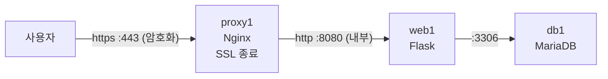

> 이번 글은 **직접 따라 하는 실습**입니다. Nginx **리버스 프록시** `proxy1`을 사용자와 웹 서버 사이에 세우고, **HTTPS(SSL 종료)** 를 적용합니다. 웹 서버는 이제 "프록시 뒤로 숨습니다" — DMZ 개념의 시작입니다.
{: .prompt-info }

**이번에 켤 VM**: `proxy1`(새로 만듦), `web1`, `db1`

## 0. 이번 단계의 그림



| 오늘 배우는 것 | 설명 |
|---|---|
| 리버스 프록시 | 사용자의 요청을 **대신 받아** 내부 서버로 전달하는 중계 서버 |
| SSL 종료(SSL Termination) | 암호화(HTTPS)를 프록시가 **대표로 처리**하는 방식 |
| 자체 서명 인증서 | 연습용 HTTPS 인증서를 직접 만들기 |
| 방화벽 좁히기 | web1의 8080을 **"프록시에서 온 것만"** 허용으로 변경 |

**왜 필요한가?** 지금 사용자는 웹 서버의 실제 주소와 포트(`192.168.100.11:8080`)를 그대로 알고, 직접 접속합니다. 이는 ① 서버 내부 구조가 노출되고 ② 통신이 평문(도청 가능)이며 ③ 이후 서버를 증설해도 트래픽을 분배할 수단이 없다는 뜻입니다. 리버스 프록시는 이 세 가지를 한 번에 해결하는 실무 표준 구성입니다.

> **★ 꼭 알아 두어야 할 개념 — 포워드 프록시 vs 리버스 프록시**: 같은 "프록시(대리인)"라도 **누구를 대리하는가**가 다릅니다. **포워드 프록시(Forward Proxy)** 는 **사용자 쪽**에 서서 사용자를 대신해 외부에 나가는 것(회사·학교의 인터넷 검열/캐시 서버)이고, **리버스 프록시(Reverse Proxy)** 는 **서버 쪽**에 서서 서버를 대신해 요청을 받아 주는 것입니다. 면접·자격시험에서 자주 묻는 구분이니 "**포워드 = 클라이언트 대리, 리버스 = 서버 대리**"로 기억하세요.
{: .prompt-tip }

---

## 1. proxy1 만들기

**1편 7장의 표준 절차**(복제 → 호스트명 → 고정 IP → 확인 → SSH)로: 이름 `proxy1` / IP `192.168.100.31` / 메모리 768 MB

```bash
ssh infra@192.168.100.31
sudo apt update
sudo apt install -y nginx
```

방화벽: 프록시는 **사용자를 상대하는 서버**이므로 80(http)과 443(https)을 엽니다.

```bash
sudo ufw allow 80/tcp
sudo ufw allow 443/tcp
sudo ufw status
```

---

## 2. HTTPS 인증서 만들기 (자체 서명)

HTTPS에는 **인증서**가 필요합니다. 실제 서비스는 공인 기관(무료로는 Let's Encrypt)에서 받지만, 우리 실습망은 인터넷에서 접근할 수 있는 도메인이 없으므로 **자체 서명(self-signed) 인증서**를 만들어 씁니다. 암호화 원리는 완전히 동일합니다.

`proxy1`에서:

```bash
sudo mkdir -p /etc/nginx/ssl
sudo openssl req -x509 -nodes -newkey rsa:2048 -days 365 \
  -keyout /etc/nginx/ssl/lab.key \
  -out /etc/nginx/ssl/lab.crt \
  -subj "/C=KR/O=WebInfraLab/CN=192.168.100.31"
```

| 파일 | 정체 |
|---|---|
| `lab.key` | 개인 키 (자물쇠의 열쇠 — 절대 유출 금지) |
| `lab.crt` | 인증서 (자물쇠 — 사용자에게 보여주는 것) |

---

## 3. 리버스 프록시 설정

```bash
sudo tee /etc/nginx/sites-available/webapp > /dev/null <<'EOF'
# 80으로 오면 443(https)으로 돌려보낸다
server {
    listen 80;
    return 301 https://$host$request_uri;
}

server {
    listen 443 ssl;

    ssl_certificate     /etc/nginx/ssl/lab.crt;
    ssl_certificate_key /etc/nginx/ssl/lab.key;

    location / {
        proxy_pass http://web1:8080;             # 내부 웹 서버로 전달
        proxy_set_header Host $host;
        proxy_set_header X-Real-IP $remote_addr; # 진짜 사용자 IP를 전달
        proxy_set_header X-Forwarded-Proto $scheme;
    }
}
EOF

sudo ln -s /etc/nginx/sites-available/webapp /etc/nginx/sites-enabled/
sudo rm /etc/nginx/sites-enabled/default
sudo nginx -t                 # 설정 문법 검사 — 습관화!
sudo systemctl reload nginx
```

핵심은 단 한 줄, `proxy_pass http://web1:8080;` — "**나(프록시)에게 온 요청을 web1의 8080으로 대신 전달하라**"입니다. IP가 아니라 **이름(web1)** 을 쓴 것에 주목하세요(1편 hosts 파일 덕분입니다).

`X-Real-IP` 헤더는 왜 넣을까요? 프록시가 중계하면 web1 입장에서는 **모든 접속이 프록시에서 온 것처럼** 보입니다. 진짜 사용자 IP를 별도 헤더에 실어 보내야 웹 서버가 "실제 방문자"를 알 수 있습니다. 실무 로그 분석·차단의 기본기입니다.

---

## 4. web1 숨기기 — 방화벽 좁히기

이제 사용자는 프록시로만 들어와야 합니다. `web1`의 8080 문을 **"proxy1에서 온 것만"** 으로 좁힙니다.

`web1`에서:

```bash
sudo ufw status numbered            # 기존 "8080 전체 허용" 규칙 번호 확인
sudo ufw delete allow 8080/tcp      # 전체 허용 삭제
sudo ufw allow from 192.168.100.31 to any port 8080 proto tcp
sudo ufw status
```

---

## 5. 동작 확인

### 5.1 정상 경로 (프록시 경유)

브라우저에서:

```
https://192.168.100.31
```

**"연결이 비공개로 설정되어 있지 않습니다"** 경고가 뜹니다 — 정상입니다! 자체 서명 인증서는 "공인 기관의 보증"이 없어서 브라우저가 경고할 뿐, **암호화 자체는 동작**합니다. **고급 → 이동(안전하지 않음)** 을 눌러 진행하세요. 홈페이지가 뜨고 로그인도 되면 성공입니다.

주소창의 자물쇠(⚠) 아이콘을 눌러 보면 "인증서: WebInfraLab" — 우리가 만든 인증서로 암호화 중임을 확인할 수 있습니다.

### 5.2 우회 경로가 막혔는지 확인 (더 중요!)

브라우저에서 예전 주소로 직접 접속해 봅니다:

```
http://192.168.100.11:8080
```

**접속되지 않아야 정상입니다.** 웹 서버는 이제 프록시 뒤에 숨었습니다. 보안 설정은 "되는 것"보다 **"안 되어야 할 게 안 되는지"** 확인하는 것이 더 중요합니다.

### 5.3 http → https 자동 이동 확인

`http://192.168.100.31` (s 없이) 접속 → 자동으로 `https://`로 바뀌면 성공.

---

## 6. 지금 구조 읽기 — "DMZ의 씨앗"

현재 역할 분담을 보안 관점에서 다시 보면:

| 서버 | 사용자가 직접 닿는가? | 성격 |
|---|---|---|
| `proxy1` | **예** (443만) | **외부 대면** — 나중에 DMZ로 들어감 |
| `web1` | 아니오 (proxy1만 접근 가능) | 내부 |
| `db1` | 아니오 (web1만 접근 가능) | 내부 깊숙이 |

사용자와 가까운 순서대로 **"닿을 수 있는 범위가 계단식으로 좁아지는"** 구조가 만들어졌습니다. 9편에서는 이 논리적 구분을 **물리적(네트워크) 구분**으로 승격시켜 진짜 DMZ를 만듭니다.

> 참고 — 원본 아키텍처 다이어그램의 "Reverse Proxy(SSL 종료, 라우팅, Nginx)"가 바로 오늘 만든 것입니다. 대기업 구조에서 로드밸런서와 리버스 프록시가 **별도 층**으로 나뉘는데, 우리는 5·7편에서 Nginx가 두 역할을 겸하게 만듭니다(중소 규모 실무에서 흔한 구성).
{: .prompt-info }

---

## 7. 트러블슈팅 — 502 Bad Gateway의 체계적 진단

리버스 프록시 구조에서 가장 유명한 에러가 **502 Bad Gateway**입니다. 뜻은 딱 하나: **"프록시는 살아 있는데, 뒤의 서버(web1)에 연결하지 못했다."** 진단은 항상 프록시에서 **뒤쪽으로** 한 구간씩:

```bash
# proxy1에서 실행
curl -s http://web1:8080 | head -3   # 프록시 → 웹 서버 구간 직접 테스트
```

| 증상 | 진단 | 해결 |
|---|---|---|
| 502 Bad Gateway | 위 `curl` 실패 → `web1`에서 `systemctl status webapp` | 앱 프로세스 중단 → `journalctl -u webapp -n 30` |
| 502 (앱은 정상) | `web1`에서 `sudo ufw status` | 4장 규칙의 출발지 IP가 `.31`인지 (오타 잦음) |
| 502 (앱·방화벽 정상) | `proxy1`에서 `ping web1` | hosts 파일에 web1 누락 |
| `nginx -t` 에서 에러 | 에러 메시지의 파일:줄번호 확인 | 세미콜론(;) 누락이 대부분 |
| 브라우저 "연결할 수 없음" | `proxy1`에서 `sudo ufw status`, `systemctl status nginx` | 443 허용 누락 또는 nginx 중단 |
| 인증서 경고가 안 사라짐 | — | 정상입니다. 자체 서명은 원래 경고가 뜹니다 |
| 새 설정이 반영 안 됨 | — | `sudo nginx -t && sudo systemctl reload nginx` 를 안 했는지 확인 |

> **프록시 로그 읽기**: `proxy1`의 `/var/log/nginx/access.log`(접속 기록)와 `error.log`(오류)는 인프라 진단의 보물창고입니다. `sudo tail -f /var/log/nginx/access.log` 를 띄워 두고 브라우저를 새로고침해 보세요. 요청이 실시간으로 찍힙니다.
{: .prompt-tip }

---

## 8. 남은 문제

| # | 문제 | 해결 편 |
|---|---|---|
| 1 | 웹 서버가 아직 **1대** — 장애 시 502 오류, 부하 집중 시 성능 저하 | **05** |
| 2 | 세션이 서버 메모리에 (재시작하면 로그아웃) | 06 |
| 3 | 프록시도 1대 (새로운 SPOF!) | 07 |

## 9. 핵심 용어 정리

| 용어 | 영문 | 정의 |
|---|---|---|
| 리버스 프록시 | Reverse Proxy | 서버 측을 대리해 요청을 받아 내부 서버로 중계하는 서버 |
| 포워드 프록시 | Forward Proxy | 클라이언트 측을 대리해 외부로 나가는 프록시 (리버스와 방향이 반대) |
| SSL/TLS 종료 | SSL Termination | 암호화 통신을 프록시 계층에서 대표로 해제·처리하는 방식 |
| 인증서 / 개인 키 | Certificate / Private Key | HTTPS의 신원 증명과 암호화에 쓰이는 한 쌍 — 개인 키는 절대 유출 금지 |
| 자체 서명 인증서 | Self-signed Certificate | 공인 기관의 서명 없이 스스로 만든 인증서 — 암호화는 되지만 브라우저가 신원을 보증하지 않아 경고 표시 |
| X-Real-IP / X-Forwarded-For | — | 프록시가 원 사용자 IP를 내부 서버에 전달하기 위한 HTTP 헤더 |
| 502 Bad Gateway | — | "프록시는 정상이나 후방 서버에 연결하지 못했다"는 표준 오류 |

## 10. 마무리 — 스냅샷

세 VM 모두 종료 후 스냅샷: `proxy1` → **`stage3-proxy`**, `web1` → **`stage3-web`**, `db1` → **`stage3-db`**

다음 편에서는 웹 서버를 **2대로 증설**하고 부하 분산을 적용합니다. 그리고 — **로그인 상태가 일관되지 않는 세션 불일치 문제**를 직접 겪게 됩니다.
