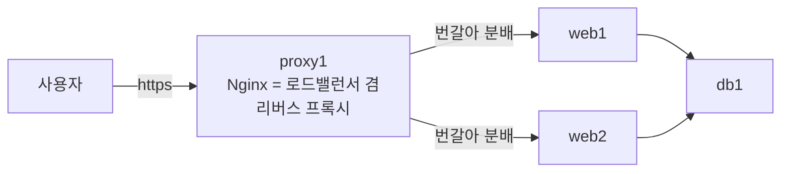
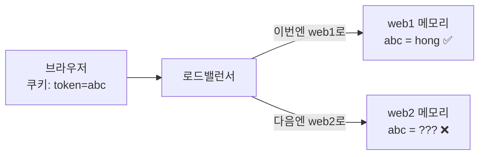

> 이번 글은 **직접 따라 하는 실습**입니다. 웹 서버를 2대로 증설하고 Nginx **부하 분산(로드밸런싱)** 으로 트래픽을 분배합니다. 한 대를 정지시켜도 서비스가 유지되는 것을 확인하고 — 그 대가로 발생하는 **세션 불일치 문제**를 의도적으로 재현합니다.
{: .prompt-info }

**이번에 켤 VM**: `proxy1`, `web1`, `web2`(새로 만듦), `db1`

## 0. 이번 단계의 그림



| 오늘 배우는 것 | 설명 |
|---|---|
| 스케일 아웃(Scale-out) | 좋은 서버 1대 대신 **보통 서버 여러 대**로 늘리는 전략 |
| upstream (서버 풀) | Nginx에 "뒤쪽 서버 명단"을 등록하고 분배시키기 |
| 헬스체크·장애조치 | 죽은 서버를 자동으로 빼고 산 서버로만 보내기 |
| 상태(state)의 함정 | **서버가 여러 대가 되는 순간 "서버 메모리에 저장한 것"은 전부 문제가 된다** |

---

## 1. web2 만들기 — web1을 복제

새 서버를 처음부터 설치할 필요가 없습니다. **web1 자체를 복제**하면 애플리케이션·설정까지 그대로 복사됩니다. 실무에서 "서버 이미지(Golden Image)로 동일한 서버를 대량 배포"하는 것과 같은 원리입니다.

1. `web1`을 **종료**한 상태에서 우클릭 → 복제
2. 이름: `web2` / **MAC 주소 새로 생성** / 완전한 복제
3. `web2` 시작 → VirtualBox 화면에서 로그인 (아직 IP가 web1과 같아서 SSH 불가)

`web2` 콘솔에서 이름과 IP를 바꿉니다.

```bash
sudo hostnamectl set-hostname web2
sudo nano /etc/netplan/50-cloud-init.yaml
```

`192.168.100.11/24` → `192.168.100.12/24` 로 수정 후:

```bash
sudo netplan apply
sudo reboot
```

이후 `web1`도 시작합니다. 호스트에서 두 대 모두 확인:

```bash
ssh infra@192.168.100.12 hostname   # web2
ssh infra@192.168.100.11 hostname   # web1
```

### 1.1 web2 방화벽·DB 접근 확인

복제 덕분에 UFW 규칙("proxy1에서 8080 허용")도 이미 들어 있습니다. 확인만 합니다.

```bash
ssh infra@192.168.100.12
sudo ufw status                # 8080 ALLOW from 192.168.100.31 확인
curl -s localhost:8080 | head -3   # 앱이 떠 있는지 (자기 자신에서 확인)
```

**한 가지 함정**: `db1`의 방화벽은 "web1(.11)만 3306 허용"이었습니다. web2도 열어 줍니다.

```bash
ssh infra@192.168.100.21
sudo ufw allow from 192.168.100.12 to any port 3306 proto tcp
sudo ufw status
```

> DB 계정은 이미 `'app'@'192.168.100.%'` (대역 전체)로 만들어서 손댈 필요가 없습니다. **방화벽은 서버 단위로 정확히, DB 계정은 대역으로** — 계층마다 잠금 굵기가 다른 것도 설계입니다.
{: .prompt-tip }

---

## 2. 로드밸런싱 설정 — upstream

`proxy1`에서 설정을 수정합니다.

```bash
ssh infra@192.168.100.31
sudo nano /etc/nginx/sites-available/webapp
```

파일 **맨 위**에 upstream 블록을 추가하고, `proxy_pass`를 수정합니다. 전체가 아래 모양이 되면 됩니다.

```nginx
# 뒤쪽 웹 서버 명단 (서버 풀)
upstream web_pool {
    server web1:8080 max_fails=2 fail_timeout=10s;
    server web2:8080 max_fails=2 fail_timeout=10s;
}

server {
    listen 80;
    return 301 https://$host$request_uri;
}

server {
    listen 443 ssl;

    ssl_certificate     /etc/nginx/ssl/lab.crt;
    ssl_certificate_key /etc/nginx/ssl/lab.key;

    location / {
        proxy_pass http://web_pool;              # 이제 "명단"으로 보낸다
        proxy_next_upstream error timeout http_502;
        proxy_set_header Host $host;
        proxy_set_header X-Real-IP $remote_addr;
        proxy_set_header X-Forwarded-Proto $scheme;
    }
}
```

```bash
sudo nginx -t && sudo systemctl reload nginx
```

- `upstream web_pool` : 분배 대상 명단. 기본 분배 방식은 **라운드 로빈(Round Robin)**(순서대로 번갈아 배정)입니다.
- `max_fails=2 fail_timeout=10s` : 2번 연속 실패한 서버는 10초간 명단에서 제외 — **소극적 헬스체크**입니다.
- `proxy_next_upstream` : 한 서버가 실패하면 **같은 요청을 다음 서버로 재시도** — 사용자는 장애를 인지하지 못합니다.

> **★ 꼭 알아 두어야 할 개념 — 부하 분산 알고리즘 3종**: Nginx가 지원하는 대표 분배 방식은 다음과 같습니다. "언제 무엇을 쓰는가"까지 묶어서 기억하세요.
>
> | 방식 | 동작 | 적합한 상황 |
> |---|---|---|
> | **라운드 로빈** (기본값) | 순서대로 번갈아 배정 | 서버 성능이 비슷하고 요청이 균질할 때 |
> | **least_conn** | 현재 연결 수가 가장 적은 서버에 배정 | 요청 처리 시간이 들쭉날쭉할 때 |
> | **ip_hash** | 같은 사용자 IP는 항상 같은 서버로 | 세션을 서버에 두는 구조를 임시로 유지해야 할 때(고정 세션) |
{: .prompt-tip }

---

## 3. 동작 확인 — 분배되는 모습을 눈으로

브라우저에서 `https://192.168.100.31` 접속 후 **새로고침을 여러 번** 하세요.

**"응답한 서버: web1" ↔ "응답한 서버: web2"** 가 번갈아 나타납니다. 이것이 로드밸런싱입니다. (브라우저 캐시 때문에 안 바뀌면 Ctrl+F5로 강력 새로고침)

### 3.1 장애조치(Failover) 실험 — 오늘의 하이라이트

`web1`을 통째로 꺼 봅니다.

```bash
ssh infra@192.168.100.11 "sudo poweroff"
```

브라우저 새로고침 → **서비스가 멈추지 않습니다!** 모든 응답이 "web2"로 나올 뿐입니다. 2편에서는 서버 하나만 정지해도 서비스 전체가 중단되었는데, 이제는 **한 대에 장애가 발생해도 서비스가 지속됩니다.** 이것이 이중화(Redundancy)의 효과입니다.

`web1`을 다시 켜고 1분쯤 지나면, 새로고침 시 다시 web1/web2가 번갈아 나옵니다. **복구도 자동**입니다.

---

## 4. 문제 발생 — 로그인 상태가 일관되지 않는다

이제 이 상태에서 **로그인**해 보세요. (`hong` / `test1234`)

로그인 직후부터 새로고침을 반복하면 이상한 일이 벌어집니다.

- 어떤 때는 "**hong님 환영합니다!**" (응답한 서버: web1)
- 어떤 때는 "**회원가입 | 로그인**" — 로그아웃된 모습?! (응답한 서버: web2)

### 왜 이런 일이?

3편에서 세션(로그인 상태)을 **서버 메모리(`SESSIONS` 딕셔너리)** 에 저장했습니다. 로그인 요청이 web1에 갔다면, "hong의 세션 토큰"은 **web1의 메모리에만** 있습니다. web2는 그 토큰을 모릅니다.



| 요청이 간 곳 | 세션 조회 결과 | 화면 |
|---|---|---|
| web1 | `abc → hong` 있음 | 환영합니다 |
| web2 | `abc` 모름 | 비로그인 화면 |

이것이 분산 시스템의 고전적 함정, **"상태(state)를 서버 안에 두지 마라"** 입니다. 서버를 늘리는 순간, 서버 메모리·로컬 파일에 저장한 모든 것(세션, 업로드 파일, 캐시…)이 "어느 서버에 갔느냐"에 따라 보였다 안 보였다 하게 됩니다.

### 해결 방향 두 가지

| 방법 | 원리 | 단점 |
|---|---|---|
| 고정 세션(Sticky Session) | 같은 사용자는 항상 같은 서버로 보냄 (`ip_hash` 등) | 해당 서버 장애 시 그 사용자들의 세션 소실, 분배 불균형 |
| **세션 저장소 분리** ★ | 세션을 **모든 웹 서버가 공유하는 별도 저장소**로 옮김 | 저장소 서버가 하나 더 필요 |

실무 표준은 후자이고, 그 저장소로 가장 널리 쓰이는 것이 **Redis**입니다. 다음 편에서 `redis1` 서버를 구축해 이 문제를 해결합니다.

---

## 5. 트러블슈팅

| 증상 | 진단 | 해결 |
|---|---|---|
| 새로고침해도 계속 같은 서버만 나옴 | — | 정상일 수 있음(브라우저 연결 재사용). Ctrl+F5, 또는 시크릿 창 |
| web2만 502 | `proxy1`에서 `curl -s http://web2:8080` | web2의 webapp 서비스 확인, UFW 출발지 IP 확인 |
| web2 화면에서 500 에러 | `web2`에서 `journalctl -u webapp -n 30` | db1 방화벽에 `.12` 허용 누락 → 1.1 |
| 두 대 모두 502 | `proxy1`에서 `curl http://web1:8080` | upstream 블록 오타(`web_pool` 이름 불일치 등), `nginx -t`로 확인 |
| 복제 후 web1·web2가 동시에 접속 끊김 | `ip a`를 양쪽에서 | **IP 충돌** — 복제 시 MAC 재생성 누락. 1편 트러블슈팅 참조 |
| `netplan apply` 후에도 옛 IP | — | 파일 저장 여부, `sudo reboot`로 확실히 반영 |

---

## 6. 핵심 용어 정리

| 용어 | 영문 | 정의 |
|---|---|---|
| 스케일 아웃 | Scale-out | 서버 대수를 늘려 처리 능력을 확장하는 전략 (↔ 스케일 업: 한 대의 성능을 높임) |
| 부하 분산 | Load Balancing | 여러 서버에 요청을 나누어 배분하는 것 |
| 라운드 로빈 | Round Robin | 대상 서버에 순서대로 번갈아 배정하는 기본 분배 알고리즘 |
| 헬스 체크 | Health Check | 후방 서버의 정상 여부를 확인해 장애 서버를 분배 대상에서 제외하는 기능 |
| 페일오버 | Failover | 장애 발생 시 예비 자원으로 자동 전환되는 것 |
| 이중화 | Redundancy | 같은 역할의 자원을 복수로 두어 단일 장애점을 제거하는 설계 |
| 상태 | State | 서버가 요청 사이에 기억하는 정보(세션 등) — 서버 내부에 두면 증설 시 문제 발생 |
| 고정 세션 | Sticky Session | 같은 사용자를 항상 같은 서버로 보내는 임시방편적 세션 유지 기법 |

## 7. 마무리 — 스냅샷

전체 종료 후 스냅샷: `web1`/`web2` → **`stage4-web`**, `proxy1` → **`stage4-proxy`**, `db1` → **`stage4-db`**

| 얻은 것 | 남은 문제 |
|---|---|
| 웹 서버 이중화 + 자동 장애조치 | **세션 불일치** → 06에서 Redis로 해결 |
| | 프록시 1대 SPOF → 07 |
| | DB 1대 SPOF → 08 |
