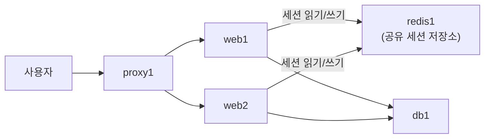

> 이번 글은 **직접 따라 하는 실습**입니다. 세션 전용 저장소 **Redis** 서버를 구축하고, 웹 서버 2대가 로그인 상태를 **공유**하게 만들어 5편의 세션 불일치 문제를 해결합니다. Redis에는 비밀번호와 방화벽으로 다중 잠금을 적용합니다.
{: .prompt-info }

**이번에 켤 VM**: `proxy1`, `web1`, `web2`, `db1`, `redis1`(새로 만듦)

## 0. 이번 단계의 그림



| 오늘 배우는 것 | 설명 |
|---|---|
| Redis | 메모리에서 동작하는 초고속 키-값 저장소 (AWS에서 빌려 쓰면 "ElastiCache") |
| 왜 DB(MariaDB)에 안 넣나 | 세션은 초당 수천 번 읽고 유효기간이 짧음 — 디스크 DB엔 아깝고 느림 |
| 두 DB의 역할 분담 | **MariaDB = 영구 데이터(회원정보)**, **Redis = 휘발성 데이터(로그인 상태)** — 실무 홈페이지 인증의 표준 조합 |
| TTL(유효기간) | "1시간 뒤 자동 로그아웃"을 저장소가 알아서 처리 |

---

## 1. redis1 서버 만들기

**1편 7장의 표준 절차**(복제 → 호스트명 → 고정 IP → 확인 → SSH)로: 이름 `redis1` / IP `192.168.100.25` / 메모리 768 MB

```bash
ssh infra@192.168.100.25
sudo apt update
sudo apt install -y redis-server
```

> 우분투 24.04 저장소의 Redis 7.0은 **BSD 라이선스(오픈소스)** 입니다. (최신 상위 버전은 라이선스가 바뀌어, 오픈소스 진영에서는 **Valkey**라는 갈래(포크)도 등장했습니다 — 우리 실습은 저장소판이면 충분합니다.)
{: .prompt-info }

### 1.1 Redis 보안 설정 — 반드시!

Redis는 기본 설정이 "자기 자신 전용"이라 그대로는 web1/web2가 접속할 수 없고, 무분별하게 개방하면 이번에는 매우 위험합니다. **인증 없이 인터넷에 노출된 Redis는 공격자들의 대표적인 표적**으로, 실제 침해 사고 통계에서 꾸준히 상위에 오릅니다. 우리는 3중으로 잠급니다: ① 수신 주소 제한 ② 비밀번호 ③ 방화벽.

```bash
sudo nano /etc/redis/redis.conf
```

다음 두 줄을 찾아 수정합니다. (nano에서 `Ctrl+W`로 검색)

```conf
# 변경 전: bind 127.0.0.1 -::1
bind 127.0.0.1 192.168.100.25

# 변경 전: # requirepass foobared  (주석 해제 + 변경)
requirepass Redis123!
```

```bash
sudo systemctl restart redis-server
```

방화벽 — **web1, web2에서 오는 6379만**:

```bash
sudo ufw allow from 192.168.100.11 to any port 6379 proto tcp
sudo ufw allow from 192.168.100.12 to any port 6379 proto tcp
sudo ufw status
```

### 1.2 동작 확인

```bash
redis-cli -a 'Redis123!' ping
```

`PONG` 이 나오면 Redis가 정상 동작 중인 것입니다. 기본 동작도 확인해 봅니다:

```bash
redis-cli -a 'Redis123!' set hello world
redis-cli -a 'Redis123!' get hello
```

Redis는 이렇게 `키 → 값`을 저장하는 단순하고 빠른 저장소입니다. 우리는 `session:토큰 → 사용자이름`을 저장할 것입니다.

> **★ 꼭 알아 두어야 할 개념 — Redis(인메모리 저장소)의 대표 용도 4가지**: ① **세션 저장소**(오늘 실습), ② **캐시**(자주 조회되는 결과를 잠시 보관해 DB 부하 절감), ③ **실시간 순위표·카운터**(게임 랭킹, 조회수), ④ **메시지 큐**(작업 대기열). 공통점은 "**빠르게 읽고 쓰되, 사라져도 치명적이지 않은 데이터**"라는 것입니다. 반대로 **사라지면 안 되는 데이터(회원, 주문, 결제)는 반드시 RDBMS**에 둡니다 — 이 역할 구분이 저장소 설계의 제1원칙입니다.
{: .prompt-tip }

---

## 2. 웹 서버 2대에 Redis 클라이언트 설치

**web1과 web2 양쪽 모두**에서:

```bash
sudo apt install -y python3-redis
```

원격 접속이 되는지 양쪽 모두에서 먼저 확인(구간 테스트):

```bash
python3 -c "import redis; r=redis.Redis(host='redis1', password='Redis123!'); print(r.ping())"
```

`True` 가 나오면 길이 뚫린 것입니다.

---

## 3. 애플리케이션 수리 — 세션을 Redis로

**web1과 web2 양쪽 모두**에서 `~/app/app.py`를 수정합니다. 바꿀 곳은 **딱 4군데**입니다.

```bash
nano ~/app/app.py
```

**① import 줄에 redis 추가** — 파일 맨 위:

```python
import pymysql, socket, secrets
import redis                                   # ← 추가
```

**② `SESSIONS = {}` 를 Redis 연결로 교체**:

```python
# SESSIONS = {}   ← 이 줄을 지우고 아래로 교체
R = redis.Redis(host="redis1", port=6379, password="Redis123!",
                decode_responses=True)
SESSION_TTL = 3600   # 세션 유효기간: 1시간(초)
```

**③ `current_user` 함수 교체**:

```python
def current_user():
    token = request.cookies.get("session")
    if not token:
        return None
    return R.get(f"session:{token}")
```

**④ 로그인 성공 부분** — `SESSIONS[token] = username` 을 교체:

```python
        token = secrets.token_hex(16)
        R.setex(f"session:{token}", SESSION_TTL, username)   # ← 교체
```

**⑤ 로그아웃 부분** — `SESSIONS.pop(token, None)` 을 교체:

```python
    token = request.cookies.get("session")
    if token:
        R.delete(f"session:{token}")   # ← 교체
```

양쪽 모두 재시작:

```bash
sudo systemctl restart webapp
systemctl status webapp --no-pager
```

핵심 변화는 단 하나입니다 — 세션의 보관 장소가 "**각자의 메모리**"에서 "**모두가 공유하는 redis1**"로 바뀌었습니다. `setex`는 "유효기간과 함께 저장"이라는 뜻으로, 1시간이 지나면 Redis가 **알아서 지워** 자동 로그아웃이 됩니다.

---

## 4. 동작 확인 — 문제가 해결되었는가

### 4.1 로그인 유지 테스트

브라우저에서 `https://192.168.100.31` → 로그인 → **새로고침 연타**.

응답 서버가 web1 ↔ web2로 번갈아 바뀌어도 **"hong님 환영합니다!"가 계속 유지**됩니다. 세션 불일치 문제가 해결되었습니다.

### 4.2 세션이 실제로 Redis에 있는 모습 보기

로그인된 상태에서 `redis1`에서:

```bash
redis-cli -a 'Redis123!' keys 'session:*'
redis-cli -a 'Redis123!' ttl "$(redis-cli -a 'Redis123!' keys 'session:*' | head -1)"
```

여러분의 로그인 세션이 키로 저장되어 있고, TTL(남은 초)이 줄어드는 것이 보입니다. **"로그인 상태"라는 추상적인 것의 실체**가 바로 이 키 하나입니다.

### 4.3 3편의 실험 재도전 — 앱 재시작 생존

```bash
ssh infra@192.168.100.11 "sudo systemctl restart webapp"
ssh infra@192.168.100.12 "sudo systemctl restart webapp"
```

브라우저 새로고침 → **로그인이 유지됩니다.** 세션이 더 이상 웹 서버 내부에 존재하지 않기 때문입니다. 웹 서버는 이제 언제든 중단·재생성해도 무방한 **무상태(Stateless) 서버**가 되었습니다 — 자유롭게 증설·축소할 수 있는 서버의 필요조건입니다.

---

## 5. 트러블슈팅

| 증상 | 진단 | 해결 |
|---|---|---|
| 웹에서 500 에러 | `journalctl -u webapp -n 30` 에 `AuthenticationError` | 비밀번호 불일치 — redis.conf의 `requirepass`와 app.py 확인 |
| 〃 `Connection refused` | `redis1`에서 `sudo ss -lntp \| grep 6379` | `192.168.100.25:6379` 없으면 bind 수정 누락 → 1.1 |
| 〃 `Timeout` | `redis1`에서 `sudo ufw status` | 방화벽에 web1/web2 허용 누락 → 1.1 |
| web1은 되는데 web2만 500 | — | app.py 수정을 **양쪽 모두** 했는지, web2의 `python3-redis` 설치 여부 |
| `redis-cli` 경고 "Using a password..." | — | 경고일 뿐 정상 동작 (명령줄에 비밀번호를 쓰면 기록에 남는다는 안내) |
| 로그인해도 바로 풀림 | `redis-cli ... keys 'session:*'` 가 비어 있음 | ④의 `setex` 교체 누락 — 저장을 안 하고 있는 것 |
| redis 재시작 후 모두 로그아웃 | — | 정상입니다. Redis는 메모리 저장소라 재시작하면 세션이 사라집니다(회원 정보는 MariaDB에 안전). 이 특성의 의미는 11편에서 다시 다룹니다 |

---

## 6. 핵심 용어 정리

| 용어 | 영문 | 정의 |
|---|---|---|
| 인메모리 저장소 | In-memory Store | 디스크가 아닌 메모리에서 동작해 매우 빠른 저장소 (Redis 등) |
| 키-값 저장소 | Key-Value Store | `키 → 값` 한 쌍 단위로 저장하는 단순 구조의 저장소 |
| TTL | Time To Live | 데이터의 유효기간 — 만료 시 저장소가 자동 삭제 |
| 무상태 서버 | Stateless Server | 요청 간 상태를 내부에 갖지 않아 자유롭게 교체·증설 가능한 서버 |
| 세션 토큰 | Session Token | 로그인 상태를 증명하는 무작위 문자열 — 쿠키로 전달, 저장소에서 대조 |
| 캐시 | Cache | 자주 쓰는 데이터의 사본을 빠른 곳에 보관하는 기법 (11편에서 심화) |

## 7. 마무리 — 스냅샷

전체 종료 후 스냅샷: `redis1` → **`stage5-redis`**, `web1`/`web2` → **`stage5-web`**

이제 인증 구조가 실무 표준과 같아졌습니다:

| 데이터 | 저장소 | 성격 |
|---|---|---|
| 회원 계정(아이디, 비밀번호 해시) | MariaDB (`db1`) | 영구, 디스크 |
| 로그인 세션(토큰) | Redis (`redis1`) | 휘발, 메모리, TTL 자동 만료 |

다음 편에서는 아직 1대뿐인 **프록시를 이중화**합니다. 서버 2대가 IP 주소 하나를 공유하는 **VIP(가상 IP)** 기술이 등장합니다.
