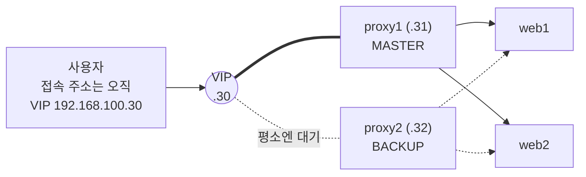

> 이번 글은 **직접 따라 하는 실습**입니다. 리버스 프록시를 2대로 증설하고 **Keepalived**로 **가상 IP(VIP)** 하나를 공유시킵니다. 프록시 한 대에 전면 장애가 발생해도 몇 초 안에 다른 한 대가 IP를 승계해 서비스가 지속됩니다.
{: .prompt-info }

**이번에 켤 VM**: `proxy1`, `proxy2`(새로 만듦), `web1`, `web2`, `db1`, `redis1`

## 0. 이번 단계의 그림



**문제 인식**: 5편에서 웹 서버는 2대가 되었지만, 사용자가 접속하는 주소는 `192.168.100.31` — **proxy1 한 대의 실제 IP**입니다. proxy1에 장애가 발생하면 후방 구성이 모두 정상이어도 서비스는 중단됩니다. 프록시가 새로운 단일 장애점이 된 것입니다.

**해결 원리 — 가상 IP(VIP)**: 사용자에게는 **어느 서버에도 고정 소속되지 않은 제3의 주소**(`192.168.100.30`)를 안내합니다. 이 주소는 평상시 proxy1이 보유하다가, proxy1 장애 시 **proxy2가 즉시 승계**합니다. 사용자는 아무것도 변경할 필요가 없습니다. 이 "주소 승계"를 자동화하는 표준 프로토콜이 **VRRP(Virtual Router Redundancy Protocol)**, 그 대표 구현체가 **Keepalived**입니다.

| 용어 | 뜻 |
|---|---|
| VIP (Virtual IP) | 정상 동작 중인 쪽이 보유하는, 이동 가능한 대표 IP |
| MASTER / BACKUP | 평상시 VIP를 보유하는 쪽 / 대기하다 승계하는 쪽 |
| VRRP | MASTER가 생존 신호를 주기적으로 보내고, 신호가 끊기면 BACKUP이 승격하는 표준 규약 |

> **★ 꼭 알아 두어야 할 개념 — 가용성(Availability)의 수치화**: 서비스가 "1년 중 몇 %의 시간 동안 정상이었는가"를 **가용성**이라 하며, 9의 개수로 표현합니다. **99.9%("쓰리 나인") = 연간 약 8.8시간 중단 허용, 99.99% = 약 53분, 99.999%("파이브 나인") = 약 5분**. 오늘 만드는 자동 승계(초 단위 전환)는 가용성 등급을 끌어올리는 핵심 수단이며, 클라우드 서비스 계약서(SLA)에도 이 수치가 명시됩니다.
{: .prompt-tip }

---

## 1. proxy2 만들기 — proxy1을 복제

Nginx 설정·인증서까지 그대로 복사되도록 **proxy1을 복제**합니다.

1. `proxy1` 종료 → 우클릭 복제 → 이름 `proxy2` / **MAC 재생성** / 완전한 복제
2. `proxy2` 콘솔에서:

```bash
sudo hostnamectl set-hostname proxy2
sudo nano /etc/netplan/50-cloud-init.yaml   # .31 → .32 로 수정
sudo netplan apply
sudo reboot
```

3. `proxy1`도 다시 켜기. 호스트에서 확인:

```bash
ssh infra@192.168.100.32 hostname   # proxy2
curl -sk https://192.168.100.32 | head -3    # proxy2 단독으로도 서비스 가능 확인
```

> `curl -k`는 자체 서명 인증서 경고를 무시하는 옵션입니다(실습 확인용).

**web1·web2의 방화벽에 proxy2를 추가**해야 합니다 (지금은 proxy1의 8080만 허용 중). 양쪽 모두에서:

```bash
sudo ufw allow from 192.168.100.32 to any port 8080 proto tcp
sudo ufw status
```

---

## 2. Keepalived 설치·설정

**proxy1과 proxy2 양쪽 모두**:

```bash
sudo apt update && sudo apt install -y keepalived
```

### 2.1 proxy1 — MASTER 설정

```bash
sudo tee /etc/keepalived/keepalived.conf > /dev/null <<'EOF'
vrrp_script chk_nginx {
    script "/usr/bin/pgrep nginx"    # nginx가 살아 있는지 2초마다 검사
    interval 2
}

vrrp_instance VI_1 {
    state MASTER
    interface enp0s8                 # 호스트 전용 어댑터
    virtual_router_id 51
    priority 150                     # 높은 쪽이 MASTER
    advert_int 1
    unicast_src_ip 192.168.100.31    # 나
    unicast_peer {
        192.168.100.32               # 상대
    }
    authentication {
        auth_type PASS
        auth_pass Vrrp123
    }
    virtual_ipaddress {
        192.168.100.30/24            # ★ VIP
    }
    track_script {
        chk_nginx
    }
}
EOF

sudo systemctl enable --now keepalived
```

### 2.2 proxy2 — BACKUP 설정

**세 곳만 다릅니다**: `state BACKUP`, `priority 100`, src/peer IP 반전.

```bash
sudo tee /etc/keepalived/keepalived.conf > /dev/null <<'EOF'
vrrp_script chk_nginx {
    script "/usr/bin/pgrep nginx"
    interval 2
}

vrrp_instance VI_1 {
    state BACKUP
    interface enp0s8
    virtual_router_id 51
    priority 100
    advert_int 1
    unicast_src_ip 192.168.100.32
    unicast_peer {
        192.168.100.31
    }
    authentication {
        auth_type PASS
        auth_pass Vrrp123
    }
    virtual_ipaddress {
        192.168.100.30/24
    }
    track_script {
        chk_nginx
    }
}
EOF

sudo systemctl enable --now keepalived
```

설정 요점:

- `priority 150 vs 100` — 둘 다 살아 있으면 숫자 큰 proxy1이 VIP를 가짐
- `unicast_*` — VRRP는 원래 멀티캐스트를 쓰지만, 가상 환경에서는 **상대를 직접 지정(유니캐스트)** 하는 편이 훨씬 안정적입니다
- `track_script` — **서버는 정상인데 nginx 프로세스만 중단된 경우**에도 VIP를 넘기도록 하는 감시 장치. "장비 생존"이 아니라 **"서비스 생존"** 을 기준으로 삼는 것이 실무 포인트입니다

---

## 3. 동작 확인

### 3.1 VIP가 어디 있나

```bash
# proxy1에서
ip a show enp0s8 | grep 192.168.100
```

proxy1에는 `.31`과 **`.30`(VIP)** 두 개가, proxy2(`ip a show enp0s8`)에는 `.32`만 보이면 정상입니다.

### 3.2 이제 사용자 주소는 VIP

브라우저에서 — **오늘부터 서비스의 공식 주소입니다**:

```
https://192.168.100.30
```

홈페이지·로그인 모두 정상 동작해야 합니다.

### 3.3 페일오버 검증 — 프록시 전면 장애 상황

새로고침이 잘 되는 상태에서, **proxy1을 통째로 정지시킵니다**:

```bash
ssh infra@192.168.100.31 "sudo poweroff"
```

브라우저에서 계속 새로고침 → 한두 번 끊기는 듯하다가 **몇 초 안에 다시 정상 응답**합니다. proxy2에서 확인:

```bash
ssh infra@192.168.100.32 "ip a show enp0s8 | grep 100.30"
```

**VIP(.30)가 proxy2로 이사**해 있습니다. proxy1을 다시 켜면 잠시 후 VIP는 자동으로 proxy1(우선순위 높음)로 돌아갑니다.

### 3.4 서비스 수준 장애도 검증

```bash
# proxy1에서
sudo systemctl stop nginx
ip a show enp0s8 | grep 100.30   # 몇 초 뒤 VIP가 사라짐 (proxy2로 이동)
sudo systemctl start nginx       # 복구하면 VIP가 돌아옴
```

`track_script` 덕분에 **nginx 프로세스만 중단되어도** VIP가 이동합니다.

---

## 4. 원본 다이어그램과 대조

원본 아키텍처의 "로드밸런서 → Reverse Proxy 1 / Reverse Proxy 2" 층이 완성됐습니다. 우리 구성에서는:

| 원본 다이어그램 | 우리 구현 |
|---|---|
| 로드밸런서 (트래픽 분산) | Nginx `upstream` (5편) + **VIP** (이번 편) |
| Reverse Proxy 1, 2 (SSL 종료) | `proxy1`, `proxy2` 의 Nginx |
| 프록시 → 웹서버 교차 화살표(X자) | 두 프록시 모두 web1·web2 양쪽에 분배 — 어느 조합에 장애가 발생해도 경로가 남는 **격자형(Mesh) 연결** |

---

## 5. 트러블슈팅

| 증상 | 진단 | 해결 |
|---|---|---|
| VIP가 아무 데도 없음 | `sudo systemctl status keepalived`, `sudo journalctl -u keepalived -n 30` | 설정 오타(중괄호 짝, interface 이름). `ip a`로 어댑터가 `enp0s8`인지 확인 |
| **둘 다 VIP를 가짐** (스플릿 브레인) | 양쪽에서 `ip a` | 서로의 생존 신호가 안 닿는 것 — `unicast_src_ip`/`unicast_peer` IP가 서로 바뀌어 있는지, `virtual_router_id`·`auth_pass` 가 양쪽 동일한지 확인 |
| VIP는 있는데 브라우저 접속 불가 | VIP 가진 쪽에서 `systemctl status nginx`, `sudo ufw status` | nginx 중단 또는 443 미허용 |
| 페일오버가 안 됨 | BACKUP 쪽 `journalctl -u keepalived -f` 를 띄우고 MASTER를 꺼 보기 | "Entering MASTER STATE" 로그가 안 나오면 위 스플릿 브레인 항목 점검 |
| 페일오버 후 web 화면이 502 | web1/web2에서 `sudo ufw status` | **proxy2의 8080 허용 누락** → 1장 마지막 단계 |
| 켜자마자 VIP가 왔다갔다 반복 | `journalctl -u keepalived -f` | `chk_nginx` 스크립트 실패 반복 — nginx가 실제로 떠 있는지 확인 |

> 이중화 시스템의 대표 사고가 **스플릿 브레인**(둘 다 자기가 MASTER라고 믿는 상태)입니다. 원인은 거의 항상 "**서로의 신호가 안 닿음**"입니다. 이중화를 설계할 때는 "동료의 생존을 어떻게 확인하는가"가 절반입니다.
{: .prompt-warning }

---

## 6. 핵심 용어 정리

| 용어 | 영문 | 정의 |
|---|---|---|
| 고가용성 | HA, High Availability | 장애가 발생해도 서비스 중단 시간을 최소화하도록 설계된 성질 |
| 가용성 | Availability | 전체 시간 중 정상 서비스 시간의 비율 (99.9% 등 "9의 개수"로 표현) |
| 가상 IP | VIP, Virtual IP | 특정 장비에 고정되지 않고 정상 장비로 이동하는 대표 IP 주소 |
| VRRP | Virtual Router Redundancy Protocol | VIP 승계를 자동화하는 표준 프로토콜 (Keepalived가 구현) |
| 액티브-스탠바이 | Active-Standby | 한쪽이 서비스하고 다른 쪽은 대기하는 이중화 방식 (MASTER/BACKUP) |
| 스플릿 브레인 | Split Brain | 상호 생존 확인이 끊겨 양쪽 모두 자신이 MASTER라 판단하는 장애 상태 |
| SLA | Service Level Agreement | 가용성 등 서비스 품질을 수치로 약속하는 계약 |

## 7. 마무리 — 스냅샷

전체 종료 후 스냅샷: `proxy1`/`proxy2` → **`stage6-proxy`**

| 얻은 것 | 남은 문제 |
|---|---|
| 프록시 이중화 — 정문이 2개 + 자동 승계 | **DB가 아직 1대** → 08 |
| 서비스 대표 주소(VIP) 확보 | 전부 한 네트워크에 있음 → 09 |

다음 편은 마지막 남은 단일 장애점, **DB를 Primary–Standby로 복제**합니다. "데이터가 실시간으로 두 벌 유지되는" 모습을 직접 보게 됩니다.
