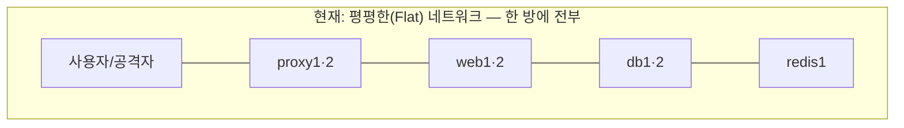
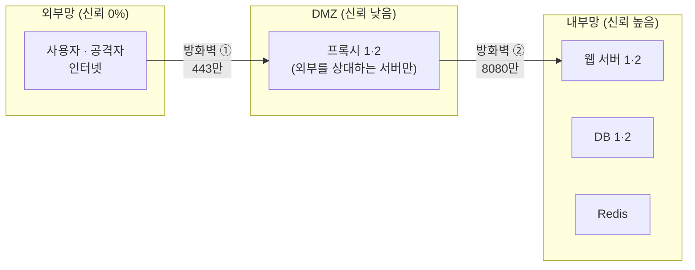
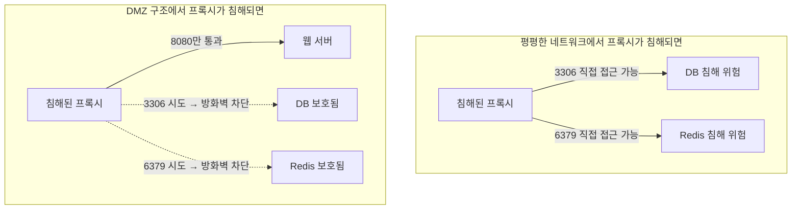
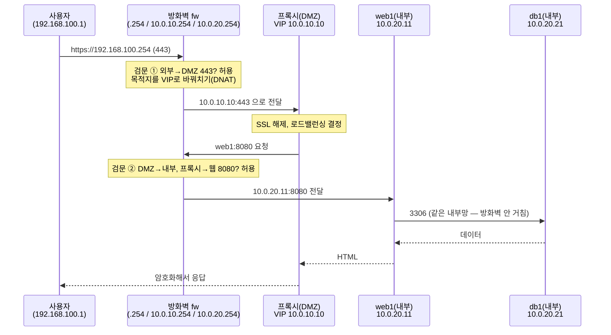

> 이번 글은 이 과정의 **하이라이트**입니다. 전용 **방화벽 VM**을 세우고, 지금까지 한 네트워크에 평평하게 있던 서버들을 **DMZ와 내부망으로 물리적으로 분리**합니다. 앞부분의 DMZ 이론은 시험에 나온다는 마음으로 정독하세요.
{: .prompt-info }

**이번에 켤 VM**: 전부 (`fw` 새로 만듦)

---

# 1부. DMZ 이론 완전 해부

## 1.1 문제 인식 — "평평한 네트워크"의 위험

지금 우리 인프라는 기능적으로는 훌륭하지만, 보안 관점에서 치명적 약점이 있습니다. **모든 서버가 한 네트워크(192.168.100.0/24)에 있다**는 것입니다.



각 서버에 UFW(개별 방화벽)를 걸어 두긴 했지만, 상상해 봅시다. **프록시 서버가 해킹당했다면?** 공격자는 프록시 위에서 이렇게 할 수 있습니다:

- 같은 네트워크의 **DB(3306), Redis(6379)에 직접 접속 시도** — 개별 UFW 하나만 우회하면 핵심 자산까지 직행
- 네트워크 전체를 스캔하며 다음 공격 대상 탐색 (이를 **측면 이동, Lateral Movement**이라 합니다)

즉 지금 구조는 **"정문(프록시) 하나만 넘으면 금고실까지 복도가 차단 없이 이어진 건물"** 입니다. 개별 서버의 방화벽은 각 방의 잠금장치일 뿐, **구역 자체를 나누는 벽**이 없습니다.

## 1.2 해답 — 구역(Zone)을 나누고 사이에 방화벽을 세운다

보안 설계의 대전제는 이것입니다:

> **"외부에 노출된 서버는 언젠가 뚫릴 수 있다"고 가정하라.** 그래서 뚫려도 피해가 **그 구역 안에서 멈추게** 설계하라.
{: .prompt-warning }

이를 위해 네트워크를 **신뢰 수준이 다른 세 구역**으로 나눕니다.



**DMZ(DeMilitarized Zone, 비무장지대)** 란: 외부망과 내부망 **사이에 끼어 있는 완충 구역**으로, **외부의 접속을 직접 받아야만 하는 서버**(프록시, 메일 게이트웨이, 외부 DNS 등)만 모아 두는 곳입니다. 이름은 한반도의 비무장지대에서 왔습니다 — 양쪽 어디도 완전히 믿지 않는 중간 지대라는 뜻입니다.

### 은행 비유로 완성하기

| 네트워크 구역 | 은행 비유 | 들어올 수 있는 사람 |
|---|---|---|
| 외부망 | 길거리 | 아무나 |
| **DMZ** | **객장(창구 로비)** | 정문 검색대를 통과한 손님 |
| 내부망 | 금고실·사무 구역 | **직원뿐** — 손님은 어떤 경우에도 출입 불가 |

손님(사용자)은 객장(DMZ)까지만 들어올 수 있습니다. 손님의 요청은 **창구 직원(프록시)이 대신** 금고실(내부망)에 전달합니다. 침입자가 객장을 장악하더라도(프록시 침해) 금고실 문(방화벽 ②)은 여전히 잠겨 있습니다.

## 1.3 DMZ의 3대 통행 규칙

방화벽이 강제하는 규칙은 놀랄 만큼 단순합니다. **아래 표가 이번 편의 전부**라고 해도 과언이 아닙니다.

| 출발지 → 목적지 | 허용? | 이유 |
|---|---|---|
| 외부 → DMZ | ⭕ **지정 포트만** (443) | 서비스는 해야 하니까 — 단, 문은 하나만 |
| DMZ → 내부 | ⭕ **지정 경로만** (프록시→웹 8080) | 일을 전달해야 하니까 — 단, 필요한 통로만 |
| 외부 → 내부 | ❌ **절대 금지** | 이 규칙이 DMZ의 존재 이유 |
| 내부 → DMZ | ❌ 원칙 금지 | 내부가 감염돼도 DMZ를 발판으로 못 쓰게 |
| DMZ → 외부(역방향 발신) | ❌ 원칙 금지 | 뚫린 프록시가 해커 서버로 데이터를 못 빼돌리게 |

> 핵심 통찰: DMZ 설계의 본질은 "무엇을 허용할까"가 아니라 **"기본 전부 차단 + 업무에 꼭 필요한 최소 경로만 예외 허용"** 입니다. 우리가 1편부터 UFW로 연습한 원칙의 네트워크 버전입니다.
{: .prompt-tip }

> **★ 꼭 알아 두어야 할 개념 — 화이트리스트 방식**: "기본 차단 + 예외 허용"을 **화이트리스트(Whitelist, 허용 목록) 방식**, 그 반대인 "기본 허용 + 위험한 것만 차단"을 **블랙리스트(Blacklist, 차단 목록) 방식**이라 합니다. 블랙리스트는 "미처 몰랐던 공격"을 막지 못하지만, 화이트리스트는 **알지 못하는 것은 애초에 통과시키지 않습니다.** 보안 설계에서 방화벽·접근 통제의 표준은 언제나 화이트리스트 방식입니다.
{: .prompt-tip }

## 1.4 공격자의 눈으로 본 DMZ — 뚫렸을 때의 차이

같은 "프록시 침해" 사고가 구조에 따라 어떻게 달라지는지 살펴봅니다.



DMZ 구조에서 공격자는 다시 웹 서버의 8080이라는 좁은 문으로 **한 단계 더 해킹**을 성공시켜야 하고, 그동안 방화벽 로그에는 차단 기록이 쌓입니다(탐지 기회). 피해를 "0으로 만드는" 게 아니라 **"한 겹씩 느리게, 시끄럽게"** 만드는 것 — 이것이 심층 방어입니다.

## 1.5 사용자 요청의 여행 — 패킷 워크스루

망 분리 후, 사용자의 클릭 한 번은 이런 여행을 하게 됩니다. (오늘 만들 최종 모습)



사용자는 방화벽 주소만 알 뿐, DMZ 너머의 세계(VIP, 웹, DB)는 존재조차 모릅니다.

---

# 2부. 실습 — 망 분리 전면 재구성

## 2.0 새 주소 계획표 (이사 후)

VirtualBox의 **내부 네트워크(Internal Network)** 는 "호스트조차 직접 접근 못 하는, VM끼리만의 스위치"입니다. DMZ와 내부망으로 딱 맞는 재료입니다.

| 구역 | VirtualBox 네트워크 | 대역 | 입주자 |
|---|---|---|---|
| 외부망(WAN) | 호스트 전용 (기존 그대로) | 192.168.100.0/24 | 호스트(.1)=사용자, **fw(.254)** |
| DMZ | 내부 네트워크 `dmz-net` | 10.0.10.0/24 | proxy1(.11), proxy2(.12), **VIP(.10)**, fw(.254) |
| 내부망 | 내부 네트워크 `int-net` | 10.0.20.0/24 | web1(.11), web2(.12), db1(.21), db2(.22), redis1(.25), fw(.254) |

> 이사 후 호스트에서 각 VM으로의 **SSH가 더 이상 안 됩니다**(그게 정상 — 내부망이니까!). 오늘 수정 작업은 **이사 전에 SSH로 미리** 해 두고, 이사 후 관리는 VirtualBox 콘솔로 합니다. "콘솔 관리는 불편하다"는 그 불편함이 다음 편 **Bastion Host**의 존재 이유입니다.
{: .prompt-warning }

## 2.1 방화벽 VM `fw` 만들기

**1편 7장의 표준 절차**로 복제하되, 이번에는 **어댑터를 4개** 답니다.

1. `base` 복제 → 이름 `fw` / MAC 재생성 / 완전한 복제 / 메모리 768 MB
2. **설정 → 네트워크**:

| 어댑터 | 연결 | 이름 | 역할 |
|---|---|---|---|
| 1 | NAT | — | apt용 인터넷 |
| 2 | 호스트 전용 | (기존 네트워크) | **WAN 다리** |
| 3 | **내부 네트워크** | `dmz-net` (직접 입력) | **DMZ 다리** |
| 4 | **내부 네트워크** | `int-net` (직접 입력) | **내부망 다리** |

3. 부팅 후 VirtualBox 콘솔에서 로그인합니다(아직 IP가 없어 SSH 불가):

```bash
sudo hostnamectl set-hostname fw
ip a    # enp0s3(NAT), enp0s8, enp0s9, enp0s10 4개 확인
sudo nano /etc/netplan/50-cloud-init.yaml
```

```yaml
network:
  version: 2
  ethernets:
    enp0s3:
      dhcp4: true
    enp0s8:                # WAN (호스트 전용)
      dhcp4: false
      addresses: [192.168.100.254/24]
    enp0s9:                # DMZ
      dhcp4: false
      addresses: [10.0.10.254/24]
    enp0s10:               # 내부망
      dhcp4: false
      addresses: [10.0.20.254/24]
```

```bash
sudo netplan apply
```

이제 호스트에서 `ssh infra@192.168.100.254` 로 fw에 접속해 나머지를 진행합니다.

### 2.1.1 라우터 기능 켜기 (패킷 포워딩)

리눅스는 기본적으로 "남의 패킷"을 전달하지 않습니다. 방화벽은 구역 사이에서 패킷을 **전달하는 라우터**이기도 하므로, 포워딩을 켭니다.

```bash
echo "net.ipv4.ip_forward=1" | sudo tee /etc/sysctl.d/99-forward.conf
sudo sysctl --system
```

### 2.1.2 방화벽 규칙 (nftables)

`fw`에서는 UFW 대신, 그 밑바닥 엔진인 **nftables**를 직접 씁니다. 구역 간 통행 규칙(1.3의 표!)을 그대로 코드로 옮기는 것입니다.

```bash
sudo tee /etc/nftables.conf > /dev/null <<'EOF'
#!/usr/sbin/nft -f
flush ruleset

define WAN = enp0s8
define DMZ = enp0s9
define INT = enp0s10
define VIP = 10.0.10.10

table inet filter {
    # fw 자신으로 들어오는 통신
    chain input {
        type filter hook input priority 0; policy drop;
        ct state established,related accept
        iif "lo" accept
        iifname $WAN tcp dport 22 accept          # 관리자(호스트)의 fw 관리용 SSH
        icmp type echo-request accept              # ping 진단 허용
    }

    # ★ 구역 사이를 지나가는 통신 — DMZ 3대 규칙의 구현
    chain forward {
        type filter hook forward priority 0; policy drop;   # 기본: 전부 차단
        ct state established,related accept                  # 허용된 대화의 응답은 통과

        # 규칙① 외부 → DMZ : VIP의 80/443만
        iifname $WAN oifname $DMZ ip daddr $VIP tcp dport { 80, 443 } accept

        # 규칙② DMZ → 내부 : 프록시들 → 웹서버들의 8080만
        iifname $DMZ oifname $INT ip saddr { 10.0.10.11, 10.0.10.12 } ip daddr { 10.0.20.11, 10.0.20.12 } tcp dport 8080 accept

        # 규칙③ 그 외 전부 = 기본 정책(drop)으로 차단
        #   - 외부 → 내부 직행 ❌   - DMZ → DB/Redis ❌   - 내부 → DMZ ❌
    }
}

table ip nat {
    # 외부에서 fw(.254)의 80/443으로 오면 → 목적지를 DMZ의 VIP로 바꿔 전달(DNAT)
    chain prerouting {
        type nat hook prerouting priority -100;
        iifname $WAN tcp dport { 80, 443 } dnat to $VIP
    }
}
EOF

sudo systemctl enable --now nftables
sudo nft list ruleset | head -20   # 적용 확인
```

## 2.2 이사 전 사전 작업 — 각 VM을 SSH로 미리 수정

**아직 모든 VM은 기존 네트워크에 있으므로 SSH가 됩니다.** 지금부터의 수정은 저장만 하고, **`netplan apply`는 하지 않습니다**(다음 부팅 때 새 주소로 깨어나게).

### 공통 작업 A — hosts 파일 교체 (모든 VM: proxy1·2, web1·2, db1·2, redis1)

각 VM에 SSH 접속해 아래를 그대로 붙여넣습니다.

```bash
sudo sed -i -E '/[[:space:]](web1|web2|db1|db2|redis1|vip|proxy1|proxy2|bastion|fw)$/d' /etc/hosts
sudo tee -a /etc/hosts > /dev/null <<'EOF'
# === 웹 인프라 실습 (망 분리 후) ===
10.0.20.11  web1
10.0.20.12  web2
10.0.20.21  db1
10.0.20.22  db2
10.0.20.25  redis1
10.0.10.10  vip
10.0.10.11  proxy1
10.0.10.12  proxy2
10.0.10.40  bastion
10.0.10.254 fw-dmz
10.0.20.254 fw-int
EOF
```

### 공통 작업 B — netplan 교체 (VM마다 주소만 다름)

```bash
sudo nano /etc/netplan/50-cloud-init.yaml
```

**프록시(DMZ 입주자)** — `proxy1`은 `10.0.10.11/24`, `proxy2`는 `10.0.10.12/24`:

```yaml
network:
  version: 2
  ethernets:
    enp0s3:
      dhcp4: true
    enp0s8:
      dhcp4: false
      addresses: [10.0.10.11/24]        # proxy2는 10.0.10.12/24
      routes:
        - to: 10.0.20.0/24              # 내부망으로 갈 때는
          via: 10.0.10.254              # 방화벽의 DMZ 다리로
        - to: 192.168.100.0/24          # 사용자에게 응답할 때도
          via: 10.0.10.254              # 방화벽을 거쳐서
```

**내부망 입주자** — `web1` `10.0.20.11`, `web2` `10.0.20.12`, `db1` `10.0.20.21`, `db2` `10.0.20.22`, `redis1` `10.0.20.25`:

```yaml
network:
  version: 2
  ethernets:
    enp0s3:
      dhcp4: true
    enp0s8:
      dhcp4: false
      addresses: [10.0.20.11/24]        # ← VM마다 해당 주소로
      routes:
        - to: 10.0.10.0/24              # DMZ(프록시)에 응답할 때는
          via: 10.0.20.254              # 방화벽의 내부망 다리로
```

> `routes`가 왜 필요한가? 구역이 나뉘면 "다른 구역으로 가는 길은 방화벽을 거친다"를 각 서버에 알려줘야 합니다. 기본 게이트웨이를 통째로 바꾸지 않고 **필요한 목적지에만 경로를 추가**해서, NAT 어댑터(인터넷·apt)는 그대로 살려 둡니다.
{: .prompt-info }

### 개별 작업 C — 방화벽·설정 속 옛 주소 교체

**web1, web2** (프록시의 새 주소로 UFW 갱신):

```bash
sudo ufw delete allow from 192.168.100.31 to any port 8080 proto tcp
sudo ufw delete allow from 192.168.100.32 to any port 8080 proto tcp
sudo ufw allow from 10.0.10.11 to any port 8080 proto tcp
sudo ufw allow from 10.0.10.12 to any port 8080 proto tcp
```

**db1** (웹·Standby의 새 주소 + 새 대역 계정):

```bash
sudo ufw delete allow from 192.168.100.11 to any port 3306 proto tcp
sudo ufw delete allow from 192.168.100.12 to any port 3306 proto tcp
sudo ufw delete allow from 192.168.100.22 to any port 3306 proto tcp
sudo ufw allow from 10.0.20.11 to any port 3306 proto tcp
sudo ufw allow from 10.0.20.12 to any port 3306 proto tcp
sudo ufw allow from 10.0.20.22 to any port 3306 proto tcp
sudo mysql <<'EOF'
CREATE USER IF NOT EXISTS 'app'@'10.0.20.%' IDENTIFIED BY 'App123!';
GRANT ALL PRIVILEGES ON appdb.* TO 'app'@'10.0.20.%';
CREATE USER IF NOT EXISTS 'repl'@'10.0.20.22' IDENTIFIED BY 'Repl123!';
GRANT REPLICATION SLAVE ON *.* TO 'repl'@'10.0.20.22';
FLUSH PRIVILEGES;
EOF
```

**db2** (웹 허용 + 새 대역 계정):

```bash
sudo ufw delete allow from 192.168.100.11 to any port 3306 proto tcp
sudo ufw delete allow from 192.168.100.12 to any port 3306 proto tcp
sudo ufw allow from 10.0.20.11 to any port 3306 proto tcp
sudo ufw allow from 10.0.20.12 to any port 3306 proto tcp
sudo mysql <<'EOF'
CREATE USER IF NOT EXISTS 'app'@'10.0.20.%' IDENTIFIED BY 'App123!';
GRANT ALL PRIVILEGES ON appdb.* TO 'app'@'10.0.20.%';
FLUSH PRIVILEGES;
EOF
```

**redis1** (수신 주소 + UFW):

```bash
sudo sed -i 's/^bind 127.0.0.1 192.168.100.25/bind 127.0.0.1 10.0.20.25/' /etc/redis/redis.conf
sudo ufw delete allow from 192.168.100.11 to any port 6379 proto tcp
sudo ufw delete allow from 192.168.100.12 to any port 6379 proto tcp
sudo ufw allow from 10.0.20.11 to any port 6379 proto tcp
sudo ufw allow from 10.0.20.12 to any port 6379 proto tcp
```

**proxy1, proxy2** (Keepalived의 IP들 — VIP와 상대 주소):

```bash
# proxy1에서
sudo sed -i -e 's/192.168.100.30/10.0.10.10/' \
            -e 's/192.168.100.31/10.0.10.11/' \
            -e 's/192.168.100.32/10.0.10.12/' /etc/keepalived/keepalived.conf
# proxy2에서도 동일한 명령 실행
```

(Nginx의 upstream은 `web1:8080`처럼 **이름**을 써 두었으므로 hosts 교체만으로 해결 — 수정할 것이 없습니다. 3편부터의 약속이 여기서 빛납니다.)

### 개별 작업 D — db2의 복제 연결 주소 갱신

`db2`에서 (아직 옛 네트워크라 복제가 살아 있을 때):

```bash
sudo mysql -e "STOP SLAVE; SHOW SLAVE STATUS\G" | grep -E "Relay_Master_Log_File|Exec_Master_Log_Pos"
```

출력된 파일명과 숫자를 메모하고, 새 주소로 다시 연결해 둡니다(적용은 이사 후 자동):

```sql
sudo mysql
CHANGE MASTER TO
  MASTER_HOST='10.0.20.21',
  MASTER_USER='repl',
  MASTER_PASSWORD='Repl123!',
  MASTER_LOG_FILE='(메모한 파일명)',
  MASTER_LOG_POS=(메모한 숫자);
EXIT;
```

## 2.3 이사 — VirtualBox에서 네트워크 재배치

**모든 VM을 종료**(`sudo poweroff`)한 뒤, VirtualBox에서 각 VM의 **설정 → 네트워크 → 어댑터 2**를 변경합니다:

| VM | 어댑터 2를 이렇게 변경 |
|---|---|
| proxy1, proxy2 | 내부 네트워크 → 이름: `dmz-net` |
| web1, web2, db1, db2, redis1 | 내부 네트워크 → 이름: `int-net` |
| fw | (이미 완료) |

## 2.4 부팅 순서와 검증

**켜는 순서**: `fw` → `db1` → `db2` → `redis1` → `web1` → `web2` → `proxy1` → `proxy2` (뒤쪽 의존성부터)

전부 켜졌으면, 호스트 브라우저에서 — **이제 서비스의 유일한 주소는 방화벽입니다**:

```
https://192.168.100.254
```

홈페이지가 표시되고, 로그인이 되고, 새로고침 시 web1/web2가 번갈아 나오면 — **전면 재구성이 성공한 것입니다.** 사용자에게 보이는 것은 방화벽 주소 하나뿐이고, 그 뒤의 구조는 완전히 은폐되었습니다.

### "안 되어야 할 것" 검증 — DMZ의 존재 증명

fw의 규칙이 실제로 구역을 지키는지, **공격자 관점의 검증**으로 확인합니다.

**① 외부 → 내부 직행 차단** (호스트 PowerShell에서):

```bash
ssh -o ConnectTimeout=3 infra@10.0.20.21
```

응답조차 없이 실패해야 정상 — 외부에서 내부망은 **존재 자체가 안 보입니다.**

**② DMZ → DB 직행 차단** (proxy1 콘솔에서 — 프록시가 해킹됐다고 가정):

```bash
sudo apt install -y netcat-openbsd   # 포트 노크 도구 (없을 때만)
nc -zv -w3 db1 3306
nc -zv -w3 redis1 6379
```

둘 다 `timed out` — **프록시가 침해되어도 핵심 자산(DB·Redis)에는 도달할 수 없습니다.** 1.4의 그림이 현실이 된 것입니다.

**③ 허용 경로는 정상** (proxy1 콘솔에서):

```bash
curl -s http://web1:8080 | head -3   # 이건 되어야 함 (규칙②)
```

---

## 3. 트러블슈팅 — 구간별 진단법

구역이 나뉘면 "어느 구간에서 막혔나"를 **바깥에서 안쪽으로** 좁혀 갑니다.

```
사용자 → [①] fw → [②] VIP/프록시 → [③] 웹 → [④] DB·Redis
```

| 증상 | 진단 | 해결 |
|---|---|---|
| 브라우저 무반응 (①) | 호스트에서 `ping 192.168.100.254` | fw의 enp0s8 주소, VM 어댑터 2 연결 확인 |
| ping은 되는데 페이지 무반응 (②) | fw에서 `sudo nft list ruleset` 로 규칙 확인, `ping 10.0.10.10` | nftables 미적용(`systemctl status nftables`), 포워딩 미설정(2.1.1), keepalived의 VIP 미갱신(작업 C) |
| fw에서 VIP ping 실패 | proxy1 콘솔 `ip a` | 프록시 netplan 미교체 또는 어댑터가 dmz-net에 안 붙음 |
| 502 Bad Gateway (③) | proxy1 콘솔에서 `curl http://web1:8080` | 실패 시: fw 규칙②의 IP 오타, web의 netplan/routes, web UFW(작업 C) 순서로 확인 |
| 웹은 뜨는데 500 (④) | web1 콘솔에서 `mariadb -h db1 -u app -p'App123!' appdb -e "SELECT 1;"` | db1 UFW·계정(작업 C), hosts 교체 누락 |
| 로그인만 안 됨 (④) | web1 콘솔에서 redis 핑 테스트(6편 2장) | redis1의 bind 주소·UFW(작업 C) |
| 프록시에서 web으로 ping은 되는데 curl 안 됨 | — | ping(ICMP)과 TCP는 별개 — fw 규칙②가 8080만 허용하는지, web UFW 확인 |
| 복제 끊김 | db2에서 `SHOW SLAVE STATUS\G` | 작업 D의 좌표 오타, db1 UFW의 `.22` 허용 확인 |
| 어떤 VM이 인터넷(apt)이 안 됨 | `ip route` | netplan에서 enp0s3(NAT, dhcp4)을 지웠는지 확인 — NAT 어댑터는 그대로 둬야 함 |

> **계층적 구간 진단(양파 진단법)**: 문제가 발생하면 항상 사용자 쪽(바깥 껍질)부터 한 구간씩 벗기며 들어가세요. "①은 된다, ②도 된다, ③에서 막힌다" — 이렇게 좁히면 어떤 복잡한 인프라 장애도 결국 한 구간의 문제로 축소됩니다.
{: .prompt-warning }

---

## 4. 핵심 용어 정리

| 용어 | 영문 | 정의 |
|---|---|---|
| DMZ | DeMilitarized Zone | 외부망과 내부망 사이의 완충 구역 — 외부 접속을 직접 받는 서버만 배치 |
| 망 분리 | Network Segmentation | 신뢰 수준에 따라 네트워크를 구역으로 나누어 격리하는 것 |
| 측면 이동 | Lateral Movement | 침해한 서버를 발판으로 같은 네트워크의 다른 서버로 침투를 확장하는 공격 기법 |
| 화이트리스트 방식 | Whitelist | 기본 차단 후 허용 목록만 통과시키는 접근 통제 방식 |
| 패킷 포워딩 | Packet Forwarding | 라우터/방화벽이 구역 사이에서 남의 패킷을 전달하는 기능 (`ip_forward`) |
| DNAT | Destination NAT | 들어온 패킷의 목적지 주소를 다른 주소로 변환해 전달하는 것 |
| nftables | — | 리눅스 커널의 표준 패킷 필터링 프레임워크 (UFW의 하부 엔진) |
| 내부 네트워크 | Internal Network (VirtualBox) | 호스트조차 직접 접근할 수 없는, VM 간 전용 가상 스위치 |
| 심층 방어 | Defense in Depth | 경계 방화벽 + 개별 서버 방화벽처럼 방어 수단을 겹겹이 두는 전략 |

## 5. 마무리

전체 종료 후 스냅샷: 전 VM → **`stage8-dmz`** (특히 `fw` 필수)

원본 아키텍처 다이어그램과 비교해 봅시다:

| 원본 다이어그램 | 우리 구현 | 상태 |
|---|---|---|
| 방화벽 | `fw` (nftables) | ✅ 오늘 완성 |
| DMZ 구간 (LB, RP 1·2) | `dmz-net` (proxy1·2 + VIP) | ✅ 오늘 완성 |
| Internal Network (웹, DB) | `int-net` (web·db·redis) | ✅ 오늘 완성 |
| 내부 관리자 (전용 관리망) | ❌ 아직 — **콘솔로만 관리 중(불편!)** | → **10편 Bastion** |
| 외부 CDN | ❌ 아직 | → 11편 |

다음 편에서는 관리자의 유일한 출입구 **Bastion Host**를 세우고(전용 관리망 포함), 홈페이지를 **외부 Open API와 연계**해 "바깥 세상과 안전하게 대화하는" 방법까지 완성합니다.
