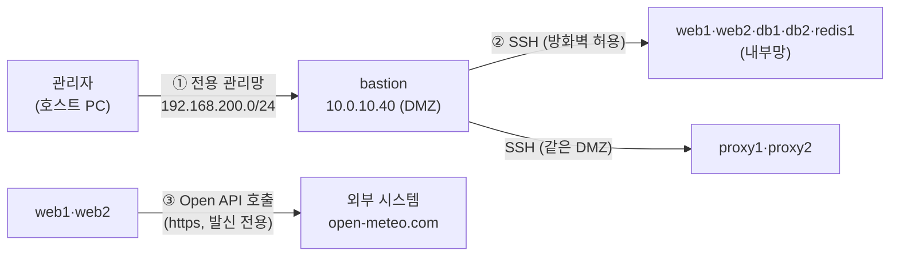

> 이번 글은 **직접 따라 하는 실습**입니다. 관리자의 유일한 출입구 **Bastion Host**를 세워 "콘솔로만 관리하던 불편"을 해결하고, SSH를 요새화(Fail2ban)합니다. 후반부에는 홈페이지를 **외부 Open API와 연계**해 바깥 세상과 안전하게 대화하게 만듭니다.
{: .prompt-info }

**이번에 켤 VM**: 전부 + `bastion`(새로 만듦)

## 0. 이번 단계의 그림



**문제 인식**: 9편에서 망을 분리하자 보안은 좋아졌지만, 관리자인 우리도 내부 서버에 SSH를 못 하게 됐습니다(콘솔만 가능). 그렇다고 방화벽에 "모든 서버로 SSH 허용"을 뚫으면 망 분리가 무색해집니다.

**해답 — Bastion Host(요새 호스트)**: 관리자 전용 **점프 서버** 한 대만 접근을 허용하고, 모든 서버는 **"bastion에서 온 SSH만"** 받게 합니다. 출입구가 하나면 ① 지키기 쉽고 ② 기록이 한곳에 남고 ③ 사고 시 그 문만 닫으면 됩니다. 원본 다이어그램의 **"내부 관리자(전용 관리망)"** 를 구현하는 것입니다.

| 오늘 배우는 것 | 설명 |
|---|---|
| 전용 관리망 | 서비스 트래픽과 분리된, 관리자만의 네트워크 |
| ProxyJump | bastion을 "경유"해 내부 서버로 한 번에 들어가는 SSH 기능 |
| Fail2ban | 비밀번호를 반복해 틀리는 공격 IP를 자동 차단 |
| Open API | 시스템 밖의 서비스와 표준 방식(HTTP+JSON)으로 대화하기 |

---

# 1부. Bastion Host

## 1.1 전용 관리망 만들기

VirtualBox → **도구 → 네트워크 → 호스트 전용 네트워크 → 만들기** (두 번째 호스트 전용 네트워크):

- IPv4 주소: `192.168.200.1` / 넷마스크 `255.255.255.0` / **DHCP 끄기**

이 네트워크가 **관리자(호스트 PC)와 bastion만** 연결되는 전용 통로입니다. 서비스 트래픽(192.168.100.x)과 물리적으로 분리됩니다.

## 1.2 bastion VM 만들기

`base` 복제 → 이름 `bastion` / MAC 재생성 / 완전한 복제 / 메모리 768 MB. **설정 → 네트워크**:

| 어댑터 | 연결 |
|---|---|
| 1 | NAT |
| 2 | **내부 네트워크 `dmz-net`** (bastion은 DMZ 입주자) |
| 3 | **호스트 전용** → 방금 만든 **두 번째** 네트워크(192.168.200.x) |

부팅 후 콘솔에서:

```bash
sudo hostnamectl set-hostname bastion
sudo nano /etc/netplan/50-cloud-init.yaml
```

```yaml
network:
  version: 2
  ethernets:
    enp0s3:
      dhcp4: true
    enp0s8:                       # DMZ 쪽 다리
      dhcp4: false
      addresses: [10.0.10.40/24]
      routes:
        - to: 10.0.20.0/24        # 내부망으로 갈 때는 방화벽 경유
          via: 10.0.10.254
    enp0s9:                       # 전용 관리망 쪽 다리
      dhcp4: false
      addresses: [192.168.200.40/24]
```

```bash
sudo netplan apply
```

hosts 파일도 9편의 새 블록으로 교체합니다(9편 "공통 작업 A"의 명령을 그대로 실행).

**UFW — SSH는 관리망에서 온 것만**:

```bash
sudo ufw delete allow 22/tcp
sudo ufw allow from 192.168.200.0/24 to any port 22 proto tcp
sudo ufw status
```

호스트 PC에서 접속 확인:

```bash
ssh infra@192.168.200.40
```

## 1.3 방화벽에 "bastion → 내부망 SSH" 통로 뚫기

`fw`에 접속(`ssh infra@192.168.100.254`)해서 `/etc/nftables.conf`의 forward 체인, 규칙② 아래에 한 줄을 추가합니다:

```bash
sudo nano /etc/nftables.conf
```

```nft
        # 규칙②-2 관리: bastion → 내부망 SSH만
        iifname $DMZ oifname $INT ip saddr 10.0.10.40 tcp dport 22 accept
```

```bash
sudo systemctl restart nftables
sudo nft list ruleset | grep 10.0.10.40   # 반영 확인
```

**딱 한 줄**입니다. "관리자용이니 다 열자"가 아니라, **출발지 1개(bastion) × 포트 1개(22)** — 최소 통로 원칙 그대로입니다.

## 1.4 모든 서버의 SSH를 "bastion에서 온 것만"으로 제한하기

각 서버의 UFW에는 아직 1편의 "22 전체 허용"이 남아 있습니다. bastion이 생겼으므로 접근 범위를 제한합니다.

**web1, web2, db1, db2, redis1** (콘솔 또는 아래 1.5의 ProxyJump로 접속해서) 각각:

```bash
sudo ufw delete allow 22/tcp
sudo ufw allow from 10.0.10.40 to any port 22 proto tcp
```

**proxy1, proxy2** (bastion과 같은 DMZ라 방화벽을 안 거치고 직접 옴 — 규칙은 동일):

```bash
sudo ufw delete allow 22/tcp
sudo ufw allow from 10.0.10.40 to any port 22 proto tcp
```

> 순서 요령: `delete`를 먼저 하면 그 순간 SSH가 끊길 수 있습니다. **allow를 먼저 추가하고 delete** 하거나, 콘솔에서 작업하세요. (UFW는 이미 연결된 세션은 유지하므로 대부분 괜찮지만, 습관을 안전하게.)
{: .prompt-tip }

## 1.5 ProxyJump — 관리자의 표준 접속 경로

호스트 PC에서 내부 서버로 "bastion 경유 한 방에" 들어갑니다:

```bash
ssh -J infra@192.168.200.40 infra@10.0.20.11    # bastion을 경유해 web1로
```

비밀번호를 두 번(bastion, web1) 넣으면 `infra@web1:~$` — **콘솔 없이 다시 SSH 관리가 가능**해졌습니다.

매번 `-J`가 귀찮으니 호스트 PC에 단축 설정을 만듭니다. **호스트 PC**의 `C:\Users\<사용자>\.ssh\config` 파일(없으면 생성)에:

```
Host bastion
    HostName 192.168.200.40
    User infra

Host web1
    HostName 10.0.20.11
    User infra
    ProxyJump bastion

Host web2
    HostName 10.0.20.12
    User infra
    ProxyJump bastion

Host db1
    HostName 10.0.20.21
    User infra
    ProxyJump bastion

Host db2
    HostName 10.0.20.22
    User infra
    ProxyJump bastion

Host redis1
    HostName 10.0.20.25
    User infra
    ProxyJump bastion

Host proxy1
    HostName 10.0.10.11
    User infra
    ProxyJump bastion

Host proxy2
    HostName 10.0.10.12
    User infra
    ProxyJump bastion
```

이제 어디서든 `ssh web1` 한 마디로 끝입니다.

## 1.6 Bastion 요새화 — Fail2ban

출입구가 하나로 모이면 공격도 그 문에 몰립니다. 비밀번호를 반복해서 틀리는 IP를 자동 차단하는 **Fail2ban**을 bastion에 설치합니다.

```bash
ssh bastion
sudo apt update && sudo apt install -y fail2ban
sudo tee /etc/fail2ban/jail.local > /dev/null <<'EOF'
[sshd]
enabled  = true
maxretry = 5
findtime = 10m
bantime  = 30m
EOF
sudo systemctl enable --now fail2ban
sudo fail2ban-client status sshd
```

"10분 안에 5번 틀리면 30분 차단"입니다. 상태 명령에서 `Currently banned: 0`이 보이면 감시가 시작된 것입니다.

> 더 강하게(권장, 선택): 호스트에서 `ssh-keygen` 후 `type $env:USERPROFILE\.ssh\id_ed25519.pub | ssh bastion "cat >> ~/.ssh/authorized_keys"` 로 **키 기반 로그인**을 걸면 비밀번호 없이 접속되며, 이후 bastion의 `/etc/ssh/sshd_config`에서 `PasswordAuthentication no`로 비밀번호 로그인을 아예 끌 수 있습니다. 실무 표준입니다.
{: .prompt-tip }

---

# 2부. Open API 외부 연계

## 2.1 Open API란

**Open API**는 "누구나 정해진 형식(주로 HTTP + JSON)으로 호출할 수 있게 공개된 기능 창구"입니다. 우리 홈페이지가 날씨를 직접 측정할 수는 없지만, 기상 데이터를 가진 **외부 시스템에 물어봐서** 보여줄 수는 있습니다. 실무의 결제(PG), 지도, 문자 발송, 공공데이터 연계가 전부 이 방식입니다.

실습에는 **open-meteo.com** 을 씁니다 — 가입도 API 키도 필요 없는 무료 공개 기상 API라 교육용으로 적합합니다. 브라우저로 먼저 호출해 봅시다(호스트 PC에서):

```
https://api.open-meteo.com/v1/forecast?latitude=37.57&longitude=126.98&current_weather=true
```

JSON(중괄호 데이터)이 보이면 — 방금 여러분이 **직접 Open API를 호출**한 것입니다. 이걸 웹 서버가 대신 하게 만들면 "연계"가 됩니다.

## 2.2 웹 애플리케이션에 날씨 기능 추가

방금 구성한 접속 경로로 **web1과 web2 양쪽 모두** 작업합니다. (`ssh web1`, `ssh web2`)

```bash
nano ~/app/app.py
```

**① 맨 위 import에 추가**:

```python
import json, urllib.request
```

**② `page()` 함수의 마지막 줄 링크를 수정** (홈 링크 옆에 날씨 추가):

```python
    <hr><a href='/'>홈</a> | <a href='/weather'>오늘의 날씨</a>"""
```

**③ 파일 끝부분(`if __name__` 위)에 새 경로 추가**:

```python
@app.route("/weather")
def weather():
    url = ("https://api.open-meteo.com/v1/forecast"
           "?latitude=37.57&longitude=126.98&current_weather=true")
    try:
        with urllib.request.urlopen(url, timeout=5) as resp:
            cw = json.load(resp)["current_weather"]
        info = f"서울 현재 기온 <b>{cw['temperature']}°C</b>, 풍속 <b>{cw['windspeed']} km/h</b>"
    except Exception as e:
        info = f"외부 API 호출 실패: {e}"
    return page(f"<h2>오늘의 날씨 — 외부 Open API 연계</h2><p>{info}</p>")
```

양쪽 모두:

```bash
sudo systemctl restart webapp
```

## 2.3 동작 확인

브라우저에서 `https://192.168.100.254` → **"오늘의 날씨"** 클릭.

실제 서울의 현재 기온이 나오면 성공입니다. 지금 일어난 일을 정리해 봅시다 — 사용자의 요청이 **방화벽 → DMZ 프록시 → 내부 웹 서버**까지 들어갔다가, 웹 서버가 **NAT를 통해 외부의 기상 시스템에 질의**하고, 응답을 받아 다시 사용자에게 전달했습니다. 우리 인프라가 처음으로 **외부 시스템과 연동**된 것입니다.

> **★ 꼭 알아 두어야 할 보안 상식 — 비밀정보(Secret)는 코드에 넣지 않는다**: 우리 실습 코드에는 DB·Redis 비밀번호가 코드 안에 직접 적혀 있습니다(하드코딩). 학습용으로는 단순함이 우선이지만, **실무에서는 금기**입니다 — 코드가 Git에 올라가는 순간 비밀번호도 함께 유출되기 때문입니다. 실무에서는 **환경 변수**, 설정 파일 분리, 또는 전용 **비밀 관리 도구**(Vault, AWS Secrets Manager 등)를 사용합니다. 유료 Open API를 쓸 때의 **API 키**도 똑같이 다뤄야 합니다.
{: .prompt-tip }

## 2.4 발신(Egress) 통제 이야기 — 한 걸음 더

들어오는 통신은 지금까지 철저히 통제했지만, **나가는 통신**은 어떨까요? 실무에서는 나가는 것도 통제합니다. 서버가 해킹되면 공격자는 **안에서 바깥으로** 데이터를 빼돌리거나 명령 서버에 접속하기 때문입니다.

우리 실습에서 내부 서버의 인터넷은 NAT 어댑터로 나갑니다(apt·API용). 실무라면 이 발신도 방화벽/프록시를 거쳐 **"허용된 목적지만"** 나가게 합니다. 개념 확인용으로, web1에서 발신 정책이 어떻게 생겼는지만 봅니다:

```bash
sudo ufw status verbose | head -3
```

`deny (incoming), allow (outgoing)` — 발신은 전부 허용 상태입니다. 발신 기본 차단(`ufw default deny outgoing`)으로 바꾸면 apt·DNS·API 목적지를 일일이 허용해야 하므로 실습에서는 여기까지만 하고, **"완성된 보안은 들어오는 것과 나가는 것을 모두 통제한다"** 는 원칙만 기억합시다.

---

## 3. 트러블슈팅

| 증상 | 진단 | 해결 |
|---|---|---|
| `ssh infra@192.168.200.40` 실패 | 호스트에서 `ping 192.168.200.40` | bastion 어댑터 3이 **두 번째** 호스트 전용 네트워크인지, netplan의 enp0s9 확인 |
| ProxyJump로 web1 접속 불가 | 먼저 `ssh bastion` → 거기서 `ssh infra@10.0.20.11` | bastion에서 되면: 호스트 `.ssh/config` 오타. 안 되면: fw 규칙(1.3) 누락, web1 UFW(1.4) 확인 |
| bastion에서 내부로 ping은 되는데 SSH 무한 대기 | fw에서 `sudo nft list ruleset` | 1.3의 한 줄이 실제로 들어갔는지, `systemctl restart nftables` 했는지 |
| 1.4 이후 내가 잠김 (SSH 전부 거절) | — | VirtualBox 콘솔로 들어가 `sudo ufw allow from 10.0.10.40 to any port 22 proto tcp` 재확인 |
| /weather가 "호출 실패: timed out" | web1에서 `curl -s "https://api.open-meteo.com/v1/forecast?latitude=37.57&longitude=126.98&current_weather=true" \| head -1` | 실패 시 NAT 어댑터 문제: `ip route`에 enp0s3 기본 경로가 있는지 (9편 트러블슈팅 마지막 항목) |
| /weather가 500 에러 | `journalctl -u webapp -n 30` | 코드 붙여넣기 위치 확인 — `@app.route("/weather")`가 `if __name__` **위**에 있어야 함 |
| Fail2ban이 나를 차단함 | bastion 콘솔에서 `sudo fail2ban-client set sshd unbanip 192.168.200.1` | 비밀번호 5회 이상 틀렸을 때 정상 동작한 것 — 좋은 학습입니다 |

---

## 4. 핵심 용어 정리

| 용어 | 영문 | 정의 |
|---|---|---|
| Bastion Host | — | 내부망 관리 접근을 한 지점으로 모으는 전용 점프 서버 (요새 호스트) |
| 전용 관리망 | Management Network | 서비스 트래픽과 분리된 관리자 전용 네트워크 (Out-of-band 관리) |
| ProxyJump | — | 중간 서버를 경유해 목적지 서버로 접속하는 SSH 표준 기능 (`-J`) |
| Fail2ban | — | 로그를 감시해 인증 실패를 반복하는 IP를 자동 차단하는 도구 |
| 무차별 대입 공격 | Brute-force Attack | 비밀번호를 반복 시도해 알아내려는 공격 — Fail2ban의 차단 대상 |
| Open API | — | 외부에 공개된 표준 호출 창구 (주로 HTTP + JSON) |
| JSON | JavaScript Object Notation | 시스템 간 데이터 교환에 쓰이는 표준 텍스트 형식 |
| 발신 통제 | Egress Control | 서버에서 외부로 나가는 통신을 제한하는 것 — 정보 유출 방지의 핵심 |
| 하드코딩 | Hardcoding | 비밀번호 등 설정값을 소스 코드에 직접 기재하는 것 (실무에서는 금기) |

## 5. 마무리 — 스냅샷

전체 종료 후 스냅샷: `bastion` → **`stage9-bastion`**

이제 원본 다이어그램에서 남은 것은 하나뿐입니다:

| 원본 다이어그램 | 상태 |
|---|---|
| 방화벽 / DMZ / 내부망 | ✅ 9편 |
| **내부 관리자 (전용 관리망)** | ✅ **오늘 완성** (관리망 + bastion + Fail2ban) |
| 외부 시스템 연계 | ✅ **오늘 완성** (Open API) |
| **외부 CDN (Cache Hit)** | → **11편 (마지막)** |

다음 편은 최종회 — **CDN과 캐시**의 원리를 프록시 캐싱으로 직접 구현하고, 지금까지 만든 전체 인프라로 **종합 장애 훈련**을 치릅니다.
