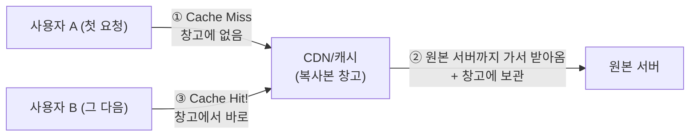

> 최종회입니다. 원본 다이어그램의 마지막 조각 **CDN(Cache Hit)** 의 원리를 프록시 캐싱으로 직접 구현하고, 지금까지 쌓아 올린 인프라 전체를 상대로 **종합 장애 훈련**을 치른 뒤, 처음의 다이어그램과 최종 대조합니다.
{: .prompt-info }

**이번에 켤 VM**: 전부

---

# 1부. CDN과 캐시

## 1.1 CDN이란 — "매번 본사까지 갈 필요 없잖아?"

원본 다이어그램 왼쪽 위의 **외부 CDN(Cache Hit)** 을 기억하나요? **CDN(Content Delivery Network)** 은 전 세계 곳곳에 놓인 "복사본 창고"입니다. 부산 사용자가 서울 서버의 이미지를 요청하면, 두 번째 사용자부터는 부산 근처 창고의 **복사본(캐시)** 을 받습니다.



| 용어 | 뜻 |
|---|---|
| **Cache Miss** | 창고에 없어서 원본까지 다녀옴 (느림, 원본에 부담) |
| **Cache Hit** | 창고에 있어서 바로 응답 (빠름, 원본 부담 0) |
| TTL | 복사본의 유통기한 — 지나면 다시 원본에 확인 |

실제 CDN(Cloudflare, AWS CloudFront 등)은 전 세계 규모의 서비스지만, **동작 원리는 "중간에서 복사본을 보관했다 대신 응답"** 하나입니다. 우리는 그 원리를 프록시(Nginx)의 캐시 기능으로 그대로 구현합니다.

## 1.2 캐시 대상의 선별 — 모든 것을 캐시할 수는 없다

먼저 판단할 것: **무엇을 캐시해도 되는가?**

| 콘텐츠 | 캐시 가능 여부 | 이유 |
|---|---|---|
| 홈(`/`) — 방문자 수, 로그인 상태 | ❌ | 사용자마다·순간마다 다름 (캐시할 경우 타인의 화면이 노출되는 심각한 결함 발생) |
| 날씨(`/weather`) | ⭕ (짧게) | 모두에게 같고, 몇 분쯤 옛날이어도 무방 |
| 이미지·CSS 같은 정적 파일 | ⭕ (길게) | 거의 안 바뀜 — CDN의 주력 대상 |

우리는 `/weather`를 60초 캐시하겠습니다. 덤으로 **외부 API 호출 횟수도 확 줄어듭니다** — 사용자가 1초에 100명 와도 원본(와 open-meteo)에는 1분에 1번만 다녀오면 되니까요. 실무에서 "API 요금 절감"과 직결되는 패턴입니다.

## 1.3 프록시에 캐시 구현

**proxy1, proxy2 양쪽 모두** (`ssh proxy1`, `ssh proxy2`) 설정합니다.

```bash
sudo nano /etc/nginx/sites-available/webapp
```

**① 파일 맨 위**(upstream 위)에 캐시 창고 선언 추가:

```nginx
# 캐시 창고: 메모리 색인 10MB, 최대 100MB, 10분간 미사용 시 정리
proxy_cache_path /var/cache/nginx/webcache levels=1:2 keys_zone=webcache:10m
                 max_size=100m inactive=10m;
```

**② 443 server 블록 안, 기존 `location /` 위에** 날씨 전용 location 추가:

```nginx
    location /weather {
        proxy_pass http://web_pool;
        proxy_set_header Host $host;

        proxy_cache webcache;              # 캐시 창고 사용
        proxy_cache_valid 200 60s;         # 정상 응답을 60초 보관 (TTL)
        proxy_cache_use_stale error timeout http_502;   # 원본 장애 시 만료된 캐시라도 응답
        add_header X-Cache-Status $upstream_cache_status;   # HIT/MISS를 헤더로 공개
    }
```

```bash
sudo nginx -t && sudo systemctl reload nginx
```

## 1.4 Cache Hit을 눈으로 확인

호스트 PowerShell에서 연속 두 번 호출하며 **X-Cache-Status 헤더**를 봅니다:

```bash
curl -sk -o /dev/null -D - https://192.168.100.254/weather | findstr X-Cache
```

```bash
curl -sk -o /dev/null -D - https://192.168.100.254/weather | findstr X-Cache
```

- 첫 번째: `X-Cache-Status: MISS` — 창고에 없어서 웹 서버(→외부 API)까지 다녀옴
- 두 번째: `X-Cache-Status: HIT` — **창고에서 바로!** 원본 다이어그램의 "Cache Hit" 화살표가 지금 여러분 눈앞에서 일어났습니다

60초 기다렸다 다시 호출하면 다시 MISS(유통기한 만료) — TTL의 동작도 확인됩니다.

> 심화 실험: HIT 상태에서 **web1·web2를 둘 다 정지시켜도** `/weather`는 응답합니다(`proxy_cache_use_stale`). 원본 서버가 모두 중단되어도 캐시가 서비스를 지탱하는 것 — 실제 CDN이 "원본 장애의 완충제" 역할을 하는 원리입니다. (확인 후 다시 켜 주세요.)
{: .prompt-tip }

> **★ 꼭 알아 두어야 할 개념 — 캐시의 대가, 신선도(Freshness)**: 캐시는 성능을 주는 대신 **"약간 오래된 데이터"** 를 감수하는 기술입니다. TTL을 길게 하면 빠르지만 낡은 데이터가, 짧게 하면 신선하지만 원본 부하가 커집니다 — 이 **성능·신선도 트레이드오프**를 콘텐츠 성격에 맞게 정하는 것이 캐시 설계의 핵심입니다. 특히 "이미 배포된 캐시를 강제로 지우는 일(캐시 무효화, Cache Invalidation)"은 소프트웨어 공학에서 손꼽히는 난제로 통합니다. **"캐시해도 되는가 → 얼마나 오래 두는가 → 잘못되면 어떻게 지우는가"** 세 질문을 항상 함께 던지세요.
{: .prompt-tip }

---

# 2부. 종합 장애 훈련 — 우리가 만든 인프라는 얼마나 튼튼한가

브라우저에 `https://192.168.100.254` 를 띄워 두고, 계층별로 하나씩 중단시키며 검증합니다. **각 훈련 전에 "서비스가 유지될까?"를 먼저 예측**해 보세요.

| 훈련 | 명령 | 예측 → 결과 | 유지되는 이유 |
|---|---|---|---|
| ① 웹 서버 1대 장애 | `ssh web1 "sudo poweroff"` | 무중단 | LB가 web2로만 분배 (5편) |
| ② 프록시 1대 장애 | `ssh proxy1 "sudo poweroff"` | 수 초 단절 후 복구 | VIP가 proxy2로 승계 (7편) |
| ③ 웹 앱 재시작 | `ssh web2 "sudo systemctl restart webapp"` | 로그인 유지 | 세션이 Redis에 (6편) |
| ④ Primary DB 장애 | `ssh db1 "sudo poweroff"` | 중단 — **수동 승격 필요** | 8편 5장 절차로 db2 승격 훈련 |
| ⑤ Redis 장애 | `ssh redis1 "sudo systemctl stop redis-server"` | 홈은 유지되고 로그인만 해제됨 | 영구 데이터(DB)와 세션(Redis)의 분리 (6편) |
| ⑥ 공격자 관점 침투 | 호스트에서 `ssh -o ConnectTimeout=3 infra@10.0.20.21` | 접근 불가 | 방화벽 — 외부→내부 절대 금지 (9편) |

훈련이 끝나면 전부 원상 복구합니다(끈 VM 켜기, ④는 8편의 원상 복구 절차, ⑤는 `start`).

> ④에서 배우는 실무 감각: 우리 인프라에서 **자동으로 버티는 층**(웹, 프록시)과 **사람의 결단이 필요한 층**(DB 승격)이 다릅니다. DB 자동 승격은 "데이터가 갈라질 위험" 때문에 실무에서도 신중하게 설계하는 영역입니다. 어디까지 자동화할지 정하는 것이 인프라 엔지니어의 일입니다.
{: .prompt-warning }

---

# 3부. 최종 대조 — 처음의 다이어그램과 우리가 만든 것

00편에서 봤던 목표 아키텍처를 다시 꺼내 하나씩 대조합니다.

| 원본 다이어그램 | 우리 구현 | 완성 편 |
|---|---|---|
| 사용자(클라이언트) | 호스트 PC 브라우저 | — |
| 인터넷 / ISP 라우터 | 호스트 전용 네트워크 (192.168.100.0/24) | 01 |
| 방화벽 | `fw` VM (nftables, 구역 간 최소 허용) | 09 |
| 로드밸런서 (트래픽 분산) | Nginx upstream + Keepalived VIP | 05·07 |
| DMZ 구간 — Reverse Proxy 1·2 (SSL 종료, Nginx) | `dmz-net`의 proxy1·proxy2 | 04·07·09 |
| Internal Network — 앱 서버 (Port 8080) | `int-net`의 web1·web2 (Flask) | 02·05 |
| Primary DB (Port 3306) | db1 (MariaDB) | 03 |
| Standby DB + Replication | db2 (바이너리 로그 복제) | 08 |
| (다이어그램에 없지만 실무 표준) 세션 저장소 | redis1 | 06 |
| 내부 관리자 (전용 관리망) | 관리망 + bastion + Fail2ban | 10 |
| 외부 CDN (Cache Hit) | 프록시 캐시 (MISS/HIT/TTL) | 11 |
| (추가 구현) 외부 시스템 연계 | Open API (open-meteo) | 10 |

그리고 눈에 안 보이는 가장 중요한 층 — **모든 VM의 개별 방화벽(UFW)이 "필요한 포트만, 필요한 상대에게만"** 열려 있습니다. 경계 방화벽이 뚫려도 각 서버가 한 번 더 버팁니다(심층 방어).

## 이 과정에서 배운 설계 원칙 7가지

1. **단일 장애점(SPOF)을 찾아 없애라** — 웹·프록시·DB 순서로 전부 이중화했습니다.
2. **기본 차단, 최소 허용** — UFW부터 nftables까지, 모든 문은 "닫힌 게 기본"이었습니다.
3. **뚫린다고 가정하고 구역을 나눠라** — DMZ의 존재 이유입니다.
4. **상태를 서버 안에 두지 마라** — 세션을 Redis로 빼자 웹 서버는 마음껏 늘릴 수 있게 됐습니다.
5. **역할마다 알맞은 저장소** — 영구 데이터는 RDBMS, 휘발성 데이터는 인메모리 저장소.
6. **이름으로 불러라** — hosts 기반 통신 덕분에 전면 재구성(9편)에서 코드를 한 줄도 고치지 않았습니다.
7. **바깥에서 안으로, 한 구간씩 진단하라** — 양파 진단법은 어떤 인프라에서도 통합니다.

## 핵심 용어 정리

| 용어 | 영문 | 정의 |
|---|---|---|
| CDN | Content Delivery Network | 세계 각지의 캐시 서버로 콘텐츠를 사용자 가까이에서 전달하는 네트워크 |
| 캐시 적중 / 부적중 | Cache Hit / Miss | 캐시에 있어 바로 응답 / 없어서 원본까지 다녀옴 |
| 원본 서버 | Origin Server | 캐시가 참조하는 원래의 콘텐츠 제공 서버 |
| TTL | Time To Live | 캐시 사본의 유효기간 |
| 캐시 무효화 | Cache Invalidation | 배포된 캐시를 강제로 폐기하는 것 — 캐시 설계의 대표 난제 |
| 신선도 | Freshness | 캐시된 데이터가 원본과 얼마나 일치하는가의 정도 |
| 장애 훈련 | Failure Drill (Chaos Engineering) | 의도적으로 장애를 일으켜 복원력을 검증하는 실무 기법 |

## 다음 여정을 위한 안내

| 관심사 | 다음 키워드 |
|---|---|
| 이 구성을 코드로 자동화 | Ansible, Terraform (IaC) |
| 배포 자동화 | CI/CD — 본 블로그의 "안전한 자동화 인프라" 시리즈 |
| 감시·알림 | Prometheus + Grafana (모니터링) |
| 컨테이너로 같은 구조 | Docker, Kubernetes |
| 진짜 인증서 | Let's Encrypt (무료 공인 인증서) |
| 웹 해킹과 방어 | 본 블로그의 "웹 보안" 시리즈 |

---

## 마무리

12편 전, 여러분은 VM 한 대에 Flask를 얹는 것부터 시작했습니다. 지금 여러분의 노트북 안에는 **방화벽·DMZ·이중화 프록시·로드밸런싱·세션 클러스터·DB 복제·전용 관리망·외부 연계·캐시**를 갖춘, 실제 기업 서비스와 같은 구조의 인프라가 돌아가고 있습니다.

무엇보다 값진 것은 장비 목록이 아니라, **"왜 이 구성요소가 존재하는가"를 문제부터 겪어 보며 이해했다는 것**입니다. 이제 여러분은 아키텍처 다이어그램을 보면 각 상자가 **어떤 사고를 막으려고 거기 있는지** 읽을 수 있습니다. 그것이 인프라 엔지니어의 눈입니다.

수고 많았습니다. 전 VM 종료 후 마지막 스냅샷 — **`final`** — 을 찍는 것으로 과정을 마칩니다.
