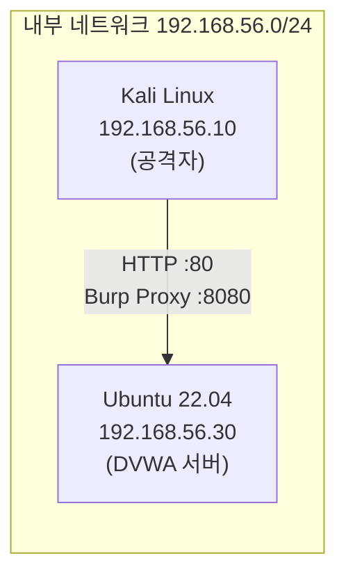
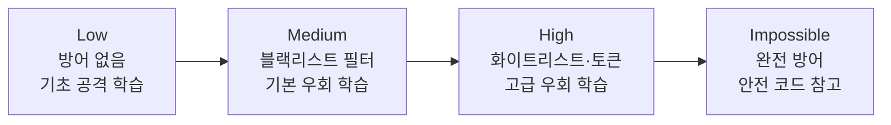

# DVWA 실습 환경 구축

## 들어가며 — 왜 웹 애플리케이션 보안인가

이 글은 **[Web Security Lab]** 시리즈의 첫 번째 글입니다. 도구를 설치하기 전에, 먼저 **"우리는 왜 웹 보안을 배우는가"** 를 짚고 시작합니다. 이유를 알아야 실습의 모든 단계가 의미를 갖기 때문입니다.

### 웹은 모든 서비스의 "정문"이다

오늘날 거의 모든 서비스는 웹으로 들어옵니다. 인터넷 뱅킹, 온라인 쇼핑, 관공서 민원, 병원 예약, 회사 업무 시스템까지 — 사용자가 처음 만나는 **정문은 대부분 웹 애플리케이션**입니다.

문제는 이 정문이 **누구에게나, 24시간, 인터넷 어디서든 열려 있다**는 점입니다. 사내 시스템은 방화벽 안쪽에 숨길 수 있지만, 웹 서비스는 본질적으로 **공개**되어야 제 역할을 합니다. 공격자 입장에서 이보다 접근하기 쉬운 표적은 없습니다. 그래서 침해 사고의 상당수가 웹을 출발점으로 삼습니다.

### 한 줄의 취약점이 부른 현실 (주요 사례)

웹 취약점은 추상적인 위험이 아니라, 실제로 수많은 기업과 사용자에게 막대한 피해를 입혀 왔습니다.

| 사례 (연도) | 공격 경로 | 피해 | 관련 실습 |
|---|---|---|---|
| **옥션** (2008)[^c00_auction] | 서버 침투 | 약 **1,081만 명** 개인정보 유출 — 당시 국내 최대급 | — |
| **네이트·싸이월드** (2011)[^c00_nate] | 침해사고 | 약 **3,500만 명** — 국내 인터넷 인구 대부분의 정보 | — |
| **KT 홈페이지** (2014)[^c00_kt] | **파라미터 조작** | 약 **1,200만 명** 고객정보 — 조회 페이지의 고객 식별번호를 자동으로 바꿔가며 수집 | [07 IDOR](/posts/websec-07-idor/) |
| **여기어때** (2017)[^c00_yeogi] | **SQL 인젝션** | 예약·회원 정보 약 **343만 건**(예약 약 324만 + 회원 약 18만) 유출 + 이용자에게 협박성 문자 발송 | [01 SQL Injection](/posts/websec-01-sql-injection/) |
| **Equifax** (2017, 미국)[^c00_equifax] | 웹 프레임워크 취약점(Apache Struts) | 약 **1억 4,700만 명** 신용정보 | OWASP A03 공급망 |
| **Capital One** (2019, 미국)[^c00_capone] | **SSRF** → 클라우드 자격증명 탈취 | 약 **1억 600만 명** | [04 SSRF](/posts/websec-04-ssrf/) |

> 이 사고들의 공통점은 **"고난도 제로데이가 아니라, 기초적인 웹 취약점 하나"** 였다는 점입니다.  
> KT는 URL 파라미터의 숫자를 바꾼 것뿐이었고, 여기어때는 입력창에 SQL 한 줄을 넣은 것뿐이었습니다.  
> 즉 **이 시리즈에서 직접 실습할 바로 그 기법들**이 현실의 대형 사고를 일으켰습니다.
{: .prompt-warning }

피해는 유출 건수로 끝나지 않습니다. **개인정보보호법상 과징금·과태료, 집단 손해배상, 서비스 중단, 그리고 회복하기 어려운 신뢰의 상실**로 이어집니다. 보안 사고 한 번이 기업의 존립을 흔들기도 합니다.

### 왜 웹이 가장 많이 노리는 표적인가

| 이유 | 설명 |
|---|---|
| **항상 노출** | 방화벽 안쪽 시스템과 달리, 웹은 인터넷에 상시 공개되어야 동작 |
| **낮은 진입 장벽** | 브라우저만 있으면 누구나 접근·시도 가능, 자동화 공격 도구도 풍부 |
| **넓은 공격 표면** | 프런트엔드·백엔드·DB·서드파티·클라우드가 얽혀 빈틈이 많음 |
| **빠른 개발 압박** | 기능이 우선되고 보안 검증이 후순위로 밀리면서 취약점 발생 |
| **대량 피해** | DB에 수백만 명의 정보가 모여 있어, 단일 취약점이 곧 대량 유출 |
| **돈과 데이터의 길목** | 결제·인증·개인정보가 웹에 집중되어 공격의 대가가 큼 |

### 우리가 "공격"을 배우는 이유 — 명분과 당위성

이 시리즈는 공격 기법을 직접 실습합니다. 그 이유와 정당성은 분명합니다.

1. **공격을 알아야 방어한다.** 방어자는 공격자의 사고방식과 기법을 이해할 때 비로소 효과적으로 막을 수 있습니다. 어떤 입력이 왜 위험한지 손으로 겪어 본 개발자만이 안전한 코드를 짭니다.
2. **사후 대응보다 사전 설계가 싸다.** 취약점은 출시 후 고치면 수십 배의 비용이 듭니다. 개발 단계부터 보안을 내재화하는 **Secure by Design / Shift-Left** 의 출발점이 바로 "취약점이 어떻게 악용되는지 아는 것"입니다.
3. **보안은 선택이 아니라 의무다.** 개인정보를 다루는 모든 서비스는 법적·사회적으로 이용자의 데이터를 보호할 책임이 있습니다. 개발자·보안담당자에게 웹 보안은 교양이 아니라 **직무 역량**입니다.

> **⚠ 합법성과 윤리 — 반드시 지켜야 할 선**  
> 이 시리즈의 모든 공격 실습은 **본인이 소유하거나 명시적으로 허가받은 격리된 환경(DVWA 랩)** 에서만 수행합니다.  
> 타인의 시스템을 허가 없이 공격·접근하는 것은 **정보통신망법 위반(형사처벌 대상)** 입니다.  
> "공격을 배우는 목적은 오직 더 잘 방어하기 위함"이라는 원칙을 절대 잊지 마세요.
{: .prompt-danger }

그래서 우리는 **인터넷과 분리된 가상 실습 환경**을 먼저 구축합니다. 아래부터가 그 과정입니다.

---

웹 모의해킹 실습을 시작하기 전에, 공격 실습에 특화된 취약한 웹 애플리케이션 **DVWA(Damn Vulnerable Web Application)**를 설치합니다.  
DVWA는 SQL Injection, XSS, CSRF, 파일 업로드 취약점 등 OWASP Top 10에 포함된 주요 웹 취약점을 직접 실습할 수 있도록 설계된 오픈소스 프로젝트입니다.

이 포스트에서는 다음을 다룹니다.

1. 실습 환경 개요 및 네트워크 구성
2. Ubuntu 22.04에 DVWA 설치 및 설정
3. Kali Linux에서 Burp Suite 프록시 설정
4. DVWA Security Level 이해
5. 주요 실습 도구 목록

---

## 1. 실습 환경 개요 및 가상머신 구축

### 1.1 환경 구성

| 역할         | OS               | IP 주소        | 주요 도구                               |
| ---------- | ---------------- | ------------ | ----------------------------------- |
| 공격자 머신     | Kali Linux       | 192.168.56.10 | Burp Suite, SQLmap, Nikto, gobuster |
| 피해자(대상) 서버 | Ubuntu 22.04 LTS | 192.168.56.30 | Apache2, PHP, MariaDB, DVWA         |

두 머신은 동일한 내부 네트워크(192.168.56.0/24)에 연결되어 있으며, Kali Linux에서 Ubuntu 서버의 DVWA로 직접 접근합니다.

> **다른 과정과의 실습망 배정**
> 이 과정은 **[리눅스 기초] 0강**과 **[애플리케이션 보안]** 이 쓰는 `192.168.56.0/24`를 **그대로 공유합니다.** 세 과정 모두 "Kali(`.10`) → Ubuntu 서버(`.30`)" 구조가 같으므로, **가상 머신을 새로 만들 필요 없이 한 벌로 모두 수강**할 수 있습니다.
>
> 다른 과정은 대역이 서로 겹치지 않도록 다음과 같이 나누어 두었습니다. 여러 과정의 VM을 같은 PC에 두어도 주소가 부딪히지 않습니다.
>
> | 대역 | 과정 |
> |---|---|
> | **`192.168.56.0/24`** | **리눅스 기초 · 애플리케이션 보안 · 웹 보안(이 과정)** |
> | `192.168.57~59.0/24` | AI 웹보안(랩 / SIEM LAN / SIEM DMZ) |
> | `192.168.60.0/24` | 네트워크 보안 |
> | `192.168.61.0/24` | 보안시스템 |
> | `192.168.62.0/24` | DevSecOps |
>
> 모두 VirtualBox가 호스트 전용 네트워크에 허용하는 범위(`192.168.56.0/21`) 안에 있습니다.
{: .prompt-info }

> 실습은 반드시 본인이 소유하거나 허가받은 환경에서만 진행해야 합니다.  
> 타인의 시스템을 허가 없이 공격하는 것은 정보통신망법 위반에 해당합니다.
{: .prompt-warning }

### 1.2 네트워크 구성도



---

### 1.3 VirtualBox 설치와 두 대의 가상머신 준비

이 실습은 **공격자(Kali)** 와 **피해 서버(Ubuntu)** 두 대의 가상머신이 필요합니다. 둘 다 무료입니다.  
처음이라면 아래 순서대로 그대로 따라 하면 됩니다.

**(1) VirtualBox 설치 (호스트 PC)**

1. [VirtualBox 공식 사이트](https://www.virtualbox.org/) → **[Download]** → 자신의 OS(예: Windows hosts) 설치 파일을 받아 모두 기본값(Next)으로 설치합니다.

**(2) Kali Linux — 미리 만들어진 가상머신 이미지로 가장 쉽게 (권장)**

직접 OS를 설치할 필요 없이, 칼리가 배포하는 VirtualBox용 이미지를 가져오기만 하면 모든 도구가 준비된 상태로 시작합니다.

1. [Kali Get 페이지](https://www.kali.org/get-kali/) → **[Virtual Machines]** → **VirtualBox 64-bit** 항목의 `.7z` 파일을 받습니다.
2. [7-Zip](https://www.7-zip.org/)으로 압축을 풀면 `.vbox` 파일이 나옵니다.
3. VirtualBox에서 상단 **[추가(Add)]** → 그 `.vbox` 파일 선택 → 목록에 Kali가 등록됩니다.
4. Kali를 시작하고 기본 계정으로 로그인합니다: **`kali` / `kali`**

**(3) Ubuntu Server 22.04 — DVWA를 올릴 피해 서버**

1. [Ubuntu Server 다운로드](https://ubuntu.com/download/server)에서 **22.04 LTS** ISO를 받습니다.
2. VirtualBox **[새로 만들기]** → 이름 `DVWA-Ubuntu`, 메모리 `2048` MB, 디스크 `25` GB로 생성합니다.
3. **[설정] → [저장소]** 에서 비어 있는 광학 드라이브에 위 ISO를 넣고 시작하여 설치합니다.  
   설치 중 사용자명은 `dvwa`(원하는 이름 가능), **OpenSSH server 설치에 체크**합니다.

> 호스트가 RAM 8GB라면 Kali 2~4GB + Ubuntu 2GB로 충분합니다. 실습 중에는 두 VM을 함께 켜 둡니다.
{: .prompt-tip }

---

### 1.4 두 가상머신을 같은 내부망으로 연결하고 고정 IP 주기

목표: Kali(`192.168.56.10`)와 Ubuntu(`192.168.56.30`)가 **같은 사설망**에서 서로 통신하면서, 동시에 **인터넷(패키지 설치)** 도 되게 하는 것입니다. 그래서 각 VM에 네트워크 카드를 **2개** 둡니다.

**(1) 두 VM 모두 어댑터 2개 설정 — VM 전원을 끈 상태에서**

각 VM의 **[설정] → [네트워크]** 에서:

- **어댑터 1**: `NAT` (인터넷용 — apt·도구 업데이트)
- **어댑터 2**: `내부 네트워크(Internal Network)` → 이름 **`labnet`** *(Kali·Ubuntu 둘 다 똑같이 `labnet`!)*

> 두 VM의 내부 네트워크 **이름이 글자까지 정확히 같아야** 서로 통신됩니다.
{: .prompt-warning }

**(2) Kali에 고정 IP `192.168.56.10` 부여** 

```bash
IFACE2=$(ls /sys/class/net | grep -v lo | sed -n '2p')   # 두 번째(내부망) 카드 자동 탐지
sudo nmcli con add type ethernet ifname "$IFACE2" con-name labnet ip4 192.168.56.10/24
sudo nmcli con up labnet
ip addr | grep 192.168.56.10        # 이 줄이 출력되면 성공
```

**(3) Ubuntu에 고정 IP `192.168.56.30` 부여**

```bash
IF_NAT=$(ls /sys/class/net | grep -v lo | sed -n '1p')   # 첫 번째 = NAT(인터넷)
IF_LAB=$(ls /sys/class/net | grep -v lo | sed -n '2p')   # 두 번째 = 내부망(labnet)
sudo rm -f /etc/netplan/00-installer-config.yaml /etc/netplan/50-cloud-init.yaml
sudo tee /etc/netplan/99-lab.yaml > /dev/null <<EOF
network:
  version: 2
  ethernets:
    $IF_NAT:
      dhcp4: true
    $IF_LAB:
      dhcp4: false
      addresses: [192.168.56.30/24]
EOF
sudo chmod 600 /etc/netplan/99-lab.yaml
sudo netplan apply
ip addr | grep 192.168.56.30        # 이 줄이 출력되면 성공
```

---

### 1.5 통신 확인 (다음 단계 전 필수 체크)

```bash
# Kali에서 실행
ping -c 3 192.168.56.30     # Ubuntu까지 응답 → 내부망 연결 성공
ping -c 3 8.8.8.8          # 인터넷 응답 → NAT 정상

# Ubuntu에서 실행
ping -c 3 192.168.56.10     # Kali까지 응답 → 내부망 연결 성공
ping -c 3 8.8.8.8          # 인터넷 응답 → apt 설치 가능
```

- [ ] Kali ↔ Ubuntu 양방향 `ping` 성공
- [ ] 두 VM 모두 인터넷(`8.8.8.8`) `ping` 성공

위 4가지가 모두 성공하면, 아래 **2장**에서 Ubuntu에 DVWA를 설치합니다.  
(만약 내부망 ping이 안 되면 → 두 VM의 어댑터 2 내부 네트워크 이름이 모두 `labnet`인지, 고정 IP가 `.10`/`.30`으로 들어갔는지 다시 확인합니다.)

---

## 2. Ubuntu에 DVWA 설치

### 2.1 패키지 업데이트 및 Apache2 / PHP 설치

Ubuntu 서버(192.168.56.30)에 SSH로 접속하거나 직접 터미널을 열어 다음을 실행합니다.

```bash
sudo apt update && sudo apt upgrade -y
sudo apt install -y apache2 php php-mysqli php-gd libapache2-mod-php mariadb-server git
```

> **왜 MySQL이 아닌 MariaDB인가?**  
> MariaDB는 MySQL의 오픈소스 포크로, Oracle의 상용화 이후 커뮤니티 주도로 개발되고 있습니다.  
> Ubuntu 22.04의 기본 `mysql-server` 패키지도 내부적으로 MariaDB를 포함하는 경우가 많습니다.  
> MariaDB는 완전한 오픈소스이며, 보안 패치가 더 빠르고 기능적으로도 MySQL과 거의 완전히 호환됩니다.  
> 실습 환경에서는 `mariadb-server` 패키지를 명시적으로 지정하는 것이 안전합니다.
{: .prompt-tip }

설치 후 Apache2와 MariaDB 서비스를 활성화합니다.

```bash
sudo systemctl enable --now apache2
sudo systemctl enable --now mariadb
```

### 2.2 MariaDB 보안 초기화

```bash
sudo mariadb-secure-installation
```

> Ubuntu 22.04 이상에서는 `mysql_secure_installation` 대신 `mariadb-secure-installation`을 사용합니다.  
> 두 명령 모두 동작하지만, MariaDB 전용 명령을 쓰는 것이 더 명확합니다.
{: .prompt-tip }

프롬프트가 나타나면 다음과 같이 응답합니다.

- `Enter current password for root`: 엔터 (초기 비밀번호 없음)
- `Switch to unix_socket authentication`: `n`
- `Change the root password?`: `y` → 원하는 비밀번호 입력
- 나머지: 모두 `y`

### 2.3 DVWA 데이터베이스 및 사용자 생성

MariaDB 콘솔에 접속합니다.  
`mariadb` 명령은 MariaDB 전용 클라이언트로, `mysql` 명령과 동일하게 동작합니다.

```bash
sudo mariadb -u root -p
```

다음 SQL을 실행합니다.

```sql
CREATE DATABASE dvwa CHARACTER SET utf8mb4 COLLATE utf8mb4_unicode_ci;
CREATE USER 'dvwa'@'localhost' IDENTIFIED BY 'p@ssw0rd';
GRANT ALL PRIVILEGES ON dvwa.* TO 'dvwa'@'localhost';
FLUSH PRIVILEGES;
EXIT;
```

> DB 비밀번호(`p@ssw0rd`)는 실습 전용 환경이므로 단순하게 설정해도 무방하지만,  
> 인터넷에 노출된 서버에서는 절대 이런 비밀번호를 사용하지 않도록 합니다.
{: .prompt-warning }

### 2.4 DVWA 소스코드 다운로드

```bash
cd /var/www/html
sudo git clone https://github.com/digininja/DVWA.git
sudo chown -R www-data:www-data /var/www/html/DVWA
```

### 2.5 config.inc.php 설정

샘플 설정 파일을 복사하고 편집합니다.

```bash
sudo cp /var/www/html/DVWA/config/config.inc.php.dist /var/www/html/DVWA/config/config.inc.php
sudo nano /var/www/html/DVWA/config/config.inc.php
```

아래 항목을 앞서 생성한 DB 정보와 일치하도록 수정합니다.

```php
$_DVWA[ 'db_server' ]   = '127.0.0.1';
$_DVWA[ 'db_database' ] = 'dvwa';
$_DVWA[ 'db_user' ]     = 'dvwa';
$_DVWA[ 'db_password' ] = 'p@ssw0rd';
$_DVWA[ 'db_port']      = '3306';
```

reCAPTCHA 키는 실습 환경에서는 임의 문자열을 넣어도 됩니다.

```php
$_DVWA[ 'recaptcha_public_key' ]  = 'test';
$_DVWA[ 'recaptcha_private_key' ] = 'test';
```

### 2.6 PHP 설정 조정

DVWA 실습에 필요한 PHP 옵션을 활성화합니다.

```bash
sudo nano /etc/php/$(php -r 'echo PHP_MAJOR_VERSION.".".PHP_MINOR_VERSION;')/apache2/php.ini
```

다음 항목을 찾아 수정합니다.

```ini
allow_url_include = On
```

> `allow_url_include = On`은 보안상 매우 위험한 설정입니다.  
> 반드시 인터넷과 격리된 실습 전용 서버에서만 적용합니다.
{: .prompt-warning }

### 2.7 접근 경로 확인 (기본 설정 그대로 사용)

별도의 가상 호스트 설정은 필요 없습니다. Ubuntu Apache의 기본 DocumentRoot(`/var/www/html`)를 그대로 사용하므로, `/var/www/html/DVWA`에 클론한 DVWA는 **`http://192.168.56.30/DVWA/`** 경로로 접근됩니다.

> **★ 전 실습 공통 경로 규칙 ★**  
> - DVWA 모듈: **`http://192.168.56.30/DVWA/...`** (예: `/DVWA/login.php`, `/DVWA/vulnerabilities/sqli/`)  
> - SSRF·IDOR 실습에서 직접 만드는 보조 페이지(`fetch.php`, `profile.php` 등)는 `/var/www/html/`에 두고 **`http://192.168.56.30/파일명.php`** 로 접근합니다.  
>
> 기본 `000-default` 가상호스트를 비활성화하거나 별도 vhost로 DocumentRoot를 `/DVWA`로 바꾸면, 위 보조 페이지 경로와 `/DVWA/` 접두어가 어긋나므로 **기본 설정을 그대로 둡니다.**
{: .prompt-tip }

PHP 설정을 바꿨으므로 Apache를 재시작합니다.

```bash
sudo systemctl restart apache2
```

### 2.8 DVWA Setup 페이지에서 DB 초기화

1. Kali Linux 브라우저에서 `http://192.168.56.30/DVWA/setup.php` 에 접속합니다.
2. 페이지 하단의 **[Create / Reset Database]** 버튼을 클릭합니다.
3. 정상적으로 완료되면 로그인 페이지(`http://192.168.56.30/DVWA/login.php`)로 이동됩니다.

> Setup 페이지에서 빨간색으로 표시된 항목이 있다면 PHP 설정이나 파일 권한 문제입니다.  
> `allow_url_include`, `config.inc.php` 권한, MariaDB 연결 정보를 다시 확인합니다.
{: .prompt-tip }

**기본 로그인 계정**

| 항목 | 값 |
|---|---|
| Username | `admin` |
| Password | `password` |


---

## 3. Kali Linux에서 Burp Suite 프록시 설정

Burp Suite는 웹 애플리케이션 모의해킹에서 HTTP 트래픽을 가로채고 분석하는 핵심 도구입니다.  
DVWA 실습에서는 Burp Suite를 브라우저와 서버 사이에 프록시로 끼워 요청/응답을 실시간으로 확인합니다.


### 3.1 Burp Suite 실행

Kali Linux에서 터미널을 열고 실행하거나, 애플리케이션 메뉴에서 찾습니다.

```bash
burpsuite &
```

Community Edition을 사용하는 경우 "Temporary project" → "Use Burp defaults" 로 시작합니다.

### 3.2 Burp Suite Proxy 리스너 확인

1. **Proxy** 탭 → **Options(또는 Proxy settings)** 클릭
   
2. **Proxy Listeners** 항목에서 `127.0.0.1:8080` 이 Running 상태인지 확인
3. 없으면 **[Add]** 버튼으로 추가합니다.

### 3.3 브라우저 프록시 설정

**Firefox 기준**

1. 우측 상단 메뉴(≡) → **Settings** → **General** → 하단의 **Network Settings** → **[Settings...]**
2. **Manual proxy configuration** 선택
3. HTTP Proxy: `127.0.0.1`, Port: `8080`
   
4. **[OK]** 저장

또는 FoxyProxy 확장 프로그램을 사용해 프록시를 ON/OFF로 빠르게 전환할 수 있습니다.

```bash
# FoxyProxy Standard 설치 (Firefox 확장 마켓에서도 가능)
# Kali Linux에는 Firefox ESR이 기본 내장되어 있다.
```

### 3.4 Burp CA 인증서 설치 (HTTPS 트래픽 분석 시)

HTTPS 트래픽을 가로채려면 Burp CA 인증서를 브라우저에 등록해야 합니다.  
DVWA는 HTTP이므로 이 단계는 생략 가능하지만, 이후 실습을 위해 미리 설정해 두는 것을 권장합니다.


1. 브라우저에서 `http://burpsuite` 또는 `http://127.0.0.1:8080` 에 접속
2. **CA Certificate** 링크를 클릭해 `cacert.der` 다운로드
3. Firefox: **Settings** → **Privacy & Security** → **Certificates** → **[View Certificates]** → **Authorities** 탭 → **[Import]**
4. 다운로드한 `cacert.der` 선택 후 "Trust this CA to identify websites" 체크

### 3.5 DVWA 접속 및 Burp 트래픽 확인

1. 브라우저에서 `http://192.168.56.30/DVWA/login.php` 에 접속
2. Burp Suite **Proxy** 탭 → **Intercept** 탭에서 요청이 가로채졌는지 확인
3. **[Forward]** 를 눌러 요청을 전달하거나, **[Intercept is off]** 로 설정해 자동 통과시킵니다.

> Intercept가 켜진 상태에서 **[Forward]** 를 클릭하지 않으면 브라우저가 응답을 받지 못해 멈춘 것처럼 보입니다.  
> 실습 중 브라우저가 로딩 중이면 Burp Suite Intercept 탭을 먼저 확인합니다.
{: .prompt-tip }

4. 기본 계정(`admin` / `password`)으로 로그인 후 DVWA 메인 화면이 나타나면 환경 구축 완료입니다.


---

## 4. DVWA Security Level

DVWA는 동일한 취약점을 난이도별로 구현해 두고 있습니다.  
Security Level을 조정하면 서버 측 방어 코드의 강도가 달라져, 다양한 방어 우회 기법을 단계적으로 학습할 수 있습니다.

**Security Level 설정 위치**: 로그인 후 좌측 메뉴 → **DVWA Security**

### 4.1 각 레벨 설명

| 레벨 | 방어 수준 | 특징 | 학습 목적 |
|---|---|---|---|
| **Low** | 없음 | 입력값을 전혀 검증하지 않음 | 기초 공격 기법 이해 |
| **Medium** | 일부 | 간단한 필터링(블랙리스트 방식)이 적용됨 | 기본 필터 우회 기법 학습 |
| **High** | 강함 | 화이트리스트, CSRF 토큰 등 적용 | 고급 우회 기법 또는 로직 취약점 탐색 |
| **Impossible** | 완전 | 취약점이 없도록 안전하게 구현 | 안전한 코드 패턴 참고용 |



> 처음 실습할 때는 반드시 **Low** 레벨에서 시작합니다.  
> 공격이 성공한 후에는 소스 코드 탭(**View Source**)을 열어 왜 취약한지 직접 확인하는 것이 핵심 학습법입니다.
{: .prompt-tip }

### 4.2 실습 추천 순서

1. **Low** 레벨에서 공격 성공
2. **View Source** 로 취약한 코드 확인
3. **Medium** 레벨로 올려 필터 우회 시도
4. **High** 레벨에서 추가 우회 기법 적용
5. **Impossible** 레벨 소스와 Low 레벨 소스 비교 분석

---

## 5. 실습 도구 목록

Kali Linux에는 웹 모의해킹에 필요한 도구 대부분이 기본 설치되어 있습니다.

### 5.1 주요 도구 요약

| 도구 | 용도 | 기본 포함 여부 |
|---|---|---|
| **Burp Suite** | HTTP 프록시, 인터셉트, 스캐너 | 기본 포함 (Community) |
| **SQLmap** | SQL Injection 자동화 탐지 및 익스플로잇 | 기본 포함 |
| **Nikto** | 웹 서버 취약점 스캐너 | 기본 포함 |
| **gobuster** | 디렉토리·파일 브루트포스 | 기본 포함 |
| **dirb** | 웹 콘텐츠 스캐너 | 기본 포함 |
| **curl** | HTTP 요청 CLI 도구 | 기본 포함 |
| **Hydra** | 로그인 브루트포스 | 기본 포함 |
| **wfuzz** | 웹 파라미터 퍼징 | 기본 포함 |

### 5.2 도구 설치 확인 및 업데이트

```bash
# Kali Linux 패키지 업데이트
sudo apt update && sudo apt upgrade -y

# 누락된 도구 설치 (필요 시)
sudo apt install -y sqlmap nikto gobuster dirb hydra wfuzz
```

### 5.3 SQLmap 기본 사용법 예시

```bash
# DVWA SQL Injection 페이지에 대한 기본 스캔
# (Burp Suite에서 가로챈 요청을 파일로 저장한 후 사용)
sqlmap -u "http://192.168.56.30/DVWA/vulnerabilities/sqli/?id=1&Submit=Submit" \
       --cookie="PHPSESSID=<세션값>; security=low" \
       --dbs
```

### 5.4 Nikto 기본 사용법 예시

```bash
# DVWA 서버 기본 취약점 스캔
nikto -h http://192.168.56.30
```

### 5.5 gobuster 기본 사용법 예시

```bash
# 디렉토리 브루트포스
gobuster dir -u http://192.168.56.30 \
             -w /usr/share/wordlists/dirb/common.txt \
             -t 50
```

> SQLmap을 포함한 자동화 도구는 짧은 시간에 수많은 요청을 보냅니다.  
> 실습 환경이 아닌 실제 서비스에 절대 사용하지 않습니다.
{: .prompt-warning }

---

## 6. 환경 점검 체크리스트

실습을 시작하기 전에 다음 항목을 확인합니다.

- [ ] Ubuntu 서버(192.168.56.30)에서 Apache2 서비스가 실행 중인가
- [ ] `http://192.168.56.30/DVWA/login.php` 에 Kali Linux 브라우저에서 접근 가능한가
- [ ] `admin` / `password` 로 DVWA 로그인이 되는가
- [ ] Burp Suite가 `127.0.0.1:8080` 에서 리스닝 중인가
- [ ] 브라우저 프록시가 Burp Suite를 가리키고 있는가
- [ ] Burp Suite **Proxy** → **Intercept** 탭에서 요청이 가로채지는가
- [ ] DVWA Security Level이 **Low** 로 설정되어 있는가

모든 항목이 확인되면 SQL Injection, XSS 등 개별 실습 포스트로 이동해 실습을 시작할 수 있습니다.

---

## 7. OWASP Top 10 완전 정복

### 7.1 OWASP와 Top 10이란

**OWASP(Open Worldwide Application Security Project)** 는 웹 애플리케이션 보안을 연구·공유하는 **비영리 오픈 커뮤니티**입니다. 특정 벤더에 종속되지 않고, 누구나 무료로 쓸 수 있는 보안 표준·도구·문서를 만듭니다. ZAP(취약점 스캐너), ASVS(보안 검증 표준), Cheat Sheet Series, 그리고 가장 유명한 **Top 10** 이 대표 산출물입니다.

**OWASP Top 10** 은 "가장 흔하고 위험한 웹 취약점 10가지"를 추린 **인식 제고용 문서(awareness document)** 입니다. 전 세계 기업·기관에서 수집한 **실제 취약점 데이터**와, 미래 위협을 반영하기 위한 **전문가 설문**을 결합해 순위를 매깁니다. 즉 단순한 위험도 순위가 아니라 **"발생 빈도 + 영향도"** 를 함께 본 **카테고리(범주)** 라는 점이 핵심입니다.

> **★ 중요**: Top 10의 각 항목은 단일 취약점이 아니라 **여러 취약점을 묶은 범주**입니다. 예를 들어 "A05 Injection" 안에 SQLi·XSS·명령 삽입·File Inclusion이 모두 들어갑니다. 그래서 개별 취약점을 만났을 때 **"어느 범주에 속하는가"** 를 함께 기억하면 분류·대응이 빨라집니다.
{: .prompt-tip }

**판올림의 역사**: 첫 발표는 **2003년**이며 이후 2004 → 2007 → 2010 → 2013 → 2017 → 2021 → **2025**로 약 3~4년마다 개정되었습니다. 새 위협(클라우드, 공급망, 설계 결함)이 부상할 때마다 항목이 신설·통합·이동합니다.

### 7.2 OWASP Top 10:2025 전체 항목

| 순위 | 항목 | 한 줄 설명 | 이 시리즈 연계 |
|---|---|---|---|
| **A01** | Broken Access Control | 인가(권한) 검증 실패 — 남의 자원에 접근/수정 | **IDOR(07)·CSRF(03)·SSRF(04)** |
| **A02** | Security Misconfiguration | 기본 설정·과도한 노출·불필요 기능 등 설정 오류 | **파일 업로드(10)** 실행 설정 |
| **A03** | Software Supply Chain Failures | 취약·구식 컴포넌트, 의존성·빌드 파이프라인 위협(2021 "취약한 컴포넌트"에서 확대) | — |
| **A04** | Cryptographic Failures | 암호화 미흡·약한 알고리즘으로 민감정보 노출 | **세션(06)** 전송 보호 |
| **A05** | Injection | 입력이 명령으로 해석됨 | **SQLi(01)·XSS(02)·명령삽입(08)·File Inclusion(09)** |
| **A06** | Insecure Design | 설계 단계의 보안 결함(검증·위협모델 부재) | **파일 업로드(10)** 검증 설계 |
| **A07** | Authentication Failures | 인증·자격증명·세션 관리 미흡 | **인증(05)·세션(06)** |
| **A08** | Software or Data Integrity Failures | 무결성 검증 없는 업데이트·역직렬화 | — |
| **A09** | Security Logging and Alerting Failures | 로깅·탐지·경보 미흡으로 침해 인지 실패 | **로그 분석(11)** |
| **A10** | Mishandling of Exceptional Conditions | 예외·오류 처리 미흡(정보 노출·오작동) | — |

> **2025판 주요 변화 요약**  
> ① **SSRF**가 단독 항목(2021 A10)에서 **A01 Broken Access Control로 흡수**  
> ② **Injection**이 A03→**A05**로 하락(공통 방어가 보편화된 영향)  
> ③ **Security Misconfiguration**이 A05→**A02**로 상승  
> ④ **Software Supply Chain Failures(A03)** 신설 — 2021 "취약·구식 컴포넌트"를 공급망 전체로 확대  
> ⑤ **Mishandling of Exceptional Conditions(A10)** 신설  
> ⑥ "Security Logging and Monitoring Failures" → **A09 Logging & Alerting Failures** 로 정리
{: .prompt-info }

### 7.3 이 시리즈와 OWASP Top 10 매핑

이 실습 시리즈의 각 포스트는 **OWASP Top 10:2025**(2025년 말 공개, 현행 최신판) 카테고리와 직접 연결됩니다.  
실습 전, 자신이 다루는 취약점이 OWASP의 어느 항목·CWE에 해당하는지 먼저 인지하고 시작합니다.  
번호가 바뀐 항목은 과거 자료와의 대조를 위해 `(구 …:2021)`을 함께 표기합니다.

| 포스트 | 취약점 | OWASP Top 10:2025 | CWE |
|---|---|---|---|
| **01. SQL Injection** | SQL 주입 | **A05 – Injection** (구 A03:2021) | CWE-89 |
| **02. XSS** | 크로스 사이트 스크립팅 | **A05 – Injection** (구 A03:2021) | CWE-79 |
| **03. CSRF** | 사이트 간 요청 위조 | **A01 – Broken Access Control** | CWE-352 |
| **04. SSRF** | 서버 측 요청 위조 | **A01 – Broken Access Control** (SSRF 흡수, 구 A10:2021) | CWE-918 |
| **05. Authentication** | 무차별 대입·취약 인증 | **A07 – Authentication Failures** | CWE-307 |
| **06. Session Security** | 세션 관리 취약점 | **A07 – Authentication Failures** | CWE-384 / CWE-330 |
| **07. IDOR** | 접근 통제 실패 | **A01 – Broken Access Control** | CWE-639 |
| **08. Command Injection** | OS 명령 삽입 | **A05 – Injection** (구 A03:2021) | CWE-78 |
| **09. File Inclusion** | LFI / RFI · 경로 조작 | **A05 – Injection** (경로 조작은 A01) | CWE-98 / CWE-22 |
| **10. File Upload** | 무제한 파일 업로드 → RCE | **A02 – Security Misconfiguration / A06 – Insecure Design** | CWE-434 |
| **12. 코드 인젝션 심화 ①** | SSI·XPath·XXE | **A05 – Injection** | CWE-97/643/611 |
| **13. 서버 설정·정보 노출** | 디렉터리 인덱싱·에러페이지·정보누출·평문전송·관리자노출 | **A02 – Security Misconfiguration / A04** | CWE-548/209/200/319/552 |
| **14. 파일 다운로드·HTTP Method** | 경로 조작 다운로드·PUT/DELETE/TRACE | **A01 – Broken Access Control / A02** | CWE-22/650/693 |
| **15. 비즈니스 로직** | 프로세스 검증 누락·취약한 비밀번호 복구 | **A01 / A04 / A07** | CWE-841/639/640 |
| **16. 코드 인젝션 심화 ②** | LDAP 인젝션 (slapd 환경 구축) | **A05 – Injection** | CWE-90 |
| **17. 코드 인젝션 심화 ③** | SSTI (Flask 환경 구축) | **A05 – Injection** | CWE-1336 |

> **11번**(정보보안기사 이론)에 이어 **12~17번**은 KISA *주요정보통신기반시설 기술적 취약점 분석·평가 방법 상세가이드* 의 「Web Application(웹)」 점검 항목 중 01~10에서 다루지 않은 취약점을 보강한 실습입니다. 코드 인젝션 심화는 12(SSI·XPath·XXE)·16(LDAP)·17(SSTI)로 나뉘며, LDAP·SSTI는 별도 서버/앱 환경 구축부터 단계별로 다룹니다. **05(인증)·06(세션)** 에도 약한 비밀번호 정책·자동화 공격·쿠키 변조 절이 추가되었습니다.
{: .prompt-info }

> **2025판 주요 변화**: ① **SSRF**가 단독 항목(2021 A10)에서 **A01 Broken Access Control로 흡수**, ② **Injection**이 A03→**A05**로 하락, ③ **Security Misconfiguration**이 A05→**A02**로 상승, ④ 신설 항목 **A03 Software Supply Chain Failures**·**A10 Mishandling of Exceptional Conditions** 추가입니다.
{: .prompt-info }

> **학습 포인트**: OWASP Top 10은 "발생 빈도 + 영향도"로 묶은 **취약점 카테고리**입니다.  
> 개별 취약점(예: SQLi)이 어느 카테고리(A05 Injection)에 속하는지 함께 기억하면,  
> 실무에서 새로운 취약점을 만났을 때도 "어떤 부류의 문제인지" 빠르게 분류할 수 있습니다.
{: .prompt-tip }

각 포스트는 **DVWA Security Level(Low → Medium → High → Impossible)** 순서로  
"레벨별 공격 기법"과 "그 레벨에서 막는 방어 기법"을 함께 다룹니다.

또한 각 공격 포스트(01~10)에는 **공격의 역사·유래·주요 침해 사건**과, 그 공격이 **왜 통하는지 근본 원리**를 설명하는 절이 포함되어 있습니다.

> **정보보안기사(필기) 대비**라면 **11번 포스트 "정보보안기사 웹 보안 이론 총정리"** 를 함께 보세요.  
> SSL/TLS 프로토콜 공격(Heartbleed·POODLE·DROWN 등), 웹 서버 하드닝, 로그 분석, 보안 솔루션(WAF/IDS/IPS) 등 **실습에서 다루지 않는 시험 출제 이론**을 ★ 표시로 정리했습니다. 각 실습 포스트 끝의 "정보보안기사 시험 포인트" 절과 짝을 이룹니다.
{: .prompt-tip }

---

## 출처 및 참고 자료

서론의 침해 사고 수치·공격 경로는 아래 출처에 근거합니다(각주 번호를 클릭하면 이동).

- OWASP Top 10:2025 — <https://owasp.org/Top10/2025/>
- DVWA (Damn Vulnerable Web Application) — <https://github.com/digininja/DVWA>

[^c00_auction]: 옥션 2008 개인정보 유출 — 경찰 수사 기준 약 1,081만 명(옥션은 2010년 대상자를 약 1,863만 명으로 정정 공지). 보안뉴스. <https://m.boannews.com/html/detail.html?idx=9476>
[^c00_nate]: SK커뮤니케이션즈(네이트·싸이월드) 2011, 약 3,500만 명 유출. 경향신문. <https://www.khan.co.kr/article/201107282201315>
[^c00_kt]: KT 홈페이지 2014, 약 1,200만 명 유출 — 파로스 프록시로 이용대금 조회란의 고객고유번호를 자동 조작(2012년 877만 명 사고와 별개). 뉴시스. <https://www.newsis.com/view/NISX20140325_0012810139>
[^c00_yeogi]: 여기어때 2017, SQL 인젝션으로 예약정보 약 324만 건·회원정보 약 18만 건 등 약 343만 건 유출. 바이라인네트워크. <https://byline.network/2017/04/1-691/>
[^c00_equifax]: 2017 Equifax data breach — 약 1억 4,700만 명, Apache Struts(CVE-2017-5638). Wikipedia. <https://en.wikipedia.org/wiki/2017_Equifax_data_breach>
[^c00_capone]: 2019 Capital One data breach — 약 1억 600만 명, SSRF→AWS 메타데이터. Huntress. <https://www.huntress.com/threat-library/data-breach/capital-one-data-breach>
