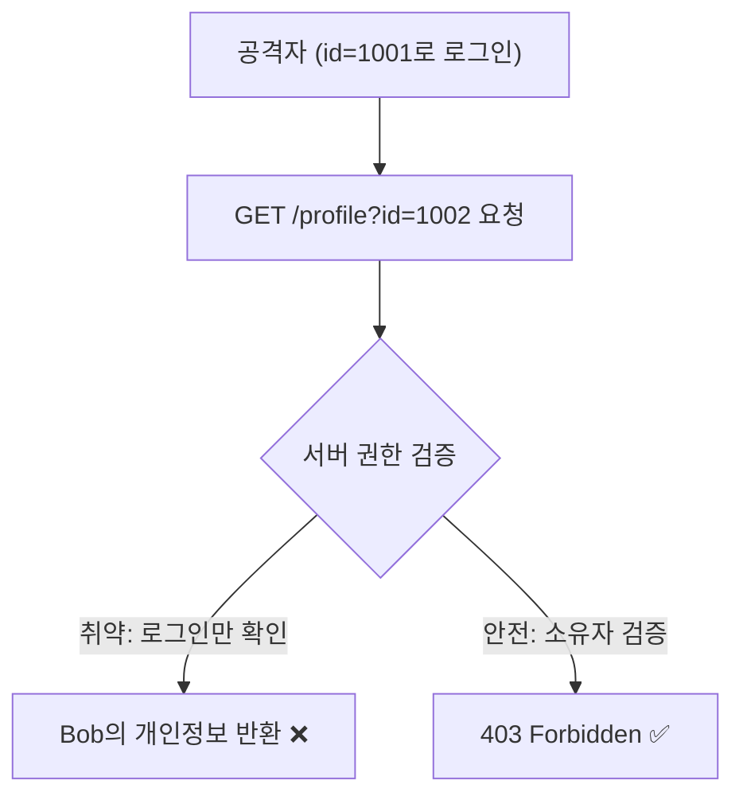
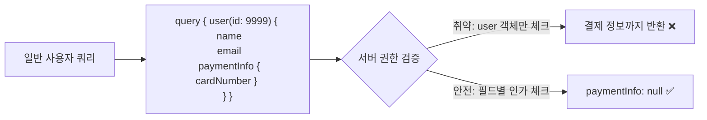
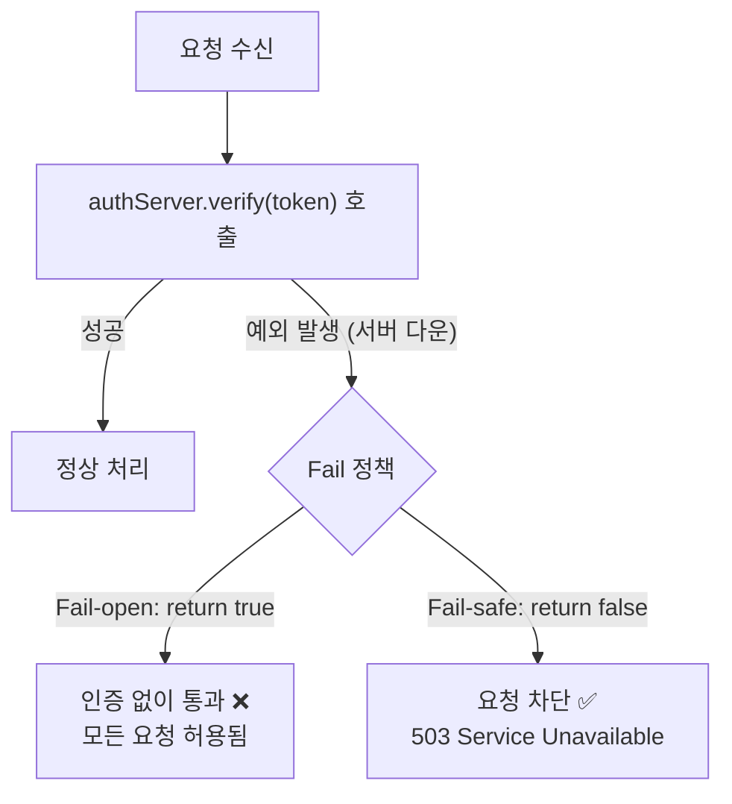
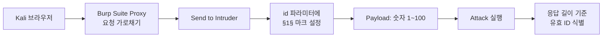
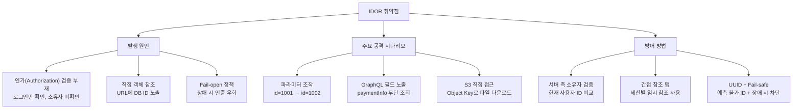

## 실습 환경

| 구분 | 내용 |
|---|---|
| 공격자 | Kali Linux (192.168.56.10) |
| 대상 | Ubuntu + DVWA (192.168.56.30/DVWA/) |
| 도구 | Burp Suite, curl, python3 |

---

## OWASP Top 10 매핑

| 항목 | 내용 |
|---|---|
| OWASP 카테고리 | **A01:2025 – Broken Access Control** |
| CWE | CWE-639 (사용자 제어 키를 통한 인가 우회) · CWE-284 (부적절한 접근 통제) |
| 영향 | 타 사용자 개인정보·주문·파일 열람/수정/삭제, 권한 상승 |
| 한 줄 핵심 | 서버가 **"로그인 여부"만 확인**하고 **"이 객체가 이 사용자 것인지(소유권)"** 를 검증하지 않아 발생 |

> A01 Broken Access Control은 **OWASP Top 10 2021에서 1위**로 올라섰고 **2025판에서도 A01(1위)** 를 유지하는 가장 흔한 취약점 군입니다.  
> IDOR는 그 대표 사례이며, CSRF(03)도 같은 A01에 속합니다.  
> 인증(Authentication)과 **인가(Authorization)** 는 다릅니다 — IDOR은 **인가 검증의 부재**입니다.
{: .prompt-info }

---

## 공격의 역사와 주요 사건

### 유래와 발견

"Insecure Direct Object Reference(불안전한 직접 객체 참조)"라는 이름은 **OWASP Top 10 2007판에서 A4 항목**으로 처음 등장했습니다. 2010·2013판에서도 단독 항목으로 유지되다가, **2017판부터 "Broken Access Control(접근 통제 실패)"이라는 더 큰 범주로 흡수**되었고 2021·2025판에서 이 범주가 **1위(A01)** 를 차지하고 있습니다.

이름은 거창하지만 본질은 **"URL의 숫자 하나를 바꿔 보는 것"** 만큼 단순합니다. 그래서 자동화 스캐너로는 잘 안 잡히고(서버는 200 OK를 정상 반환하므로), **사람이 직접 식별자를 바꿔 보는 모의해킹·버그바운티에서 가장 많이 발견**되는 유형이기도 합니다.

### 주요 침해 사건

| 연도 | 사건 | 내용 |
|---|---|---|
| 2018 | **USPS Informed Visibility**[^c07_usps] | API가 인가 검증 없이 식별자만으로 데이터를 반환 → 약 **6천만 명**의 정보 노출 |
| 2019 | **First American Financial**[^c07_firstam] | URL의 **문서 ID가 순차 번호**여서, 번호만 바꾸면 인증 없이 타인의 부동산 거래 문서 열람 → **약 8억 8,500만 건** 노출. IDOR의 교과서적 대형 사고 |
| 2021 | **Parler 데이터 스크랩**[^c07_parler] | 게시물 ID가 순차여서, 번호를 1씩 올려 가며 **거의 모든 게시물·삭제글·영상**을 대량 수집당함 |

> First American 사건의 핵심은 "해킹 도구가 필요 없었다"는 점입니다. **로그인조차 필요 없이, 브라우저 주소창의 숫자만 바꾸면** 8억 건이 열렸습니다. 단순함이 곧 위험성입니다.
{: .prompt-warning }

### 왜 이 공격이 통하는가 — 근본 원리

대부분의 서버는 요청을 받으면 **"로그인했는가?"(인증)** 는 확인하지만, **"이 사용자가 *이 데이터*에 접근할 권한이 있는가?"(인가)** 는 빠뜨립니다. 그래서 로그인만 했다면, `id=1001`을 `id=1002`로 바꾼 요청도 "정상 로그인 사용자의 요청"으로 처리해 **남의 데이터를 그대로 반환**합니다.

여기에는 흔한 오해가 깔려 있습니다 — **"식별자를 추측 못 하게 하면 안전하다"** 는 생각입니다. 그래서 순차 번호 대신 UUID를 쓰지만, 이는 **추측을 어렵게 할 뿐 접근을 막지는 못합니다**(식별자는 로그·Referer·다른 API 응답으로 새어 나갑니다). 이것이 "모호함에 기댄 보안(security by obscurity)"의 한계입니다.

```
요청: GET /profile?id=1002   (공격자는 id=1001로 로그인)
서버: "로그인됨? → 예" 만 확인하고 1002의 데이터 반환  ❌
정답: "id=1002가 현재 세션 사용자의 것인가?" 까지 확인  ✅
```

따라서 유일한 근본 방어는 **모든 객체 접근마다 서버에서 "세션 사용자 == 객체 소유자(또는 권한 보유)"를 검증**하는 것입니다. UUID·간접 참조 맵은 보조 수단일 뿐입니다.

---

## 1. 이론: IDOR란 무엇인가

### 1.1 IDOR 개념

**IDOR(Insecure Direct Object Reference, 불안전한 직접 객체 참조)**는  
URL이나 파라미터에 포함된 식별자(숫자, 파일명 등)를 단순히 바꾸는 것만으로  
다른 사용자의 데이터에 접근할 수 있는 취약점입니다.

```
GET /user/profile?id=1001   → 내 정보
GET /user/profile?id=1002   → 남의 정보 노출!
```

서버가 **"로그인 여부"** 만 확인하고 **"이 데이터가 이 사용자의 것인지"** 를 검증하지 않아 발생합니다.  
이는 곧 **Broken Access Control(OWASP A01:2025)** 의 가장 대표적인 사례입니다.



> **핵심 원인**: 인증(Authentication)은 있지만 인가(Authorization) 검증이 없습니다.  
> 로그인된 사용자라면 누구든 임의 ID로 데이터를 조회할 수 있는 상태입니다.
{: .prompt-danger }

---

### 1.2 IDOR vs CSRF vs 인증 실패 비교

| 구분 | IDOR | CSRF | 인증 실패 |
|---|---|---|---|
| **분류** | A01 Broken Access Control | A01 Broken Access Control | A07 Authentication Failures |
| **공격자 상태** | 로그인된 공격자 | 피해자 브라우저 이용 | 미인증 상태 |
| **피해 원리** | 권한 밖의 리소스에 직접 접근 | 피해자 권한으로 요청 위조 | 인증 자체를 우회 |
| **예시** | `id=1002`로 남의 정보 조회 | 피해자 모르게 송금 요청 | 비밀번호 없이 로그인 |
| **방어 핵심** | 서버 측 소유자 검증 | CSRF 토큰, SameSite 쿠키 | MFA, 강력한 인증 |

---

### 1.3 실제 IDOR 사례 3가지

#### 사례 1 — GraphQL 필드 레벨 접근 제어 미비

일부 서버는 **"user 객체 전체에 대한 접근"** 만 체크하고,  
`paymentInfo`, `cardNumber` 같은 **개별 필드별 권한 검증** 을 누락합니다.



**방어**: GraphQL Directive나 Resolver 레벨에서 **Field-level Authorization** 을 적용합니다.  
각 필드에 `@auth(requires: OWNER)` 같은 권한 검사를 별도로 추가해야 합니다.

#### 사례 2 — S3 Bucket / Blob Storage 권한 설정 오류

```
https://mybucket.s3.amazonaws.com/user-documents/1002/contract.pdf
```

Bucket이 Public으로 설정되어 있거나, Object Key(경로)만 알면  
**인증 없이 다른 사용자 파일을 다운로드** 할 수 있습니다.

| 취약 설정 | 안전 설정 |
|---|---|
| Bucket: Public Read | Bucket: Private |
| 영구 URL 직접 노출 | Pre-signed URL (만료 시간 포함) |
| 추측 가능한 파일명 | 난수 포함 파일명 |

**방어**: Private Bucket + Pre-signed URL 방식을 사용합니다.  
Pre-signed URL은 지정된 시간(예: 5분) 후 자동 만료되어 재사용이 불가능합니다.

#### 사례 3 — Fail-open 인증 (인증 서버 장애 시 fallback 누락)

인증 서버(Auth Server)가 다운됐을 때, 예외를 잡아서 **"통과"** 로 처리하는 코드입니다.  
대부분의 조직이 **보안보다 서비스 연속성(가용성)** 을 우선시할 때 발생합니다.



> **Fail-open vs Fail-safe**: 보안 시스템은 항상 **Fail-safe(장애 시 차단)** 원칙을 따라야 합니다.  
> "가용성이 우선"이라는 생각이 인증 우회 취약점을 만듭니다.
{: .prompt-danger }

---

## 2. 실습 1 — 수동 IDOR 취약 페이지 구성

DVWA에는 전용 IDOR 모듈이 없으므로, Ubuntu 웹 서버에 직접 취약 페이지를 만듭니다.

### 2.1 취약한 PHP 페이지 생성

```bash
# Ubuntu(192.168.56.30)에서 실행
sudo tee /var/www/html/profile.php << 'EOF'
<?php
$id = $_GET['id'];
$users = [
  1 => ['name' => 'Alice', 'email' => 'alice@example.com', 'card' => '4111-1111-1111-1111'],
  2 => ['name' => 'Bob',   'email' => 'bob@example.com',   'card' => '4222-2222-2222-2222'],
  3 => ['name' => 'Admin', 'email' => 'admin@example.com', 'card' => '4333-3333-3333-3333'],
];
if (isset($users[$id])) {
    echo json_encode($users[$id]);
} else {
    echo '{"error":"not found"}';
}
?>
EOF
```

### 2.2 Kali에서 IDOR 공격 시도

```bash
# id=1: Alice 정보 조회
curl "http://192.168.56.30/profile.php?id=1"
# 출력: {"name":"Alice","email":"alice@example.com","card":"4111-1111-1111-1111"}

# id=3: Admin 정보 노출 (권한 없음에도 접근)
curl "http://192.168.56.30/profile.php?id=3"
# 출력: {"name":"Admin","email":"admin@example.com","card":"4333-3333-3333-3333"}
```

> `id` 파라미터를 1에서 3으로 바꾸는 것만으로 Admin의 카드 정보가 노출됩니다.  
> 서버는 어떠한 권한 검증도 수행하지 않습니다.
{: .prompt-danger }

---

## 3. 실습 2 — Burp Suite Intruder로 ID 범위 스캔

### 3.1 공격 흐름



### 3.2 진행 절차

**1단계: Burp Suite Proxy 설정**

Kali 브라우저의 프록시를 `127.0.0.1:8080`으로 설정하고  
`http://192.168.56.30/profile.php?id=1` 에 접속합니다.

**2단계: 요청을 Intruder로 전송**

Burp Suite > Proxy > HTTP History에서 해당 요청 우클릭 > **"Send to Intruder"**

**3단계: Sniper 모드 설정**

Intruder > Positions 탭:
- Attack type: **Sniper**
- `id=§1§` 처럼 `id` 파라미터 값에만 페이로드 마커 설정 (나머지 마커 모두 제거)

**4단계: Payload 설정**

Intruder > Payloads 탭:
- Payload type: **Numbers**
- From: `1`, To: `100`, Step: `1`

**5단계: Attack 실행 및 분석**

"Start Attack" 클릭 후 결과 창에서:

| 유효 ID | 응답 길이 | 내용 |
|---|---|---|
| 1, 2, 3 | 약 70~80 bytes | 사용자 정보 반환 |
| 4~100 | 약 20 bytes | `{"error":"not found"}` |

응답 길이 차이로 유효한 사용자 ID를 자동으로 식별할 수 있습니다.

> **Intruder 활용 팁**: "Length" 컬럼 기준으로 정렬하면 유효 응답을 한눈에 구분할 수 있습니다.
{: .prompt-tip }

---

## 4. 실습 3 — DVWA Authorization Bypass

DVWA의 다른 취약점 모듈을 통해 IDOR 개념을 확인할 수 있습니다.

### 4.0 방어 성숙도 단계별 공격·방어 (IDOR의 "레벨")

IDOR는 DVWA 전용 모듈이 없어 Low/Medium/High 레벨이 없습니다. 대신 **서버의 인가 검증 성숙도**로 단계를 나눕니다.

| 단계 | 서버 측 검증 | 공격(우회) 방안 | 방어 한계 |
|---|---|---|---|
| **취약 (≈Low)** | 로그인 여부만 확인 | `id=1002` 처럼 식별자만 바꿔 타 사용자 객체 접근 | 소유권 검증 자체가 없음 |
| **추측 어렵게 (≈Medium)** | 순차 ID 대신 **랜덤/UUID** 사용 (검증은 여전히 없음) | Burp Intruder로 범위 대입, 다른 응답·로그·Referer에서 식별자 수집 | **추측만 어렵게** 했을 뿐 접근은 가능 (보안 by obscurity) |
| **부분 검증 (≈High)** | 일부 엔드포인트만 소유자 확인 (누락 지점 존재) | 검증이 빠진 API/다운로드/GraphQL 필드를 찾아 우회 | 일관성 없는 검증 → 사각지대 |
| **완전 방어 (≈Impossible)** | **모든 요청에서 세션 사용자 == 객체 소유자** 서버측 검증 + 간접 참조 맵 | 우회 불가 | — (근본 방어) |

> 핵심: **UUID로 바꾸는 것은 방어가 아닙니다**(추측만 어렵게 함).  
> 유일한 근본 방어는 **모든 접근마다 서버에서 "소유자/권한"을 검증**하는 것입니다(6장).
{: .prompt-tip }

### 4.1 DVWA 직접 URL 접근 시도

**Security Level: Low** 설정 후:

```
# 다른 사용자 비밀번호 변경 시도 (CSRF + IDOR 복합)
http://192.168.56.30/DVWA/vulnerabilities/csrf/?password_new=hacked&password_conf=hacked&Change=Change
```

**Burp Suite로 파라미터 조작**:

1. Proxy에서 요청 가로채기
2. `user` 또는 `id` 파라미터 변조
3. 다른 사용자 계정에 대한 변경 시도

### 4.2 파일 다운로드 IDOR 시나리오

```bash
# Ubuntu에서 파일 다운로드 취약 페이지 생성
sudo tee /var/www/html/download.php << 'EOF'
<?php
$file_id = $_GET['file_id'];
$files = [
  '101' => '/var/www/html/uploads/user1_report.txt',
  '102' => '/var/www/html/uploads/user2_report.txt',
  '103' => '/var/www/html/uploads/admin_secret.txt',
];
if (isset($files[$file_id]) && file_exists($files[$file_id])) {
    readfile($files[$file_id]);
} else {
    echo 'File not found';
}
?>
EOF
```

```bash
# 공격: file_id만 바꿔서 다른 사용자 파일 다운로드
curl "http://192.168.56.30/download.php?file_id=103"
# Admin의 비밀 파일 내용 노출
```

---

## 5. Fail-open vs Fail-safe 코드 비교

### 5.1 취약한 Fail-open 코드

```php
<?php
// ❌ 취약한 Fail-open 코드
function verifyToken($token) {
    try {
        return $authServer->verify($token);
    } catch (Exception $e) {
        // 인증 서버 오류 시 그냥 통과!
        // 서버 장애 = 인증 우회 가능
        return true;
    }
}

// 이 코드의 위험: 인증 서버가 5초 타임아웃이면
// 공격자는 의도적으로 서버 과부하를 유발해 인증 우회 가능
?>
```

### 5.2 안전한 Fail-safe 코드

```php
<?php
// ✅ 안전한 Fail-safe 코드
function verifyToken($token) {
    try {
        return $authServer->verify($token);
    } catch (Exception $e) {
        // 인증 서버 오류 시 무조건 차단
        error_log("Auth server error: " . $e->getMessage());
        return false;
    }
}

// 추가 방어: 타임아웃 명시 설정
function verifyTokenSafe($token) {
    try {
        $result = $authServer->verifyWithTimeout($token, 2); // 2초 타임아웃
        return $result;
    } catch (TimeoutException $e) {
        return false; // 타임아웃도 실패로 처리
    } catch (Exception $e) {
        return false;
    }
}
?>
```

| 비교 항목 | Fail-open | Fail-safe |
|---|---|---|
| 인증 서버 다운 시 | 모든 요청 허용 | 모든 요청 차단 |
| 가용성 | 높음 | 낮음 |
| 보안성 | 매우 낮음 | 높음 |
| 적용 원칙 | 사용 금지 | 보안 시스템 기본 원칙 |

> **왜 Fail-open이 생기는가?** 개발팀 또는 운영팀이  
> "인증 서버 장애 때문에 서비스 전체가 중단되면 안 된다"는 이유로  
> 예외 처리를 `return true`로 설정하기 때문입니다.  
> 보안보다 가용성을 우선시하는 조직 문화가 근본 원인입니다.
{: .prompt-warning }

---

## 6. 방어 방법

### 6.1 서버 측 소유자 검증 (핵심 방어)

```php
<?php
// ❌ 취약한 코드: 로그인 여부만 확인
function getProfile($id) {
    if (!isLoggedIn()) return error(401);
    return db_query("SELECT * FROM users WHERE id = ?", $id);
    // id가 현재 로그인 사용자의 것인지 확인하지 않음
}

// ✅ 안전한 코드: 소유자 검증 추가
function getProfile($id) {
    if (!isLoggedIn()) return error(401);
    $current_user_id = getCurrentUserId();
    if ($id != $current_user_id && !isAdmin()) {
        return error(403); // 자신의 데이터 또는 관리자만 허용
    }
    return db_query("SELECT * FROM users WHERE id = ?", $id);
}
?>
```

### 6.2 간접 참조 맵 (Indirect Reference Map)

직접 DB ID를 URL에 노출하는 대신, **세션별 임시 참조 테이블** 을 사용합니다.

```php
<?php
// 로그인 시 간접 참조 맵 생성
$_SESSION['ref_map'] = [
    'profile_ref_1' => 1001,  // 실제 DB ID는 서버에만 존재
    'order_ref_1'   => 5501,
];

// URL에는 임시 참조값만 노출
// GET /profile?ref=profile_ref_1

// 서버에서 실제 ID로 변환
$real_id = $_SESSION['ref_map'][$_GET['ref']] ?? null;
if (!$real_id) return error(403);
?>
```

이 방식에서는 공격자가 `ref=profile_ref_2`로 변조해도  
**다른 사용자의 세션에는 해당 참조값이 존재하지 않아** 접근할 수 없습니다.

### 6.3 UUID 사용

```php
// ❌ 예측 가능한 순차 ID
GET /invoice/1001
GET /invoice/1002   ← IDOR 가능

// ✅ 예측 불가능한 UUID
GET /invoice/550e8400-e29b-41d4-a716-446655440000
GET /invoice/6ba7b810-9dad-11d1-80b4-00c04fd430c8   ← 추측 불가
```

```php
<?php
// UUID 생성 예시
$invoice_id = bin2hex(random_bytes(16));  // 32자 난수 hex
// 또는 UUID v4 라이브러리 사용
?>
```

### 6.4 방어 체크리스트

| 방어 항목 | 설명 |
|---|---|
| **서버 측 소유자 검증** | 모든 요청에서 "이 데이터가 이 사용자의 것인가" 확인 |
| **간접 참조 맵** | DB ID를 URL에 직접 노출하지 않음 |
| **UUID 사용** | 순차 숫자 대신 예측 불가능한 식별자 |
| **GraphQL Field-level Auth** | 쿼리 레벨이 아닌 필드별 권한 검사 |
| **S3 Private Bucket** | Public 설정 금지 + Pre-signed URL 사용 |
| **Fail-safe 원칙** | 인증 서버 장애 시 차단 (통과 금지) |
| **RBAC/ABAC 적용** | 역할/속성 기반 접근 제어 체계화 |
| **정기 접근 권한 감사** | 불필요한 권한 주기적 정리 |

> **IDOR는 발견하기 쉽지만 종종 간과됩니다.**  
> 코드 리뷰 시 모든 리소스 조회/수정/삭제 API에서 소유자 검증 로직이 있는지 반드시 확인하세요.
{: .prompt-tip }

---

## 7. 정리



IDOR의 핵심은 **인가(Authorization) 검증** 입니다.  
인증(Authentication)이 "누구인가"를 확인한다면,  
인가(Authorization)는 "이 사람이 이 리소스에 접근할 권한이 있는가"를 확인합니다.

두 개념을 혼동하거나 인가 검증을 생략하는 순간, IDOR 취약점이 발생합니다.

OWASP A01:2025 — Broken Access Control은 가장 흔하고 위험한 취약점 카테고리이며,  
IDOR는 그중에서도 **가장 단순하면서도 가장 많이 발견되는** 유형입니다.

---

## 8. 정보보안기사 시험 포인트

IDOR라는 용어 자체보다, 그 바탕인 **인증 vs 인가**와 **접근 통제**가 시험의 핵심입니다.

| 구분 | 꼭 외울 것 |
|---|---|
| **인증 vs 인가** | 인증(Authentication)=누구인가 / **인가(Authorization)=이 자원에 접근할 권한이 있는가**. IDOR은 **인가 부재** |
| **접근 통제** | 객체 접근마다 **서버 측 소유자/권한 검증**. UUID는 보조 수단(추측만 어렵게) |
| **부적절한 파라미터 조작** | 식별자·가격·수량 등 파라미터 변조 → 대응은 **값/유형/길이/패턴 검증**(11번 8.4장) |

> **★ 함정**: IDOR 방어로 "예측 불가능한 UUID 사용"만 고르면 부분 정답입니다. 시험·실무 모두 **"모든 요청에서 권한(소유자) 검증"** 이 정답입니다. 관련 이론은 **11번 포스트 8.4장**, 입력값 검증 원리는 **11번 11장** 참고.
{: .prompt-tip }

---

## 출처 및 참고 자료

본문의 침해 사건·수치는 아래 출처에 근거합니다(각주 번호를 클릭하면 이동).

**더 읽어보기**

- IDOR는 OWASP Top 10 2007 A4로 등장 후 Broken Access Control(A01)로 통합 — <https://owasp.org/Top10/2025/>
- OWASP Authorization Cheat Sheet — <https://cheatsheetseries.owasp.org/cheatsheets/Authorization_Cheat_Sheet.html>

[^c07_usps]: USPS "Informed Visibility" API(2018) — 인가 결함으로 약 6천만 명 노출. KrebsOnSecurity. <https://krebsonsecurity.com/2018/11/usps-site-exposed-data-on-60-million-users/>
[^c07_firstam]: First American Financial(2019) — 순차 문서 ID로 약 8억 8,500만 건 노출. KrebsOnSecurity. <https://krebsonsecurity.com/2019/05/first-american-financial-corp-leaked-hundreds-of-millions-of-title-insurance-records/>
[^c07_parler]: Parler 스크랩(2021) — 순차 게시물 ID로 대량 수집. Cybernews. <https://cybernews.com/news/70tb-of-parler-users-messages-videos-and-posts-leaked-by-security-researchers/>
