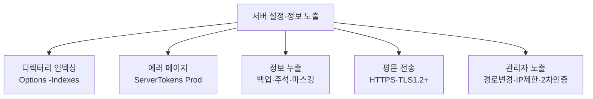

## 들어가며 — "코드"가 아니라 "설정"이 뚫는다

지금까지의 실습(01~12)이 **애플리케이션 코드의 결함**을 다뤘다면, 이 글은 **서버·설정·운영의 부주의**로 정보가 새는 부류를 모읍니다. 화려한 익스플로잇이 아니라 **기본 설정을 그대로 둔 것**이 원인이며, 그래서 정찰(Reconnaissance) 단계에서 가장 먼저 발견됩니다.

이 글에서 다루는 KISA 점검 항목 5가지입니다.

| 항목 | KISA 코드 | 한 줄 |
|---|---|---|
| 디렉터리 인덱싱 | DI | 초기 페이지가 없을 때 디렉터리 파일 목록이 노출 |
| 에러 페이지 적용 미흡 | EP | 기본 에러 페이지가 서버 버전·경로·스택을 노출 |
| 정보 누출 | IL | 개인정보 평문·주석·백업파일·샘플페이지 노출 |
| 데이터 평문 전송 | SN | 인증·개인정보가 암호화 없이 전송 |
| 관리자 페이지 노출 | AE | 추측 쉬운 URL/포트로 관리자 페이지 접근 |

> 이 항목들은 OWASP **A02:2025 Security Misconfiguration** 와 정보 노출 계열에 해당합니다. 공통 조치는 **불필요한 노출 제거 + 안전한 기본값**입니다.
{: .prompt-info }

---

## 실습 환경

| 구분 | 내용 |
|---|---|
| 공격자 | Kali Linux (192.168.0.10) — 브라우저, curl, gobuster, dirb, nikto, tcpdump, nmap |
| 대상 | Ubuntu + Apache/PHP (192.168.0.30) |

---

## OWASP Top 10 매핑

| 항목 | 내용 |
|---|---|
| OWASP 카테고리 | **A02:2025 – Security Misconfiguration** (정보 노출 포함) · 평문 전송은 **A04 Cryptographic Failures** |
| CWE | CWE-548(디렉터리 목록) · CWE-209(에러 메시지 정보 노출) · CWE-200(정보 노출) · CWE-319(평문 전송) · CWE-552(관리 기능 노출) |
| 영향 | 서버 구조·버전·소스·백업·개인정보 노출 → 후속 공격(취약 버전 익스플로잇, 계정 탈취)의 발판 |
| 한 줄 핵심 | 코드가 아니라 **설정·운영의 기본값/부주의**가 정보를 흘림 |

---

## 1. 디렉터리 인덱싱 (Directory Indexing)

### 1.1 원리

`index.html`·`default.asp` 같은 초기 페이지가 없는 디렉터리에 접근하면, 웹 서버가 **디렉터리 내 파일 목록을 자동으로 출력**합니다. 백업파일·로그·설정파일이 그대로 노출됩니다.

### 1.2 실습 환경 구성 (취약 상태 재현)

```bash
sudo mkdir -p /var/www/html/kisa
sudo tee /var/www/html/kisa/.placeholder >/dev/null <<'EOF'
EOF
# 노출용 더미 파일들
sudo bash -c 'echo "old admin page" > /var/www/html/kisa/old_login.asp.bak'
sudo bash -c 'echo "db backup" > /var/www/html/kisa/db_backup.sql'
# 해당 디렉터리에 인덱싱 허용(의도적 취약)
sudo tee /etc/apache2/conf-available/indexing-lab.conf >/dev/null <<'EOF'
<Directory "/var/www/html/kisa">
    Options +Indexes
</Directory>
EOF
sudo a2enconf indexing-lab && sudo systemctl restart apache2
```

### 1.3 점검 (KISA Step 1)

```bash
# 디렉터리 경로 직접 접근 → 파일 목록이 나오면 취약
curl -s http://192.168.0.30/kisa/
# 자동 탐지
nikto -h http://192.168.0.30        # "Directory indexing found" 보고
gobuster dir -u http://192.168.0.30 -w /usr/share/wordlists/dirb/common.txt
```

목록에 `db_backup.sql`, `old_login.asp.bak` 등이 보이면 취약입니다.

### 1.4 조치 (서버별)

| 서버 | 설정 |
|---|---|
| **Apache** | `Options -Indexes` (또는 `Options` 줄에서 `Indexes` 제거) 후 재기동 |
| **Nginx** | `location / { autoindex off; }` |
| **Tomcat** | `web.xml` → DefaultServlet `<param-name>listings</param-name><param-value>false</param-value>` |
| **IIS 7+** | IIS 관리자 → 디렉터리 검색 → **사용 안 함** |

---

## 2. 에러 페이지 적용 미흡

### 2.1 원리

존재하지 않는 페이지·잘못된 요청 시, **서버 기본 에러 페이지**가 출력되면서 **서버 종류·버전·OS·절대 경로·스택 트레이스**가 노출됩니다. 공격자는 이 정보로 정확한 익스플로잇을 고릅니다.

### 2.2 점검 (KISA Step 1)

```bash
# 응답 헤더의 Server 배너 + 404 본문 확인
curl -I http://192.168.0.30/없는경로
# → Server: Apache/2.4.52 (Ubuntu)
curl -s http://192.168.0.30/test_404_$RANDOM
# → "Apache/2.4.52 (Ubuntu) Server at 192.168.0.30 Port 80"
```

응답에 버전·경로·스택이 보이면 취약입니다.

### 2.3 조치 (Apache 예시)

```apache
# /etc/apache2/conf-available/security.conf
ServerTokens Prod          # "Server: Apache" 만 노출
ServerSignature Off        # 기본 에러 페이지의 서명 제거

# 사용자 정의 에러 페이지
ErrorDocument 404 /errors/404.html
ErrorDocument 500 /errors/500.html
```

```bash
sudo systemctl reload apache2
curl -I http://192.168.0.30/없는경로   # Server: Apache (버전 사라짐)
```

| 서버 | 버전 은닉 | 사용자 에러 페이지 |
|---|---|---|
| Apache | `ServerTokens Prod` / `ServerSignature Off` | `ErrorDocument` |
| Nginx | `server_tokens off;` | `error_page 404 /custom_404.html;` |
| Tomcat | `<Connector server=" " />` · `ErrorReportValve showServerInfo="false"` | `web.xml` `<error-page>` |

---

## 3. 정보 누출 (Information Leakage)

### 3.1 원리

세 갈래로 샙니다 — ① **중요 정보 평문 노출**(주민번호·카드번호), ② **불필요 파일 노출**(phpinfo·백업·샘플페이지), ③ **소스/주석 내 정보**(개발용 계정·디버그 메모).

### 3.2 실습 환경 구성

```bash
# (1) phpinfo 노출
echo "<?php phpinfo(); ?>" | sudo tee /var/www/html/info.php >/dev/null
# (2) 주석에 계정이 박힌 페이지
sudo tee /var/www/html/login_leak.html >/dev/null <<'EOF'
<!-- ### default id & password ###  id: admin  pw: admin -->
<form><input name="id"><input name="pw" type="password"></form>
EOF
# (3) 백업파일
sudo bash -c 'echo "<?php \$db=\"p@ssw0rd\"; ?>" > /var/www/html/config.php.bak'
```

### 3.3 점검 (KISA Step 1~3)

```bash
# Step 1) 중요 정보 평문 노출 — 페이지 응답에서 주민번호/카드번호/계좌 확인(육안)
# Step 2) 샘플/백업/초기 페이지
curl -s http://192.168.0.30/info.php | grep -i "PHP Version"
curl -s http://192.168.0.30/config.php.bak
nikto -h http://192.168.0.30        # phpinfo, 백업파일 자동 보고
# Step 3) HTML 소스/주석 내 정보
curl -s http://192.168.0.30/login_leak.html   # 주석에 admin/admin 노출
```

### 3.4 조치

1. `robots.txt`·메타태그로 검색엔진 인덱싱 차단, **불필요 파일(`.bak .old .sql .zip .log .tmp` 등) 제거**
2. 초기/샘플 페이지·배너 삭제(Banner Grab 차단)
3. 소스·주석의 디버그/계정/구조 정보 제거
4. **개인정보 마스킹** — 노출이 불가피하면 일부만 표시

| 항목 | 마스킹 예 |
|---|---|
| 성명 | 홍*동 |
| 주민등록번호 | 901231-1****** |
| 연락처 | 010-1234-**** |
| 카드번호 | 9430-82**-****-2393 |
| 계좌번호 | 430-20-1***** |

```bash
# 삭제 권고 확장자 일괄 점검(서버에서)
sudo find /var/www/html -regextype posix-extended \
  -regex '.*\.(bak|backup|old|org|zip|log|sql|new|tmp|temp)$'
```

---

## 4. 데이터 평문 전송

### 4.1 원리

로그인·개인정보 같은 중요 데이터가 **HTTP(평문)** 로 전송되면, 같은 네트워크의 공격자가 도청으로 그대로 읽습니다. ([06 세션](/posts/websec-06-session-security/)의 Firesheep 사례와 동일한 위협입니다.)

### 4.2 점검 (KISA Step 1~3)

```bash
# Step 1~2) 평문 전송 캡처 — Kali에서 도청 후 DVWA/대상에 로그인
sudo tcpdump -i eth0 -A 'tcp port 80' | grep -iE 'pass|pwd|id='
# → id=admin&password=... 처럼 자격증명이 평문으로 보이면 취약

# Step 3) 취약 프로토콜(SSLv2/3) 사용 여부 (HTTPS 운영 시)
nmap --script ssl-enum-ciphers -p 443 192.168.0.30
# → SSLv3 / TLSv1.0 / 약한 cipher 노출 시 취약 (예: CVE-2014-3566 POODLE)
```

> HTTPS 약점 점검(Step 3)을 실습하려면 대상에 self-signed 인증서로 TLS를 임시 구성해야 합니다. 평문 캡처(Step 1~2)는 현재 HTTP DVWA로 바로 가능합니다.
{: .prompt-tip }

### 4.3 조치

1. 중요 정보 전송 구간에 **TLS(HTTPS)** 적용, 전송 정보 최소화
2. 쿠키 등 클라이언트 노출 위치에서 비밀번호·인증값·개인정보 제거
3. **SSLv2·SSLv3 비활성화, TLS 1.2 이상**

```apache
# Apache (ssl.conf)
SSLProtocol all -SSLv2 -SSLv3 -TLSv1 -TLSv1.1
```

---

## 5. 관리자 페이지 노출

### 5.1 원리

관리자 페이지가 `/admin`, `/manager`, `:8080` 처럼 **추측 쉬운 URL/포트**에 있으면, 정찰만으로 발견되고 약한 계정으로 그대로 로그인됩니다.

### 5.2 실습 환경 구성

```bash
sudo mkdir -p /var/www/html/admin
sudo tee /var/www/html/admin/index.php >/dev/null <<'EOF'
<?php
if (($_POST['id']??'')==='admin' && ($_POST['pw']??'')==='admin') {
  echo "관리자 대시보드 진입";
} else { echo '<form method=post><input name=id><input name=pw type=password><button>로그인</button></form>'; }
?>
EOF
sudo systemctl reload apache2
```

### 5.3 점검 (KISA Step 1~2)

```bash
# Step 1) 추측 쉬운 경로/포트 탐색
gobuster dir -u http://192.168.0.30 \
  -w /usr/share/wordlists/dirb/common.txt | grep -iE 'admin|manage|console'
nmap -p- --open 192.168.0.30          # 비표준 관리 포트 탐색
# Step 2) 약한 관리자 계정 로그인 시도
curl -s -X POST http://192.168.0.30/admin/ -d "id=admin&pw=admin"
```

`/admin`이 발견되고 `admin/admin`으로 진입되면 취약입니다.

### 5.4 조치

1. 관리자 URL을 **유추 어려운 경로/포트**로 변경
2. **접근 IP 제한**(허용 IP만)

```apache
<Location "/admin">
    Require ip 192.168.0.0/24      # 지정 대역만 허용
</Location>
```

3. 외부 노출 불가피 시 **2차 인증(OTP/VPN/인증서)** 적용
4. 관리자 하위 페이지마다 **세션 검증**(URL 직접 접근 차단)

---

## 6. 정리



이 부류는 **정찰 단계에서 가장 먼저 잡히는** 취약점입니다. 모든 조치의 공통점은 **"기본값을 그대로 두지 말 것 + 불필요한 노출을 없앨 것"** 입니다.

---

## 7. 정보보안기사 시험 포인트

| 항목 | 꼭 외울 것 |
|---|---|
| **디렉터리 인덱싱** | Apache `Options -Indexes`, Nginx `autoindex off`, IIS 디렉터리 검색 해제 |
| **에러 페이지** | `ServerTokens Prod`·`ServerSignature Off` + 사용자 에러 페이지 |
| **정보 누출** | 백업 확장자 제거, 개인정보 **마스킹** 기준(주민번호 뒤 6자리 등) |
| **평문 전송** | **SSLv2/3 비활성화, TLS1.2+**, POODLE=SSLv3 |
| **관리자 노출** | 경로/포트 변경 + IP 제한 + 2차 인증 |

> **★ 함정**: "관리자 페이지 노출" 조치로 **계정 잠금**을 고르면 틀립니다. 핵심은 **경로 변경·접근 IP 제한·2차 인증**입니다. (인증 자체는 [05번 포스트](/posts/websec-05-authentication/) 참고)
{: .prompt-tip }

---

## 출처 및 참고 자료

- KISA, 「주요정보통신기반시설 기술적 취약점 분석·평가 방법 상세가이드」 — Web Application(웹) > 디렉터리 인덱싱·에러 페이지·정보 누출·데이터 평문 전송·관리자 페이지 노출
- 개인정보보호위원회, 「홈페이지 개인정보 노출방지 안내서」 (마스킹 기준)
- OWASP A02 Security Misconfiguration — <https://owasp.org/Top10/A05_2021-Security_Misconfiguration/>

> **⚠ 합법성**: 모든 실습은 본인 소유의 격리된 랩에서만 수행합니다.
{: .prompt-danger }
